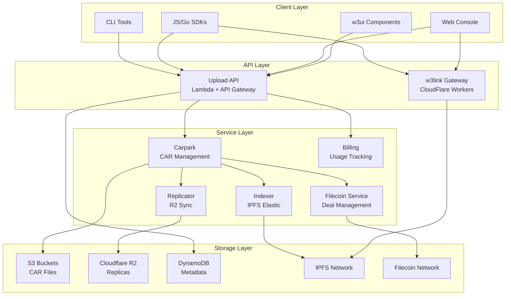
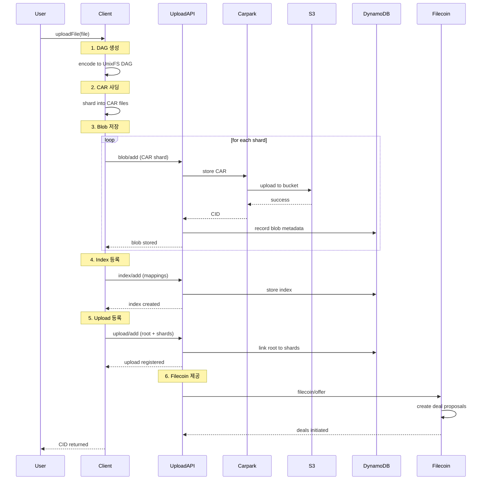
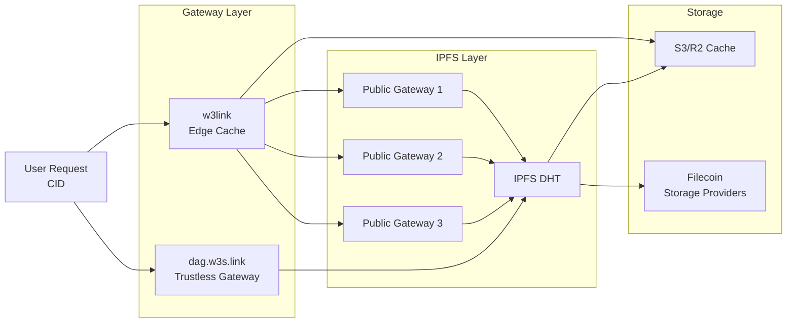

# Storacha 생태계 전체 개요

> **문서 버전**: 1.0
> **작성일**: 2025-11-14
> **상태**: 초안

## 목차
- [Storacha란 무엇인가?](#storacha란-무엇인가)
- [비전과 목표](#비전과-목표)
- [생태계에서의 위치](#생태계에서의-위치)
- [핵심 개념](#핵심-개념)
- [전체 아키텍처](#전체-아키텍처)
- [주요 컴포넌트](#주요-컴포넌트)
- [레포지토리 구조](#레포지토리-구조)
- [기술 스택](#기술-스택)
- [사용 사례](#사용-사례)

---

## Storacha란 무엇인가?

### 개요

**Storacha** (구 web3.storage)는 **분산형 핫 스토리지 네트워크(Decentralized Hot Storage Network)**로, 대규모 데이터를 위한 사용자 소유 저장소를 제공합니다.

Storacha는 **IPFS**와 **Filecoin**을 기반으로 하여:
- 콘텐츠 주소 지정 가능한(Content-Addressable) 데이터 저장
- 분산형 권한 관리 (UCAN 기반)
- 검증 가능하고 불변인(Immutable) 데이터 참조
- 사용자가 데이터를 소유하고 제어

### 핵심 특징

1. **사용자 제어 권한 (User-Controlled Authorization)**
   - UCAN (User Controlled Authorization Networks) 프로토콜 사용
   - 중앙 서버 없이 capability 기반 권한 위임
   - 세밀한 접근 제어 및 공유

2. **콘텐츠 주소 지정 (Content Addressing)**
   - CID (Content Identifier)로 데이터 식별
   - 동일한 콘텐츠는 항상 동일한 CID
   - 데이터 무결성 자동 검증

3. **분산 저장 (Distributed Storage)**
   - IPFS 네트워크를 통한 빠른 접근 (Hot Storage)
   - Filecoin 네트워크를 통한 영구 보존 (Cold Storage)
   - 여러 노드에 복제되어 가용성 보장

4. **확장 가능한 아키텍처 (Scalable Architecture)**
   - 서버리스 인프라 (AWS Lambda, CloudFlare Workers)
   - 전역 엣지 캐싱
   - 대용량 파일 처리 (CAR 샤딩)

---

## 비전과 목표

### 비전

> "모든 사람이 자신의 데이터를 소유하고, 영구적으로 접근 가능하며, 검증 가능한 방식으로 저장할 수 있는 세상"

Storacha는 Web3의 핵심 원칙인 **탈중앙화**, **사용자 소유권**, **투명성**을 데이터 저장소 영역에 구현합니다.

### 주요 목표

#### 1. 개발자 경험 개선
- 간단한 API로 복잡한 분산 저장소 추상화
- 다양한 언어와 프레임워크 지원 (JavaScript, Go, React, Vue 등)
- 기존 웹 개발 워크플로우와 통합 가능

#### 2. 데이터 영속성 보장
- IPFS를 통한 즉각적인 접근성 (Hot Storage)
- Filecoin을 통한 장기 보존 (최소 수년)
- 자동 복제 및 검증

#### 3. 확장성과 성능
- 파일 크기 제한 없음 (샤딩 통해 처리)
- 전 세계적으로 빠른 콘텐츠 전달 (CDN/Edge)
- 수평 확장 가능한 인프라

#### 4. 보안과 프라이버시
- 종단간 암호화 가능
- 사용자가 개인키 관리
- 권한 위임 및 취소 가능

#### 5. 웹3 생태계 통합
- NFT 메타데이터 표준 저장소
- DApp의 프론트엔드 호스팅
- DAO 및 커뮤니티 데이터 아카이빙

---

## 생태계에서의 위치

### Web3 스토리지 스택

```
┌─────────────────────────────────────────┐
│         애플리케이션 레이어              │
│  (NFT Marketplaces, DApps, Games, AI)   │
└─────────────────────────────────────────┘
                    ↓
┌─────────────────────────────────────────┐
│         Storacha (Hot Storage)          │
│  - 빠른 업로드/다운로드                  │
│  - UCAN 권한 관리                       │
│  - 개발자 친화적 API                     │
└─────────────────────────────────────────┘
                    ↓
┌──────────────────┬──────────────────────┐
│   IPFS Network   │  Filecoin Network    │
│  (Content CDN)   │  (Permanent Storage) │
└──────────────────┴──────────────────────┘
```

### 주요 역할

1. **Application Layer와 Protocol Layer 사이의 브릿지**
   - 개발자가 IPFS/Filecoin의 복잡성을 이해하지 않아도 사용 가능
   - 추상화된 API 제공
   - 모범 사례 내장 (샤딩, 복제, 검증 등)

2. **Hot Storage Layer**
   - IPFS를 통한 빠른 읽기/쓰기
   - 캐싱 및 CDN 통합
   - 실시간 애플리케이션 지원

3. **권한 관리 레이어**
   - UCAN 기반 분산 인증
   - Space 개념을 통한 데이터 격리
   - 팀 협업 및 공유 기능

4. **개발자 플랫폼**
   - SDK 및 라이브러리 제공
   - CLI 도구
   - 웹 콘솔 및 대시보드

---

## 핵심 개념

Storacha를 이해하기 위해 반드시 알아야 할 핵심 개념들입니다.

### 1. UCAN (User Controlled Authorization Networks)

#### 개념
UCAN은 **분산형 권한 시스템**으로, 사용자가 자신의 데이터와 권한을 완전히 제어할 수 있게 합니다.

#### 주요 특징
- **Capability-based**: 특정 작업을 수행할 수 있는 "능력(capability)"을 토큰으로 표현
- **Delegation**: 권한을 다른 사용자나 서비스에 위임 가능
- **Decentralized**: 중앙 권한 서버 없이 공개키 암호화만으로 동작
- **Revocable**: 위임한 권한을 취소 가능

#### 작동 방식
```
사용자 (did:key:user123)
    ↓ [delegation: blob/add, upload/add]
Agent (did:key:agent456)
    ↓ [invocation: blob/add with proof]
Storacha Service
    ↓ [verification: 서명 확인, delegation 체인 검증]
승인 또는 거부
```

#### 예시 시나리오
```javascript
// 사용자가 자신의 Space에 대한 upload 권한을 팀원에게 위임
const delegation = await client.createDelegation({
  audience: 'did:key:team-member-789',
  capabilities: [{
    can: 'upload/add',
    with: 'did:key:my-space-123'
  }],
  expiration: Date.now() + 30 * 24 * 60 * 60 * 1000 // 30일
})
```

**자세한 내용**: `01_UCAN_Protocol_Deep_Dive.md` 참조

---

### 2. Space (저장 공간)

#### 개념
**Space**는 Storacha에서 데이터를 그룹화하는 논리적 단위입니다. 파일 시스템의 "볼륨"이나 클라우드 스토리지의 "버킷"과 유사합니다.

#### 특징
- **DID 기반 식별**: 각 Space는 고유한 `did:key:...` 식별자를 가짐
- **독립적인 권한**: Space마다 별도의 권한 관리
- **다중 Space**: 한 사용자가 여러 Space 소유 가능
- **공유 가능**: 다른 사용자에게 Space 접근 권한 위임 가능

#### Space의 구조
```
Space: did:key:z6MkwHhAdxP...
├── 권한 (Capabilities)
│   ├── blob/add
│   ├── upload/add
│   ├── index/add
│   └── filecoin/offer
├── 업로드된 데이터
│   ├── Upload 1: CID bafybeiabc...
│   │   ├── Shard 1: bagbaiera...
│   │   └── Shard 2: bagbaiera...
│   └── Upload 2: CID bafybeixed...
└── 델리게이션 (Delegations)
    ├── Agent A: full access
    └── Agent B: read-only
```

#### 사용 예시
```javascript
// Space 생성
const space = await client.createSpace('my-project')

// 현재 Space 설정
await client.setCurrentSpace(space.did())

// Space에 파일 업로드
const cid = await client.uploadFile(file)
```

**자세한 내용**: `03_Space_and_Agent_Management.md` 참조

---

### 3. Agent (에이전트)

#### 개념
**Agent**는 사용자를 대신하여 Storacha 서비스와 상호작용하는 소프트웨어 컴포넌트입니다.

#### 역할
- **개인키 관리**: 로컬에서 개인키 생성 및 저장
- **요청 서명**: UCAN 토큰에 서명하여 인증
- **Space 관리**: Space 생성, 선택, 전환
- **Delegation 처리**: 권한 위임 및 증명 관리

#### Agent의 생명주기
```
1. 초기화
   ↓
2. 개인키 생성 (did:key:agent...)
   ↓
3. 이메일 인증 (선택적)
   ↓
4. Space 생성 또는 연결
   ↓
5. 작업 수행 (upload, list, etc.)
```

#### 저장 위치
- **브라우저**: IndexedDB
- **Node.js**: 파일 시스템 (`~/.storacha/`)
- **모바일**: 플랫폼별 안전한 저장소

#### 코드 예시
```javascript
// Agent 초기화
import { create } from '@storacha/client'

const client = await create()
console.log(client.agent().did()) // did:key:z6Mkw...

// 이메일로 계정 연결
await client.login('user@example.com')

// Space 목록 확인
const spaces = await client.spaces()
```

**자세한 내용**: `03_Space_and_Agent_Management.md` 참조

---

### 4. CAR (Content Addressable aRchive)

#### 개념
**CAR**는 IPLD DAG를 저장하고 전송하기 위한 바이너리 파일 형식입니다.

#### 특징
- **Self-contained**: 파일 자체에 모든 블록과 메타데이터 포함
- **Verifiable**: 각 블록의 CID로 무결성 검증 가능
- **Streamable**: 순차적으로 읽고 쓸 수 있음
- **Efficient**: 대용량 파일을 여러 CAR로 분할(샤딩) 가능

#### CAR 파일 구조
```
┌─────────────────────────────────────┐
│        CAR Header                   │
│  - version: 1                       │
│  - roots: [CID1, CID2, ...]         │
├─────────────────────────────────────┤
│        Block 1                      │
│  - CID: bafybeiabc...               │
│  - Data: [binary data]              │
├─────────────────────────────────────┤
│        Block 2                      │
│  - CID: bafybeixed...               │
│  - Data: [binary data]              │
├─────────────────────────────────────┤
│        ...                          │
└─────────────────────────────────────┘
```

#### 데이터 흐름
```
원본 파일 (10GB)
    ↓
UnixFS DAG 생성 (청크로 분할)
    ↓
CAR 인코딩
    ↓
샤딩 (여러 CAR 파일로 분할)
    ↓
CAR 1 (100MB) | CAR 2 (100MB) | ... | CAR N (100MB)
    ↓
각 CAR을 Blob으로 저장
```

#### 샤딩이 필요한 이유
1. **네트워크 효율성**: 큰 파일을 여러 청크로 나눠 병렬 업로드
2. **재시도 용이성**: 실패 시 전체가 아닌 일부만 재전송
3. **저장소 제한**: 일부 스토리지는 단일 파일 크기 제한이 있음
4. **메모리 효율성**: 전체 파일을 메모리에 로드하지 않고 스트리밍 처리

**자세한 내용**: `08_CAR_File_Processing.md` 참조

---

### 5. CID (Content Identifier)

#### 개념
**CID**는 콘텐츠의 암호학적 해시로, IPFS와 Storacha에서 데이터를 식별하는 핵심 메커니즘입니다.

#### 구조
```
CID = <multibase><version><multicodec><multihash>

예시: bafybeigdyrzt5sfp7udm7hu76uh7y26nf3efuylqabf3oclgtqy55fbzdi
      │       │ │      └─────────────────────────────────────┘
      │       │ │                    multihash (hash + digest)
      │       │ └─── multicodec (dag-pb, raw, etc.)
      │       └───── version (0 or 1)
      └─────────── multibase (b = base32)
```

#### 특징
- **Deterministic**: 동일한 콘텐츠는 항상 동일한 CID
- **Self-describing**: CID 자체에 해시 알고리즘, 인코딩 정보 포함
- **Collision-resistant**: SHA-256 등 강력한 해시 함수 사용
- **Immutable**: 콘텐츠가 변경되면 CID도 변경됨

#### CID 타입
```javascript
// CIDv0 (레거시, base58)
QmXoypizjW3WknFiJnKLwHCnL72vedxjQkDDP1mXWo6uco

// CIDv1 (최신, base32)
bafybeigdyrzt5sfp7udm7hu76uh7y26nf3efuylqabf3oclgtqy55fbzdi
```

#### 사용 예시
```javascript
// 파일 업로드 후 CID 받기
const cid = await client.uploadFile(file)
console.log(cid.toString())
// bafybeigdyrzt5sfp7udm7hu76uh7y26nf3efuylqabf3oclgtqy55fbzdi

// CID로 데이터 접근
const url = `https://w3s.link/ipfs/${cid}`
// https://w3s.link/ipfs/bafybeigdyrzt...
```

---

### 6. Upload vs Store

Storacha에서 "업로드"와 "저장"은 구분되는 개념입니다.

#### Store (Blob Storage)
- **정의**: 실제 CAR 파일(blob)을 저장하는 행위
- **Capability**: `blob/add` 또는 `space/blob/add`
- **특징**:
  - 개별 CAR 파일(샤드)을 저장
  - 각 blob은 고유한 CID를 가짐
  - 저장소 공간을 차지함

#### Upload (Metadata Registration)
- **정의**: 루트 CID와 샤드들의 매핑을 등록하는 행위
- **Capability**: `upload/add`
- **특징**:
  - 논리적 파일(루트 CID)과 물리적 저장소(샤드 CID들)를 연결
  - 저장소 공간을 거의 차지하지 않음 (메타데이터만)
  - 같은 blob을 여러 upload에서 재사용 가능 (중복 제거)

#### 관계도
```
Upload (논리적)                Store (물리적)
─────────────────              ───────────────
Root CID                       Shard 1 CID
bafybeiabc...     ──────────>  bagbaiera...
    │
    │             ──────────>  Shard 2 CID
    │                          bagbaierb...
    │
    └───────────> ──────────>  Shard 3 CID
                               bagbaierc...
```

#### 예시 시나리오
```javascript
// 1. 파일을 CAR로 인코딩 및 샤딩
const { cid, shards } = await encodeFile(file)
// cid: bafybeiabc... (root)
// shards: [bagbaiera..., bagbaierb..., bagbaierc...]

// 2. 각 샤드를 blob으로 저장 (Store)
for (const shard of shards) {
  await client.capability.invoke('blob/add', shard)
}

// 3. 업로드 등록 (Upload)
await client.capability.invoke('upload/add', {
  root: cid,
  shards: shards.map(s => s.cid)
})
```

#### 중복 제거 효과
```
사용자 A: 파일 X 업로드
  → Store: Shard 1, 2, 3
  → Upload: Root CID A → [Shard 1, 2, 3]

사용자 B: 동일한 파일 X 업로드
  → Store: (이미 존재, 스킵)
  → Upload: Root CID B → [Shard 1, 2, 3] (재사용)

결과: 저장소는 한 번만 사용, 두 업로드 모두 유효
```

---

---

## 전체 아키텍처

### High-Level Architecture

Storacha의 전체 아키텍처는 여러 레이어로 구성되어 있습니다:



### 데이터 흐름 아키텍처

사용자가 파일을 업로드할 때의 전체 흐름:



### 검색(Retrieval) 아키텍처

사용자가 CID로 데이터를 검색할 때:



**특징**:
- **w3link**: 여러 gateway에 병렬 요청, 가장 빠른 응답 사용
- **Edge Caching**: CloudFlare edge에서 인기 콘텐츠 캐싱
- **Fallback**: 하나의 gateway 실패 시 다른 gateway 시도
- **Rate Limiting**: 200 req/min per IP

---

## 주요 컴포넌트

Storacha 생태계의 핵심 컴포넌트들을 상세히 살펴봅니다.

### 1. Upload Service (코어 서비스)

**레포지토리**: `github.com/storacha/upload-service`

#### 패키지 구조
```
upload-service/
├── packages/
│   ├── client/              # @storacha/client
│   │   └── 고수준 API, Space 관리
│   ├── upload-client/       # @storacha/upload-client
│   │   └── 저수준 업로드 로직
│   ├── access/              # @storacha/access
│   │   └── 인증 및 권한 관리
│   ├── capabilities/        # Capability 정의
│   └── cli/                 # @storacha/cli
│       └── CLI 도구
└── 2,510+ commits, 36 contributors
```

#### 주요 기능
- 파일 업로드 및 다운로드
- Space 생성 및 관리
- UCAN delegation 처리
- CAR 파일 인코딩/샤딩

**상세 분석**: `04_Upload_Service_Implementation.md`

---

### 2. w3infra (인프라스트럭처)

**레포지토리**: `github.com/storacha/w3infra`

#### 스택 구조
```
w3infra/
├── stacks/
│   ├── BillingStack         # 사용량 추적 및 결제
│   ├── UploadApiStack       # Upload API 서비스
│   ├── CarparkStack         # CAR 파일 관리
│   ├── ReplicatorStack      # R2 복제
│   ├── FilecoinStack        # Filecoin 통합
│   ├── IndexerStack         # IPFS 인덱싱
│   └── ...
└── SST (Serverless Stack) 기반
```

#### 주요 서비스

**upload-api**
- AWS Lambda + API Gateway
- DynamoDB로 메타데이터 관리
- UCAN 인증 미들웨어
- REST API 엔드포인트 제공

**carpark**
- CAR 파일 버킷 관리
- S3 이벤트 처리
- 다운스트림 서비스 알림

**replicator**
- S3 → Cloudflare R2 복제
- 자동 동기화
- 지역별 가용성 향상

**filecoin**
- Filecoin 딜 제안 생성
- Storage Provider 통신
- 딜 상태 추적 및 검증

**indexer**
- Elastic IPFS 연동
- 콘텐츠 발견 및 라우팅
- DHT 통합

**상세 분석**: `05_Infrastructure_Components.md`, `21_W3infra_Code_Analysis.md`

---

### 3. w3link (IPFS Gateway)

**레포지토리**: `github.com/storacha/w3link`

#### 아키텍처
```
w3link/
└── packages/
    └── edge-gateway-link/   # CloudFlare Workers
        ├── worker.js        # 메인 워커 로직
        ├── cache.js         # Edge 캐싱
        └── gateway.js       # Gateway 통합
```

#### 핵심 기능

**Parallel Gateway Requests**
```javascript
// 의사 코드
async function fetchFromGateways(cid) {
  const gateways = [
    'https://ipfs.io',
    'https://dweb.link',
    'https://cloudflare-ipfs.com'
  ]

  // 모든 gateway에 동시 요청
  const promises = gateways.map(gw =>
    fetch(`${gw}/ipfs/${cid}`)
  )

  // 가장 빠른 응답 반환
  return Promise.race(promises)
}
```

**Edge Caching**
- CloudFlare CDN 활용
- 인기 콘텐츠 자동 캐싱
- TTL 기반 캐시 무효화
- 캐시 히트율 추적

**Rate Limiting**
- 200 requests/min per IP
- 초과 시 30초 블록
- DDoS 방어

**상세 분석**: `30_W3link_Gateway_Analysis.md`

---

### 4. w3ui (UI 컴포넌트)

**레포지토리**: `github.com/storacha/w3ui`

#### 패키지 구조
```
w3ui/
├── packages/
│   ├── react-uploader/      # React 업로드 컴포넌트
│   ├── react-keyring/       # React 키 관리
│   ├── solid-uploader/      # Solid 업로드 컴포넌트
│   ├── vue-uploader/        # Vue 업로드 컴포넌트
│   └── core/                # 공통 로직
└── examples/
    ├── react/               # React 예시 앱
    ├── solid/               # Solid 예시 앱
    └── vue/                 # Vue 예시 앱
```

#### Headless 디자인
```javascript
// UI 로직과 표현 분리
import { useUploader } from '@w3ui/react-uploader'

function MyUploader() {
  const [{ uploading }, { upload }] = useUploader()

  return (
    <div>
      {/* 커스텀 UI */}
      <input
        type="file"
        onChange={e => upload(e.target.files)}
      />
      {uploading && <progress />}
    </div>
  )
}
```

**상세 분석**: `31_W3ui_Components_Analysis.md`

---

### 5. Console (웹 대시보드)

**레포지토리**: `github.com/storacha/console` (archived)
**현재 위치**: `upload-service/packages/console`

#### 기술 스택
- Next.js 14+ (App Router)
- TypeScript
- Tailwind CSS
- Sentry (에러 추적)

#### 주요 기능
- 브라우저 기반 파일 업로드
- Space 생성 및 관리
- 업로드 히스토리 조회
- 사용량 대시보드
- 팀원 초대 및 권한 관리

**상세 분석**: `29_Console_Application_Analysis.md`

---

### 6. dag.w3s.link (Trustless Gateway)

**레포지토리**: `github.com/storacha/dag.w3s.link`

#### 특징
- **Trustless**: 클라이언트가 직접 검증 가능
- **Graph API**: DAG 구조 접근
- **CAR 응답**: 검증 가능한 형식으로 제공

#### 요청 예시
```bash
# Block 단위로 요청
GET /ipfs/bafybeiabc...?dag-scope=block

# Entity 전체 요청
GET /ipfs/bafybeiabc...?dag-scope=entity

# 전체 DAG 요청
GET /ipfs/bafybeiabc...?dag-scope=all

# 중복 블록 포함
GET /ipfs/bafybeiabc...?dups=y
```

**상세 분석**: `32_Trustless_Gateway_Analysis.md`

---

## 레포지토리 구조

### 코어 서비스 레포지토리

#### 1. upload-service (메인 서비스)
```
storacha/upload-service
├── 상태: 🟢 Active Development
├── 언어: JavaScript 79.5%, TypeScript 19.7%
├── 빌드: pnpm + Nx
├── 커밋: 2,510+
├── 기여자: 36
└── 용도: 클라이언트 SDK, 업로드 로직, CLI
```

#### 2. w3infra (인프라)
```
storacha/w3infra
├── 상태: 🟢 Active Deployment
├── 프레임워크: SST (Serverless Stack)
├── 클라우드: AWS (Lambda, DynamoDB, S3, R2)
├── 배포: seed.run (staging/production)
└── 용도: 서버사이드 서비스, Lambda 함수
```

#### 3. specs (프로토콜 스펙)
```
storacha/specs
├── 상태: 🟢 Active Documentation
├── 문서: 18+ specifications
├── 포맷: Markdown
└── 용도: w3 프로토콜 정의
    ├── w3-account (계정 관리)
    ├── w3-session (세션 인증)
    ├── w3-store (저장소)
    ├── w3-filecoin (Filecoin 통합)
    └── ... (15+ more)
```

#### 4. w3up (레거시)
```
storacha/w3up
├── 상태: 🔴 Deprecated (archived 목적)
├── 마이그레이션: upload-service로 이전 완료
├── 릴리즈: 484
└── 용도: @web3-storage/* 패키지 백포팅
```

### 애플리케이션 레포지토리

#### 5. console (웹 UI)
```
storacha/console
├── 상태: 🔴 Archived (2025-07-16)
├── 새 위치: upload-service/packages/console
├── 프레임워크: Next.js + TypeScript
└── 용도: 웹 대시보드
```

#### 6. w3ui (UI 컴포넌트)
```
storacha/w3ui
├── 상태: 🟢 Active
├── 디자인: Headless, Type-safe
├── 프레임워크: React, Solid, Vue
└── 용도: 재사용 가능한 UI 컴포넌트
```

#### 7. w3link (Gateway)
```
storacha/w3link
├── 상태: 🟢 Active
├── 플랫폼: CloudFlare Workers
├── 릴리즈: 21
└── 용도: IPFS 게이트웨이 (캐싱 레이어)
```

#### 8. dag.w3s.link (Trustless Gateway)
```
storacha/dag.w3s.link
├── 상태: 🟢 Active
├── 스펙: IPFS Trustless Gateway
└── 용도: Graph API, 검증 가능한 접근
```

### 레포지토리 간 관계

```
specs (프로토콜 정의)
  ↓ 구현
upload-service (클라이언트 SDK)
  ↓ 사용
w3infra (서버 인프라)
  ↓ 배포
AWS + CloudFlare (클라우드)

w3ui (UI 컴포넌트)
  ↓ 사용
upload-service (SDK)
  ↓ API 호출
w3infra (서비스)

console (웹 앱)
  ↓ 사용
w3ui (컴포넌트)
  ↓ 사용
upload-service (SDK)

w3link + dag.w3s.link (게이트웨이)
  ↓ 접근
IPFS Network
  ↓ 저장
Data from w3infra
```

---

## 기술 스택

Storacha 생태계를 구성하는 기술 스택을 레이어별로 살펴봅니다.

### Backend & Runtime

| 기술 | 용도 | 버전/상태 |
|------|------|-----------|
| **Node.js** | Runtime 환경 | v18+ |
| **TypeScript** | 타입 안전성 | ~20% of codebase |
| **JavaScript** | 주 개발 언어 | ~80% of codebase |
| **pnpm** | 패키지 관리 | Workspace 지원 |
| **Nx** | 빌드 오케스트레이션 | Monorepo 도구 |

### Web3 & Protocols

| 기술 | 용도 | 설명 |
|------|------|------|
| **UCAN** | 권한 관리 | User Controlled Authorization |
| **ucanto** | RPC 프레임워크 | UCAN 기반 RPC |
| **IPFS** | 분산 파일 시스템 | Content addressing |
| **IPLD** | 데이터 구조 | Linked data for Web3 |
| **Filecoin** | 영구 저장소 | Decentralized storage |
| **CAR** | 파일 형식 | Content Addressable aRchive |
| **multiformats** | 표준 | CID, multicodec, multihash |

### Infrastructure & Cloud

#### AWS Services
```
Lambda         → 서버리스 컴퓨팅
API Gateway    → HTTP API 엔드포인트
DynamoDB       → NoSQL 데이터베이스 (메타데이터)
S3             → 객체 저장소 (CAR 파일)
CloudWatch     → 모니터링 및 로깅
SQS            → 메시지 큐
EventBridge    → 이벤트 버스
```

#### CloudFlare Services
```
Workers        → Edge 컴퓨팅 (w3link)
R2             → 객체 저장소 (복제본)
CDN            → 콘텐츠 전송 네트워크
```

#### Deployment & DevOps
```
SST            → Serverless Stack Framework
seed.run       → 배포 관리 플랫폼
GitHub Actions → CI/CD 파이프라인
```

### Frontend & UI

| 기술 | 용도 | 컴포넌트 |
|------|------|----------|
| **Next.js** | React 프레임워크 | Console 앱 |
| **React** | UI 라이브러리 | w3ui 컴포넌트 |
| **Solid** | UI 라이브러리 | w3ui 컴포넌트 |
| **Vue** | UI 라이브러리 | w3ui 컴포넌트 |
| **Tailwind CSS** | 스타일링 | Console 디자인 |
| **PostCSS** | CSS 처리 | 빌드 도구 |

### Monitoring & Observability

| 도구 | 용도 |
|------|------|
| **Sentry** | 에러 추적 및 모니터링 |
| **CloudWatch** | 로그 및 메트릭 |
| **X-Ray** | 분산 추적 (선택적) |

### Testing & Quality

| 도구 | 용도 |
|------|------|
| **Vitest** | 유닛 테스팅 |
| **Playwright** | E2E 테스팅 |
| **ESLint** | 린팅 |
| **Prettier** | 코드 포맷팅 |
| **TypeScript** | 타입 체크 |

### Security & Crypto

| 라이브러리 | 용도 |
|-----------|------|
| **@noble/ed25519** | 키 생성 및 서명 |
| **@ucanto/** | UCAN 토큰 처리 |
| **multiformats** | CID 생성 및 검증 |

---

## 사용 사례

Storacha가 실제로 어떻게 활용되는지 구체적인 사례들을 살펴봅니다.

### 1. NFT 메타데이터 저장

#### 시나리오
NFT를 발행할 때 메타데이터(JSON, 이미지, 비디오)를 영구적이고 검증 가능한 방식으로 저장해야 합니다.

#### 구현 예시
```javascript
import { create } from '@storacha/client'

const client = await create()
await client.login('artist@example.com')

// NFT 이미지 업로드
const imageCID = await client.uploadFile(imageFile)

// 메타데이터 생성
const metadata = {
  name: "Awesome NFT #1",
  description: "A unique digital artwork",
  image: `ipfs://${imageCID}`,
  attributes: [
    { trait_type: "Background", value: "Blue" },
    { trait_type: "Rarity", value: "Legendary" }
  ]
}

// 메타데이터 업로드
const metadataCID = await client.uploadFile(
  new Blob([JSON.stringify(metadata)], {
    type: 'application/json'
  })
)

// 스마트 컨트랙트에 메타데이터 CID 저장
await nftContract.mint(recipientAddress, metadataCID)
```

#### 장점
- **영구성**: Filecoin에 자동으로 백업
- **불변성**: CID가 콘텐츠와 직접 연결
- **검증 가능**: 누구나 메타데이터 무결성 확인 가능
- **표준 호환**: OpenSea, Rarible 등 주요 마켓플레이스 지원

**실제 사례**: Courtyard (Pokémon 카드 토큰화)

---

### 2. 분산 웹사이트 호스팅

#### 시나리오
탈중앙화 앱(DApp)의 프론트엔드를 검열 저항성 있게 배포합니다.

#### 구현 예시
```bash
# 빌드
npm run build

# Storacha에 배포
storacha up dist/
# → CID: bafybeiabc123...

# IPNS 또는 DNSLink로 도메인 연결
# mydapp.eth → ipfs://bafybeiabc123...
```

#### 워크플로우
```
1. 로컬 개발 (npm run dev)
2. 프로덕션 빌드 (npm run build)
3. Storacha 업로드 (storacha up dist/)
4. CID를 ENS/DNSLink에 연결
5. w3s.link 또는 다른 gateway로 접근
   https://bafybeiabc123.ipfs.w3s.link
```

#### GitHub Actions 통합
```yaml
name: Deploy to Storacha
on:
  push:
    branches: [main]

jobs:
  deploy:
    runs-on: ubuntu-latest
    steps:
      - uses: actions/checkout@v3
      - uses: actions/setup-node@v3
      - run: npm ci
      - run: npm run build
      - uses: storacha/add-to-web3@v2
        with:
          path_to_add: 'dist'
          secret_key: ${{ secrets.STORACHA_KEY }}
```

**실제 사례**: 수많은 DApp 프론트엔드가 Storacha/web3.storage 사용

---

### 3. 게임 에셋 및 데이터

#### 시나리오
게임 스튜디오가 게임 바이너리, 에셋, 사용자 생성 콘텐츠를 분산 저장합니다.

#### 구현 예시
```javascript
// Unreal Engine 플러그인 사용 (의사 코드)
class MyGameMode {
  async UploadPlayerData(playerId, data) {
    const cid = await StorachaPlugin.Upload(data)

    // 블록체인에 참조 저장
    await BlockchainContract.SavePlayerData(playerId, cid)

    return cid
  }

  async LoadPlayerData(playerId) {
    const cid = await BlockchainContract.GetPlayerData(playerId)

    // IPFS에서 데이터 로드
    const data = await StorachaPlugin.Fetch(cid)

    return data
  }
}
```

#### 활용
- **Progressive Install**: 게임을 플레이하면서 필요한 에셋만 다운로드
- **User-Owned Assets**: 플레이어가 실제로 에셋 소유 (NFT)
- **Cross-Game Items**: 다른 게임에서도 에셋 사용 가능
- **Version Control**: 게임 업데이트를 CID로 추적

**실제 사례**: Unreal Engine Storacha 플러그인

---

### 4. AI 모델 및 데이터셋

#### 시나리오
AI 에이전트가 학습 데이터, 모델 가중치, 실행 히스토리를 영구 저장합니다.

#### 구현 예시
```javascript
// elizaOS 통합 (의사 코드)
class AIAgent {
  async saveMemory(memory) {
    // 메모리를 Storacha에 저장
    const cid = await storacha.uploadFile(
      JSON.stringify(memory)
    )

    // 블록체인에 메모리 포인터 저장
    await this.recordMemory(cid)

    return cid
  }

  async loadMemory(cid) {
    // CID로 메모리 로드
    const response = await fetch(
      `https://w3s.link/ipfs/${cid}`
    )
    return await response.json()
  }
}
```

#### 활용
- **Persistent Memory**: AI 에이전트가 세션 간 기억 유지
- **Verifiable History**: 모든 결정과 학습 과정 추적 가능
- **Reproducible ML**: 정확한 데이터셋과 모델 버전으로 재현
- **Decentralized Training**: 여러 노드가 분산 학습 데이터 공유

**실제 사례**: elizaOS (AI 에이전트 persistent memory)

---

### 5. Supply Chain 추적

#### 시나리오
럭셔리 브랜드가 제품의 진품 여부와 이동 경로를 추적합니다.

#### 구현 예시
```javascript
// 제품 등록
const product = {
  id: "LV-BAG-2025-0001",
  brand: "Louis Vuitton",
  model: "Neverfull MM",
  manufactured: "2025-01-15",
  location: "France",
  materials: ["Leather", "Canvas"],
  certifications: ["ISO-9001", "Fair-Trade"]
}

// Storacha에 저장
const cid = await client.uploadFile(
  new Blob([JSON.stringify(product)])
)

// NFT로 발행
await nftContract.mint({
  tokenId: product.id,
  metadataURI: `ipfs://${cid}`
})

// 소유권 이전 시 새 메타데이터 추가
const updatedProduct = {
  ...product,
  transfers: [
    {
      from: "Manufacturer",
      to: "Retail Store Paris",
      date: "2025-02-01",
      verified: true
    },
    {
      from: "Retail Store Paris",
      to: "Customer",
      date: "2025-02-15",
      verified: true
    }
  ]
}
```

#### 장점
- **위조 방지**: 블록체인 + IPFS로 진품 증명
- **투명성**: 전체 공급망 이력 공개
- **프라이버시**: 민감 정보는 암호화하여 저장
- **지속 가능성**: 환경 인증서 등 첨부 가능

**실제 사례**: Louis Vuitton, Gucci 등 럭셔리 브랜드

---

### 6. 데이터 아카이빙

#### 시나리오
연구 기관, 도서관, 정부 기관이 중요 데이터를 장기 보존합니다.

#### 구현 예시
```javascript
// 대용량 아카이브 업로드
const archiveDirectory = [
  { path: 'documents/2024/', files: [...] },
  { path: 'images/historical/', files: [...] },
  { path: 'videos/interviews/', files: [...] }
]

// 디렉토리 업로드
const directoryCID = await client.uploadDirectory(
  archiveDirectory
)

// 메타데이터와 함께 등록
const archiveRecord = {
  title: "Historical Archive 2024",
  curator: "National Library",
  date: "2025-01-01",
  root: directoryCID,
  size: "500GB",
  fileCount: 10000,
  description: "Digital preservation of historical documents"
}

await catalogContract.register(archiveRecord)
```

#### 특징
- **장기 보존**: Filecoin으로 최소 수년 보관
- **무결성 보장**: CID로 데이터 변조 불가능
- **접근성**: 전 세계 누구나 IPFS를 통해 접근 가능
- **비용 효율**: 중앙화 스토리지 대비 저렴

---

### 7. CI/CD 통합

#### 시나리오
빌드 아티팩트, 테스트 리포트, 배포 패키지를 저장합니다.

#### GitHub Actions 예시
```yaml
name: Build and Archive

on: [push, pull_request]

jobs:
  build:
    runs-on: ubuntu-latest
    steps:
      - uses: actions/checkout@v3

      - name: Build
        run: npm run build

      - name: Upload to Storacha
        uses: storacha/add-to-web3@v2
        id: upload
        with:
          path_to_add: 'dist'
          secret_key: ${{ secrets.STORACHA_KEY }}

      - name: Comment CID
        uses: actions/github-script@v6
        with:
          script: |
            github.rest.issues.createComment({
              issue_number: context.issue.number,
              owner: context.repo.owner,
              repo: context.repo.repo,
              body: `Build uploaded to IPFS: ${steps.upload.outputs.cid}`
            })
```

---

## 시작하기

Storacha를 처음 사용하는 개발자를 위한 빠른 시작 가이드입니다.

### 1. 설치

#### JavaScript/TypeScript
```bash
npm install @storacha/client
```

#### CLI
```bash
npm install -g @storacha/cli
```

#### Go
```bash
go get github.com/storacha/go-w3up
```

### 2. 인증

#### CLI
```bash
# 로그인 (이메일로 인증)
storacha login user@example.com

# 이메일에서 받은 링크 클릭하여 인증 완료
```

#### JavaScript
```javascript
import { create } from '@storacha/client'

const client = await create()

// 이메일로 로그인
await client.login('user@example.com')
// 이메일 확인 후 계속 진행
```

### 3. Space 생성

#### CLI
```bash
# Space 생성
storacha space create my-first-space

# Space 목록 확인
storacha space ls
```

#### JavaScript
```javascript
// Space 생성
const space = await client.createSpace('my-first-space')

// 현재 Space로 설정
await client.setCurrentSpace(space.did())
```

### 4. 파일 업로드

#### CLI
```bash
# 단일 파일
storacha up photo.jpg

# 디렉토리
storacha up ./website/

# 결과
# → CID: bafybeiabc123...
# → URL: https://bafybeiabc123.ipfs.w3s.link
```

#### JavaScript
```javascript
// 단일 파일
const file = new File(['Hello World'], 'hello.txt')
const cid = await client.uploadFile(file)
console.log(`Uploaded: ${cid}`)

// 여러 파일
const files = [
  new File(['content 1'], 'file1.txt'),
  new File(['content 2'], 'file2.txt')
]
const dirCID = await client.uploadDirectory(files)
```

### 5. 파일 접근

업로드된 파일은 다음 URL로 접근할 수 있습니다:

```
# w3s.link gateway
https://w3s.link/ipfs/{CID}

# Subdomain style
https://{CID}.ipfs.w3s.link

# 다른 IPFS gateway
https://ipfs.io/ipfs/{CID}
https://dweb.link/ipfs/{CID}
```

### 6. 권한 위임

다른 사용자나 서비스에 Space 접근 권한을 위임:

```javascript
// 팀원에게 업로드 권한 위임
const delegation = await client.createDelegation({
  audience: 'did:key:team-member-did',
  capabilities: [{
    can: 'space/blob/add',
    with: space.did()
  }, {
    can: 'upload/add',
    with: space.did()
  }],
  expiration: Math.floor(Date.now() / 1000) + (60 * 60 * 24 * 30) // 30일
})

// Delegation을 팀원에게 전달 (email, QR code, 등)
const proof = await delegation.archive()
```

---

## 요약

### Storacha의 핵심 가치

1. **사용자 소유권**: UCAN으로 데이터와 권한을 사용자가 완전히 제어
2. **영구성**: IPFS (hot) + Filecoin (cold)으로 장기 보존
3. **검증 가능성**: CID로 데이터 무결성 자동 검증
4. **개발자 친화적**: 간단한 API, 다양한 SDK, 풍부한 문서
5. **확장성**: 서버리스 아키텍처로 무한 확장 가능

### 다음 단계

이 개요 문서를 읽으셨다면, 다음 문서들을 참조하여 더 깊이 있는 내용을 학습할 수 있습니다:

- **01_UCAN_Protocol_Deep_Dive.md**: UCAN 프로토콜 상세 분석
- **02_Data_Flow_Architecture.md**: 데이터 처리 파이프라인
- **03_Space_and_Agent_Management.md**: Space와 Agent 관리
- **04_Upload_Service_Implementation.md**: 클라이언트 SDK 구현
- **06_Client_Libraries_API.md**: API 레퍼런스

### 참고 자료

- **공식 문서**: https://docs.storacha.network
- **GitHub**: https://github.com/storacha
- **Discord**: Storacha 커뮤니티
- **스펙**: https://github.com/storacha/specs

---

**문서 끝**

> 이 문서는 Storacha 생태계의 전체 개요를 제공합니다. 각 주제에 대한 상세한 내용은 해당 문서를 참조하세요.
