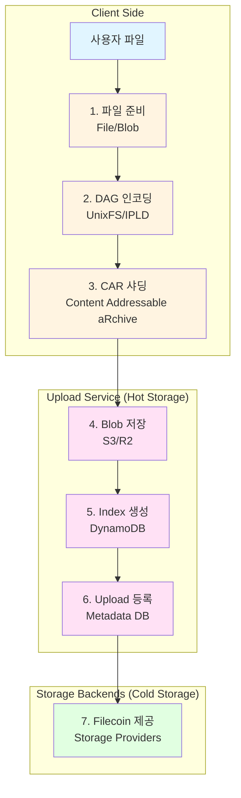
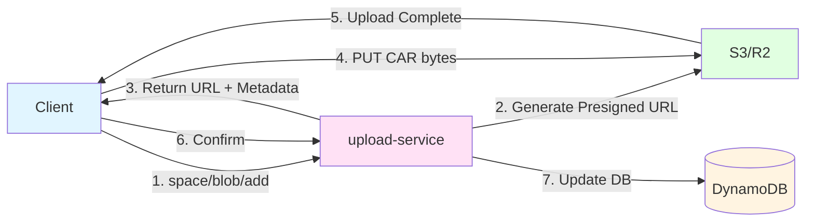
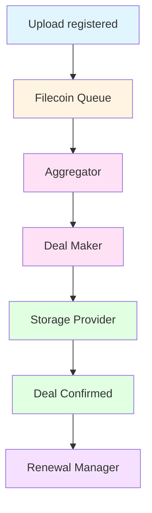

# Storacha 데이터 흐름 아키텍처 (Data Flow Architecture)

> **작성일:** 2025-01-14
> **문서 버전:** 1.0
> **대상 독자:** Storacha 개발자, 시스템 아키텍트
> **선행 문서:** 00_Storacha_Ecosystem_Overview.md, 01_UCAN_Protocol_Deep_Dive.md

---

## 목차

1. [데이터 흐름 개요](#1-데이터-흐름-개요)
2. [1단계: 파일 입력 및 준비](#2-1단계-파일-입력-및-준비)
3. [2단계: DAG 인코딩 (IPLD/UnixFS)](#3-2단계-dag-인코딩-ipldunixfs)
4. [3단계: CAR 샤딩](#4-3단계-car-샤딩)
5. [4단계: Blob 저장](#5-4단계-blob-저장)
6. [5단계: Index 생성](#6-5단계-index-생성)
7. [6단계: Upload 등록](#7-6단계-upload-등록)
8. [7단계: Filecoin 제공](#8-7단계-filecoin-제공)
9. [에러 처리 및 재시도 로직](#9-에러-처리-및-재시도-로직)
10. [성능 최적화 전략](#10-성능-최적화-전략)

---

## 1. 데이터 흐름 개요

Storacha에서 파일을 업로드하고 Filecoin에 저장하기까지의 과정은 **7단계의 파이프라인**으로 구성됩니다.

### 1.1 전체 흐름 다이어그램



### 1.2 각 단계 요약

| 단계 | 이름 | 입력 | 출력 | 책임 컴포넌트 | 위치 |
|-----|------|-----|------|-------------|-----|
| 1 | 파일 준비 | 사용자 파일 | `File`/`Blob` 객체 | `@storacha/client` | Client |
| 2 | DAG 인코딩 | `File[]` | UnixFS DAG (Block[]) | `ipfs-unixfs` | Client |
| 3 | CAR 샤딩 | DAG Blocks | CAR files (Uint8Array[]) | `@ipld/car` | Client |
| 4 | Blob 저장 | CAR bytes | Blob CID + Presigned URL | `upload-service/blob` | Server |
| 5 | Index 생성 | Root CID | Index records | `upload-service/index` | Server |
| 6 | Upload 등록 | Root + Shards | Upload record | `upload-service/upload` | Server |
| 7 | Filecoin 제공 | Upload CID | Deal ID | `w3infra/filecoin` | Backend |

### 1.3 데이터 변환 흐름

```
Original File (예: video.mp4, 1.5GB)
    ↓
[1단계] File 객체 (Blob + name)
    ↓
[2단계] UnixFS DAG
    ├─ Root Node (directory)
    ├─ File Node (video.mp4)
    │   ├─ Chunk 0 (256KB)
    │   ├─ Chunk 1 (256KB)
    │   └─ ... (5,859 chunks)
    └─ Links (CIDs)
    ↓
[3단계] CAR Shards
    ├─ Shard 0 (100MB) → bafybeid...
    ├─ Shard 1 (100MB) → bafybeia...
    ├─ ...
    └─ Shard 14 (50MB) → bafybeiz...
    ↓
[4단계] Blobs in S3
    ├─ s3://bucket/space-did/bafybeid...
    ├─ s3://bucket/space-did/bafybeia...
    └─ ...
    ↓
[5단계] Index Records
    ├─ Root: bafy4k... → [bafybeid..., bafybeia..., ...]
    └─ Slices: [offset, length] 매핑
    ↓
[6단계] Upload Record
    {
      root: bafy4k...,
      shards: [bafybeid..., bafybeia..., ...],
      space: did:key:z6Mk...,
      insertedAt: 2025-01-14T...
    }
    ↓
[7단계] Filecoin Deal
    Deal ID: 12345678
    Provider: f0123456
    Start Epoch: 3500000
```

---

## 2. 1단계: 파일 입력 및 준비

### 2.1 단계 개요

사용자가 업로드할 파일을 준비하는 단계입니다. 브라우저의 `File` API 또는 Node.js의 파일 시스템을 통해 파일을 읽어옵니다.

### 2.2 브라우저 환경

```typescript
import { create } from '@storacha/client'

// 1. Client 초기화
const client = await create()

// 2. 방법 1: File input element
const fileInput = document.querySelector('input[type="file"]') as HTMLInputElement
const files = Array.from(fileInput.files || [])

// 3. 방법 2: Drag & Drop
dropZone.addEventListener('drop', async (e) => {
  e.preventDefault()
  const files = Array.from(e.dataTransfer?.files || [])

  // 업로드
  const cid = await client.uploadDirectory(files)
  console.log('Uploaded:', cid)
})

// 4. 방법 3: 프로그래매틱 생성
const blob = new Blob(['Hello, Storacha!'], { type: 'text/plain' })
const file = new File([blob], 'greeting.txt', { type: 'text/plain' })

// 단일 파일 업로드
const cid = await client.uploadFile(file)
```

#### File 객체 구조:

```typescript
interface File extends Blob {
  name: string          // 파일명 (경로 포함 가능)
  lastModified: number  // 마지막 수정 시간
  size: number          // 바이트 크기
  type: string          // MIME type

  // Methods
  arrayBuffer(): Promise<ArrayBuffer>
  text(): Promise<string>
  stream(): ReadableStream<Uint8Array>
}
```

### 2.3 Node.js 환경

```typescript
import { create } from '@storacha/client'
import { filesFromPaths } from 'files-from-path'
import fs from 'fs'

// 1. 디렉토리에서 파일 읽기
const files = await filesFromPaths(['./dist', './assets/logo.png'])
const cid = await client.uploadDirectory(files)

// 2. 버퍼에서 파일 생성
const buffer = fs.readFileSync('./document.pdf')
const file = new File([buffer], 'document.pdf', {
  type: 'application/pdf'
})
const cid = await client.uploadFile(file)

// 3. 스트림 처리 (대용량 파일)
import { Readable } from 'stream'

const stream = fs.createReadStream('./large-video.mp4')
const chunks: Uint8Array[] = []

for await (const chunk of stream) {
  chunks.push(chunk)
}

const blob = new Blob(chunks, { type: 'video/mp4' })
const file = new File([blob], 'large-video.mp4')
```

### 2.4 경로 구조 및 디렉토리 생성

Storacha는 파일명에 `/`를 사용하여 **디렉토리 구조**를 생성합니다:

```typescript
const files = [
  new File([...], 'index.html'),
  new File([...], 'css/style.css'),
  new File([...], 'css/reset.css'),
  new File([...], 'js/app.js'),
  new File([...], 'images/logo.png'),
  new File([...], 'images/icons/favicon.ico')
]

const cid = await client.uploadDirectory(files)

// 결과 UnixFS 구조:
// root (directory)
// ├── index.html
// ├── css/
// │   ├── style.css
// │   └── reset.css
// ├── js/
// │   └── app.js
// └── images/
//     ├── logo.png
//     └── icons/
//         └── favicon.ico
```

#### filesFromPaths 사용:

```typescript
import { filesFromPaths } from 'files-from-path'

// 재귀적으로 모든 파일 읽기
const files = await filesFromPaths(['./dist'], {
  // 숨김 파일 포함
  hidden: true,
  // 심볼릭 링크 따라가기
  followSymlinks: true
})

// 각 File 객체는 상대 경로를 name으로 가짐
files.forEach(file => {
  console.log(file.name)  // 예: "dist/index.html"
})
```

### 2.5 파일 검증

업로드 전 파일을 검증하여 에러를 방지합니다:

```typescript
/**
 * 파일 검증 유틸리티
 */
class FileValidator {
  // 1. 크기 제한 (100MB)
  static MAX_FILE_SIZE = 100 * 1024 * 1024

  // 2. 허용된 MIME types
  static ALLOWED_TYPES = new Set([
    'image/jpeg',
    'image/png',
    'image/gif',
    'image/webp',
    'video/mp4',
    'video/webm',
    'application/pdf',
    'text/plain',
    'text/html',
    'text/css',
    'text/javascript',
    'application/json'
  ])

  static validate(file: File): ValidationResult {
    const errors: string[] = []

    // 크기 확인
    if (file.size > this.MAX_FILE_SIZE) {
      errors.push(`File "${file.name}" exceeds ${this.MAX_FILE_SIZE} bytes`)
    }

    // 타입 확인
    if (!this.ALLOWED_TYPES.has(file.type)) {
      errors.push(`File type "${file.type}" is not allowed`)
    }

    // 파일명 확인 (위험한 문자)
    if (/[<>:"|?*\x00-\x1F]/.test(file.name)) {
      errors.push(`File name "${file.name}" contains invalid characters`)
    }

    return {
      valid: errors.length === 0,
      errors
    }
  }

  static async validateAll(files: File[]): Promise<File[]> {
    const validFiles: File[] = []

    for (const file of files) {
      const result = this.validate(file)

      if (result.valid) {
        validFiles.push(file)
      } else {
        console.warn(`Skipping file "${file.name}":`, result.errors)
      }
    }

    return validFiles
  }
}

// 사용 예시
const rawFiles = Array.from(fileInput.files || [])
const validFiles = await FileValidator.validateAll(rawFiles)

if (validFiles.length === 0) {
  alert('No valid files to upload')
  return
}

const cid = await client.uploadDirectory(validFiles)
```

### 2.6 진행 상황 추적

업로드 진행률을 사용자에게 표시:

```typescript
/**
 * 진행률 추적 래퍼
 */
class UploadProgress {
  private totalBytes = 0
  private uploadedBytes = 0
  private callbacks: ((progress: number) => void)[] = []

  constructor(files: File[]) {
    this.totalBytes = files.reduce((sum, f) => sum + f.size, 0)
  }

  onProgress(callback: (progress: number) => void) {
    this.callbacks.push(callback)
  }

  update(bytes: number) {
    this.uploadedBytes += bytes
    const progress = Math.min(100, (this.uploadedBytes / this.totalBytes) * 100)

    for (const callback of this.callbacks) {
      callback(progress)
    }
  }

  get percentage(): number {
    return (this.uploadedBytes / this.totalBytes) * 100
  }
}

// 사용 예시
const files = Array.from(fileInput.files || [])
const progress = new UploadProgress(files)

progress.onProgress((pct) => {
  progressBar.style.width = `${pct}%`
  progressLabel.textContent = `${pct.toFixed(1)}%`
})

// uploadDirectory with progress
const cid = await client.uploadDirectory(files, {
  onShardStored: (meta) => {
    progress.update(meta.size)
    console.log(`Stored shard: ${meta.cid}`)
  }
})
```

---

## 3. 2단계: DAG 인코딩 (IPLD/UnixFS)

### 3.1 단계 개요

파일을 **IPLD (InterPlanetary Linked Data)** 형식의 **DAG (Directed Acyclic Graph)**로 변환합니다. Storacha는 **UnixFS**를 사용하여 파일 시스템 구조를 표현합니다.

### 3.2 UnixFS 구조

UnixFS는 IPFS에서 파일과 디렉토리를 표현하는 형식입니다:

```
UnixFS
├─ File (파일)
│  ├─ Data: raw bytes
│  ├─ Links: [] (리프 노드)
│  └─ Metadata: { type: 'file', size: ... }
│
├─ Directory (디렉토리)
│  ├─ Data: (empty or tsize)
│  ├─ Links: [child1, child2, ...]
│  └─ Metadata: { type: 'directory' }
│
└─ HAMTShard (대용량 디렉토리)
   ├─ Data: HAMT bucket
   ├─ Links: [bucket0, bucket1, ...]
   └─ Metadata: { type: 'hamt-sharded-directory' }
```

### 3.3 DAG-PB (Protocol Buffers)

UnixFS는 **DAG-PB** 인코딩을 사용합니다:

```protobuf
// dag-pb/dag.proto
message PBLink {
  optional bytes Hash = 1;      // CID (multihash)
  optional string Name = 2;     // 파일/디렉토리 이름
  optional uint64 Tsize = 3;    // 하위 트리의 총 크기
}

message PBNode {
  repeated PBLink Links = 2;    // 하위 노드 링크들
  optional bytes Data = 1;      // UnixFS 메타데이터
}
```

**UnixFS Data 필드:**

```protobuf
// unixfs/unixfs.proto
message Data {
  enum DataType {
    Raw = 0;
    Directory = 1;
    File = 2;
    Metadata = 3;
    Symlink = 4;
    HAMTShard = 5;
  }

  required DataType Type = 1;
  optional bytes Data = 2;           // Raw 데이터 (리프 노드만)
  optional uint64 filesize = 3;      // 전체 파일 크기
  repeated uint64 blocksizes = 4;    // 각 블록 크기
  optional uint64 hashType = 5;
  optional uint64 fanout = 6;        // HAMT fanout
}
```

### 3.4 파일 청킹 (Chunking)

대용량 파일은 여러 **Chunk**로 분할됩니다:

```typescript
/**
 * 파일 청킹 전략
 */
interface ChunkingStrategy {
  // 기본: Fixed Size Chunking
  fixedSize: {
    chunkSize: 262144  // 256KB (default)
  }

  // Rabin Fingerprinting (컨텐츠 기반)
  rabin: {
    avgChunkSize: 262144,
    minChunkSize: 131072,   // 128KB
    maxChunkSize: 524288    // 512KB
  }
}

/**
 * @storacha/client 내부 청킹 로직 (간소화)
 */
async function chunkFile(file: File, chunkSize = 262144): Promise<Block[]> {
  const blocks: Block[] = []
  const reader = file.stream().getReader()

  let offset = 0
  while (true) {
    const { done, value } = await reader.read()
    if (done) break

    // 청크 생성
    const chunk = value.slice(0, chunkSize)

    // Block 생성 (CID 포함)
    const block = await createBlock({
      codec: raw,          // raw codec (0x55)
      hasher: sha256,      // SHA-256 해시
      bytes: chunk
    })

    blocks.push(block)
    offset += chunk.length
  }

  return blocks
}
```

### 3.5 UnixFS DAG 생성 과정

#### 단일 파일 예시:

```typescript
import { importer } from 'ipfs-unixfs-importer'
import { MemoryBlockstore } from 'blockstore-core'

/**
 * 파일을 UnixFS DAG로 변환
 */
async function fileToDAG(file: File): Promise<{ root: CID, blocks: Block[] }> {
  const blockstore = new MemoryBlockstore()

  // 1. UnixFS importer 실행
  const entries = []
  for await (const entry of importer(
    [{ path: file.name, content: file.stream() }],
    blockstore,
    {
      cidVersion: 1,              // CIDv1 사용
      rawLeaves: true,            // 리프는 raw codec
      maxChunkSize: 262144,       // 256KB 청크
      wrapWithDirectory: false    // 단일 파일은 래핑 안함
    }
  )) {
    entries.push(entry)
  }

  // 2. Root CID 추출
  const root = entries[entries.length - 1].cid

  // 3. 모든 블록 수집
  const blocks: Block[] = []
  for await (const [cid, block] of blockstore.getAll()) {
    blocks.push({ cid, bytes: block })
  }

  return { root, blocks }
}
```

**생성된 DAG 구조 (작은 파일, 1MB):**

```
Root Node (File, dag-pb)
├─ Data: UnixFS { type: File, size: 1048576 }
└─ Links: [
    ├─ Chunk 0 (raw, 262144 bytes) → bafybeiabc...
    ├─ Chunk 1 (raw, 262144 bytes) → bafybeidef...
    ├─ Chunk 2 (raw, 262144 bytes) → bafybeighi...
    └─ Chunk 3 (raw, 262144 bytes) → bafybeijkl...
   ]
```

#### 디렉토리 예시:

```typescript
/**
 * 여러 파일을 디렉토리 DAG로 변환
 */
async function filesToDirectoryDAG(files: File[]): Promise<{ root: CID, blocks: Block[] }> {
  const blockstore = new MemoryBlockstore()

  // 1. 파일들을 { path, content } 형식으로 변환
  const entries = files.map(file => ({
    path: file.name,
    content: file.stream()
  }))

  // 2. UnixFS importer 실행
  const imported = []
  for await (const entry of importer(entries, blockstore, {
    cidVersion: 1,
    rawLeaves: true,
    wrapWithDirectory: true  // 디렉토리로 감싸기
  })) {
    imported.push(entry)
  }

  // 3. Root는 디렉토리
  const root = imported[imported.length - 1].cid

  // 4. 모든 블록 수집
  const blocks: Block[] = []
  for await (const [cid, bytes] of blockstore.getAll()) {
    blocks.push({ cid, bytes })
  }

  return { root, blocks }
}
```

**생성된 DAG 구조 (디렉토리):**

```
Root Node (Directory, dag-pb)
├─ Data: UnixFS { type: Directory }
└─ Links: [
    ├─ "index.html" → bafybeiabc... (File Node)
    │   └─ Links: [chunk0, chunk1, ...]
    ├─ "style.css" → bafybeidef... (File Node)
    │   └─ Links: [chunk0, chunk1, ...]
    └─ "app.js" → bafybeighi... (File Node)
        └─ Links: [chunk0, chunk1, ...]
   ]
```

### 3.6 HAMT-Sharded Directories

대용량 디렉토리 (수천~수만 개 파일)는 **HAMT (Hash Array Mapped Trie)**로 샤딩됩니다:

```typescript
/**
 * HAMT 샤딩 임계값
 */
const HAMT_THRESHOLD = 256  // 256개 이상 파일 시 HAMT 사용

/**
 * HAMT 구조 (간소화)
 */
interface HAMTNode {
  type: 'hamt-sharded-directory'
  bitWidth: 8          // 기본 8bit (fanout = 256)
  bucketSize: 5        // 각 버킷의 최대 엔트리 수
  hashFn: 'murmur3'    // 해시 함수
}
```

**HAMT DAG 구조:**

```
Root (HAMT Shard, dag-pb)
├─ Data: UnixFS { type: HAMTShard, hashType: murmur3, fanout: 256 }
└─ Links: [
    ├─ Bucket 0x00 → bafybeiabc... (HAMT Shard or File)
    ├─ Bucket 0x01 → bafybeidef...
    ├─ ...
    └─ Bucket 0xFF → bafybeizyx...
   ]

Bucket 0x00 (HAMT Shard, dag-pb)
├─ Data: UnixFS { type: HAMTShard }
└─ Links: [
    ├─ "file-00001.jpg" → bafybei... (File)
    ├─ "file-00002.jpg" → bafybei...
    ├─ "file-00003.jpg" → bafybei...
    ├─ "file-00004.jpg" → bafybei...
    └─ "file-00005.jpg" → bafybei...
   ]
```

### 3.7 실제 코드: uploadDirectory 내부

**`@storacha/upload-client/upload.js`** (간소화):

```typescript
import { UnixFS } from '@storacha/upload-client/unixfs'
import { CAR } from '@storacha/upload-client/car'

export async function uploadDirectory(
  conf: InvocationConfig,
  files: File[],
  options: UploadOptions = {}
): Promise<CID> {
  // 1. Files → UnixFS DAG
  const { root, blocks } = await UnixFS.encodeDirectory(files)

  console.log(`Encoded ${blocks.length} blocks, root: ${root}`)

  // 2. Blocks → CAR shards (다음 단계)
  const shards = await CAR.shard(root, blocks, {
    maxShardSize: options.shardSize || 100 * 1024 * 1024  // 100MB
  })

  // ... (계속 3단계로)
}
```

**`UnixFS.encodeDirectory()` 구현:**

```typescript
import { importer } from 'ipfs-unixfs-importer'
import { MemoryBlockstore } from 'blockstore-core'

export class UnixFS {
  static async encodeDirectory(files: File[]): Promise<{ root: CID, blocks: Block[] }> {
    const blockstore = new MemoryBlockstore()

    // 1. 파일 경로 정규화
    const entries = files.map(file => ({
      path: normalizePath(file.name),
      content: file.stream()
    }))

    // 2. UnixFS importer
    let root: CID | null = null
    for await (const entry of importer(entries, blockstore, {
      cidVersion: 1,
      rawLeaves: true,
      maxChunkSize: 262144,        // 256KB
      maxChildrenPerNode: 174,     // dag-pb 기본값
      layerRepeat: 4,
      wrapWithDirectory: true,

      // HAMT 샤딩 설정
      shardSplitThreshold: 256,
      shardFanoutBits: 8
    })) {
      if (entry.path === '') {
        // Root 디렉토리
        root = entry.cid
      }
    }

    if (!root) {
      throw new Error('Failed to create root')
    }

    // 3. 블록 수집
    const blocks: Block[] = []
    for await (const [cid, bytes] of blockstore.getAll()) {
      blocks.push({ cid, bytes })
    }

    return { root, blocks }
  }
}

function normalizePath(path: string): string {
  // Windows 경로 → Unix 경로
  return path.replace(/\\/g, '/')
}
```

---

## 4. 3단계: CAR 샤딩

### 4.1 단계 개요

UnixFS DAG의 모든 블록을 **CAR (Content Addressable aRchive)** 파일로 직렬화하고, 큰 DAG는 여러 **Shard**로 분할합니다.

### 4.2 CAR 포맷 구조

**CAR (CARv1 Specification):**

```
┌────────────────────┐
│   Header           │  ← Root CIDs + Version
├────────────────────┤
│   Block 1          │  ← CID + Data
├────────────────────┤
│   Block 2          │
├────────────────────┤
│   Block 3          │
├────────────────────┤
│   ...              │
└────────────────────┘
```

**Header 구조 (DAG-CBOR):**

```typescript
interface CARHeader {
  version: 1                // CARv1
  roots: CID[]              // Root CID(s)
}

// CBOR 인코딩:
// 0xa1                     // map(1)
//   0x67                   // text(7)
//     "version"
//   0x01                   // unsigned(1)
// 0x65                     // text(5)
//   "roots"
// 0x81                     // array(1)
//   0xd82a58...            // CID bytes
```

**Block 구조 (Length-prefixed):**

```
┌────────────────────────────────┐
│ Block Length (varint)          │  ← 블록 전체 크기 (CID + Data)
├────────────────────────────────┤
│ CID Length (varint)            │  ← CID 바이트 길이
├────────────────────────────────┤
│ CID (multihash)                │  ← CIDv1 또는 CIDv0
├────────────────────────────────┤
│ Data (bytes)                   │  ← 실제 블록 데이터
└────────────────────────────────┘
```

### 4.3 CAR 인코딩 구현

```typescript
import { CarWriter } from '@ipld/car'
import { CID } from 'multiformats/cid'
import { Readable } from 'stream'

/**
 * Blocks를 CAR 파일로 인코딩
 */
export async function encodeCAR(
  root: CID,
  blocks: Block[]
): Promise<Uint8Array> {
  const { writer, out } = CarWriter.create([root])

  // 백그라운드로 블록 쓰기
  ;(async () => {
    for (const block of blocks) {
      await writer.put(block)
    }
    await writer.close()
  })()

  // 스트림을 Uint8Array로 변환
  const chunks: Uint8Array[] = []
  for await (const chunk of out) {
    chunks.push(chunk)
  }

  // 병합
  const totalLength = chunks.reduce((sum, chunk) => sum + chunk.length, 0)
  const result = new Uint8Array(totalLength)
  let offset = 0
  for (const chunk of chunks) {
    result.set(chunk, offset)
    offset += chunk.length
  }

  return result
}
```

### 4.4 CAR 샤딩 (Sharding)

대용량 DAG는 여러 CAR 파일로 분할됩니다:

```typescript
/**
 * 샤딩 전략
 */
interface ShardingOptions {
  maxShardSize: number      // 기본 100MB
  targetShardSize: number   // 기본 90MB (버퍼)
}

const DEFAULT_SHARD_SIZE = 100 * 1024 * 1024  // 100MB

/**
 * CAR 샤딩 구현
 */
export async function* shardDAG(
  root: CID,
  blocks: Block[],
  options: ShardingOptions = { maxShardSize: DEFAULT_SHARD_SIZE }
): AsyncGenerator<{ cid: CID, bytes: Uint8Array, size: number }> {
  let currentShard: Block[] = []
  let currentSize = 0

  // Header 크기 계산 (대략 100 bytes)
  const headerSize = estimateHeaderSize([root])

  for (const block of blocks) {
    const blockSize = block.cid.bytes.length + block.bytes.length + 10  // varint overhead

    // 현재 샤드에 추가하면 최대 크기 초과?
    if (currentSize + blockSize > options.maxShardSize && currentShard.length > 0) {
      // 현재 샤드 완성
      const shardBytes = await encodeCAR(root, currentShard)
      const shardCID = await computeCID(shardBytes)

      yield {
        cid: shardCID,
        bytes: shardBytes,
        size: shardBytes.length
      }

      // 다음 샤드 시작
      currentShard = [block]
      currentSize = headerSize + blockSize
    } else {
      // 현재 샤드에 추가
      currentShard.push(block)
      currentSize += blockSize
    }
  }

  // 마지막 샤드
  if (currentShard.length > 0) {
    const shardBytes = await encodeCAR(root, currentShard)
    const shardCID = await computeCID(shardBytes)

    yield {
      cid: shardCID,
      bytes: shardBytes,
      size: shardBytes.length
    }
  }
}

function estimateHeaderSize(roots: CID[]): number {
  // CBOR header + roots array
  return 50 + roots.reduce((sum, r) => sum + r.bytes.length + 5, 0)
}

async function computeCID(bytes: Uint8Array): Promise<CID> {
  const { sha256 } = await import('multiformats/hashes/sha2')
  const { raw } = await import('multiformats/codecs/raw')

  const hash = await sha256.digest(bytes)
  return CID.create(1, raw.code, hash)
}
```

### 4.5 샤딩 예시

**작은 파일 (10MB):**

```typescript
// 1개의 CAR 파일
const shards = await shardDAG(root, blocks, { maxShardSize: 100 * 1024 * 1024 })

// 결과:
// Shard 0: 10,485,760 bytes (10MB)
//   → CID: bafybeiabc...
```

**대용량 파일 (1.5GB):**

```typescript
// 16개의 CAR 샤드로 분할
const shards = []
for await (const shard of shardDAG(root, blocks, { maxShardSize: 100 * 1024 * 1024 })) {
  shards.push(shard)
}

console.log(`Created ${shards.length} shards`)

// 결과:
// Shard 0:  104,857,600 bytes (100MB) → bafybeia...
// Shard 1:  104,857,600 bytes (100MB) → bafybeib...
// Shard 2:  104,857,600 bytes (100MB) → bafybeic...
// ...
// Shard 14: 104,857,600 bytes (100MB) → bafybeio...
// Shard 15:  52,428,800 bytes (50MB)  → bafybeip...
```

### 4.6 CAR 샤딩 최적화

#### 4.6.1 블록 정렬 (Topological Sort)

**깊이 우선 순회 (DFS)**로 블록을 정렬하여 관련된 블록들이 같은 샤드에 포함되도록 합니다:

```typescript
/**
 * DAG를 DFS로 순회하여 블록 정렬
 */
async function* topologicalSort(
  root: CID,
  blocks: Map<string, Block>
): AsyncGenerator<Block> {
  const visited = new Set<string>()

  async function* visit(cid: CID): AsyncGenerator<Block> {
    const key = cid.toString()
    if (visited.has(key)) return

    visited.add(key)

    const block = blocks.get(key)
    if (!block) {
      throw new Error(`Block not found: ${key}`)
    }

    // 1. 먼저 자식 노드들 방문
    const links = await extractLinks(block)
    for (const link of links) {
      yield* visit(link)
    }

    // 2. 현재 노드 yield
    yield block
  }

  yield* visit(root)
}

async function extractLinks(block: Block): Promise<CID[]> {
  // dag-pb 블록에서 링크 추출
  if (block.cid.code === 0x70) {  // dag-pb
    const { PBNode } = await import('@ipld/dag-pb')
    const node = PBNode.decode(block.bytes)
    return node.Links.map(link => link.Hash)
  }
  // raw 블록은 링크 없음
  return []
}
```

#### 4.6.2 병렬 샤딩

여러 샤드를 동시에 생성하여 성능 향상:

```typescript
/**
 * 병렬 샤딩 (Worker Pool)
 */
export async function shardDAGParallel(
  root: CID,
  blocks: Block[],
  options: ShardingOptions & { concurrency?: number } = {}
): Promise<Shard[]> {
  const concurrency = options.concurrency || 4
  const maxShardSize = options.maxShardSize || DEFAULT_SHARD_SIZE

  // 1. 블록들을 대략적으로 N개의 그룹으로 분할
  const totalSize = blocks.reduce((sum, b) => sum + b.bytes.length, 0)
  const approxShardCount = Math.ceil(totalSize / maxShardSize)
  const blocksPerShard = Math.ceil(blocks.length / approxShardCount)

  const groups: Block[][] = []
  for (let i = 0; i < blocks.length; i += blocksPerShard) {
    groups.push(blocks.slice(i, i + blocksPerShard))
  }

  // 2. 병렬로 샤드 생성
  const shards = await Promise.all(
    groups.map(async (group, idx) => {
      const bytes = await encodeCAR(root, group)
      const cid = await computeCID(bytes)

      return {
        index: idx,
        cid,
        bytes,
        size: bytes.length
      }
    })
  )

  return shards
}
```

### 4.7 실제 코드: @storacha/upload-client

**`packages/upload-client/src/sharding.js`** (간소화):

```typescript
import { CarWriter } from '@ipld/car'
import pRetry from 'p-retry'

/**
 * DAG를 CAR 샤드들로 변환
 */
export async function* shardingStream(
  root: CID,
  blocks: AsyncIterable<Block>,
  options: ShardingOptions = {}
): AsyncGenerator<Shard> {
  const maxShardSize = options.maxShardSize || 100 * 1024 * 1024

  let currentShard: Block[] = []
  let currentSize = 0

  for await (const block of blocks) {
    const blockSize = estimateBlockSize(block)

    if (currentSize + blockSize > maxShardSize && currentShard.length > 0) {
      // Emit current shard
      yield await createShard(root, currentShard)

      // Start new shard
      currentShard = [block]
      currentSize = blockSize
    } else {
      currentShard.push(block)
      currentSize += blockSize
    }
  }

  // Emit final shard
  if (currentShard.length > 0) {
    yield await createShard(root, currentShard)
  }
}

async function createShard(root: CID, blocks: Block[]): Promise<Shard> {
  const { writer, out } = CarWriter.create([root])

  // Write blocks
  const writePromise = (async () => {
    for (const block of blocks) {
      await writer.put(block)
    }
    await writer.close()
  })()

  // Collect bytes
  const chunks: Uint8Array[] = []
  for await (const chunk of out) {
    chunks.push(chunk)
  }

  await writePromise

  // Merge chunks
  const bytes = mergeChunks(chunks)

  // Compute CID
  const cid = await computeShardCID(bytes)

  return { cid, bytes, size: bytes.length }
}

function estimateBlockSize(block: Block): number {
  // varint(block_length) + varint(cid_length) + cid + data
  return 10 + block.cid.bytes.length + block.bytes.length
}
```

---

## 5. 4단계: Blob 저장

### 5.1 단계 개요

CAR 샤드들을 Storacha의 **Blob Storage** (S3/R2)에 업로드합니다. UCAN `space/blob/add` capability를 호출하여 **Presigned URL**을 받고, 해당 URL로 PUT 요청을 보냅니다.

### 5.2 Blob Storage 아키텍처



### 5.3 space/blob/add Capability

```typescript
/**
 * space/blob/add Capability 정의
 */
import { capability } from '@ucanto/validator'

export const add = capability({
  can: 'space/blob/add',
  with: URI.match({ protocol: 'did:' }),  // Space DID
  nb: {
    blob: {
      digest: Schema.bytes(),   // SHA-256 해시
      size: Schema.integer()     // 바이트 크기
    }
  },
  derives: (claimed, delegated) => {
    // Space 일치 확인
    if (claimed.with !== delegated.with) {
      return new Failure('Space mismatch')
    }

    // 크기 제한 확인 (있는 경우)
    if (delegated.nb?.maxSize && claimed.nb.blob.size > delegated.nb.maxSize) {
      return new Failure(`Blob size exceeds limit`)
    }

    return true
  }
})
```

### 5.4 Client → Server: Blob Add 요청

```typescript
import { Client } from '@ucanto/client'
import * as BlobCapabilities from '@web3-storage/capabilities/blob'
import { sha256 } from 'multiformats/hashes/sha2'

/**
 * CAR 샤드를 Blob으로 업로드
 */
export async function uploadShard(
  client: Client,
  space: string,  // Space DID
  shard: { cid: CID, bytes: Uint8Array, size: number },
  delegation: Delegation
): Promise<BlobAddResult> {
  // 1. SHA-256 해시 계산
  const digest = await sha256.digest(shard.bytes)

  // 2. space/blob/add Invocation
  const invocation = Client.invoke({
    issuer: client.agent,
    audience: client.connection.id,
    capability: {
      can: 'space/blob/add',
      with: space,
      nb: {
        blob: {
          digest: digest.bytes,
          size: shard.size
        }
      }
    },
    proofs: [delegation]
  })

  // 3. 실행
  const result = await invocation.execute(client.connection)

  if (result.out.error) {
    throw new Error(`Blob add failed: ${result.out.error.message}`)
  }

  return result.out.ok
}

interface BlobAddResult {
  status: 'uploading' | 'done'
  with: string            // Space DID
  link: CID               // Blob CID (multihash)
  size: number
  url?: string            // Presigned URL (uploading 시)
  expiresAt?: number      // URL 만료 시간
}
```

### 5.5 Server: Presigned URL 생성

**`upload-service/blob/add.js` Handler:**

```typescript
import { provide } from '@ucanto/server'
import * as BlobCapabilities from '@web3-storage/capabilities/blob'
import { S3Client, PutObjectCommand } from '@aws-sdk/client-s3'
import { getSignedUrl } from '@aws-sdk/s3-request-presigner'

/**
 * space/blob/add 핸들러
 */
export const createBlobAddHandler = (context: ServiceContext) => {
  return provide(
    BlobCapabilities.add,
    async ({ capability, invocation }) => {
      const { with: space, nb } = capability
      const { digest, size } = nb.blob

      // 1. Space 검증
      const spaceRecord = await context.db.spaces.get(space)
      if (!spaceRecord) {
        return { error: { name: 'SpaceNotFound', message: `Space ${space} not found` } }
      }

      // 2. Quota 확인
      const usage = await context.db.spaces.getUsage(space)
      const quota = spaceRecord.quota
      if (usage + size > quota) {
        return {
          error: {
            name: 'QuotaExceeded',
            message: `Space quota exceeded: ${usage + size} > ${quota}`
          }
        }
      }

      // 3. 중복 확인 (이미 업로드된 Blob?)
      const digestStr = Buffer.from(digest).toString('hex')
      const existing = await context.db.blobs.get({
        space,
        digest: digestStr
      })

      if (existing) {
        // 이미 존재하면 바로 완료
        return {
          ok: {
            status: 'done',
            with: space,
            link: CID.create(1, 0x55, digest),  // raw CID
            size: existing.size
          }
        }
      }

      // 4. S3 Key 생성
      const key = `${space}/${digestStr}`

      // 5. Presigned URL 생성 (1시간 유효)
      const putCommand = new PutObjectCommand({
        Bucket: context.s3Bucket,
        Key: key,
        ContentLength: size,
        ContentType: 'application/vnd.ipld.car'
      })

      const presignedUrl = await getSignedUrl(
        context.s3Client,
        putCommand,
        { expiresIn: 3600 }  // 1시간
      )

      // 6. Blob 레코드 생성 (status: uploading)
      await context.db.blobs.create({
        space,
        digest: digestStr,
        size,
        status: 'uploading',
        key,
        createdAt: new Date(),
        expiresAt: new Date(Date.now() + 3600 * 1000)
      })

      // 7. Presigned URL 반환
      return {
        ok: {
          status: 'uploading',
          with: space,
          link: CID.create(1, 0x55, digest),
          size,
          url: presignedUrl,
          expiresAt: Math.floor(Date.now() / 1000) + 3600
        }
      }
    }
  )
}
```

### 5.6 Client: Presigned URL로 업로드

```typescript
/**
 * Presigned URL로 CAR 바이트 업로드
 */
async function putBlobToS3(
  url: string,
  bytes: Uint8Array,
  options: {
    contentType?: string
    retries?: number
    onProgress?: (uploaded: number) => void
  } = {}
): Promise<void> {
  const contentType = options.contentType || 'application/vnd.ipld.car'
  const retries = options.retries || 3

  // Retry 로직
  await pRetry(
    async () => {
      const response = await fetch(url, {
        method: 'PUT',
        headers: {
          'Content-Type': contentType,
          'Content-Length': bytes.length.toString()
        },
        body: bytes
      })

      if (!response.ok) {
        const error = await response.text()
        throw new Error(`Upload failed (${response.status}): ${error}`)
      }

      // Progress callback
      if (options.onProgress) {
        options.onProgress(bytes.length)
      }
    },
    {
      retries,
      onFailedAttempt: (error) => {
        console.warn(`Upload attempt ${error.attemptNumber} failed:`, error.message)
      }
    }
  )
}
```

### 5.7 완전한 업로드 플로우

```typescript
import { uploadShard, putBlobToS3 } from '@storacha/upload-client'

/**
 * CAR 샤드를 완전히 업로드
 */
export async function uploadCAR(
  client: Client,
  space: string,
  shard: Shard,
  delegation: Delegation,
  options: UploadOptions = {}
): Promise<CID> {
  // 1. space/blob/add 호출
  const blobAddResult = await uploadShard(client, space, shard, delegation)

  // 2. 이미 업로드된 경우 (status: 'done')
  if (blobAddResult.status === 'done') {
    console.log(`Blob already exists: ${blobAddResult.link}`)
    return blobAddResult.link
  }

  // 3. Presigned URL로 업로드
  if (!blobAddResult.url) {
    throw new Error('No presigned URL provided')
  }

  await putBlobToS3(blobAddResult.url, shard.bytes, {
    retries: options.retries || 3,
    onProgress: (uploaded) => {
      options.onProgress?.({
        cid: shard.cid,
        size: shard.size,
        uploaded
      })
    }
  })

  console.log(`Uploaded blob: ${blobAddResult.link}`)

  // 4. (선택) 서버에 완료 확인
  // Note: 서버는 S3 event notification으로도 확인 가능

  return blobAddResult.link
}
```

### 5.8 병렬 업로드

여러 샤드를 동시에 업로드:

```typescript
/**
 * 여러 CAR 샤드를 병렬 업로드
 */
export async function uploadCARs(
  client: Client,
  space: string,
  shards: Shard[],
  delegation: Delegation,
  options: { concurrency?: number } = {}
): Promise<CID[]> {
  const concurrency = options.concurrency || 5

  // p-limit로 동시성 제어
  const limit = pLimit(concurrency)

  const uploadPromises = shards.map((shard, idx) =>
    limit(async () => {
      console.log(`[${idx + 1}/${shards.length}] Uploading shard ${shard.cid}...`)

      const link = await uploadCAR(client, space, shard, delegation, {
        retries: 3,
        onProgress: (progress) => {
          console.log(`  Progress: ${progress.uploaded} / ${progress.size} bytes`)
        }
      })

      console.log(`[${idx + 1}/${shards.length}] ✓ Uploaded ${link}`)
      return link
    })
  )

  return await Promise.all(uploadPromises)
}
```

### 5.9 S3 Event Notification

업로드 완료 후 서버가 자동으로 감지:

```typescript
/**
 * Lambda: S3 PutObject Event Handler
 */
export async function handleS3PutObject(event: S3Event) {
  for (const record of event.Records) {
    const bucket = record.s3.bucket.name
    const key = record.s3.object.key  // space-did/digest

    const [space, digestHex] = key.split('/')

    // 1. Blob 레코드 업데이트 (status: done)
    await db.blobs.update({
      space,
      digest: digestHex
    }, {
      status: 'done',
      uploadedAt: new Date()
    })

    console.log(`Blob uploaded: ${space}/${digestHex}`)

    // 2. (선택) Filecoin 제공 트리거
    await triggerFilecoinOffer({
      space,
      digest: digestHex
    })
  }
}
```

---

## 6. 5단계: Index 생성

### 6.1 단계 개요

Root CID와 Shard CIDs의 관계를 **Index**로 기록합니다. 이를 통해 나중에 Root CID로 데이터를 조회할 때 필요한 Shard들을 찾을 수 있습니다.

### 6.2 Index 구조

```typescript
/**
 * Index Record
 */
interface IndexRecord {
  space: string          // Space DID
  root: CID              // Root CID (UnixFS DAG의 루트)
  shards: CID[]          // Shard CIDs (CAR 파일들)
  slices: Slice[]        // Root 내에서 각 Shard의 위치
  createdAt: Date
}

/**
 * Slice: Root DAG 내에서 Shard가 커버하는 범위
 */
interface Slice {
  shard: CID             // Shard CID
  offset: number         // Root DAG에서의 시작 위치
  length: number         // 길이
}
```

### 6.3 space/index/add Capability

```typescript
import { capability } from '@ucanto/validator'

export const add = capability({
  can: 'space/index/add',
  with: URI.match({ protocol: 'did:' }),
  nb: {
    index: Link  // Root CID
  },
  derives: (claimed, delegated) => {
    return claimed.with === delegated.with || new Failure('Space mismatch')
  }
})
```

### 6.4 Client: Index 생성 요청

```typescript
/**
 * Index 등록
 */
export async function addIndex(
  client: Client,
  space: string,
  root: CID,
  delegation: Delegation
): Promise<void> {
  const invocation = Client.invoke({
    issuer: client.agent,
    audience: client.connection.id,
    capability: {
      can: 'space/index/add',
      with: space,
      nb: {
        index: root
      }
    },
    proofs: [delegation]
  })

  const result = await invocation.execute(client.connection)

  if (result.out.error) {
    throw new Error(`Index add failed: ${result.out.error.message}`)
  }

  console.log(`Index created for root: ${root}`)
}
```

### 6.5 Server: Index 생성 핸들러

```typescript
import { provide } from '@ucanto/server'
import * as IndexCapabilities from '@web3-storage/capabilities/index'

export const createIndexAddHandler = (context: ServiceContext) => {
  return provide(
    IndexCapabilities.add,
    async ({ capability, invocation }) => {
      const { with: space, nb } = capability
      const root = nb.index

      // 1. Space 검증
      const spaceRecord = await context.db.spaces.get(space)
      if (!spaceRecord) {
        return { error: { name: 'SpaceNotFound' } }
      }

      // 2. Root CID에 해당하는 Shard들 찾기
      // (이전 단계에서 업로드된 Blob들)
      const blobs = await context.db.blobs.listBySpace(space, {
        status: 'done'
      })

      // 3. Root DAG를 분석하여 Shards 매핑
      // (간소화: 모든 Blob이 Shard라고 가정)
      const shards = blobs.map(blob => CID.parse(blob.digest))

      // 4. Slices 계산 (각 Shard의 offset/length)
      const slices: Slice[] = []
      let offset = 0
      for (const shard of shards) {
        const blob = blobs.find(b => b.digest === shard.toString())
        if (blob) {
          slices.push({
            shard,
            offset,
            length: blob.size
          })
          offset += blob.size
        }
      }

      // 5. Index 레코드 생성
      await context.db.indexes.create({
        space,
        root: root.toString(),
        shards: shards.map(s => s.toString()),
        slices,
        createdAt: new Date()
      })

      console.log(`Index created: ${root} → ${shards.length} shards`)

      return {
        ok: {
          root,
          shards
        }
      }
    }
  )
}
```

### 6.6 Index 조회

나중에 Root CID로 데이터를 가져올 때 사용:

```typescript
/**
 * Root CID → Shard CIDs 조회
 */
export async function getShardsByRoot(
  root: CID
): Promise<{ shards: CID[], slices: Slice[] }> {
  const indexRecord = await db.indexes.get({ root: root.toString() })

  if (!indexRecord) {
    throw new Error(`Index not found for root: ${root}`)
  }

  return {
    shards: indexRecord.shards.map(s => CID.parse(s)),
    slices: indexRecord.slices
  }
}

/**
 * Shard들을 조합하여 원본 CAR 복원
 */
export async function reconstructCAR(root: CID): Promise<Uint8Array> {
  const { shards, slices } = await getShardsByRoot(root)

  // 1. 모든 Shard 다운로드
  const shardBytes = await Promise.all(
    shards.map(async (shard) => {
      const blob = await db.blobs.get({ digest: shard.toString() })
      if (!blob) {
        throw new Error(`Blob not found: ${shard}`)
      }

      // S3에서 다운로드
      return await downloadFromS3(blob.key)
    })
  )

  // 2. 병합
  const totalSize = slices.reduce((sum, slice) => sum + slice.length, 0)
  const result = new Uint8Array(totalSize)

  for (let i = 0; i < slices.length; i++) {
    const slice = slices[i]
    result.set(shardBytes[i], slice.offset)
  }

  return result
}
```

---

## 7. 6단계: Upload 등록

### 7.1 단계 개요

Index가 생성되면 전체 **Upload**를 등록합니다. Upload는 Root CID, Shards, Space의 관계를 묶어주는 최상위 레코드입니다.

### 7.2 Upload vs Store 구분

Storacha에서는 **Upload**와 **Store**를 구분합니다:

| 개념 | 설명 | 예시 |
|-----|------|-----|
| **Store** | 물리적 Blob 저장 (CAR 파일) | space/blob/add |
| **Upload** | 논리적 데이터 업로드 (Root CID) | upload/add |

```
Upload (논리적)
├─ Root: bafy4k... (1GB 파일)
└─ Shards: [bafybeid..., bafybeia..., ...]  ← Store (물리적)
```

### 7.3 upload/add Capability

```typescript
import { capability } from '@ucanto/validator'

export const add = capability({
  can: 'upload/add',
  with: URI.match({ protocol: 'did:' }),
  nb: {
    root: Link,           // Root CID
    shards: [Link]        // Shard CIDs (선택)
  },
  derives: (claimed, delegated) => {
    return claimed.with === delegated.with || new Failure('Space mismatch')
  }
})
```

### 7.4 Client: Upload 등록

```typescript
/**
 * Upload 등록
 */
export async function addUpload(
  client: Client,
  space: string,
  root: CID,
  shards: CID[],
  delegation: Delegation
): Promise<void> {
  const invocation = Client.invoke({
    issuer: client.agent,
    audience: client.connection.id,
    capability: {
      can: 'upload/add',
      with: space,
      nb: {
        root,
        shards  // 선택적
      }
    },
    proofs: [delegation]
  })

  const result = await invocation.execute(client.connection)

  if (result.out.error) {
    throw new Error(`Upload add failed: ${result.out.error.message}`)
  }

  console.log(`Upload registered: ${root}`)
}
```

### 7.5 Server: Upload 등록 핸들러

```typescript
import { provide } from '@ucanto/server'
import * as UploadCapabilities from '@web3-storage/capabilities/upload'

export const createUploadAddHandler = (context: ServiceContext) => {
  return provide(
    UploadCapabilities.add,
    async ({ capability, invocation }) => {
      const { with: space, nb } = capability
      const { root, shards } = nb

      // 1. Space 검증
      const spaceRecord = await context.db.spaces.get(space)
      if (!spaceRecord) {
        return { error: { name: 'SpaceNotFound' } }
      }

      // 2. Index 확인 (이미 생성되었는지)
      const indexRecord = await context.db.indexes.get({
        space,
        root: root.toString()
      })

      if (!indexRecord) {
        return {
          error: {
            name: 'IndexNotFound',
            message: 'Index must be created before registering upload'
          }
        }
      }

      // 3. Upload 레코드 생성
      const uploadRecord = await context.db.uploads.create({
        space,
        root: root.toString(),
        shards: shards?.map(s => s.toString()) || indexRecord.shards,
        insertedAt: new Date(),
        updatedAt: new Date()
      })

      console.log(`Upload registered: ${root}`)

      // 4. (선택) Filecoin 제공 트리거
      await context.filecoinQueue.enqueue({
        space,
        root: root.toString(),
        shards: uploadRecord.shards
      })

      return {
        ok: {
          root,
          shards: uploadRecord.shards.map(s => CID.parse(s))
        }
      }
    }
  )
}
```

### 7.6 Upload 조회 및 관리

```typescript
/**
 * Space의 모든 Upload 조회
 */
export async function listUploads(
  space: string,
  options: { limit?: number, cursor?: string } = {}
): Promise<{ uploads: Upload[], cursor?: string }> {
  const result = await db.uploads.list({
    space,
    limit: options.limit || 100,
    cursor: options.cursor
  })

  return {
    uploads: result.items.map(item => ({
      root: CID.parse(item.root),
      shards: item.shards.map(s => CID.parse(s)),
      insertedAt: item.insertedAt,
      updatedAt: item.updatedAt
    })),
    cursor: result.cursor
  }
}

/**
 * Upload 삭제 (upload/remove)
 */
export async function removeUpload(
  client: Client,
  space: string,
  root: CID,
  delegation: Delegation
): Promise<void> {
  const invocation = Client.invoke({
    issuer: client.agent,
    audience: client.connection.id,
    capability: {
      can: 'upload/remove',
      with: space,
      nb: { root }
    },
    proofs: [delegation]
  })

  const result = await invocation.execute(client.connection)

  if (result.out.error) {
    throw new Error(`Upload remove failed: ${result.out.error.message}`)
  }

  console.log(`Upload removed: ${root}`)
}
```

---

## 8. 7단계: Filecoin 제공

### 8.1 단계 개요

Upload가 등록되면 Storacha는 자동으로 데이터를 **Filecoin Storage Providers**에게 제공합니다. 이를 통해 장기 저장 (cold storage)이 보장됩니다.

### 8.2 Filecoin 파이프라인 아키텍처



### 8.3 Aggregator: CAR 집계

여러 Upload를 하나의 큰 CAR로 집계합니다 (Filecoin Deal 최소 크기 충족):

```typescript
/**
 * Filecoin Aggregator
 */
export class FilecoinAggregator {
  private pendingUploads: Upload[] = []
  private readonly MIN_AGGREGATE_SIZE = 32 * 1024 * 1024 * 1024  // 32GB

  async addUpload(upload: Upload) {
    this.pendingUploads.push(upload)

    // 충분한 크기가 모이면 집계
    const totalSize = this.pendingUploads.reduce(
      (sum, u) => sum + u.size,
      0
    )

    if (totalSize >= this.MIN_AGGREGATE_SIZE) {
      await this.createAggregate()
    }
  }

  private async createAggregate() {
    const uploads = this.pendingUploads
    this.pendingUploads = []

    // 1. 모든 Shard를 하나의 큰 CAR로 병합
    const aggregateCID = await this.mergeShards(uploads)

    // 2. Aggregate 레코드 생성
    const aggregate = await db.aggregates.create({
      cid: aggregateCID.toString(),
      uploads: uploads.map(u => u.root),
      size: uploads.reduce((sum, u) => sum + u.size, 0),
      createdAt: new Date()
    })

    // 3. Deal Maker에 전달
    await dealMaker.propose(aggregate)
  }

  private async mergeShards(uploads: Upload[]): Promise<CID> {
    // 모든 Upload의 Shard들을 하나의 CAR로 병합
    const allShards: CID[] = []
    for (const upload of uploads) {
      allShards.push(...upload.shards)
    }

    // CAR 병합
    const aggregateCAR = await CAR.merge(allShards)

    // S3에 저장
    const aggregateCID = await computeCID(aggregateCAR)
    await uploadToS3(aggregateCAR, `aggregates/${aggregateCID}`)

    return aggregateCID
  }
}
```

### 8.4 Deal Maker: Filecoin Deal 생성

```typescript
/**
 * Filecoin Deal Maker
 */
export class FilecoinDealMaker {
  private storageProviders: StorageProvider[] = []

  async propose(aggregate: Aggregate): Promise<Deal> {
    // 1. 적합한 Storage Provider 선택
    const provider = await this.selectProvider(aggregate.size)

    // 2. Deal Proposal 생성
    const proposal = {
      pieceCID: await this.computePieceCID(aggregate.cid),
      pieceSize: aggregate.size,
      verifiedDeal: true,  // Fil+ verified deal
      startEpoch: await this.getNextEpoch(),
      endEpoch: await this.getNextEpoch() + 518400,  // ~6개월
      storagePricePerEpoch: 0,  // Fil+는 무료
      providerCollateral: await this.calculateCollateral(aggregate.size),
      clientCollateral: 0
    }

    // 3. Proposal 서명
    const signedProposal = await this.signProposal(proposal)

    // 4. Provider에게 전송
    const deal = await provider.submitDeal(signedProposal)

    // 5. Deal 레코드 생성
    await db.deals.create({
      dealID: deal.id,
      aggregateCID: aggregate.cid,
      provider: provider.id,
      startEpoch: proposal.startEpoch,
      endEpoch: proposal.endEpoch,
      status: 'pending',
      createdAt: new Date()
    })

    console.log(`Deal created: ${deal.id} with provider ${provider.id}`)

    return deal
  }

  private async selectProvider(size: number): Promise<StorageProvider> {
    // 1. 활성 Provider 필터링
    const activeProviders = this.storageProviders.filter(p => p.active)

    // 2. 용량 충분한 Provider
    const capableProviders = activeProviders.filter(p => p.freeSpace >= size)

    // 3. 평판 기준 정렬
    capableProviders.sort((a, b) => b.reputation - a.reputation)

    // 4. 상위 Provider 선택
    return capableProviders[0]
  }

  private async computePieceCID(carCID: CID): Promise<CID> {
    // CAR 파일을 Filecoin Piece로 변환
    const carBytes = await downloadFromS3(`aggregates/${carCID}`)
    const piece = await filecoin.computePiece(carBytes)
    return piece.cid
  }
}
```

### 8.5 Deal 모니터링 및 갱신

```typescript
/**
 * Deal Renewal Manager
 */
export class DealRenewalManager {
  private readonly RENEWAL_THRESHOLD = 43200  // Deal 만료 30일 전

  async monitorDeals() {
    const currentEpoch = await filecoin.getCurrentEpoch()

    // 1. 곧 만료되는 Deal 찾기
    const expiringDeals = await db.deals.find({
      status: 'active',
      endEpoch: { $lt: currentEpoch + this.RENEWAL_THRESHOLD }
    })

    // 2. 각 Deal 갱신
    for (const deal of expiringDeals) {
      await this.renewDeal(deal)
    }
  }

  private async renewDeal(deal: Deal) {
    console.log(`Renewing deal ${deal.dealID}...`)

    // 1. 새 Deal Proposal
    const aggregate = await db.aggregates.get({ cid: deal.aggregateCID })
    const newDeal = await dealMaker.propose(aggregate)

    // 2. 기존 Deal 업데이트
    await db.deals.update({ dealID: deal.dealID }, {
      status: 'renewed',
      renewedDealID: newDeal.id
    })

    console.log(`Deal ${deal.dealID} renewed as ${newDeal.id}`)
  }
}
```

### 8.6 Filecoin 검증 (Proof of Data Possession)

```typescript
/**
 * PDP (Proof of Data Possession) 검증
 */
export async function verifyPDP(deal: Deal): Promise<boolean> {
  // 1. Storage Provider에게 Challenge 요청
  const challenge = generateChallenge()

  const response = await provider.respondToChallenge({
    dealID: deal.dealID,
    challenge
  })

  // 2. Response 검증
  const valid = await verifyResponse(challenge, response, deal.pieceCID)

  // 3. 결과 기록
  await db.pdpVerifications.create({
    dealID: deal.dealID,
    challenge,
    response,
    valid,
    verifiedAt: new Date()
  })

  return valid
}
```

---

## 9. 에러 처리 및 재시도 로직

### 9.1 재시도 전략

각 단계마다 적절한 재시도 로직이 필요합니다:

```typescript
import pRetry from 'p-retry'

/**
 * 재시도 설정
 */
const RETRY_CONFIG = {
  // 네트워크 오류 (일시적)
  network: {
    retries: 5,
    minTimeout: 1000,
    maxTimeout: 30000,
    factor: 2,  // exponential backoff
    onFailedAttempt: (error) => {
      console.warn(`Attempt ${error.attemptNumber} failed:`, error.message)
    }
  },

  // 서버 오류 (5xx)
  server: {
    retries: 3,
    minTimeout: 5000,
    maxTimeout: 60000
  },

  // Rate limit (429)
  rateLimit: {
    retries: 10,
    minTimeout: 10000,
    maxTimeout: 120000,
    factor: 1.5
  }
}

/**
 * 재시도 래퍼
 */
export async function withRetry<T>(
  fn: () => Promise<T>,
  options: pRetry.Options = {}
): Promise<T> {
  return await pRetry(fn, {
    ...RETRY_CONFIG.network,
    ...options,
    onFailedAttempt: (error) => {
      // Rate limit 감지
      if (error.message.includes('429')) {
        console.warn('Rate limited, backing off...')
        // Rate limit 설정으로 전환
        Object.assign(options, RETRY_CONFIG.rateLimit)
      }

      // 서버 오류 감지
      if (error.message.includes('5')) {
        console.warn('Server error, retrying...')
        Object.assign(options, RETRY_CONFIG.server)
      }

      options.onFailedAttempt?.(error)
    }
  })
}
```

### 9.2 단계별 에러 처리

#### 9.2.1 파일 준비 (1단계)

```typescript
try {
  const files = await filesFromPaths(['./dist'])
} catch (error) {
  if (error.code === 'ENOENT') {
    console.error('Directory not found:', error.path)
  } else if (error.code === 'EACCES') {
    console.error('Permission denied:', error.path)
  } else {
    console.error('Unknown error:', error)
  }
  throw error
}
```

#### 9.2.2 DAG 인코딩 (2단계)

```typescript
try {
  const { root, blocks } = await UnixFS.encodeDirectory(files)
} catch (error) {
  if (error.message.includes('File too large')) {
    console.error('File exceeds maximum size')
    // 파일 분할 제안
  } else {
    console.error('DAG encoding failed:', error)
  }
  throw error
}
```

#### 9.2.3 Blob 업로드 (4단계)

```typescript
export async function uploadBlobWithRetry(
  url: string,
  bytes: Uint8Array
): Promise<void> {
  await withRetry(
    async () => {
      const response = await fetch(url, {
        method: 'PUT',
        body: bytes
      })

      if (!response.ok) {
        // 재시도 가능한 오류
        if (response.status >= 500 || response.status === 429) {
          throw new pRetry.AbortError(`HTTP ${response.status}`)
        }

        // 재시도 불가능한 오류 (403, 404, 등)
        const error = new Error(`Upload failed: ${response.status}`)
        error.name = 'PermanentError'
        throw error
      }
    },
    {
      retries: 5,
      onFailedAttempt: (error) => {
        console.warn(`Upload attempt ${error.attemptNumber} failed`)
      }
    }
  )
}
```

### 9.3 전역 에러 핸들러

```typescript
/**
 * 전역 에러 핸들러
 */
export class UploadErrorHandler {
  async handle(error: Error, context: UploadContext) {
    // 1. 에러 분류
    const errorType = this.classifyError(error)

    // 2. 로깅
    await this.logError(error, context, errorType)

    // 3. 복구 시도
    switch (errorType) {
      case 'NetworkError':
        return await this.recoverFromNetworkError(context)
      case 'QuotaExceeded':
        throw new UserError('Storage quota exceeded. Please upgrade your plan.')
      case 'InvalidFile':
        throw new UserError('Invalid file format or corrupted file.')
      case 'ServerError':
        return await this.recoverFromServerError(context)
      default:
        throw error
    }
  }

  private classifyError(error: Error): ErrorType {
    if (error.message.includes('network') || error.message.includes('timeout')) {
      return 'NetworkError'
    }
    if (error.message.includes('quota')) {
      return 'QuotaExceeded'
    }
    if (error.message.includes('invalid') || error.message.includes('corrupt')) {
      return 'InvalidFile'
    }
    if (error.message.includes('50')) {
      return 'ServerError'
    }
    return 'UnknownError'
  }

  private async recoverFromNetworkError(context: UploadContext) {
    // 네트워크 오류 → 재시도
    console.log('Network error detected, retrying in 5s...')
    await sleep(5000)
    return await context.retry()
  }

  private async recoverFromServerError(context: UploadContext) {
    // 서버 오류 → 백오프 후 재시도
    console.log('Server error detected, backing off...')
    await sleep(30000)
    return await context.retry()
  }
}
```

---

## 10. 성능 최적화 전략

### 10.1 병렬 처리

```typescript
/**
 * 병렬 업로드 최적화
 */
export async function uploadDirectoryOptimized(
  files: File[],
  options: { concurrency?: number } = {}
): Promise<CID> {
  const concurrency = options.concurrency || 5

  // 1. DAG 인코딩 (단일 스레드)
  const { root, blocks } = await UnixFS.encodeDirectory(files)

  // 2. CAR 샤딩 (병렬)
  const shards = await shardDAGParallel(root, blocks, { concurrency: 4 })

  // 3. Blob 업로드 (병렬, 제한된 동시성)
  const limit = pLimit(concurrency)
  const uploadPromises = shards.map(shard =>
    limit(() => uploadCAR(client, space, shard, delegation))
  )

  const shardCIDs = await Promise.all(uploadPromises)

  // 4. Index/Upload 등록 (순차)
  await addIndex(client, space, root, delegation)
  await addUpload(client, space, root, shardCIDs, delegation)

  return root
}
```

### 10.2 청킹 최적화

```typescript
/**
 * 적응형 청킹 (Adaptive Chunking)
 */
export function getOptimalChunkSize(fileSize: number): number {
  if (fileSize < 10 * 1024 * 1024) {
    // 10MB 미만: 128KB 청크
    return 128 * 1024
  } else if (fileSize < 100 * 1024 * 1024) {
    // 100MB 미만: 256KB 청크
    return 256 * 1024
  } else if (fileSize < 1024 * 1024 * 1024) {
    // 1GB 미만: 512KB 청크
    return 512 * 1024
  } else {
    // 1GB 이상: 1MB 청크
    return 1024 * 1024
  }
}
```

### 10.3 캐싱

```typescript
/**
 * CID 캐시 (중복 업로드 방지)
 */
export class CIDCache {
  private cache = new Map<string, CID>()

  async get(content: Uint8Array): Promise<CID | null> {
    const key = await this.computeKey(content)
    return this.cache.get(key) || null
  }

  async set(content: Uint8Array, cid: CID) {
    const key = await this.computeKey(content)
    this.cache.set(key, cid)
  }

  private async computeKey(content: Uint8Array): Promise<string> {
    const { sha256 } = await import('multiformats/hashes/sha2')
    const hash = await sha256.digest(content)
    return hash.bytes.toString()
  }
}

// 사용 예시
const cache = new CIDCache()

for (const file of files) {
  const content = await file.arrayBuffer()
  const bytes = new Uint8Array(content)

  // 캐시 확인
  let cid = await cache.get(bytes)

  if (!cid) {
    // 새로 인코딩
    const { root } = await UnixFS.encodeFile(file)
    cid = root
    await cache.set(bytes, cid)
  }

  console.log(`File ${file.name}: ${cid}`)
}
```

### 10.4 스트리밍 업로드

```typescript
/**
 * 스트리밍 업로드 (메모리 효율)
 */
export async function uploadFileStream(
  file: File,
  options: { chunkSize?: number } = {}
): Promise<CID> {
  const chunkSize = options.chunkSize || 262144

  // 1. 파일 스트림 생성
  const stream = file.stream()
  const reader = stream.getReader()

  // 2. 청크별 인코딩 및 업로드
  const blocks: Block[] = []
  while (true) {
    const { done, value } = await reader.read()
    if (done) break

    // 청크 인코딩
    const block = await encodeChunk(value)
    blocks.push(block)

    // 즉시 업로드 (메모리 절약)
    await uploadBlock(block)
  }

  // 3. DAG 조립
  const root = await assembleDGAG(blocks)

  return root
}
```

### 10.5 압축

```typescript
/**
 * 압축 지원
 */
export async function uploadWithCompression(
  files: File[],
  options: { compression?: 'gzip' | 'brotli' } = {}
): Promise<CID> {
  if (!options.compression) {
    return await uploadDirectory(files)
  }

  // 1. 파일들을 tar로 묶기
  const tarStream = await createTarStream(files)

  // 2. 압축
  const compressedStream = await compress(tarStream, options.compression)

  // 3. 압축된 스트림 업로드
  const cid = await uploadStream(compressedStream)

  return cid
}
```

---

## 11. 결론

### 11.1 데이터 흐름 요약

Storacha의 데이터 흐름은 **7단계 파이프라인**으로 구성됩니다:

1. **파일 준비**: 사용자 파일 → File/Blob 객체
2. **DAG 인코딩**: UnixFS DAG 생성 (청킹, 링킹)
3. **CAR 샤딩**: DAG → 여러 CAR 파일 (100MB 단위)
4. **Blob 저장**: CAR → S3/R2 (Hot Storage)
5. **Index 생성**: Root ↔ Shards 매핑
6. **Upload 등록**: 논리적 업로드 완료
7. **Filecoin 제공**: 장기 저장 (Cold Storage)

### 11.2 핵심 개념

- **Content Addressing**: CID 기반, 중복 제거 자동
- **Sharding**: 대용량 파일을 여러 조각으로 분할
- **Hot + Cold Storage**: S3 (빠른 접근) + Filecoin (장기 보관)
- **UCAN Capabilities**: 단계별 권한 검증
- **Idempotency**: 같은 파일 재업로드 시 중복 없음

### 11.3 성능 특성

| 특성 | 값 |
|-----|-----|
| 청크 크기 | 256KB (기본) |
| Shard 크기 | 100MB (기본) |
| 병렬 업로드 | 5 동시 요청 (권장) |
| Presigned URL 만료 | 1시간 |
| Filecoin Deal 기간 | ~6개월 (자동 갱신) |

### 11.4 Best Practices

1. **파일 검증**: 업로드 전 크기/타입 확인
2. **병렬 처리**: 여러 파일 동시 업로드 (제한된 동시성)
3. **에러 처리**: 재시도 로직 필수
4. **진행률 추적**: 사용자에게 피드백 제공
5. **캐싱**: 중복 파일 감지 및 재사용

---

**문서 작성 완료!** 🎉

본 문서는 Storacha의 end-to-end 데이터 흐름을 7단계로 나누어 상세히 분석했습니다. 각 단계의 구현 코드, 에러 처리, 성능 최적화 전략까지 포함하여 실제 운영 환경에서 활용 가능한 내용을 담았습니다.
