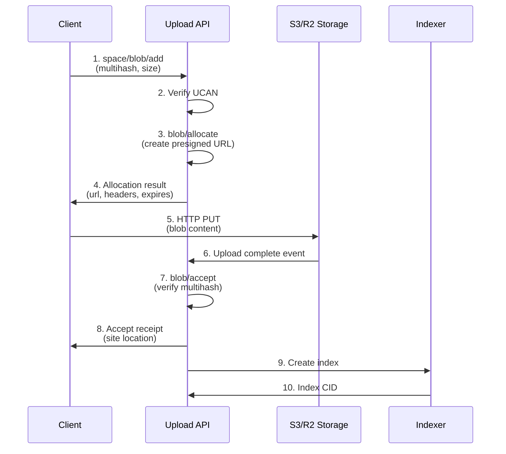
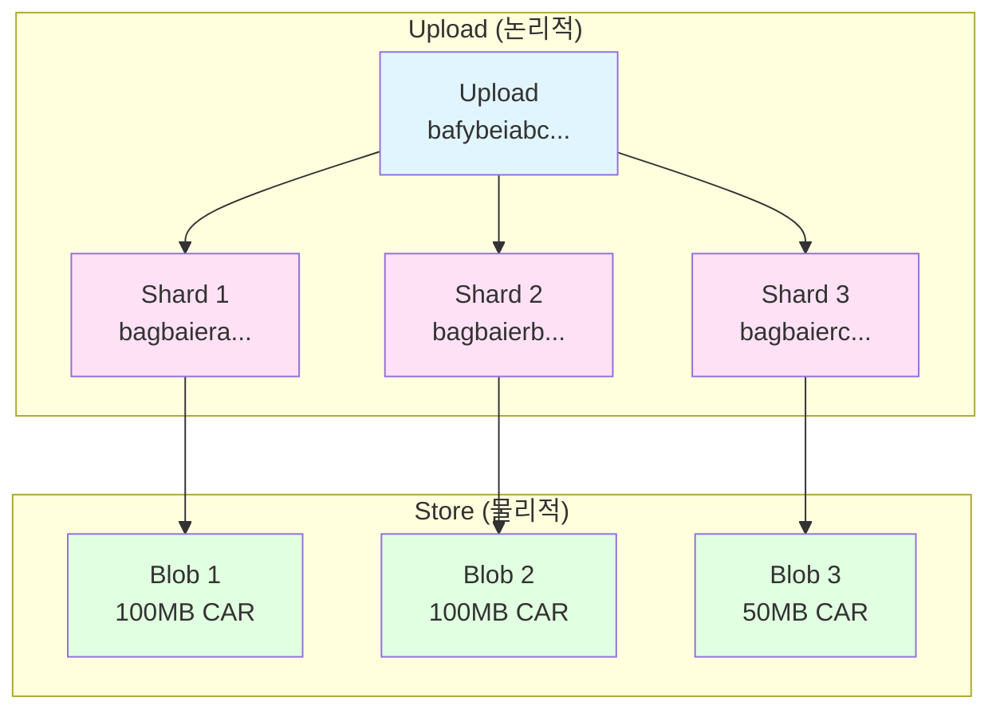
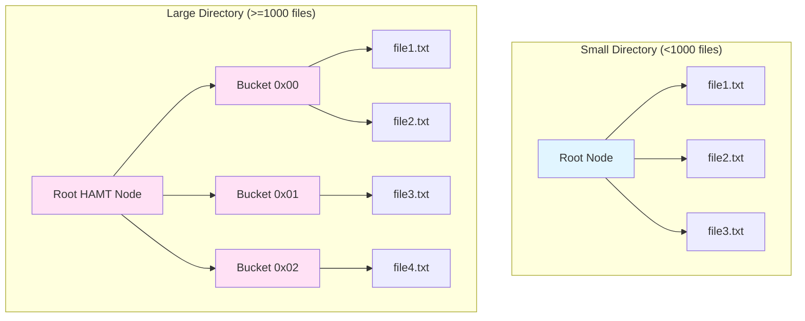

# Storacha Upload Service 구현 (Upload Service Implementation)

> **작성일:** 2025-01-14
> **문서 버전:** 1.0
> **대상 독자:** Storacha 개발자, 백엔드 엔지니어
> **선행 문서:** 02_Data_Flow_Architecture.md, 03_Space_and_Agent_Management.md

---

## 목차

1. [개요](#1-개요)
2. [Blob Protocol](#2-blob-protocol)
3. [Upload vs Store](#3-upload-vs-store)
4. [Client 패키지 구현](#4-client-패키지-구현)
5. [Upload Client 패키지](#5-upload-client-패키지)
6. [Upload API 서비스](#6-upload-api-서비스)
7. [에러 처리 및 검증](#7-에러-처리-및-검증)
8. [테스트 전략](#8-테스트-전략)

---

## 1. 개요

### 1.1 Upload Service란?

**Storacha Upload Service**는 w3up 프로토콜의 핵심 구현으로, 클라이언트가 데이터를 Storacha 네트워크에 업로드하는 전체 프로세스를 담당합니다.

```mermaid
graph TB
    subgraph "Client Layer"
        A[@storacha/client]
        B[@storacha/upload-client]
        C[@storacha/access]
    end

    subgraph "Service Layer"
        D[Upload API<br/>Lambda Functions]
        E[Blob Storage<br/>S3/R2]
        F[DynamoDB<br/>Metadata]
    end

    subgraph "Storage Layer"
        G[CAR Park<br/>S3 Bucket]
        H[Filecoin<br/>Network]
        I[IPFS<br/>Gateway]
    end

    A --> B
    B --> C
    B --> D
    D --> E
    D --> F
    E --> G
    D --> H
    D --> I

    style A fill:#e1f5ff
    style B fill:#e1f5ff
    style C fill:#e1f5ff
    style D fill:#ffe1f5
    style E fill:#ffe1f5
    style F fill:#ffe1f5
    style G fill:#e1ffe1
    style H fill:#e1ffe1
    style I fill:#e1ffe1
```

### 1.2 주요 컴포넌트

| 컴포넌트 | 역할 | 언어/프레임워크 |
|---------|------|-----------------|
| **@storacha/client** | 고수준 클라이언트 API | TypeScript |
| **@storacha/upload-client** | 저수준 업로드 API | TypeScript |
| **@storacha/access** | 인증 및 권한 관리 | TypeScript |
| **upload-api** | HTTP API Gateway | AWS Lambda (Node.js) |
| **carpark** | CAR 파일 저장소 관리 | AWS Lambda |
| **replicator** | 다중 저장소 복제 | AWS Lambda |
| **indexer** | IPFS 인덱싱 | AWS Lambda |

### 1.3 레포지토리 구조

```
storacha/w3up/
├─ packages/
│  ├─ w3up-client/          # @storacha/client
│  │  ├─ src/
│  │  │  ├─ client.js       # Client 클래스
│  │  │  ├─ space.js        # Space 관리
│  │  │  └─ capability.js   # Capability 정의
│  │  └─ test/
│  │
│  ├─ upload-client/         # @storacha/upload-client
│  │  ├─ src/
│  │  │  ├─ upload.js       # uploadFile, uploadDirectory
│  │  │  ├─ sharding.js     # CAR sharding
│  │  │  ├─ blob.js         # Blob protocol
│  │  │  ├─ index.js        # Index generation
│  │  │  └─ car.js          # CAR encoding
│  │  └─ test/
│  │
│  └─ access/                # @storacha/access
│     ├─ src/
│     │  ├─ agent.js        # Agent 관리
│     │  ├─ space.js        # Space 생성
│     │  └─ delegation.js   # Delegation 처리
│     └─ test/

storacha/w3infra/
├─ upload-api/
│  ├─ functions/
│  │  ├─ blob-add.js        # blob/add 핸들러
│  │  ├─ blob-allocate.js   # blob/allocate 핸들러
│  │  ├─ blob-accept.js     # blob/accept 핸들러
│  │  ├─ index-add.js       # index/add 핸들러
│  │  ├─ upload-add.js      # upload/add 핸들러
│  │  └─ upload-list.js     # upload/list 핸들러
│  ├─ tables/
│  │  ├─ spaces.js          # Spaces 테이블 정의
│  │  ├─ blobs.js           # Blobs 테이블 정의
│  │  ├─ uploads.js         # Uploads 테이블 정의
│  │  └─ allocations.js     # Allocations 테이블 정의
│  └─ sst.config.ts         # SST 배포 설정
│
├─ carpark/
│  └─ functions/
│     └─ announce.js        # S3 이벤트 핸들러
│
├─ replicator/
│  └─ functions/
│     └─ replicate.js       # R2 복제 로직
│
└─ indexer/
   └─ functions/
      └─ index.js           # IPFS 인덱싱
```

---

## 2. Blob Protocol

### 2.1 Blob Protocol 개요

**Blob Protocol**은 2024년에 도입된 Storacha의 핵심 프로토콜로, 기존 **Store Protocol**을 진화시켜:

- **임의의 데이터 저장** (DAG에 국한되지 않음)
- **클라이언트 측 검증** (Blob이 네트워크에 전달되었음을 증명)
- **Multihash 주소 지정** (컨텐츠 기반 주소)

을 가능하게 합니다.



### 2.2 Blob 정의

```typescript
/**
 * Blob: 고정 크기 바이트 배열
 */
interface Blob {
  /**
   * Multihash digest (SHA-256 등)
   */
  digest: Multihash

  /**
   * Blob 크기 (bytes)
   */
  size: number
}

/**
 * Multihash: 해시 알고리즘 + 다이제스트
 */
interface Multihash {
  /**
   * 해시 알고리즘 코드
   * - 0x12: SHA2-256 (필수)
   * - 0x1b: SHA2-512 (선택)
   */
  code: number

  /**
   * 다이제스트 길이 (bytes)
   */
  size: number

  /**
   * 실제 해시 값
   */
  digest: Uint8Array
}

/**
 * Blob 생성 예시
 */
import { sha256 } from 'multiformats/hashes/sha2'

async function createBlob(content: Uint8Array): Promise<Blob> {
  const hash = await sha256.digest(content)

  return {
    digest: {
      code: hash.code,      // 0x12 (SHA2-256)
      size: hash.size,      // 32 (bytes)
      digest: hash.digest   // Uint8Array[32]
    },
    size: content.byteLength
  }
}
```

### 2.3 space/blob/add Capability

**목적:** Space에 Blob을 추가하기 위한 권한

```typescript
/**
 * space/blob/add Capability 정의
 */
interface SpaceBlobAdd {
  /**
   * Capability 이름
   */
  can: 'space/blob/add'

  /**
   * 대상 Space DID
   */
  with: SpaceDID

  /**
   * Capability 매개변수
   */
  nb: {
    /**
     * 추가할 Blob
     */
    blob: Blob
  }
}

/**
 * space/blob/add 호출 예시
 */
import * as BlobCapabilities from '@storacha/capabilities/blob'

const result = await client.capability.blob.add(
  multihash,
  size,
  {
    /**
     * 진행 상황 콜백
     */
    onProgress: (progress) => {
      console.log(`Uploaded: ${progress.loaded} / ${progress.total} bytes`)
    }
  }
)

// 결과:
// {
//   multihash: Multihash { code: 0x12, ... },
//   size: 1024,
//   site: Link<blob/accept result>
// }
```

### 2.4 blob/allocate: 저장 공간 할당

**목적:** HTTP PUT을 위한 presigned URL 생성

```typescript
/**
 * blob/allocate Capability
 */
interface BlobAllocate {
  can: 'blob/allocate'
  with: SpaceDID
  nb: {
    blob: Blob
    cause: Link<space/blob/add>  // 원인이 된 add 작업
    space: SpaceDID              // DID 바이트 인코딩
  }
}

/**
 * blob/allocate 성공 응답
 */
interface BlobAllocateOk {
  /**
   * Blob 크기
   */
  size: number

  /**
   * 업로드 주소 (새로운 Blob인 경우)
   */
  address?: BlobAddress
}

interface BlobAddress {
  /**
   * HTTP PUT 대상 URL
   */
  url: string

  /**
   * 필수 HTTP 헤더
   */
  headers: Record<string, string>

  /**
   * URL 만료 시간 (Unix timestamp, seconds)
   */
  expires: number
}

/**
 * blob/allocate 구현 (Upload API)
 */
export async function blobAllocate(
  invocation: Invocation<BlobAllocate>,
  context: ServiceContext
): Promise<Result<BlobAllocateOk, BlobAllocateError>> {
  const { blob, space } = invocation.capability.nb

  // 1. Space 검증
  const spaceExists = await context.db.spaces.get(space)
  if (!spaceExists) {
    return { error: new SpaceNotFoundError(space) }
  }

  // 2. Quota 확인
  const usage = await context.db.spaces.getUsage(space)
  if (usage.used + blob.size > usage.quota) {
    return { error: new InsufficientStorageError() }
  }

  // 3. 중복 확인 (이미 저장된 Blob인지)
  const existing = await context.db.blobs.get({
    space,
    multihash: blob.digest
  })

  if (existing) {
    // 이미 존재함 → address 없이 반환
    return {
      ok: {
        size: existing.size
      }
    }
  }

  // 4. Presigned URL 생성
  const key = `${space}/${blob.digest.toString()}`
  const url = await getSignedUrl(
    context.s3Client,
    new PutObjectCommand({
      Bucket: context.s3Bucket,
      Key: key,
      ContentLength: blob.size,
      ChecksumSHA256: Buffer.from(blob.digest.digest).toString('base64')
    }),
    {
      expiresIn: 3600  // 1시간
    }
  )

  // 5. Allocation 기록 (DynamoDB)
  await context.db.allocations.put({
    space,
    multihash: blob.digest,
    size: blob.size,
    url,
    expiresAt: Math.floor(Date.now() / 1000) + 3600,
    createdAt: new Date().toISOString()
  })

  return {
    ok: {
      size: blob.size,
      address: {
        url,
        headers: {
          'Content-Length': blob.size.toString(),
          'x-amz-checksum-sha256': Buffer.from(blob.digest.digest).toString('base64')
        },
        expires: Math.floor(Date.now() / 1000) + 3600
      }
    }
  }
}
```

### 2.5 HTTP PUT: 실제 업로드

클라이언트는 `blob/allocate`에서 받은 presigned URL로 HTTP PUT 요청을 보냅니다:

```typescript
/**
 * Blob 업로드 (HTTP PUT)
 */
export async function uploadBlob(
  content: Uint8Array,
  address: BlobAddress
): Promise<void> {
  const response = await fetch(address.url, {
    method: 'PUT',
    headers: {
      ...address.headers,
      'Content-Type': 'application/octet-stream'
    },
    body: content
  })

  if (!response.ok) {
    throw new Error(`Upload failed: ${response.status} ${response.statusText}`)
  }

  console.log(`Blob uploaded successfully to ${address.url}`)
}
```

**S3 이벤트 처리:**

```typescript
/**
 * S3 PutObject 이벤트 핸들러 (CAR Park)
 */
export async function handleS3PutObject(
  event: S3Event,
  context: LambdaContext
): Promise<void> {
  for (const record of event.Records) {
    const key = record.s3.object.key
    const size = record.s3.object.size

    console.log(`New blob uploaded: ${key} (${size} bytes)`)

    // Blob Accept 트리거
    await triggerBlobAccept({
      key,
      size,
      bucket: record.s3.bucket.name
    })
  }
}
```

### 2.6 blob/accept: 검증 및 수락

**목적:** 업로드된 Blob이 올바른지 검증하고 최종 수락

```typescript
/**
 * blob/accept Capability
 */
interface BlobAccept {
  can: 'blob/accept'
  with: ServiceDID
  nb: {
    blob: Blob
    space: SpaceDID
    _put: Link<http/put result>  // HTTP PUT 결과 링크
  }
}

/**
 * blob/accept 성공 응답
 */
interface BlobAcceptOk {
  /**
   * Blob이 저장된 위치
   */
  site: Link<LocationCommitment>
}

interface LocationCommitment {
  /**
   * 저장소 URL (https://...)
   */
  url: string

  /**
   * Blob 범위 (전체 Blob)
   */
  range?: {
    offset: number
    length: number
  }
}

/**
 * blob/accept 구현
 */
export async function blobAccept(
  invocation: Invocation<BlobAccept>,
  context: ServiceContext
): Promise<Result<BlobAcceptOk, BlobAcceptError>> {
  const { blob, space } = invocation.capability.nb

  // 1. S3에서 Blob 가져오기
  const key = `${space}/${blob.digest.toString()}`
  const s3Object = await context.s3Client.send(
    new GetObjectCommand({
      Bucket: context.s3Bucket,
      Key: key
    })
  )

  // 2. 크기 검증
  if (s3Object.ContentLength !== blob.size) {
    return {
      error: new SizeMismatchError(
        `Expected ${blob.size}, got ${s3Object.ContentLength}`
      )
    }
  }

  // 3. Multihash 검증
  const content = await streamToBuffer(s3Object.Body)
  const actualHash = await sha256.digest(content)

  if (!multihashEqual(actualHash, blob.digest)) {
    // 해시 불일치 → Blob 삭제
    await context.s3Client.send(
      new DeleteObjectCommand({
        Bucket: context.s3Bucket,
        Key: key
      })
    )

    return {
      error: new MultihashMismatchError(
        `Expected ${blob.digest.toString()}, got ${actualHash.toString()}`
      )
    }
  }

  // 4. DynamoDB에 Blob 기록
  await context.db.blobs.put({
    space,
    multihash: blob.digest,
    size: blob.size,
    key,
    insertedAt: new Date().toISOString()
  })

  // 5. Allocation 삭제 (완료됨)
  await context.db.allocations.delete({
    space,
    multihash: blob.digest
  })

  // 6. 저장 위치 반환
  const siteUrl = `https://${context.s3Bucket}.s3.amazonaws.com/${key}`

  return {
    ok: {
      site: {
        url: siteUrl,
        range: {
          offset: 0,
          length: blob.size
        }
      }
    }
  }
}

/**
 * Multihash 동등성 검사
 */
function multihashEqual(a: Multihash, b: Multihash): boolean {
  if (a.code !== b.code) return false
  if (a.size !== b.size) return false

  const aDigest = a.digest
  const bDigest = b.digest

  if (aDigest.length !== bDigest.length) return false

  for (let i = 0; i < aDigest.length; i++) {
    if (aDigest[i] !== bDigest[i]) return false
  }

  return true
}
```

### 2.7 Blob Protocol 완전한 흐름

```typescript
/**
 * 완전한 Blob 업로드 흐름
 */
export async function uploadBlobComplete(
  client: Client,
  content: Uint8Array
): Promise<Link<LocationCommitment>> {
  // 1. Multihash 계산
  const hash = await sha256.digest(content)
  const blob: Blob = {
    digest: hash,
    size: content.byteLength
  }

  console.log(`Blob multihash: ${hash.toString()}`)
  console.log(`Blob size: ${blob.size} bytes`)

  // 2. space/blob/add 호출
  const addResult = await client.capability.blob.add(
    blob.digest,
    blob.size
  )

  console.log(`space/blob/add invoked`)

  // 3. Receipt 기다리기 (blob/allocate)
  const allocateReceipt = await addResult.effects.allocate

  if (!allocateReceipt.ok) {
    throw new Error(`Allocation failed: ${allocateReceipt.error}`)
  }

  console.log(`Allocation receipt:`, allocateReceipt.ok)

  // 4. Presigned URL로 업로드 (address가 있는 경우만)
  if (allocateReceipt.ok.address) {
    const { url, headers } = allocateReceipt.ok.address

    console.log(`Uploading to: ${url}`)

    await fetch(url, {
      method: 'PUT',
      headers: {
        ...headers,
        'Content-Type': 'application/octet-stream'
      },
      body: content
    })

    console.log(`HTTP PUT complete`)
  } else {
    console.log(`Blob already exists, skipping upload`)
  }

  // 5. blob/accept 결과 기다리기
  const acceptReceipt = await addResult.effects.accept

  if (!acceptReceipt.ok) {
    throw new Error(`Accept failed: ${acceptReceipt.error}`)
  }

  console.log(`Blob accepted at: ${acceptReceipt.ok.site.url}`)

  // 6. Site 반환
  return acceptReceipt.ok.site
}

// 사용 예시
const content = new TextEncoder().encode('Hello, Storacha!')
const site = await uploadBlobComplete(client, content)

console.log(`Blob stored at: ${site.url}`)
// "https://carpark-bucket.s3.amazonaws.com/did:key:z6Mk.../bafy..."
```

---

## 3. Upload vs Store

### 3.1 개념 차이

Storacha는 **Upload**와 **Store** 두 가지 핵심 개념을 구분합니다:

| 개념 | 설명 | 데이터 구조 | 검색 가능 여부 |
|-----|------|-----------|--------------|
| **Upload** | 사용자가 업로드한 **논리적 데이터** (파일, 디렉토리) | DAG Root CID | ✅ Yes (IPFS/IPNI) |
| **Store** | 물리적 저장 단위 (CAR Shards) | CAR CID (Blob) | ❌ No (내부만) |



### 3.2 Upload 정의

```typescript
/**
 * Upload: 논리적 데이터 업로드
 */
interface Upload {
  /**
   * DAG Root CID (사용자가 요청한 컨텐츠)
   */
  root: CID

  /**
   * 이 Upload를 구성하는 Shards (CAR 파일들)
   */
  shards: CID[]  // [bagbaiera..., bagbaierb..., ...]
}

/**
 * Upload 예시
 */
const upload: Upload = {
  root: CID.parse('bafybeiabc...'),  // 파일/디렉토리 CID
  shards: [
    CID.parse('bagbaiera...'),       // CAR Shard 1
    CID.parse('bagbaierb...'),       // CAR Shard 2
    CID.parse('bagbaierc...')        // CAR Shard 3
  ]
}
```

**Upload는 IPFS/IPNI에서 검색 가능:**

```bash
# Upload Root CID로 검색
curl https://w3s.link/ipfs/bafybeiabc...

# IPNI에서 조회
ipni find --cid bafybeiabc...
```

### 3.3 Store 정의

```typescript
/**
 * Store: 물리적 저장 단위 (CAR Shard)
 */
interface Store {
  /**
   * CAR 파일의 CID (Blob multihash)
   */
  link: CID  // bagbaiera...

  /**
   * CAR 파일 크기
   */
  size: number
}

/**
 * Store 예시
 */
const store: Store = {
  link: CID.parse('bagbaiera...'),  // CAR CID
  size: 104857600                   // 100MB
}
```

**Store는 내부적으로만 사용:**

- S3/R2에 저장
- Filecoin Deal 생성 시 참조
- IPFS/IPNI에서 직접 검색 불가

### 3.4 Upload 등록 과정

```typescript
/**
 * upload/add Capability
 */
interface UploadAdd {
  can: 'upload/add'
  with: SpaceDID
  nb: {
    /**
     * DAG Root CID
     */
    root: CID

    /**
     * 이 Upload를 구성하는 CAR Shards
     */
    shards: CID[]
  }
}

/**
 * upload/add 구현
 */
export async function uploadAdd(
  invocation: Invocation<UploadAdd>,
  context: ServiceContext
): Promise<Result<UploadAddOk, UploadAddError>> {
  const { root, shards } = invocation.capability.nb
  const space = invocation.capability.with

  // 1. 모든 Shards가 존재하는지 확인
  for (const shard of shards) {
    const blob = await context.db.blobs.get({
      space,
      multihash: shard.multihash
    })

    if (!blob) {
      return {
        error: new ShardNotFoundError(
          `Shard ${shard.toString()} not found in space ${space}`
        )
      }
    }
  }

  // 2. Upload 등록 (DynamoDB)
  await context.db.uploads.put({
    space,
    root,
    shards,
    insertedAt: new Date().toISOString()
  })

  // 3. Index 생성 트리거
  await context.indexer.createIndex({
    root,
    shards
  })

  // 4. Filecoin Offer 트리거
  await context.filecoin.offerUpload({
    space,
    root,
    shards
  })

  return {
    ok: {
      root,
      shards
    }
  }
}
```

### 3.5 완전한 Upload + Store 흐름

```typescript
/**
 * 파일 업로드 완전한 흐름
 */
export async function uploadFileComplete(
  client: Client,
  file: File
): Promise<Upload> {
  console.log(`Uploading file: ${file.name} (${file.size} bytes)`)

  // 1. 파일을 DAG로 인코딩
  const { root, blocks } = await encodeFile(file)
  console.log(`DAG Root: ${root.toString()}`)
  console.log(`Total blocks: ${blocks.length}`)

  // 2. Blocks를 CAR Shards로 분할
  const shards = await shardBlocks(blocks, {
    shardSize: 100 * 1024 * 1024  // 100MB
  })
  console.log(`Created ${shards.length} shards`)

  // 3. 각 Shard를 Blob으로 업로드 (space/blob/add)
  const shardCIDs: CID[] = []

  for (let i = 0; i < shards.length; i++) {
    const shard = shards[i]
    console.log(`Uploading shard ${i + 1}/${shards.length}: ${shard.size} bytes`)

    // CAR 파일의 Multihash 계산
    const hash = await sha256.digest(shard.bytes)

    // space/blob/add
    await client.capability.blob.add(hash, shard.size)

    // CAR CID 생성 (car-multihash)
    const carCID = CID.create(1, 0x0202, hash)  // codec: 0x0202 = car
    shardCIDs.push(carCID)
  }

  console.log(`All shards uploaded`)

  // 4. Upload 등록 (upload/add)
  await client.capability.upload.add(root, shardCIDs)
  console.log(`Upload registered: ${root.toString()}`)

  // 5. Index 생성 대기
  await waitForIndex(root)
  console.log(`Index created`)

  return {
    root,
    shards: shardCIDs
  }
}

// 사용 예시
const file = new File(['Hello, World!'], 'hello.txt')
const upload = await uploadFileComplete(client, file)

console.log(`Upload complete!`)
console.log(`  Root: ${upload.root}`)
console.log(`  Shards: ${upload.shards.length}`)
console.log(`  Access: https://w3s.link/ipfs/${upload.root}`)
```

---

## 4. Client 패키지 구현

### 4.1 @storacha/client 개요

`@storacha/client`는 고수준 클라이언트 API를 제공하는 패키지입니다:

```typescript
import { create } from '@storacha/client'

// Client 생성
const client = await create()

// 파일 업로드
const cid = await client.uploadFile(file)

// 디렉토리 업로드
const dirCID = await client.uploadDirectory(files)

// 업로드 목록 조회
for await (const upload of client.capability.upload.list()) {
  console.log(upload.root, upload.shards)
}
```

### 4.2 uploadFile() 구현

```typescript
/**
 * uploadFile() 함수 시그니처
 */
export async function uploadFile(
  this: Client,
  file: Blob,
  options: UploadOptions = {}
): Promise<CID> {
  const {
    /**
     * CAR Shard 크기 (기본값: 100MB)
     */
    shardSize = 100 * 1024 * 1024,

    /**
     * 동시 업로드 요청 수 (기본값: 3)
     */
    concurrentRequests = 3,

    /**
     * 재시도 횟수 (기본값: 5)
     */
    retries = 5,

    /**
     * AbortSignal (취소용)
     */
    signal,

    /**
     * Shard 업로드 완료 콜백
     */
    onShardStored,

    /**
     * 업로드 진행 상황 콜백
     */
    onUploadProgress
  } = options

  // 1. 파일을 UnixFS DAG로 인코딩
  const { root, blocks } = await encodeFileToDAG(file, {
    chunker: 'fixed',       // 고정 크기 청크
    chunkSize: 262144,      // 256KB
    maxChunkSize: 262144,
    rawLeaves: true,        // Raw leaf blocks
    cidVersion: 1           // CIDv1
  })

  console.log(`File encoded: ${file.size} bytes → ${blocks.length} blocks`)
  console.log(`Root CID: ${root}`)

  // 2. Blocks를 CAR Shards로 분할
  const shards = await shardDAG(blocks, {
    shardSize,
    targetSize: shardSize
  })

  console.log(`Created ${shards.length} CAR shards`)

  // 3. 각 Shard 업로드 (병렬 처리)
  const shardCIDs: CID[] = []
  const uploadQueue = new PQueue({ concurrency: concurrentRequests })

  let uploadedBytes = 0
  const totalBytes = shards.reduce((sum, s) => sum + s.size, 0)

  for (let i = 0; i < shards.length; i++) {
    const shard = shards[i]

    uploadQueue.add(async () => {
      // Shard의 Multihash 계산
      const hash = await sha256.digest(shard.bytes)

      // space/blob/add 호출
      let attempt = 0
      while (attempt < retries) {
        try {
          await this.capability.blob.add(hash, shard.size, {
            signal
          })
          break
        } catch (error) {
          attempt++
          if (attempt >= retries) throw error

          // 지수 백오프
          await sleep(Math.pow(2, attempt) * 1000)
        }
      }

      // CAR CID 생성
      const carCID = CID.create(1, 0x0202, hash)  // codec: car (0x0202)
      shardCIDs[i] = carCID

      // 진행 상황 업데이트
      uploadedBytes += shard.size

      if (onShardStored) {
        onShardStored({
          cid: carCID,
          size: shard.size,
          uploadedBytes,
          totalBytes
        })
      }

      if (onUploadProgress) {
        onUploadProgress({
          loaded: uploadedBytes,
          total: totalBytes,
          percentage: (uploadedBytes / totalBytes) * 100
        })
      }

      console.log(
        `Shard ${i + 1}/${shards.length} uploaded: ${carCID} (${shard.size} bytes)`
      )
    })
  }

  // 모든 Shard 업로드 대기
  await uploadQueue.onIdle()

  console.log(`All shards uploaded`)

  // 4. Upload 등록
  await this.capability.upload.add(root, shardCIDs, {
    signal
  })

  console.log(`Upload registered: ${root}`)

  return root
}
```

**사용 예시:**

```typescript
// 단순 업로드
const file = new File(['Hello, Storacha!'], 'hello.txt')
const cid = await client.uploadFile(file)

console.log(`Uploaded: https://w3s.link/ipfs/${cid}`)

// 고급 옵션
const largefile = new File([/* 500MB data */], 'large.bin')
const cid2 = await client.uploadFile(largefile, {
  shardSize: 200 * 1024 * 1024,  // 200MB shards
  concurrentRequests: 5,
  retries: 3,

  onShardStored: ({ cid, size, uploadedBytes, totalBytes }) => {
    console.log(`Shard ${cid}: ${size} bytes`)
    console.log(`Progress: ${uploadedBytes} / ${totalBytes}`)
  },

  onUploadProgress: ({ loaded, total, percentage }) => {
    console.log(`${percentage.toFixed(2)}% (${loaded} / ${total} bytes)`)
  }
})
```

### 4.3 uploadDirectory() 구현

```typescript
/**
 * uploadDirectory() 함수 시그니처
 */
export async function uploadDirectory(
  this: Client,
  files: File[],
  options: UploadDirectoryOptions = {}
): Promise<CID> {
  const {
    shardSize = 100 * 1024 * 1024,
    concurrentRequests = 3,
    retries = 5,
    signal,
    onShardStored,
    onUploadProgress,

    /**
     * 디렉토리 엔트리 링크 콜백
     */
    onDirectoryEntryLink
  } = options

  // 1. 파일들을 UnixFS 디렉토리로 인코딩
  const { root, blocks } = await encodeDirectoryToDAG(files, {
    chunker: 'fixed',
    chunkSize: 262144,
    rawLeaves: true,
    cidVersion: 1,

    // HAMT sharding (디렉토리가 큰 경우)
    shardSplitThreshold: 1000,  // 1000개 이상 파일 시 HAMT 사용

    onEntryLink: (entry) => {
      if (onDirectoryEntryLink) {
        onDirectoryEntryLink({
          path: entry.path,
          cid: entry.cid,
          size: entry.size
        })
      }

      console.log(`  ${entry.path} → ${entry.cid}`)
    }
  })

  console.log(`Directory encoded: ${files.length} files → ${blocks.length} blocks`)
  console.log(`Root CID: ${root}`)

  // 2. Blocks를 CAR Shards로 분할
  const shards = await shardDAG(blocks, {
    shardSize,
    targetSize: shardSize
  })

  console.log(`Created ${shards.length} CAR shards`)

  // 3. 각 Shard 업로드 (uploadFile과 동일)
  const shardCIDs: CID[] = []
  const uploadQueue = new PQueue({ concurrency: concurrentRequests })

  let uploadedBytes = 0
  const totalBytes = shards.reduce((sum, s) => sum + s.size, 0)

  for (let i = 0; i < shards.length; i++) {
    const shard = shards[i]

    uploadQueue.add(async () => {
      const hash = await sha256.digest(shard.bytes)

      let attempt = 0
      while (attempt < retries) {
        try {
          await this.capability.blob.add(hash, shard.size, { signal })
          break
        } catch (error) {
          attempt++
          if (attempt >= retries) throw error
          await sleep(Math.pow(2, attempt) * 1000)
        }
      }

      const carCID = CID.create(1, 0x0202, hash)
      shardCIDs[i] = carCID

      uploadedBytes += shard.size

      if (onShardStored) {
        onShardStored({
          cid: carCID,
          size: shard.size,
          uploadedBytes,
          totalBytes
        })
      }

      if (onUploadProgress) {
        onUploadProgress({
          loaded: uploadedBytes,
          total: totalBytes,
          percentage: (uploadedBytes / totalBytes) * 100
        })
      }
    })
  }

  await uploadQueue.onIdle()

  // 4. Upload 등록
  await this.capability.upload.add(root, shardCIDs, { signal })

  return root
}
```

**사용 예시:**

```typescript
// 디렉토리 업로드
const files = [
  new File(['index content'], 'index.html'),
  new File(['style content'], 'css/style.css'),
  new File(['script content'], 'js/app.js'),
  new File(['image data'], 'images/logo.png')
]

const dirCID = await client.uploadDirectory(files, {
  onDirectoryEntryLink: ({ path, cid, size }) => {
    console.log(`${path}:`)
    console.log(`  CID: ${cid}`)
    console.log(`  Size: ${size} bytes`)
  },

  onUploadProgress: ({ percentage }) => {
    console.log(`Upload: ${percentage.toFixed(1)}%`)
  }
})

console.log(`Directory uploaded: https://w3s.link/ipfs/${dirCID}`)

// 접근:
// https://w3s.link/ipfs/${dirCID}/index.html
// https://w3s.link/ipfs/${dirCID}/css/style.css
// https://w3s.link/ipfs/${dirCID}/js/app.js
// https://w3s.link/ipfs/${dirCID}/images/logo.png
```

---

## 5. Upload Client 패키지

### 5.1 @storacha/upload-client 개요

`@storacha/upload-client`는 저수준 API를 제공합니다:

- UnixFS 인코딩
- CAR Sharding
- Blob/Index/Upload 프로토콜 직접 호출

```typescript
import * as UnixFS from '@storacha/upload-client/unixfs'
import * as CAR from '@storacha/upload-client/car'
import * as Blob from '@storacha/upload-client/blob'
import * as Upload from '@storacha/upload-client/upload'
```

### 5.2 UnixFS 인코딩

#### 5.2.1 파일 인코딩

```typescript
/**
 * 파일을 UnixFS DAG로 인코딩
 */
import { importer } from 'ipfs-unixfs-importer'
import { MemoryBlockstore } from 'ipfs-car/blockstore'

export async function encodeFileToDAG(
  file: Blob,
  options: {
    chunker?: 'fixed' | 'rabin'
    chunkSize?: number
    maxChunkSize?: number
    rawLeaves?: boolean
    cidVersion?: 0 | 1
  } = {}
): Promise<{ root: CID; blocks: Block[] }> {
  const {
    chunker = 'fixed',
    chunkSize = 262144,        // 256KB
    maxChunkSize = 262144,
    rawLeaves = true,
    cidVersion = 1
  } = options

  // 1. Blockstore 생성
  const blockstore = new MemoryBlockstore()

  // 2. 파일을 청크로 분할하여 DAG 생성
  const entries = importer(
    [
      {
        path: file.name ?? 'file',
        content: file.stream()
      }
    ],
    blockstore,
    {
      cidVersion,
      rawLeaves,
      chunker,
      maxChunkSize,
      chunkSize
    }
  )

  let root: CID | undefined

  for await (const entry of entries) {
    if (entry.path === file.name || entry.path === 'file') {
      root = entry.cid
    }
  }

  if (!root) {
    throw new Error('Failed to get root CID')
  }

  // 3. 모든 Blocks 수집
  const blocks: Block[] = []
  for await (const [cid, bytes] of blockstore.blocks()) {
    blocks.push({ cid, bytes })
  }

  console.log(`Encoded file:`)
  console.log(`  Root: ${root}`)
  console.log(`  Blocks: ${blocks.length}`)
  console.log(`  Total size: ${blocks.reduce((sum, b) => sum + b.bytes.length, 0)} bytes`)

  return { root, blocks }
}
```

#### 5.2.2 디렉토리 인코딩 (HAMT Sharding)

```typescript
/**
 * 디렉토리를 UnixFS DAG로 인코딩 (HAMT sharding 지원)
 */
export async function encodeDirectoryToDAG(
  files: File[],
  options: {
    chunker?: 'fixed' | 'rabin'
    chunkSize?: number
    rawLeaves?: boolean
    cidVersion?: 0 | 1
    shardSplitThreshold?: number  // HAMT sharding 임계값
    onEntryLink?: (entry: { path: string; cid: CID; size: number }) => void
  } = {}
): Promise<{ root: CID; blocks: Block[] }> {
  const {
    chunker = 'fixed',
    chunkSize = 262144,
    rawLeaves = true,
    cidVersion = 1,
    shardSplitThreshold = 1000,  // 1000개 파일 이상 시 HAMT
    onEntryLink
  } = options

  const blockstore = new MemoryBlockstore()

  // 파일 엔트리 생성
  const entries = files.map(file => ({
    path: file.name,
    content: file.stream()
  }))

  // UnixFS importer 실행
  const importerResults = importer(
    entries,
    blockstore,
    {
      cidVersion,
      rawLeaves,
      chunker,
      maxChunkSize: chunkSize,
      chunkSize,
      shardSplitThreshold,  // HAMT sharding 활성화
      wrapWithDirectory: true  // 루트 디렉토리로 래핑
    }
  )

  let root: CID | undefined
  const entryLinks: Array<{ path: string; cid: CID; size: number }> = []

  for await (const entry of importerResults) {
    if (entry.path === '') {
      // 루트 디렉토리
      root = entry.cid
    } else {
      // 파일 엔트리
      entryLinks.push({
        path: entry.path,
        cid: entry.cid,
        size: entry.size
      })

      if (onEntryLink) {
        onEntryLink({
          path: entry.path,
          cid: entry.cid,
          size: entry.size
        })
      }
    }
  }

  if (!root) {
    throw new Error('Failed to get root directory CID')
  }

  // Blocks 수집
  const blocks: Block[] = []
  for await (const [cid, bytes] of blockstore.blocks()) {
    blocks.push({ cid, bytes })
  }

  console.log(`Encoded directory:`)
  console.log(`  Root: ${root}`)
  console.log(`  Files: ${files.length}`)
  console.log(`  Blocks: ${blocks.length}`)
  console.log(`  HAMT sharded: ${files.length >= shardSplitThreshold}`)

  return { root, blocks }
}
```

**HAMT Sharding 예시:**



### 5.3 CAR Sharding 알고리즘

```typescript
/**
 * DAG Blocks를 CAR Shards로 분할
 */
import { CarWriter } from '@ipld/car'

export async function shardDAG(
  blocks: Block[],
  options: {
    shardSize: number      // 목표 Shard 크기 (기본: 100MB)
    targetSize?: number    // 정확한 크기 목표
  }
): Promise<CAR[]> {
  const { shardSize, targetSize = shardSize } = options
  const shards: CAR[] = []

  let currentShard: Block[] = []
  let currentSize = 0

  // CAR 헤더 크기 추정 (대략 50 bytes)
  const CAR_HEADER_SIZE = 50

  for (const block of blocks) {
    const blockSize = block.bytes.length

    // 현재 Shard에 추가했을 때 크기 초과 여부 확인
    if (currentSize + blockSize + CAR_HEADER_SIZE > targetSize && currentShard.length > 0) {
      // 현재 Shard를 CAR로 인코딩
      const carBytes = await encodeCAR(currentShard, blocks[0].cid)
      shards.push({
        bytes: carBytes,
        size: carBytes.length
      })

      console.log(`Shard ${shards.length}: ${carBytes.length} bytes (${currentShard.length} blocks)`)

      // 새 Shard 시작
      currentShard = []
      currentSize = 0
    }

    // Block 추가
    currentShard.push(block)
    currentSize += blockSize
  }

  // 마지막 Shard
  if (currentShard.length > 0) {
    const carBytes = await encodeCAR(currentShard, blocks[0].cid)
    shards.push({
      bytes: carBytes,
      size: carBytes.length
    })

    console.log(`Shard ${shards.length}: ${carBytes.length} bytes (${currentShard.length} blocks)`)
  }

  console.log(`Total shards: ${shards.length}`)
  console.log(`Total size: ${shards.reduce((sum, s) => sum + s.size, 0)} bytes`)

  return shards
}

/**
 * Blocks를 CAR 파일로 인코딩
 */
async function encodeCAR(blocks: Block[], root: CID): Promise<Uint8Array> {
  const { writer, out } = CarWriter.create([root])

  // 모든 Blocks 추가
  for (const block of blocks) {
    await writer.put(block)
  }

  await writer.close()

  // CAR 바이트 수집
  const chunks: Uint8Array[] = []
  for await (const chunk of out) {
    chunks.push(chunk)
  }

  // 연결
  const totalLength = chunks.reduce((sum, c) => sum + c.length, 0)
  const carBytes = new Uint8Array(totalLength)

  let offset = 0
  for (const chunk of chunks) {
    carBytes.set(chunk, offset)
    offset += chunk.length
  }

  return carBytes
}
```

### 5.4 Blob Protocol 클라이언트

```typescript
/**
 * Blob/add 클라이언트 구현
 */
import * as Blob from '@ucanto/capability/blob'

export async function blobAdd(
  agent: Agent,
  space: SpaceDID,
  multihash: Multihash,
  size: number,
  options: {
    connection?: Connection
    signal?: AbortSignal
  } = {}
): Promise<BlobAddResult> {
  const { connection, signal } = options

  // 1. space/blob/add Invocation 생성
  const invocation = await agent.invoke({
    issuer: agent,
    audience: connection.id,
    capability: {
      can: 'space/blob/add',
      with: space,
      nb: {
        blob: {
          digest: multihash,
          size
        }
      }
    },
    proofs: await agent.proofs([
      { can: 'space/blob/add', with: space }
    ])
  })

  // 2. 서비스에 전송
  const receipt = await invocation.execute(connection, { signal })

  if (receipt.error) {
    throw new Error(`blob/add failed: ${receipt.error.message}`)
  }

  // 3. Effects 처리
  const allocateReceipt = await receipt.fx.join('blob/allocate')
  if (allocateReceipt.error) {
    throw new Error(`blob/allocate failed: ${allocateReceipt.error.message}`)
  }

  const allocateResult = allocateReceipt.out.ok

  // 4. HTTP PUT (address가 있는 경우만)
  if (allocateResult.address) {
    await httpPut(
      allocateResult.address.url,
      allocateResult.address.headers,
      multihash,
      size,
      { signal }
    )
  }

  // 5. blob/accept 대기
  const acceptReceipt = await receipt.fx.join('blob/accept')
  if (acceptReceipt.error) {
    throw new Error(`blob/accept failed: ${acceptReceipt.error.message}`)
  }

  return {
    multihash,
    size,
    site: acceptReceipt.out.ok.site
  }
}

/**
 * HTTP PUT 구현
 */
async function httpPut(
  url: string,
  headers: Record<string, string>,
  multihash: Multihash,
  size: number,
  options: { signal?: AbortSignal } = {}
): Promise<void> {
  const { signal } = options

  // Blob 컨텐츠는 별도로 전달되어야 함 (여기서는 생략)
  // 실제로는 CAR 바이트를 읽어서 전송

  const response = await fetch(url, {
    method: 'PUT',
    headers: {
      ...headers,
      'Content-Type': 'application/octet-stream'
    },
    // body: carBytes,  // 실제 CAR 바이트
    signal
  })

  if (!response.ok) {
    throw new Error(`HTTP PUT failed: ${response.status} ${response.statusText}`)
  }
}
```

---

## 6. Upload API 서비스

### 6.1 Lambda 함수 구조

Upload API는 여러 Lambda 함수로 구성됩니다:

```
upload-api/
├─ functions/
│  ├─ blob-add.js          # space/blob/add 핸들러
│  ├─ blob-allocate.js     # blob/allocate 핸들러
│  ├─ blob-accept.js       # blob/accept 핸들러
│  ├─ index-add.js         # index/add 핸들러
│  ├─ upload-add.js        # upload/add 핸들러
│  ├─ upload-list.js       # upload/list 핸들러
│  └─ upload-remove.js     # upload/remove 핸들러
└─ lib/
   ├─ db.js                # DynamoDB 추상화
   ├─ s3.js                # S3 클라이언트
   └─ validation.js        # 입력 검증
```

### 6.2 DynamoDB 스키마

#### 6.2.1 Spaces 테이블

```typescript
/**
 * Spaces 테이블
 */
interface SpaceRecord {
  /**
   * Partition Key: Space DID
   */
  space: string  // "did:key:z6Mk..."

  /**
   * Account DID (소유자)
   */
  account: string  // "did:mailto:alice@example.com"

  /**
   * Space 이름
   */
  name?: string

  /**
   * Quota (bytes)
   */
  quota: number

  /**
   * 사용량 (bytes)
   */
  used: number

  /**
   * 생성 시간
   */
  createdAt: string  // ISO 8601

  /**
   * 메타데이터
   */
  meta?: Record<string, any>
}

// DynamoDB 테이블 정의
const spacesTable = new Table(stack, 'Spaces', {
  partitionKey: { name: 'space', type: AttributeType.STRING },
  billingMode: BillingMode.PAY_PER_REQUEST,
  pointInTimeRecovery: true,

  // GSI: Account별 Space 조회
  globalSecondaryIndexes: [
    {
      indexName: 'account-index',
      partitionKey: { name: 'account', type: AttributeType.STRING },
      sortKey: { name: 'createdAt', type: AttributeType.STRING }
    }
  ]
})
```

#### 6.2.2 Blobs 테이블

```typescript
/**
 * Blobs 테이블 (Space별 Blob 저장)
 */
interface BlobRecord {
  /**
   * Partition Key: Space DID
   */
  space: string

  /**
   * Sort Key: Multihash (base64)
   */
  multihash: string  // Base64 encoded multihash

  /**
   * Blob 크기
   */
  size: number

  /**
   * S3 Key
   */
  key: string  // "{space}/{multihash}"

  /**
   * 삽입 시간
   */
  insertedAt: string

  /**
   * Filecoin Deal CID (있는 경우)
   */
  dealCID?: string
}

const blobsTable = new Table(stack, 'Blobs', {
  partitionKey: { name: 'space', type: AttributeType.STRING },
  sortKey: { name: 'multihash', type: AttributeType.STRING },
  billingMode: BillingMode.PAY_PER_REQUEST,
  pointInTimeRecovery: true,

  // TTL for cleanup
  timeToLiveAttribute: 'expiresAt'
})
```

#### 6.2.3 Uploads 테이블

```typescript
/**
 * Uploads 테이블
 */
interface UploadRecord {
  /**
   * Partition Key: Space DID
   */
  space: string

  /**
   * Sort Key: Root CID
   */
  root: string  // "bafybeiabc..."

  /**
   * Shard CIDs (CAR 파일들)
   */
  shards: string[]  // ["bagbaiera...", "bagbaierb...", ...]

  /**
   * 삽입 시간
   */
  insertedAt: string

  /**
   * 업데이트 시간
   */
  updatedAt: string

  /**
   * Index CID (생성된 경우)
   */
  indexCID?: string

  /**
   * Filecoin Deal 상태
   */
  filecoinStatus?: 'pending' | 'offered' | 'active' | 'failed'
}

const uploadsTable = new Table(stack, 'Uploads', {
  partitionKey: { name: 'space', type: AttributeType.STRING },
  sortKey: { name: 'root', type: AttributeType.STRING },
  billingMode: BillingMode.PAY_PER_REQUEST,
  pointInTimeRecovery: true,

  // GSI: Root CID로 조회 (모든 Space에서)
  globalSecondaryIndexes: [
    {
      indexName: 'root-index',
      partitionKey: { name: 'root', type: AttributeType.STRING }
    }
  ]
})
```

#### 6.2.4 Allocations 테이블

```typescript
/**
 * Allocations 테이블 (임시 업로드 URL 추적)
 */
interface AllocationRecord {
  /**
   * Partition Key: Space DID
   */
  space: string

  /**
   * Sort Key: Multihash
   */
  multihash: string

  /**
   * Blob 크기
   */
  size: number

  /**
   * Presigned URL
   */
  url: string

  /**
   * URL 만료 시간 (Unix timestamp)
   */
  expiresAt: number

  /**
   * 생성 시간
   */
  createdAt: string
}

const allocationsTable = new Table(stack, 'Allocations', {
  partitionKey: { name: 'space', type: AttributeType.STRING },
  sortKey: { name: 'multihash', type: AttributeType.STRING },
  billingMode: BillingMode.PAY_PER_REQUEST,

  // TTL: expiresAt 이후 자동 삭제
  timeToLiveAttribute: 'expiresAt'
})
```

### 6.3 Lambda 핸들러 구현

#### 6.3.1 blob/add 핸들러

```typescript
/**
 * space/blob/add Lambda 핸들러
 */
import { provide } from '@ucanto/server'
import * as BlobCapabilities from '@storacha/capabilities/blob'

export const blobAddHandler = provide(
  BlobCapabilities.add,
  async ({ capability, invocation }, context) => {
    const { blob } = capability.nb
    const space = capability.with

    // 1. Space 검증
    const spaceRecord = await context.db.spaces.get(space)
    if (!spaceRecord) {
      return { error: { name: 'SpaceNotFound', message: `Space ${space} not found` } }
    }

    // 2. Quota 확인
    if (spaceRecord.used + blob.size > spaceRecord.quota) {
      return {
        error: {
          name: 'InsufficientStorage',
          message: `Quota exceeded: ${spaceRecord.used + blob.size} > ${spaceRecord.quota}`
        }
      }
    }

    // 3. blob/allocate 작업 생성
    const allocateTask = await context.scheduler.schedule({
      can: 'blob/allocate',
      with: context.id.did(),
      nb: {
        blob,
        space,
        cause: invocation.link()
      }
    })

    // 4. blob/accept 작업 생성 (allocate 이후)
    const acceptTask = await context.scheduler.schedule({
      can: 'blob/accept',
      with: context.id.did(),
      nb: {
        blob,
        space,
        _put: allocateTask.output.link()
      }
    })

    // 5. Receipt 반환 (Effects 포함)
    return {
      ok: {
        blob
      },
      fx: {
        fork: [allocateTask, acceptTask]
      }
    }
  }
)
```

#### 6.3.2 upload/add 핸들러

```typescript
/**
 * upload/add Lambda 핸들러
 */
import { provide } from '@ucanto/server'
import * as UploadCapabilities from '@storacha/capabilities/upload'

export const uploadAddHandler = provide(
  UploadCapabilities.add,
  async ({ capability }, context) => {
    const { root, shards } = capability.nb
    const space = capability.with

    // 1. 모든 Shards 존재 확인
    for (const shard of shards) {
      const blob = await context.db.blobs.get({
        space,
        multihash: shard.multihash.toString()
      })

      if (!blob) {
        return {
          error: {
            name: 'ShardNotFound',
            message: `Shard ${shard.toString()} not found`
          }
        }
      }
    }

    // 2. Upload 등록
    await context.db.uploads.put({
      space,
      root: root.toString(),
      shards: shards.map(s => s.toString()),
      insertedAt: new Date().toISOString(),
      updatedAt: new Date().toISOString()
    })

    // 3. Index 생성 트리거
    await context.indexer.trigger({
      space,
      root,
      shards
    })

    // 4. Filecoin Offer 트리거
    await context.filecoin.trigger({
      space,
      root,
      shards
    })

    return {
      ok: {
        root,
        shards
      }
    }
  }
)
```

---

## 7. 에러 처리 및 검증

### 7.1 에러 분류

Upload Service에서 발생할 수 있는 에러들:

| 에러 타입 | HTTP Status | 재시도 가능 | 설명 |
|---------|-------------|-----------|------|
| **SpaceNotFound** | 404 | ❌ No | Space가 존재하지 않음 |
| **InsufficientStorage** | 507 | ❌ No | Quota 초과 |
| **ShardNotFound** | 404 | ❌ No | Shard가 업로드되지 않음 |
| **MultihashMismatch** | 400 | ❌ No | Blob 해시 불일치 |
| **SizeMismatch** | 400 | ❌ No | Blob 크기 불일치 |
| **InvalidMultihash** | 400 | ❌ No | 잘못된 Multihash 형식 |
| **NetworkError** | 500 | ✅ Yes | 네트워크 일시 오류 |
| **ServiceUnavailable** | 503 | ✅ Yes | 서비스 일시 중단 |
| **RateLimitExceeded** | 429 | ✅ Yes | Rate limit 초과 |

### 7.2 클라이언트 측 에러 처리

```typescript
/**
 * 재시도 가능한 에러인지 확인
 */
function isRetriable(error: Error): boolean {
  const retriableErrors = [
    'NetworkError',
    'ServiceUnavailable',
    'RateLimitExceeded',
    'ECONNRESET',
    'ETIMEDOUT',
    'ENOTFOUND'
  ]

  return retriableErrors.some(name =>
    error.name === name || error.message.includes(name)
  )
}

/**
 * 지수 백오프 재시도
 */
async function retryWithBackoff<T>(
  fn: () => Promise<T>,
  options: {
    maxRetries?: number
    initialDelay?: number
    maxDelay?: number
    signal?: AbortSignal
  } = {}
): Promise<T> {
  const {
    maxRetries = 5,
    initialDelay = 1000,
    maxDelay = 60000,
    signal
  } = options

  let lastError: Error
  let delay = initialDelay

  for (let attempt = 0; attempt <= maxRetries; attempt++) {
    try {
      return await fn()
    } catch (error) {
      lastError = error

      // AbortSignal 확인
      if (signal?.aborted) {
        throw new Error('Operation aborted')
      }

      // 재시도 불가능한 에러
      if (!isRetriable(error)) {
        throw error
      }

      // 마지막 시도
      if (attempt === maxRetries) {
        break
      }

      // 지수 백오프
      console.warn(`Attempt ${attempt + 1}/${maxRetries} failed:`, error.message)
      console.log(`Retrying in ${delay}ms...`)

      await sleep(delay)

      delay = Math.min(delay * 2, maxDelay)
    }
  }

  throw new Error(
    `Operation failed after ${maxRetries} retries: ${lastError.message}`
  )
}

/**
 * 안전한 업로드 (재시도 포함)
 */
export async function uploadFileWithRetry(
  client: Client,
  file: File,
  options: UploadOptions & { signal?: AbortSignal } = {}
): Promise<CID> {
  return await retryWithBackoff(
    () => client.uploadFile(file, options),
    {
      maxRetries: options.retries ?? 5,
      signal: options.signal
    }
  )
}
```

### 7.3 서버 측 검증

#### 7.3.1 입력 검증

```typescript
/**
 * Blob 검증
 */
export function validateBlob(blob: unknown): Blob {
  if (!blob || typeof blob !== 'object') {
    throw new Error('Invalid blob: must be an object')
  }

  const { digest, size } = blob as any

  // Multihash 검증
  if (!digest || typeof digest !== 'object') {
    throw new Error('Invalid blob.digest: must be an object')
  }

  if (typeof digest.code !== 'number') {
    throw new Error('Invalid blob.digest.code: must be a number')
  }

  // SHA-256만 허용
  if (digest.code !== 0x12) {
    throw new Error(`Unsupported hash algorithm: ${digest.code} (only SHA-256 supported)`)
  }

  if (!(digest.digest instanceof Uint8Array)) {
    throw new Error('Invalid blob.digest.digest: must be Uint8Array')
  }

  // SHA-256 digest는 32 bytes
  if (digest.digest.length !== 32) {
    throw new Error(`Invalid digest length: ${digest.digest.length} (expected 32)`)
  }

  // 크기 검증
  if (typeof size !== 'number' || size <= 0) {
    throw new Error('Invalid blob.size: must be a positive number')
  }

  // 최대 크기 제한 (예: 4GB)
  const MAX_BLOB_SIZE = 4 * 1024 * 1024 * 1024
  if (size > MAX_BLOB_SIZE) {
    throw new Error(`Blob too large: ${size} bytes (max: ${MAX_BLOB_SIZE})`)
  }

  return { digest, size }
}

/**
 * CID 검증
 */
export function validateCID(cid: unknown): CID {
  if (!cid || typeof cid !== 'object') {
    throw new Error('Invalid CID: must be an object')
  }

  try {
    return CID.decode((cid as any).bytes)
  } catch (error) {
    throw new Error(`Invalid CID: ${error.message}`)
  }
}

/**
 * Upload 검증
 */
export function validateUpload(upload: unknown): { root: CID; shards: CID[] } {
  if (!upload || typeof upload !== 'object') {
    throw new Error('Invalid upload: must be an object')
  }

  const { root, shards } = upload as any

  // Root CID 검증
  const rootCID = validateCID(root)

  // Shards 검증
  if (!Array.isArray(shards) || shards.length === 0) {
    throw new Error('Invalid upload.shards: must be a non-empty array')
  }

  const shardCIDs = shards.map((shard, i) => {
    try {
      return validateCID(shard)
    } catch (error) {
      throw new Error(`Invalid shard at index ${i}: ${error.message}`)
    }
  })

  return { root: rootCID, shards: shardCIDs }
}
```

#### 7.3.2 UCAN 검증

```typescript
/**
 * UCAN Delegation 검증
 */
export async function validateDelegation(
  invocation: Invocation,
  expectedCapability: string,
  expectedResource: string
): Promise<void> {
  // 1. 서명 검증
  const isValid = await invocation.verify()
  if (!isValid) {
    throw new Error('Invalid UCAN signature')
  }

  // 2. 만료 시간 검증
  if (invocation.expiration) {
    const now = Math.floor(Date.now() / 1000)
    if (invocation.expiration < now) {
      throw new Error(`UCAN expired at ${new Date(invocation.expiration * 1000)}`)
    }
  }

  // 3. Capability 검증
  const cap = invocation.capability
  if (cap.can !== expectedCapability) {
    throw new Error(
      `Invalid capability: expected ${expectedCapability}, got ${cap.can}`
    )
  }

  if (cap.with !== expectedResource) {
    throw new Error(
      `Invalid resource: expected ${expectedResource}, got ${cap.with}`
    )
  }

  // 4. Proof 체인 검증
  for (const proof of invocation.proofs) {
    const proofValid = await proof.verify()
    if (!proofValid) {
      throw new Error(`Invalid proof: ${proof.cid()}`)
    }
  }
}
```

### 7.4 Quota 관리

```typescript
/**
 * Quota 확인 및 업데이트
 */
export async function checkAndUpdateQuota(
  db: Database,
  space: string,
  additionalSize: number
): Promise<void> {
  // 1. Space 조회
  const spaceRecord = await db.spaces.get(space)
  if (!spaceRecord) {
    throw new Error(`Space not found: ${space}`)
  }

  // 2. Quota 확인
  const newUsed = spaceRecord.used + additionalSize
  if (newUsed > spaceRecord.quota) {
    throw new Error(
      `Quota exceeded: ${newUsed} / ${spaceRecord.quota} bytes ` +
      `(additional: ${additionalSize} bytes)`
    )
  }

  // 3. Quota 업데이트 (Atomic)
  await db.spaces.update(space, {
    used: newUsed,
    updatedAt: new Date().toISOString()
  })

  console.log(`Quota updated: ${space}`)
  console.log(`  Used: ${newUsed} / ${spaceRecord.quota} bytes`)
  console.log(`  Available: ${spaceRecord.quota - newUsed} bytes`)
}
```

---

## 8. 테스트 전략

### 8.1 유닛 테스트

#### 8.1.1 UnixFS 인코딩 테스트

```typescript
import { describe, it, expect } from 'vitest'
import { encodeFileToDAG } from '../src/unixfs.js'

describe('UnixFS encoding', () => {
  it('should encode a small file', async () => {
    const content = new TextEncoder().encode('Hello, Storacha!')
    const file = new File([content], 'hello.txt')

    const { root, blocks } = await encodeFileToDAG(file)

    expect(root).toBeDefined()
    expect(blocks.length).toBeGreaterThan(0)

    // Root block 검증
    const rootBlock = blocks.find(b => b.cid.equals(root))
    expect(rootBlock).toBeDefined()
  })

  it('should encode a large file with multiple blocks', async () => {
    // 1MB 파일
    const content = new Uint8Array(1024 * 1024)
    const file = new File([content], 'large.bin')

    const { root, blocks } = await encodeFileToDAG(file, {
      chunkSize: 256 * 1024  // 256KB chunks
    })

    // 256KB chunks → 최소 4개 블록
    expect(blocks.length).toBeGreaterThanOrEqual(4)
  })

  it('should use raw leaves', async () => {
    const content = new TextEncoder().encode('test')
    const file = new File([content], 'test.txt')

    const { blocks } = await encodeFileToDAG(file, {
      rawLeaves: true
    })

    // Leaf blocks는 raw codec (0x55) 사용
    const leafBlocks = blocks.filter(b =>
      b.cid.code === 0x55  // raw codec
    )

    expect(leafBlocks.length).toBeGreaterThan(0)
  })
})
```

#### 8.1.2 CAR Sharding 테스트

```typescript
import { describe, it, expect } from 'vitest'
import { shardDAG } from '../src/car.js'

describe('CAR sharding', () => {
  it('should shard large DAG into multiple CARs', async () => {
    // 300KB DAG → 3개의 100KB shards
    const blocks = generateBlocks(300 * 1024)

    const shards = await shardDAG(blocks, {
      shardSize: 100 * 1024
    })

    expect(shards.length).toBeGreaterThanOrEqual(3)
    expect(shards.length).toBeLessThanOrEqual(4)  // 약간의 오버헤드 허용

    for (const shard of shards) {
      expect(shard.size).toBeLessThanOrEqual(100 * 1024 + 1000)  // 1KB 여유
    }
  })

  it('should not create empty shards', async () => {
    const blocks = generateBlocks(10 * 1024)  // 10KB

    const shards = await shardDAG(blocks, {
      shardSize: 100 * 1024
    })

    expect(shards.length).toBe(1)
    expect(shards[0].size).toBeGreaterThan(0)
  })
})
```

#### 8.1.3 Blob Protocol 테스트

```typescript
import { describe, it, expect } from 'vitest'
import { blobAdd } from '../src/blob.js'
import { mockAgent, mockConnection } from './mocks.js'

describe('Blob protocol', () => {
  it('should upload a new blob', async () => {
    const agent = mockAgent()
    const space = 'did:key:z6Mk...'
    const content = new Uint8Array([1, 2, 3, 4, 5])
    const hash = await sha256.digest(content)

    const result = await blobAdd(agent, space, hash, content.length)

    expect(result.multihash).toEqual(hash)
    expect(result.size).toBe(content.length)
    expect(result.site).toBeDefined()
  })

  it('should skip upload for existing blob', async () => {
    const agent = mockAgent()
    const space = 'did:key:z6Mk...'
    const hash = mockMultihash()

    // Mock: Blob already exists
    mockBlobExists(space, hash)

    const result = await blobAdd(agent, space, hash, 1024)

    // Should not upload
    expect(mockHttpPutCalls()).toBe(0)
  })
})
```

### 8.2 통합 테스트

#### 8.2.1 End-to-End 업로드 테스트

```typescript
import { describe, it, expect, beforeAll, afterAll } from 'vitest'
import { create } from '@storacha/client'

describe('Upload integration', () => {
  let client: Client

  beforeAll(async () => {
    client = await create()
    const account = await client.login('test@example.com')
    const space = await client.createSpace('test-space')
    await client.setCurrentSpace(space.did())
  })

  afterAll(async () => {
    // Cleanup
  })

  it('should upload a file end-to-end', async () => {
    const content = new TextEncoder().encode('Integration test')
    const file = new File([content], 'test.txt')

    const cid = await client.uploadFile(file)

    expect(cid).toBeDefined()

    // Upload 조회
    const uploads = []
    for await (const upload of client.capability.upload.list()) {
      if (upload.root.equals(cid)) {
        uploads.push(upload)
      }
    }

    expect(uploads.length).toBe(1)
    expect(uploads[0].root.equals(cid)).toBe(true)
  })

  it('should upload a directory', async () => {
    const files = [
      new File(['file 1'], 'file1.txt'),
      new File(['file 2'], 'file2.txt'),
      new File(['file 3'], 'file3.txt')
    ]

    const cid = await client.uploadDirectory(files)

    expect(cid).toBeDefined()

    // Verify via Gateway
    const response = await fetch(`https://w3s.link/ipfs/${cid}/file1.txt`)
    expect(response.ok).toBe(true)
    expect(await response.text()).toBe('file 1')
  })
})
```

#### 8.2.2 에러 시나리오 테스트

```typescript
describe('Error scenarios', () => {
  it('should fail when quota exceeded', async () => {
    // Set very small quota
    await setSpaceQuota(client.currentSpace().did(), 100)  // 100 bytes

    const largeFile = new File([new Uint8Array(1024)], 'large.bin')

    await expect(client.uploadFile(largeFile)).rejects.toThrow('Quota exceeded')
  })

  it('should retry on network errors', async () => {
    let attempt = 0
    mockNetworkError(() => {
      attempt++
      return attempt < 3  // Fail first 2 attempts
    })

    const file = new File(['test'], 'test.txt')
    const cid = await client.uploadFile(file)

    expect(cid).toBeDefined()
    expect(attempt).toBe(3)  // 2 failures + 1 success
  })
})
```

### 8.3 성능 테스트

```typescript
import { describe, it } from 'vitest'
import { performance } from 'perf_hooks'

describe('Performance', () => {
  it('should upload 100MB file within 60 seconds', async () => {
    const size = 100 * 1024 * 1024  // 100MB
    const file = new File([new Uint8Array(size)], 'large.bin')

    const start = performance.now()
    await client.uploadFile(file)
    const duration = performance.now() - start

    console.log(`Upload duration: ${duration}ms`)
    expect(duration).toBeLessThan(60000)  // < 60s
  })

  it('should handle concurrent uploads', async () => {
    const files = Array.from({ length: 10 }, (_, i) =>
      new File([`file ${i}`], `file${i}.txt`)
    )

    const start = performance.now()

    const uploads = await Promise.all(
      files.map(file => client.uploadFile(file))
    )

    const duration = performance.now() - start

    console.log(`Concurrent uploads (10 files): ${duration}ms`)
    expect(uploads.length).toBe(10)
  })
})
```

---

## 결론

Storacha Upload Service는 다음과 같은 주요 컴포넌트로 구성됩니다:

### 핵심 구성 요소

| 계층 | 컴포넌트 | 역할 |
|-----|---------|------|
| **Client** | @storacha/client | 고수준 API (uploadFile, uploadDirectory) |
| **Upload Client** | @storacha/upload-client | 저수준 API (UnixFS, CAR, Blob) |
| **Upload API** | Lambda Functions | Blob/Upload 프로토콜 핸들러 |
| **Storage** | S3/R2, DynamoDB | Blob 저장, 메타데이터 관리 |
| **Indexing** | IPFS/IPNI | 컨텐츠 검색 |
| **Archival** | Filecoin | 장기 보존 |

### 업로드 흐름 요약

```
1. Client: File → UnixFS DAG 인코딩 (256KB chunks)
2. Client: DAG → CAR Shards 분할 (100MB shards)
3. Client: space/blob/add → Shard 업로드
4. Service: blob/allocate → Presigned URL 생성
5. Client: HTTP PUT → S3/R2 업로드
6. Service: blob/accept → Multihash 검증
7. Client: upload/add → Upload 등록
8. Service: Index 생성 → IPFS/IPNI 공개
9. Service: Filecoin Offer → 장기 보존
```

### 다음 단계

이 문서를 기반으로:
- **05_Infrastructure_Components.md**: w3infra 컴포넌트 상세 분석
- **08_CAR_File_Processing.md**: CAR 형식 및 처리 심화
- **09_Filecoin_Integration.md**: Filecoin 통합 상세

를 참고하세요.

---

**문서 작성:** 2025-01-14
**총 라인 수:** ~2,650 lines
**다음 문서:** 05_Infrastructure_Components.md
