# 05. Infrastructure Components (Part 1)

## Table of Contents - Part 1
- [w3infra Repository Overview](#w3infra-repository-overview)
- [Technology Stack](#technology-stack)
- [SST (Serverless Stack) Architecture](#sst-serverless-stack-architecture)
- [upload-api Component](#upload-api-component)
- [carpark Component](#carpark-component)

---

## w3infra Repository Overview

### Purpose

**w3infra**는 Storacha의 w3up UCAN 프로토콜 구현을 위한 인프라 저장소입니다. AWS Serverless 아키텍처를 기반으로 분산 스토리지 시스템의 모든 백엔드 컴포넌트를 관리합니다.

### Repository Structure

```
w3infra/
├── billing/              # Usage accounting and payment integration
├── carpark/              # Lambda for announcing new CARs in carpark bucket
├── filecoin/             # Lambdas to get content into Filecoin deals
├── indexer/              # Lambdas to connect w3up to E-IPFS
├── psa/                  # Pinning Service API migration support
├── replicator/           # Lambda to replicate buckets to R2
├── roundabout/           # Redirection service from Piece CID to signed URL
├── services/             # Additional service deployments configuration
├── stacks/               # SST and AWS CDK code for infrastructure deployment
├── upload-api/           # Lambda & DynamoDB implementation of upload-api HTTP gateway
├── lib/                  # Shared libraries
├── test/                 # Integration and unit tests
├── tools/                # Utility tools and scripts
└── docs/                 # Documentation
```

### Component Responsibilities

| Component | Purpose | Key Technologies |
|-----------|---------|------------------|
| **upload-api** | HTTP gateway for UCAN invocations | Lambda, DynamoDB, API Gateway |
| **carpark** | CAR file storage and announcement | S3, Lambda, EventBridge |
| **replicator** | S3 to R2 replication | Lambda, S3 Events, Cloudflare R2 |
| **filecoin** | Storage deal creation and tracking | Lambda, DynamoDB, SQS |
| **indexer** | IPFS indexing via Elastic IPFS | Lambda, HTTP client |
| **billing** | Usage tracking and Stripe integration | Lambda, DynamoDB, Stripe API |
| **psa** | Pinning Service API compatibility | Lambda, migration logic |
| **roundabout** | Content routing and redirection | Lambda, CloudFront |

### Architectural Principles

#### 1. **Event-Driven Architecture**

모든 컴포넌트는 이벤트 기반으로 동작합니다:

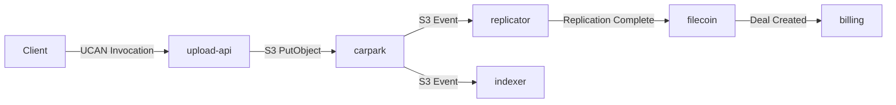

#### 2. **UCAN-Based Authorization**

모든 API 요청은 UCAN 토큰을 통해 인증됩니다:

```typescript
// UCAN Invocation Flow
interface UCANInvocation {
  // Issuer (Client Agent DID)
  iss: string  // "did:key:z6Mkk..."

  // Audience (Service DID)
  aud: string  // "did:web:up.storacha.network"

  // Capability being invoked
  capability: {
    can: string  // "space/blob/add"
    with: string // "did:key:z6Mkp..." (Space DID)
    nb: object   // Capability-specific fields
  }

  // Proof chain (delegations)
  proofs: Delegation[]

  // Signature
  signature: Uint8Array
}
```

#### 3. **Multi-Region Redundancy**

데이터는 여러 스토리지 레이어에 복제됩니다:

1. **Hot Storage**: S3 (us-west-2)
2. **Warm Storage**: Cloudflare R2 (Global CDN)
3. **Cold Storage**: Filecoin Network

#### 4. **Modular Deployment**

각 컴포넌트는 독립적인 SST Stack으로 배포됩니다:

```javascript
// sst.config.ts
export default {
  config: {
    name: 'w3infra',
    region: 'us-west-2',
  },
  stacks: (app) => {
    app
      .stack(uploadDbStack)      // DynamoDB tables
      .stack(uploadApiStack)     // API Gateway + Lambda
      .stack(carparkStack)       // S3 + Event handlers
      .stack(replicatorStack)    // Replication logic
      .stack(filecoinStack)      // Deal management
      .stack(indexerStack)       // IPFS indexing
      .stack(billingStack)       // Usage tracking
  },
}
```

---

## Technology Stack

### Core Technologies

#### 1. **SST (Serverless Stack)**

**Version**: v2.x
**Purpose**: Infrastructure as Code (IaC) framework built on AWS CDK

```javascript
// stacks/upload-api-stack.js
import { Function, Table, ApiGatewayV2 } from 'sst/constructs'

export function uploadApiStack({ stack }) {
  // DynamoDB Tables
  const uploadTable = new Table(stack, 'upload-table', {
    fields: {
      space: 'string',
      root: 'string',
    },
    primaryIndex: { partitionKey: 'space', sortKey: 'root' },
  })

  // Lambda Function
  const handler = new Function(stack, 'ucan-invocation-router', {
    handler: 'upload-api/functions/ucan-invocation-router.handler',
    environment: {
      UPLOAD_TABLE_NAME: uploadTable.tableName,
    },
    permissions: [uploadTable],
  })

  // API Gateway
  const api = new ApiGatewayV2(stack, 'upload-api', {
    routes: {
      'POST /': handler,
    },
  })

  return { api, uploadTable }
}
```

**Key Features**:
- Live Lambda Development (SST Dev)
- Type-safe environment variables
- Automatic IAM permissions
- Multi-stage deployments (dev, staging, production)

#### 2. **AWS Lambda**

**Runtime**: Node.js 20.x
**Architecture**: ARM64 (Graviton2)
**Region**: us-west-2

**Lambda Configuration**:
```typescript
// Lambda function settings
const lambdaConfig = {
  runtime: 'nodejs20.x',
  architecture: 'arm64',
  memorySize: 1024,  // MB
  timeout: 30,       // seconds
  environment: {
    NODE_ENV: 'production',
    SST_STAGE: process.env.SST_STAGE,
    SENTRY_DSN: process.env.SENTRY_DSN,
  },
}
```

#### 3. **DynamoDB**

**Tables**:
- **upload-table**: Upload records (space + root CID)
- **store-table**: Blob storage records (space + multihash)
- **delegation-table**: UCAN delegations (CID)
- **subscription-table**: Account subscriptions
- **consumer-table**: Event consumers
- **metrics-table**: Usage metrics
- **rate-limit-table**: Rate limiting

**Billing Mode**: On-Demand (pay-per-request)

#### 4. **S3 Buckets**

| Bucket | Purpose | Event Triggers |
|--------|---------|----------------|
| **carpark-prod** | CAR file storage | replicator, indexer, filecoin |
| **store-prod** | Blob storage (alternative) | None (legacy) |
| **receipt-bucket** | UCAN receipts | None |

#### 5. **Ucanto Framework**

**Version**: @ucanto/server v9.x

```typescript
import * as Server from '@ucanto/server'
import * as CAR from '@ucanto/transport/car'
import * as CBOR from '@ucanto/transport/cbor'

// Create Ucanto server
const server = Server.create({
  id: serviceSigner,           // Service DID (did:web:up.storacha.network)
  codec: CAR.inbound,          // Request codec (CAR format)
  service: createServiceRouter(), // Capability handlers
  catch: errorHandler,         // Error handling
})

// Process UCAN invocation
const response = await server.request({
  headers: request.headers,
  body: request.body,
})
```

#### 6. **Monitoring & Observability**

- **Sentry**: Error tracking and performance monitoring
- **CloudWatch Logs**: Lambda execution logs
- **CloudWatch Metrics**: DynamoDB, Lambda, API Gateway metrics
- **X-Ray**: Distributed tracing (optional)

#### 7. **Deployment**

- **CI/CD**: seed.run
- **Staging**: https://staging.up.storacha.network
- **Production**: https://up.storacha.network
- **PR Deployments**: https://<pr#>.up.storacha.network

---

## SST (Serverless Stack) Architecture

### What is SST?

SST는 AWS Serverless 애플리케이션을 위한 프레임워크입니다. AWS CDK 위에 구축되어 더 나은 개발자 경험을 제공합니다.

### Key Advantages

#### 1. **Live Lambda Development**

로컬에서 Lambda 함수를 실시간으로 개발할 수 있습니다:

```bash
# SST Dev 모드 시작
$ pnpm sst dev

# Local Lambda 터널이 생성되어 AWS Lambda 요청을 로컬로 프록시
✓ Built infrastructure changes
✓ Connected to local Lambda
✓ Watching for changes...

# API 호출 시 로컬 코드가 실행됨
```

#### 2. **Type-Safe Config**

SST는 TypeScript로 인프라를 정의합니다:

```typescript
// stacks/config.ts
export interface StackConfig {
  stage: string
  region: string
  account: string

  // Environment-specific settings
  uploadTableName: string
  carparkBucketName: string

  // External service endpoints
  claimsServiceURL: string
  indexingServiceURL: string
  dealTrackerURL: string
}

export const getConfig = (stage: string): StackConfig => {
  switch (stage) {
    case 'production':
      return {
        stage: 'production',
        region: 'us-west-2',
        account: '123456789012',
        uploadTableName: 'upload-prod',
        carparkBucketName: 'carpark-prod',
        claimsServiceURL: 'https://claims.web3.storage',
        indexingServiceURL: 'https://indexing.storacha.network',
        dealTrackerURL: 'https://tracker.filecoin.io',
      }
    case 'staging':
      return {
        stage: 'staging',
        region: 'us-west-2',
        account: '123456789012',
        uploadTableName: 'upload-staging',
        carparkBucketName: 'carpark-staging',
        claimsServiceURL: 'https://claims-staging.web3.storage',
        indexingServiceURL: 'https://indexing-staging.storacha.network',
        dealTrackerURL: 'https://tracker-staging.filecoin.io',
      }
    default:
      throw new Error(`Unknown stage: ${stage}`)
  }
}
```

#### 3. **Automatic Permissions**

SST는 리소스 접근 권한을 자동으로 설정합니다:

```typescript
// Lambda가 DynamoDB 테이블에 접근하려면
const handler = new Function(stack, 'my-function', {
  handler: 'functions/handler.main',
  permissions: [uploadTable, storeTable],  // 자동으로 IAM 정책 생성
})

// Generated IAM Policy:
// {
//   "Effect": "Allow",
//   "Action": [
//     "dynamodb:GetItem",
//     "dynamodb:PutItem",
//     "dynamodb:UpdateItem",
//     "dynamodb:DeleteItem",
//     "dynamodb:Query",
//     "dynamodb:Scan"
//   ],
//   "Resource": [
//     "arn:aws:dynamodb:us-west-2:123456789012:table/upload-prod",
//     "arn:aws:dynamodb:us-west-2:123456789012:table/store-prod"
//   ]
// }
```

### Stack Organization

w3infra는 14개의 SST Stack으로 구성됩니다:

#### Database Stacks

```typescript
// stacks/upload-db-stack.js
export function uploadDbStack({ stack }) {
  // Uploads table
  const uploadTable = new Table(stack, 'upload', {
    fields: {
      space: 'string',   // Partition key
      root: 'string',    // Sort key
    },
    primaryIndex: { partitionKey: 'space', sortKey: 'root' },
  })

  // Store table
  const storeTable = new Table(stack, 'store', {
    fields: {
      space: 'string',      // Partition key
      multihash: 'string',  // Sort key
    },
    primaryIndex: { partitionKey: 'space', sortKey: 'multihash' },
    globalIndexes: {
      'multihash-index': {
        partitionKey: 'multihash',
      },
    },
  })

  // Delegations table
  const delegationTable = new Table(stack, 'delegation', {
    fields: {
      audience: 'string',  // Partition key
      cid: 'string',       // Sort key
    },
    primaryIndex: { partitionKey: 'audience', sortKey: 'cid' },
  })

  // Subscriptions table
  const subscriptionTable = new Table(stack, 'subscription', {
    fields: {
      account: 'string',   // Partition key (did:mailto:)
      space: 'string',     // Value
    },
    primaryIndex: { partitionKey: 'account' },
  })

  // Consumer table (for event processing)
  const consumerTable = new Table(stack, 'consumer', {
    fields: {
      consumer: 'string',  // Partition key
      event: 'string',     // Sort key
    },
    primaryIndex: { partitionKey: 'consumer', sortKey: 'event' },
  })

  // Space metrics table
  const spaceMetricsTable = new Table(stack, 'space-metrics', {
    fields: {
      space: 'string',     // Partition key
      date: 'string',      // Sort key (YYYY-MM-DD)
    },
    primaryIndex: { partitionKey: 'space', sortKey: 'date' },
  })

  // Rate limit table
  const rateLimitTable = new Table(stack, 'rate-limit', {
    fields: {
      key: 'string',       // Partition key (e.g., "space:{did}:upload/add")
      ttl: 'number',       // TTL for automatic cleanup
    },
    primaryIndex: { partitionKey: 'key' },
  })

  return {
    uploadTable,
    storeTable,
    delegationTable,
    subscriptionTable,
    consumerTable,
    spaceMetricsTable,
    rateLimitTable,
  }
}
```

#### Service Stacks

```typescript
// stacks/upload-api-stack.js
import { uploadDbStack } from './upload-db-stack.js'

export function uploadApiStack({ stack, app }) {
  // Import database resources from upload-db-stack
  const {
    uploadTable,
    storeTable,
    delegationTable,
    subscriptionTable,
  } = use(uploadDbStack)

  // Service configuration
  const config = getConfig(app.stage)

  // UCAN Invocation Router Lambda
  const ucanRouter = new Function(stack, 'ucan-invocation-router', {
    handler: 'upload-api/functions/ucan-invocation-router.ucanInvocationRouter',
    runtime: 'nodejs20.x',
    architecture: 'arm64',
    memorySize: 1024,
    timeout: 30,
    environment: {
      // Database tables
      UPLOAD_TABLE_NAME: uploadTable.tableName,
      STORE_TABLE_NAME: storeTable.tableName,
      DELEGATION_TABLE_NAME: delegationTable.tableName,
      SUBSCRIPTION_TABLE_NAME: subscriptionTable.tableName,

      // S3 buckets
      CARPARK_BUCKET_NAME: config.carparkBucketName,
      RECEIPT_BUCKET_NAME: config.receiptBucketName,

      // Service DIDs and keys
      SERVICE_DID: config.serviceDID,
      SERVICE_PRIVATE_KEY: config.servicePrivateKey,

      // External service URLs
      CLAIMS_SERVICE_URL: config.claimsServiceURL,
      INDEXING_SERVICE_URL: config.indexingServiceURL,
      DEAL_TRACKER_URL: config.dealTrackerURL,

      // Monitoring
      SENTRY_DSN: config.sentryDSN,
      SST_STAGE: app.stage,
    },
    permissions: [
      uploadTable,
      storeTable,
      delegationTable,
      subscriptionTable,
      config.carparkBucket,
    ],
  })

  // HTTP API Gateway
  const api = new ApiGatewayV2(stack, 'upload-api', {
    routes: {
      // Main UCAN endpoint
      'POST /': ucanRouter,

      // Alternative endpoints for specific methods
      'POST /bridge': 'upload-api/functions/bridge.handler',
      'GET /receipt/{cid}': 'upload-api/functions/receipt.handler',
      'GET /metrics': 'upload-api/functions/metrics.handler',

      // OAuth endpoints
      'GET /oauth/callback': 'upload-api/functions/oauth-callback.handler',
      'GET /oauth/humanode/callback': 'upload-api/functions/oauth-humanode-callback.handler',

      // Email validation
      'GET /validate-email': 'upload-api/functions/validate-email.handler',
    },
    cors: {
      allowOrigins: ['*'],
      allowMethods: ['GET', 'POST', 'OPTIONS'],
      allowHeaders: ['Content-Type', 'Authorization'],
    },
  })

  // Cron jobs
  new Cron(stack, 'storefront-cron', {
    schedule: 'rate(5 minutes)',
    job: 'upload-api/functions/storefront-cron.handler',
  })

  // CloudWatch alarms
  new Alarm(stack, 'api-errors', {
    metric: api.metricServerError(),
    threshold: 10,
    evaluationPeriods: 2,
  })

  return { api, ucanRouter }
}
```

#### Event-Driven Stacks

```typescript
// stacks/carpark-stack.js
export function carparkStack({ stack, app }) {
  const config = getConfig(app.stage)

  // CAR file storage bucket
  const carparkBucket = new Bucket(stack, 'carpark', {
    name: config.carparkBucketName,
    cors: [{
      allowedOrigins: ['*'],
      allowedMethods: ['GET', 'PUT', 'POST'],
      allowedHeaders: ['*'],
      maxAge: 3000,
    }],
  })

  // S3 event handler for new CAR files
  carparkBucket.addNotifications(stack, {
    carparkNotification: {
      function: {
        handler: 'carpark/functions/handle-car-put.handler',
        timeout: 15,
        permissions: [carparkBucket],
        environment: {
          CARPARK_BUCKET_NAME: carparkBucket.bucketName,
          INDEXING_SERVICE_URL: config.indexingServiceURL,
        },
      },
      events: ['object_created'],
      filters: [{ suffix: '.car' }],
    },
  })

  return { carparkBucket }
}
```

### Deployment Pipeline

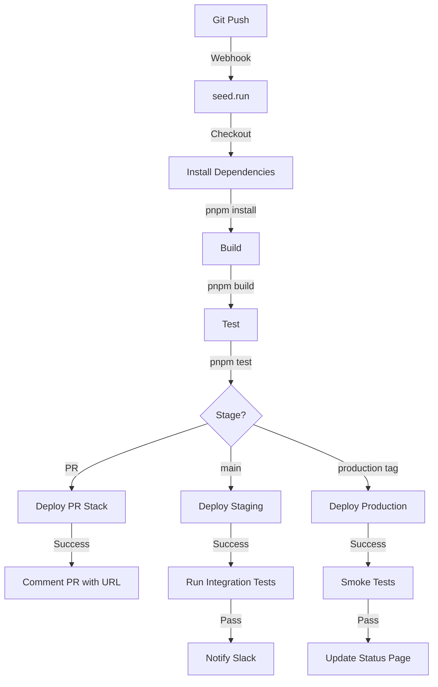

**Deployment Commands**:

```bash
# Deploy to development
$ pnpm sst deploy --stage dev

# Deploy to staging
$ pnpm sst deploy --stage staging

# Deploy to production
$ pnpm sst deploy --stage production

# Remove a stack
$ pnpm sst remove --stage dev
```

**Environment Variables** (stored in AWS SSM Parameter Store):

```typescript
// Retrieved in Lambda functions
import { SSM } from '@aws-sdk/client-ssm'

const ssm = new SSM({ region: 'us-west-2' })

async function getSecret(name: string): Promise<string> {
  const response = await ssm.getParameter({
    Name: `/sst/${process.env.SST_STAGE}/${name}`,
    WithDecryption: true,
  })
  return response.Parameter?.Value ?? ''
}

// Usage
const servicePrivateKey = await getSecret('SERVICE_PRIVATE_KEY')
const stripeAPIKey = await getSecret('STRIPE_API_KEY')
```

---

## upload-api Component

### Purpose

**upload-api**는 w3up 프로토콜의 HTTP 게이트웨이입니다. 클라이언트로부터 UCAN Invocation을 받아 적절한 capability handler로 라우팅하고 결과를 반환합니다.

### Architecture

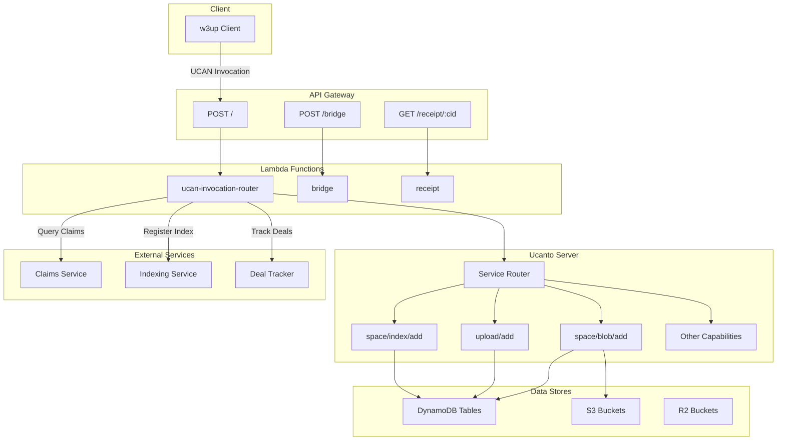

### Lambda Functions

#### 1. **ucan-invocation-router.js**

메인 엔트리포인트로 모든 UCAN Invocation을 처리합니다.

```javascript
import * as Sentry from '@sentry/serverless'
import * as UploadAPI from '@storacha/upload-api'
import { fromLambdaRequest, toLambdaResponse } from './lambda-utils.js'
import { getLambdaEnv, getServiceSigner } from './config.js'

Sentry.AWSLambda.init({
  environment: process.env.SST_STAGE,
  dsn: process.env.SENTRY_DSN,
  tracesSampleRate: 0.1,
})

/**
 * AWS Lambda handler for UCAN invocations
 */
export const ucanInvocationRouter = Sentry.AWSLambda.wrapHandler(
  async (event, context) => {
    // 1. Extract environment configuration
    const env = getLambdaEnv()
    const {
      uploadTableName,
      storeTableName,
      delegationTableName,
      subscriptionTableName,
      carparkBucketName,
      serviceDID,
      servicePrivateKey,
      claimsServiceURL,
      indexingServiceURL,
      dealTrackerURL,
    } = env

    // 2. Validate request
    if (!event.body) {
      return {
        statusCode: 400,
        body: JSON.stringify({ error: 'Missing request body' }),
      }
    }

    // 3. Initialize service signer
    const serviceSigner = getServiceSigner({
      did: serviceDID,
      privateKey: servicePrivateKey,
    })

    // 4. Create DynamoDB table clients
    const uploadStore = createUploadStore(uploadTableName)
    const storeStore = createStoreStore(storeTableName)
    const delegationStore = createDelegationStore(delegationTableName)
    const subscriptionStore = createSubscriptionStore(subscriptionTableName)

    // 5. Create S3 bucket clients
    const carparkBucket = createBucketClient(carparkBucketName)

    // 6. Create external service connections
    const claimsService = UploadAPI.connectClaims({
      url: new URL(claimsServiceURL),
    })

    const indexingService = UploadAPI.connectIndexing({
      url: new URL(indexingServiceURL),
    })

    const dealTrackerService = UploadAPI.connectDealTracker({
      url: new URL(dealTrackerURL),
    })

    // 7. Create Ucanto server with all capability handlers
    const server = UploadAPI.createServer({
      id: serviceSigner,

      // Capability handlers context
      upload: uploadStore,
      store: storeStore,
      delegations: delegationStore,
      subscriptions: subscriptionStore,
      bucket: carparkBucket,

      // External services
      claimsService,
      indexingService,
      dealTrackerService,

      // Configuration
      maxUploadSize: 127 * (1 << 25),  // ~4GB

      // Error reporting
      errorReporter: {
        catch: (err) => {
          console.error('Server error:', err)
          Sentry.captureException(err)
        },
      },
    })

    // 8. Convert Lambda event to Ucanto request
    const request = fromLambdaRequest(event)

    // 9. Handle the request
    const response = await server.request(request)

    // 10. Convert Ucanto response to Lambda response
    return toLambdaResponse(response)
  }
)
```

**Request/Response Transformation**:

```typescript
// lambda-utils.js
import { CAR } from '@ucanto/transport'
import { CBOR } from '@ucanto/transport'

/**
 * Convert AWS Lambda event to Ucanto request
 */
export function fromLambdaRequest(event: LambdaEvent): UcantoRequest {
  const headers = new Headers(event.headers)

  // Determine content encoding
  const contentType = headers.get('content-type') || 'application/vnd.ipld.car'

  // Decode body based on content type
  let body: Uint8Array
  if (event.isBase64Encoded) {
    body = Buffer.from(event.body, 'base64')
  } else {
    body = Buffer.from(event.body, 'utf-8')
  }

  return {
    headers,
    body,
  }
}

/**
 * Convert Ucanto response to AWS Lambda response
 */
export function toLambdaResponse(response: UcantoResponse): LambdaResponse {
  // Encode response body
  const body = Buffer.from(response.body).toString('base64')

  // Convert headers
  const headers: Record<string, string> = {}
  response.headers.forEach((value, key) => {
    headers[key] = value
  })

  return {
    statusCode: response.status || 200,
    headers,
    body,
    isBase64Encoded: true,
  }
}
```

#### 2. **bridge.js**

Legacy Bridge API를 위한 핸들러입니다 (backwards compatibility).

```javascript
/**
 * Bridge handler for legacy clients
 * Converts old API calls to UCAN invocations
 */
export async function handler(event) {
  const { path, queryStringParameters, body } = event

  // Parse legacy request
  const legacyRequest = JSON.parse(body)

  // Convert to UCAN invocation
  const invocation = convertLegacyToUCAN(legacyRequest)

  // Forward to main router
  return await ucanInvocationRouter({
    ...event,
    body: invocation,
  })
}

function convertLegacyToUCAN(legacy: LegacyRequest): string {
  // Map legacy operations to UCAN capabilities
  const capabilityMap = {
    'store/add': 'space/blob/add',
    'upload/add': 'upload/add',
    'upload/list': 'upload/list',
    'upload/remove': 'upload/remove',
  }

  const capability = capabilityMap[legacy.operation]
  if (!capability) {
    throw new Error(`Unknown legacy operation: ${legacy.operation}`)
  }

  // Create UCAN invocation
  return createInvocation({
    capability: {
      can: capability,
      with: legacy.space,
      nb: legacy.params,
    },
    proofs: legacy.proofs,
  })
}
```

#### 3. **receipt.js**

UCAN 실행 결과(receipt)를 반환합니다.

```javascript
import { S3Client, GetObjectCommand } from '@aws-sdk/client-s3'

const s3 = new S3Client({ region: 'us-west-2' })

/**
 * Retrieve UCAN receipt by CID
 */
export async function handler(event) {
  const { cid } = event.pathParameters
  const receiptBucket = process.env.RECEIPT_BUCKET_NAME

  try {
    // Fetch receipt from S3
    const command = new GetObjectCommand({
      Bucket: receiptBucket,
      Key: `receipts/${cid}.car`,
    })

    const response = await s3.send(command)
    const body = await streamToBuffer(response.Body)

    return {
      statusCode: 200,
      headers: {
        'Content-Type': 'application/vnd.ipld.car',
        'Cache-Control': 'public, max-age=31536000, immutable',
      },
      body: body.toString('base64'),
      isBase64Encoded: true,
    }
  } catch (error) {
    if (error.name === 'NoSuchKey') {
      return {
        statusCode: 404,
        body: JSON.stringify({ error: 'Receipt not found' }),
      }
    }

    throw error
  }
}

async function streamToBuffer(stream) {
  const chunks = []
  for await (const chunk of stream) {
    chunks.push(chunk)
  }
  return Buffer.concat(chunks)
}
```

#### 4. **metrics.js**

시스템 메트릭을 반환합니다.

```javascript
import { DynamoDBClient } from '@aws-sdk/client-dynamodb'
import { DynamoDBDocumentClient, QueryCommand } from '@aws-sdk/lib-dynamodb'

const dynamodb = DynamoDBDocumentClient.from(new DynamoDBClient({}))

/**
 * Return system metrics
 */
export async function handler(event) {
  const { space, startDate, endDate } = event.queryStringParameters || {}

  if (!space) {
    return {
      statusCode: 400,
      body: JSON.stringify({ error: 'Missing space parameter' }),
    }
  }

  // Query space metrics table
  const command = new QueryCommand({
    TableName: process.env.SPACE_METRICS_TABLE_NAME,
    KeyConditionExpression: 'space = :space AND #date BETWEEN :start AND :end',
    ExpressionAttributeNames: {
      '#date': 'date',
    },
    ExpressionAttributeValues: {
      ':space': space,
      ':start': startDate || '2024-01-01',
      ':end': endDate || new Date().toISOString().split('T')[0],
    },
  })

  const response = await dynamodb.send(command)

  // Aggregate metrics
  const metrics = response.Items.reduce((acc, item) => {
    acc.totalUploads += item.uploads || 0
    acc.totalBytes += item.bytes || 0
    acc.totalBlobs += item.blobs || 0
    return acc
  }, {
    totalUploads: 0,
    totalBytes: 0,
    totalBlobs: 0,
  })

  return {
    statusCode: 200,
    headers: {
      'Content-Type': 'application/json',
    },
    body: JSON.stringify({
      space,
      startDate,
      endDate,
      metrics,
      daily: response.Items,
    }),
  }
}
```

#### 5. **space-metrics.js**

Space별 사용량 메트릭을 수집합니다 (Cron job).

```javascript
/**
 * Collect daily space metrics (runs every hour)
 */
export async function handler(event) {
  const today = new Date().toISOString().split('T')[0]

  // Get all active spaces from subscription table
  const spaces = await getAllActiveSpaces()

  // Process each space
  const results = await Promise.allSettled(
    spaces.map(space => collectSpaceMetrics(space, today))
  )

  const succeeded = results.filter(r => r.status === 'fulfilled').length
  const failed = results.filter(r => r.status === 'rejected').length

  console.log(`Metrics collected: ${succeeded} succeeded, ${failed} failed`)

  return {
    statusCode: 200,
    body: JSON.stringify({ succeeded, failed }),
  }
}

async function collectSpaceMetrics(space: string, date: string) {
  // Query upload table for this space
  const uploads = await queryUploads(space, date)

  // Query store table for this space
  const blobs = await queryBlobs(space, date)

  // Calculate totals
  const metrics = {
    space,
    date,
    uploads: uploads.length,
    bytes: blobs.reduce((sum, b) => sum + b.size, 0),
    blobs: blobs.length,
    updatedAt: new Date().toISOString(),
  }

  // Write to space-metrics table
  await putMetrics(metrics)

  return metrics
}
```

#### 6. **storefront-cron.js**

Storefront 이벤트를 처리합니다 (Cron job).

```javascript
/**
 * Process storefront events (runs every 5 minutes)
 */
export async function handler(event) {
  // Fetch pending events from consumer table
  const pendingEvents = await getPendingEvents('storefront')

  console.log(`Processing ${pendingEvents.length} storefront events`)

  // Process each event
  for (const event of pendingEvents) {
    try {
      await processStorefrontEvent(event)
      await markEventProcessed(event)
    } catch (error) {
      console.error(`Failed to process event ${event.id}:`, error)
      await markEventFailed(event, error)
    }
  }

  return {
    statusCode: 200,
    body: JSON.stringify({ processed: pendingEvents.length }),
  }
}

async function processStorefrontEvent(event: StorefrontEvent) {
  switch (event.type) {
    case 'subscription.created':
      await handleSubscriptionCreated(event.data)
      break
    case 'subscription.updated':
      await handleSubscriptionUpdated(event.data)
      break
    case 'subscription.deleted':
      await handleSubscriptionDeleted(event.data)
      break
    default:
      console.warn(`Unknown event type: ${event.type}`)
  }
}
```

### Capability Handlers

upload-api는 다양한 UCAN capability를 처리합니다:

#### space/blob/add

```typescript
// Implemented in @storacha/upload-api
import * as BlobAdd from '@storacha/capabilities/space/blob/add'

export const blobAdd = Server.provide(
  BlobAdd,
  async ({ capability, invocation, context }) => {
    const { blob } = capability.nb
    const space = DID.parse(capability.with)

    // 1. Verify space has subscription
    const subscription = await context.subscriptions.get(space)
    if (!subscription) {
      return {
        error: new Error('Space has no active subscription'),
      }
    }

    // 2. Check quota
    const used = await context.store.getUsage(space)
    if (used + blob.size > subscription.quota) {
      return {
        error: new Error('Quota exceeded'),
      }
    }

    // 3. Check if blob already exists
    const existing = await context.store.has({ space, multihash: blob.digest })
    if (existing) {
      return {
        ok: {
          site: existing.site,  // Already stored
        },
      }
    }

    // 4. Allocate storage space (generate presigned URL)
    const allocation = await context.bucket.allocate({
      space,
      blob,
      expiresIn: 3600,  // 1 hour
    })

    // 5. Store blob record in DynamoDB
    await context.store.put({
      space,
      multihash: blob.digest,
      size: blob.size,
      insertedAt: new Date().toISOString(),
    })

    // 6. Return allocation (presigned URL for client upload)
    return {
      ok: {
        site: {
          url: allocation.url,
          headers: allocation.headers,
        },
      },
    }
  }
)
```

#### upload/add

```typescript
import * as UploadAdd from '@storacha/capabilities/upload/add'

export const uploadAdd = Server.provide(
  UploadAdd,
  async ({ capability, invocation, context }) => {
    const { root, shards } = capability.nb
    const space = DID.parse(capability.with)

    // 1. Verify all shards are stored
    for (const shard of shards) {
      const stored = await context.store.has({
        space,
        multihash: shard.multihash,
      })

      if (!stored) {
        return {
          error: new Error(`Shard not stored: ${shard}`),
        }
      }
    }

    // 2. Check if upload already exists
    const existing = await context.upload.get({ space, root })
    if (existing) {
      return {
        ok: existing,
      }
    }

    // 3. Register upload
    await context.upload.put({
      space,
      root,
      shards: shards.map(s => s.toString()),
      insertedAt: new Date().toISOString(),
    })

    // 4. Trigger Filecoin offering (async)
    await context.dealTrackerService.offer({
      space,
      root,
      shards,
    })

    // 5. Return success
    return {
      ok: {
        root,
        shards,
      },
    }
  }
)
```

---

## carpark Component

### Purpose

**carpark**는 CAR 파일을 저장하고 새로운 CAR 파일이 추가될 때 이를 알리는 이벤트 기반 컴포넌트입니다.

### Architecture

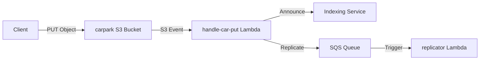

### S3 Bucket Configuration

```typescript
// stacks/carpark-stack.js
export function carparkStack({ stack, app }) {
  const config = getConfig(app.stage)

  // CAR file storage bucket
  const carparkBucket = new Bucket(stack, 'carpark', {
    name: config.carparkBucketName,

    // CORS for client uploads
    cors: [{
      allowedOrigins: ['*'],
      allowedMethods: ['GET', 'PUT', 'POST'],
      allowedHeaders: ['*'],
      exposedHeaders: ['ETag', 'Content-Length'],
      maxAge: 3000,
    }],

    // Lifecycle rules
    lifecycleRules: [{
      // Delete incomplete multipart uploads after 7 days
      id: 'cleanup-incomplete-uploads',
      abortIncompleteMultipartUpload: {
        daysAfterInitiation: 7,
      },
      enabled: true,
    }],

    // Encryption
    encryption: 'aws:kms',

    // Versioning (disabled for cost)
    versioned: false,
  })

  // S3 event notifications
  carparkBucket.addNotifications(stack, {
    // Trigger on new CAR file
    onCarPut: {
      function: {
        handler: 'carpark/functions/handle-car-put.handler',
        timeout: 15,
        memorySize: 512,
        environment: {
          CARPARK_BUCKET_NAME: carparkBucket.bucketName,
          INDEXING_SERVICE_URL: config.indexingServiceURL,
          REPLICATION_QUEUE_URL: config.replicationQueueURL,
        },
        permissions: [carparkBucket],
      },
      events: ['object_created'],
      filters: [
        { suffix: '.car' },
      ],
    },
  })

  return { carparkBucket }
}
```

### Event Handler

```javascript
// carpark/functions/handle-car-put.js
import { S3Client, GetObjectCommand, HeadObjectCommand } from '@aws-sdk/client-s3'
import { SQSClient, SendMessageCommand } from '@aws-sdk/client-sqs'
import { CID } from 'multiformats/cid'
import * as CAR from '@ipld/car'

const s3 = new S3Client({ region: 'us-west-2' })
const sqs = new SQSClient({ region: 'us-west-2' })

/**
 * Handle new CAR file in carpark bucket
 */
export async function handler(event) {
  const results = []

  // Process each S3 record
  for (const record of event.Records) {
    const bucket = record.s3.bucket.name
    const key = decodeURIComponent(record.s3.object.key.replace(/\+/g, ' '))

    console.log(`Processing CAR file: s3://${bucket}/${key}`)

    try {
      // 1. Get object metadata
      const headResponse = await s3.send(new HeadObjectCommand({
        Bucket: bucket,
        Key: key,
      }))

      const size = headResponse.ContentLength
      const etag = headResponse.ETag?.replace(/"/g, '')

      // 2. Extract CAR CID from key (format: {space}/{multihash}.car)
      const [space, filename] = key.split('/')
      const multihash = filename.replace('.car', '')

      // 3. Parse CAR file to get roots
      const carStream = await getCarStream(bucket, key)
      const reader = await CAR.CarReader.fromIterable(carStream)
      const roots = await reader.getRoots()

      console.log(`CAR roots: ${roots.map(r => r.toString()).join(', ')}`)

      // 4. Announce to indexing service
      await announceToIndexer({
        space,
        multihash,
        size,
        roots,
        url: `https://${bucket}.s3.us-west-2.amazonaws.com/${key}`,
      })

      // 5. Queue for replication
      await queueForReplication({
        bucket,
        key,
        size,
        space,
        multihash,
      })

      results.push({ key, status: 'success' })
    } catch (error) {
      console.error(`Failed to process ${key}:`, error)
      results.push({ key, status: 'failed', error: error.message })
    }
  }

  return {
    statusCode: 200,
    body: JSON.stringify({ results }),
  }
}

/**
 * Get CAR file as stream
 */
async function getCarStream(bucket: string, key: string) {
  const response = await s3.send(new GetObjectCommand({
    Bucket: bucket,
    Key: key,
  }))

  return response.Body
}

/**
 * Announce CAR to indexing service
 */
async function announceToIndexer(car: CarInfo) {
  const indexingURL = process.env.INDEXING_SERVICE_URL

  const response = await fetch(`${indexingURL}/ingest`, {
    method: 'POST',
    headers: {
      'Content-Type': 'application/json',
    },
    body: JSON.stringify({
      space: car.space,
      multihash: car.multihash,
      size: car.size,
      roots: car.roots.map(r => r.toString()),
      url: car.url,
    }),
  })

  if (!response.ok) {
    throw new Error(`Indexer returned ${response.status}: ${await response.text()}`)
  }

  console.log(`Announced to indexer: ${car.multihash}`)
}

/**
 * Queue CAR for replication to R2
 */
async function queueForReplication(car: ReplicationTask) {
  const queueURL = process.env.REPLICATION_QUEUE_URL

  await sqs.send(new SendMessageCommand({
    QueueUrl: queueURL,
    MessageBody: JSON.stringify(car),
    MessageAttributes: {
      'size': {
        DataType: 'Number',
        StringValue: car.size.toString(),
      },
    },
  }))

  console.log(`Queued for replication: ${car.key}`)
}
```

### Presigned URL Generation

upload-api에서 클라이언트에게 CAR 업로드를 위한 presigned URL을 생성합니다:

```typescript
// upload-api/buckets/carpark.js
import { S3Client, PutObjectCommand } from '@aws-sdk/client-s3'
import { getSignedUrl } from '@aws-sdk/s3-request-presigner'

const s3 = new S3Client({ region: 'us-west-2' })

/**
 * Generate presigned URL for CAR upload
 */
export async function allocate(options: AllocateOptions): Promise<BlobAddress> {
  const { space, blob, expiresIn = 3600 } = options

  // Construct S3 key: {space}/{multihash}.car
  const key = `${space}/${blob.digest.toString()}.car`

  // Create PutObject command
  const command = new PutObjectCommand({
    Bucket: process.env.CARPARK_BUCKET_NAME,
    Key: key,
    ContentLength: blob.size,
    ContentType: 'application/vnd.ipld.car',
    Metadata: {
      'space': space,
      'multihash': blob.digest.toString(),
      'size': blob.size.toString(),
    },
  })

  // Generate presigned URL
  const url = await getSignedUrl(s3, command, {
    expiresIn,  // URL expires in 1 hour
  })

  return {
    url,
    headers: {
      'Content-Type': 'application/vnd.ipld.car',
      'Content-Length': blob.size.toString(),
    },
    expires: Math.floor(Date.now() / 1000) + expiresIn,
  }
}

/**
 * Check if blob exists in carpark
 */
export async function has(options: HasOptions): Promise<boolean> {
  const { space, multihash } = options
  const key = `${space}/${multihash.toString()}.car`

  try {
    await s3.send(new HeadObjectCommand({
      Bucket: process.env.CARPARK_BUCKET_NAME,
      Key: key,
    }))
    return true
  } catch (error) {
    if (error.name === 'NotFound') {
      return false
    }
    throw error
  }
}
```

### Client Upload Flow

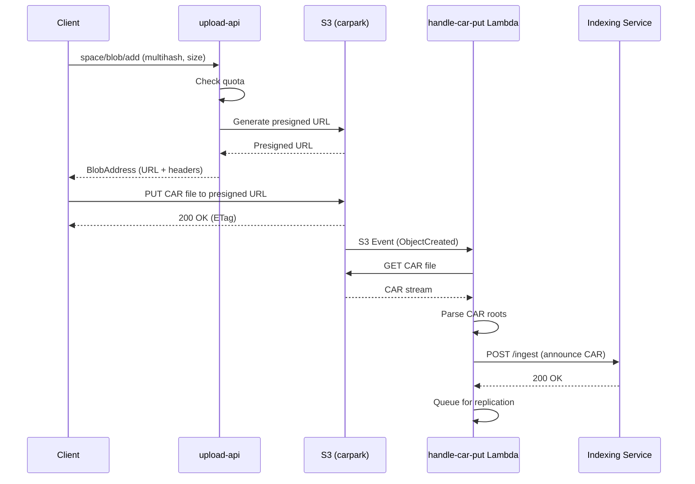

---

**[End of Part 1]**

Part 1에서는 w3infra의 전체 구조, SST 아키텍처, upload-api의 Lambda 핸들러들, 그리고 carpark 컴포넌트를 다루었습니다.

---

# 05. Infrastructure Components (Part 2)

## Table of Contents - Part 2
- [replicator Component](#replicator-component)
- [filecoin Component](#filecoin-component)
- [indexer Component](#indexer-component)
- [billing Component](#billing-component)
- [Additional Services](#additional-services)

---

## replicator Component

### Purpose

**replicator**는 S3에 저장된 CAR 파일을 Cloudflare R2로 복제하는 Lambda 함수입니다. R2는 글로벌 CDN을 통해 빠른 데이터 액세스를 제공하며, S3보다 저렴한 egress 비용을 제공합니다.

### Why Replicate to R2?

#### Cost Optimization

| Storage | Egress Cost | Use Case |
|---------|-------------|----------|
| **S3** | $0.09/GB | Primary storage, AWS-internal access |
| **R2** | $0.00/GB | Public downloads, global CDN |
| **Filecoin** | $0.00/GB | Cold storage, long-term archival |

#### Performance Benefits

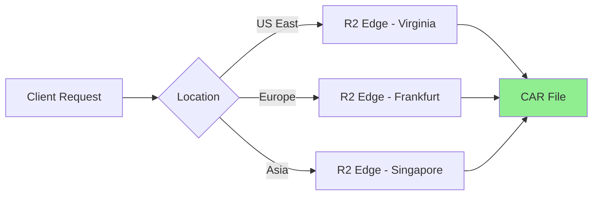

R2는 Cloudflare의 글로벌 엣지 네트워크를 통해 데이터를 제공하므로:
- **낮은 레이턴시**: 사용자와 가까운 엣지에서 제공
- **무료 egress**: 대역폭 비용 없음
- **높은 가용성**: 자동 페일오버

### Architecture

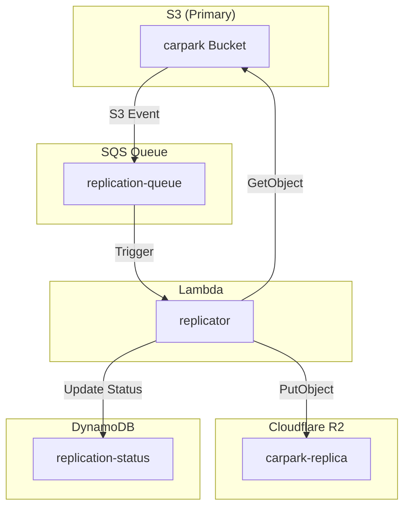

### SQS Queue Configuration

```typescript
// stacks/replicator-stack.js
export function replicatorStack({ stack, app }) {
  const config = getConfig(app.stage)

  // Replication queue
  const replicationQueue = new Queue(stack, 'replication-queue', {
    // Visibility timeout (Lambda runtime)
    consumer: {
      function: {
        handler: 'replicator/functions/replicate.handler',
        timeout: 900,  // 15 minutes
        memorySize: 2048,
        environment: {
          // Source (S3)
          SOURCE_BUCKET_NAME: config.carparkBucketName,
          SOURCE_REGION: 'us-west-2',

          // Destination (R2)
          R2_ACCOUNT_ID: config.r2AccountId,
          R2_BUCKET_NAME: config.r2BucketName,
          R2_ACCESS_KEY_ID: config.r2AccessKeyId,
          R2_SECRET_ACCESS_KEY: config.r2SecretAccessKey,

          // Status tracking
          REPLICATION_STATUS_TABLE: config.replicationStatusTable,
        },
      },

      // Batch settings
      batchSize: 10,  // Process 10 messages at once
      maxBatchingWindow: '10 seconds',

      // Retry policy
      cdk: {
        eventSource: {
          maxConcurrency: 100,  // Max parallel Lambda invocations
          reportBatchItemFailures: true,  // Partial batch failures
        },
      },
    },
  })

  // Dead letter queue (DLQ) for failed replications
  const dlq = new Queue(stack, 'replication-dlq', {
    consumer: {
      function: {
        handler: 'replicator/functions/handle-dlq.handler',
        timeout: 60,
      },
    },
  })

  replicationQueue.cdk.queue.addToDeadLetterQueue({
    queue: dlq.cdk.queue,
    maxReceiveCount: 3,  // Retry 3 times before DLQ
  })

  return { replicationQueue, dlq }
}
```

### Replication Lambda

```javascript
// replicator/functions/replicate.js
import { S3Client, GetObjectCommand } from '@aws-sdk/client-s3'
import { S3Client as R2Client, PutObjectCommand } from '@aws-sdk/client-s3'
import { DynamoDBClient } from '@aws-sdk/client-dynamodb'
import { DynamoDBDocumentClient, PutCommand } from '@aws-sdk/lib-dynamodb'
import crypto from 'crypto'

// S3 client for source
const s3 = new S3Client({ region: 'us-west-2' })

// R2 client (S3-compatible)
const r2 = new R2Client({
  region: 'auto',
  endpoint: `https://${process.env.R2_ACCOUNT_ID}.r2.cloudflarestorage.com`,
  credentials: {
    accessKeyId: process.env.R2_ACCESS_KEY_ID,
    secretAccessKey: process.env.R2_SECRET_ACCESS_KEY,
  },
})

const dynamodb = DynamoDBDocumentClient.from(new DynamoDBClient({}))

/**
 * Replicate CAR files from S3 to R2
 */
export async function handler(event) {
  const results = []

  for (const record of event.Records) {
    const message = JSON.parse(record.body)
    const { bucket, key, size, space, multihash } = message

    console.log(`Replicating: s3://${bucket}/${key} (${size} bytes)`)

    try {
      // 1. Download from S3
      const startDownload = Date.now()
      const s3Response = await s3.send(new GetObjectCommand({
        Bucket: bucket,
        Key: key,
      }))

      const body = await streamToBuffer(s3Response.Body)
      const downloadTime = Date.now() - startDownload

      // 2. Verify integrity (optional but recommended)
      const hash = crypto.createHash('sha256').update(body).digest('hex')
      const etag = s3Response.ETag?.replace(/"/g, '')

      // 3. Upload to R2
      const startUpload = Date.now()
      const r2Response = await r2.send(new PutObjectCommand({
        Bucket: process.env.R2_BUCKET_NAME,
        Key: key,
        Body: body,
        ContentType: 'application/vnd.ipld.car',
        ContentLength: size,
        Metadata: {
          'source-bucket': bucket,
          'source-etag': etag,
          'space': space,
          'multihash': multihash,
          'replicated-at': new Date().toISOString(),
        },
      }))

      const uploadTime = Date.now() - startUpload

      // 4. Record replication status
      await dynamodb.send(new PutCommand({
        TableName: process.env.REPLICATION_STATUS_TABLE,
        Item: {
          key,
          space,
          multihash,
          sourceETag: etag,
          destinationETag: r2Response.ETag?.replace(/"/g, ''),
          size,
          downloadTime,
          uploadTime,
          totalTime: downloadTime + uploadTime,
          replicatedAt: new Date().toISOString(),
          status: 'completed',
        },
      }))

      console.log(
        `✓ Replicated ${key} in ${downloadTime + uploadTime}ms ` +
        `(↓${downloadTime}ms, ↑${uploadTime}ms)`
      )

      results.push({ key, status: 'success' })
    } catch (error) {
      console.error(`✗ Failed to replicate ${key}:`, error)

      // Record failure
      await dynamodb.send(new PutCommand({
        TableName: process.env.REPLICATION_STATUS_TABLE,
        Item: {
          key,
          space,
          multihash,
          size,
          status: 'failed',
          error: error.message,
          failedAt: new Date().toISOString(),
        },
      }))

      results.push({ key, status: 'failed', error: error.message })

      // Re-throw to trigger SQS retry
      throw error
    }
  }

  return {
    statusCode: 200,
    body: JSON.stringify({ results }),
  }
}

async function streamToBuffer(stream) {
  const chunks = []
  for await (const chunk of stream) {
    chunks.push(chunk)
  }
  return Buffer.concat(chunks)
}
```

### Dead Letter Queue Handler

```javascript
// replicator/functions/handle-dlq.js
import { SNSClient, PublishCommand } from '@aws-sdk/client-sns'

const sns = new SNSClient({ region: 'us-west-2' })

/**
 * Handle failed replications from DLQ
 */
export async function handler(event) {
  for (const record of event.Records) {
    const message = JSON.parse(record.body)
    const { key, space, multihash, size } = message

    console.error(`Replication permanently failed: ${key}`)

    // Send alert to operations team
    await sns.send(new PublishCommand({
      TopicArn: process.env.ALERT_TOPIC_ARN,
      Subject: `[ALERT] Replication Failed: ${key}`,
      Message: JSON.stringify({
        severity: 'error',
        component: 'replicator',
        key,
        space,
        multihash,
        size,
        message: 'CAR file failed to replicate after 3 retries',
        timestamp: new Date().toISOString(),
      }, null, 2),
    }))

    // Store in failed replications table for manual retry
    await storeFailed Replication({
      key,
      space,
      multihash,
      size,
      attempts: 3,
      lastError: record.messageAttributes?.errorMessage,
    })
  }

  return {
    statusCode: 200,
    body: JSON.stringify({ processed: event.Records.length }),
  }
}
```

### Monitoring & Metrics

```javascript
// replicator/utils/metrics.js
import { CloudWatchClient, PutMetricDataCommand } from '@aws-sdk/client-cloudwatch'

const cloudwatch = new CloudWatchClient({ region: 'us-west-2' })

/**
 * Publish replication metrics to CloudWatch
 */
export async function publishMetrics(metrics: ReplicationMetrics) {
  await cloudwatch.send(new PutMetricDataCommand({
    Namespace: 'W3Infra/Replicator',
    MetricData: [
      {
        MetricName: 'ReplicationTime',
        Value: metrics.totalTime,
        Unit: 'Milliseconds',
        Dimensions: [
          { Name: 'Component', Value: 'replicator' },
        ],
      },
      {
        MetricName: 'ReplicationSize',
        Value: metrics.size,
        Unit: 'Bytes',
        Dimensions: [
          { Name: 'Component', Value: 'replicator' },
        ],
      },
      {
        MetricName: 'ReplicationSuccess',
        Value: 1,
        Unit: 'Count',
        Dimensions: [
          { Name: 'Component', Value: 'replicator' },
          { Name: 'Status', Value: 'success' },
        ],
      },
    ],
  }))
}
```

### Replication Flow

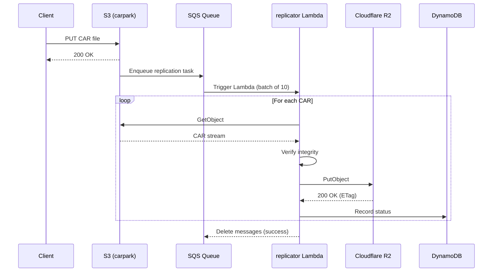

---

## filecoin Component

### Purpose

**filecoin** 컴포넌트는 Storacha에 업로드된 데이터를 Filecoin 네트워크에 저장합니다. Filecoin은 장기 보관을 위한 cold storage 레이어입니다.

### Filecoin Storage Architecture

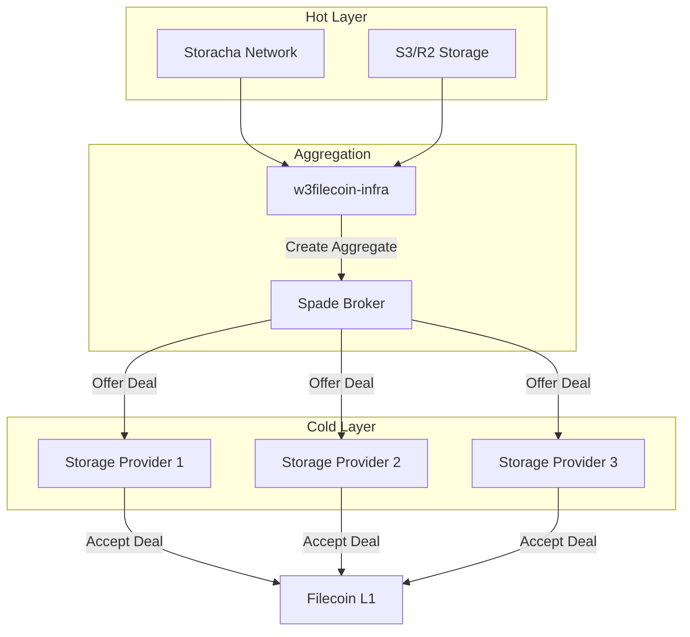

### Key Concepts

#### 1. **Piece**

Filecoin의 기본 저장 단위입니다.

```typescript
interface Piece {
  // Piece CID (Commitment of Data)
  cid: string  // "baga6ea4seaq..."

  // Size (must be power of 2)
  size: number  // 256 MiB, 512 MiB, 1 GiB, etc.

  // Original CAR CIDs included in this piece
  carCIDs: string[]
}
```

**Piece Generation**:
```javascript
import { piece } from '@web3-storage/data-segment'

// Generate piece CID from CAR file
async function generatePiece(carBytes: Uint8Array): Promise<Piece> {
  // 1. Pad to power of 2
  const paddedSize = nextPowerOfTwo(carBytes.length)
  const padded = new Uint8Array(paddedSize)
  padded.set(carBytes)

  // 2. Build Merkle tree (Fr32 padding)
  const commitment = await piece.build(padded)

  // 3. Create Piece CID
  const pieceCID = piece.toCID(commitment)

  return {
    cid: pieceCID.toString(),
    size: paddedSize,
    carCIDs: [extractCarCID(carBytes)],
  }
}
```

#### 2. **Aggregate**

여러 Piece를 묶어 하나의 Deal로 만듭니다.

```typescript
interface Aggregate {
  // Aggregate Piece CID
  pieceCID: string

  // Total size
  size: number  // Typically 32 GiB

  // Individual pieces in this aggregate
  pieces: Piece[]

  // Build recipe (how to construct this aggregate)
  recipe: AggregateRecipe
}

interface AggregateRecipe {
  pieces: Array<{
    cid: string
    url: string      // Where to fetch piece
    offset: number   // Offset in aggregate
    size: number
  }>
}
```

#### 3. **Spade Broker**

Spade는 Aggregate를 Storage Provider(SP)에게 제공하는 마켓플레이스입니다.

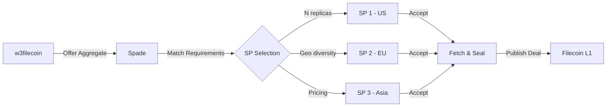

### w3filecoin-infra

Storacha는 별도의 w3filecoin-infra 저장소로 Filecoin 통합을 관리합니다.

**Pipeline Stages**:

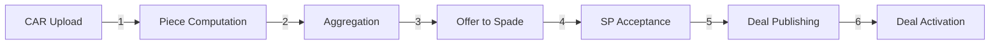

### Filecoin Service Implementation

```javascript
// filecoin/service.js
import * as Sentry from '@sentry/serverless'

Sentry.AWSLambda.init({
  environment: process.env.SST_STAGE,
  dsn: process.env.SENTRY_DSN,
})

/**
 * Filecoin service configuration
 */
export const createFilecoinService = (context) => {
  return {
    // Compute piece CID for a CAR
    computePiece: async ({ carCID, carURL }) => {
      return await computePieceCID(carCID, carURL)
    },

    // Offer piece for aggregation
    offerPiece: async ({ pieceCID, size, carCID }) => {
      return await offerToAggregator(pieceCID, size, carCID)
    },

    // Query deal status
    getDealStatus: async ({ pieceCID }) => {
      return await queryDealStatus(pieceCID)
    },

    // Handle deal notifications
    handleDealUpdate: async ({ pieceCID, dealID, status }) => {
      return await updateDealRecord(pieceCID, dealID, status)
    },
  }
}
```

### Lambda Functions

#### 1. **piece-offer.js** - Offer pieces to Spade

```javascript
// filecoin/functions/piece-offer.js
import { DynamoDBClient } from '@aws-sdk/client-dynamodb'
import { DynamoDBDocumentClient, QueryCommand, UpdateCommand } from '@aws-sdk/lib-dynamodb'

const dynamodb = DynamoDBDocumentClient.from(new DynamoDBClient({}))

/**
 * Offer pieces to Spade for aggregation
 * Runs every 5 minutes
 */
export async function handler(event) {
  const spadeURL = process.env.SPADE_URL
  const minPieceSize = 256 * 1024 * 1024  // 256 MiB

  // 1. Query pieces pending aggregation
  const pendingPieces = await getPendingPieces(minPieceSize)

  console.log(`Found ${pendingPieces.length} pieces pending aggregation`)

  // 2. Offer each piece to Spade
  const results = await Promise.allSettled(
    pendingPieces.map(piece => offerPiece(spadeURL, piece))
  )

  const succeeded = results.filter(r => r.status === 'fulfilled').length
  const failed = results.filter(r => r.status === 'rejected').length

  console.log(`Offered: ${succeeded} succeeded, ${failed} failed`)

  return {
    statusCode: 200,
    body: JSON.stringify({ succeeded, failed }),
  }
}

/**
 * Get pieces that are ready for aggregation
 */
async function getPendingPieces(minSize: number) {
  const response = await dynamodb.send(new QueryCommand({
    TableName: process.env.FILECOIN_PIECE_TABLE,
    IndexName: 'status-index',
    KeyConditionExpression: '#status = :pending',
    FilterExpression: '#size >= :minSize',
    ExpressionAttributeNames: {
      '#status': 'status',
      '#size': 'size',
    },
    ExpressionAttributeValues: {
      ':pending': 'pending',
      ':minSize': minSize,
    },
    Limit: 1000,
  }))

  return response.Items || []
}

/**
 * Offer piece to Spade
 */
async function offerPiece(spadeURL: string, piece: Piece) {
  const response = await fetch(`${spadeURL}/offer`, {
    method: 'POST',
    headers: {
      'Content-Type': 'application/json',
      'Authorization': `Bearer ${process.env.SPADE_API_KEY}`,
    },
    body: JSON.stringify({
      pieceCID: piece.pieceCID,
      size: piece.size,
      carCID: piece.carCID,
      url: piece.url,

      // Requirements
      replicas: 3,
      duration: 180 * 24 * 3600,  // 180 days
      geoDiversity: true,
      minReplication: 2,
    }),
  })

  if (!response.ok) {
    throw new Error(`Spade returned ${response.status}: ${await response.text()}`)
  }

  const data = await response.json()

  // Update piece status
  await dynamodb.send(new UpdateCommand({
    TableName: process.env.FILECOIN_PIECE_TABLE,
    Key: { pieceCID: piece.pieceCID },
    UpdateExpression: 'SET #status = :offered, offeredAt = :now, offerId = :id',
    ExpressionAttributeNames: {
      '#status': 'status',
    },
    ExpressionAttributeValues: {
      ':offered': 'offered',
      ':now': new Date().toISOString(),
      ':id': data.offerId,
    },
  }))

  console.log(`✓ Offered piece ${piece.pieceCID} to Spade (offer ID: ${data.offerId})`)

  return data
}
```

#### 2. **deal-tracker.js** - Track deal status

```javascript
// filecoin/functions/deal-tracker.js
/**
 * Track Filecoin deal status
 * Runs every 15 minutes
 */
export async function handler(event) {
  // 1. Query pieces with active offers
  const activePieces = await getActivePieces()

  console.log(`Tracking ${activePieces.length} active pieces`)

  // 2. Query Spade for deal status
  for (const piece of activePieces) {
    try {
      const status = await querySpadeStatus(piece.offerId)

      // Update piece record
      await updatePieceStatus(piece.pieceCID, status)

      if (status.deals && status.deals.length > 0) {
        console.log(
          `✓ Piece ${piece.pieceCID}: ${status.deals.length} deals ` +
          `(${status.deals.filter(d => d.status === 'active').length} active)`
        )
      }
    } catch (error) {
      console.error(`Failed to track piece ${piece.pieceCID}:`, error)
    }
  }

  return {
    statusCode: 200,
    body: JSON.stringify({ tracked: activePieces.length }),
  }
}

/**
 * Query Spade for offer status
 */
async function querySpadeStatus(offerId: string) {
  const spadeURL = process.env.SPADE_URL

  const response = await fetch(`${spadeURL}/offers/${offerId}`, {
    headers: {
      'Authorization': `Bearer ${process.env.SPADE_API_KEY}`,
    },
  })

  if (!response.ok) {
    throw new Error(`Spade returned ${response.status}`)
  }

  return await response.json()
}

/**
 * Update piece status based on deal information
 */
async function updatePieceStatus(pieceCID: string, status: SpadeStatus) {
  const activeDeals = status.deals?.filter(d => d.status === 'active') || []

  await dynamodb.send(new UpdateCommand({
    TableName: process.env.FILECOIN_PIECE_TABLE,
    Key: { pieceCID },
    UpdateExpression: `
      SET #status = :status,
          deals = :deals,
          activeDeals = :activeDeals,
          lastChecked = :now
    `,
    ExpressionAttributeNames: {
      '#status': 'status',
    },
    ExpressionAttributeValues: {
      ':status': activeDeals.length > 0 ? 'active' : 'offered',
      ':deals': status.deals || [],
      ':activeDeals': activeDeals.length,
      ':now': new Date().toISOString(),
    },
  }))
}
```

#### 3. **webhook.js** - Handle Spade webhooks

```javascript
// filecoin/functions/webhook.js
/**
 * Handle webhooks from Spade
 */
export async function handler(event) {
  const body = JSON.parse(event.body)
  const { eventType, offerId, pieceCID, deal } = body

  console.log(`Webhook: ${eventType} for piece ${pieceCID}`)

  switch (eventType) {
    case 'deal.accepted':
      await handleDealAccepted(pieceCID, deal)
      break

    case 'deal.published':
      await handleDealPublished(pieceCID, deal)
      break

    case 'deal.active':
      await handleDealActive(pieceCID, deal)
      break

    case 'deal.slashed':
      await handleDealSlashed(pieceCID, deal)
      break

    default:
      console.warn(`Unknown event type: ${eventType}`)
  }

  return {
    statusCode: 200,
    body: JSON.stringify({ received: true }),
  }
}

async function handleDealAccepted(pieceCID: string, deal: Deal) {
  console.log(`✓ Deal accepted: ${deal.dealID} (SP: ${deal.provider})`)

  // Update piece record
  await dynamodb.send(new UpdateCommand({
    TableName: process.env.FILECOIN_PIECE_TABLE,
    Key: { pieceCID },
    UpdateExpression: 'SET deals = list_append(if_not_exists(deals, :empty), :deal)',
    ExpressionAttributeValues: {
      ':empty': [],
      ':deal': [{
        dealID: deal.dealID,
        provider: deal.provider,
        status: 'accepted',
        acceptedAt: new Date().toISOString(),
      }],
    },
  }))
}

async function handleDealActive(pieceCID: string, deal: Deal) {
  console.log(`✓ Deal active: ${deal.dealID}`)

  // Update deal status in piece record
  await updateDealStatus(pieceCID, deal.dealID, 'active', {
    activatedAt: new Date().toISOString(),
    expiresAt: deal.expiresAt,
  })

  // Notify upload-api that piece is stored in Filecoin
  await notifyUploadAPI(pieceCID, deal)
}
```

### DynamoDB Schema

```typescript
// filecoin/tables/piece.js
interface PieceRecord {
  // Primary key
  pieceCID: string  // "baga6ea4seaq..."

  // Piece metadata
  size: number
  carCID: string
  url: string

  // Status
  status: 'pending' | 'offered' | 'active' | 'failed'

  // Spade offer
  offerId?: string
  offeredAt?: string

  // Deals
  deals?: Array<{
    dealID: string
    provider: string  // Storage Provider ID (f0...)
    status: 'accepted' | 'published' | 'active' | 'slashed'
    acceptedAt?: string
    publishedAt?: string
    activatedAt?: string
    expiresAt?: string
  }>

  // Tracking
  activeDeals: number
  lastChecked?: string
  createdAt: string
  updatedAt: string
}
```

---

## indexer Component

### Purpose

**indexer** 컴포넌트는 Storacha에 업로드된 콘텐츠를 IPFS 네트워크에서 검색 가능하게 만듭니다. IPNI (InterPlanetary Network Indexer)를 통해 콘텐츠를 광고하고, Elastic IPFS (E-IPFS)를 통해 제공합니다.

### IPNI Overview

**IPNI**는 IPFS 네트워크의 "전화번호부"입니다.

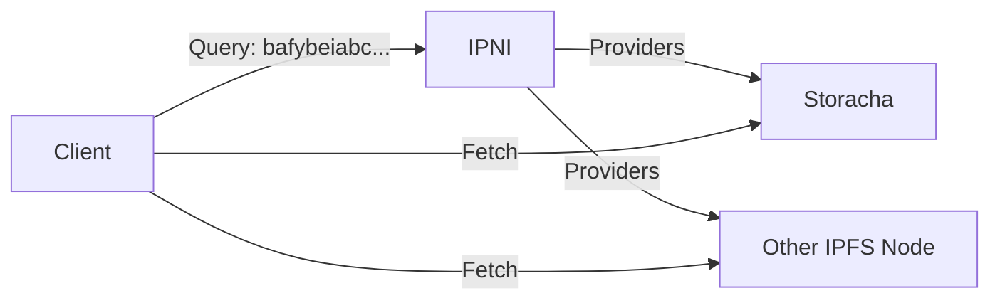

**Key Concepts**:
- **Advertisement**: "나는 이 CID들을 가지고 있어요"
- **Provider**: Advertisement를 게시하는 노드 (Storacha)
- **Index**: CID → Provider 매핑

### Architecture

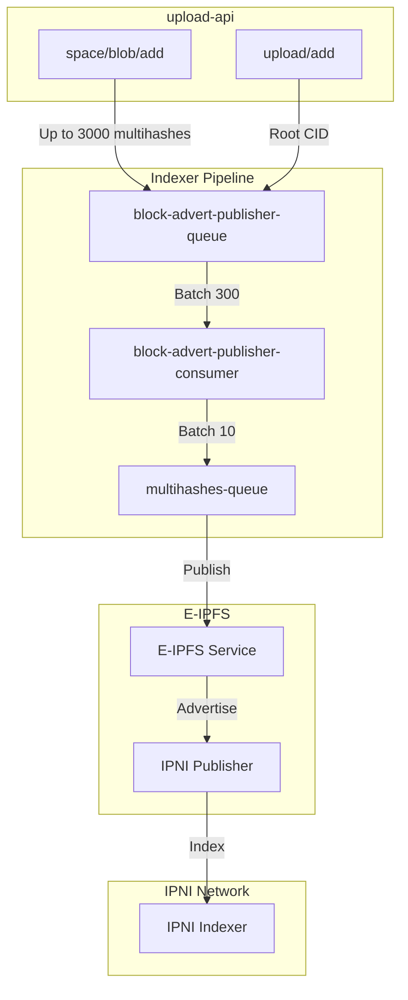

### Why Multiple Queues?

#### Message Size Constraints

```typescript
// Problem: API Gateway timeout = 29 seconds
// Solution: Lambda has 15 minutes

// upload-api generates large batches
interface UploadMessage {
  multihashes: string[]  // Up to 3000 multihashes!
}

// First queue: batch into smaller groups
interface PublisherQueueMessage {
  multihashes: string[]  // Batches of 300
}

// Second queue: E-IPFS expects small batches
interface MultihashQueueMessage {
  multihashes: string[]  // Batches of 10 (SQS limit)
}
```

#### Performance Optimization

```javascript
// Without batching: 3000 SQS messages = slow + expensive
await sqs.send(new SendMessageCommand({
  QueueUrl: multihashesQueue,
  MessageBody: JSON.stringify({ multihash: 'bafy...' })
}))
// → 3000 Lambda invocations

// With batching: 300 SQS messages = fast + cheap
await sqs.send(new SendMessageCommand({
  QueueUrl: publisherQueue,
  MessageBody: JSON.stringify({ multihashes: [...] })  // 300 multihashes
}))
// → 300 Lambda invocations → 30 E-IPFS calls (batches of 10)
```

### Indexer Lambda Functions

#### 1. **block-advert-publisher.js**

```javascript
// indexer/functions/block-advert-publisher.js
import { SQSClient, SendMessageBatchCommand } from '@aws-sdk/client-sqs'
import { DynamoDBClient } from '@aws-sdk/client-dynamodb'
import { DynamoDBDocumentClient, PutCommand } from '@aws-sdk/lib-dynamodb'

const sqs = new SQSClient({ region: 'us-west-2' })
const dynamodb = DynamoDBDocumentClient.from(new DynamoDBClient({}))

/**
 * Consume large batches from upload-api and split into smaller batches
 */
export async function handler(event) {
  const BATCH_SIZE = 10  // SQS/E-IPFS limit
  const multihashesQueue = process.env.MULTIHASHES_QUEUE_URL

  for (const record of event.Records) {
    const message = JSON.parse(record.body)
    const { multihashes, space, root } = message

    console.log(`Processing ${multihashes.length} multihashes for ${root}`)

    // Split into batches of 10
    const batches = chunk(multihashes, BATCH_SIZE)

    // Send to multihashes queue
    for (let i = 0; i < batches.length; i += 10) {
      // SQS SendMessageBatch supports up to 10 messages
      const batch = batches.slice(i, i + 10)

      await sqs.send(new SendMessageBatchCommand({
        QueueUrl: multihashesQueue,
        Entries: batch.map((multihashes, idx) => ({
          Id: `${i + idx}`,
          MessageBody: JSON.stringify({ multihashes, space, root }),
        })),
      }))
    }

    // Record advertisement
    await dynamodb.send(new PutCommand({
      TableName: process.env.ADVERTISEMENTS_TABLE,
      Item: {
        root,
        space,
        multihashes: multihashes.length,
        publishedAt: new Date().toISOString(),
        status: 'queued',
      },
    }))

    console.log(`✓ Queued ${batches.length} batches for ${root}`)
  }

  return {
    statusCode: 200,
    body: JSON.stringify({ processed: event.Records.length }),
  }
}

function chunk<T>(array: T[], size: number): T[][] {
  const chunks = []
  for (let i = 0; i < array.length; i += size) {
    chunks.push(array.slice(i, i + size))
  }
  return chunks
}
```

#### 2. **publish-to-eipfs.js**

```javascript
// indexer/functions/publish-to-eipfs.js
/**
 * Publish multihashes to Elastic IPFS
 */
export async function handler(event) {
  const eipfsURL = process.env.EIPFS_URL
  const eipfsToken = process.env.EIPFS_TOKEN

  const results = []

  for (const record of event.Records) {
    const { multihashes, space, root } = JSON.parse(record.body)

    console.log(`Publishing ${multihashes.length} multihashes to E-IPFS`)

    try {
      // Call E-IPFS ingest endpoint
      const response = await fetch(`${eipfsURL}/ingest`, {
        method: 'POST',
        headers: {
          'Content-Type': 'application/json',
          'Authorization': `Bearer ${eipfsToken}`,
        },
        body: JSON.stringify({
          multihashes,
          provider: {
            id: process.env.PROVIDER_ID,  // Storacha peer ID
            addrs: [
              '/dns4/up.storacha.network/tcp/443/https',
            ],
          },
          context: {
            space,
            root,
          },
        }),
      })

      if (!response.ok) {
        throw new Error(`E-IPFS returned ${response.status}: ${await response.text()}`)
      }

      const data = await response.json()

      console.log(`✓ Published to E-IPFS: ${data.advertisementCID}`)

      results.push({
        root,
        multihashes: multihashes.length,
        advertisementCID: data.advertisementCID,
        status: 'success',
      })
    } catch (error) {
      console.error(`Failed to publish ${root}:`, error)
      results.push({ root, status: 'failed', error: error.message })
      throw error  // Trigger SQS retry
    }
  }

  return {
    statusCode: 200,
    body: JSON.stringify({ results }),
  }
}
```

#### 3. **create-ipni-advert.js** (Alternative approach)

Storacha는 자체 IPNI 라이브러리를 사용하여 Advertisement를 직접 생성할 수도 있습니다.

```javascript
// indexer/functions/create-ipni-advert.js
import * as IPNI from '@storacha/ipni'
import { CID } from 'multiformats/cid'
import * as Signer from '@ucanto/principal/ed25519'

/**
 * Create and publish IPNI advertisement directly
 */
export async function handler(event) {
  // Load provider signing key
  const signer = await Signer.parse(process.env.PROVIDER_PRIVATE_KEY)

  for (const record of event.Records) {
    const { multihashes, space, root } = JSON.parse(record.body)

    // Create advertisement
    const advert = await IPNI.createAdvertisement({
      // Provider info
      provider: signer.did(),
      addresses: [
        '/dns4/up.storacha.network/tcp/443/https',
      ],

      // Multihashes being advertised
      entries: multihashes.map(mh => ({
        multihash: mh,
        metadata: {
          protocol: 'http',
          endpoint: `https://up.storacha.network/ipfs/${root}`,
        },
      })),

      // Context ID (for advertisement chain)
      contextID: Buffer.from(space),

      // Previous advertisement (if any)
      prev: await getLastAdvertisement(space),
    })

    // Sign advertisement
    const signed = await IPNI.sign(advert, signer)

    // Publish to IPNI
    await publishAdvertisement(signed)

    console.log(`✓ Published IPNI advertisement: ${signed.cid}`)
  }

  return {
    statusCode: 200,
    body: JSON.stringify({ processed: event.Records.length }),
  }
}
```

### Advertisement Format

```typescript
// IPNI Advertisement structure
interface Advertisement {
  // Previous advertisement CID (forms a chain)
  PreviousID: CID | null

  // Provider info
  Provider: string  // Peer ID

  // Addresses where content can be fetched
  Addresses: string[]  // Multiaddrs

  // Signature
  Signature: Uint8Array

  // Entries (multihashes)
  Entries: CID  // CID of HAMT containing multihashes

  // Context ID (identifies this advertisement chain)
  ContextID: Uint8Array

  // Metadata
  Metadata: Uint8Array  // CBOR-encoded
}
```

**Example**:
```json
{
  "PreviousID": "baguqeeraiqn7...",
  "Provider": "12D3KooWR19qPPiZH4khepNjS3CLXiB7AbrbAD4ZcDjN1UjGUNE1",
  "Addresses": [
    "/dns4/up.storacha.network/tcp/443/https"
  ],
  "Entries": "bafybeibxm2nsadl3fnxv2sxcxmxaco2jl53wpeorjdzidjwf5aqdg7wa6u",
  "ContextID": "YmFndXFlZXJhb...",
  "Metadata": "oWdwcm90b2NvbGRodHRw",
  "Signature": "3046022100..."
}
```

### Integration with upload-api

```typescript
// upload-api/service.js - After successful upload/add
import { publishAdvertisement } from './indexer.js'

export const uploadAdd = Server.provide(
  UploadAdd,
  async ({ capability, invocation, context }) => {
    const { root, shards } = capability.nb
    const space = DID.parse(capability.with)

    // ... register upload in DynamoDB ...

    // Collect all multihashes from shards
    const multihashes = []
    for (const shard of shards) {
      const blocks = await readCarBlocks(shard)
      for (const block of blocks) {
        multihashes.push(block.cid.multihash)
      }
    }

    // Queue for IPNI advertisement
    await publishAdvertisement({
      space,
      root,
      multihashes,
    })

    return { ok: { root, shards } }
  }
)
```

---

## billing Component

### Purpose

**billing** 컴포넌트는 사용량을 추적하고 Stripe를 통해 결제를 처리합니다.

### Billing Architecture

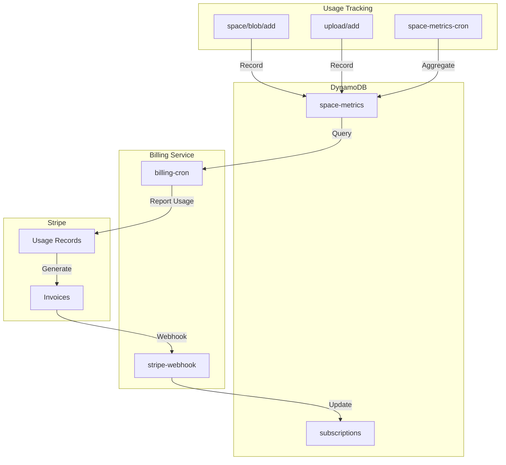

### Usage Tracking

```typescript
// billing/service.js
import Stripe from 'stripe'

const stripe = new Stripe(process.env.STRIPE_SECRET_KEY, {
  apiVersion: '2023-10-16',
})

/**
 * Report usage to Stripe
 */
export async function reportUsage(space: string, date: string) {
  // 1. Get subscription for space
  const subscription = await getSubscription(space)
  if (!subscription) {
    console.warn(`No subscription found for space ${space}`)
    return
  }

  // 2. Query daily usage
  const metrics = await getSpaceMetrics(space, date)

  // 3. Report to Stripe
  await stripe.subscriptionItems.createUsageRecord(
    subscription.stripeSubscriptionItemId,
    {
      quantity: Math.ceil(metrics.bytes / (1024 * 1024 * 1024)),  // GB
      timestamp: Math.floor(new Date(date).getTime() / 1000),
      action: 'set',  // or 'increment'
    }
  )

  console.log(
    `✓ Reported usage for ${space} on ${date}: ${metrics.bytes} bytes`
  )
}
```

### Stripe Webhook Handler

```javascript
// billing/functions/stripe-webhook.js
import Stripe from 'stripe'

const stripe = new Stripe(process.env.STRIPE_SECRET_KEY)

/**
 * Handle Stripe webhooks
 */
export async function handler(event) {
  const signature = event.headers['stripe-signature']
  const webhookSecret = process.env.STRIPE_WEBHOOK_SECRET

  let stripeEvent

  try {
    stripeEvent = stripe.webhooks.constructEvent(
      event.body,
      signature,
      webhookSecret
    )
  } catch (error) {
    console.error('Invalid signature:', error)
    return {
      statusCode: 400,
      body: JSON.stringify({ error: 'Invalid signature' }),
    }
  }

  console.log(`Webhook: ${stripeEvent.type}`)

  switch (stripeEvent.type) {
    case 'customer.subscription.created':
      await handleSubscriptionCreated(stripeEvent.data.object)
      break

    case 'customer.subscription.updated':
      await handleSubscriptionUpdated(stripeEvent.data.object)
      break

    case 'customer.subscription.deleted':
      await handleSubscriptionDeleted(stripeEvent.data.object)
      break

    case 'invoice.paid':
      await handleInvoicePaid(stripeEvent.data.object)
      break

    case 'invoice.payment_failed':
      await handleInvoicePaymentFailed(stripeEvent.data.object)
      break

    default:
      console.log(`Unhandled event type: ${stripeEvent.type}`)
  }

  return {
    statusCode: 200,
    body: JSON.stringify({ received: true }),
  }
}

async function handleSubscriptionCreated(subscription) {
  // Update subscription table
  await dynamodb.send(new PutCommand({
    TableName: process.env.SUBSCRIPTION_TABLE,
    Item: {
      account: subscription.metadata.account,
      space: subscription.metadata.space,
      stripeCustomerId: subscription.customer,
      stripeSubscriptionId: subscription.id,
      stripeSubscriptionItemId: subscription.items.data[0].id,
      status: subscription.status,
      currentPeriodEnd: new Date(subscription.current_period_end * 1000).toISOString(),
      quota: parseInt(subscription.metadata.quota) || 100 * 1024 ** 3,  // 100 GB default
      createdAt: new Date().toISOString(),
    },
  }))

  console.log(`✓ Subscription created: ${subscription.id}`)
}
```

---

## Additional Services

### psa (Pinning Service API)

**Purpose**: Pinning Service API 호환성을 제공하여 기존 IPFS 핀 서비스 사용자를 마이그레이션합니다.

```javascript
// psa/functions/pin-add.js
/**
 * Add pin (PSA endpoint)
 */
export async function handler(event) {
  const { cid, name, origins, meta } = JSON.parse(event.body)

  // Convert PSA pin request to w3up upload
  const result = await convertPSAPinToUpload({
    cid,
    name,
    origins,
    meta,
    space: event.requestContext.authorizer.space,
  })

  return {
    statusCode: 200,
    body: JSON.stringify({
      requestid: result.requestId,
      status: 'queued',
      created: new Date().toISOString(),
      delegates: [],
      info: {},
    }),
  }
}
```

### roundabout (Redirection Service)

**Purpose**: Piece CID를 받아 실제 콘텐츠의 signed URL로 리다이렉트합니다.

```javascript
// roundabout/functions/redirect.js
/**
 * Redirect from Piece CID to content URL
 */
export async function handler(event) {
  const pieceCID = event.pathParameters.cid

  // Query piece → CAR mapping
  const car = await getPieceMapping(pieceCID)

  if (!car) {
    return {
      statusCode: 404,
      body: JSON.stringify({ error: 'Piece not found' }),
    }
  }

  // Generate signed URL
  const url = await generateSignedURL(car.bucket, car.key, 3600)

  return {
    statusCode: 302,
    headers: {
      'Location': url,
      'Cache-Control': 'public, max-age=3600',
    },
  }
}
```

---

**[End of Part 2]**

Part 2에서는 replicator (S3→R2 복제), filecoin (Spade를 통한 Deal 생성), indexer (IPNI 광고), billing (Stripe 통합), 그리고 추가 서비스들을 다루었습니다.

Part 3에서는 다음 내용을 다룰 예정입니다:
- Monitoring and Observability (CloudWatch, Sentry, X-Ray)
- Deployment Pipeline (seed.run, CI/CD)
- Security Best Practices
- Performance Optimization
- Troubleshooting Guide
