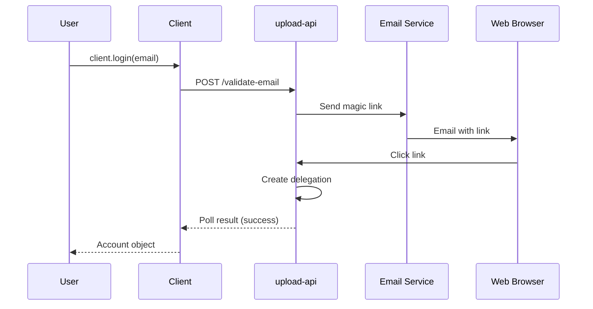

# 06. Client Libraries & API (Part 1)

## Table of Contents - Part 1
- [Overview](#overview)
- [@storacha/client Package](#storachaclient-package)
- [@storacha/upload-client Package](#storachaupload-client-package)
- [@storacha/access Package](#storachaaccess-package)

---

## Overview

Storacha는 여러 프로그래밍 언어와 환경을 위한 클라이언트 라이브러리를 제공합니다. 각 라이브러리는 w3up 프로토콜을 구현하며, UCAN 기반 인증과 분산 스토리지 기능을 제공합니다.

### Client Libraries Ecosystem

```mermaid
graph TB
    subgraph "High-Level Clients"
        A[@storacha/client]
        B[w3cli]
        C[Guppy Go Client]
    end

    subgraph "Low-Level Clients"
        D[@storacha/upload-client]
        E[@storacha/access]
        F[@storacha/capabilities]
    end

    subgraph "Core Libraries"
        G[@ucanto/core]
        H[@ucanto/client]
        I[@ucanto/transport]
    end

    subgraph "UI Components"
        J[@storacha/w3ui]
        K[React Components]
    end

    A --> D
    A --> E
    B --> A
    D --> F
    E --> F

    D --> H
    E --> H
    H --> G
    H --> I

    J --> A
    K --> J
```

### Package Comparison

| Package | Level | Purpose | Use Case |
|---------|-------|---------|----------|
| **@storacha/client** | High | Complete client with batteries included | Web apps, Node.js apps |
| **@storacha/upload-client** | Low | Upload-specific operations | Custom upload flows |
| **@storacha/access** | Low | Authentication and authorization | Custom auth flows |
| **w3cli** | CLI | Command-line interface | Scripts, automation |
| **Guppy** | High | Go language client | Go applications |
| **w3ui** | UI | React components | React web apps |

---

## @storacha/client Package

### Installation

```bash
npm install @storacha/client
```

### Overview

`@storacha/client`는 Storacha 플랫폼을 사용하기 위한 가장 높은 수준의 인터페이스입니다. Agent 관리, Space 관리, 파일 업로드를 하나의 패키지로 제공합니다.

### Initialization

#### Create a New Client

```typescript
import { create } from '@storacha/client'

// Create client (automatically creates and persists Agent)
const client = await create()

console.log('Agent DID:', client.agent.did())
console.log('Current space:', client.currentSpace()?.did())
```

**What happens during `create()`**:

1. **Agent Discovery**: 로컬 스토리지(IndexedDB/파일시스템)에서 기존 Agent 확인
2. **Agent Creation** (if not found):
   - Ed25519 키쌍 생성
   - DID 생성 (`did:key:z6Mk...`)
   - 로컬 스토리지에 저장
3. **Client Initialization**: Agent와 connection 설정

#### Custom Configuration

```typescript
import { create } from '@storacha/client'
import { StoreMemory } from '@storacha/access/stores/store-memory'
import * as Signer from '@ucanto/principal/ed25519'

// Option 1: Custom store
const client = await create({
  store: new StoreMemory(),  // In-memory store (for testing)
})

// Option 2: Existing principal
const principal = await Signer.parse(process.env.PRIVATE_KEY)
const client = await create({
  principal,
})

// Option 3: Custom connection
const client = await create({
  connection: {
    id: { did: () => 'did:web:staging.up.storacha.network' },
    channel: {
      request: async (options) => {
        const response = await fetch('https://staging.up.storacha.network', {
          method: 'POST',
          headers: options.headers,
          body: options.body,
        })
        return {
          headers: response.headers,
          body: new Uint8Array(await response.arrayBuffer()),
        }
      },
    },
  },
})
```

### Authentication

#### Email-based Login

```typescript
// Start login flow
const account = await client.login('alice@example.com')

console.log('Verification email sent to:', account.email)
console.log('Account DID:', account.did())

// Client polls for email verification
// Timeout: 5 minutes by default
```

**Email Verification Flow**:



**Magic Link Format**:
```
https://up.storacha.network/validate-email?ucan=eyJhbGciOiJFZERTQSIsInR5cCI6IkpXVCJ9...
```

### Space Management

#### Create a New Space

```typescript
// Create space with name
const space = await client.createSpace('my-project-data')

console.log('Space created:', space.did())
console.log('Space name:', space.name)

// Set as current space
await client.setCurrentSpace(space.did())
```

**Space Object**:
```typescript
interface Space {
  did(): SpaceDID                    // "did:key:z6Mkp..."
  name: string                       // "my-project-data"
  registered: boolean                // true if registered with service
  meta(): Record<string, any>        // Metadata

  createDelegation(options): Promise<Delegation>
  delegations(): Delegation[]
  provisionsStorage(): Promise<StorageProvider[]>
}
```

#### Register Space with Account

```typescript
// Create space and register with account
const space = await client.createSpace('my-project-data', {
  account: 'did:mailto:alice@example.com',  // Logged-in account
})

// Space is now provisioned for the account
// Uploads are billed to this account
```

#### List Spaces

```typescript
// Get all spaces
const spaces = client.spaces()

console.log(`Found ${spaces.length} spaces:`)
for (const space of spaces) {
  console.log(`- ${space.name} (${space.did()})`)
}
```

#### Add Space from Delegation

서버리스 환경이나 임시 클라이언트에서 Space 접근:

```typescript
// Receive delegation (base64-encoded CAR)
const delegationProof = 'uEiB5zcmVjb3ZlcnkiO...'  // From secure source

// Parse delegation
const delegation = await client.addSpace(delegationProof)

console.log('Space added:', delegation.capabilities[0].with)

// Set as current space
await client.setCurrentSpace(delegation.capabilities[0].with)
```

### File Upload

#### uploadFile()

단일 파일을 업로드합니다.

```typescript
// Browser environment
const file = new File(['Hello, Storacha!'], 'hello.txt', {
  type: 'text/plain',
})

const cid = await client.uploadFile(file, {
  // Optional configuration
  onShardStored: (meta) => {
    console.log(`Shard stored: ${meta.cid}`)
  },
  onUploadProgress: (progress) => {
    console.log(`Progress: ${progress.loaded} / ${progress.total}`)
  },
  signal: abortController.signal,  // For cancellation
})

console.log('Root CID:', cid.toString())
// Output: bafybeiabc...
```

**Node.js Environment**:

```typescript
import { filesFromPath } from 'files-from-path'

// Load files from filesystem
const files = await filesFromPath('/path/to/file.txt')

const cid = await client.uploadFile(files[0])
console.log('Uploaded:', cid.toString())
```

**Upload Options**:
```typescript
interface UploadOptions {
  // Shard size (default: 100MB)
  shardSize?: number

  // Number of concurrent requests (default: 3)
  concurrentRequests?: number

  // Number of retries on failure (default: 5)
  retries?: number

  // AbortSignal for cancellation
  signal?: AbortSignal

  // Callback when each shard is stored
  onShardStored?: (meta: ShardMeta) => void

  // Progress callback
  onUploadProgress?: (progress: UploadProgress) => void

  // Enable deduplication (default: true)
  dedupe?: boolean
}

interface ShardMeta {
  cid: CID
  size: number
  insertedAt: Date
}

interface UploadProgress {
  loaded: number   // Bytes uploaded
  total: number    // Total bytes
  percent: number  // 0-100
}
```

#### uploadDirectory()

여러 파일을 디렉토리 구조로 업로드합니다.

```typescript
// Browser: FileList from <input type="file" multiple webkitdirectory>
const files = Array.from(fileInput.files)

const cid = await client.uploadDirectory(files)

console.log('Directory CID:', cid.toString())
// Output: bafybeidskjxcnhvtrljlevd...
```

**Directory Structure**:

```
Input files:
  - docs/README.md
  - docs/API.md
  - src/index.js
  - src/utils/helper.js

Result UnixFS structure:
bafybeidskj... (root)
├── docs/
│   ├── README.md
│   └── API.md
└── src/
    ├── index.js
    └── utils/
        └── helper.js
```

**Node.js with Directory**:

```typescript
import { filesFromPath } from 'files-from-path'

// Load entire directory
const files = await filesFromPath('/path/to/project', {
  hidden: false,          // Exclude hidden files
  pathPrefix: 'project',  // Add prefix to paths
})

const cid = await client.uploadDirectory(files, {
  onShardStored: (meta) => {
    console.log(`Shard ${meta.cid} stored (${meta.size} bytes)`)
  },
})

console.log('Project uploaded:', cid.toString())
```

#### uploadCAR()

이미 생성된 CAR 파일을 업로드합니다.

```typescript
import { CarReader } from '@ipld/car'
import * as raw from 'multiformats/codecs/raw'
import { sha256 } from 'multiformats/hashes/sha2'

// Create CAR from blocks
const blocks = [
  { cid: someCID, bytes: someBytes },
  // ... more blocks
]

const { writer, out } = CarWriter.create(rootCID)

// Write blocks to CAR
for (const block of blocks) {
  await writer.put(block)
}
await writer.close()

// Upload CAR
const cid = await client.uploadCAR(out)
console.log('CAR uploaded:', cid.toString())
```

### Data Retrieval

#### Get Upload Status

```typescript
// Query upload by root CID
const upload = await client.capability.upload.get({
  root: CID.parse('bafybeiabc...'),
})

if (upload.ok) {
  console.log('Upload found:')
  console.log('- Root:', upload.ok.root.toString())
  console.log('- Shards:', upload.ok.shards.length)
  console.log('- Inserted:', upload.ok.insertedAt)
} else {
  console.log('Upload not found:', upload.error.message)
}
```

#### List Uploads

```typescript
// List all uploads for current space
const uploads = []
for await (const upload of client.capability.upload.list()) {
  uploads.push(upload)
}

console.log(`Found ${uploads.length} uploads:`)
for (const upload of uploads) {
  console.log(`- ${upload.root} (${upload.shards.length} shards)`)
}
```

#### Get Receipt

```typescript
// Get receipt for a specific upload task
const receipt = await client.getReceipt(taskCID)

if (receipt) {
  console.log('Receipt:', receipt)
  console.log('Status:', receipt.out.ok ? 'Success' : 'Failed')
  console.log('Result:', receipt.out.ok || receipt.out.error)
}
```

### Delegation

#### Create Delegation

```typescript
// Delegate upload capability to another agent
const delegation = await client.createDelegation({
  // Audience (recipient's DID)
  audience: 'did:key:z6Mkr...',

  // Capabilities to delegate
  capabilities: [
    {
      can: 'upload/add',
      with: client.currentSpace().did(),
    },
    {
      can: 'space/blob/add',
      with: client.currentSpace().did(),
    },
  ],

  // Expiration (optional)
  expiration: Math.floor(Date.now() / 1000) + 86400 * 30,  // 30 days

  // Facts (optional metadata)
  facts: [{
    name: 'Project collaborator',
    permissions: 'upload',
  }],
})

// Serialize delegation for sharing
const proof = await delegation.archive()
const proofBase64 = Buffer.from(proof).toString('base64')

console.log('Share this delegation proof:', proofBase64)
```

#### Add Delegation

```typescript
// Receive delegation proof
const proofBase64 = 'uEiB5zcmVjb3ZlcnkiO...'

// Add to client
await client.addProof(Buffer.from(proofBase64, 'base64'))

console.log('Delegation added successfully')

// Now client can use delegated capabilities
const uploads = await client.capability.upload.list()
```

### Advanced Operations

#### Remove Upload

```typescript
// Remove upload from service
const result = await client.remove(CID.parse('bafybeiabc...'))

if (result.ok) {
  console.log('Upload removed successfully')
} else {
  console.error('Failed to remove:', result.error.message)
}

// Note: Data remains on IPFS network
// Removal only affects service's indexing
```

#### Get Account Info

```typescript
// Get current account details
const account = client.account()

if (account) {
  console.log('Account DID:', account.did())
  console.log('Email:', account.email)

  // Get account info
  const info = await client.capability.account.info()
  console.log('Account info:', info)
}
```

#### Quota Management

```typescript
// Check current usage
const usage = await client.currentSpace().usage()

console.log('Storage used:', usage.bytes)
console.log('Quota limit:', usage.quota)
console.log('Available:', usage.quota - usage.bytes)

if (usage.bytes / usage.quota > 0.9) {
  console.warn('Warning: 90% of quota used!')
}
```

---

## @storacha/upload-client Package

### Overview

`@storacha/upload-client`는 업로드 기능에 특화된 저수준 클라이언트입니다. `@storacha/client`보다 더 세밀한 제어가 필요할 때 사용합니다.

### Installation

```bash
npm install @storacha/upload-client
```

### Core Functions

#### uploadFile()

```typescript
import { uploadFile } from '@storacha/upload-client'
import * as Client from '@ucanto/client'
import * as CAR from '@ucanto/transport/car'

// Create connection
const connection = Client.connect({
  id: { did: () => 'did:web:up.storacha.network' },
  codec: CAR.outbound,
  channel: {
    request: async (options) => {
      const response = await fetch('https://up.storacha.network', {
        method: 'POST',
        headers: options.headers,
        body: options.body,
      })
      return {
        headers: response.headers,
        body: new Uint8Array(await response.arrayBuffer()),
      }
    },
  },
})

// Upload file
const result = await uploadFile(connection, {
  // Invocation options
  issuer: agentSigner,    // Agent that signs the invocation
  with: spaceDID,         // Space DID
  proofs: [delegation],   // Proof of authorization

  // File to upload
  file: new Blob(['Hello!']),

  // Options
  shardSize: 100 * 1024 * 1024,  // 100MB shards
  onShardStored: (meta) => {
    console.log('Shard stored:', meta)
  },
})

console.log('Root CID:', result.root.toString())
```

#### uploadDirectory()

```typescript
import { uploadDirectory } from '@storacha/upload-client'

const result = await uploadDirectory(connection, {
  issuer: agentSigner,
  with: spaceDID,
  proofs: [delegation],

  // Files with names
  files: [
    { name: 'README.md', stream: () => readmeStream },
    { name: 'index.js', stream: () => indexStream },
  ],

  onShardStored: (meta) => {
    console.log(`Stored: ${meta.cid}`)
  },
})

console.log('Directory CID:', result.root.toString())
```

#### uploadCAR()

```typescript
import { uploadCAR } from '@storacha/upload-client'
import { CarWriter } from '@ipld/car'

// Create CAR
const { writer, out } = CarWriter.create([rootCID])

// Write blocks
for (const block of blocks) {
  await writer.put(block)
}
await writer.close()

// Upload CAR
const result = await uploadCAR(connection, {
  issuer: agentSigner,
  with: spaceDID,
  proofs: [delegation],

  car: out,
  roots: [rootCID],
})

console.log('Uploaded:', result.toString())
```

### Blob Operations

#### store.add()

Blob를 업로드하고 presigned URL을 받습니다.

```typescript
import * as StoreCapabilities from '@storacha/capabilities/store'
import { invoke } from '@ucanto/client'

// Calculate blob digest
const bytes = new Uint8Array(await file.arrayBuffer())
const hash = await sha256.digest(bytes)

// Invoke store/add capability
const storeAdd = invoke({
  issuer: agentSigner,
  audience: { did: () => 'did:web:up.storacha.network' },
  capability: {
    can: 'store/add',
    with: spaceDID,
    nb: {
      link: CID.create(1, raw.code, hash),
      size: bytes.length,
    },
  },
  proofs: [delegation],
})

// Execute invocation
const result = await storeAdd.execute(connection)

if (result.out.ok) {
  const { url, headers } = result.out.ok

  // Upload to presigned URL
  await fetch(url, {
    method: 'PUT',
    headers,
    body: bytes,
  })

  console.log('Blob uploaded successfully')
}
```

#### store.list()

Space의 모든 저장된 blob를 조회합니다.

```typescript
import * as StoreCapabilities from '@storacha/capabilities/store'

const storeList = invoke({
  issuer: agentSigner,
  audience: { did: () => 'did:web:up.storacha.network' },
  capability: {
    can: 'store/list',
    with: spaceDID,
  },
  proofs: [delegation],
})

const result = await storeList.execute(connection)

if (result.out.ok) {
  for (const blob of result.out.ok.results) {
    console.log(`Blob: ${blob.link} (${blob.size} bytes)`)
  }
}
```

#### store.remove()

Blob를 제거합니다.

```typescript
const storeRemove = invoke({
  issuer: agentSigner,
  audience: { did: () => 'did:web:up.storacha.network' },
  capability: {
    can: 'store/remove',
    with: spaceDID,
    nb: {
      link: blobCID,
    },
  },
  proofs: [delegation],
})

const result = await storeRemove.execute(connection)

if (result.out.ok) {
  console.log('Blob removed:', result.out.ok.size, 'bytes freed')
}
```

### Upload Operations

#### upload.add()

Upload을 등록합니다.

```typescript
import * as UploadCapabilities from '@storacha/capabilities/upload'

const uploadAdd = invoke({
  issuer: agentSigner,
  audience: { did: () => 'did:web:up.storacha.network' },
  capability: {
    can: 'upload/add',
    with: spaceDID,
    nb: {
      root: rootCID,
      shards: [shard1CID, shard2CID],
    },
  },
  proofs: [delegation],
})

const result = await uploadAdd.execute(connection)

if (result.out.ok) {
  console.log('Upload registered:', result.out.ok.root.toString())
}
```

#### upload.list()

```typescript
const uploadList = invoke({
  issuer: agentSigner,
  audience: { did: () => 'did:web:up.storacha.network' },
  capability: {
    can: 'upload/list',
    with: spaceDID,
    nb: {
      cursor: undefined,  // For pagination
      size: 20,           // Page size
    },
  },
  proofs: [delegation],
})

const result = await uploadList.execute(connection)

if (result.out.ok) {
  console.log(`Found ${result.out.ok.results.length} uploads`)

  for (const upload of result.out.ok.results) {
    console.log(`- ${upload.root} (${upload.shards.length} shards)`)
  }

  if (result.out.ok.cursor) {
    // More results available
    console.log('Next page cursor:', result.out.ok.cursor)
  }
}
```

#### upload.remove()

```typescript
const uploadRemove = invoke({
  issuer: agentSigner,
  audience: { did: () => 'did:web:up.storacha.network' },
  capability: {
    can: 'upload/remove',
    with: spaceDID,
    nb: {
      root: rootCID,
    },
  },
  proofs: [delegation],
})

const result = await uploadRemove.execute(connection)

if (result.out.ok) {
  console.log('Upload removed:', result.out.ok.root.toString())
}
```

---

## @storacha/access Package

### Overview

`@storacha/access`는 인증 및 권한 관리를 위한 저수준 패키지입니다. Agent 관리, Space 생성, Delegation 처리를 담당합니다.

### Installation

```bash
npm install @storacha/access
```

### Agent Management

#### Create Agent

```typescript
import * as Agent from '@storacha/access/agent'
import { StoreIndexedDB } from '@storacha/access/stores/store-indexeddb'

// Create new agent
const agent = await Agent.create({
  store: new StoreIndexedDB('my-app-agent'),
})

console.log('Agent DID:', agent.did())
console.log('Agent issuer:', agent.issuer.did())
```

#### Agent Store Implementations

**IndexedDB Store** (Browser):

```typescript
import { StoreIndexedDB } from '@storacha/access/stores/store-indexeddb'

const store = new StoreIndexedDB('my-app-agent')

// Open database
await store.open()

// Save agent data
await store.save({
  principal: agentSigner,
  meta: { createdAt: Date.now() },
})

// Load agent data
const data = await store.load()
console.log('Loaded agent:', data.principal.did())

// Close database
await store.close()
```

**File System Store** (Node.js):

```typescript
import { StoreFileSystem } from '@storacha/access/stores/store-fs'
import { homedir } from 'os'
import { join } from 'path'

const store = new StoreFileSystem(
  join(homedir(), '.storacha', 'agent')
)

await store.save({
  principal: agentSigner,
  meta: { createdAt: Date.now() },
})
```

**Memory Store** (Testing):

```typescript
import { StoreMemory } from '@storacha/access/stores/store-memory'

const store = new StoreMemory()

// Data is lost when process exits
await store.save({
  principal: agentSigner,
  meta: { createdAt: Date.now() },
})
```

### Space Management

#### Create Space

```typescript
import * as Space from '@storacha/access/space'
import * as Signer from '@ucanto/principal/ed25519'

// Generate new space key
const spaceSigner = await Signer.generate()

// Create space
const space = {
  did: spaceSigner.did(),
  name: 'my-project',
  signer: spaceSigner,
  registered: false,
}

console.log('Space DID:', space.did)
```

#### Provision Space

```typescript
import * as ProvisionCapabilities from '@storacha/capabilities/provider/add'

// Create provision request
const provision = invoke({
  issuer: agentSigner,
  audience: { did: () => 'did:web:up.storacha.network' },
  capability: {
    can: 'provider/add',
    with: accountDID,  // Account DID (did:mailto:)
    nb: {
      consumer: spaceDID,  // Space to provision
    },
  },
  proofs: [accountDelegation],
})

const result = await provision.execute(connection)

if (result.out.ok) {
  console.log('Space provisioned for account:', accountDID)
  space.registered = true
}
```

### Delegation Management

#### Create Delegation

```typescript
import * as Delegation from '@storacha/access/delegation'
import * as UCAN from '@ucanto/core'

// Create delegation
const delegation = await Delegation.delegate({
  // Issuer (space)
  issuer: spaceSigner,

  // Audience (recipient agent)
  audience: recipientDID,

  // Capabilities
  capabilities: [
    {
      can: 'upload/add',
      with: spaceDID,
    },
    {
      can: 'space/blob/add',
      with: spaceDID,
    },
  ],

  // Expiration
  expiration: Math.floor(Date.now() / 1000) + 86400 * 30,  // 30 days

  // Facts
  facts: [{ name: 'collaborator' }],
})

// Archive delegation (CAR format)
const archive = await delegation.archive()
const base64 = Buffer.from(archive).toString('base64')

console.log('Delegation proof:', base64)
```

#### Parse Delegation

```typescript
// Receive delegation proof (base64)
const proofBase64 = 'uEiB5zcmVjb3ZlcnkiO...'

// Parse
const archive = Buffer.from(proofBase64, 'base64')
const delegation = await Delegation.extract(archive)

console.log('Issuer:', delegation.issuer.did())
console.log('Audience:', delegation.audience.did())
console.log('Capabilities:', delegation.capabilities)
console.log('Expiration:', new Date(delegation.expiration * 1000))
```

#### Validate Delegation

```typescript
import { validate } from '@ucanto/core/delegation'

// Validate signature
const valid = await validate(delegation)

if (!valid) {
  throw new Error('Invalid delegation signature')
}

// Check expiration
const now = Math.floor(Date.now() / 1000)
if (delegation.expiration && delegation.expiration < now) {
  throw new Error('Delegation expired')
}

// Check audience
if (delegation.audience.did() !== agent.did()) {
  throw new Error('Delegation not for this agent')
}

console.log('Delegation is valid')
```

---

**[End of Part 1]**

Part 1에서는 @storacha/client, @storacha/upload-client, @storacha/access 패키지의 상세한 API와 사용 예제를 다루었습니다.

---

# 06. Client Libraries & API (Part 2)

## Table of Contents - Part 2
- [CLI Tools (w3cli)](#cli-tools-w3cli)
- [Go Client (Guppy)](#go-client-guppy)
- [UI Components (w3ui)](#ui-components-w3ui)
- [Usage Examples and Best Practices](#usage-examples-and-best-practices)

---

## CLI Tools (w3cli)

### Overview

**w3cli**는 Storacha 플랫폼을 위한 공식 명령줄 인터페이스입니다. 파일 업로드, Space 관리, Delegation 생성 등의 작업을 터미널에서 수행할 수 있습니다.

### Installation

```bash
# Global installation
npm install -g @web3-storage/w3cli

# Or using npx (no installation)
npx @web3-storage/w3cli <command>

# Check version
w3 --version
```

### Getting Started

#### Initialize and Authenticate

```bash
# Show agent information
w3 whoami

# Output:
# Agent DID: did:key:z6MkwDK3M4PxU1FqcSt4quWWx2
# Agent proof: bagbaieranf2k3...

# Login with email
w3 login alice@example.com

# Output:
# ⏳ Sending verification email to alice@example.com...
# ✅ Verification email sent!
# ⏳ Waiting for email verification...
# ✅ Email verified! You are now logged in as did:mailto:alice@example.com
```

**Authentication Flow**:
1. CLI가 verification email 전송
2. 사용자가 email의 magic link 클릭
3. CLI가 polling하여 verification 확인
4. Account delegation을 agent에 추가

### Space Management

#### Create a Space

```bash
# Create space with name
w3 space create my-project-data

# Output:
# Space created: did:key:z6Mkp3yD2LBqTkZB5...
# Space name: my-project-data
# ✅ Space registered with account: did:mailto:alice@example.com
```

#### List Spaces

```bash
# List all spaces
w3 space ls

# Output:
# Current   Space DID                          Name              Registered
# ─────────────────────────────────────────────────────────────────────────
# *         did:key:z6Mkp3yD2LBqTkZB5...      my-project-data   ✓
#           did:key:z6Mkr7qWFvD5B2xYg...      backup-space      ✓
#           did:key:z6Mks8mnCGzgNo8Hx...      test-space        -
```

**Columns**:
- **Current**: `*` indicates the currently active space
- **Space DID**: Unique identifier for the space
- **Name**: Human-readable name
- **Registered**: `✓` if registered with an account, `-` if unregistered

#### Switch Space

```bash
# Use a different space
w3 space use did:key:z6Mkr7qWFvD5B2xYg...

# Output:
# ✅ Current space set to: did:key:z6Mkr7qWFvD5B2xYg...
```

#### Add Space from Delegation

```bash
# Import space using delegation proof
w3 space add <delegation-car-file>

# Example:
w3 space add ./my-space-delegation.car

# Output:
# ✅ Space added: did:key:z6Mkp3yD2LBqTkZB5...
# Capabilities:
#   - upload/add
#   - space/blob/add
#   - space/index/add
```

#### Space Information

```bash
# Get detailed space information
w3 space info

# Output:
# Space DID: did:key:z6Mkp3yD2LBqTkZB5...
# Space name: my-project-data
# Registered: Yes
# Account: did:mailto:alice@example.com
#
# Storage Providers:
#   - did:web:up.storacha.network
#
# Usage:
#   Stored: 245.3 MB
#   Quota: 5 GB
#   Available: 4.75 GB
```

### File Upload

#### Upload Single File

```bash
# Upload a file
w3 up README.md

# Output:
# ⏳ Encoding file...
# ⏳ Creating CAR shards...
# ⏳ Uploading 1 shard (2.4 MB)...
# ✅ Shard stored: bagbaiera3dfj2k3nv5...
# ⏳ Registering upload...
# ✅ Upload registered!
#
# Root CID: bafybeiabc5k3lmnopqr2y...
# URL: https://bafybeiabc5k3lmnopqr2y....ipfs.w3s.link
```

#### Upload Multiple Files

```bash
# Upload directory
w3 up docs/

# Output:
# ⏳ Scanning directory: docs/
# Found 12 files (5.2 MB total)
# ⏳ Creating directory structure...
# ⏳ Uploading 1 shard (5.2 MB)...
# ✅ Shard stored: bagbaiera8dnf2k3...
# ✅ Upload registered!
#
# Root CID: bafybeidh5k3lmnopqr2y...
# URL: https://bafybeidh5k3lmnopqr2y....ipfs.w3s.link/docs/
```

#### Upload with Options

```bash
# Hide output except final URL
w3 up logo.png --quiet

# Don't wrap in directory (single file)
w3 up logo.png --no-wrap

# Custom CAR shard size (in MB)
w3 up large-file.bin --shard-size 200

# Parallel uploads
w3 up images/*.jpg --concurrent 5
```

### List Uploads

```bash
# List all uploads in current space
w3 ls

# Output:
# Root CID                          Inserted              Size     Name
# ──────────────────────────────────────────────────────────────────────
# bafybeiabc5k3lmnopqr2y...        2024-01-15 10:23:45   2.4 MB   README.md
# bafybeidh5k3lmnopqr2y...        2024-01-15 10:25:12   5.2 MB   docs/
# bafybeifg6j8klmnopqr3z...        2024-01-14 15:42:01   156 KB   logo.png

# List with pagination
w3 ls --size 10 --cursor <cursor>

# List only recent uploads
w3 ls --limit 5

# JSON output
w3 ls --json
```

### Remove Upload

```bash
# Remove upload by CID
w3 rm bafybeiabc5k3lmnopqr2y...

# Output:
# ⚠️  Warning: This will only remove the upload from your account.
# The data will still be available on IPFS network.
#
# Are you sure? (y/N) y
#
# ✅ Upload removed: bafybeiabc5k3lmnopqr2y...
```

### Delegation Management

#### Create Delegation

```bash
# Create delegation for upload capability
w3 delegation create \
  --can upload/add \
  --can space/blob/add \
  --audience did:key:z6Mkr7qWFvD5B2xYg... \
  --expiration 2024-12-31 \
  --output delegation.car

# Output:
# ✅ Delegation created!
#
# Issuer: did:key:z6Mkp3yD2LBqTkZB5... (current space)
# Audience: did:key:z6Mkr7qWFvD5B2xYg...
#
# Capabilities:
#   - upload/add with did:key:z6Mkp3yD2LBqTkZB5...
#   - space/blob/add with did:key:z6Mkp3yD2LBqTkZB5...
#
# Expires: 2024-12-31T23:59:59.000Z
#
# Saved to: delegation.car
```

**Available Capabilities**:
- `upload/add` - Register uploads
- `upload/list` - List uploads
- `upload/remove` - Remove uploads
- `space/blob/add` - Add blobs to space
- `space/blob/list` - List blobs
- `space/blob/remove` - Remove blobs
- `space/info` - Get space information
- `*` - All capabilities (wildcard)

#### Revoke Delegation

```bash
# Revoke a delegation by CID
w3 delegation revoke baguqeera3dfj2k3...

# Output:
# ⚠️  Revoking delegation: baguqeera3dfj2k3...
#
# This will invalidate:
#   - Audience: did:key:z6Mkr7qWFvD5B2xYg...
#   - Capabilities: upload/add, space/blob/add
#
# Are you sure? (y/N) y
#
# ✅ Delegation revoked successfully
```

### Advanced Usage

#### Open in Browser

```bash
# Open CID in browser (w3s.link gateway)
w3 open bafybeiabc5k3lmnopqr2y...

# Output:
# Opening: https://bafybeiabc5k3lmnopqr2y....ipfs.w3s.link
```

#### Configuration

```bash
# Show configuration
w3 config show

# Output:
# Agent store: /home/alice/.w3cli/agent
# Default space: did:key:z6Mkp3yD2LBqTkZB5...
# Service endpoint: https://up.storacha.network

# Change service endpoint (for testing)
w3 config set endpoint https://staging.up.storacha.network

# Reset to defaults
w3 config reset
```

#### Export/Import Agent

```bash
# Export agent for backup
w3 agent export > agent-backup.json

# Import agent on another machine
w3 agent import < agent-backup.json

# Output:
# ✅ Agent imported
# Agent DID: did:key:z6MkwDK3M4PxU1FqcSt4quWWx2
```

### Scripting with w3cli

#### Bash Script Example

```bash
#!/bin/bash

# Upload build artifacts to Storacha
BUILD_DIR="./dist"
SPACE_NAME="my-app-builds"

# Ensure logged in
if ! w3 whoami > /dev/null 2>&1; then
  echo "Error: Not logged in. Run 'w3 login <email>' first."
  exit 1
fi

# Create or use existing space
if ! w3 space ls | grep -q "$SPACE_NAME"; then
  echo "Creating space: $SPACE_NAME"
  w3 space create "$SPACE_NAME"
fi

w3 space use "$(w3 space ls | grep "$SPACE_NAME" | awk '{print $2}')"

# Upload build
echo "Uploading build from $BUILD_DIR..."
ROOT_CID=$(w3 up "$BUILD_DIR" --quiet)

echo "Build uploaded successfully!"
echo "Root CID: $ROOT_CID"
echo "URL: https://${ROOT_CID}.ipfs.w3s.link"

# Save CID to file for deployment
echo "$ROOT_CID" > latest-build.txt
```

#### CI/CD Integration

```yaml
# GitHub Actions example
name: Deploy to Storacha

on:
  push:
    branches: [main]

jobs:
  deploy:
    runs-on: ubuntu-latest

    steps:
      - uses: actions/checkout@v3

      - name: Setup Node.js
        uses: actions/setup-node@v3
        with:
          node-version: '20'

      - name: Install w3cli
        run: npm install -g @web3-storage/w3cli

      - name: Import agent
        run: |
          echo "${{ secrets.W3_AGENT }}" | w3 agent import
          w3 space use "${{ secrets.W3_SPACE_DID }}"

      - name: Build application
        run: npm run build

      - name: Upload to Storacha
        id: upload
        run: |
          CID=$(w3 up ./dist --quiet)
          echo "cid=$CID" >> $GITHUB_OUTPUT
          echo "url=https://${CID}.ipfs.w3s.link" >> $GITHUB_OUTPUT

      - name: Comment on PR
        uses: actions/github-script@v6
        with:
          script: |
            github.rest.issues.createComment({
              issue_number: context.issue.number,
              owner: context.repo.owner,
              repo: context.repo.repo,
              body: '🚀 Deployed to Storacha!\n\nURL: ${{ steps.upload.outputs.url }}'
            })
```

---

## Go Client (Guppy)

### Overview

**Guppy**는 Storacha를 위한 공식 Go 클라이언트 라이브러리입니다. Go 애플리케이션에서 Storacha 스토리지를 통합할 수 있습니다.

### Installation

```bash
# Install Guppy
go get github.com/storacha/guppy

# Install go-ucanto (required for UCAN operations)
go get github.com/storacha/go-ucanto
```

**Requirements**:
- Go 1.20 or higher

### Setup

#### Initialize Client

```go
package main

import (
    "context"
    "fmt"
    "log"
    "os"

    "github.com/storacha/guppy"
    "github.com/storacha/go-ucanto/did"
    "github.com/storacha/go-ucanto/principal"
)

func main() {
    ctx := context.Background()

    // 1. Load private key
    privateKeyBytes, err := os.ReadFile("agent-key.pem")
    if err != nil {
        log.Fatal(err)
    }

    signer, err := principal.Parse(string(privateKeyBytes))
    if err != nil {
        log.Fatal(err)
    }

    // 2. Load proof (delegation)
    proofBytes, err := os.ReadFile("delegation.car")
    if err != nil {
        log.Fatal(err)
    }

    proof, err := guppy.ParseProof(proofBytes)
    if err != nil {
        log.Fatal(err)
    }

    // 3. Parse space DID
    spaceDID, err := did.Parse("did:key:z6Mkp3yD2LBqTkZB5...")
    if err != nil {
        log.Fatal(err)
    }

    // 4. Create client
    client, err := guppy.NewClient(
        guppy.WithSigner(signer),
        guppy.WithProof(proof),
        guppy.WithSpace(spaceDID),
    )
    if err != nil {
        log.Fatal(err)
    }

    fmt.Println("Client initialized successfully")
    fmt.Printf("Agent DID: %s\n", signer.DID())
    fmt.Printf("Space DID: %s\n", spaceDID)
}
```

### Upload CAR File

```go
func uploadCAR(client *guppy.Client, carPath string) error {
    ctx := context.Background()

    // Read CAR file
    carData, err := os.ReadFile(carPath)
    if err != nil {
        return fmt.Errorf("read CAR: %w", err)
    }

    // Parse CAR to get root CID
    carReader, err := car.NewReader(bytes.NewReader(carData))
    if err != nil {
        return fmt.Errorf("parse CAR: %w", err)
    }

    roots, err := carReader.Roots()
    if err != nil {
        return fmt.Errorf("get roots: %w", err)
    }

    if len(roots) == 0 {
        return fmt.Errorf("CAR has no roots")
    }

    rootCID := roots[0]

    // Upload CAR
    result, err := client.StoreAdd(ctx, carData)
    if err != nil {
        return fmt.Errorf("store add: %w", err)
    }

    fmt.Printf("CAR uploaded successfully\n")
    fmt.Printf("Root CID: %s\n", rootCID)
    fmt.Printf("Blob CID: %s\n", result.Link)
    fmt.Printf("Size: %d bytes\n", result.Size)

    return nil
}
```

### Upload File

```go
func uploadFile(client *guppy.Client, filePath string) error {
    ctx := context.Background()

    // Open file
    file, err := os.Open(filePath)
    if err != nil {
        return fmt.Errorf("open file: %w", err)
    }
    defer file.Close()

    // Get file info
    fileInfo, err := file.Stat()
    if err != nil {
        return fmt.Errorf("stat file: %w", err)
    }

    fmt.Printf("Uploading: %s (%d bytes)\n", filePath, fileInfo.Size())

    // Encode as UnixFS DAG
    dagRoot, blocks, err := guppy.EncodeFile(file)
    if err != nil {
        return fmt.Errorf("encode file: %w", err)
    }

    fmt.Printf("Encoded as DAG with root: %s\n", dagRoot)
    fmt.Printf("Total blocks: %d\n", len(blocks))

    // Create CAR from blocks
    carData, err := guppy.BlocksToCAR(dagRoot, blocks)
    if err != nil {
        return fmt.Errorf("create CAR: %w", err)
    }

    // Upload CAR
    result, err := client.StoreAdd(ctx, carData)
    if err != nil {
        return fmt.Errorf("store add: %w", err)
    }

    fmt.Printf("File uploaded successfully\n")
    fmt.Printf("Root CID: %s\n", dagRoot)

    return nil
}
```

### Upload Directory

```go
func uploadDirectory(client *guppy.Client, dirPath string) error {
    ctx := context.Background()

    // Walk directory and collect files
    var files []guppy.FileEntry
    err := filepath.Walk(dirPath, func(path string, info os.FileInfo, err error) error {
        if err != nil {
            return err
        }

        if info.IsDir() {
            return nil
        }

        // Get relative path
        relPath, err := filepath.Rel(dirPath, path)
        if err != nil {
            return err
        }

        // Open file
        file, err := os.Open(path)
        if err != nil {
            return err
        }

        files = append(files, guppy.FileEntry{
            Path:   relPath,
            Reader: file,
            Size:   info.Size(),
        })

        return nil
    })

    if err != nil {
        return fmt.Errorf("walk directory: %w", err)
    }

    fmt.Printf("Found %d files\n", len(files))

    // Encode as UnixFS directory
    dagRoot, blocks, err := guppy.EncodeDirectory(files)
    if err != nil {
        return fmt.Errorf("encode directory: %w", err)
    }

    // Close all files
    for _, f := range files {
        if closer, ok := f.Reader.(io.Closer); ok {
            closer.Close()
        }
    }

    fmt.Printf("Encoded as DAG with root: %s\n", dagRoot)
    fmt.Printf("Total blocks: %d\n", len(blocks))

    // Create CAR
    carData, err := guppy.BlocksToCAR(dagRoot, blocks)
    if err != nil {
        return fmt.Errorf("create CAR: %w", err)
    }

    // Upload CAR
    result, err := client.StoreAdd(ctx, carData)
    if err != nil {
        return fmt.Errorf("store add: %w", err)
    }

    fmt.Printf("Directory uploaded successfully\n")
    fmt.Printf("Root CID: %s\n", dagRoot)

    return nil
}
```

### List Uploads

```go
func listUploads(client *guppy.Client) error {
    ctx := context.Background()

    // List uploads
    uploads, err := client.UploadList(ctx, guppy.UploadListOptions{
        Size: 20,  // Page size
    })

    if err != nil {
        return fmt.Errorf("upload list: %w", err)
    }

    fmt.Printf("Found %d uploads:\n", len(uploads.Results))

    for i, upload := range uploads.Results {
        fmt.Printf("%d. Root: %s\n", i+1, upload.Root)
        fmt.Printf("   Shards: %d\n", len(upload.Shards))
        fmt.Printf("   Inserted: %s\n", upload.InsertedAt.Format(time.RFC3339))
    }

    // Check for more results
    if uploads.Cursor != "" {
        fmt.Printf("\nMore results available. Cursor: %s\n", uploads.Cursor)
    }

    return nil
}
```

### Remove Upload

```go
func removeUpload(client *guppy.Client, rootCID string) error {
    ctx := context.Background()

    // Parse CID
    cid, err := cid.Parse(rootCID)
    if err != nil {
        return fmt.Errorf("parse CID: %w", err)
    }

    // Remove upload
    result, err := client.UploadRemove(ctx, cid)
    if err != nil {
        return fmt.Errorf("upload remove: %w", err)
    }

    fmt.Printf("Upload removed successfully\n")
    fmt.Printf("Root: %s\n", result.Root)

    return nil
}
```

### Error Handling

```go
func handleError(err error) {
    // Check for specific error types
    var ucError *guppy.UCANError
    if errors.As(err, &ucError) {
        fmt.Printf("UCAN error: %s\n", ucError.Message)
        fmt.Printf("Name: %s\n", ucError.Name)
        return
    }

    var httpError *guppy.HTTPError
    if errors.As(err, &httpError) {
        fmt.Printf("HTTP error: %d %s\n", httpError.StatusCode, httpError.Message)
        return
    }

    // Generic error
    fmt.Printf("Error: %v\n", err)
}
```

---

## UI Components (w3ui)

### Overview

**w3ui**는 Storacha를 React 애플리케이션에 통합하기 위한 headless UI 컴포넌트 라이브러리입니다.

### Installation

```bash
npm install @storacha/w3ui-react
```

### Provider Setup

```tsx
// App.tsx
import { W3UIProvider } from '@storacha/w3ui-react'

function App() {
  return (
    <W3UIProvider>
      <YourApp />
    </W3UIProvider>
  )
}
```

### Authentication

```tsx
// Login.tsx
import { useAuth } from '@storacha/w3ui-react'
import { useState } from 'react'

function Login() {
  const { login, isAuthenticating, account } = useAuth()
  const [email, setEmail] = useState('')

  const handleLogin = async () => {
    try {
      await login(email)
      alert('Verification email sent! Check your inbox.')
    } catch (error) {
      console.error('Login failed:', error)
    }
  }

  if (account) {
    return <div>Logged in as: {account.email}</div>
  }

  return (
    <div>
      <input
        type="email"
        value={email}
        onChange={(e) => setEmail(e.target.value)}
        placeholder="Enter your email"
      />
      <button onClick={handleLogin} disabled={isAuthenticating}>
        {isAuthenticating ? 'Sending email...' : 'Login'}
      </button>
    </div>
  )
}
```

### Space Management

```tsx
// SpaceManager.tsx
import { useSpaces } from '@storacha/w3ui-react'

function SpaceManager() {
  const {
    spaces,
    currentSpace,
    setCurrentSpace,
    createSpace,
    isCreating,
  } = useSpaces()

  const handleCreateSpace = async () => {
    const name = prompt('Enter space name:')
    if (!name) return

    try {
      const space = await createSpace(name)
      console.log('Space created:', space.did())
    } catch (error) {
      console.error('Failed to create space:', error)
    }
  }

  return (
    <div>
      <h2>Spaces</h2>

      <button onClick={handleCreateSpace} disabled={isCreating}>
        {isCreating ? 'Creating...' : 'Create Space'}
      </button>

      <ul>
        {spaces.map((space) => (
          <li key={space.did()}>
            <label>
              <input
                type="radio"
                checked={currentSpace?.did() === space.did()}
                onChange={() => setCurrentSpace(space.did())}
              />
              {space.name} ({space.did()})
            </label>
          </li>
        ))}
      </ul>

      {currentSpace && (
        <div>
          <p>Current space: {currentSpace.name}</p>
          <p>DID: {currentSpace.did()}</p>
        </div>
      )}
    </div>
  )
}
```

### File Upload

```tsx
// Uploader.tsx
import { useUpload } from '@storacha/w3ui-react'
import { useState } from 'react'

function Uploader() {
  const { uploadFile, uploadDirectory, isUploading, error } = useUpload()
  const [uploadedCID, setUploadedCID] = useState<string | null>(null)

  const handleFileUpload = async (e: React.ChangeEvent<HTMLInputElement>) => {
    const file = e.target.files?.[0]
    if (!file) return

    try {
      const cid = await uploadFile(file, {
        onShardStored: (meta) => {
          console.log('Shard stored:', meta.cid.toString())
        },
      })

      setUploadedCID(cid.toString())
    } catch (error) {
      console.error('Upload failed:', error)
    }
  }

  const handleDirectoryUpload = async (e: React.ChangeEvent<HTMLInputElement>) => {
    const files = Array.from(e.target.files || [])
    if (files.length === 0) return

    try {
      const cid = await uploadDirectory(files)
      setUploadedCID(cid.toString())
    } catch (error) {
      console.error('Upload failed:', error)
    }
  }

  return (
    <div>
      <h2>Upload Files</h2>

      <div>
        <label>
          Single file:
          <input
            type="file"
            onChange={handleFileUpload}
            disabled={isUploading}
          />
        </label>
      </div>

      <div>
        <label>
          Directory:
          <input
            type="file"
            webkitdirectory=""
            multiple
            onChange={handleDirectoryUpload}
            disabled={isUploading}
          />
        </label>
      </div>

      {isUploading && <p>Uploading...</p>}
      {error && <p style={{ color: 'red' }}>Error: {error.message}</p>}
      {uploadedCID && (
        <div>
          <p>Upload successful!</p>
          <p>CID: {uploadedCID}</p>
          <a
            href={`https://${uploadedCID}.ipfs.w3s.link`}
            target="_blank"
            rel="noopener noreferrer"
          >
            View on IPFS
          </a>
        </div>
      )}
    </div>
  )
}
```

### Upload List

```tsx
// UploadList.tsx
import { useUploads } from '@storacha/w3ui-react'

function UploadList() {
  const { uploads, isLoading, remove, isRemoving } = useUploads()

  const handleRemove = async (cid: string) => {
    if (!confirm(`Remove upload ${cid}?`)) return

    try {
      await remove(cid)
      alert('Upload removed successfully')
    } catch (error) {
      console.error('Failed to remove upload:', error)
    }
  }

  if (isLoading) {
    return <p>Loading uploads...</p>
  }

  return (
    <div>
      <h2>Uploads ({uploads.length})</h2>

      <table>
        <thead>
          <tr>
            <th>CID</th>
            <th>Shards</th>
            <th>Uploaded</th>
            <th>Actions</th>
          </tr>
        </thead>
        <tbody>
          {uploads.map((upload) => (
            <tr key={upload.root.toString()}>
              <td>
                <a
                  href={`https://${upload.root}.ipfs.w3s.link`}
                  target="_blank"
                  rel="noopener noreferrer"
                >
                  {upload.root.toString().substring(0, 20)}...
                </a>
              </td>
              <td>{upload.shards.length}</td>
              <td>{new Date(upload.insertedAt).toLocaleString()}</td>
              <td>
                <button
                  onClick={() => handleRemove(upload.root.toString())}
                  disabled={isRemoving}
                >
                  Remove
                </button>
              </td>
            </tr>
          ))}
        </tbody>
      </table>

      {uploads.length === 0 && <p>No uploads yet</p>}
    </div>
  )
}
```

---

## Usage Examples and Best Practices

### Example 1: Simple File Upload App

```typescript
// app.ts
import { create } from '@storacha/client'

async function main() {
  // Initialize client
  const client = await create()

  // Login
  if (!client.account()) {
    console.log('Please login first')
    await client.login('user@example.com')
    console.log('✅ Logged in')
  }

  // Create or select space
  let space = client.currentSpace()
  if (!space) {
    space = await client.createSpace('my-uploads')
    await client.setCurrentSpace(space.did())
    console.log('✅ Space created:', space.name)
  }

  // Upload file
  const file = new File(['Hello, Storacha!'], 'hello.txt')
  const cid = await client.uploadFile(file)

  console.log('✅ File uploaded')
  console.log('CID:', cid.toString())
  console.log('URL:', `https://${cid}.ipfs.w3s.link`)
}

main().catch(console.error)
```

### Example 2: Batch Upload with Progress

```typescript
async function batchUpload(files: File[]) {
  const client = await create()

  const results = []

  for (let i = 0; i < files.length; i++) {
    const file = files[i]
    console.log(`\nUploading ${i + 1}/${files.length}: ${file.name}`)

    try {
      const cid = await client.uploadFile(file, {
        onShardStored: (meta) => {
          console.log(`  Shard stored: ${meta.cid}`)
        },
        onUploadProgress: (progress) => {
          const percent = Math.floor(progress.percent)
          console.log(`  Progress: ${percent}%`)
        },
      })

      results.push({ file: file.name, cid: cid.toString(), status: 'success' })
      console.log(`✅ Uploaded: ${cid}`)
    } catch (error) {
      console.error(`✗ Failed: ${error.message}`)
      results.push({ file: file.name, error: error.message, status: 'failed' })
    }
  }

  // Summary
  const successful = results.filter(r => r.status === 'success').length
  const failed = results.filter(r => r.status === 'failed').length

  console.log(`\n📊 Summary: ${successful} succeeded, ${failed} failed`)

  return results
}
```

### Example 3: Serverless Upload Function

```typescript
// Cloudflare Worker / Vercel Function
import { create } from '@storacha/client'
import * as Signer from '@ucanto/principal/ed25519'

export default async function handler(request: Request) {
  // Parse private key from environment
  const principal = await Signer.parse(process.env.W3_PRINCIPAL!)

  // Create client with existing principal
  const client = await create({ principal })

  // Add proof (delegation) from environment
  const proof = Buffer.from(process.env.W3_PROOF!, 'base64')
  await client.addProof(proof)

  // Set space
  await client.setCurrentSpace(process.env.W3_SPACE!)

  // Get file from request
  const formData = await request.formData()
  const file = formData.get('file') as File

  if (!file) {
    return new Response('No file provided', { status: 400 })
  }

  // Upload
  const cid = await client.uploadFile(file)

  return new Response(JSON.stringify({
    cid: cid.toString(),
    url: `https://${cid}.ipfs.w3s.link`,
  }), {
    headers: { 'Content-Type': 'application/json' },
  })
}
```

### Best Practices

#### 1. **Error Handling**

```typescript
try {
  await client.uploadFile(file)
} catch (error) {
  if (error.message.includes('quota')) {
    // Handle quota exceeded
    console.error('Storage quota exceeded. Please upgrade your plan.')
  } else if (error.message.includes('network')) {
    // Handle network errors
    console.error('Network error. Retrying...')
    // Implement retry logic
  } else {
    // Generic error
    console.error('Upload failed:', error)
  }
}
```

#### 2. **Resource Cleanup**

```typescript
// Always close file handles in Node.js
const file = await fs.open('./large-file.bin')
try {
  await client.uploadFile(file)
} finally {
  await file.close()
}
```

#### 3. **Cancellation Support**

```typescript
const controller = new AbortController()

// Start upload
const uploadPromise = client.uploadFile(file, {
  signal: controller.signal,
})

// Cancel after 30 seconds
setTimeout(() => {
  controller.abort()
  console.log('Upload cancelled')
}, 30000)

try {
  await uploadPromise
} catch (error) {
  if (error.name === 'AbortError') {
    console.log('Upload was cancelled')
  }
}
```

#### 4. **Quota Monitoring**

```typescript
async function checkQuota(client: Client) {
  const space = client.currentSpace()
  if (!space) throw new Error('No current space')

  const usage = await space.usage()
  const percentUsed = (usage.bytes / usage.quota) * 100

  console.log(`Storage: ${usage.bytes} / ${usage.quota} bytes`)
  console.log(`Usage: ${percentUsed.toFixed(2)}%`)

  if (percentUsed > 90) {
    console.warn('⚠️  Warning: 90% of quota used!')
  }

  return percentUsed < 100
}
```

#### 5. **Retry Logic**

```typescript
async function uploadWithRetry(
  client: Client,
  file: File,
  maxRetries = 3
): Promise<CID> {
  let lastError: Error

  for (let i = 0; i < maxRetries; i++) {
    try {
      return await client.uploadFile(file)
    } catch (error) {
      lastError = error
      console.log(`Retry ${i + 1}/${maxRetries}...`)
      await new Promise(resolve => setTimeout(resolve, 1000 * (i + 1)))
    }
  }

  throw lastError!
}
```

---

**[End of Part 2 and Document]**

Part 2에서는 CLI Tools (w3cli), Go Client (Guppy), UI Components (w3ui), 그리고 실용적인 사용 예제와 모범 사례를 다루었습니다.

06_Client_Libraries_API.md 문서가 완성되었습니다. 모든 클라이언트 라이브러리의 API 레퍼런스와 실제 사용 예제를 제공합니다.
