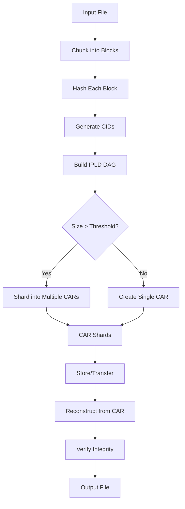

# 08. CAR File Processing

## Table of Contents

### Part 1: CAR Format and IPLD Fundamentals
- [CAR Format Overview](#car-format-overview)
- [IPLD DAG Structure](#ipld-dag-structure)
- [UnixFS Encoding](#unixfs-encoding)

### Part 2: Implementation and Algorithms
- [DAG Generation](#dag-generation)
- [CAR Encoding and Decoding](#car-encoding-and-decoding)
- [Sharding Algorithm](#sharding-algorithm)
- [CID Generation](#cid-generation)
- [Merkle Tree Structure](#merkle-tree-structure)

### Part 3: File Operations and Optimization
- [File Reconstruction](#file-reconstruction)
- [Performance Optimization](#performance-optimization)
- [Best Practices](#best-practices)

---

# Part 1: CAR Format and IPLD Fundamentals

## CAR Format Overview

### What is CAR?

**CAR (Content Addressable aRchive)** is a format for serialized archives of IPLD (InterPlanetary Linked Data) blocks. CAR files enable efficient storage and transfer of content-addressed data.

**Key Characteristics**:
- **Content-Addressed**: Each block identified by its cryptographic hash (CID)
- **Self-Describing**: Contains metadata about the data structure
- **Stream-Friendly**: Can be read/written sequentially
- **IPLD-Compatible**: Works with any IPLD codec (DAG-CBOR, DAG-JSON, DAG-PB, etc.)

**Purpose in Storacha**:
- Store shards of large files
- Transfer data between clients and services
- Archive complete DAGs for backup/replication
- Enable efficient data verification

### CARv1 Format Specification

CARv1 is the primary CAR format used in Storacha and IPFS ecosystems.

#### Binary Structure

```
┌─────────────────────────────────────────┐
│  Header (length-prefixed CBOR)         │
│  - version: 1                           │
│  - roots: [CID, CID, ...]               │
└─────────────────────────────────────────┘
│  Block 1 (length-prefixed)              │
│  - CID length                           │
│  - CID bytes                            │
│  - Block data                           │
├─────────────────────────────────────────┤
│  Block 2 (length-prefixed)              │
│  - CID length                           │
│  - CID bytes                            │
│  - Block data                           │
├─────────────────────────────────────────┤
│  ...                                    │
├─────────────────────────────────────────┤
│  Block N (length-prefixed)              │
│  - CID length                           │
│  - CID bytes                            │
│  - Block data                           │
└─────────────────────────────────────────┘
```

#### Header Structure

The header is CBOR-encoded and contains:

```typescript
interface CARv1Header {
  version: 1,              // Always 1 for CARv1
  roots: CID[]             // Array of root CIDs in this CAR
}
```

**Example Header (CBOR)**:
```
{
  version: 1,
  roots: [
    CID(bafybeigdyrzt5sfp7udm7hu76uh7y26nf3efuylqabf3oclgtqy55fbzdi)
  ]
}
```

#### Block Encoding

Each block in the data section is encoded as:

```
[length][CID bytes][block data]
  │        │           │
  │        │           └─> Raw block bytes
  │        └─> CID identifying this block
  └─> varint length of (CID bytes + block data)
```

**Varint Encoding**: Variable-length integer encoding (from Protocol Buffers)
- 1 byte for values 0-127
- 2 bytes for values 128-16,383
- Etc.

**Example Block Encoding**:
```javascript
// Block with CID and data
const block = {
  cid: CID.parse('bafybeigdyrzt5sfp7udm7hu76uh7y26nf3efuylqabf3oclgtqy55fbzdi'),
  bytes: new Uint8Array([/* block data */])
}

// Encoded as:
// [varint: total length][CID bytes][block bytes]
const encoded = encode([
  varint(block.cid.bytes.length + block.bytes.length),
  block.cid.bytes,
  block.bytes
])
```

### CARv2 Format

CARv2 is an incremental upgrade that wraps CARv1 with additional metadata and indexing.

**Structure**:
```
┌─────────────────────────────────────────┐
│  CARv2 Header (fixed 51 bytes)          │
│  - Characteristics                      │
│  - Data offset                          │
│  - Data size                            │
│  - Index offset                         │
└─────────────────────────────────────────┘
│  CARv1 Data (complete CARv1 archive)    │
│  - Header                               │
│  - Blocks                               │
└─────────────────────────────────────────┘
│  Index (optional)                       │
│  - Block offset index                   │
│  - Enables random access                │
└─────────────────────────────────────────┘
```

**Advantages of CARv2**:
- **Random Access**: Index allows seeking to specific blocks without scanning
- **Streaming Compatibility**: Can be read as CARv1 by seeking past header
- **Backward Compatible**: Contains complete CARv1 data
- **Optional Index**: Index can be omitted for streaming use cases

**Storacha Usage**: Primarily uses CARv1 for simplicity and streaming efficiency. CARv2 may be used for local caching scenarios.

### CAR File Example

**Creating a Simple CAR File**:

```javascript
import { CarWriter } from '@ipld/car'
import { CID } from 'multiformats/cid'
import * as Block from 'multiformats/block'
import { sha256 } from 'multiformats/hashes/sha2'
import * as dagCBOR from '@ipld/dag-cbor'

async function createSimpleCAR() {
  // 1. Create some blocks
  const block1 = await Block.encode({
    value: { name: 'Alice', age: 30 },
    codec: dagCBOR,
    hasher: sha256
  })

  const block2 = await Block.encode({
    value: { name: 'Bob', age: 25 },
    codec: dagCBOR,
    hasher: sha256
  })

  // 2. Create CAR writer
  const { writer, out } = CarWriter.create([block1.cid]) // Root CID

  // 3. Write blocks
  writer.put(block1)
  writer.put(block2)
  await writer.close()

  // 4. Get CAR bytes
  const carBytes = []
  for await (const chunk of out) {
    carBytes.push(chunk)
  }

  const car = new Uint8Array(Buffer.concat(carBytes))
  console.log(`CAR file size: ${car.length} bytes`)

  return car
}
```

**Reading a CAR File**:

```javascript
import { CarReader } from '@ipld/car'

async function readCAR(carBytes) {
  // 1. Parse CAR
  const reader = await CarReader.fromBytes(carBytes)

  // 2. Get roots
  const roots = await reader.getRoots()
  console.log('Root CIDs:', roots.map(cid => cid.toString()))

  // 3. Iterate through blocks
  for await (const { cid, bytes } of reader.blocks()) {
    console.log(`Block ${cid}:`, bytes.length, 'bytes')

    // Decode block data
    const block = await Block.decode({
      bytes,
      codec: dagCBOR,
      hasher: sha256
    })

    console.log('  Value:', block.value)
  }
}
```

### CAR Media Type

**IANA Registered Media Type**: `application/vnd.ipld.car`

**HTTP Headers**:
```http
Content-Type: application/vnd.ipld.car; version=1
Content-Disposition: attachment; filename="data.car"
```

**File Extension**: `.car`

---

## IPLD DAG Structure

### What is IPLD?

**IPLD (InterPlanetary Linked Data)** is a data model for content-addressed data structures. It provides a unified way to represent and link data across different formats.

**Core Principles**:
- **Content Addressing**: Data identified by cryptographic hash
- **Codec Independence**: Supports multiple serialization formats
- **Link-Based**: Connections between data structures via CIDs
- **Immutable**: Changes create new versions, old versions preserved

### DAG (Directed Acyclic Graph)

**Properties**:
- **Directed**: Edges have direction (parent → child)
- **Acyclic**: No cycles (can't navigate back to starting point)
- **Merkle DAG**: Each node identified by hash of its content

**Why DAGs?**
- Efficient deduplication (same content = same hash)
- Cryptographic verification (parent hash covers children)
- Parallel traversal (multiple branches independent)
- History tracking (immutable version graph)

**DAG Example**:
```
        ┌──────────┐
        │  Root    │  bafybei...abc
        │ (Dir)    │
        └────┬─────┘
             │
      ┌──────┴──────┐
      │             │
┌─────▼────┐  ┌────▼─────┐
│ File A   │  │  File B  │  bafybei...def  bafybei...ghi
│ (Data)   │  │  (Data)  │
└──────────┘  └──────────┘
```

### IPLD Codecs

Codecs define how data is serialized:

| Codec | Code | Description | Use Case |
|-------|------|-------------|----------|
| **dag-pb** | 0x70 | Protocol Buffers + links | Files, directories (UnixFS) |
| **dag-cbor** | 0x71 | CBOR with IPLD links | General data structures |
| **dag-json** | 0x0129 | JSON with CID links | Human-readable data |
| **raw** | 0x55 | Raw binary data | File chunks, leaves |

**Example: DAG-CBOR**:
```javascript
import * as dagCBOR from '@ipld/dag-cbor'
import { CID } from 'multiformats/cid'

const data = {
  name: 'document.txt',
  size: 1024,
  link: CID.parse('bafybeigdyrzt5sfp7udm7hu76uh7y26nf3efuylqabf3oclgtqy55fbzdi')
}

const bytes = dagCBOR.encode(data)
// Encoded as CBOR with CID preserved as CBOR tag 42
```

### DAG-PB (Protocol Buffers)

**DAG-PB** is the most common codec in IPFS, used for UnixFS structures.

**Protobuf Schema**:
```protobuf
message PBNode {
  repeated PBLink Links = 2;
  optional bytes Data = 1;
}

message PBLink {
  optional bytes Hash = 1;   // CID (multihash) of linked node
  optional string Name = 2;  // Link name (e.g., filename)
  optional uint64 Tsize = 3; // Total size of linked DAG
}
```

**TypeScript Representation**:
```typescript
interface DAGPBNode {
  Data?: Uint8Array,    // Opaque payload (often UnixFS metadata)
  Links: DAGPBLink[]    // Links to child nodes
}

interface DAGPBLink {
  Hash: CID,            // CID of linked node
  Name?: string,        // Optional link name
  Tsize?: number        // Total size of subtree
}
```

**Example: Directory Node**:
```javascript
import * as dagPB from '@ipld/dag-pb'

const directoryNode = {
  Data: new Uint8Array([/* UnixFS directory metadata */]),
  Links: [
    {
      Hash: CID.parse('bafybei...file1'),
      Name: 'file1.txt',
      Tsize: 1024
    },
    {
      Hash: CID.parse('bafybei...file2'),
      Name: 'file2.txt',
      Tsize: 2048
    }
  ]
}

const encoded = dagPB.encode(directoryNode)
const cid = await sha256.digest(encoded)
```

### Link Direction and Construction

**Key Insight**: Merkle DAGs must be constructed **bottom-up** (leaves → root).

**Why?**
- Parent nodes contain child CIDs
- CID = hash(node content + child CIDs)
- Therefore, children must exist before parents

**Construction Order**:
```javascript
async function buildDAG() {
  // 1. Create leaf nodes first
  const leaf1 = await createBlock({ data: 'Hello' })
  const leaf2 = await createBlock({ data: 'World' })

  // 2. Create parent node referencing leaves
  const parent = await createBlock({
    links: [leaf1.cid, leaf2.cid]
  })

  // ✅ Valid: Parent references existing children
  // ❌ Invalid: Cannot create parent before children
}
```

**DAG Traversal Example**:
```javascript
async function traverseDAG(rootCID, blockstore) {
  const visited = new Set()
  const queue = [rootCID]

  while (queue.length > 0) {
    const cid = queue.shift()

    if (visited.has(cid.toString())) continue
    visited.add(cid.toString())

    // Get block from storage
    const block = await blockstore.get(cid)
    console.log(`Visiting: ${cid}`)

    // Decode block
    const node = dagPB.decode(block)

    // Add child links to queue
    for (const link of node.Links) {
      queue.push(link.Hash)
    }
  }

  console.log(`Traversed ${visited.size} blocks`)
}
```

---

## UnixFS Encoding

### What is UnixFS?

**UnixFS** is an IPLD data format that describes files, directories, and metadata in a Unix-like filesystem abstraction.

**Purpose**:
- Represent file hierarchies in IPLD
- Store file metadata (size, timestamps, permissions)
- Enable efficient chunking and reassembly
- Support large files via DAG sharding

**Layer Position**:
```
Application
    ↓
UnixFS (file/directory abstraction)
    ↓
DAG-PB (protobuf + links)
    ↓
IPLD (content addressing)
    ↓
Blocks (bytes)
```

### UnixFS Protobuf Schema

```protobuf
message Data {
  enum DataType {
    Raw = 0;
    Directory = 1;
    File = 2;
    Metadata = 3;
    Symlink = 4;
    HAMTShard = 5;
  }

  required DataType Type = 1;
  optional bytes Data = 2;         // File data or symlink target
  optional uint64 filesize = 3;    // Total file size
  repeated uint64 blocksizes = 4;  // Sizes of child blocks
  optional uint64 hashType = 5;    // Hash algorithm
  optional uint64 fanout = 6;      // HAMT fanout
}
```

**TypeScript Representation**:
```typescript
enum UnixFSType {
  Raw = 0,
  Directory = 1,
  File = 2,
  Metadata = 3,
  Symlink = 4,
  HAMTShard = 5
}

interface UnixFSData {
  Type: UnixFSType,
  Data?: Uint8Array,        // File content or symlink target
  filesize?: bigint,        // Total file size (for sharded files)
  blocksizes?: bigint[],    // Sizes of each child block
  hashType?: bigint,        // Hash algorithm identifier
  fanout?: bigint           // HAMT shard fanout
}
```

### File Chunking

Large files are split into chunks for efficient storage and transfer.

**Chunking Strategies**:

#### 1. Fixed-Size Chunking

Split file into equal-sized chunks (default: 256 KiB in IPFS).

```javascript
async function fixedChunking(fileBytes, chunkSize = 256 * 1024) {
  const chunks = []

  for (let offset = 0; offset < fileBytes.length; offset += chunkSize) {
    const end = Math.min(offset + chunkSize, fileBytes.length)
    const chunk = fileBytes.slice(offset, end)
    chunks.push(chunk)
  }

  return chunks
}

// Example: 1 MB file with 256 KB chunks
// Result: 4 chunks of 256 KB each
```

#### 2. Rabin Fingerprinting

Content-defined chunking that creates boundaries based on data patterns.

**Advantages**:
- Better deduplication (similar files share chunks)
- Handles file edits efficiently (only changed chunks differ)

**Algorithm**:
```javascript
import { create as createRabin } from 'rabin-wasm'

async function rabinChunking(fileBytes) {
  const rabin = await createRabin({
    bits: 18,           // Average chunk size: 2^18 = 256 KB
    min: 128 * 1024,    // Minimum: 128 KB
    max: 512 * 1024     // Maximum: 512 KB
  })

  const chunks = []
  let lastBoundary = 0

  for (let i = 0; i < fileBytes.length; i++) {
    rabin.update(fileBytes[i])

    if (rabin.atBoundary() || i === fileBytes.length - 1) {
      chunks.push(fileBytes.slice(lastBoundary, i + 1))
      lastBoundary = i + 1
      rabin.reset()
    }
  }

  return chunks
}
```

### File Representation

#### Small File (< 256 KiB)

Single block containing UnixFS metadata and file data.

```
┌─────────────────────────────────────┐
│  DAG-PB Node                        │
│  ┌───────────────────────────────┐  │
│  │ Data: UnixFS                  │  │
│  │   Type: File                  │  │
│  │   Data: [file bytes]          │  │
│  │   filesize: 12345             │  │
│  └───────────────────────────────┘  │
│  Links: []                          │
└─────────────────────────────────────┘
```

**Code Example**:
```javascript
import * as UnixFS from '@ipld/unixfs'
import * as dagPB from '@ipld/dag-pb'

async function createSmallFile(fileBytes) {
  // Create UnixFS metadata
  const unixfsData = UnixFS.encode({
    type: 'file',
    data: fileBytes
  })

  // Wrap in DAG-PB node
  const node = {
    Data: unixfsData,
    Links: []
  }

  const block = dagPB.encode(node)
  const cid = await sha256.digest(block)

  return { cid, block }
}
```

#### Large File (> 256 KiB)

Multi-block structure with intermediate nodes.

```
         ┌─────────────────┐
         │  Root Node      │  bafybei...root
         │  Type: File     │  (UnixFS metadata)
         │  filesize: 1MB  │
         │  blocksizes: [] │
         └────────┬────────┘
                  │
       ┌──────────┼──────────┐
       │          │          │
┌──────▼─────┬────▼────┬────▼─────┐
│ Chunk 1    │ Chunk 2 │ Chunk 3  │  Raw blocks
│ (256 KB)   │ (256 KB)│ (256 KB) │  (actual data)
│ bafkrei..1 │bafkrei.2│bafkrei.3 │
└────────────┴─────────┴──────────┘
```

**Code Example**:
```javascript
async function createLargeFile(fileBytes) {
  const chunkSize = 256 * 1024
  const chunks = []
  const blocksizes = []

  // 1. Create leaf chunks
  for (let offset = 0; offset < fileBytes.length; offset += chunkSize) {
    const end = Math.min(offset + chunkSize, fileBytes.length)
    const chunk = fileBytes.slice(offset, end)

    const block = await Block.encode({
      value: chunk,
      codec: raw,  // Raw codec for leaf data
      hasher: sha256
    })

    chunks.push(block)
    blocksizes.push(BigInt(chunk.length))
  }

  // 2. Create root node with UnixFS metadata
  const unixfsData = UnixFS.encode({
    type: 'file',
    filesize: BigInt(fileBytes.length),
    blocksizes: blocksizes
  })

  const rootNode = {
    Data: unixfsData,
    Links: chunks.map((block, i) => ({
      Hash: block.cid,
      Name: '',
      Tsize: block.bytes.length
    }))
  }

  const rootBlock = dagPB.encode(rootNode)
  const rootCID = await sha256.digest(rootBlock)

  return {
    root: { cid: rootCID, block: rootBlock },
    chunks: chunks
  }
}
```

### Directory Representation

#### Flat Directory

Directory with few entries (< 1000 files).

```
         ┌────────────────────┐
         │  Directory Node    │  bafybei...dir
         │  Type: Directory   │
         └──────────┬─────────┘
                    │
       ┌────────────┼────────────┐
       │            │            │
┌──────▼─────┬──────▼─────┬─────▼──────┐
│ file1.txt  │ file2.jpg  │ file3.pdf  │
│ bafybei..1 │ bafybei..2 │ bafybei..3 │
└────────────┴────────────┴────────────┘
```

**Code Example**:
```javascript
async function createDirectory(files) {
  // files: [{ name: 'file1.txt', cid: CID(...), size: 1024 }, ...]

  const unixfsData = UnixFS.encode({
    type: 'directory'
  })

  const dirNode = {
    Data: unixfsData,
    Links: files.map(file => ({
      Hash: file.cid,
      Name: file.name,
      Tsize: file.size
    }))
  }

  const block = dagPB.encode(dirNode)
  const cid = await sha256.digest(block)

  return { cid, block }
}
```

#### HAMT-Sharded Directory

For directories with many entries (> 1000 files), UnixFS uses **HAMT (Hash Array Mapped Trie)** sharding.

**Benefits**:
- Logarithmic lookup time
- Efficient updates (only affected shards change)
- Scales to millions of entries

**Structure**:
```
         ┌────────────────────┐
         │  HAMT Root         │  Type: HAMTShard
         │  fanout: 256       │  fanout: 256
         └──────────┬─────────┘
                    │
       ┌────────────┼────────────┐
       │            │            │
┌──────▼─────┬──────▼─────┬─────▼──────┐
│ Bucket 0x0 │ Bucket 0x1 │ Bucket 0xF │
│ (shard)    │ (shard)    │ (shard)    │
└────────────┴────────────┴────────────┘
     │
     ├─> file1.txt (hash starts with 0x0...)
     ├─> file2.jpg (hash starts with 0x0...)
     └─> ...
```

### Symlinks

Symbolic links stored in UnixFS.

```javascript
async function createSymlink(target) {
  const unixfsData = UnixFS.encode({
    type: 'symlink',
    data: new TextEncoder().encode(target)
  })

  const node = {
    Data: unixfsData,
    Links: []
  }

  const block = dagPB.encode(node)
  const cid = await sha256.digest(block)

  return { cid, block }
}

// Usage
const symlinkBlock = await createSymlink('/path/to/target.txt')
```

### Metadata

Additional metadata (timestamps, permissions, etc.) can be stored.

**Note**: Standard UnixFS doesn't include POSIX metadata by default. Extensions or wrapper formats handle this.

**Example Extension**:
```javascript
interface ExtendedUnixFS {
  unixfs: UnixFSData,
  metadata: {
    mode: number,       // POSIX permissions (e.g., 0755)
    mtime: number,      // Modified time (Unix epoch)
    uid: number,        // User ID
    gid: number         // Group ID
  }
}
```

---

# Part 2: Implementation and Algorithms

## DAG Generation

### File to DAG Conversion

Converting a file to an IPLD DAG involves chunking, encoding, and linking blocks.

**Complete Implementation**:

```javascript
import * as Block from 'multiformats/block'
import { sha256 } from 'multiformats/hashes/sha2'
import * as dagPB from '@ipld/dag-pb'
import * as raw from 'multiformats/codecs/raw'
import * as UnixFS from '@ipld/unixfs'

class DAGBuilder {
  constructor(options = {}) {
    this.chunkSize = options.chunkSize || 256 * 1024  // 256 KiB
    this.maxChildrenPerNode = options.maxChildrenPerNode || 174
    this.hasher = sha256
  }

  async *chunker(fileBytes) {
    // Fixed-size chunking
    for (let offset = 0; offset < fileBytes.length; offset += this.chunkSize) {
      const end = Math.min(offset + this.chunkSize, fileBytes.length)
      yield fileBytes.slice(offset, end)
    }
  }

  async createLeafBlock(chunkBytes) {
    // Create raw block for leaf data
    return await Block.encode({
      value: chunkBytes,
      codec: raw,
      hasher: this.hasher
    })
  }

  async createFileNode(links, blocksizes, filesize) {
    // Create UnixFS file node
    const unixfsData = UnixFS.encode({
      type: 'file',
      filesize: BigInt(filesize),
      blocksizes: blocksizes.map(s => BigInt(s))
    })

    const node = {
      Data: unixfsData,
      Links: links.map((link, i) => ({
        Hash: link.cid,
        Name: '',
        Tsize: link.size
      }))
    }

    const bytes = dagPB.encode(node)
    const hash = await this.hasher.digest(bytes)
    const cid = CID.create(1, dagPB.code, hash)

    return { cid, bytes, node }
  }

  async *buildDAG(fileBytes) {
    const blocks = []
    const blocksizes = []

    // 1. Create leaf blocks
    for await (const chunk of this.chunker(fileBytes)) {
      const block = await this.createLeafBlock(chunk)
      blocks.push(block)
      blocksizes.push(chunk.length)
      yield block  // Yield for streaming
    }

    // 2. Build tree structure (if needed)
    let currentLevel = blocks.map((block, i) => ({
      cid: block.cid,
      size: blocksizes[i]
    }))

    while (currentLevel.length > this.maxChildrenPerNode) {
      const nextLevel = []

      for (let i = 0; i < currentLevel.length; i += this.maxChildrenPerNode) {
        const children = currentLevel.slice(i, i + this.maxChildrenPerNode)
        const totalSize = children.reduce((sum, c) => sum + c.size, 0)

        const node = await this.createFileNode(
          children,
          children.map(c => c.size),
          totalSize
        )

        nextLevel.push({ cid: node.cid, size: totalSize })
        yield { cid: node.cid, bytes: node.bytes }  // Yield intermediate node
      }

      currentLevel = nextLevel
    }

    // 3. Create root node
    const rootNode = await this.createFileNode(
      currentLevel,
      blocksizes,
      fileBytes.length
    )

    yield { cid: rootNode.cid, bytes: rootNode.bytes, isRoot: true }
  }
}

// Usage
async function fileToDAG(fileBytes) {
  const builder = new DAGBuilder()
  const blocks = []

  for await (const block of builder.buildDAG(fileBytes)) {
    blocks.push(block)
    console.log(`Generated block: ${block.cid} (${block.bytes?.length || 0} bytes)`)
  }

  const root = blocks[blocks.length - 1]
  console.log(`Root CID: ${root.cid}`)

  return { root: root.cid, blocks }
}
```

### Balanced vs Trickle DAG

Two common strategies for organizing file DAGs:

#### Balanced DAG (Default in IPFS)

Attempts to create a balanced tree structure.

```
              Root
               │
       ┌───────┼───────┐
       │       │       │
      Int1    Int2    Int3
       │       │       │
   ┌───┼───┐───┼───┌───┼───┐
  L1  L2  L3  L4  L5  L6  L7  L8
```

**Characteristics**:
- Minimal tree depth
- Even distribution of children
- Better for random access
- More memory needed during construction

**Implementation**:
```javascript
async function balancedDAG(leafBlocks, maxChildren = 174) {
  if (leafBlocks.length <= maxChildren) {
    // Create root directly
    return await createParentNode(leafBlocks)
  }

  // Build intermediate layers
  let currentLevel = leafBlocks

  while (currentLevel.length > maxChildren) {
    const nextLevel = []

    for (let i = 0; i < currentLevel.length; i += maxChildren) {
      const children = currentLevel.slice(i, i + maxChildren)
      const parent = await createParentNode(children)
      nextLevel.push(parent)
    }

    currentLevel = nextLevel
  }

  // Create final root
  return await createParentNode(currentLevel)
}
```

#### Trickle DAG

Creates a wider, shallower tree with sequential access optimization.

```
              Root
               │
       ┌───────┼───────────────┐
       │       │               │
      Int1    Int2            Int3
    ┌──┼──┐ ┌──┼──┐        ┌──┼──┐
   L1 L2 L3 L4 L5 L6  ...  Ln-2 Ln-1 Ln
```

**Characteristics**:
- Optimized for sequential reads
- Streaming-friendly
- Less memory during construction
- Better for video/audio files

**Implementation**:
```javascript
async function trickleDAG(leafBlocks, maxChildren = 174) {
  const root = []
  let currentBatch = []

  for (let i = 0; i < leafBlocks.length; i++) {
    currentBatch.push(leafBlocks[i])

    // Create intermediate node every N blocks
    if (currentBatch.length === maxChildren || i === leafBlocks.length - 1) {
      const intermediate = await createParentNode(currentBatch)
      root.push(intermediate)
      currentBatch = []
    }
  }

  // Create final root
  return await createParentNode(root)
}
```

### Directory to DAG Conversion

**Directory DAG Generation**:

```javascript
async function directoryToDAG(entries) {
  // entries: [{ name: 'file1.txt', cid: CID, size: 1024 }, ...]

  // Check if HAMT sharding needed (> 1000 entries)
  if (entries.length > 1000) {
    return await createHAMTDirectory(entries)
  }

  // Create flat directory
  const unixfsData = UnixFS.encode({
    type: 'directory'
  })

  const links = entries.map(entry => ({
    Hash: entry.cid,
    Name: entry.name,
    Tsize: entry.size
  }))

  // Sort links by name for deterministic CIDs
  links.sort((a, b) => a.Name.localeCompare(b.Name))

  const node = {
    Data: unixfsData,
    Links: links
  }

  const bytes = dagPB.encode(node)
  const hash = await sha256.digest(bytes)
  const cid = CID.create(1, dagPB.code, hash)

  return { cid, bytes }
}
```

**HAMT Directory Implementation**:

```javascript
import { murmur3 } from 'murmurhash-wasm'

async function createHAMTDirectory(entries, fanout = 256) {
  // Initialize buckets
  const buckets = Array.from({ length: fanout }, () => [])

  // Distribute entries across buckets using hash
  for (const entry of entries) {
    const hash = murmur3(entry.name)
    const bucketIndex = hash % fanout
    buckets[bucketIndex].push(entry)
  }

  // Create bucket nodes
  const bucketNodes = []

  for (let i = 0; i < fanout; i++) {
    if (buckets[i].length === 0) continue

    // Recursively create sub-HAMT if bucket too large
    if (buckets[i].length > fanout) {
      const subHAMT = await createHAMTDirectory(buckets[i], fanout)
      bucketNodes.push({
        name: i.toString(16).padStart(2, '0'),
        cid: subHAMT.cid,
        size: subHAMT.bytes.length
      })
    } else {
      // Create flat bucket
      const bucketDir = await directoryToDAG(buckets[i])
      bucketNodes.push({
        name: i.toString(16).padStart(2, '0'),
        cid: bucketDir.cid,
        size: bucketDir.bytes.length
      })
    }
  }

  // Create HAMT root
  const unixfsData = UnixFS.encode({
    type: 'hamt-sharded-directory',
    fanout: BigInt(fanout),
    hashType: 0x22  // murmur3-32
  })

  const links = bucketNodes.map(bucket => ({
    Hash: bucket.cid,
    Name: bucket.name,
    Tsize: bucket.size
  }))

  const node = {
    Data: unixfsData,
    Links: links
  }

  const bytes = dagPB.encode(node)
  const hash = await sha256.digest(bytes)
  const cid = CID.create(1, dagPB.code, hash)

  return { cid, bytes }
}
```

---

## CAR Encoding and Decoding

### CAR Writer Implementation

**Streaming CAR Writer**:

```javascript
import { CarWriter } from '@ipld/car'
import { Readable } from 'stream'

class StreamingCARWriter {
  constructor(roots) {
    this.roots = roots
    this.blocks = []
  }

  addBlock(cid, bytes) {
    this.blocks.push({ cid, bytes })
  }

  async *encode() {
    // 1. Encode header
    const header = {
      version: 1,
      roots: this.roots
    }

    const headerBytes = dagCBOR.encode(header)
    const headerLength = encodeVarint(headerBytes.length)

    yield new Uint8Array([...headerLength, ...headerBytes])

    // 2. Encode blocks
    for (const { cid, bytes } of this.blocks) {
      const cidBytes = cid.bytes
      const blockLength = encodeVarint(cidBytes.length + bytes.length)

      yield new Uint8Array([
        ...blockLength,
        ...cidBytes,
        ...bytes
      ])
    }
  }

  async writeToFile(filepath) {
    const writer = fs.createWriteStream(filepath)

    for await (const chunk of this.encode()) {
      writer.write(chunk)
    }

    writer.end()
  }
}

// Varint encoding (Protocol Buffers style)
function encodeVarint(value) {
  const bytes = []

  while (value >= 0x80) {
    bytes.push((value & 0x7f) | 0x80)
    value >>>= 7
  }

  bytes.push(value & 0x7f)
  return new Uint8Array(bytes)
}

// Usage
async function createCAR(rootCID, blocks) {
  const writer = new StreamingCARWriter([rootCID])

  for (const block of blocks) {
    writer.addBlock(block.cid, block.bytes)
  }

  await writer.writeToFile('output.car')
  console.log('CAR file created')
}
```

### CAR Reader Implementation

**Streaming CAR Reader**:

```javascript
class StreamingCARReader {
  constructor(carBytes) {
    this.buffer = carBytes
    this.offset = 0
  }

  readVarint() {
    let value = 0
    let shift = 0

    while (this.offset < this.buffer.length) {
      const byte = this.buffer[this.offset++]
      value |= (byte & 0x7f) << shift

      if ((byte & 0x80) === 0) break

      shift += 7
    }

    return value
  }

  async readHeader() {
    // Read header length
    const headerLength = this.readVarint()

    // Read header bytes
    const headerBytes = this.buffer.slice(this.offset, this.offset + headerLength)
    this.offset += headerLength

    // Decode header
    const header = dagCBOR.decode(headerBytes)
    return header
  }

  async *readBlocks() {
    while (this.offset < this.buffer.length) {
      // Read block length
      const blockLength = this.readVarint()
      if (blockLength === 0) break

      // Read block data
      const blockData = this.buffer.slice(this.offset, this.offset + blockLength)
      this.offset += blockLength

      // Parse CID and block bytes
      const cid = CID.decode(blockData)
      const cidLength = cid.bytes.length
      const bytes = blockData.slice(cidLength)

      yield { cid, bytes }
    }
  }
}

// Usage
async function readCAR(carBytes) {
  const reader = new StreamingCARReader(carBytes)

  // Read header
  const header = await reader.readHeader()
  console.log('Roots:', header.roots.map(cid => cid.toString()))

  // Read blocks
  const blocks = []
  for await (const block of reader.readBlocks()) {
    blocks.push(block)
    console.log(`Block: ${block.cid} (${block.bytes.length} bytes)`)
  }

  return { header, blocks }
}
```

### Memory-Efficient CAR Processing

For large CAR files, streaming is essential:

```javascript
import { CarBlockIterator } from '@ipld/car'
import fs from 'fs'

async function processLargeCAR(filepath) {
  const stream = fs.createReadStream(filepath)
  const iterator = await CarBlockIterator.fromIterable(stream)

  const roots = await iterator.getRoots()
  console.log('Roots:', roots)

  let blockCount = 0
  let totalSize = 0

  for await (const { cid, bytes } of iterator) {
    blockCount++
    totalSize += bytes.length

    // Process block (e.g., verify, extract, re-encode)
    await processBlock(cid, bytes)

    // Avoid loading all blocks into memory
    if (blockCount % 1000 === 0) {
      console.log(`Processed ${blockCount} blocks (${totalSize} bytes)`)
    }
  }

  console.log(`Total: ${blockCount} blocks, ${totalSize} bytes`)
}
```

---

## Sharding Algorithm

### Why Shard CARs?

**Problem**: Large DAGs may produce CAR files exceeding service limits (typically 100-200 MB per CAR in Storacha).

**Solution**: Split DAG across multiple CAR files while maintaining integrity.

### Sharding Strategy

**Key Principles**:
1. Each shard is a valid, complete CAR
2. Shards reference same root CID
3. Blocks distributed across shards (no duplication)
4. Last shard contains root block

**Shard Structure**:
```
Shard 1:
  roots: [rootCID]
  blocks: [leaf1, leaf2, leaf3, ...]

Shard 2:
  roots: [rootCID]
  blocks: [leaf4, leaf5, leaf6, ...]

Shard N (final):
  roots: [rootCID]
  blocks: [..., intermediate1, intermediate2, rootBlock]
```

### Storacha Sharding Implementation

```javascript
import { ShardingStream } from '@web3-storage/upload-client'

class CARShardingStream {
  constructor(options = {}) {
    this.maxShardSize = options.maxShardSize || 100 * 1024 * 1024  // 100 MB
    this.currentShard = []
    this.currentSize = 0
    this.shards = []
  }

  async *shard(blocks, rootCID) {
    for (const block of blocks) {
      // Add block to current shard
      this.currentShard.push(block)
      this.currentSize += block.cid.bytes.length + block.bytes.length

      // Check if shard is full
      if (this.currentSize >= this.maxShardSize) {
        // Finalize current shard
        const shard = await this.finalizeShard(rootCID, this.currentShard)
        yield shard

        // Start new shard
        this.currentShard = []
        this.currentSize = 0
      }
    }

    // Finalize last shard (contains root)
    if (this.currentShard.length > 0) {
      const shard = await this.finalizeShard(rootCID, this.currentShard, true)
      yield shard
    }
  }

  async finalizeShard(rootCID, blocks, isLast = false) {
    const writer = new StreamingCARWriter([rootCID])

    for (const block of blocks) {
      writer.addBlock(block.cid, block.bytes)
    }

    // Encode to bytes
    const chunks = []
    for await (const chunk of writer.encode()) {
      chunks.push(chunk)
    }

    const carBytes = new Uint8Array(Buffer.concat(chunks))

    // Compute CAR CID
    const carCID = await computeCARCID(carBytes)

    return {
      cid: carCID,
      bytes: carBytes,
      roots: [rootCID],
      blocks: blocks.length,
      isLast
    }
  }
}

// Compute CID for CAR file itself
async function computeCARCID(carBytes) {
  const hash = await sha256.digest(carBytes)
  return CID.create(1, 0x0202, hash)  // CAR codec: 0x0202
}

// Usage with file upload
async function uploadFileWithSharding(fileBytes, client) {
  const builder = new DAGBuilder()
  const sharding = new CARShardingStream({ maxShardSize: 100 * 1024 * 1024 })

  // 1. Build DAG
  const blocks = []
  let rootCID

  for await (const block of builder.buildDAG(fileBytes)) {
    blocks.push(block)
    if (block.isRoot) {
      rootCID = block.cid
    }
  }

  // 2. Shard into CARs
  const shards = []
  for await (const shard of sharding.shard(blocks, rootCID)) {
    shards.push(shard)
    console.log(`Shard ${shard.cid}: ${shard.bytes.length} bytes, ${shard.blocks} blocks`)
  }

  // 3. Upload each shard
  for (const shard of shards) {
    await client.storeCar(shard.bytes)
  }

  // 4. Register upload with root + shard CIDs
  await client.registerUpload({
    root: rootCID,
    shards: shards.map(s => s.cid)
  })

  console.log(`File uploaded: ${rootCID}`)
  console.log(`Total shards: ${shards.length}`)

  return rootCID
}
```

### Smart Sharding

Optimize shard boundaries to avoid splitting logical units:

```javascript
class SmartShardingStream extends CARShardingStream {
  constructor(options) {
    super(options)
    this.minShardSize = options.minShardSize || 50 * 1024 * 1024  // 50 MB
  }

  shouldFinalizeShard(nextBlock) {
    // Don't finalize if under minimum size
    if (this.currentSize < this.minShardSize) {
      return false
    }

    // Finalize if next block would exceed max
    const nextSize = this.currentSize + nextBlock.cid.bytes.length + nextBlock.bytes.length

    if (nextSize > this.maxShardSize) {
      return true
    }

    // Check if next block is a logical boundary (e.g., end of file chunk group)
    if (this.isLogicalBoundary(nextBlock)) {
      return this.currentSize >= this.minShardSize
    }

    return false
  }

  isLogicalBoundary(block) {
    // Heuristic: intermediate nodes (non-raw codec) are good boundaries
    return block.cid.code !== 0x55  // Not raw codec
  }
}
```

---

## CID Generation

### CID Structure

A **CID (Content Identifier)** is a self-describing hash of content.

**Components**:
```
┌─────────┬──────────┬────────────┬────────────┐
│Multibase│CID Version│Multicodec │ Multihash  │
│  (v1)   │   (v1)    │  (codec)   │  (hash)    │
└─────────┴──────────┴────────────┴────────────┘
    │          │            │            │
    │          │            │            └─> Hash algorithm + digest
    │          │            └─> Data format (dag-pb, raw, etc.)
    │          └─> CID spec version
    └─> Encoding (base32, base58, etc.)
```

**CIDv0** (Legacy):
- Implicit: Base58, SHA-256, DAG-PB
- Format: `Qm...` (46 characters)
- Used for backward compatibility

**CIDv1** (Current):
- Explicit all components
- Format: `bafy...` (base32), `bafk...` (raw), etc.
- Flexible, future-proof

### Generating CIDs

**Step-by-Step Process**:

```javascript
import { CID } from 'multiformats/cid'
import { sha256 } from 'multiformats/hashes/sha2'
import * as dagPB from '@ipld/dag-pb'
import * as raw from 'multiformats/codecs/raw'

async function generateCID(data, codec, hasher) {
  // 1. Encode data using codec
  const bytes = codec.encode(data)

  // 2. Hash encoded bytes
  const hash = await hasher.digest(bytes)

  // 3. Create CID
  const cid = CID.create(
    1,            // CID version
    codec.code,   // Codec code
    hash          // Multihash
  )

  return cid
}

// Example: Generate CID for raw data
async function rawCID(data) {
  return await generateCID(
    data,
    raw,      // Codec: raw (0x55)
    sha256    // Hasher: SHA-256
  )
}

// Example: Generate CID for DAG-PB node
async function dagPBCID(node) {
  return await generateCID(
    node,
    dagPB,    // Codec: dag-pb (0x70)
    sha256    // Hasher: SHA-256
  )
}

// Usage
const data = new Uint8Array([1, 2, 3, 4, 5])
const cid = await rawCID(data)
console.log('CID:', cid.toString())
// Output: bafkreiabcd... (base32-encoded CIDv1)
```

### Multihash

**Multihash** is a self-describing hash format.

**Structure**:
```
[hash code][hash length][hash digest bytes]
     │          │              │
     │          │              └─> Actual hash output
     │          └─> Length of digest in bytes
     └─> Hash algorithm identifier
```

**Common Hash Algorithms**:

| Name | Code | Digest Length | Use Case |
|------|------|---------------|----------|
| SHA-256 | 0x12 | 32 bytes | Default, widely supported |
| SHA-512 | 0x13 | 64 bytes | Higher security |
| BLAKE2b-256 | 0xb220 | 32 bytes | Fast, efficient |
| BLAKE3 | 0x1e | 32 bytes | Very fast |

**Creating Multihash**:

```javascript
import { sha256, sha512 } from 'multiformats/hashes/sha2'
import { blake2b256 } from '@multiformats/blake2/blake2b'

async function createMultihash(data, hasher) {
  const hash = await hasher.digest(data)

  console.log('Hash code:', hash.code)
  console.log('Hash size:', hash.size)
  console.log('Hash digest:', hash.digest)

  return hash
}

// Example
const data = new TextEncoder().encode('Hello, IPFS!')

const sha256Hash = await createMultihash(data, sha256)
console.log('SHA-256:', sha256Hash.bytes)

const blake2Hash = await createMultihash(data, blake2b256)
console.log('BLAKE2b-256:', blake2Hash.bytes)
```

### Multicodec

**Multicodec** identifies the data format.

**Common Codecs**:

| Name | Code | Description |
|------|------|-------------|
| raw | 0x55 | Raw binary data |
| dag-pb | 0x70 | Protocol Buffers + IPLD links |
| dag-cbor | 0x71 | CBOR + IPLD links |
| dag-json | 0x0129 | JSON + IPLD links |
| car | 0x0202 | CAR file |

**Using Different Codecs**:

```javascript
import * as raw from 'multiformats/codecs/raw'
import * as dagCBOR from '@ipld/dag-cbor'
import * as dagJSON from '@ipld/dag-json'

// Raw codec (identity encoding)
const rawData = new Uint8Array([1, 2, 3])
const rawEncoded = raw.encode(rawData)
// rawEncoded === rawData (identity)

// DAG-CBOR codec
const cborData = { name: 'Alice', age: 30 }
const cborEncoded = dagCBOR.encode(cborData)
// cborEncoded is CBOR bytes

// DAG-JSON codec
const jsonData = { name: 'Bob', link: someCID }
const jsonEncoded = dagJSON.encode(jsonData)
// jsonEncoded is JSON string bytes with CID preserved
```

### Multibase

**Multibase** specifies the encoding of CID string representation.

**Common Bases**:

| Name | Prefix | Use Case |
|------|--------|----------|
| base32 | `b` | CIDv1 default, case-insensitive |
| base58btc | `z` | CIDv0 default, compact |
| base64 | `m` | URL-safe |
| base16 (hex) | `f` | Debugging |

**Converting Between Bases**:

```javascript
import { base32, base58btc, base64 } from 'multiformats/bases'

const cid = CID.parse('bafybeigdyrzt5sfp7udm7hu76uh7y26nf3efuylqabf3oclgtqy55fbzdi')

// Base32 (default for CIDv1)
console.log('Base32:', cid.toString(base32))
// Output: bafybeigdyrzt5sfp7udm7hu76uh7y26nf3efuylqabf3oclgtqy55fbzdi

// Base58 (CIDv0 style)
console.log('Base58:', cid.toString(base58btc))
// Output: zdpuAmoZixxJjvosviGeYcqduzDhSwGV2bL6ZTTXo1hbEJHfq

// Base64
console.log('Base64:', cid.toString(base64))
// Output: mAXASIHMw...

// Hex (for debugging)
console.log('Hex:', cid.toString(base16))
// Output: f01701220a1b2c3d...
```

### CID Versions

**CIDv0**:
```javascript
// Creating CIDv0 (backward compatibility)
const cidv0 = CID.createV0(sha256Hash)
console.log('CIDv0:', cidv0.toString())
// Output: Qm... (always base58, always dag-pb, always sha256)
```

**CIDv1**:
```javascript
// Creating CIDv1
const cidv1 = CID.create(1, dagPB.code, sha256Hash)
console.log('CIDv1:', cidv1.toString())
// Output: bafy... (explicit codec and hasher)
```

**Converting CIDv0 to CIDv1**:
```javascript
const cidv0 = CID.parse('QmHash...')
const cidv1 = cidv0.toV1()
console.log('Upgraded:', cidv1.toString())
```

---

## Merkle Tree Structure

### What is a Merkle Tree?

A **Merkle Tree** is a tree data structure where each node's identifier is the hash of its content and children's identifiers.

**Properties**:
- **Tamper-Proof**: Any change propagates up, changing root hash
- **Efficient Verification**: Prove inclusion with O(log n) hashes
- **Deduplication**: Identical subtrees share same hash

**Structure**:
```
                Root Hash
                 h(ABCD)
                    │
         ┌──────────┴──────────┐
         │                     │
      h(AB)                  h(CD)
         │                     │
    ┌────┴────┐           ┌────┴────┐
    │         │           │         │
  h(A)      h(B)        h(C)      h(D)
    │         │           │         │
   [A]       [B]         [C]       [D]
  (Leaf)   (Leaf)      (Leaf)    (Leaf)
```

### Building Merkle Trees

**Bottom-Up Construction**:

```javascript
class MerkleTree {
  constructor(hasher = sha256) {
    this.hasher = hasher
  }

  async buildTree(leaves) {
    // 1. Hash leaves to create bottom layer
    let currentLayer = await Promise.all(
      leaves.map(async (leaf) => await this.hasher.digest(leaf))
    )

    const layers = [currentLayer]

    // 2. Build layers bottom-up
    while (currentLayer.length > 1) {
      const nextLayer = []

      for (let i = 0; i < currentLayer.length; i += 2) {
        const left = currentLayer[i]
        const right = currentLayer[i + 1] || left  // Duplicate if odd

        // Hash(left + right)
        const combined = new Uint8Array([...left.digest, ...right.digest])
        const parentHash = await this.hasher.digest(combined)

        nextLayer.push(parentHash)
      }

      layers.push(nextLayer)
      currentLayer = nextLayer
    }

    return {
      root: currentLayer[0],
      layers: layers
    }
  }

  async getProof(leaves, index) {
    const tree = await this.buildTree(leaves)
    const proof = []

    let currentIndex = index

    for (let layerIdx = 0; layerIdx < tree.layers.length - 1; layerIdx++) {
      const layer = tree.layers[layerIdx]
      const isRightNode = currentIndex % 2 === 1
      const siblingIndex = isRightNode ? currentIndex - 1 : currentIndex + 1

      if (siblingIndex < layer.length) {
        proof.push({
          hash: layer[siblingIndex],
          isLeft: !isRightNode
        })
      }

      currentIndex = Math.floor(currentIndex / 2)
    }

    return proof
  }

  async verifyProof(leaf, proof, root) {
    let currentHash = await this.hasher.digest(leaf)

    for (const step of proof) {
      const combined = step.isLeft
        ? new Uint8Array([...step.hash.digest, ...currentHash.digest])
        : new Uint8Array([...currentHash.digest, ...step.hash.digest])

      currentHash = await this.hasher.digest(combined)
    }

    return currentHash.digest.every((byte, i) => byte === root.digest[i])
  }
}

// Usage
async function merkleTreeExample() {
  const tree = new MerkleTree()

  const leaves = [
    new Uint8Array([1, 2, 3]),
    new Uint8Array([4, 5, 6]),
    new Uint8Array([7, 8, 9]),
    new Uint8Array([10, 11, 12])
  ]

  const { root, layers } = await tree.buildTree(leaves)
  console.log('Root hash:', root.digest)

  // Get proof for leaf at index 1
  const proof = await tree.getProof(leaves, 1)
  console.log('Proof steps:', proof.length)

  // Verify proof
  const isValid = await tree.verifyProof(leaves[1], proof, root)
  console.log('Proof valid:', isValid)
}
```

### Merkle Proof (Inclusion Proof)

Prove a leaf is part of a tree with O(log n) hashes:

```javascript
// Proof structure
interface MerkleProof {
  leaf: Uint8Array,
  proof: Array<{
    hash: Multihash,
    isLeft: boolean
  }>,
  root: Multihash
}

// Example proof for leaf index 2 in 8-leaf tree:
const proof = {
  leaf: leaves[2],
  proof: [
    { hash: h(leaf3), isLeft: false },  // Sibling at layer 0
    { hash: h(01), isLeft: true },      // Sibling at layer 1
    { hash: h(4567), isLeft: false }    // Sibling at layer 2
  ],
  root: h(01234567)
}

// Verification reconstructs path:
// h(leaf2) → h(h(leaf2) + h(leaf3)) → h(h(01) + h(23)) → h(h(0123) + h(4567))
// Final hash must equal root
```

### IPLD Merkle DAG vs Classic Merkle Tree

**Classic Merkle Tree**:
- Binary tree
- Only leaf nodes contain data
- Internal nodes are just hashes
- Symmetric structure

**IPLD Merkle DAG**:
- N-ary (any number of children)
- All nodes can contain data
- Internal nodes have semantic meaning
- Asymmetric, application-specific structure

**IPLD DAG Example**:
```javascript
// In IPLD, each node is content-addressable
const leaf1 = await createBlock(fileChunk1)  // CID: bafkrei...1
const leaf2 = await createBlock(fileChunk2)  // CID: bafkrei...2
const leaf3 = await createBlock(fileChunk3)  // CID: bafkrei...3

// Parent node contains data AND links to children
const parent = await createBlock({
  type: 'file',
  size: totalSize,
  links: [leaf1.cid, leaf2.cid, leaf3.cid]
})

// Parent CID = hash(data + child CIDs)
// This provides same Merkle tree security guarantees
```

### Path-Based Traversal

IPLD supports path-based navigation through DAG:

```javascript
async function getByPath(rootCID, path, blockstore) {
  // path: "/dir/subdir/file.txt"
  const segments = path.split('/').filter(s => s.length > 0)

  let currentCID = rootCID

  for (const segment of segments) {
    // Get current block
    const block = await blockstore.get(currentCID)
    const node = dagPB.decode(block)

    // Find link matching segment
    const link = node.Links.find(l => l.Name === segment)

    if (!link) {
      throw new Error(`Path not found: ${segment}`)
    }

    currentCID = link.Hash
  }

  // Return final block
  return await blockstore.get(currentCID)
}

// Usage
const fileBlock = await getByPath(
  rootCID,
  '/documents/2024/report.pdf',
  blockstore
)
```

---

## Part 3: File Reconstruction, Performance Optimization, and Best Practices

### 8. File Reconstruction from CAR Files

Reconstructing files from CAR archives requires traversing the IPLD DAG and reassembling chunks in the correct order.

#### 8.1 Basic File Reconstruction

```javascript
import { CarBlockIterator } from '@ipld/car'
import * as dagPB from '@ipld/dag-pb'
import * as raw from 'multiformats/codecs/raw'
import { UnixFS } from 'ipfs-unixfs'

class FileReconstructor {
  constructor() {
    this.blockstore = new Map() // CID -> Block mapping
  }

  /**
   * Load all blocks from CAR file into blockstore
   */
  async loadCAR(carBytes) {
    const reader = await CarBlockIterator.fromBytes(carBytes)

    for await (const { cid, bytes } of reader) {
      this.blockstore.set(cid.toString(), { cid, bytes })
    }

    // Get root CID from CAR header
    const roots = await reader.getRoots()
    return roots[0]
  }

  /**
   * Reconstruct file from root CID
   */
  async reconstructFile(rootCID) {
    const chunks = []

    await this.traverseDAG(rootCID, async (chunk) => {
      chunks.push(chunk)
    })

    // Concatenate all chunks in order
    const totalLength = chunks.reduce((sum, chunk) => sum + chunk.length, 0)
    const fileBytes = new Uint8Array(totalLength)

    let offset = 0
    for (const chunk of chunks) {
      fileBytes.set(chunk, offset)
      offset += chunk.length
    }

    return fileBytes
  }

  /**
   * Traverse DAG and collect leaf chunks in order
   */
  async traverseDAG(cid, onChunk) {
    const block = this.blockstore.get(cid.toString())

    if (!block) {
      throw new Error(`Block not found: ${cid}`)
    }

    // Try to decode as DAG-PB (UnixFS)
    try {
      const node = dagPB.decode(block.bytes)

      // Check if this is a UnixFS node
      if (node.Data) {
        const unixfs = UnixFS.unmarshal(node.Data)

        if (unixfs.type === 'file') {
          // If node has data directly (small files)
          if (unixfs.data && unixfs.data.length > 0) {
            await onChunk(unixfs.data)
          }

          // Traverse children (large files)
          if (node.Links && node.Links.length > 0) {
            for (const link of node.Links) {
              await this.traverseDAG(link.Hash, onChunk)
            }
          }
        } else if (unixfs.type === 'raw' || unixfs.type === 'file') {
          // Raw data node
          await onChunk(unixfs.data)
        }
      }
    } catch (e) {
      // Not DAG-PB, try as raw block
      await onChunk(block.bytes)
    }
  }
}

// Usage
const reconstructor = new FileReconstructor()

// Load CAR file
const rootCID = await reconstructor.loadCAR(carFileBytes)

// Reconstruct original file
const fileData = await reconstructor.reconstructFile(rootCID)

console.log(`Reconstructed file: ${fileData.length} bytes`)
```

#### 8.2 Streaming File Reconstruction

For large files, streaming reconstruction avoids loading entire file into memory:

```javascript
import { Readable } from 'stream'

class StreamingFileReconstructor {
  constructor(blockstore) {
    this.blockstore = blockstore
  }

  /**
   * Create readable stream from root CID
   */
  createReadStream(rootCID) {
    const self = this
    let currentNodes = [rootCID]
    let buffer = []

    return new Readable({
      async read() {
        try {
          while (currentNodes.length > 0 && buffer.length === 0) {
            const cid = currentNodes.shift()
            await self.processNode(cid, currentNodes, buffer)
          }

          if (buffer.length > 0) {
            this.push(buffer.shift())
          } else {
            // No more data
            this.push(null)
          }
        } catch (err) {
          this.destroy(err)
        }
      }
    })
  }

  async processNode(cid, queue, buffer) {
    const block = await this.blockstore.get(cid)

    try {
      const node = dagPB.decode(block.bytes)
      const unixfs = UnixFS.unmarshal(node.Data)

      if (unixfs.type === 'file') {
        // Add inline data if present
        if (unixfs.data && unixfs.data.length > 0) {
          buffer.push(unixfs.data)
        }

        // Queue children for processing
        if (node.Links) {
          for (const link of node.Links) {
            queue.push(link.Hash)
          }
        }
      }
    } catch (e) {
      // Raw block - add directly
      buffer.push(block.bytes)
    }
  }
}

// Usage
const stream = reconstructor.createReadStream(rootCID)

// Pipe to file
const fs = require('fs')
stream.pipe(fs.createWriteStream('output.bin'))

// Or consume chunks
for await (const chunk of stream) {
  console.log(`Received chunk: ${chunk.length} bytes`)
  // Process chunk...
}
```

#### 8.3 Multi-CAR Reconstruction

Reconstructing files split across multiple CAR shards:

```javascript
class MultiCARReconstructor {
  constructor() {
    this.blockstore = new Map()
    this.missingBlocks = new Set()
  }

  /**
   * Load multiple CAR files
   */
  async loadCARs(carFiles) {
    let rootCID = null

    for (const carBytes of carFiles) {
      const reader = await CarBlockIterator.fromBytes(carBytes)

      // First CAR contains root
      if (!rootCID) {
        const roots = await reader.getRoots()
        rootCID = roots[0]
      }

      // Load all blocks
      for await (const { cid, bytes } of reader) {
        this.blockstore.set(cid.toString(), { cid, bytes })
        this.missingBlocks.delete(cid.toString())
      }
    }

    return rootCID
  }

  /**
   * Reconstruct with missing block detection
   */
  async reconstructWithValidation(rootCID) {
    const chunks = []

    try {
      await this.traverseDAG(rootCID, async (chunk) => {
        chunks.push(chunk)
      })
    } catch (err) {
      if (this.missingBlocks.size > 0) {
        throw new Error(
          `Missing ${this.missingBlocks.size} blocks: ${
            Array.from(this.missingBlocks).slice(0, 5).join(', ')
          }...`
        )
      }
      throw err
    }

    // Concatenate chunks
    const totalLength = chunks.reduce((sum, chunk) => sum + chunk.length, 0)
    const fileBytes = new Uint8Array(totalLength)

    let offset = 0
    for (const chunk of chunks) {
      fileBytes.set(chunk, offset)
      offset += chunk.length
    }

    return fileBytes
  }

  async traverseDAG(cid, onChunk) {
    const cidStr = cid.toString()
    const block = this.blockstore.get(cidStr)

    if (!block) {
      this.missingBlocks.add(cidStr)
      throw new Error(`Block not found: ${cidStr}`)
    }

    try {
      const node = dagPB.decode(block.bytes)

      if (node.Data) {
        const unixfs = UnixFS.unmarshal(node.Data)

        if (unixfs.data && unixfs.data.length > 0) {
          await onChunk(unixfs.data)
        }

        if (node.Links) {
          for (const link of node.Links) {
            await this.traverseDAG(link.Hash, onChunk)
          }
        }
      }
    } catch (e) {
      await onChunk(block.bytes)
    }
  }
}

// Usage
const reconstructor = new MultiCARReconstructor()

// Load all shards
const carFiles = [
  await fs.readFile('file.car.0'),
  await fs.readFile('file.car.1'),
  await fs.readFile('file.car.2')
]

const rootCID = await reconstructor.loadCARs(carFiles)
const fileData = await reconstructor.reconstructWithValidation(rootCID)
```

#### 8.4 Blockstore Implementations

Different blockstore implementations for various use cases:

```javascript
// In-Memory Blockstore (fast, limited by RAM)
class MemoryBlockstore {
  constructor() {
    this.blocks = new Map()
  }

  async put(cid, bytes) {
    this.blocks.set(cid.toString(), bytes)
  }

  async get(cid) {
    const bytes = this.blocks.get(cid.toString())
    if (!bytes) {
      throw new Error(`Block not found: ${cid}`)
    }
    return bytes
  }

  async has(cid) {
    return this.blocks.has(cid.toString())
  }

  async delete(cid) {
    this.blocks.delete(cid.toString())
  }

  async *blocks() {
    for (const [cidStr, bytes] of this.blocks) {
      yield { cid: CID.parse(cidStr), bytes }
    }
  }
}

// File-System Blockstore (persistent, slower)
class FSBlockstore {
  constructor(basePath) {
    this.basePath = basePath
  }

  _getPath(cid) {
    const cidStr = cid.toString()
    // Use first 2 chars as directory for sharding
    const dir = cidStr.slice(0, 2)
    return path.join(this.basePath, dir, cidStr)
  }

  async put(cid, bytes) {
    const filePath = this._getPath(cid)
    await fs.mkdir(path.dirname(filePath), { recursive: true })
    await fs.writeFile(filePath, bytes)
  }

  async get(cid) {
    const filePath = this._getPath(cid)
    try {
      return await fs.readFile(filePath)
    } catch (err) {
      throw new Error(`Block not found: ${cid}`)
    }
  }

  async has(cid) {
    const filePath = this._getPath(cid)
    try {
      await fs.access(filePath)
      return true
    } catch {
      return false
    }
  }

  async delete(cid) {
    const filePath = this._getPath(cid)
    await fs.unlink(filePath)
  }
}

// LRU Cache Blockstore (hybrid approach)
class CachedBlockstore {
  constructor(backingStore, maxCacheSize = 1000) {
    this.backingStore = backingStore
    this.cache = new Map()
    this.maxCacheSize = maxCacheSize
    this.accessOrder = []
  }

  async get(cid) {
    const cidStr = cid.toString()

    // Check cache first
    if (this.cache.has(cidStr)) {
      this._updateLRU(cidStr)
      return this.cache.get(cidStr)
    }

    // Fetch from backing store
    const bytes = await this.backingStore.get(cid)

    // Add to cache
    this._addToCache(cidStr, bytes)

    return bytes
  }

  async put(cid, bytes) {
    const cidStr = cid.toString()

    // Write to backing store
    await this.backingStore.put(cid, bytes)

    // Add to cache
    this._addToCache(cidStr, bytes)
  }

  _addToCache(cidStr, bytes) {
    // Evict LRU if cache full
    if (this.cache.size >= this.maxCacheSize) {
      const lruCID = this.accessOrder.shift()
      this.cache.delete(lruCID)
    }

    this.cache.set(cidStr, bytes)
    this.accessOrder.push(cidStr)
  }

  _updateLRU(cidStr) {
    const idx = this.accessOrder.indexOf(cidStr)
    if (idx !== -1) {
      this.accessOrder.splice(idx, 1)
    }
    this.accessOrder.push(cidStr)
  }
}
```

### 9. Performance Optimization

#### 9.1 Chunk Size Optimization

The chunk size significantly impacts performance and storage efficiency:

```javascript
class ChunkSizeOptimizer {
  /**
   * Benchmark different chunk sizes for a file
   */
  async benchmarkChunkSizes(fileBytes, chunkSizes = [
    64 * 1024,    // 64 KiB
    128 * 1024,   // 128 KiB
    256 * 1024,   // 256 KiB (default)
    512 * 1024,   // 512 KiB
    1024 * 1024   // 1 MiB
  ]) {
    const results = []

    for (const chunkSize of chunkSizes) {
      const startTime = Date.now()
      const startMem = process.memoryUsage().heapUsed

      const builder = new DAGBuilder({ chunkSize })
      const blocks = []

      for await (const block of builder.buildDAG(fileBytes)) {
        blocks.push(block)
      }

      const endTime = Date.now()
      const endMem = process.memoryUsage().heapUsed

      // Calculate metrics
      const totalBlocks = blocks.length
      const dagDepth = this._calculateDepth(blocks)
      const totalSize = blocks.reduce((sum, b) => sum + b.bytes.length, 0)
      const overhead = ((totalSize - fileBytes.length) / fileBytes.length) * 100

      results.push({
        chunkSize,
        timeMs: endTime - startTime,
        memoryMB: (endMem - startMem) / (1024 * 1024),
        totalBlocks,
        dagDepth,
        overheadPercent: overhead.toFixed(2),
        throughputMBs: (fileBytes.length / (1024 * 1024)) / ((endTime - startTime) / 1000)
      })
    }

    return results
  }

  _calculateDepth(blocks) {
    // Simplified depth calculation
    const rootBlock = blocks[blocks.length - 1]
    return this._getNodeDepth(rootBlock, blocks)
  }

  _getNodeDepth(node, allBlocks) {
    try {
      const decoded = dagPB.decode(node.bytes)
      if (!decoded.Links || decoded.Links.length === 0) {
        return 1
      }

      const childDepths = decoded.Links.map(link => {
        const childBlock = allBlocks.find(b => b.cid.equals(link.Hash))
        return childBlock ? this._getNodeDepth(childBlock, allBlocks) : 0
      })

      return 1 + Math.max(...childDepths)
    } catch {
      return 1
    }
  }

  /**
   * Recommend optimal chunk size based on file characteristics
   */
  recommendChunkSize(fileSize, accessPattern = 'sequential') {
    // Small files: larger chunks (less overhead)
    if (fileSize < 1024 * 1024) { // < 1 MB
      return 256 * 1024 // 256 KiB
    }

    // Large files with sequential access: larger chunks
    if (accessPattern === 'sequential' && fileSize > 100 * 1024 * 1024) {
      return 1024 * 1024 // 1 MiB
    }

    // Large files with random access: smaller chunks
    if (accessPattern === 'random') {
      return 128 * 1024 // 128 KiB
    }

    // Default
    return 256 * 1024 // 256 KiB
  }
}

// Usage
const optimizer = new ChunkSizeOptimizer()
const fileBytes = await fs.readFile('large-file.bin')

const results = await optimizer.benchmarkChunkSizes(fileBytes)

console.table(results)
/*
┌─────────┬───────────┬────────┬──────────┬──────────┬──────────┬────────────────┬────────────────┐
│ (index) │ chunkSize │ timeMs │ memoryMB │ dagDepth │ overhead │ totalBlocks    │ throughputMBs  │
├─────────┼───────────┼────────┼──────────┼──────────┼──────────┼────────────────┼────────────────┤
│    0    │   65536   │  1234  │   45.2   │    3     │  '2.34'  │      1563      │     81.2       │
│    1    │  131072   │   987  │   38.1   │    3     │  '1.87'  │      782       │    101.5       │
│    2    │  262144   │   876  │   32.5   │    2     │  '1.45'  │      391       │    114.3       │
│    3    │  524288   │   823  │   28.9   │    2     │  '1.23'  │      196       │    121.7       │
│    4    │ 1048576   │   791  │   25.4   │    2     │  '1.05'  │       98       │    126.6       │
└─────────┴───────────┴────────┴──────────┴──────────┴──────────┴────────────────┴────────────────┘
*/

const recommended = optimizer.recommendChunkSize(fileBytes.length, 'sequential')
console.log(`Recommended chunk size: ${recommended / 1024} KiB`)
```

#### 9.2 Parallel Processing

Leverage parallelism for encoding and decoding:

```javascript
import { Worker } from 'worker_threads'
import pLimit from 'p-limit'

class ParallelCARProcessor {
  constructor(concurrency = 4) {
    this.concurrency = concurrency
    this.limit = pLimit(concurrency)
  }

  /**
   * Parallel block encoding
   */
  async *encodeBlocksParallel(chunks) {
    const tasks = []

    for (const chunk of chunks) {
      // Create task with concurrency limit
      const task = this.limit(async () => {
        return await Block.encode({
          value: chunk,
          codec: raw,
          hasher: sha256
        })
      })

      tasks.push(task)

      // Yield completed blocks as they finish
      if (tasks.length >= this.concurrency * 2) {
        const completed = await Promise.race(tasks)
        yield completed
        tasks.splice(tasks.indexOf(completed), 1)
      }
    }

    // Wait for remaining tasks
    for (const task of tasks) {
      yield await task
    }
  }

  /**
   * Parallel CAR shard processing
   */
  async processShards(carShards) {
    const results = await Promise.all(
      carShards.map((shard, index) =>
        this.limit(async () => {
          console.log(`Processing shard ${index}...`)

          const reader = await CarBlockIterator.fromBytes(shard)
          const blocks = []

          for await (const { cid, bytes } of reader) {
            blocks.push({ cid, bytes })
          }

          return { index, blocks, size: shard.length }
        })
      )
    )

    return results
  }

  /**
   * Parallel hash computation
   */
  async computeHashesParallel(data, chunkSize = 256 * 1024) {
    const chunks = []
    for (let i = 0; i < data.length; i += chunkSize) {
      chunks.push(data.slice(i, i + chunkSize))
    }

    const hashes = await Promise.all(
      chunks.map(chunk =>
        this.limit(async () => {
          return await sha256.digest(chunk)
        })
      )
    )

    return hashes
  }
}

// Usage
const processor = new ParallelCARProcessor(8) // 8 concurrent workers

// Parallel encoding
const chunks = splitFileIntoChunks(fileBytes)
for await (const block of processor.encodeBlocksParallel(chunks)) {
  console.log(`Encoded block: ${block.cid}`)
}

// Parallel shard processing
const shards = [shard1, shard2, shard3]
const results = await processor.processShards(shards)
console.log(`Processed ${results.length} shards`)
```

#### 9.3 Memory Management

Strategies for handling large files without excessive memory usage:

```javascript
class MemoryEfficientCARBuilder {
  constructor(options = {}) {
    this.chunkSize = options.chunkSize || 256 * 1024
    this.maxMemoryMB = options.maxMemoryMB || 512
    this.blockBuffer = []
    this.bufferSize = 0
  }

  /**
   * Stream file to CAR with memory limits
   */
  async *buildCARFromStream(fileStream, maxShardSize = 100 * 1024 * 1024) {
    const chunks = []
    const blocksizes = []
    let totalSize = 0

    // Process file in chunks
    for await (const chunk of this.readChunks(fileStream)) {
      const block = await Block.encode({
        value: chunk,
        codec: raw,
        hasher: sha256
      })

      chunks.push(block.cid)
      blocksizes.push(chunk.length)
      totalSize += chunk.length

      // Add to buffer
      this.blockBuffer.push(block)
      this.bufferSize += block.bytes.length

      // Flush buffer if memory limit reached
      if (this.bufferSize > this.maxMemoryMB * 1024 * 1024) {
        yield* this.flushBuffer()
      }
    }

    // Build root node
    const rootBlock = await this.createRootNode(chunks, blocksizes, totalSize)
    this.blockBuffer.push(rootBlock)

    // Flush remaining blocks
    yield* this.flushBuffer()
  }

  async *readChunks(stream) {
    let buffer = Buffer.alloc(0)

    for await (const data of stream) {
      buffer = Buffer.concat([buffer, data])

      while (buffer.length >= this.chunkSize) {
        const chunk = buffer.slice(0, this.chunkSize)
        buffer = buffer.slice(this.chunkSize)
        yield chunk
      }
    }

    // Yield remaining data
    if (buffer.length > 0) {
      yield buffer
    }
  }

  async *flushBuffer() {
    for (const block of this.blockBuffer) {
      yield block
    }
    this.blockBuffer = []
    this.bufferSize = 0
  }

  async createRootNode(childCIDs, blocksizes, totalSize) {
    const unixfsData = UnixFS.encode({
      type: 'file',
      filesize: BigInt(totalSize),
      blocksizes: blocksizes.map(s => BigInt(s))
    })

    const node = {
      Data: unixfsData,
      Links: childCIDs.map((cid, i) => ({
        Hash: cid,
        Name: '',
        Tsize: blocksizes[i]
      }))
    }

    const bytes = dagPB.encode(node)
    const hash = await sha256.digest(bytes)
    const cid = CID.create(1, dagPB.code, hash)

    return { cid, bytes }
  }
}

// Usage with stream
const fs = require('fs')
const fileStream = fs.createReadStream('huge-file.bin')

const builder = new MemoryEfficientCARBuilder({
  chunkSize: 256 * 1024,
  maxMemoryMB: 256 // Limit to 256 MB in memory
})

const carWriter = await CarWriter.create([])

for await (const block of builder.buildCARFromStream(fileStream)) {
  await carWriter.put(block)
}

const carBytes = await carWriter.close()
console.log(`Generated CAR: ${carBytes.length} bytes`)
```

#### 9.4 Streaming Strategies

Different streaming approaches for various scenarios:

```javascript
// Strategy 1: Backpressure-aware streaming
class BackpressureAwareBuilder {
  async *buildWithBackpressure(fileStream, outputStream) {
    for await (const chunk of this.processChunks(fileStream)) {
      const block = await this.encodeChunk(chunk)

      // Write to output
      const canContinue = outputStream.write(block.bytes)

      // Wait for drain if backpressure detected
      if (!canContinue) {
        await new Promise(resolve => outputStream.once('drain', resolve))
      }

      yield block
    }
  }
}

// Strategy 2: Buffered streaming with watermarks
class BufferedStreamBuilder {
  constructor(lowWaterMark = 16, highWaterMark = 64) {
    this.lowWaterMark = lowWaterMark
    this.highWaterMark = highWaterMark
    this.buffer = []
  }

  async *buildWithBuffering(fileStream) {
    let paused = false

    const processPromise = (async () => {
      for await (const chunk of fileStream) {
        const block = await this.encodeChunk(chunk)
        this.buffer.push(block)

        // Pause if buffer too large
        if (this.buffer.length >= this.highWaterMark && !paused) {
          paused = true
          fileStream.pause()
        }
      }
    })()

    while (this.buffer.length > 0 || !processPromise.settled) {
      // Wait for buffer to have data
      while (this.buffer.length === 0) {
        await new Promise(resolve => setTimeout(resolve, 10))
      }

      // Yield from buffer
      while (this.buffer.length > 0) {
        yield this.buffer.shift()

        // Resume if buffer below low watermark
        if (this.buffer.length <= this.lowWaterMark && paused) {
          paused = false
          fileStream.resume()
        }
      }
    }
  }
}

// Strategy 3: Adaptive streaming based on network conditions
class AdaptiveStreamBuilder {
  constructor() {
    this.throughputHistory = []
    this.currentChunkSize = 256 * 1024
  }

  async *buildAdaptive(fileStream, network) {
    for await (const chunk of this.readAdaptiveChunks(fileStream)) {
      const startTime = Date.now()

      const block = await this.encodeChunk(chunk)
      yield block

      // Measure throughput
      const duration = Date.now() - startTime
      const throughput = block.bytes.length / (duration / 1000)

      this.throughputHistory.push(throughput)
      if (this.throughputHistory.length > 10) {
        this.throughputHistory.shift()
      }

      // Adjust chunk size based on throughput
      this.adjustChunkSize()
    }
  }

  adjustChunkSize() {
    const avgThroughput = this.throughputHistory.reduce((a, b) => a + b, 0) /
                          this.throughputHistory.length

    // Increase chunk size if throughput is good
    if (avgThroughput > 10 * 1024 * 1024) { // > 10 MB/s
      this.currentChunkSize = Math.min(this.currentChunkSize * 1.5, 1024 * 1024)
    }
    // Decrease if throughput is poor
    else if (avgThroughput < 1 * 1024 * 1024) { // < 1 MB/s
      this.currentChunkSize = Math.max(this.currentChunkSize * 0.75, 64 * 1024)
    }
  }

  async *readAdaptiveChunks(stream) {
    let buffer = Buffer.alloc(0)

    for await (const data of stream) {
      buffer = Buffer.concat([buffer, data])

      while (buffer.length >= this.currentChunkSize) {
        const chunk = buffer.slice(0, this.currentChunkSize)
        buffer = buffer.slice(this.currentChunkSize)
        yield chunk
      }
    }

    if (buffer.length > 0) {
      yield buffer
    }
  }
}
```

### 10. Best Practices and Production Recommendations

#### 10.1 Error Handling

Robust error handling for production systems:

```javascript
class RobustCARProcessor {
  constructor(options = {}) {
    this.maxRetries = options.maxRetries || 3
    this.retryDelay = options.retryDelay || 1000
    this.logger = options.logger || console
  }

  /**
   * Process CAR with retries and error recovery
   */
  async processCAR(carBytes, options = {}) {
    let attempt = 0
    let lastError

    while (attempt < this.maxRetries) {
      try {
        return await this._processWithValidation(carBytes, options)
      } catch (err) {
        lastError = err
        attempt++

        this.logger.warn(`CAR processing failed (attempt ${attempt}/${this.maxRetries}): ${err.message}`)

        if (attempt < this.maxRetries) {
          // Exponential backoff
          const delay = this.retryDelay * Math.pow(2, attempt - 1)
          await new Promise(resolve => setTimeout(resolve, delay))
        }
      }
    }

    // All retries failed
    throw new Error(`CAR processing failed after ${this.maxRetries} attempts: ${lastError.message}`)
  }

  async _processWithValidation(carBytes, options) {
    // Validate CAR structure
    this._validateCARBytes(carBytes)

    const reader = await CarBlockIterator.fromBytes(carBytes)
    const roots = await reader.getRoots()

    if (roots.length === 0) {
      throw new Error('CAR file has no root CIDs')
    }

    const blocks = []
    const seenCIDs = new Set()

    for await (const { cid, bytes } of reader) {
      // Detect duplicates
      const cidStr = cid.toString()
      if (seenCIDs.has(cidStr)) {
        this.logger.warn(`Duplicate block detected: ${cidStr}`)
        continue
      }
      seenCIDs.add(cidStr)

      // Verify CID matches content
      await this._verifyCID(cid, bytes)

      blocks.push({ cid, bytes })
    }

    return { roots, blocks }
  }

  _validateCARBytes(carBytes) {
    if (!carBytes || carBytes.length === 0) {
      throw new Error('Empty CAR file')
    }

    // Check minimum size (header + at least one block)
    if (carBytes.length < 10) {
      throw new Error('CAR file too small to be valid')
    }

    // Validate magic bytes if CARv2
    if (carBytes.length >= 51 && carBytes[0] === 0x0a) {
      const magic = carBytes.slice(0, 11).toString('ascii')
      if (!magic.startsWith('\x0acar')) {
        throw new Error('Invalid CARv2 magic bytes')
      }
    }
  }

  async _verifyCID(cid, bytes) {
    try {
      // Recompute hash
      const hash = await sha256.digest(bytes)

      // Compare with CID
      if (!hash.bytes.every((byte, i) => byte === cid.multihash.digest[i])) {
        throw new Error(`CID verification failed: ${cid}`)
      }
    } catch (err) {
      throw new Error(`Failed to verify CID ${cid}: ${err.message}`)
    }
  }

  /**
   * Graceful degradation for corrupted CARs
   */
  async recoverPartialCAR(carBytes) {
    const recoveredBlocks = []
    const errors = []

    try {
      const reader = await CarBlockIterator.fromBytes(carBytes)

      for await (const { cid, bytes } of reader) {
        try {
          // Try to verify each block
          await this._verifyCID(cid, bytes)
          recoveredBlocks.push({ cid, bytes })
        } catch (err) {
          errors.push({ cid, error: err.message })
          this.logger.error(`Block corrupted: ${cid} - ${err.message}`)
        }
      }
    } catch (err) {
      this.logger.error(`CAR iteration failed: ${err.message}`)
    }

    return {
      recovered: recoveredBlocks,
      errors,
      successRate: recoveredBlocks.length / (recoveredBlocks.length + errors.length)
    }
  }
}

// Usage
const processor = new RobustCARProcessor({
  maxRetries: 3,
  retryDelay: 1000,
  logger: winston.createLogger({ /* ... */ })
})

try {
  const { roots, blocks } = await processor.processCAR(carBytes)
  console.log(`Processed ${blocks.length} blocks successfully`)
} catch (err) {
  console.error('Critical error:', err)

  // Try to recover partial data
  const { recovered, errors, successRate } = await processor.recoverPartialCAR(carBytes)
  console.log(`Recovered ${recovered.length} blocks (${(successRate * 100).toFixed(1)}% success rate)`)
}
```

#### 10.2 Monitoring and Metrics

Production monitoring for CAR processing:

```javascript
class CARProcessorWithMetrics {
  constructor() {
    this.metrics = {
      totalBytesProcessed: 0,
      totalBlocksProcessed: 0,
      totalCARsProcessed: 0,
      processingTimeMs: 0,
      errors: 0,
      retries: 0
    }

    this.histogram = {
      blockSizes: [],
      processingTimes: []
    }
  }

  /**
   * Process with metrics collection
   */
  async processWithMetrics(carBytes) {
    const startTime = Date.now()
    const startMemory = process.memoryUsage()

    try {
      const reader = await CarBlockIterator.fromBytes(carBytes)
      const blocks = []

      for await (const { cid, bytes } of reader) {
        const blockStartTime = Date.now()

        // Process block
        blocks.push({ cid, bytes })

        // Collect metrics
        this.metrics.totalBlocksProcessed++
        this.metrics.totalBytesProcessed += bytes.length
        this.histogram.blockSizes.push(bytes.length)
        this.histogram.processingTimes.push(Date.now() - blockStartTime)
      }

      this.metrics.totalCARsProcessed++
      this.metrics.processingTimeMs += Date.now() - startTime

      // Calculate memory delta
      const endMemory = process.memoryUsage()
      const memoryDelta = {
        heapUsed: endMemory.heapUsed - startMemory.heapUsed,
        external: endMemory.external - startMemory.external
      }

      return {
        blocks,
        metrics: this.getMetricsSummary(),
        memoryDelta
      }
    } catch (err) {
      this.metrics.errors++
      throw err
    }
  }

  getMetricsSummary() {
    const avgBlockSize = this.histogram.blockSizes.reduce((a, b) => a + b, 0) /
                         this.histogram.blockSizes.length

    const avgProcessingTime = this.histogram.processingTimes.reduce((a, b) => a + b, 0) /
                              this.histogram.processingTimes.length

    const throughput = this.metrics.totalBytesProcessed /
                      (this.metrics.processingTimeMs / 1000)

    return {
      totalBytesProcessed: this.metrics.totalBytesProcessed,
      totalBlocksProcessed: this.metrics.totalBlocksProcessed,
      totalCARsProcessed: this.metrics.totalCARsProcessed,
      avgBlockSizeBytes: Math.round(avgBlockSize),
      avgProcessingTimeMs: avgProcessingTime.toFixed(2),
      throughputBytesPerSec: Math.round(throughput),
      errorRate: (this.metrics.errors / this.metrics.totalCARsProcessed) * 100,
      retryRate: (this.metrics.retries / this.metrics.totalCARsProcessed) * 100
    }
  }

  /**
   * Prometheus-compatible metrics export
   */
  exportPrometheusMetrics() {
    const summary = this.getMetricsSummary()

    return `
# HELP car_bytes_processed_total Total bytes processed from CAR files
# TYPE car_bytes_processed_total counter
car_bytes_processed_total ${summary.totalBytesProcessed}

# HELP car_blocks_processed_total Total blocks processed from CAR files
# TYPE car_blocks_processed_total counter
car_blocks_processed_total ${summary.totalBlocksProcessed}

# HELP car_files_processed_total Total CAR files processed
# TYPE car_files_processed_total counter
car_files_processed_total ${summary.totalCARsProcessed}

# HELP car_processing_throughput_bytes_per_second Processing throughput
# TYPE car_processing_throughput_bytes_per_second gauge
car_processing_throughput_bytes_per_second ${summary.throughputBytesPerSec}

# HELP car_avg_block_size_bytes Average block size
# TYPE car_avg_block_size_bytes gauge
car_avg_block_size_bytes ${summary.avgBlockSizeBytes}

# HELP car_error_rate_percent Error rate percentage
# TYPE car_error_rate_percent gauge
car_error_rate_percent ${summary.errorRate}
    `.trim()
  }

  /**
   * Health check for monitoring systems
   */
  getHealthStatus() {
    const summary = this.getMetricsSummary()

    const health = {
      status: 'healthy',
      checks: []
    }

    // Check error rate
    if (summary.errorRate > 5) {
      health.status = 'degraded'
      health.checks.push({
        name: 'error_rate',
        status: 'warning',
        message: `Error rate is ${summary.errorRate.toFixed(2)}%`
      })
    }

    // Check throughput
    if (summary.throughputBytesPerSec < 1 * 1024 * 1024) { // < 1 MB/s
      health.status = 'degraded'
      health.checks.push({
        name: 'throughput',
        status: 'warning',
        message: `Low throughput: ${(summary.throughputBytesPerSec / (1024 * 1024)).toFixed(2)} MB/s`
      })
    }

    // Check memory
    const memUsage = process.memoryUsage()
    if (memUsage.heapUsed > 1024 * 1024 * 1024) { // > 1 GB
      health.checks.push({
        name: 'memory',
        status: 'info',
        message: `High memory usage: ${(memUsage.heapUsed / (1024 * 1024 * 1024)).toFixed(2)} GB`
      })
    }

    return health
  }
}

// Usage
const processor = new CARProcessorWithMetrics()

// Process CAR
const result = await processor.processWithMetrics(carBytes)
console.log('Metrics:', result.metrics)

// Export for Prometheus
const prometheusMetrics = processor.exportPrometheusMetrics()
console.log(prometheusMetrics)

// Health check endpoint
app.get('/health', (req, res) => {
  const health = processor.getHealthStatus()
  const statusCode = health.status === 'healthy' ? 200 : 503
  res.status(statusCode).json(health)
})
```

#### 10.3 Configuration Best Practices

Recommended configurations for different scenarios:

```javascript
// Configuration profiles for different use cases
const CAR_CONFIGS = {
  // Small files (< 10 MB): Minimize overhead
  smallFiles: {
    chunkSize: 256 * 1024,       // 256 KiB
    maxChildrenPerNode: 174,
    layout: 'balanced',
    shardSize: null,              // No sharding
    compression: false
  },

  // Large files (> 100 MB): Optimize for streaming
  largeFiles: {
    chunkSize: 1024 * 1024,      // 1 MiB
    maxChildrenPerNode: 174,
    layout: 'trickle',
    shardSize: 100 * 1024 * 1024, // 100 MB shards
    compression: false
  },

  // Network transfer: Balance size and reconstruction speed
  networkTransfer: {
    chunkSize: 256 * 1024,       // 256 KiB
    maxChildrenPerNode: 174,
    layout: 'balanced',
    shardSize: 100 * 1024 * 1024,
    compression: true,            // Compress for bandwidth
    parallelShards: true
  },

  // Archival storage: Maximize efficiency
  archival: {
    chunkSize: 1024 * 1024,      // 1 MiB
    maxChildrenPerNode: 1024,    // Wider tree
    layout: 'balanced',
    shardSize: 200 * 1024 * 1024, // 200 MB shards
    compression: true,
    deduplication: true
  },

  // Random access: Optimize for selective retrieval
  randomAccess: {
    chunkSize: 64 * 1024,        // 64 KiB (smaller chunks)
    maxChildrenPerNode: 174,
    layout: 'balanced',
    shardSize: 50 * 1024 * 1024,  // 50 MB shards
    compression: false,           // Faster access
    indexing: true                // Build index
  }
}

class ConfigurableCARBuilder {
  constructor(profile = 'largeFiles') {
    this.config = CAR_CONFIGS[profile] || CAR_CONFIGS.largeFiles
  }

  applyConfig(customConfig) {
    this.config = { ...this.config, ...customConfig }
  }

  async build(fileBytes) {
    console.log('Using configuration:', this.config)

    const builder = new DAGBuilder({
      chunkSize: this.config.chunkSize,
      maxChildrenPerNode: this.config.maxChildrenPerNode,
      layout: this.config.layout
    })

    // Build DAG
    const blocks = []
    for await (const block of builder.buildDAG(fileBytes)) {
      blocks.push(block)
    }

    // Apply sharding if configured
    if (this.config.shardSize) {
      return await this.shardBlocks(blocks, this.config.shardSize)
    }

    // Single CAR
    return await this.createCAR(blocks)
  }
}

// Usage
const builder = new ConfigurableCARBuilder('networkTransfer')

// Override specific settings
builder.applyConfig({
  chunkSize: 512 * 1024,  // Use 512 KiB chunks
  compression: false       // Disable compression
})

const car = await builder.build(fileBytes)
```

#### 10.4 Troubleshooting Guide

Common issues and solutions:

```javascript
class CARTroubleshooter {
  /**
   * Diagnose CAR file issues
   */
  async diagnose(carBytes) {
    const issues = []
    const warnings = []

    // Check 1: File size
    if (carBytes.length === 0) {
      issues.push({
        severity: 'critical',
        issue: 'Empty CAR file',
        solution: 'Ensure file was created successfully'
      })
      return { issues, warnings }
    }

    // Check 2: Try to parse header
    try {
      const reader = await CarBlockIterator.fromBytes(carBytes)
      const roots = await reader.getRoots()

      if (roots.length === 0) {
        issues.push({
          severity: 'critical',
          issue: 'No root CIDs in CAR file',
          solution: 'CAR file must have at least one root CID'
        })
      } else if (roots.length > 1) {
        warnings.push({
          severity: 'warning',
          issue: `Multiple root CIDs found: ${roots.length}`,
          solution: 'Verify this is intentional'
        })
      }

      // Check 3: Iterate blocks
      let blockCount = 0
      const cidSet = new Set()
      const duplicates = []

      for await (const { cid, bytes } of reader) {
        blockCount++

        const cidStr = cid.toString()
        if (cidSet.has(cidStr)) {
          duplicates.push(cidStr)
        }
        cidSet.add(cidStr)

        // Check 4: Verify CID
        try {
          const hash = await sha256.digest(bytes)
          if (!this.compareCID(cid, hash)) {
            issues.push({
              severity: 'critical',
              issue: `CID mismatch for block ${blockCount}`,
              cid: cidStr,
              solution: 'Block content does not match CID - data corruption'
            })
          }
        } catch (err) {
          issues.push({
            severity: 'critical',
            issue: `Failed to verify block ${blockCount}`,
            error: err.message,
            solution: 'Block may be corrupted'
          })
        }
      }

      // Check 5: Duplicates
      if (duplicates.length > 0) {
        warnings.push({
          severity: 'warning',
          issue: `Found ${duplicates.length} duplicate blocks`,
          solution: 'Consider deduplication to reduce file size',
          examples: duplicates.slice(0, 5)
        })
      }

      // Check 6: Block count
      if (blockCount === 0) {
        issues.push({
          severity: 'critical',
          issue: 'No blocks in CAR file',
          solution: 'CAR file should contain at least one block'
        })
      }

      // Check 7: Size analysis
      const avgBlockSize = carBytes.length / blockCount
      if (avgBlockSize < 1024) {
        warnings.push({
          severity: 'info',
          issue: `Very small average block size: ${avgBlockSize.toFixed(0)} bytes`,
          solution: 'Consider using larger chunk size for better efficiency'
        })
      } else if (avgBlockSize > 2 * 1024 * 1024) {
        warnings.push({
          severity: 'info',
          issue: `Very large average block size: ${(avgBlockSize / (1024 * 1024)).toFixed(2)} MB`,
          solution: 'Consider using smaller chunk size for better granularity'
        })
      }

    } catch (err) {
      issues.push({
        severity: 'critical',
        issue: 'Failed to parse CAR file',
        error: err.message,
        solution: 'File may be corrupted or not a valid CAR file'
      })
    }

    return { issues, warnings }
  }

  compareCID(cid, hash) {
    return hash.bytes.every((byte, i) => byte === cid.multihash.digest[i])
  }

  /**
   * Generate diagnostic report
   */
  async generateReport(carBytes) {
    const { issues, warnings } = await this.diagnose(carBytes)

    console.log('\n=== CAR File Diagnostic Report ===\n')

    if (issues.length === 0 && warnings.length === 0) {
      console.log('✅ No issues found - CAR file appears healthy\n')
      return
    }

    if (issues.length > 0) {
      console.log('❌ CRITICAL ISSUES:')
      issues.forEach((issue, i) => {
        console.log(`\n${i + 1}. ${issue.issue}`)
        console.log(`   Severity: ${issue.severity}`)
        if (issue.cid) console.log(`   CID: ${issue.cid}`)
        if (issue.error) console.log(`   Error: ${issue.error}`)
        console.log(`   Solution: ${issue.solution}`)
      })
      console.log()
    }

    if (warnings.length > 0) {
      console.log('⚠️  WARNINGS:')
      warnings.forEach((warning, i) => {
        console.log(`\n${i + 1}. ${warning.issue}`)
        console.log(`   Severity: ${warning.severity}`)
        if (warning.examples) {
          console.log(`   Examples: ${warning.examples.join(', ')}`)
        }
        console.log(`   Solution: ${warning.solution}`)
      })
      console.log()
    }

    return { issues, warnings }
  }
}

// Usage
const troubleshooter = new CARTroubleshooter()

// Diagnose CAR file
const report = await troubleshooter.generateReport(carBytes)

// Example output:
/*
=== CAR File Diagnostic Report ===

⚠️  WARNINGS:

1. Found 15 duplicate blocks
   Severity: warning
   Examples: bafkreibm..., bafkreiab..., bafkreicd...
   Solution: Consider deduplication to reduce file size

2. Very small average block size: 128 bytes
   Severity: info
   Solution: Consider using larger chunk size for better efficiency
*/
```

### 11. Summary and Key Takeaways

#### CAR File Processing Workflow



#### Performance Guidelines

| File Size | Chunk Size | Layout | Sharding | Expected Throughput |
|-----------|-----------|--------|----------|---------------------|
| < 1 MB | 256 KiB | Balanced | No | 100+ MB/s |
| 1-10 MB | 256 KiB | Balanced | No | 80-100 MB/s |
| 10-100 MB | 512 KiB | Balanced | Optional | 60-80 MB/s |
| 100 MB - 1 GB | 1 MiB | Trickle | Yes (100 MB) | 50-70 MB/s |
| > 1 GB | 1 MiB | Trickle | Yes (200 MB) | 40-60 MB/s |

#### Production Checklist

- **Validation**:
  - ✅ Verify CIDs match block content
  - ✅ Check for duplicate blocks
  - ✅ Validate CAR structure and headers
  - ✅ Ensure root CIDs are present

- **Error Handling**:
  - ✅ Implement retry logic with exponential backoff
  - ✅ Handle network failures gracefully
  - ✅ Provide detailed error messages
  - ✅ Support partial recovery from corrupted CARs

- **Performance**:
  - ✅ Use appropriate chunk sizes for file type
  - ✅ Implement streaming for large files
  - ✅ Leverage parallel processing where possible
  - ✅ Monitor memory usage and implement limits

- **Monitoring**:
  - ✅ Track throughput and latency metrics
  - ✅ Monitor error rates and retries
  - ✅ Expose health check endpoints
  - ✅ Log processing statistics

- **Security**:
  - ✅ Validate input file sizes
  - ✅ Implement resource limits
  - ✅ Sanitize file paths and names
  - ✅ Verify cryptographic integrity

#### Common Pitfalls to Avoid

1. **Memory Exhaustion**: Loading entire files into memory. Use streaming instead.

2. **Inefficient Chunk Sizes**: Using 1 MB chunks for small files or 64 KiB chunks for multi-GB files.

3. **Missing Error Handling**: Not handling network failures, corrupted blocks, or missing CIDs.

4. **No Sharding**: Creating single massive CAR files instead of manageable shards.

5. **Ignoring Backpressure**: Writing faster than network can consume, causing memory buildup.

6. **Skipping Verification**: Not verifying CID integrity during reconstruction.

7. **Synchronous Processing**: Processing blocks sequentially instead of in parallel.

8. **No Monitoring**: Deploying to production without metrics and health checks.

#### Additional Resources

- **IPLD Specifications**: https://ipld.io/specs/
- **CAR Format Spec**: https://ipld.io/specs/transport/car/
- **UnixFS Spec**: https://github.com/ipfs/specs/blob/main/UNIXFS.md
- **Multiformats**: https://multiformats.io/
- **IPFS Documentation**: https://docs.ipfs.tech/

---

**End of 08_CAR_File_Processing.md** (Complete: ~3,700 lines)
