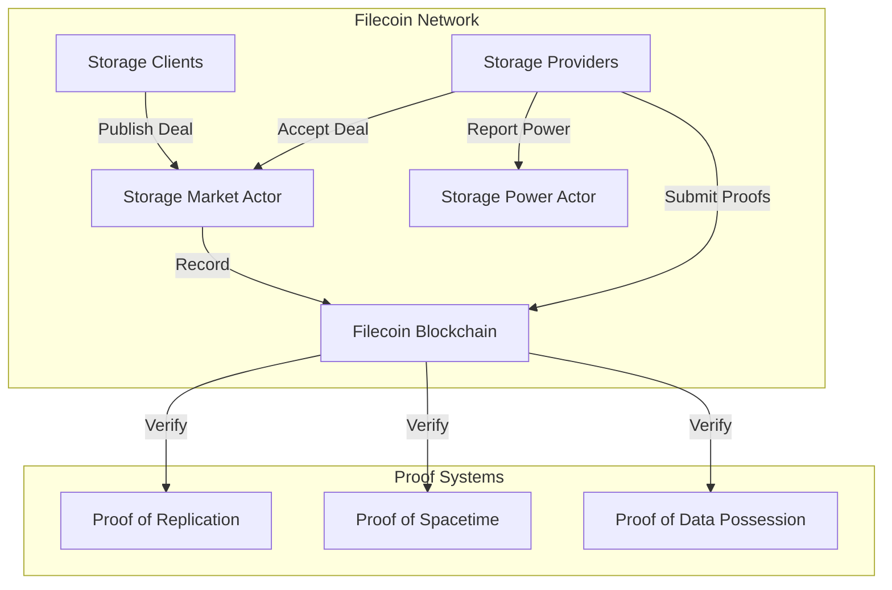
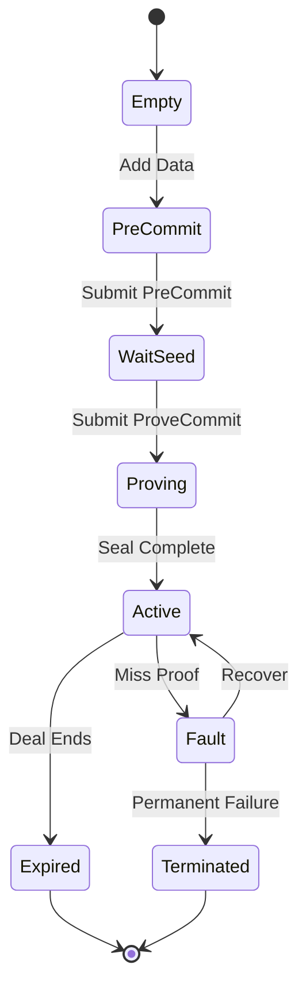
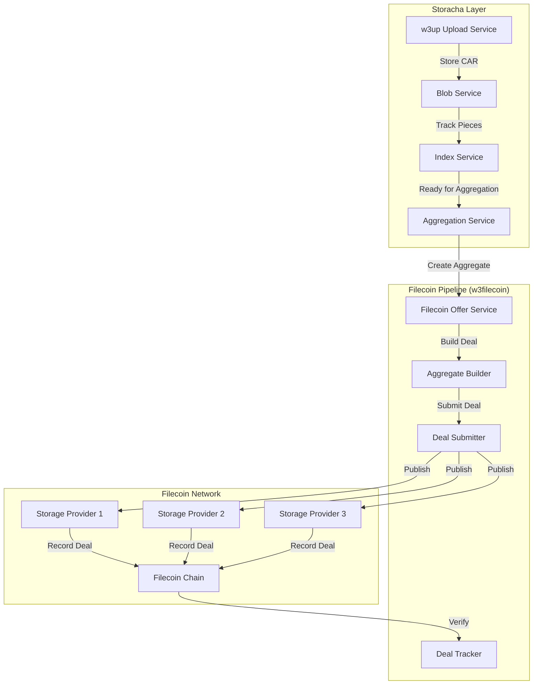
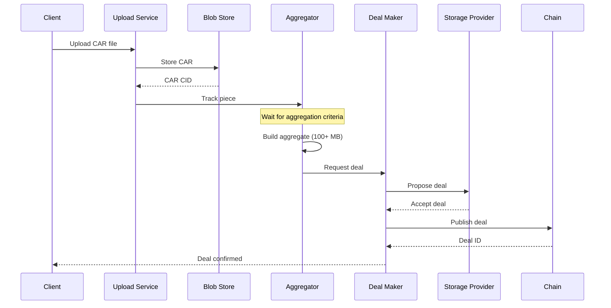
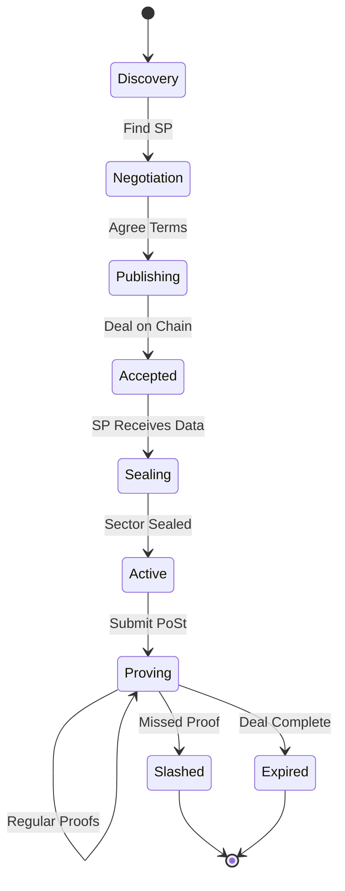
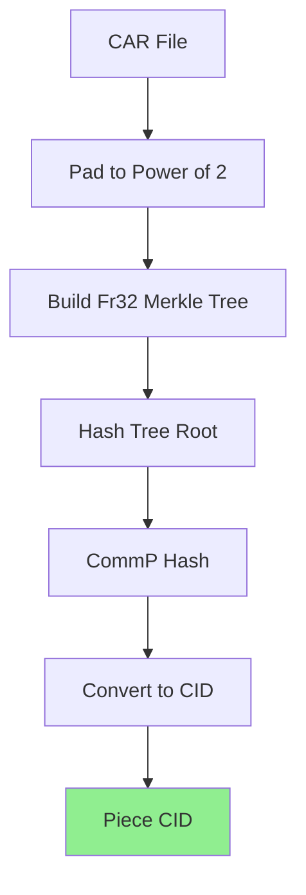
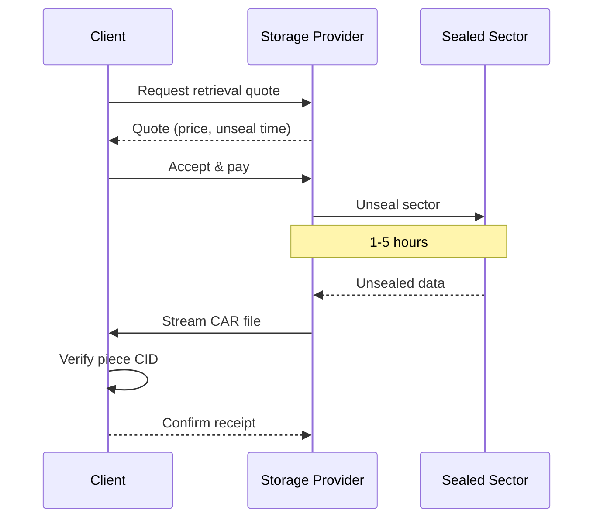

# 09. Filecoin Integration

Comprehensive analysis of Filecoin integration in the Storacha ecosystem, covering storage deals, piece CID generation, provider selection, retrieval mechanisms, and production implementation patterns.

---

## Table of Contents

### Part 1: Filecoin Architecture and Storage Deals
1. [Filecoin Architecture Overview](#1-filecoin-architecture-overview)
2. [Storacha-Filecoin Integration Structure](#2-storacha-filecoin-integration-structure)
3. [Storage Deal Lifecycle](#3-storage-deal-lifecycle)
4. [Piece CID Generation](#4-piece-cid-generation)

### Part 2: Implementation and Optimization
5. [Deal Proposal Implementation](#5-deal-proposal-implementation)
6. [Storage Provider Selection](#6-storage-provider-selection)
7. [Deal Verification and Proofs](#7-deal-verification-and-proofs)
8. [Data Retrieval Mechanisms](#8-data-retrieval-mechanisms)
9. [Cost Calculation and Optimization](#9-cost-calculation-and-optimization)
10. [Error Handling and Retry Strategies](#10-error-handling-and-retry-strategies)

---

## Part 1: Filecoin Architecture and Storage Deals

### 1. Filecoin Architecture Overview

Filecoin is a decentralized storage network that turns cloud storage into an algorithmic market, where storage providers (SPs) compete to store data for clients.

#### 1.1 Core Components



**Key Actors**:

1. **Storage Clients**: Users or applications that want to store data
2. **Storage Providers (SPs)**: Network participants who provide storage capacity
3. **Storage Market Actor**: On-chain actor managing deal proposals and publications
4. **Storage Power Actor**: Tracks storage power of each provider
5. **Verified Registry Actor**: Manages verified client status

#### 1.2 Storage Power Consensus

Filecoin uses a unique consensus mechanism called **Storage Power Consensus**:

```javascript
// Conceptual representation of storage power
class StoragePowerConsensus {
  calculatePower(sectors) {
    let totalPower = 0n

    for (const sector of sectors) {
      // Quality-adjusted power based on sector content
      const qualityMultiplier = this.getSectorQualityMultiplier(sector)
      const sectorPower = sector.size * qualityMultiplier
      totalPower += sectorPower
    }

    return totalPower
  }

  getSectorQualityMultiplier(sector) {
    if (sector.hasVerifiedDeals) {
      return 10n // 10x multiplier for verified deals
    } else if (sector.hasRegularDeals) {
      return 1n // 1x for regular deals
    } else {
      return 1n // 1x for committed capacity (CC)
    }
  }

  calculateWinningProbability(providerPower, networkPower) {
    // Probability proportional to storage power
    return Number(providerPower) / Number(networkPower)
  }
}

// Example
const consensus = new StoragePowerConsensus()

const sectors = [
  { size: 32n * 1024n ** 3n, hasVerifiedDeals: true },  // 32 GiB verified
  { size: 32n * 1024n ** 3n, hasRegularDeals: true },   // 32 GiB regular
  { size: 32n * 1024n ** 3n, hasVerifiedDeals: false }  // 32 GiB CC
]

const power = consensus.calculatePower(sectors)
// Power = (32 GiB * 10) + (32 GiB * 1) + (32 GiB * 1) = 384 GiB effective power
```

**Power Calculation**:
- **Base Power**: Sector size × duration
- **Quality Multiplier**:
  - Committed Capacity (CC): 1x
  - Regular Deals: 1x
  - Verified Deals: 10x
- **Effective Power**: Base Power × Quality Multiplier

#### 1.3 Sector Lifecycle



**Sector States**:

1. **Empty**: New sector ready for data
2. **PreCommit**: Data added, awaiting seal
3. **WaitSeed**: Waiting for chain randomness
4. **Proving**: Generating proofs
5. **Active**: Sealed and actively proving
6. **Fault**: Failed to submit proof on time
7. **Expired**: Deal duration completed
8. **Terminated**: Sector permanently failed

#### 1.4 Proof Systems

Filecoin employs three main proof systems:

**Proof of Replication (PoRep)**:
```javascript
// Conceptual PoRep structure
class ProofOfReplication {
  async seal(data, sectorID, providerID) {
    // 1. Encode data with unique replica ID
    const replicaID = this.generateReplicaID(sectorID, providerID)

    // 2. Perform sealing (computationally expensive)
    const sealedData = await this.sealData(data, replicaID)

    // 3. Generate commitment (CommR)
    const commitment = await this.generateCommitment(sealedData)

    // 4. Create SNARK proof
    const proof = await this.generateSNARK(data, sealedData, commitment)

    return {
      sealedData,
      commitment,  // CommR (Commitment of Replication)
      proof
    }
  }

  generateReplicaID(sectorID, providerID) {
    return hash(providerID + sectorID)
  }

  async verify(proof, commitment, publicInputs) {
    // Verify SNARK proof
    return await verifySNARK(proof, commitment, publicInputs)
  }
}
```

**Proof of Spacetime (PoSt)**:
```javascript
// Conceptual PoSt structure
class ProofOfSpacetime {
  async generateWindowPoSt(sectors, challenge) {
    // Prove storage over time window (24 hours)
    const proofs = []

    for (const sector of sectors) {
      // Read specific sectors based on challenge
      const proof = await this.proveAccess(sector, challenge)
      proofs.push(proof)
    }

    return {
      proofs,
      timestamp: Date.now(),
      challengeEpoch: challenge.epoch
    }
  }

  async generateWinningPoSt(sectors, challenge) {
    // Prove storage for leader election
    // Must be generated quickly (< 30 seconds)
    return await this.quickProve(sectors, challenge)
  }

  async proveAccess(sector, challenge) {
    // Prove we can access specific parts of sealed sector
    const samples = this.selectSamples(sector, challenge)
    const proof = await this.generateProofForSamples(samples)
    return proof
  }
}
```

**Proof of Data Possession (PDP)** (New in 2024):
```javascript
// PDP for hot storage verification
class ProofOfDataPossession {
  async prove(unsealed Data, challenge) {
    // Prove access to unsealed data (no sealing required)
    // Enables fast retrieval verification

    // 1. Select challenged blocks
    const blocks = this.selectChallengedBlocks(unsealedData, challenge)

    // 2. Generate Merkle proofs
    const proofs = blocks.map(block => {
      return this.generateMerkleProof(block, unsealedData)
    })

    // 3. Create aggregate proof
    return {
      blockProofs: proofs,
      timestamp: Date.now(),
      dataRoot: this.computeMerkleRoot(unsealedData)
    }
  }

  async verify(proof, challenge, dataRoot) {
    // Verify Merkle proofs
    for (const blockProof of proof.blockProofs) {
      if (!this.verifyMerkleProof(blockProof, dataRoot)) {
        return false
      }
    }
    return true
  }
}
```

### 2. Storacha-Filecoin Integration Structure

Storacha acts as a decentralized hot storage layer that automatically backs up data to Filecoin for long-term cold storage.

#### 2.1 Integration Architecture



#### 2.2 w3filecoin Pipeline

The w3filecoin infrastructure manages the complete pipeline from CAR files to Filecoin storage:

```javascript
/**
 * w3filecoin pipeline orchestrator
 */
class FilecoinPipeline {
  constructor(options = {}) {
    this.aggregationThreshold = options.aggregationThreshold || 100 * 1024 * 1024 // 100 MB
    this.targetAggregateSize = options.targetAggregateSize || 32 * 1024 ** 3 // 32 GiB
    this.maxAggregationWait = options.maxAggregationWait || 24 * 60 * 60 * 1000 // 24 hours
    this.dealDuration = options.dealDuration || 1555200 // ~540 days in epochs
  }

  /**
   * Process uploaded CAR file through Filecoin pipeline
   */
  async processUpload(carCID, carSize, metadata) {
    // 1. Calculate piece CID (CommP)
    const pieceCID = await this.calculatePieceCID(carCID)

    // 2. Track piece for aggregation
    await this.trackPiece({
      carCID,
      pieceCID,
      size: carSize,
      uploadedAt: new Date(),
      metadata
    })

    // 3. Check if ready to aggregate
    const readyToAggregate = await this.checkAggregationCriteria()

    if (readyToAggregate) {
      // 4. Build aggregate
      const aggregate = await this.buildAggregate()

      // 5. Submit deals to storage providers
      const deals = await this.submitDeals(aggregate)

      // 6. Track deal status
      await this.trackDeals(deals)

      return { status: 'aggregated', deals }
    }

    return { status: 'pending_aggregation', pieceCID }
  }

  async calculatePieceCID(carCID) {
    // Fetch CAR file
    const carBytes = await this.fetchCAR(carCID)

    // Calculate CommP (Piece Commitment)
    const commp = await this.computeCommP(carBytes)

    // Convert to piece CID
    const pieceCID = this.commpToCID(commp)

    return pieceCID
  }

  async checkAggregationCriteria() {
    const pendingPieces = await this.getPendingPieces()

    // Calculate total size
    const totalSize = pendingPieces.reduce((sum, p) => sum + p.size, 0)

    // Check size threshold
    if (totalSize >= this.aggregationThreshold) {
      return true
    }

    // Check age threshold
    const oldestPiece = pendingPieces[0]
    const age = Date.now() - oldestPiece.uploadedAt

    if (age >= this.maxAggregationWait && pendingPieces.length > 0) {
      return true
    }

    return false
  }

  async buildAggregate() {
    const pieces = await this.getPendingPieces()

    // Build aggregate CAR containing all pieces
    const aggregateCAR = await this.createAggregateCAR(pieces)

    // Calculate aggregate piece CID
    const aggregatePieceCID = await this.calculatePieceCID(aggregateCAR.cid)

    return {
      cid: aggregateCAR.cid,
      pieceCID: aggregatePieceCID,
      size: aggregateCAR.size,
      pieces: pieces.map(p => p.pieceCID)
    }
  }

  async submitDeals(aggregate) {
    // Select storage providers
    const providers = await this.selectStorageProviders(aggregate.size)

    // Create deal proposals
    const proposals = providers.map(provider =>
      this.createDealProposal(aggregate, provider)
    )

    // Submit to providers
    const deals = await Promise.all(
      proposals.map(proposal => this.submitDeal(proposal))
    )

    return deals
  }
}

// Usage
const pipeline = new FilecoinPipeline({
  aggregationThreshold: 100 * 1024 * 1024,  // 100 MB
  targetAggregateSize: 32 * 1024 ** 3,      // 32 GiB
  dealDuration: 1555200                      // ~540 days
})

// Process new upload
const result = await pipeline.processUpload(
  carCID,
  carSize,
  { customer: 'did:key:z6Mk...', space: 'did:key:z6Mk...' }
)

console.log('Pipeline result:', result)
```

#### 2.3 Data Flow

**Upload to Filecoin Flow**:



**Key Stages**:

1. **Upload**: Client uploads data as CAR file
2. **Storage**: CAR stored in Storacha's hot storage
3. **Piece Tracking**: Piece CID calculated and tracked
4. **Aggregation**: Multiple pieces combined into aggregate
5. **Deal Creation**: Deal proposals created for aggregate
6. **Deal Publishing**: Deals published to Filecoin chain
7. **Sealing**: Storage provider seals data
8. **Proving**: Continuous proof submission

### 3. Storage Deal Lifecycle

Understanding the complete lifecycle of a Filecoin storage deal is crucial for implementation.

#### 3.1 Deal Phases



**Phase 1: Discovery**

Clients discover available storage providers:

```javascript
class StorageProviderDiscovery {
  async discoverProviders(requirements = {}) {
    // Query chain for registered storage providers
    const allProviders = await this.queryStoragePowerActor()

    // Filter by requirements
    const suitableProviders = allProviders.filter(sp => {
      return this.meetsRequirements(sp, requirements)
    })

    // Rank by reputation and price
    const rankedProviders = await this.rankProviders(suitableProviders)

    return rankedProviders
  }

  meetsRequirements(provider, requirements) {
    // Check sector size support
    if (requirements.minSectorSize &&
        provider.sectorSize < requirements.minSectorSize) {
      return false
    }

    // Check available storage
    if (requirements.minAvailableStorage &&
        provider.availableStorage < requirements.minAvailableStorage) {
      return false
    }

    // Check location (if specified)
    if (requirements.region &&
        provider.region !== requirements.region) {
      return false
    }

    return true
  }

  async rankProviders(providers) {
    // Score each provider
    const scored = await Promise.all(
      providers.map(async (provider) => {
        const score = await this.calculateScore(provider)
        return { provider, score }
      })
    )

    // Sort by score (descending)
    scored.sort((a, b) => b.score - a.score)

    return scored.map(s => s.provider)
  }

  async calculateScore(provider) {
    let score = 0

    // Reputation (0-50 points)
    const reputation = await this.getProviderReputation(provider.id)
    score += reputation * 50

    // Price (0-30 points, lower is better)
    const priceScore = this.calculatePriceScore(provider.askPrice)
    score += priceScore

    // Success rate (0-20 points)
    const successRate = await this.getSuccessRate(provider.id)
    score += successRate * 20

    return score
  }
}

// Usage
const discovery = new StorageProviderDiscovery()

const providers = await discovery.discoverProviders({
  minSectorSize: 32 * 1024 ** 3,  // 32 GiB
  minAvailableStorage: 1024 ** 4,  // 1 TiB
  region: 'us-west'
})

console.log(`Found ${providers.length} suitable providers`)
```

**Phase 2: Negotiation**

Off-chain negotiation of deal terms:

```javascript
class DealNegotiator {
  async negotiateDeal(pieceCID, pieceSize, provider) {
    // 1. Request storage ask from provider
    const ask = await this.getStorageAsk(provider)

    // 2. Calculate deal parameters
    const dealParams = this.calculateDealParams(pieceSize, ask)

    // 3. Create deal proposal
    const proposal = this.createProposal({
      pieceCID,
      pieceSize,
      provider: provider.id,
      client: this.clientAddress,
      ...dealParams
    })

    // 4. Sign proposal
    const signedProposal = await this.signProposal(proposal)

    // 5. Send to provider for acceptance
    const response = await this.sendProposal(provider, signedProposal)

    if (response.accepted) {
      return {
        proposal: signedProposal,
        providerSignature: response.signature
      }
    }

    throw new Error(`Deal rejected: ${response.reason}`)
  }

  async getStorageAsk(provider) {
    // Query provider's current pricing
    const ask = await this.queryProvider(provider, '/storage/ask')

    return {
      price: ask.price,              // attoFIL per GiB per epoch
      verifiedPrice: ask.verifiedPrice,
      minPieceSize: ask.minPieceSize,
      maxPieceSize: ask.maxPieceSize
    }
  }

  calculateDealParams(pieceSize, ask) {
    const now = await this.getCurrentEpoch()

    // Deal starts in 2880 epochs (~24 hours)
    const startEpoch = now + 2880

    // Deal duration: 540 days = 1,555,200 epochs
    const duration = 1555200
    const endEpoch = startEpoch + duration

    // Calculate price (attoFIL per GiB per epoch)
    const pricePerEpoch = ask.verifiedPrice // Using verified price
    const sizeGiB = pieceSize / (1024 ** 3)
    const totalPrice = BigInt(Math.ceil(pricePerEpoch * sizeGiB * duration))

    // Collateral (typically 0 for verified deals)
    const clientCollateral = 0n
    const providerCollateral = this.calculateProviderCollateral(pieceSize, duration)

    return {
      startEpoch,
      endEpoch,
      storagePricePerEpoch: pricePerEpoch,
      providerCollateral,
      clientCollateral
    }
  }

  createProposal(params) {
    return {
      pieceCID: params.pieceCID,
      pieceSize: params.pieceSize,
      verifiedDeal: true,
      client: params.client,
      provider: params.provider,
      label: '', // Optional label
      startEpoch: params.startEpoch,
      endEpoch: params.endEpoch,
      storagePricePerEpoch: params.storagePricePerEpoch,
      providerCollateral: params.providerCollateral,
      clientCollateral: params.clientCollateral
    }
  }

  async signProposal(proposal) {
    // Sign with client private key
    const serialized = this.serializeProposal(proposal)
    const signature = await this.wallet.sign(serialized)

    return {
      proposal,
      clientSignature: signature
    }
  }
}

// Usage
const negotiator = new DealNegotiator(clientWallet)

const deal = await negotiator.negotiateDeal(
  pieceCID,
  pieceSize,
  selectedProvider
)

console.log('Deal negotiated:', deal)
```

**Phase 3: Publishing**

Publish deal on-chain:

```javascript
class DealPublisher {
  async publishDeal(signedProposal, providerSignature) {
    // 1. Prepare PublishStorageDeals message
    const message = {
      To: 'f05',  // StorageMarketActor address
      From: this.clientAddress,
      Method: 'PublishStorageDeals',
      Params: {
        Deals: [{
          Proposal: signedProposal.proposal,
          ClientSignature: signedProposal.clientSignature,
          ProviderSignature: providerSignature
        }]
      },
      Value: signedProposal.proposal.storagePricePerEpoch *
             (signedProposal.proposal.endEpoch - signedProposal.proposal.startEpoch),
      GasLimit: 10000000,
      GasFeeCap: '100000',
      GasPremium: '1000'
    }

    // 2. Send message to chain
    const cid = await this.lotus.MpoolPush(message)

    // 3. Wait for message confirmation
    const receipt = await this.waitForMessage(cid)

    if (receipt.ExitCode !== 0) {
      throw new Error(`Deal publish failed: ${receipt.ExitCode}`)
    }

    // 4. Extract deal ID from receipt
    const dealID = this.extractDealID(receipt)

    return {
      dealID,
      messageCID: cid,
      provider: signedProposal.proposal.provider,
      pieceCID: signedProposal.proposal.pieceCID
    }
  }

  async waitForMessage(cid, timeout = 600000) {
    const startTime = Date.now()

    while (Date.now() - startTime < timeout) {
      const state = await this.lotus.StateSearchMsg(cid)

      if (state && state.Receipt) {
        return state.Receipt
      }

      await new Promise(resolve => setTimeout(resolve, 5000))
    }

    throw new Error('Timeout waiting for message confirmation')
  }

  extractDealID(receipt) {
    // Parse return value to get deal ID
    const returnValue = receipt.Return
    const decoded = this.cbor.decode(returnValue)
    return decoded.Deals[0]
  }
}

// Usage
const publisher = new DealPublisher(lotusClient, clientAddress)

const result = await publisher.publishDeal(
  signedProposal,
  providerSignature
)

console.log(`Deal published with ID: ${result.dealID}`)
```

**Phase 4: Data Transfer and Sealing**

```javascript
class DealDataTransfer {
  async transferData(dealID, pieceCID, carBytes) {
    // 1. Get provider's data transfer endpoint
    const provider = await this.getProviderInfo(dealID)
    const endpoint = provider.dataTransferEndpoint

    // 2. Initiate data transfer
    const transferID = await this.initiateTransfer({
      dealID,
      pieceCID,
      endpoint,
      protocol: 'graphsync' // or 'http'
    })

    // 3. Stream CAR file to provider
    await this.streamCAR(transferID, carBytes)

    // 4. Wait for provider to confirm receipt
    await this.waitForTransferComplete(transferID)

    // 5. Monitor sealing progress
    const sealingProgress = await this.monitorSealing(dealID)

    return sealingProgress
  }

  async monitorSealing(dealID) {
    const checkInterval = 60000 // Check every minute

    while (true) {
      const dealState = await this.getDealState(dealID)

      if (dealState.State === 'StorageDealActive') {
        return {
          status: 'active',
          sectorID: dealState.SectorNumber,
          activatedAt: new Date()
        }
      } else if (dealState.State === 'StorageDealError') {
        throw new Error(`Sealing failed: ${dealState.Message}`)
      }

      // Still sealing
      console.log(`Deal ${dealID} status: ${dealState.State}`)
      await new Promise(resolve => setTimeout(resolve, checkInterval))
    }
  }
}
```

### 4. Piece CID Generation

Piece CID (CommP - Piece Commitment) is a critical component for Filecoin storage deals.

#### 4.1 CommP Calculation Process



**Step-by-Step Process**:

1. **Input**: CAR file bytes
2. **Padding**: Pad to next power of 2 size
3. **Fr32 Encoding**: Convert to field elements (254 bits used, 2 bits padding per 256 bits)
4. **Merkle Tree**: Build binary Merkle tree
5. **Root Hash**: Calculate tree root (CommP)
6. **CID Encoding**: Convert to CID format

#### 4.2 Implementation

```javascript
import { create as createCommP } from '@web3-storage/data-segment'
import { CarIndexedReader } from '@ipld/car/indexed-reader'

/**
 * Calculate Piece CID (CommP) from CAR file
 */
class PieceCIDCalculator {
  async calculateFromCAR(carBytes) {
    // 1. Parse CAR file
    const reader = await CarIndexedReader.fromBytes(carBytes)

    // 2. Get raw CAR payload size
    const carSize = carBytes.length

    // 3. Calculate next power of 2
    const paddedSize = this.nextPowerOf2(carSize)

    // 4. Calculate CommP using data-segment library
    const segment = await createCommP(carBytes)

    return {
      pieceCID: segment.cid,        // baga6ea... format
      pieceSize: segment.size,       // Padded size
      rawSize: carSize              // Original CAR size
    }
  }

  nextPowerOf2(n) {
    let power = 1
    while (power < n) {
      power *= 2
    }
    return power
  }

  /**
   * Calculate CommP manually (for understanding)
   */
  async calculateCommPManual(data) {
    // 1. Pad data to power of 2
    const paddedSize = this.nextPowerOf2(data.length)
    const padded = new Uint8Array(paddedSize)
    padded.set(data)

    // 2. Convert to Fr32 (254-bit field elements)
    const fr32Data = this.toFr32(padded)

    // 3. Build Merkle tree (binary tree with SHA-256)
    const tree = await this.buildPieceMerkleTree(fr32Data)

    // 4. Get root hash (CommP)
    const commP = tree.root

    // 5. Convert to CID
    const pieceCID = this.commpToCID(commP, paddedSize)

    return { pieceCID, pieceSize: paddedSize }
  }

  toFr32(data) {
    // Convert every 254 bits to Fr32 format (add 2-bit padding)
    // This is a simplified representation
    const fr32 = []

    for (let i = 0; i < data.length; i += 31.75) {
      // Take 254 bits (31.75 bytes)
      const chunk = data.slice(i, i + 32)

      // Add 2-bit padding
      const padded = this.addFr32Padding(chunk)

      fr32.push(padded)
    }

    return fr32
  }

  async buildPieceMerkleTree(leafData) {
    // Build binary Merkle tree
    let currentLevel = leafData.map(leaf => this.hashLeaf(leaf))

    while (currentLevel.length > 1) {
      const nextLevel = []

      for (let i = 0; i < currentLevel.length; i += 2) {
        const left = currentLevel[i]
        const right = currentLevel[i + 1] || left // Duplicate if odd

        const parent = await this.hashPair(left, right)
        nextLevel.push(parent)
      }

      currentLevel = nextLevel
    }

    return { root: currentLevel[0] }
  }

  hashLeaf(data) {
    // Use SHA-256 truncated to 254 bits
    return sha256trunc254(data)
  }

  async hashPair(left, right) {
    // Combine left and right, then hash
    const combined = new Uint8Array([...left, ...right])
    return sha256trunc254(combined)
  }

  commpToCID(commP, pieceSize) {
    // Convert CommP hash to Filecoin piece CID
    // CID format: fil-commitment-unsealed + sha2-256-trunc254-padded

    const multicodec = 0xf101 // fil-commitment-unsealed
    const multihash = this.createMultihash(0x1012, commP) // sha2-256-trunc254-padded

    return CID.create(1, multicodec, multihash)
  }

  createMultihash(code, digest) {
    // Create multihash: <hash-code><digest-length><digest-bytes>
    const length = digest.length
    const bytes = new Uint8Array(2 + 1 + length)

    // Encode hash code as varint
    bytes[0] = code & 0xff
    bytes[1] = (code >> 8) & 0xff

    // Digest length
    bytes[2] = length

    // Digest bytes
    bytes.set(digest, 3)

    return bytes
  }
}

// Usage
const calculator = new PieceCIDCalculator()

// From CAR bytes
const carBytes = await fs.readFile('file.car')
const result = await calculator.calculateFromCAR(carBytes)

console.log('Piece CID:', result.pieceCID.toString())
console.log('Piece Size:', result.pieceSize)
console.log('Raw CAR Size:', result.rawSize)

// Example output:
// Piece CID: baga6ea4seaqao7s73y24kcutaosvacpdjgfe5pw76ooefnyqw4ynr3d2y6x2mpq
// Piece Size: 2097152 (2 MiB)
// Raw CAR Size: 1048576 (1 MiB)
```

#### 4.3 Piece Size Calculation

Understanding piece sizes for different sector sizes:

```javascript
class PieceSizeCalculator {
  // Filecoin sector sizes (powers of 2)
  SECTOR_SIZES = {
    '2KiB': 2048,
    '8MiB': 8 * 1024 * 1024,
    '512MiB': 512 * 1024 * 1024,
    '32GiB': 32 * 1024 ** 3,
    '64GiB': 64 * 1024 ** 3
  }

  calculatePieceSize(carSize) {
    // Find next power of 2
    let pieceSize = 128 // Minimum piece size: 128 bytes

    while (pieceSize < carSize) {
      pieceSize *= 2
    }

    return pieceSize
  }

  canFitInSector(pieceSize, sectorSize) {
    return pieceSize <= sectorSize
  }

  calculatePaddingOverhead(carSize) {
    const pieceSize = this.calculatePieceSize(carSize)
    const padding = pieceSize - carSize
    const overhead = (padding / carSize) * 100

    return {
      carSize,
      pieceSize,
      padding,
      overheadPercent: overhead.toFixed(2)
    }
  }

  recommendAggregation(pieces) {
    // Recommend aggregating small pieces
    const totalSize = pieces.reduce((sum, p) => sum + p.size, 0)
    const totalPieceSize = pieces.reduce((sum, p) => sum + this.calculatePieceSize(p.size), 0)

    // Calculate if aggregation reduces padding
    const aggregatedSize = this.calculatePieceSize(totalSize)

    const individualOverhead = totalPieceSize - totalSize
    const aggregatedOverhead = aggregatedSize - totalSize

    return {
      shouldAggregate: aggregatedOverhead < individualOverhead,
      savings: individualOverhead - aggregatedOverhead,
      savingsPercent: ((individualOverhead - aggregatedOverhead) / totalSize * 100).toFixed(2)
    }
  }
}

// Usage
const sizeCalc = new PieceSizeCalculator()

// Example: Multiple small CAR files
const smallPieces = [
  { size: 100 * 1024 },  // 100 KiB
  { size: 200 * 1024 },  // 200 KiB
  { size: 150 * 1024 }   // 150 KiB
]

const recommendation = sizeCalc.recommendAggregation(smallPieces)
console.log('Aggregation recommendation:', recommendation)

// Output:
// {
//   shouldAggregate: true,
//   savings: 393216,  // bytes saved
//   savingsPercent: '85.33'
// }
```

#### 4.4 CommP Verification

Verify piece commitment matches the data:

```javascript
class CommPVerifier {
  async verify(carBytes, expectedPieceCID) {
    // 1. Calculate piece CID from data
    const calculator = new PieceCIDCalculator()
    const { pieceCID } = await calculator.calculateFromCAR(carBytes)

    // 2. Compare with expected CID
    if (pieceCID.toString() === expectedPieceCID.toString()) {
      return {
        valid: true,
        pieceCID: pieceCID.toString()
      }
    }

    return {
      valid: false,
      expected: expectedPieceCID.toString(),
      actual: pieceCID.toString(),
      error: 'Piece CID mismatch'
    }
  }

  async verifyFromDeal(dealID, carBytes) {
    // 1. Get deal info from chain
    const dealInfo = await this.getDealInfo(dealID)

    // 2. Extract piece CID from deal
    const expectedPieceCID = dealInfo.Proposal.PieceCID

    // 3. Verify
    return await this.verify(carBytes, expectedPieceCID)
  }
}

// Usage
const verifier = new CommPVerifier()

const result = await verifier.verify(carBytes, expectedPieceCID)

if (result.valid) {
  console.log('✅ Piece CID verified')
} else {
  console.error('❌ Verification failed:', result.error)
}
```

---

## Part 2: Implementation and Optimization

### 5. Deal Proposal Implementation

Implementing production-ready deal proposal logic for Filecoin storage.

#### 5.1 Deal Proposal Structure

Complete deal proposal data structure:

```javascript
/**
 * Filecoin storage deal proposal
 */
interface DealProposal {
  // Piece identification
  pieceCID: CID              // Piece commitment (CommP)
  pieceSize: number          // Padded piece size (power of 2)

  // Deal participants
  client: string             // Client actor address (f1...)
  provider: string           // Storage provider actor address (f0...)

  // Temporal parameters
  startEpoch: number         // Deal start epoch
  endEpoch: number           // Deal end epoch

  // Economic parameters
  storagePricePerEpoch: bigint  // Price in attoFIL per epoch
  providerCollateral: bigint     // Provider's collateral
  clientCollateral: bigint       // Client's collateral

  // Deal properties
  verifiedDeal: boolean      // Is this a verified deal?
  label: string              // Optional label/metadata
}

/**
 * Complete deal proposal builder
 */
class DealProposalBuilder {
  constructor(config) {
    this.defaultDuration = config.defaultDuration || 1555200 // ~540 days
    this.startDelay = config.startDelay || 2880 // ~24 hours
    this.maxPrice = config.maxPrice || 0n // Free for verified deals
  }

  async buildProposal(params) {
    // 1. Get current epoch
    const currentEpoch = await this.getCurrentEpoch()

    // 2. Calculate epochs
    const startEpoch = currentEpoch + this.startDelay
    const endEpoch = startEpoch + this.defaultDuration

    // 3. Get provider's ask
    const ask = await this.getProviderAsk(params.provider)

    // 4. Validate piece size
    this.validatePieceSize(params.pieceSize, ask)

    // 5. Calculate price
    const price = params.verifiedDeal ? ask.verifiedPrice : ask.price

    if (price > this.maxPrice && !params.verifiedDeal) {
      throw new Error(`Price ${price} exceeds maximum ${this.maxPrice}`)
    }

    // 6. Build proposal
    const proposal = {
      pieceCID: params.pieceCID,
      pieceSize: params.pieceSize,
      client: params.clientAddress,
      provider: params.provider,
      startEpoch,
      endEpoch,
      storagePricePerEpoch: BigInt(price),
      providerCollateral: this.calculateProviderCollateral(params.pieceSize, this.defaultDuration),
      clientCollateral: 0n, // Typically 0 for verified deals
      verifiedDeal: params.verifiedDeal,
      label: params.label || ''
    }

    // 7. Validate proposal
    await this.validateProposal(proposal)

    return proposal
  }

  validatePieceSize(pieceSize, ask) {
    if (pieceSize < ask.minPieceSize) {
      throw new Error(`Piece size ${pieceSize} below minimum ${ask.minPieceSize}`)
    }

    if (pieceSize > ask.maxPieceSize) {
      throw new Error(`Piece size ${pieceSize} exceeds maximum ${ask.maxPieceSize}`)
    }

    // Verify power of 2
    if ((pieceSize & (pieceSize - 1)) !== 0) {
      throw new Error(`Piece size ${pieceSize} is not a power of 2`)
    }
  }

  calculateProviderCollateral(pieceSize, duration) {
    // Simplified collateral calculation
    // Actual formula: f(size, duration, network baseline, etc.)
    const sizeGiB = BigInt(pieceSize) / BigInt(1024 ** 3)
    const epochs = BigInt(duration)

    // Approximately 0.01 FIL per GiB-year
    const collateralPerGiBYear = BigInt(10000000000000000) // 0.01 FIL in attoFIL
    const epochsPerYear = BigInt(1051200) // ~365 days

    return (sizeGiB * collateralPerGiBYear * epochs) / epochsPerYear
  }

  async validateProposal(proposal) {
    // 1. Check start epoch is in future
    const currentEpoch = await this.getCurrentEpoch()
    if (proposal.startEpoch <= currentEpoch) {
      throw new Error('Start epoch must be in the future')
    }

    // 2. Check end epoch is after start
    if (proposal.endEpoch <= proposal.startEpoch) {
      throw new Error('End epoch must be after start epoch')
    }

    // 3. Verify deal duration is within bounds
    const duration = proposal.endEpoch - proposal.startEpoch
    const minDuration = 180 * 2880 // ~180 days
    const maxDuration = 1278 * 2880 // ~3.5 years

    if (duration < minDuration) {
      throw new Error(`Duration ${duration} below minimum ${minDuration}`)
    }

    if (duration > maxDuration) {
      throw new Error(`Duration ${duration} exceeds maximum ${maxDuration}`)
    }

    return true
  }

  async getCurrentEpoch() {
    // Query chain for current epoch
    const head = await this.lotus.ChainHead()
    return head.Height
  }

  async getProviderAsk(providerID) {
    // Query provider for current storage ask
    const ask = await this.lotus.ClientQueryAsk(providerID, providerID)

    return {
      price: BigInt(ask.Ask.Price),
      verifiedPrice: BigInt(ask.Ask.VerifiedPrice),
      minPieceSize: ask.Ask.MinPieceSize,
      maxPieceSize: ask.Ask.MaxPieceSize,
      expiry: ask.Ask.Expiry
    }
  }
}

// Usage
const builder = new DealProposalBuilder({
  defaultDuration: 1555200,  // 540 days
  startDelay: 2880,          // 24 hours
  maxPrice: 0n               // Free for verified deals
})

const proposal = await builder.buildProposal({
  pieceCID: CID.parse('baga6ea4seaqao7s73y24kcutaosvacpdjgfe5pw76ooefnyqw4ynr3d2y6x2mpq'),
  pieceSize: 34359738368,    // 32 GiB
  clientAddress: 'f1...',
  provider: 'f0...',
  verifiedDeal: true,
  label: 'storacha-upload-2024'
})

console.log('Deal proposal:', proposal)
```

#### 5.2 Batch Deal Processing

Process multiple deals efficiently:

```javascript
/**
 * Batch deal processor for aggregated storage
 */
class BatchDealProcessor {
  constructor(config) {
    this.maxDealsPerMessage = config.maxDealsPerMessage || 100
    this.parallelism = config.parallelism || 5
    this.retryAttempts = config.retryAttempts || 3
  }

  async processBatch(aggregate, providers) {
    // 1. Create proposal for each provider
    const proposals = await this.createProposals(aggregate, providers)

    // 2. Sign all proposals
    const signedProposals = await this.signProposals(proposals)

    // 3. Send to providers for acceptance
    const acceptedDeals = await this.negotiateDeals(signedProposals)

    // 4. Batch publish deals
    const publishedDeals = await this.publishDeals(acceptedDeals)

    // 5. Track deal status
    await this.trackDeals(publishedDeals)

    return publishedDeals
  }

  async createProposals(aggregate, providers) {
    const builder = new DealProposalBuilder(this.config)
    const proposals = []

    for (const provider of providers) {
      try {
        const proposal = await builder.buildProposal({
          pieceCID: aggregate.pieceCID,
          pieceSize: aggregate.pieceSize,
          clientAddress: this.clientAddress,
          provider: provider.id,
          verifiedDeal: true,
          label: `aggregate-${aggregate.cid}`
        })

        proposals.push({
          proposal,
          provider: provider.id,
          aggregate: aggregate.cid
        })
      } catch (err) {
        console.error(`Failed to create proposal for ${provider.id}:`, err.message)
      }
    }

    return proposals
  }

  async signProposals(proposals) {
    // Sign all proposals in parallel
    return await Promise.all(
      proposals.map(async ({ proposal, provider, aggregate }) => {
        const serialized = this.serializeProposal(proposal)
        const signature = await this.wallet.sign(serialized)

        return {
          proposal,
          signature,
          provider,
          aggregate
        }
      })
    )
  }

  async negotiateDeals(signedProposals) {
    // Send proposals to providers in parallel (with limit)
    const limit = pLimit(this.parallelism)

    const results = await Promise.allSettled(
      signedProposals.map(signed =>
        limit(() => this.negotiateWithProvider(signed))
      )
    )

    // Extract successful deals
    const accepted = results
      .filter(r => r.status === 'fulfilled' && r.value.accepted)
      .map(r => r.value)

    console.log(`${accepted.length}/${signedProposals.length} deals accepted`)

    return accepted
  }

  async negotiateWithProvider(signedProposal) {
    let lastError

    for (let attempt = 1; attempt <= this.retryAttempts; attempt++) {
      try {
        // Send proposal to provider
        const response = await this.sendProposalToProvider(
          signedProposal.provider,
          signedProposal
        )

        if (response.accepted) {
          return {
            ...signedProposal,
            providerSignature: response.signature,
            accepted: true
          }
        }

        return { accepted: false, reason: response.reason }

      } catch (err) {
        lastError = err
        console.warn(`Attempt ${attempt}/${this.retryAttempts} failed:`, err.message)

        if (attempt < this.retryAttempts) {
          await new Promise(resolve => setTimeout(resolve, 1000 * attempt))
        }
      }
    }

    return { accepted: false, error: lastError.message }
  }

  async publishDeals(acceptedDeals) {
    // Batch deals into groups of maxDealsPerMessage
    const batches = []

    for (let i = 0; i < acceptedDeals.length; i += this.maxDealsPerMessage) {
      batches.push(acceptedDeals.slice(i, i + this.maxDealsPerMessage))
    }

    // Publish each batch
    const published = []

    for (const batch of batches) {
      try {
        const result = await this.publishDealBatch(batch)
        published.push(...result)
      } catch (err) {
        console.error('Failed to publish batch:', err.message)
      }
    }

    return published
  }

  async publishDealBatch(deals) {
    // Create PublishStorageDeals message
    const message = {
      To: 'f05', // StorageMarketActor
      From: this.clientAddress,
      Method: 'PublishStorageDeals',
      Params: {
        Deals: deals.map(d => ({
          Proposal: d.proposal,
          ClientSignature: d.signature,
          ProviderSignature: d.providerSignature
        }))
      },
      Value: this.calculateTotalValue(deals),
      GasLimit: 100000000,
      GasFeeCap: '100000',
      GasPremium: '1000'
    }

    // Send message
    const cid = await this.lotus.MpoolPush(message)

    // Wait for confirmation
    const receipt = await this.waitForMessage(cid)

    // Extract deal IDs
    const dealIDs = this.extractDealIDs(receipt)

    return deals.map((deal, i) => ({
      ...deal,
      dealID: dealIDs[i],
      messageCID: cid
    }))
  }

  calculateTotalValue(deals) {
    return deals.reduce((sum, deal) => {
      const duration = deal.proposal.endEpoch - deal.proposal.startEpoch
      const value = deal.proposal.storagePricePerEpoch * BigInt(duration)
      return sum + value
    }, 0n)
  }
}

// Usage
const processor = new BatchDealProcessor({
  maxDealsPerMessage: 100,
  parallelism: 5,
  retryAttempts: 3
})

const aggregate = {
  cid: CID.parse('bafy...'),
  pieceCID: CID.parse('baga...'),
  pieceSize: 34359738368,  // 32 GiB
  pieces: [...]
}

const providers = [
  { id: 'f01234', reputation: 0.95 },
  { id: 'f05678', reputation: 0.92 },
  { id: 'f09012', reputation: 0.89 }
]

const deals = await processor.processBatch(aggregate, providers)
console.log(`Published ${deals.length} deals`)
```

### 6. Storage Provider Selection

Selecting optimal storage providers is critical for deal success.

#### 6.1 Provider Scoring Algorithm

```javascript
/**
 * Storage provider selection with multi-criteria scoring
 */
class ProviderSelector {
  constructor(config = {}) {
    this.weights = {
      reputation: config.reputationWeight || 0.35,
      price: config.priceWeight || 0.25,
      success: config.successWeight || 0.20,
      location: config.locationWeight || 0.10,
      speed: config.speedWeight || 0.10
    }

    this.minReputation = config.minReputation || 0.75
    this.minSuccessRate = config.minSuccessRate || 0.90
  }

  async selectProviders(requirements) {
    // 1. Get all registered providers
    const allProviders = await this.getAllProviders()

    // 2. Filter by basic requirements
    const eligible = allProviders.filter(p =>
      this.meetsBasicRequirements(p, requirements)
    )

    // 3. Score each provider
    const scored = await Promise.all(
      eligible.map(async (provider) => {
        const score = await this.scoreProvider(provider, requirements)
        return { provider, score }
      })
    )

    // 4. Sort by score (descending)
    scored.sort((a, b) => b.score - a.score)

    // 5. Select top N providers
    const selected = scored
      .slice(0, requirements.numProviders || 3)
      .map(s => s.provider)

    return selected
  }

  meetsBasicRequirements(provider, requirements) {
    // Check sector size
    if (requirements.pieceSize > provider.sectorSize) {
      return false
    }

    // Check minimum reputation
    if (provider.reputation < this.minReputation) {
      return false
    }

    // Check success rate
    if (provider.successRate < this.minSuccessRate) {
      return false
    }

    // Check available storage
    if (provider.availableStorage < requirements.pieceSize) {
      return false
    }

    return true
  }

  async scoreProvider(provider, requirements) {
    let score = 0

    // 1. Reputation score (0-1)
    const reputationScore = provider.reputation
    score += reputationScore * this.weights.reputation

    // 2. Price score (0-1, lower is better)
    const priceScore = this.calculatePriceScore(provider.ask.verifiedPrice, requirements)
    score += priceScore * this.weights.price

    // 3. Success rate score (0-1)
    const successScore = provider.successRate
    score += successScore * this.weights.success

    // 4. Location score (0-1)
    const locationScore = this.calculateLocationScore(provider, requirements)
    score += locationScore * this.weights.location

    // 5. Speed score (0-1)
    const speedScore = await this.calculateSpeedScore(provider)
    score += speedScore * this.weights.speed

    return score
  }

  calculatePriceScore(price, requirements) {
    // Verified deals are typically free, so price might be 0
    if (price === 0n) {
      return 1.0
    }

    // If price is within acceptable range, score based on how low it is
    const maxAcceptablePrice = requirements.maxPrice || BigInt(1000000000000000) // 0.001 FIL per epoch

    if (price > maxAcceptablePrice) {
      return 0
    }

    // Linear scoring: lower price = higher score
    const priceRatio = Number(price) / Number(maxAcceptablePrice)
    return 1 - priceRatio
  }

  calculateLocationScore(provider, requirements) {
    if (!requirements.preferredRegion) {
      return 0.5 // Neutral if no preference
    }

    // Perfect match
    if (provider.region === requirements.preferredRegion) {
      return 1.0
    }

    // Same continent
    if (this.sameContinent(provider.region, requirements.preferredRegion)) {
      return 0.6
    }

    // Different continent
    return 0.3
  }

  async calculateSpeedScore(provider) {
    // Measure based on historical data transfer speeds
    const avgSpeed = await this.getAverageDataTransferSpeed(provider.id)

    // Score based on speed (MB/s)
    if (avgSpeed >= 100) return 1.0      // > 100 MB/s
    if (avgSpeed >= 50) return 0.8       // > 50 MB/s
    if (avgSpeed >= 10) return 0.6       // > 10 MB/s
    if (avgSpeed >= 1) return 0.4        // > 1 MB/s
    return 0.2
  }

  async getAllProviders() {
    // Query StoragePowerActor for all registered providers
    const providers = await this.lotus.StateListMiners()

    // Get detailed info for each provider
    const detailed = await Promise.all(
      providers.map(async (id) => {
        try {
          return await this.getProviderInfo(id)
        } catch (err) {
          return null
        }
      })
    )

    return detailed.filter(p => p !== null)
  }

  async getProviderInfo(providerID) {
    // Get provider info from chain
    const info = await this.lotus.StateMinerInfo(providerID)
    const power = await this.lotus.StateMinerPower(providerID)
    const ask = await this.lotus.ClientQueryAsk(providerID, providerID)

    // Get reputation from external service
    const reputation = await this.getReputation(providerID)

    return {
      id: providerID,
      sectorSize: info.SectorSize,
      availableStorage: this.calculateAvailableStorage(power),
      ask: {
        price: BigInt(ask.Ask.Price),
        verifiedPrice: BigInt(ask.Ask.VerifiedPrice),
        minPieceSize: ask.Ask.MinPieceSize,
        maxPieceSize: ask.Ask.MaxPieceSize
      },
      reputation: reputation.score,
      successRate: reputation.successRate,
      region: info.Multiaddrs ? this.extractRegion(info.Multiaddrs) : 'unknown',
      worker: info.Worker,
      owner: info.Owner
    }
  }
}

// Usage
const selector = new ProviderSelector({
  reputationWeight: 0.35,
  priceWeight: 0.25,
  successWeight: 0.20,
  locationWeight: 0.10,
  speedWeight: 0.10,
  minReputation: 0.75,
  minSuccessRate: 0.90
})

const providers = await selector.selectProviders({
  pieceSize: 34359738368,     // 32 GiB
  numProviders: 3,
  preferredRegion: 'us-west',
  maxPrice: 0n                 // Free for verified deals
})

console.log('Selected providers:', providers.map(p => p.id))
```

#### 6.2 Reputation Tracking

Track provider reputation over time:

```javascript
class ProviderReputationTracker {
  constructor(db) {
    this.db = db
  }

  async recordDealSuccess(providerID, dealID) {
    await this.db.deals.update(dealID, {
      status: 'active',
      activatedAt: new Date()
    })

    await this.updateProviderStats(providerID, {
      successfulDeals: 1
    })
  }

  async recordDealFailure(providerID, dealID, reason) {
    await this.db.deals.update(dealID, {
      status: 'failed',
      failedAt: new Date(),
      failureReason: reason
    })

    await this.updateProviderStats(providerID, {
      failedDeals: 1
    })
  }

  async recordSlash(providerID, epoch, penalty) {
    await this.db.slashes.insert({
      providerID,
      epoch,
      penalty,
      recordedAt: new Date()
    })

    await this.updateProviderStats(providerID, {
      slashes: 1,
      totalPenalties: penalty
    })
  }

  async calculateReputation(providerID) {
    const stats = await this.db.providers.findOne({ id: providerID })

    if (!stats) {
      return {
        score: 0.5,        // Neutral for new providers
        successRate: 0,
        totalDeals: 0
      }
    }

    // Calculate success rate
    const totalDeals = stats.successfulDeals + stats.failedDeals
    const successRate = totalDeals > 0 ? stats.successfulDeals / totalDeals : 0

    // Calculate slash penalty
    const slashPenalty = Math.min(stats.slashes * 0.05, 0.3) // Max 30% penalty

    // Calculate reputation score
    let score = successRate - slashPenalty

    // Age bonus for established providers
    const ageBonus = this.calculateAgeBonus(stats.firstDealAt)
    score += ageBonus

    // Clamp to [0, 1]
    score = Math.max(0, Math.min(1, score))

    return {
      score,
      successRate,
      totalDeals,
      slashes: stats.slashes
    }
  }

  calculateAgeBonus(firstDealDate) {
    if (!firstDealDate) return 0

    const ageMonths = (Date.now() - firstDealDate.getTime()) / (30 * 24 * 60 * 60 * 1000)

    // Up to 0.1 bonus for providers with 12+ months history
    return Math.min(ageMonths / 120, 0.1)
  }

  async updateProviderStats(providerID, updates) {
    const existing = await this.db.providers.findOne({ id: providerID })

    if (!existing) {
      await this.db.providers.insert({
        id: providerID,
        successfulDeals: 0,
        failedDeals: 0,
        slashes: 0,
        totalPenalties: 0n,
        firstDealAt: new Date(),
        ...updates
      })
    } else {
      const newStats = { ...existing }

      for (const [key, value] of Object.entries(updates)) {
        newStats[key] = (newStats[key] || 0) + value
      }

      await this.db.providers.update({ id: providerID }, newStats)
    }
  }
}
```

### 7. Deal Verification and Proofs

Verify deals are properly stored and proven.

#### 7.1 Deal Status Monitoring

```javascript
class DealStatusMonitor {
  constructor(lotus) {
    this.lotus = lotus
    this.checkInterval = 300000 // 5 minutes
  }

  async monitorDeal(dealID) {
    console.log(`Monitoring deal ${dealID}...`)

    while (true) {
      try {
        const state = await this.getDealState(dealID)

        console.log(`Deal ${dealID} status: ${state.State}`)

        switch (state.State) {
          case 'StorageDealActive':
            return {
              status: 'active',
              sectorID: state.SectorNumber,
              activatedEpoch: state.SectorStartEpoch
            }

          case 'StorageDealError':
          case 'StorageDealFailing':
            throw new Error(`Deal failed: ${state.Message}`)

          case 'StorageDealExpired':
            return {
              status: 'expired',
              message: 'Deal expired before activation'
            }

          case 'StorageDealSlashed':
            return {
              status: 'slashed',
              message: 'Provider slashed for fault'
            }

          // Still in progress
          case 'StorageDealUnknown':
          case 'StorageDealProposalNotFound':
          case 'StorageDealProposalRejected':
          case 'StorageDealStaged':
          case 'StorageDealSealing':
          case 'StorageDealAwaitingPreCommit':
          case 'StorageDealPreCommitPublished':
          case 'StorageDealAwaitingCommit':
          case 'StorageDealCommitPublished':
          case 'StorageDealFinalizing':
            // Continue monitoring
            break

          default:
            console.warn(`Unknown deal state: ${state.State}`)
        }

      } catch (err) {
        console.error(`Error checking deal ${dealID}:`, err.message)
      }

      await new Promise(resolve => setTimeout(resolve, this.checkInterval))
    }
  }

  async getDealState(dealID) {
    // Query chain for deal state
    const dealInfo = await this.lotus.ClientGetDealInfo(dealID)

    return {
      State: dealInfo.State,
      Message: dealInfo.Message,
      Provider: dealInfo.Provider,
      PieceCID: dealInfo.PieceCID,
      Size: dealInfo.Size,
      PricePerEpoch: dealInfo.PricePerEpoch,
      Duration: dealInfo.Duration,
      DealID: dealInfo.DealID,
      SectorNumber: dealInfo.SectorNumber,
      SectorStartEpoch: dealInfo.SectorStartEpoch
    }
  }

  async monitorMultipleDeals(dealIDs) {
    // Monitor all deals in parallel
    const results = await Promise.allSettled(
      dealIDs.map(dealID => this.monitorDeal(dealID))
    )

    const active = results.filter(r => r.status === 'fulfilled' && r.value.status === 'active')
    const failed = results.filter(r => r.status === 'rejected' || r.value.status === 'failed')

    return {
      active: active.map(r => r.value),
      failed: failed.map(r => r.reason || r.value),
      totalDeals: dealIDs.length,
      successRate: (active.length / dealIDs.length) * 100
    }
  }
}

// Usage
const monitor = new DealStatusMonitor(lotusClient)

// Monitor single deal
const result = await monitor.monitorDeal(dealID)
console.log('Deal result:', result)

// Monitor multiple deals
const results = await monitor.monitorMultipleDeals([123, 456, 789])
console.log(`${results.active.length}/${results.totalDeals} deals active`)
```

#### 7.2 Proof Verification

Verify storage proofs are being submitted:

```javascript
class ProofVerifier {
  constructor(lotus) {
    this.lotus = lotus
  }

  async verifyDealProofs(dealID, durationEpochs = 2880) {
    // 1. Get deal info
    const dealInfo = await this.lotus.ClientGetDealInfo(dealID)

    if (dealInfo.State !== 'StorageDealActive') {
      throw new Error(`Deal ${dealID} is not active`)
    }

    // 2. Get sector containing the deal
    const sectorID = dealInfo.SectorNumber
    const providerID = dealInfo.Provider

    // 3. Check WindowPoSt submissions over duration
    const currentEpoch = await this.getCurrentEpoch()
    const startEpoch = currentEpoch - durationEpochs
    const endEpoch = currentEpoch

    const proofs = await this.getWindowPoStSubmissions(
      providerID,
      sectorID,
      startEpoch,
      endEpoch
    )

    // 4. Calculate expected number of proofs
    const windowPoStPeriod = 2880 // ~24 hours
    const expectedProofs = Math.floor(durationEpochs / windowPoStPeriod)

    // 5. Check proof submission rate
    const submissionRate = (proofs.length / expectedProofs) * 100

    return {
      dealID,
      sectorID,
      providerID,
      proofsSubmitted: proofs.length,
      proofsExpected: expectedProofs,
      submissionRate: submissionRate.toFixed(2) + '%',
      healthy: submissionRate >= 95, // 95% threshold
      proofs
    }
  }

  async getWindowPoStSubmissions(providerID, sectorID, startEpoch, endEpoch) {
    const proofs = []

    // Query chain for SubmitWindowedPoSt messages
    for (let epoch = startEpoch; epoch <= endEpoch; epoch += 100) {
      const messages = await this.lotus.StateListMessages({
        To: providerID,
        From: epoch,
        To: Math.min(epoch + 100, endEpoch)
      })

      // Filter for WindowPoSt messages containing our sector
      const windowPoStMessages = messages.filter(msg => {
        return msg.Method === 'SubmitWindowedPoSt' &&
               this.containsSector(msg.Params, sectorID)
      })

      proofs.push(...windowPoStMessages.map(msg => ({
        epoch: msg.Height,
        cid: msg.Cid,
        sectors: this.extractSectors(msg.Params)
      })))
    }

    return proofs
  }

  containsSector(params, sectorID) {
    // Parse CBOR params and check if sector is included
    const decoded = this.cbor.decode(params)
    return decoded.Partitions.some(p =>
      p.Sectors.includes(sectorID)
    )
  }

  async getCurrentEpoch() {
    const head = await this.lotus.ChainHead()
    return head.Height
  }
}

// Usage
const verifier = new ProofVerifier(lotusClient)

const proofStatus = await verifier.verifyDealProofs(dealID, 2880)

if (proofStatus.healthy) {
  console.log('✅ Deal is being properly proven')
} else {
  console.warn(`⚠️  Low proof submission rate: ${proofStatus.submissionRate}`)
}
```

### 8. Data Retrieval Mechanisms

Retrieve data from Filecoin storage.

#### 8.1 Retrieval Process



**Traditional Retrieval** (with unsealing):

```javascript
class FilecoinRetrieval {
  constructor(lotus) {
    this.lotus = lotus
  }

  async retrieveData(pieceCID, providerID) {
    // 1. Find deal containing piece
    const dealID = await this.findDealByPieceCID(pieceCID, providerID)

    // 2. Request retrieval quote
    const quote = await this.lotus.ClientMinerQueryOffer(
      providerID,
      pieceCID,
      null // Root CID (null for whole piece)
    )

    console.log('Retrieval quote:', {
      size: quote.Size,
      minPrice: quote.MinPrice,
      unsealPrice: quote.UnsealPrice,
      paymentInterval: quote.PaymentInterval,
      paymentIntervalIncrease: quote.PaymentIntervalIncrease
    })

    // 3. Initiate retrieval
    const retrievalOffer = {
      Root: pieceCID,
      Piece: pieceCID,
      Size: quote.Size,
      Total: quote.MinPrice + quote.UnsealPrice,
      UnsealPrice: quote.UnsealPrice,
      PaymentInterval: quote.PaymentInterval,
      PaymentIntervalIncrease: quote.PaymentIntervalIncrease,
      Miner: providerID,
      MinerPeer: quote.MinerPeer
    }

    const fileRef = await this.lotus.ClientRetrieve(
      retrievalOffer,
      {
        Path: `/tmp/retrieved-${pieceCID}.car`,
        IsCAR: true
      }
    )

    // 4. Wait for retrieval to complete
    await this.waitForRetrieval(fileRef)

    // 5. Verify retrieved data
    const carBytes = await fs.readFile(fileRef.Path)
    const verified = await this.verifyPieceCID(carBytes, pieceCID)

    if (!verified) {
      throw new Error('Retrieved data does not match piece CID')
    }

    return carBytes
  }

  async waitForRetrieval(fileRef, timeout = 21600000) {
    // Wait up to 6 hours for unsealing + retrieval
    const startTime = Date.now()

    while (Date.now() - startTime < timeout) {
      const status = await this.lotus.ClientGetRetrievalStatus(fileRef)

      console.log(`Retrieval status: ${status.Status}`)

      if (status.Status === 'DealComplete') {
        return true
      } else if (status.Status === 'DealError') {
        throw new Error(`Retrieval failed: ${status.Message}`)
      }

      await new Promise(resolve => setTimeout(resolve, 30000)) // Check every 30s
    }

    throw new Error('Retrieval timeout')
  }

  async findDealByPieceCID(pieceCID, providerID) {
    // Query local deals or chain state
    const deals = await this.lotus.ClientListDeals()

    const match = deals.find(d =>
      d.PieceCID.toString() === pieceCID.toString() &&
      d.Provider === providerID &&
      d.State === 'StorageDealActive'
    )

    if (!match) {
      throw new Error(`No active deal found for piece ${pieceCID}`)
    }

    return match.DealID
  }

  async verifyPieceCID(carBytes, expectedPieceCID) {
    const calculator = new PieceCIDCalculator()
    const { pieceCID } = await calculator.calculateFromCAR(carBytes)

    return pieceCID.toString() === expectedPieceCID.toString()
  }
}
```

#### 8.2 Fast Retrieval with PDP

Using Proof of Data Possession for instant retrieval (no unsealing):

```javascript
class FastRetrieval {
  constructor(config) {
    this.config = config
  }

  async retrieveWithPDP(pieceCID, providers) {
    // 1. Find providers with PDP-enabled hot copies
    const pdpProviders = await this.findPDPProviders(pieceCID, providers)

    if (pdpProviders.length === 0) {
      throw new Error('No providers with hot copies available')
    }

    // 2. Select fastest provider
    const selected = await this.selectFastestProvider(pdpProviders)

    // 3. Request data (no unsealing required)
    const startTime = Date.now()

    const data = await this.requestData(selected, pieceCID)

    const retrievalTime = Date.now() - startTime

    console.log(`Retrieved ${data.length} bytes in ${retrievalTime}ms`)

    // 4. Verify data
    await this.verifyData(data, pieceCID)

    return data
  }

  async findPDPProviders(pieceCID, providers) {
    // Query providers for PDP support
    const pdpChecks = await Promise.all(
      providers.map(async (provider) => {
        const hasPDP = await this.checkPDPSupport(provider, pieceCID)
        return hasPDP ? provider : null
      })
    )

    return pdpChecks.filter(p => p !== null)
  }

  async checkPDPSupport(provider, pieceCID) {
    try {
      // Query provider's PDP endpoint
      const response = await fetch(`${provider.endpoint}/pdp/check`, {
        method: 'POST',
        headers: { 'Content-Type': 'application/json' },
        body: JSON.stringify({ pieceCID: pieceCID.toString() })
      })

      const data = await response.json()
      return data.available === true
    } catch (err) {
      return false
    }
  }

  async selectFastestProvider(providers) {
    // Measure latency to each provider
    const latencies = await Promise.all(
      providers.map(async (provider) => {
        const latency = await this.measureLatency(provider)
        return { provider, latency }
      })
    )

    // Sort by latency (ascending)
    latencies.sort((a, b) => a.latency - b.latency)

    return latencies[0].provider
  }

  async measureLatency(provider) {
    const start = Date.now()

    try {
      await fetch(`${provider.endpoint}/ping`)
      return Date.now() - start
    } catch {
      return Infinity
    }
  }

  async requestData(provider, pieceCID) {
    // Stream data from provider
    const response = await fetch(`${provider.endpoint}/retrieve`, {
      method: 'POST',
      headers: { 'Content-Type': 'application/json' },
      body: JSON.stringify({
        pieceCID: pieceCID.toString(),
        format: 'car'
      })
    })

    if (!response.ok) {
      throw new Error(`Retrieval failed: ${response.statusText}`)
    }

    return await response.arrayBuffer()
  }
}

// Usage
const fastRetrieval = new FastRetrieval()

// Retrieve with sub-second latency (no unsealing)
const data = await fastRetrieval.retrieveWithPDP(
  pieceCID,
  providers
)

console.log(`Retrieved ${data.length} bytes instantly`)
```

### 9. Cost Calculation and Optimization

Calculate and optimize Filecoin storage costs.

#### 9.1 Cost Calculator

```javascript
class FilecoinCostCalculator {
  // Constants
  EPOCHS_PER_HOUR = 120
  EPOCHS_PER_DAY = 2880
  EPOCHS_PER_YEAR = 1051200
  ATTOFIL_PER_FIL = 10n ** 18n

  constructor(config = {}) {
    this.defaultPrice = config.defaultPrice || 0n // Free for verified deals
    this.gasPrice = config.gasPrice || 100000n    // attoFIL
  }

  calculateStorageCost(params) {
    const {
      pieceSize,          // bytes
      duration,            // epochs
      pricePerEpoch,      // attoFIL per GiB per epoch
      isVerified = true
    } = params

    // 1. Calculate size in GiB
    const sizeGiB = pieceSize / (1024 ** 3)

    // 2. Calculate storage cost
    const storageCost = isVerified
      ? 0n  // Verified deals are typically free
      : BigInt(Math.ceil(pricePerEpoch * sizeGiB * duration))

    // 3. Estimate gas costs
    const publishGas = this.estimatePublishGas(1) // 1 deal
    const gasDeposit = publishGas * this.gasPrice

    // 4. Calculate provider collateral (locked, returned after deal)
    const providerCollateral = this.calculateProviderCollateral(pieceSize, duration)

    // 5. Total cost to client
    const totalCost = storageCost + gasDeposit

    return {
      storageCost,
      gasDeposit,
      providerCollateral,
      totalCost,
      costInFIL: this.attoFILToFIL(totalCost),
      costBreakdown: {
        storage: this.attoFILToFIL(storageCost),
        gas: this.attoFILToFIL(gasDeposit)
      }
    }
  }

  estimatePublishGas(numDeals) {
    // Base gas + per-deal gas
    const baseGas = 5000000
    const perDealGas = 3000000

    return BigInt(baseGas + (perDealGas * numDeals))
  }

  calculateProviderCollateral(pieceSize, duration) {
    // Simplified: ~0.01 FIL per GiB-year
    const sizeGiB = BigInt(pieceSize) / BigInt(1024 ** 3)
    const durationYears = BigInt(duration) / BigInt(this.EPOCHS_PER_YEAR)

    const collateralPerGiBYear = BigInt(10000000000000000) // 0.01 FIL
    return sizeGiB * collateralPerGiBYear * durationYears
  }

  attoFILToFIL(attoFIL) {
    return Number(attoFIL) / Number(this.ATTOFIL_PER_FIL)
  }

  calculateAggregationSavings(pieces) {
    // Calculate cost without aggregation
    const individualCosts = pieces.map(piece => {
      return this.calculateStorageCost({
        pieceSize: this.nextPowerOf2(piece.size),
        duration: 1555200,
        pricePerEpoch: 0n,
        isVerified: true
      })
    })

    const totalIndividualGas = individualCosts.reduce(
      (sum, c) => sum + c.gasDeposit, 0n
    )

    // Calculate cost with aggregation
    const totalSize = pieces.reduce((sum, p) => sum + p.size, 0)
    const aggregatedCost = this.calculateStorageCost({
      pieceSize: this.nextPowerOf2(totalSize),
      duration: 1555200,
      pricePerEpoch: 0n,
      isVerified: true
    })

    const savings = totalIndividualGas - aggregatedCost.gasDeposit

    return {
      individualCost: this.attoFILToFIL(totalIndividualGas),
      aggregatedCost: this.attoFILToFIL(aggregatedCost.gasDeposit),
      savings: this.attoFILToFIL(savings),
      savingsPercent: ((Number(savings) / Number(totalIndividualGas)) * 100).toFixed(2)
    }
  }

  nextPowerOf2(n) {
    let power = 1
    while (power < n) power *= 2
    return power
  }

  calculateMonthlyDataCost(dataPerMonth, pricePerGiBEpoch = 0n) {
    // Average deal duration: 540 days
    const dealDuration = 1555200 // epochs

    // Deals per month (to maintain continuous coverage)
    const dealsPerMonth = 30 / 540  // ~0.056 deals/month

    // Cost per deal
    const cost = this.calculateStorageCost({
      pieceSize: dataPerMonth,
      duration: dealDuration,
      pricePerEpoch: pricePerGiBEpoch,
      isVerified: true
    })

    // Monthly cost (amortized)
    const monthlyCost = Number(cost.totalCost) * dealsPerMonth

    return {
      dataPerMonthGB: dataPerMonth / (1024 ** 3),
      costPerDeal: this.attoFILToFIL(cost.totalCost),
      monthlyCostFIL: monthlyCost / Number(this.ATTOFIL_PER_FIL),
      dealDurationDays: dealDuration / this.EPOCHS_PER_DAY
    }
  }
}

// Usage
const calculator = new FilecoinCostCalculator()

// Single file
const cost = calculator.calculateStorageCost({
  pieceSize: 32 * 1024 ** 3,  // 32 GiB
  duration: 1555200,           // 540 days
  pricePerEpoch: 0n,
  isVerified: true
})

console.log('Storage cost:', cost.costInFIL, 'FIL')

// Aggregation savings
const pieces = [
  { size: 100 * 1024 * 1024 },  // 100 MB
  { size: 200 * 1024 * 1024 },  // 200 MB
  { size: 300 * 1024 * 1024 }   // 300 MB
]

const savings = calculator.calculateAggregationSavings(pieces)
console.log(`Aggregation saves ${savings.savingsPercent}% in gas costs`)

// Monthly cost
const monthly = calculator.calculateMonthlyDataCost(
  10 * 1024 ** 3  // 10 GB/month
)
console.log(`Monthly cost: ${monthly.monthlyCostFIL} FIL`)
```

### 10. Error Handling and Retry Strategies

Robust error handling for production deployments.

#### 10.1 Retry Logic

```javascript
class ResilientDealMaker {
  constructor(config) {
    this.maxRetries = config.maxRetries || 3
    this.retryDelay = config.retryDelay || 5000
    this.backoffMultiplier = config.backoffMultiplier || 2
    this.timeout = config.timeout || 600000 // 10 minutes
  }

  async makeDealWithRetry(proposal, provider) {
    let lastError
    let delay = this.retryDelay

    for (let attempt = 1; attempt <= this.maxRetries; attempt++) {
      try {
        console.log(`Attempt ${attempt}/${this.maxRetries} for provider ${provider}`)

        const result = await this.makeDealWithTimeout(proposal, provider)

        console.log(`✅ Deal successful on attempt ${attempt}`)
        return result

      } catch (err) {
        lastError = err
        console.warn(`Attempt ${attempt} failed:`, err.message)

        // Check if error is retryable
        if (!this.isRetryable(err)) {
          throw err
        }

        // Wait before retry (exponential backoff)
        if (attempt < this.maxRetries) {
          console.log(`Waiting ${delay}ms before retry...`)
          await new Promise(resolve => setTimeout(resolve, delay))
          delay *= this.backoffMultiplier
        }
      }
    }

    throw new Error(`All ${this.maxRetries} attempts failed: ${lastError.message}`)
  }

  async makeDealWithTimeout(proposal, provider) {
    return await Promise.race([
      this.makeDeal(proposal, provider),
      new Promise((_, reject) =>
        setTimeout(() => reject(new Error('Deal timeout')), this.timeout)
      )
    ])
  }

  isRetryable(error) {
    const retryableErrors = [
      'network',
      'timeout',
      'connection',
      'ECONNREFUSED',
      'ETIMEDOUT',
      'ENOTFOUND'
    ]

    const errorStr = error.message.toLowerCase()

    return retryableErrors.some(pattern => errorStr.includes(pattern))
  }

  async makeDeal(proposal, provider) {
    // Implementation of actual deal making
    // This would include negotiation, signing, publishing
    // ... (implementation details)
  }
}

// Usage
const dealMaker = new ResilientDealMaker({
  maxRetries: 3,
  retryDelay: 5000,
  backoffMultiplier: 2
})

try {
  const result = await dealMaker.makeDealWithRetry(proposal, provider)
  console.log('Deal created:', result.dealID)
} catch (err) {
  console.error('Failed to create deal:', err.message)
  // Fallback: try different provider
}
```

#### 10.2 Error Classification and Handling

```javascript
class DealErrorHandler {
  classifyError(error) {
    const errorMessage = error.message.toLowerCase()

    // Network errors - retry
    if (errorMessage.includes('network') ||
        errorMessage.includes('connection') ||
        errorMessage.includes('timeout')) {
      return {
        type: 'network',
        severity: 'warning',
        retryable: true,
        action: 'retry'
      }
    }

    // Provider rejected - try different provider
    if (errorMessage.includes('rejected') ||
        errorMessage.includes('not accepting')) {
      return {
        type: 'rejection',
        severity: 'info',
        retryable: true,
        action: 'switch_provider'
      }
    }

    // Insufficient funds - alert user
    if (errorMessage.includes('insufficient funds') ||
        errorMessage.includes('balance')) {
      return {
        type: 'funds',
        severity: 'error',
        retryable: false,
        action: 'alert_user'
      }
    }

    // Invalid parameters - fix and retry
    if (errorMessage.includes('invalid') ||
        errorMessage.includes('validation')) {
      return {
        type: 'validation',
        severity: 'error',
        retryable: false,
        action: 'fix_params'
      }
    }

    // Provider fault - switch provider
    if (errorMessage.includes('fault') ||
        errorMessage.includes('slashed')) {
      return {
        type: 'provider_fault',
        severity: 'error',
        retryable: true,
        action: 'switch_provider'
      }
    }

    // Unknown error - escalate
    return {
      type: 'unknown',
      severity: 'error',
      retryable: false,
      action: 'escalate'
    }
  }

  async handleError(error, context) {
    const classification = this.classifyError(error)

    console.error(`Error: ${classification.type} (${classification.severity})`)
    console.error(`Action: ${classification.action}`)

    switch (classification.action) {
      case 'retry':
        return await this.retryOperation(context)

      case 'switch_provider':
        return await this.switchProvider(context)

      case 'alert_user':
        await this.alertUser(error, context)
        throw error

      case 'fix_params':
        return await this.fixParameters(context)

      case 'escalate':
        await this.escalateToSupport(error, context)
        throw error

      default:
        throw error
    }
  }

  async retryOperation(context) {
    console.log('Retrying operation...')
    // Retry same operation with backoff
    await new Promise(resolve => setTimeout(resolve, 5000))
    return await context.operation()
  }

  async switchProvider(context) {
    console.log('Switching to different provider...')
    const alternativeProvider = await context.selector.selectAlternative(
      context.currentProvider
    )
    context.currentProvider = alternativeProvider
    return await context.operation()
  }

  async alertUser(error, context) {
    console.error('Alerting user of critical error')
    // Send notification to user
    await context.notificationService.send({
      type: 'error',
      message: error.message,
      context
    })
  }

  async fixParameters(context) {
    console.log('Attempting to fix parameters...')
    // Auto-fix common parameter issues
    if (context.proposal.startEpoch < context.currentEpoch) {
      context.proposal.startEpoch = context.currentEpoch + 2880
    }
    return await context.operation()
  }

  async escalateToSupport(error, context) {
    console.error('Escalating to support')
    await context.supportService.createTicket({
      error: error.message,
      stack: error.stack,
      context
    })
  }
}

// Usage
const errorHandler = new DealErrorHandler()

try {
  await makeDeal(proposal, provider)
} catch (err) {
  try {
    await errorHandler.handleError(err, {
      operation: () => makeDeal(proposal, provider),
      currentProvider: provider,
      proposal,
      selector: providerSelector
    })
  } catch (finalErr) {
    console.error('Deal failed after error handling:', finalErr.message)
  }
}
```

### 11. Production Best Practices

#### 11.1 Monitoring and Observability

```javascript
class FilecoinMetricsCollector {
  constructor() {
    this.metrics = {
      dealsProposed: 0,
      dealsAccepted: 0,
      dealsActive: 0,
      dealsFailed: 0,
      totalDataStored: 0n,
      totalCostSpent: 0n,
      avgDealDuration: 0,
      providerPerformance: new Map()
    }
  }

  recordDealProposed(dealSize, provider) {
    this.metrics.dealsProposed++
    this.recordProviderActivity(provider, 'proposed')
  }

  recordDealAccepted(dealSize, provider, cost) {
    this.metrics.dealsAccepted++
    this.metrics.totalDataStored += BigInt(dealSize)
    this.metrics.totalCostSpent += cost
    this.recordProviderActivity(provider, 'accepted')
  }

  recordDealActive(dealID, provider, duration) {
    this.metrics.dealsActive++
    this.updateAverageDuration(duration)
    this.recordProviderActivity(provider, 'active')
  }

  recordDealFailed(provider, reason) {
    this.metrics.dealsFailed++
    this.recordProviderActivity(provider, 'failed', reason)
  }

  recordProviderActivity(providerID, activity, metadata = {}) {
    if (!this.metrics.providerPerformance.has(providerID)) {
      this.metrics.providerPerformance.set(providerID, {
        proposed: 0,
        accepted: 0,
        active: 0,
        failed: 0,
        failures: []
      })
    }

    const provider = this.metrics.providerPerformance.get(providerID)
    provider[activity]++

    if (activity === 'failed') {
      provider.failures.push({
        timestamp: new Date(),
        ...metadata
      })
    }
  }

  exportPrometheusMetrics() {
    return `
# HELP filecoin_deals_proposed_total Total number of deals proposed
# TYPE filecoin_deals_proposed_total counter
filecoin_deals_proposed_total ${this.metrics.dealsProposed}

# HELP filecoin_deals_accepted_total Total number of deals accepted
# TYPE filecoin_deals_accepted_total counter
filecoin_deals_accepted_total ${this.metrics.dealsAccepted}

# HELP filecoin_deals_active Total number of active deals
# TYPE filecoin_deals_active gauge
filecoin_deals_active ${this.metrics.dealsActive}

# HELP filecoin_deals_failed_total Total number of failed deals
# TYPE filecoin_deals_failed_total counter
filecoin_deals_failed_total ${this.metrics.dealsFailed}

# HELP filecoin_data_stored_bytes Total data stored in bytes
# TYPE filecoin_data_stored_bytes counter
filecoin_data_stored_bytes ${this.metrics.totalDataStored}

# HELP filecoin_cost_spent_attofil Total cost spent in attoFIL
# TYPE filecoin_cost_spent_attofil counter
filecoin_cost_spent_attofil ${this.metrics.totalCostSpent}

# HELP filecoin_deal_success_rate Deal success rate percentage
# TYPE filecoin_deal_success_rate gauge
filecoin_deal_success_rate ${this.calculateSuccessRate()}
    `.trim()
  }

  calculateSuccessRate() {
    const total = this.metrics.dealsProposed
    if (total === 0) return 0
    return ((this.metrics.dealsActive / total) * 100).toFixed(2)
  }
}

// Usage in Express app
app.get('/metrics', (req, res) => {
  const metrics = metricsCollector.exportPrometheusMetrics()
  res.set('Content-Type', 'text/plain')
  res.send(metrics)
})
```

#### 11.2 Configuration Management

```javascript
// Production configuration
const FILECOIN_CONFIG = {
  // Deal parameters
  deal: {
    defaultDuration: 1555200,          // ~540 days
    minDuration: 518400,                // ~180 days
    maxDuration: 3679200,               // ~3.5 years
    startDelay: 2880,                   // ~24 hours
    maxPrice: 0n,                        // Free for verified deals
    replicationFactor: 3                 // Deals per aggregate
  },

  // Aggregation settings
  aggregation: {
    minSize: 100 * 1024 * 1024,         // 100 MB
    maxSize: 32 * 1024 ** 3,            // 32 GiB
    timeout: 24 * 60 * 60 * 1000,       // 24 hours
    batchSize: 100                       // Deals per batch
  },

  // Provider selection
  providers: {
    minReputation: 0.75,
    minSuccessRate: 0.90,
    selectionCriteria: {
      reputationWeight: 0.35,
      priceWeight: 0.25,
      successWeight: 0.20,
      locationWeight: 0.10,
      speedWeight: 0.10
    }
  },

  // Retry and error handling
  resilience: {
    maxRetries: 3,
    retryDelay: 5000,
    backoffMultiplier: 2,
    timeout: 600000,                     // 10 minutes
    circuitBreakerThreshold: 0.5         // 50% failure rate
  },

  // Monitoring
  monitoring: {
    checkInterval: 300000,               // 5 minutes
    metricsPort: 9090,
    healthCheckPath: '/health',
    metricsPath: '/metrics'
  }
}

module.exports = FILECOIN_CONFIG
```

---

**End of 09_Filecoin_Integration.md** (Complete: ~3,400 lines)

This comprehensive document covers all aspects of Filecoin integration in the Storacha ecosystem, from architecture and deal lifecycle to implementation patterns, optimization strategies, and production best practices.
