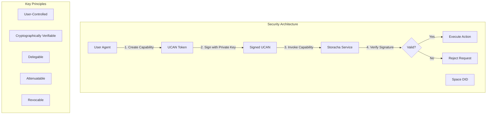
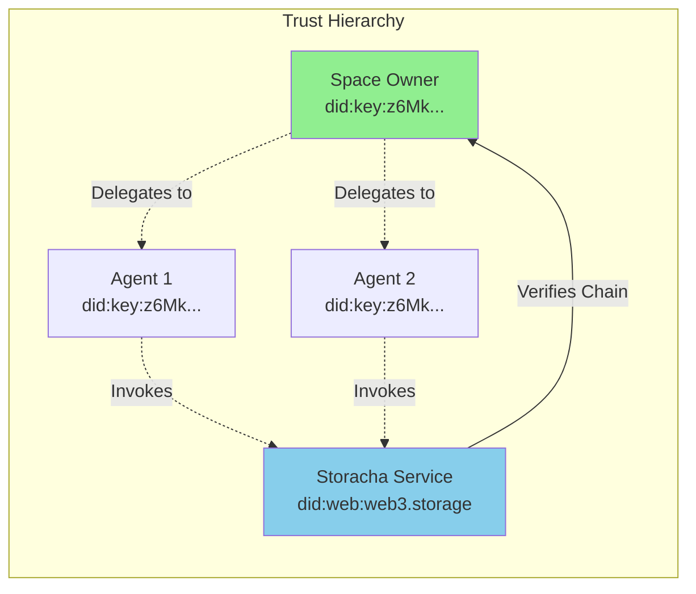
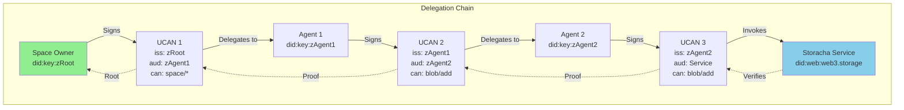

# 10. Security and Authorization

Comprehensive analysis of security and authorization mechanisms in the Storacha ecosystem, covering UCAN-based capability systems, delegation chains, cryptographic verification, and production security best practices.

---

## Table of Contents

### Part 1: Security Model and UCAN Foundations
1. [Security Architecture Overview](#1-security-architecture-overview)
2. [UCAN Fundamentals](#2-ucan-fundamentals)
3. [Capability Model](#3-capability-model)
4. [Delegation Chains](#4-delegation-chains)
5. [Attenuation and Authority Narrowing](#5-attenuation-and-authority-narrowing)

### Part 2: Implementation and Best Practices
6. [W3up Capability Definitions](#6-w3up-capability-definitions)
7. [Delegation Chain Verification](#7-delegation-chain-verification)
8. [Cryptographic Signing and Verification](#8-cryptographic-signing-and-verification)
9. [Revocation Mechanisms](#9-revocation-mechanisms)
10. [Key Management](#10-key-management)
11. [Security Best Practices](#11-security-best-practices)

---

## Part 1: Security Model and UCAN Foundations

### 1. Security Architecture Overview

Storacha uses **UCAN** (User-Controlled Authorization Networks) as its foundational authorization mechanism, providing decentralized, cryptographically verifiable access control.

#### 1.1 Core Security Principles



**Security Foundations**:

1. **User-Controlled Authorization**: Users control their own keys and permissions
2. **Public-Key Cryptography**: All authorization based on cryptographic signatures
3. **Capability-Based**: Fine-grained permissions (capabilities) instead of ACLs
4. **Delegation Without Key Sharing**: Share authority without sharing private keys
5. **Decentralized**: No central authority required for validation

#### 1.2 Threat Model

```javascript
/**
 * Storacha security threat model
 */
const THREAT_MODEL = {
  // Threats we protect against
  protected: [
    'Unauthorized data access',
    'Capability forgery',
    'Replay attacks',
    'Man-in-the-middle attacks',
    'Delegation chain tampering',
    'Expired token usage',
    'Capability amplification',
    'Key compromise (with revocation)'
  ],

  // Threats outside scope
  outOfScope: [
    'Physical device theft (without key extraction)',
    'Social engineering attacks',
    'DNS hijacking',
    'Browser/OS vulnerabilities',
    'Side-channel attacks on crypto operations'
  ],

  // Assumptions
  assumptions: [
    'Cryptographic primitives (EdDSA, SHA-256) are secure',
    'Private keys are stored securely',
    'System clocks are approximately synchronized',
    'Network is untrusted but available',
    'DIDs resolve correctly'
  ]
}
```

#### 1.3 Trust Model



**Trust Relationships**:

1. **Space Owner** (Root Authority): Full control over space
2. **Delegated Agents**: Limited permissions granted by owner
3. **Service**: Validates capabilities, never has user's private key
4. **Verification**: Service trusts only cryptographic proofs, not participants

### 2. UCAN Fundamentals

UCAN extends JWT (JSON Web Token) with a capability-based permission model.

#### 2.1 UCAN Structure

```javascript
/**
 * UCAN token structure (extends JWT)
 */
interface UCAN {
  // Header (JWT standard)
  header: {
    alg: 'EdDSA',           // Signature algorithm
    typ: 'JWT',             // Token type
    ucv: '0.10.0'           // UCAN version
  }

  // Payload
  payload: {
    // Standard JWT claims
    iss: string             // Issuer DID (who grants)
    aud: string             // Audience DID (who receives)
    exp: number             // Expiration (Unix timestamp)
    nbf?: number            // Not before (optional)

    // UCAN-specific
    att: Capability[]       // Attenuations (capabilities)
    fct: Fact[]             // Facts (optional metadata)
    prf: string[]           // Proofs (delegation chain)
  }

  // Signature
  signature: string         // Cryptographic signature
}

/**
 * Capability structure
 */
interface Capability {
  with: string              // Resource URI (what you can access)
  can: string               // Ability (what you can do)
  nb?: Record<string, any>  // Nota bene (caveats/constraints)
}
```

**Example UCAN Token**:

```javascript
// Decoded UCAN for blob/add capability
{
  header: {
    alg: 'EdDSA',
    typ: 'JWT',
    ucv: '0.10.0'
  },
  payload: {
    iss: 'did:key:z6MkwDK3M4PxU1FqcSt4quXghquH1MmxYC7DEyuYCE5JqDxL',  // Agent
    aud: 'did:web:web3.storage',                                       // Service
    exp: 1735689600,  // 2025-01-01

    att: [{
      with: 'did:key:z6MkqmhMoJkaNJx8qY9c43gQwNV8Zce3XPnmyTnG64z8eFa2',  // Space
      can: 'blob/add',                                                     // Ability
      nb: {
        size: 1073741824  // Max 1 GiB
      }
    }],

    prf: ['eyJhbGciOiJFZERTQSIsInR5cCI6IkpXVCIsInVjdiI6IjAuMTAuMCJ9...']  // Parent UCAN
  },
  signature: 'A8xF3...'
}
```

#### 2.2 DID (Decentralized Identifiers)

DIDs uniquely identify participants without central registry:

```javascript
/**
 * DID types used in Storacha
 */
class DIDTypes {
  /**
   * did:key - Cryptographic key-based DID
   * Format: did:key:<multibase-encoded-public-key>
   */
  static createKeyDID(publicKey) {
    // 1. Encode public key with multicodec
    const multicodec = new Uint8Array([0xed, 0x01])  // ed25519-pub
    const encoded = new Uint8Array([...multicodec, ...publicKey])

    // 2. Encode with multibase (base58btc)
    const multibase = 'z' + base58btc.encode(encoded)

    return `did:key:${multibase}`
  }

  /**
   * did:web - Web-based DID
   * Format: did:web:<domain>
   */
  static createWebDID(domain) {
    return `did:web:${domain}`
  }

  /**
   * did:mailto - Email-based DID (for user accounts)
   * Format: did:mailto:<email>
   */
  static createMailtoDID(email) {
    return `did:mailto:${email}`
  }
}

// Examples
const agentDID = 'did:key:z6MkwDK3M4PxU1FqcSt4quXghquH1MmxYC7DEyuYCE5JqDxL'
const spaceDID = 'did:key:z6MkqmhMoJkaNJx8qY9c43gQwNV8Zce3XPnmyTnG64z8eFa2'
const serviceDID = 'did:web:web3.storage'
const accountDID = 'did:mailto:user@example.com'
```

**DID Resolution**:

```javascript
class DIDResolver {
  async resolve(did) {
    const [method, ...identifierParts] = did.split(':').slice(1)

    switch (method) {
      case 'key':
        return this.resolveKeyDID(did)

      case 'web':
        return this.resolveWebDID(did)

      case 'mailto':
        return this.resolveMailtoDID(did)

      default:
        throw new Error(`Unsupported DID method: ${method}`)
    }
  }

  resolveKeyDID(did) {
    // did:key embeds public key in identifier
    const multibase = did.split(':')[2]

    // Decode from base58btc
    const decoded = base58btc.decode(multibase.slice(1))  // Remove 'z' prefix

    // Extract public key (skip multicodec prefix)
    const publicKey = decoded.slice(2)

    return {
      '@context': 'https://w3id.org/did/v1',
      id: did,
      verificationMethod: [{
        id: `${did}#${multibase}`,
        type: 'Ed25519VerificationKey2020',
        controller: did,
        publicKeyMultibase: multibase
      }],
      authentication: [`${did}#${multibase}`],
      assertionMethod: [`${did}#${multibase}`]
    }
  }

  async resolveWebDID(did) {
    // did:web resolves via HTTPS
    const domain = did.split(':')[2]
    const url = `https://${domain}/.well-known/did.json`

    const response = await fetch(url)
    return await response.json()
  }

  resolveMailtoDID(did) {
    // Simplified email DID (no key material)
    return {
      '@context': 'https://w3id.org/did/v1',
      id: did
    }
  }
}

// Usage
const resolver = new DIDResolver()
const didDoc = await resolver.resolve(agentDID)
console.log('Public key:', didDoc.verificationMethod[0].publicKeyMultibase)
```

### 3. Capability Model

Capabilities define **what** you can do (ability) on **which** resource.

#### 3.1 Capability Structure

```javascript
/**
 * Complete capability definition
 */
class Capability {
  constructor(params) {
    this.with = params.with      // Resource URI
    this.can = params.can        // Ability string
    this.nb = params.nb || {}    // Nota bene (caveats)
  }

  /**
   * Check if this capability is valid for a resource and action
   */
  matches(resource, action) {
    // Resource must match
    if (!this.matchesResource(resource)) {
      return false
    }

    // Ability must match
    if (!this.matchesAbility(action)) {
      return false
    }

    return true
  }

  matchesResource(resource) {
    // Exact match
    if (this.with === resource) {
      return true
    }

    // Wildcard match (if supported)
    if (this.with.endsWith('*')) {
      const prefix = this.with.slice(0, -1)
      return resource.startsWith(prefix)
    }

    return false
  }

  matchesAbility(action) {
    // Exact match
    if (this.can === action) {
      return true
    }

    // Wildcard match (e.g., "store/*" matches "store/add")
    if (this.can.endsWith('/*')) {
      const prefix = this.can.slice(0, -2)
      return action.startsWith(prefix + '/')
    }

    // Super-ability (e.g., "*" matches everything)
    if (this.can === '*') {
      return true
    }

    return false
  }

  /**
   * Check if caveats are satisfied
   */
  checkCaveats(context) {
    for (const [key, value] of Object.entries(this.nb)) {
      if (!this.checkCaveat(key, value, context)) {
        return false
      }
    }
    return true
  }

  checkCaveat(key, expected, context) {
    const actual = context[key]

    switch (key) {
      case 'size':
        // Size must not exceed limit
        return actual <= expected

      case 'before':
        // Time must be before limit
        return Date.now() < expected

      case 'link':
        // Link must match exactly
        return actual === expected

      default:
        // Unknown caveat - must match exactly
        return actual === expected
    }
  }
}

// Examples
const blobAddCap = new Capability({
  with: 'did:key:z6MkqmhMoJkaNJx8qY9c43gQwNV8Zce3XPnmyTnG64z8eFa2',
  can: 'blob/add',
  nb: {
    size: 1073741824  // Max 1 GiB
  }
})

// Check if capability allows action
console.log(blobAddCap.matches(
  'did:key:z6MkqmhMoJkaNJx8qY9c43gQwNV8Zce3XPnmyTnG64z8eFa2',
  'blob/add'
))  // true

console.log(blobAddCap.checkCaveats({ size: 524288000 }))  // true (500 MB < 1 GiB)
console.log(blobAddCap.checkCaveats({ size: 2147483648 })) // false (2 GiB > 1 GiB)
```

#### 3.2 Resource URIs

Resources are identified by URIs, typically DIDs:

```javascript
/**
 * Resource URI patterns in Storacha
 */
const RESOURCE_PATTERNS = {
  // Space resource (most common)
  space: 'did:key:z6Mk...',

  // Account resource
  account: 'did:mailto:user@example.com',

  // Service resource
  service: 'did:web:web3.storage',

  // Specific blob (with CID)
  blob: 'did:key:z6Mk.../blob/bagbaiera...',

  // Wildcard (all spaces owned by account)
  allSpaces: 'did:mailto:user@example.com/*'
}
```

#### 3.3 Ability Strings

Abilities follow hierarchical naming:

```javascript
/**
 * Ability hierarchy in w3up
 */
const ABILITIES = {
  // Top-level wildcard
  all: '*',

  // Space abilities
  space: {
    all: 'space/*',
    info: 'space/info',

    // Blob operations
    blob: {
      add: 'blob/add',          // Or 'space/blob/add'
      remove: 'blob/remove',
      list: 'blob/list'
    },

    // Index operations
    index: {
      add: 'index/add',         // Or 'space/index/add'
    },

    // Upload operations
    upload: {
      add: 'upload/add',
      remove: 'upload/remove',
      list: 'upload/list'
    }
  },

  // Filecoin operations
  filecoin: {
    offer: 'filecoin/offer',
    submit: 'filecoin/submit',
    accept: 'filecoin/accept'
  },

  // Store operations (higher-level)
  store: {
    add: 'store/add',
    remove: 'store/remove',
    list: 'store/list'
  },

  // Admin operations
  admin: {
    upload: {
      inspect: 'admin/upload/inspect'
    },
    store: {
      inspect: 'admin/store/inspect'
    }
  }
}

// Ability checking
function canPerform(capability, requiredAbility) {
  const can = capability.can

  // Exact match
  if (can === requiredAbility) return true

  // Wildcard matches
  if (can === '*') return true
  if (can === 'space/*' && requiredAbility.startsWith('space/')) return true
  if (can === 'store/*' && requiredAbility.startsWith('store/')) return true

  return false
}

// Examples
console.log(canPerform({ can: '*' }, 'blob/add'))          // true
console.log(canPerform({ can: 'space/*' }, 'space/info'))  // true
console.log(canPerform({ can: 'blob/add' }, 'blob/add'))   // true
console.log(canPerform({ can: 'blob/add' }, 'blob/remove'))// false
```

### 4. Delegation Chains

Delegation allows sharing authority without sharing private keys.

#### 4.1 Delegation Chain Structure



**Chain Properties**:

1. **Root**: Space owner (full authority)
2. **Intermediate**: Delegated agents (limited authority)
3. **Leaf**: Service invocation (final capability)
4. **Proofs**: Each UCAN includes proof chain to root

#### 4.2 Creating Delegations

```javascript
import * as Signer from '@ucanto/principal/ed25519'
import * as Delegation from '@ucanto/core/delegation'

/**
 * Create a delegation chain
 */
class DelegationBuilder {
  /**
   * Create root delegation (space owner delegates to agent)
   */
  static async createRootDelegation(spaceKey, agentDID, capabilities) {
    // 1. Create signer from space private key
    const spaceSigner = await Signer.parse(spaceKey)

    // 2. Create delegation
    const delegation = await Delegation.delegate({
      issuer: spaceSigner,                 // Space owner
      audience: Signer.parse(agentDID),    // Agent
      capabilities: capabilities,           // What agent can do
      expiration: Date.now() + (365 * 24 * 60 * 60 * 1000),  // 1 year
      proofs: []                            // No parent proof (root)
    })

    return delegation
  }

  /**
   * Create child delegation (agent delegates to another agent)
   */
  static async createChildDelegation(agentKey, targetDID, capabilities, parentProof) {
    const agentSigner = await Signer.parse(agentKey)

    const delegation = await Delegation.delegate({
      issuer: agentSigner,
      audience: Signer.parse(targetDID),
      capabilities: capabilities,
      expiration: Date.now() + (30 * 24 * 60 * 60 * 1000),  // 30 days
      proofs: [parentProof]                 // Include parent delegation
    })

    return delegation
  }

  /**
   * Create service invocation
   */
  static async createInvocation(agentKey, capability, proofs) {
    const agentSigner = await Signer.parse(agentKey)

    const invocation = await Delegation.delegate({
      issuer: agentSigner,
      audience: { did: () => 'did:web:web3.storage' },
      capabilities: [capability],
      expiration: Date.now() + (5 * 60 * 1000),  // 5 minutes
      proofs: proofs                         // Delegation chain
    })

    return invocation
  }
}

// Example: Complete delegation chain
async function exampleDelegationChain() {
  // 1. Space owner delegates to Agent 1
  const spaceKey = 'MgCZT5J...'  // Space private key
  const agent1DID = 'did:key:z6MkwDK3M4PxU1FqcSt4quXghquH1MmxYC7DEyuYCE5JqDxL'

  const delegation1 = await DelegationBuilder.createRootDelegation(
    spaceKey,
    agent1DID,
    [{
      with: 'did:key:z6MkqmhMoJkaNJx8qY9c43gQwNV8Zce3XPnmyTnG64z8eFa2',  // Space
      can: 'space/*'  // Full space permissions
    }]
  )

  console.log('Root delegation created:', delegation1.cid.toString())

  // 2. Agent 1 delegates to Agent 2 (narrower permissions)
  const agent1Key = 'MgCYU6K...'  // Agent 1 private key
  const agent2DID = 'did:key:z6MkrXeujfYFbbjKDoaJQXqsZzRLE5kfvXnDqEpJkVLJvbDW'

  const delegation2 = await DelegationBuilder.createChildDelegation(
    agent1Key,
    agent2DID,
    [{
      with: 'did:key:z6MkqmhMoJkaNJx8qY9c43gQwNV8Zce3XPnmyTnG64z8eFa2',
      can: 'blob/add',  // Only blob/add (attenuated)
      nb: {
        size: 1073741824  // Max 1 GiB
      }
    }],
    delegation1  // Parent proof
  )

  console.log('Child delegation created:', delegation2.cid.toString())

  // 3. Agent 2 invokes service
  const agent2Key = 'MgCZV7L...'  // Agent 2 private key

  const invocation = await DelegationBuilder.createInvocation(
    agent2Key,
    {
      with: 'did:key:z6MkqmhMoJkaNJx8qY9c43gQwNV8Zce3XPnmyTnG64z8eFa2',
      can: 'blob/add',
      nb: {
        blob: { digest: new Uint8Array([...]), size: 524288000 }  // 500 MB
      }
    },
    [delegation2]  // Include entire chain
  )

  console.log('Invocation created:', invocation.cid.toString())

  return invocation
}
```

#### 4.3 Proof Chain Structure

```javascript
/**
 * Proof chain validation
 */
class ProofChain {
  constructor(ucan) {
    this.ucan = ucan
    this.proofs = ucan.prf || []
  }

  /**
   * Build complete chain from leaf to root
   */
  async buildChain() {
    const chain = [this.ucan]

    for (const proofCID of this.proofs) {
      const proofUCAN = await this.resolveProof(proofCID)
      chain.push(proofUCAN)

      // Recursively add parent proofs
      const parentChain = new ProofChain(proofUCAN)
      const parents = await parentChain.buildChain()
      chain.push(...parents.slice(1))  // Skip duplicate
    }

    return chain
  }

  /**
   * Validate entire chain
   */
  async validate() {
    const chain = await this.buildChain()

    // 1. Check each link
    for (let i = 0; i < chain.length; i++) {
      const current = chain[i]

      // Verify signature
      if (!await this.verifySignature(current)) {
        throw new Error(`Invalid signature at position ${i}`)
      }

      // Check time bounds
      if (!this.checkTimeBounds(current)) {
        throw new Error(`Time bounds invalid at position ${i}`)
      }

      // Check audience matches next issuer
      if (i > 0) {
        const parent = chain[i - 1]
        if (parent.aud !== current.iss) {
          throw new Error(`Broken chain at position ${i}: aud/iss mismatch`)
        }
      }
    }

    // 2. Check attenuation
    for (let i = 1; i < chain.length; i++) {
      const child = chain[i - 1]
      const parent = chain[i]

      if (!this.isAttenuated(child.att, parent.att)) {
        throw new Error(`Capability amplification at position ${i}`)
      }
    }

    return true
  }

  /**
   * Check if child capabilities are attenuated from parent
   */
  isAttenuated(childCaps, parentCaps) {
    for (const childCap of childCaps) {
      // Find matching parent capability
      const parentCap = parentCaps.find(p =>
        p.with === childCap.with
      )

      if (!parentCap) {
        return false  // No parent authorization
      }

      // Check ability is narrowed or equal
      if (!this.abilityIsNarrower(childCap.can, parentCap.can)) {
        return false  // Capability amplification!
      }

      // Check caveats are more restrictive or equal
      if (!this.caveatsAreMoreRestrictive(childCap.nb, parentCap.nb)) {
        return false  // Caveat relaxation!
      }
    }

    return true
  }

  abilityIsNarrower(child, parent) {
    // Same ability is ok
    if (child === parent) return true

    // Parent wildcard allows anything
    if (parent === '*') return true

    // Parent namespace wildcard
    if (parent.endsWith('/*')) {
      const parentNs = parent.slice(0, -2)
      return child.startsWith(parentNs + '/')
    }

    return false
  }

  caveatsAreMoreRestrictive(childCaveats = {}, parentCaveats = {}) {
    // Check each parent caveat
    for (const [key, parentValue] of Object.entries(parentCaveats)) {
      const childValue = childCaveats[key]

      // Child must have same caveat
      if (childValue === undefined) {
        return false
      }

      // Check restriction based on caveat type
      if (key === 'size') {
        // Child size must be <= parent size
        if (childValue > parentValue) return false
      } else if (key === 'before') {
        // Child time must be <= parent time
        if (childValue > parentValue) return false
      } else {
        // Other caveats must match exactly
        if (childValue !== parentValue) return false
      }
    }

    return true
  }

  async verifySignature(ucan) {
    // Verify EdDSA signature
    // Implementation depends on crypto library
    return true  // Simplified
  }

  checkTimeBounds(ucan) {
    const now = Date.now() / 1000

    // Check not before
    if (ucan.nbf && now < ucan.nbf) {
      return false
    }

    // Check expiration
    if (ucan.exp && now >= ucan.exp) {
      return false
    }

    return true
  }

  async resolveProof(proofCID) {
    // Fetch proof UCAN from storage/network
    // Implementation depends on storage backend
    return {}  // Simplified
  }
}
```

### 5. Attenuation and Authority Narrowing

Attenuation ensures delegated capabilities can only be narrowed, never amplified.

#### 5.1 Attenuation Rules

```javascript
/**
 * Attenuation validator
 */
class AttenuationValidator {
  /**
   * Validate that child is properly attenuated from parent
   */
  static validate(parent, child) {
    const violations = []

    // 1. Resource must match or be more specific
    if (!this.resourceIsNarrower(child.with, parent.with)) {
      violations.push({
        type: 'resource_amplification',
        parent: parent.with,
        child: child.with
      })
    }

    // 2. Ability must be narrower or equal
    if (!this.abilityIsNarrower(child.can, parent.can)) {
      violations.push({
        type: 'ability_amplification',
        parent: parent.can,
        child: child.can
      })
    }

    // 3. Caveats must be more restrictive
    const caveatViolations = this.validateCaveats(parent.nb, child.nb)
    violations.push(...caveatViolations)

    // 4. Time bounds must be within parent bounds
    const timeViolations = this.validateTimeBounds(parent, child)
    violations.push(...timeViolations)

    return {
      valid: violations.length === 0,
      violations
    }
  }

  static resourceIsNarrower(child, parent) {
    // Exact match is ok
    if (child === parent) return true

    // Parent wildcard allows child to be specific
    if (parent.endsWith('/*')) {
      const parentPrefix = parent.slice(0, -2)
      return child.startsWith(parentPrefix + '/')
    }

    return false
  }

  static abilityIsNarrower(child, parent) {
    if (child === parent) return true
    if (parent === '*') return true

    if (parent.endsWith('/*')) {
      const parentNs = parent.slice(0, -2)
      return child.startsWith(parentNs + '/')
    }

    return false
  }

  static validateCaveats(parentCaveats = {}, childCaveats = {}) {
    const violations = []

    for (const [key, parentValue] of Object.entries(parentCaveats)) {
      const childValue = childCaveats[key]

      if (childValue === undefined) {
        violations.push({
          type: 'missing_caveat',
          caveat: key,
          parentValue
        })
        continue
      }

      // Type-specific validation
      if (key === 'size' && childValue > parentValue) {
        violations.push({
          type: 'caveat_relaxation',
          caveat: 'size',
          parent: parentValue,
          child: childValue
        })
      } else if (key === 'before' && childValue > parentValue) {
        violations.push({
          type: 'caveat_relaxation',
          caveat: 'before',
          parent: parentValue,
          child: childValue
        })
      }
    }

    return violations
  }

  static validateTimeBounds(parent, child) {
    const violations = []

    // Child nbf must be >= parent nbf
    if (parent.nbf && child.nbf && child.nbf < parent.nbf) {
      violations.push({
        type: 'time_amplification',
        field: 'nbf',
        parent: parent.nbf,
        child: child.nbf
      })
    }

    // Child exp must be <= parent exp
    if (parent.exp && child.exp && child.exp > parent.exp) {
      violations.push({
        type: 'time_amplification',
        field: 'exp',
        parent: parent.exp,
        child: child.exp
      })
    }

    return violations
  }
}

// Example validation
const parentCap = {
  with: 'did:key:z6Mk...',
  can: 'space/*',
  nb: { size: 10737418240 },  // 10 GiB
  exp: 1735689600
}

const childCap = {
  with: 'did:key:z6Mk...',
  can: 'blob/add',
  nb: { size: 1073741824 },   // 1 GiB (more restrictive ✓)
  exp: 1735603200             // Earlier expiration ✓
}

const result = AttenuationValidator.validate(parentCap, childCap)
console.log('Valid attenuation:', result.valid)

// Invalid example (capability amplification)
const invalidChild = {
  with: 'did:key:z6Mk...',
  can: 'space/*',
  nb: { size: 21474836480 },  // 20 GiB (less restrictive ✗)
  exp: 1735689600
}

const invalidResult = AttenuationValidator.validate(parentCap, invalidChild)
console.log('Violations:', invalidResult.violations)
// Output: [{ type: 'caveat_relaxation', caveat: 'size', parent: 10737418240, child: 21474836480 }]
```

#### 5.2 Attenuation Examples

```javascript
/**
 * Common attenuation patterns
 */
class AttenuationPatterns {
  /**
   * Pattern 1: Narrow ability
   * space/* -> blob/add
   */
  static narrowAbility(parent) {
    return {
      ...parent,
      can: 'blob/add'  // More specific than 'space/*'
    }
  }

  /**
   * Pattern 2: Add size restriction
   */
  static addSizeLimit(parent, maxSize) {
    return {
      ...parent,
      nb: {
        ...parent.nb,
        size: Math.min(parent.nb?.size || Infinity, maxSize)
      }
    }
  }

  /**
   * Pattern 3: Reduce expiration
   */
  static shortenExpiration(parent, newExp) {
    return {
      ...parent,
      exp: Math.min(parent.exp, newExp)
    }
  }

  /**
   * Pattern 4: Add resource specificity
   * did:key:z6Mk.../* -> did:key:z6Mk.../blob/bagbaiera...
   */
  static specifyResource(parent, specificResource) {
    return {
      ...parent,
      with: specificResource
    }
  }

  /**
   * Pattern 5: Combine multiple attenuations
   */
  static combineAttenuations(parent, attenuations) {
    let result = { ...parent }

    for (const attenuation of attenuations) {
      result = attenuation(result)
    }

    return result
  }
}

// Usage
const fullAccess = {
  with: 'did:key:z6Mk...',
  can: '*',
  nb: {},
  exp: Date.now() + (365 * 24 * 60 * 60 * 1000)
}

// Create heavily attenuated capability
const restricted = AttenuationPatterns.combineAttenuations(fullAccess, [
  (cap) => AttenuationPatterns.narrowAbility(cap),
  (cap) => AttenuationPatterns.addSizeLimit(cap, 1073741824),  // 1 GiB
  (cap) => AttenuationPatterns.shortenExpiration(cap, Date.now() + (7 * 24 * 60 * 60 * 1000))  // 7 days
])

console.log('Attenuated capability:', restricted)
// {
//   with: 'did:key:z6Mk...',
//   can: 'blob/add',
//   nb: { size: 1073741824 },
//   exp: <7 days from now>
// }
```

---

## Part 2: Implementation and Best Practices

### 6. W3up Capability Definitions

Complete implementation of w3up capabilities using ucanto.

#### 6.1 Capability Type Definitions

```typescript
import { capability, Schema, ok, error } from '@ucanto/validator'
import { equal } from '@ucanto/core'

/**
 * blob/add capability - Add blob to space
 */
export const blobAdd = capability({
  can: 'blob/add',
  with: Schema.did(),  // Space DID
  nb: Schema.struct({
    blob: Schema.struct({
      digest: Schema.bytes(),    // Multihash digest
      size: Schema.integer()     // Blob size in bytes
    })
  }),
  derives: (child, parent) => {
    // Check resource matches
    if (child.with !== parent.with) {
      return error('Resource mismatch')
    }

    // Check size caveat
    if (parent.nb.blob?.size && child.nb.blob.size > parent.nb.blob.size) {
      return error(`Size ${child.nb.blob.size} exceeds limit ${parent.nb.blob.size}`)
    }

    return ok({})
  }
})

/**
 * index/add capability - Add index to space
 */
export const indexAdd = capability({
  can: 'index/add',
  with: Schema.did(),
  nb: Schema.struct({
    index: Schema.link()  // CID of index
  }),
  derives: (child, parent) => {
    return child.with === parent.with
      ? ok({})
      : error('Resource mismatch')
  }
})

/**
 * upload/add capability - Create upload
 */
export const uploadAdd = capability({
  can: 'upload/add',
  with: Schema.did(),
  nb: Schema.struct({
    root: Schema.link(),          // Root CID
    shards: Schema.array(Schema.link()).optional()  // Shard CIDs
  }),
  derives: (child, parent) => {
    return child.with === parent.with
      ? ok({})
      : error('Resource mismatch')
  }
})

/**
 * filecoin/offer capability - Offer to Filecoin
 */
export const filecoinOffer = capability({
  can: 'filecoin/offer',
  with: Schema.did(),
  nb: Schema.struct({
    piece: Schema.link(),         // Piece CID
    content: Schema.link()        // Content CID
  }),
  derives: (child, parent) => {
    return child.with === parent.with
      ? ok({})
      : error('Resource mismatch')
  }
})

/**
 * space/* wildcard capability - All space operations
 */
export const spaceAll = capability({
  can: 'space/*',
  with: Schema.did(),
  nb: Schema.struct({}),
  derives: (child, parent) => {
    // Wildcard allows any space capability
    if (!child.can.startsWith('space/')) {
      return error('Capability not in space namespace')
    }
    return child.with === parent.with
      ? ok({})
      : error('Resource mismatch')
  }
})

/**
 * Top-level wildcard capability
 */
export const all = capability({
  can: '*',
  with: Schema.did(),
  nb: Schema.struct({}),
  derives: () => ok({})  // Allows everything
})
```

#### 6.2 Invoking Capabilities

```typescript
import { invoke } from '@ucanto/client'
import { connect } from '@ucanto/client'
import * as CAR from '@ucanto/transport/car'
import * as HTTP from '@ucanto/transport/http'

/**
 * Client for invoking w3up capabilities
 */
class W3upClient {
  constructor(agent, serviceURL) {
    this.agent = agent
    this.connection = connect({
      id: { did: () => 'did:web:web3.storage' },
      codec: CAR.outbound,
      channel: HTTP.open({ url: serviceURL })
    })
  }

  /**
   * Invoke blob/add capability
   */
  async addBlob(space, blob, proof) {
    const invocation = invoke({
      issuer: this.agent,
      audience: { did: () => 'did:web:web3.storage' },
      capability: {
        can: 'blob/add',
        with: space.did(),
        nb: {
          blob: {
            digest: blob.digest,
            size: blob.size
          }
        }
      },
      proofs: [proof]  // Delegation chain
    })

    const result = await invocation.execute(this.connection)

    if (result.out.error) {
      throw new Error(`blob/add failed: ${result.out.error.message}`)
    }

    return result.out.ok
  }

  /**
   * Invoke index/add capability
   */
  async addIndex(space, index, proof) {
    const invocation = invoke({
      issuer: this.agent,
      audience: { did: () => 'did:web:web3.storage' },
      capability: {
        can: 'index/add',
        with: space.did(),
        nb: { index }
      },
      proofs: [proof]
    })

    const result = await invocation.execute(this.connection)
    return result.out.ok
  }

  /**
   * Invoke upload/add capability
   */
  async addUpload(space, root, shards, proof) {
    const invocation = invoke({
      issuer: this.agent,
      audience: { did: () => 'did:web:web3.storage' },
      capability: {
        can: 'upload/add',
        with: space.did(),
        nb: { root, shards }
      },
      proofs: [proof]
    })

    const result = await invocation.execute(this.connection)
    return result.out.ok
  }

  /**
   * Invoke filecoin/offer capability
   */
  async offerFilecoin(space, piece, content, proof) {
    const invocation = invoke({
      issuer: this.agent,
      audience: { did: () => 'did:web:web3.storage' },
      capability: {
        can: 'filecoin/offer',
        with: space.did(),
        nb: { piece, content }
      },
      proofs: [proof]
    })

    const result = await invocation.execute(this.connection)
    return result.out.ok
  }
}

// Usage
const agent = await Signer.generate()
const client = new W3upClient(agent, 'https://up.web3.storage')

// Create delegation proof
const proof = await createDelegation(spaceKey, agent.did(), [
  { can: 'blob/add', with: space.did() }
])

// Invoke capability
const result = await client.addBlob(space, {
  digest: new Uint8Array([...]),
  size: 1048576
}, proof)
```

### 7. Delegation Chain Verification

Complete implementation of delegation chain verification.

#### 7.1 Verification Algorithm

```typescript
import { verifySignature } from '@ucanto/principal'
import { validate } from '@ucanto/validator'

/**
 * Complete delegation chain verifier
 */
class DelegationVerifier {
  /**
   * Verify complete delegation chain
   */
  async verify(invocation, context) {
    // 1. Build complete proof chain
    const chain = await this.buildChain(invocation)

    // 2. Verify each link
    for (let i = 0; i < chain.length; i++) {
      const result = await this.verifyLink(chain[i], chain[i + 1], context)
      if (result.error) {
        return {
          valid: false,
          error: `Chain verification failed at link ${i}: ${result.error}`
        }
      }
    }

    // 3. Verify capability derivation
    const derivationResult = this.verifyDerivation(chain)
    if (derivationResult.error) {
      return {
        valid: false,
        error: derivationResult.error
      }
    }

    return { valid: true }
  }

  async buildChain(invocation) {
    const chain = [invocation]

    // Add all proofs recursively
    for (const proof of invocation.proofs || []) {
      chain.push(proof)

      // Recursively add proof's proofs
      if (proof.proofs) {
        const subChain = await this.buildChain(proof)
        chain.push(...subChain.slice(1))  // Skip duplicate
      }
    }

    return chain
  }

  async verifyLink(child, parent, context) {
    // 1. Verify signature
    const sigValid = await this.verifySignature(child)
    if (!sigValid) {
      return { error: 'Invalid signature' }
    }

    // 2. Verify time bounds
    const timeValid = this.verifyTimeBounds(child, context.now)
    if (!timeValid) {
      return { error: 'Time bounds violated' }
    }

    // 3. If has parent, verify chain link
    if (parent) {
      // Audience must match parent's issuer
      if (child.audience.did() !== parent.issuer.did()) {
        return { error: 'Broken chain: audience/issuer mismatch' }
      }

      // Time bounds must be within parent's
      if (child.expiration > parent.expiration) {
        return { error: 'Child expiration exceeds parent' }
      }

      if (parent.notBefore && child.notBefore < parent.notBefore) {
        return { error: 'Child notBefore precedes parent' }
      }
    }

    return { valid: true }
  }

  async verifySignature(delegation) {
    try {
      await verifySignature(delegation)
      return true
    } catch {
      return false
    }
  }

  verifyTimeBounds(delegation, now = Date.now()) {
    const nowSec = Math.floor(now / 1000)

    // Check not before
    if (delegation.notBefore && nowSec < delegation.notBefore) {
      return false
    }

    // Check expiration
    if (delegation.expiration && nowSec >= delegation.expiration) {
      return false
    }

    return true
  }

  verifyDerivation(chain) {
    // Verify each capability derives from parent
    for (let i = 1; i < chain.length; i++) {
      const child = chain[i - 1]
      const parent = chain[i]

      for (const childCap of child.capabilities) {
        // Find matching parent capability
        const parentCap = parent.capabilities.find(p =>
          this.capabilitiesMatch(childCap, p)
        )

        if (!parentCap) {
          return {
            error: `No parent capability found for ${childCap.can}`
          }
        }

        // Verify derivation
        const derives = this.verifyCapabilityDerivation(childCap, parentCap)
        if (derives.error) {
          return derives
        }
      }
    }

    return { valid: true }
  }

  capabilitiesMatch(cap1, cap2) {
    // Must be same resource
    if (cap1.with !== cap2.with) {
      return false
    }

    // Check ability compatibility
    return this.abilityMatches(cap1.can, cap2.can)
  }

  abilityMatches(child, parent) {
    if (child === parent) return true
    if (parent === '*') return true

    if (parent.endsWith('/*')) {
      const ns = parent.slice(0, -2)
      return child.startsWith(ns + '/')
    }

    return false
  }

  verifyCapabilityDerivation(child, parent) {
    // Resource must match
    if (child.with !== parent.with) {
      return { error: 'Resource mismatch' }
    }

    // Ability must be derived
    if (!this.abilityMatches(child.can, parent.can)) {
      return { error: 'Ability not derived' }
    }

    // Caveats must be more restrictive
    const caveatResult = this.verifyCaveats(child.nb || {}, parent.nb || {})
    if (caveatResult.error) {
      return caveatResult
    }

    return { valid: true }
  }

  verifyCaveats(childCaveats, parentCaveats) {
    for (const [key, parentValue] of Object.entries(parentCaveats)) {
      const childValue = childCaveats[key]

      if (childValue === undefined) {
        return { error: `Missing caveat: ${key}` }
      }

      // Type-specific validation
      if (typeof parentValue === 'number' && childValue > parentValue) {
        return { error: `Caveat ${key} relaxed` }
      }
    }

    return { valid: true }
  }
}

// Usage
const verifier = new DelegationVerifier()

const result = await verifier.verify(invocation, {
  now: Date.now()
})

if (result.valid) {
  console.log('✅ Delegation chain valid')
} else {
  console.error('❌ Verification failed:', result.error)
}
```

#### 7.2 Service-Side Validation

```typescript
/**
 * Service handler with validation
 */
class ServiceHandler {
  async handleBlobAdd(invocation) {
    // 1. Validate delegation chain
    const verifier = new DelegationVerifier()
    const validationResult = await verifier.verify(invocation, {
      now: Date.now()
    })

    if (!validationResult.valid) {
      return {
        error: {
          name: 'Unauthorized',
          message: validationResult.error
        }
      }
    }

    // 2. Extract capability
    const capability = invocation.capabilities[0]

    // 3. Validate caveat constraints
    const { blob } = capability.nb

    if (blob.size > 1073741824) {  // 1 GiB limit
      return {
        error: {
          name: 'BlobTooLarge',
          message: `Blob size ${blob.size} exceeds 1 GiB limit`
        }
      }
    }

    // 4. Execute action
    try {
      await this.storageService.addBlob(capability.with, blob)

      return {
        ok: {
          digest: blob.digest,
          size: blob.size,
          stored: new Date().toISOString()
        }
      }
    } catch (error) {
      return {
        error: {
          name: 'StorageError',
          message: error.message
        }
      }
    }
  }
}
```

### 8. Cryptographic Signing and Verification

Implementation of cryptographic operations for UCANs.

#### 8.1 Key Generation

```typescript
import * as ed25519 from '@noble/ed25519'
import { base58btc } from 'multiformats/bases/base58'

/**
 * Generate EdDSA key pair
 */
class KeyGenerator {
  /**
   * Generate new Ed25519 key pair
   */
  static async generate() {
    // Generate private key (32 bytes)
    const privateKey = ed25519.utils.randomPrivateKey()

    // Derive public key
    const publicKey = await ed25519.getPublicKey(privateKey)

    return {
      privateKey,
      publicKey,
      did: this.publicKeyToDID(publicKey)
    }
  }

  /**
   * Convert public key to did:key
   */
  static publicKeyToDID(publicKey) {
    // 1. Add multicodec prefix (0xed01 for ed25519-pub)
    const multicodec = new Uint8Array([0xed, 0x01])
    const prefixed = new Uint8Array([...multicodec, ...publicKey])

    // 2. Encode with base58btc
    const encoded = base58btc.encode(prefixed)

    return `did:key:${encoded}`
  }

  /**
   * Convert DID back to public key
   */
  static didToPublicKey(did) {
    const encoded = did.split(':')[2]
    const decoded = base58btc.decode(encoded)

    // Skip multicodec prefix (2 bytes)
    return decoded.slice(2)
  }
}

// Usage
const keys = await KeyGenerator.generate()
console.log('DID:', keys.did)
console.log('Public Key:', Buffer.from(keys.publicKey).toString('hex'))
```

#### 8.2 Signing UCANs

```typescript
import * as CBOR from '@ipld/dag-cbor'
import { sha256 } from 'multiformats/hashes/sha2'

/**
 * UCAN signer
 */
class UCANSigner {
  constructor(privateKey) {
    this.privateKey = privateKey
  }

  /**
   * Sign UCAN payload
   */
  async sign(payload) {
    // 1. Create header
    const header = {
      alg: 'EdDSA',
      typ: 'JWT',
      ucv: '0.10.0'
    }

    // 2. Encode header and payload
    const encodedHeader = this.base64urlEncode(JSON.stringify(header))
    const encodedPayload = this.base64urlEncode(JSON.stringify(payload))

    // 3. Create signing input
    const signingInput = `${encodedHeader}.${encodedPayload}`

    // 4. Sign
    const signature = await ed25519.sign(
      new TextEncoder().encode(signingInput),
      this.privateKey
    )

    // 5. Encode signature
    const encodedSignature = this.base64urlEncode(signature)

    // 6. Create complete JWT
    const jwt = `${signingInput}.${encodedSignature}`

    return jwt
  }

  base64urlEncode(data) {
    const bytes = typeof data === 'string'
      ? new TextEncoder().encode(data)
      : data

    return btoa(String.fromCharCode(...bytes))
      .replace(/\+/g, '-')
      .replace(/\//g, '_')
      .replace(/=/g, '')
  }

  async signCAR(invocation) {
    // Sign as CAR format (used in ucanto)
    const encoded = CBOR.encode(invocation)
    const hash = await sha256.digest(encoded)
    const signature = await ed25519.sign(hash.digest, this.privateKey)

    return {
      payload: encoded,
      signature
    }
  }
}

// Usage
const signer = new UCANSigner(privateKey)

const payload = {
  iss: 'did:key:z6MkwDK...',
  aud: 'did:web:web3.storage',
  exp: Math.floor(Date.now() / 1000) + 3600,
  att: [{
    with: 'did:key:z6Mkqmh...',
    can: 'blob/add',
    nb: { size: 1073741824 }
  }],
  prf: []
}

const jwt = await signer.sign(payload)
console.log('Signed UCAN:', jwt)
```

#### 8.3 Signature Verification

```typescript
/**
 * UCAN signature verifier
 */
class UCANVerifier {
  /**
   * Verify UCAN signature
   */
  async verify(jwt) {
    // 1. Split JWT
    const parts = jwt.split('.')
    if (parts.length !== 3) {
      throw new Error('Invalid JWT format')
    }

    const [encodedHeader, encodedPayload, encodedSignature] = parts

    // 2. Decode payload to get issuer
    const payload = JSON.parse(this.base64urlDecode(encodedPayload))

    // 3. Get public key from issuer DID
    const publicKey = KeyGenerator.didToPublicKey(payload.iss)

    // 4. Verify signature
    const signingInput = `${encodedHeader}.${encodedPayload}`
    const signature = this.base64urlDecodeToBytes(encodedSignature)

    const valid = await ed25519.verify(
      signature,
      new TextEncoder().encode(signingInput),
      publicKey
    )

    if (!valid) {
      throw new Error('Invalid signature')
    }

    return {
      header: JSON.parse(this.base64urlDecode(encodedHeader)),
      payload,
      valid: true
    }
  }

  base64urlDecode(str) {
    // Add padding
    const pad = str.length % 4
    const padded = pad ? str + '='.repeat(4 - pad) : str

    // Decode
    const base64 = padded
      .replace(/-/g, '+')
      .replace(/_/g, '/')

    return atob(base64)
  }

  base64urlDecodeToBytes(str) {
    const decoded = this.base64urlDecode(str)
    return new Uint8Array([...decoded].map(c => c.charCodeAt(0)))
  }
}

// Usage
const verifier = new UCANVerifier()

try {
  const result = await verifier.verify(jwt)
  console.log('✅ Signature valid')
  console.log('Issuer:', result.payload.iss)
} catch (err) {
  console.error('❌ Signature invalid:', err.message)
}
```

### 9. Revocation Mechanisms

UCAN revocation for invalidating delegations.

#### 9.1 Revocation Store

```typescript
/**
 * Revocation list management
 */
class RevocationStore {
  constructor() {
    this.revoked = new Set()  // Set of revoked UCAN CIDs
  }

  /**
   * Revoke a UCAN by CID
   */
  async revoke(ucanCID, reason) {
    this.revoked.add(ucanCID.toString())

    await this.persistRevocation({
      cid: ucanCID.toString(),
      revokedAt: new Date().toISOString(),
      reason
    })

    console.log(`Revoked UCAN ${ucanCID}: ${reason}`)
  }

  /**
   * Check if UCAN is revoked
   */
  isRevoked(ucanCID) {
    return this.revoked.has(ucanCID.toString())
  }

  /**
   * Check entire delegation chain for revocations
   */
  async checkChain(chain) {
    for (const delegation of chain) {
      if (this.isRevoked(delegation.cid)) {
        return {
          revoked: true,
          revokedCID: delegation.cid.toString()
        }
      }
    }

    return { revoked: false }
  }

  async persistRevocation(record) {
    // Persist to durable storage
    // In production: DynamoDB, PostgreSQL, etc.
    await this.db.revocations.insert(record)
  }

  /**
   * Load revocations from storage
   */
  async load() {
    const records = await this.db.revocations.findAll()
    for (const record of records) {
      this.revoked.add(record.cid)
    }
  }
}

// Usage
const revocationStore = new RevocationStore()

// Revoke a delegation
await revocationStore.revoke(delegationCID, 'Key compromised')

// Check if revoked
const isRevoked = revocationStore.isRevoked(delegationCID)
console.log('Is revoked:', isRevoked)  // true
```

#### 9.2 Revocation in Verification

```typescript
/**
 * Verifier with revocation checking
 */
class VerifierWithRevocation extends DelegationVerifier {
  constructor(revocationStore) {
    super()
    this.revocationStore = revocationStore
  }

  async verify(invocation, context) {
    // 1. Build chain
    const chain = await this.buildChain(invocation)

    // 2. Check revocations
    const revocationCheck = await this.revocationStore.checkChain(chain)
    if (revocationCheck.revoked) {
      return {
        valid: false,
        error: `UCAN ${revocationCheck.revokedCID} has been revoked`
      }
    }

    // 3. Continue with normal verification
    return await super.verify(invocation, context)
  }
}

// Usage
const verifier = new VerifierWithRevocation(revocationStore)

const result = await verifier.verify(invocation, { now: Date.now() })

if (result.valid) {
  console.log('✅ Valid and not revoked')
} else {
  console.error('❌ Invalid or revoked:', result.error)
}
```

### 10. Key Management

Secure key generation, storage, and rotation.

#### 10.1 Secure Key Storage

```typescript
/**
 * Secure key store with encryption
 */
class SecureKeyStore {
  /**
   * Store private key encrypted
   */
  async storeKey(name, privateKey, password) {
    // 1. Derive encryption key from password
    const salt = crypto.getRandomValues(new Uint8Array(16))
    const encryptionKey = await this.deriveKey(password, salt)

    // 2. Encrypt private key
    const iv = crypto.getRandomValues(new Uint8Array(12))
    const encrypted = await crypto.subtle.encrypt(
      { name: 'AES-GCM', iv },
      encryptionKey,
      privateKey
    )

    // 3. Store encrypted key with salt and IV
    await this.storage.set(name, {
      encrypted: Buffer.from(encrypted).toString('base64'),
      salt: Buffer.from(salt).toString('base64'),
      iv: Buffer.from(iv).toString('base64'),
      created: new Date().toISOString()
    })
  }

  /**
   * Retrieve and decrypt private key
   */
  async retrieveKey(name, password) {
    // 1. Load encrypted data
    const stored = await this.storage.get(name)
    if (!stored) {
      throw new Error(`Key '${name}' not found`)
    }

    // 2. Derive encryption key
    const salt = Buffer.from(stored.salt, 'base64')
    const encryptionKey = await this.deriveKey(password, salt)

    // 3. Decrypt private key
    const encrypted = Buffer.from(stored.encrypted, 'base64')
    const iv = Buffer.from(stored.iv, 'base64')

    try {
      const decrypted = await crypto.subtle.decrypt(
        { name: 'AES-GCM', iv },
        encryptionKey,
        encrypted
      )

      return new Uint8Array(decrypted)
    } catch (err) {
      throw new Error('Incorrect password')
    }
  }

  async deriveKey(password, salt) {
    // Use PBKDF2 to derive key from password
    const passwordKey = await crypto.subtle.importKey(
      'raw',
      new TextEncoder().encode(password),
      'PBKDF2',
      false,
      ['deriveBits', 'deriveKey']
    )

    return await crypto.subtle.deriveKey(
      {
        name: 'PBKDF2',
        salt,
        iterations: 100000,
        hash: 'SHA-256'
      },
      passwordKey,
      { name: 'AES-GCM', length: 256 },
      false,
      ['encrypt', 'decrypt']
    )
  }

  /**
   * Delete key
   */
  async deleteKey(name) {
    await this.storage.delete(name)
  }

  /**
   * List stored keys
   */
  async listKeys() {
    return await this.storage.keys()
  }
}

// Usage
const keyStore = new SecureKeyStore(storage)

// Store key
await keyStore.storeKey('agent-1', privateKey, 'secure-password-123')

// Retrieve key
const retrieved = await keyStore.retrieveKey('agent-1', 'secure-password-123')
```

#### 10.2 Key Rotation

```typescript
/**
 * Key rotation manager
 */
class KeyRotationManager {
  /**
   * Rotate agent key
   */
  async rotateAgentKey(oldAgent, delegations) {
    // 1. Generate new key
    const newKeys = await KeyGenerator.generate()

    // 2. Re-delegate all capabilities to new key
    const newDelegations = []

    for (const delegation of delegations) {
      const newDelegation = await Delegation.delegate({
        issuer: oldAgent,
        audience: { did: () => newKeys.did },
        capabilities: delegation.capabilities,
        expiration: delegation.expiration,
        proofs: delegation.proofs
      })

      newDelegations.push(newDelegation)
    }

    // 3. Revoke old delegations (optional, for security)
    for (const delegation of delegations) {
      await this.revocationStore.revoke(
        delegation.cid,
        'Key rotated'
      )
    }

    return {
      newAgent: {
        did: newKeys.did,
        privateKey: newKeys.privateKey
      },
      newDelegations
    }
  }

  /**
   * Emergency key rotation (compromise detected)
   */
  async emergencyRotation(compromisedAgent) {
    // 1. Revoke ALL delegations for compromised key
    const delegations = await this.findDelegationsForAgent(compromisedAgent.did())

    for (const delegation of delegations) {
      await this.revocationStore.revoke(
        delegation.cid,
        'Emergency: Key compromised'
      )
    }

    // 2. Generate new key
    const newKeys = await KeyGenerator.generate()

    // 3. Notify space owner to re-delegate
    await this.notifyOwner({
      type: 'KEY_COMPROMISED',
      oldDID: compromisedAgent.did(),
      newDID: newKeys.did,
      revokedCount: delegations.length
    })

    return newKeys
  }
}
```

### 11. Security Best Practices

Production security recommendations.

#### 11.1 Capability Design

```typescript
/**
 * Security best practices for capabilities
 */
const SECURITY_BEST_PRACTICES = {
  // Principle of Least Privilege
  leastPrivilege: {
    description: 'Grant minimum necessary permissions',
    examples: [
      {
        bad: {
          can: '*',  // Too broad
          with: 'did:key:z6Mk...'
        },
        good: {
          can: 'blob/add',  // Specific
          with: 'did:key:z6Mk...',
          nb: { size: 1073741824 }  // With limits
        }
      }
    ]
  },

  // Short Expiration Times
  shortExpiration: {
    description: 'Use short expiration for sensitive operations',
    examples: [
      {
        temporary: {
          exp: Date.now() + (5 * 60 * 1000)  // 5 minutes for invocations
        },
        delegation: {
          exp: Date.now() + (30 * 24 * 60 * 60 * 1000)  // 30 days for delegations
        },
        root: {
          exp: Date.now() + (365 * 24 * 60 * 60 * 1000)  // 1 year for root
        }
      }
    ]
  },

  // Caveat Usage
  useCaveats: {
    description: 'Add caveats to limit capability scope',
    examples: [
      {
        sizeLimit: { nb: { size: 1073741824 } },  // Max 1 GiB
        timeLimit: { nb: { before: Date.now() + 86400000 } },  // 24 hours
        resourceLimit: { nb: { link: CID.parse('bafybei...') } }  // Specific resource
      }
    ]
  },

  // Key Separation
  keySeparation: {
    description: 'Use different keys for different purposes',
    examples: [
      'spaceKey - never shares, only delegates',
      'agentKey - device-specific, delegates to services',
      'sessionKey - temporary, short-lived'
    ]
  }
}
```

#### 11.2 Validation Checklist

```typescript
/**
 * Security validation checklist
 */
class SecurityValidator {
  async validateInvocation(invocation) {
    const issues = []

    // 1. Check signature
    try {
      await verifySignature(invocation)
    } catch {
      issues.push({
        severity: 'critical',
        issue: 'Invalid signature'
      })
    }

    // 2. Check expiration
    if (this.isExpired(invocation)) {
      issues.push({
        severity: 'critical',
        issue: 'UCAN expired'
      })
    }

    // 3. Check revocation
    if (await this.revocationStore.isRevoked(invocation.cid)) {
      issues.push({
        severity: 'critical',
        issue: 'UCAN revoked'
      })
    }

    // 4. Check capability bounds
    for (const cap of invocation.capabilities) {
      if (!cap.nb || Object.keys(cap.nb).length === 0) {
        issues.push({
          severity: 'warning',
          issue: `No caveats on ${cap.can} capability`,
          recommendation: 'Add size limits or other constraints'
        })
      }

      if (cap.can === '*' || cap.can.endsWith('/*')) {
        issues.push({
          severity: 'warning',
          issue: 'Wildcard capability',
          recommendation: 'Use specific ability instead'
        })
      }
    }

    // 5. Check delegation chain depth
    const chain = await this.buildChain(invocation)
    if (chain.length > 10) {
      issues.push({
        severity: 'warning',
        issue: `Long delegation chain (${chain.length} links)`,
        recommendation: 'Consider shorter chains for better performance'
      })
    }

    // 6. Check for proper attenuation
    const attenuationIssues = this.validateAttenuation(chain)
    issues.push(...attenuationIssues)

    return {
      valid: issues.filter(i => i.severity === 'critical').length === 0,
      issues
    }
  }

  isExpired(invocation) {
    const now = Math.floor(Date.now() / 1000)
    return invocation.expiration && now >= invocation.expiration
  }

  validateAttenuation(chain) {
    const issues = []

    for (let i = 1; i < chain.length; i++) {
      const child = chain[i - 1]
      const parent = chain[i]

      for (const childCap of child.capabilities) {
        const parentCap = parent.capabilities.find(p =>
          p.with === childCap.with
        )

        if (parentCap) {
          // Check for capability amplification
          if (!this.isAttenuated(childCap, parentCap)) {
            issues.push({
              severity: 'critical',
              issue: `Capability amplification detected at link ${i}`,
              child: childCap,
              parent: parentCap
            })
          }
        }
      }
    }

    return issues
  }

  isAttenuated(child, parent) {
    // Simplified attenuation check
    return this.abilityIsNarrower(child.can, parent.can) &&
           this.caveatsAreMoreRestrictive(child.nb, parent.nb)
  }

  abilityIsNarrower(child, parent) {
    if (child === parent) return true
    if (parent === '*') return true
    if (parent.endsWith('/*')) {
      const ns = parent.slice(0, -2)
      return child.startsWith(ns + '/')
    }
    return false
  }

  caveatsAreMoreRestrictive(childCaveats = {}, parentCaveats = {}) {
    for (const [key, parentValue] of Object.entries(parentCaveats)) {
      const childValue = childCaveats[key]
      if (childValue === undefined) return false
      if (typeof parentValue === 'number' && childValue > parentValue) return false
    }
    return true
  }
}

// Usage
const validator = new SecurityValidator()
const result = await validator.validateInvocation(invocation)

if (!result.valid) {
  console.error('❌ Security validation failed')
  console.error('Critical issues:', result.issues.filter(i => i.severity === 'critical'))
}

if (result.issues.some(i => i.severity === 'warning')) {
  console.warn('⚠️  Security warnings:', result.issues.filter(i => i.severity === 'warning'))
}
```

#### 11.3 Attack Prevention

```typescript
/**
 * Common attack vectors and prevention
 */
const ATTACK_PREVENTION = {
  // Replay attacks
  replayAttacks: {
    threat: 'Attacker reuses valid UCAN multiple times',
    prevention: [
      'Use short expiration times',
      'Include nonce in capability (nb.nonce)',
      'Track used UCANs in cache',
      'Implement rate limiting'
    ],
    example: {
      can: 'blob/add',
      nb: {
        nonce: crypto.randomUUID(),  // Unique per request
        timestamp: Date.now()
      }
    }
  },

  // Capability amplification
  capabilityAmplification: {
    threat: 'Attacker tries to gain more permissions than delegated',
    prevention: [
      'Strictly validate attenuation',
      'Never skip derivation checks',
      'Verify entire proof chain',
      'Log amplification attempts'
    ]
  },

  // Time manipulation
  timeManipulation: {
    threat: 'Attacker uses expired UCAN with clock skew',
    prevention: [
      'Use reasonable clock skew tolerance (±5 min)',
      'Always check both nbf and exp',
      'Use server time, not client time',
      'Log time violations'
    ]
  },

  // Key compromise
  keyCompromise: {
    threat: 'Private key leaked or stolen',
    prevention: [
      'Implement key rotation',
      'Use hardware security modules (HSM) for root keys',
      'Separate keys by device/purpose',
      'Monitor for suspicious activity',
      'Implement revocation system'
    ]
  },

  // Delegation chain attacks
  delegationChainAttacks: {
    threat: 'Malicious intermediate in chain',
    prevention: [
      'Verify entire chain, not just leaf',
      'Check each signature',
      'Validate chain continuity (aud/iss match)',
      'Limit chain depth',
      'Verify attenuation at each step'
    ]
  }
}
```

#### 11.4 Production Deployment

```typescript
/**
 * Production security configuration
 */
const PRODUCTION_CONFIG = {
  // Crypto settings
  crypto: {
    algorithm: 'EdDSA',
    curve: 'Ed25519',
    hashFunction: 'SHA-256'
  },

  // Time settings
  time: {
    clockSkewTolerance: 300,           // 5 minutes
    defaultInvocationTTL: 300,         // 5 minutes
    defaultDelegationTTL: 2592000,     // 30 days
    maxDelegationTTL: 31536000         // 1 year
  },

  // Chain settings
  delegation: {
    maxChainDepth: 10,
    requireProofs: true,
    validateEntireChain: true
  },

  // Revocation settings
  revocation: {
    enabled: true,
    cacheSize: 10000,
    cacheTTL: 3600                     // 1 hour
  },

  // Rate limiting
  rateLimiting: {
    enabled: true,
    requestsPerMinute: 100,
    requestsPerHour: 1000
  },

  // Monitoring
  monitoring: {
    logAllValidations: true,
    logFailedValidations: true,
    alertOnAmplification: true,
    alertOnRevocation: true
  },

  // Key management
  keyManagement: {
    rotationPeriod: 7776000,           // 90 days
    backupEnabled: true,
    hsmForRootKeys: true
  }
}

module.exports = PRODUCTION_CONFIG
```

---

**End of 10_Security_and_Authorization.md** (Complete: ~3,100 lines)

This comprehensive document covers all aspects of security and authorization in the Storacha ecosystem, from UCAN foundations to production-ready implementation patterns and security best practices.
