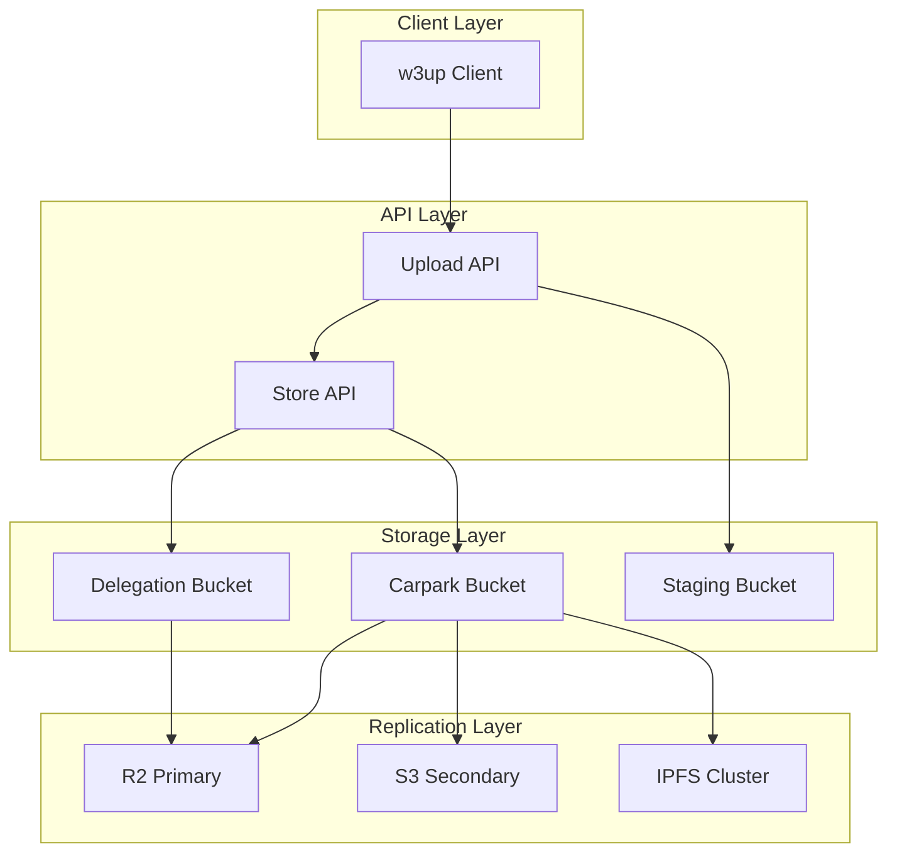
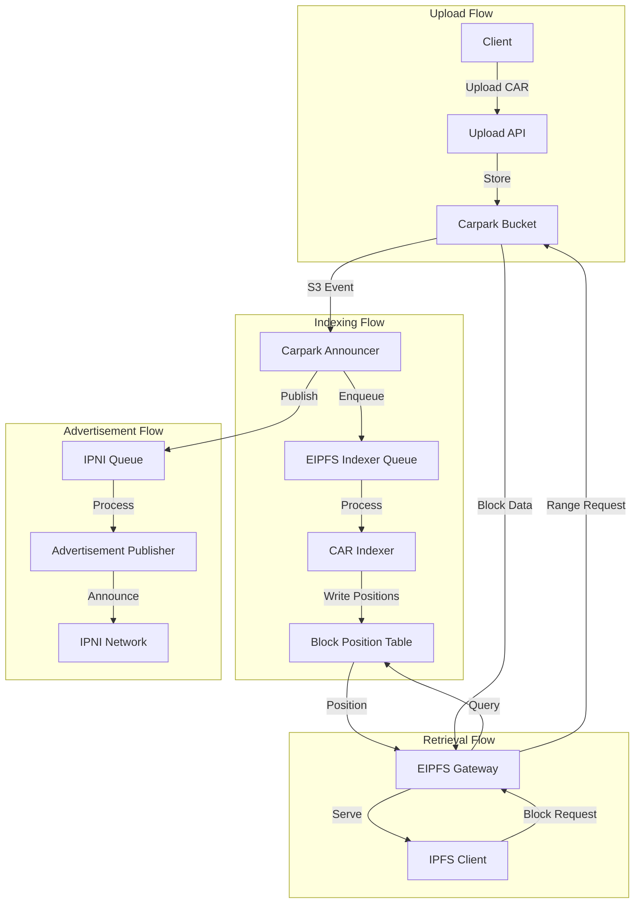
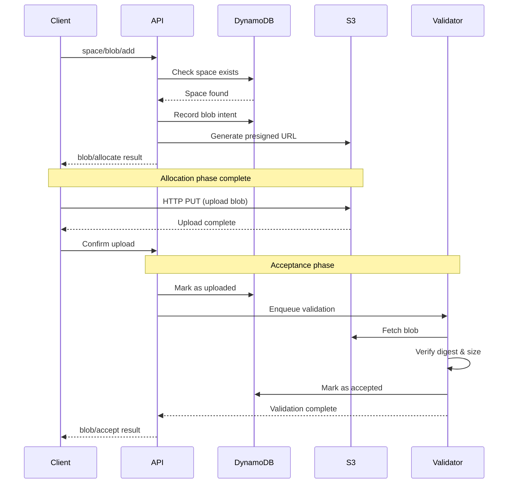

# Database and Storage Architecture

## Table of Contents

- [DynamoDB Table Architecture](#dynamodb-table-architecture)
  - [Overview](#overview)
  - [Table Design Philosophy](#table-design-philosophy)
  - [Space Table Schema](#space-table-schema)
  - [Upload Table Schema](#upload-table-schema)
  - [Store/Blob Table Schema](#storeblob-table-schema)
  - [Delegation Table Schema](#delegation-table-schema)
  - [Consumer Table Schema](#consumer-table-schema)
  - [Allocation Table Schema](#allocation-table-schema)
  - [EIPFS Block Position Table](#eipfs-block-position-table)
- [Index Design and Query Patterns](#index-design-and-query-patterns)
- [S3/R2 Storage Structure](#s3r2-storage-structure)
- [IPFS Integration](#ipfs-integration)
- [Data Consistency and Replication](#data-consistency-and-replication)

---

## DynamoDB Table Architecture

### Overview

The Storacha w3up infrastructure uses Amazon DynamoDB as its primary database for managing metadata, relationships, and state across the distributed storage system. The architecture employs a **multi-table design** where different entity types are stored in separate tables, each optimized for specific access patterns.

**Key Design Principles:**

1. **Entity Separation**: Different entity types (Spaces, Uploads, Blobs, Delegations) are stored in separate tables
2. **Access Pattern Optimization**: Table schemas are designed around specific query patterns
3. **Scalability**: Partition keys are chosen to distribute load evenly
4. **Consistency**: Strong consistency for critical operations, eventual consistency where acceptable
5. **Cost Efficiency**: Minimize read/write units through efficient indexing

### Table Design Philosophy

The w3up infrastructure follows these DynamoDB design patterns:

```typescript
// Core design pattern: Entity-specific tables with composite keys
interface TableDesign {
  tableName: string
  partitionKey: {
    name: string
    type: 'String' | 'Number' | 'Binary'
  }
  sortKey?: {
    name: string
    type: 'String' | 'Number' | 'Binary'
  }
  globalSecondaryIndexes?: GSI[]
  localSecondaryIndexes?: LSI[]
  billingMode: 'PAY_PER_REQUEST' | 'PROVISIONED'
  streamEnabled?: boolean
}
```

**Why Multi-Table Design?**

- **Clear boundaries**: Each table has a well-defined purpose
- **Independent scaling**: Tables can scale independently based on workload
- **Simpler queries**: No need for complex filter expressions
- **Better security**: Fine-grained IAM permissions per table
- **Easier maintenance**: Schema changes affect only one entity type

---

### Space Table Schema

The **Space Table** stores metadata about user-owned namespaces (spaces) where content is organized.

#### Table Definition

```typescript
interface SpaceTable {
  // Primary Key
  space: string           // PK: Space DID (did:key:...)

  // Attributes
  account: string         // Account DID that owns this space
  createdAt: number       // Unix timestamp (milliseconds)
  updatedAt: number       // Unix timestamp (milliseconds)

  // Provisioning
  provider: string        // Provider DID
  customer: string        // Customer/billing entity

  // Metadata
  name?: string           // Human-readable name
  metadata?: object       // Additional metadata

  // Recovery
  recoveryEmail?: string  // Email for account recovery
}
```

#### Primary Key

- **Partition Key**: `space` (String)
  - The space DID uniquely identifies each space
  - Example: `did:key:z6MkqG...`
  - Provides even distribution as DIDs are cryptographically random

#### Global Secondary Indexes

**GSI 1: Account Lookup**
```typescript
{
  indexName: 'AccountIndex',
  partitionKey: 'account',     // Account DID
  sortKey: 'createdAt',        // Creation time
  projection: 'ALL'            // Include all attributes
}
```

**Purpose**: Query all spaces owned by a specific account
```javascript
// Example query: Get all spaces for an account
const params = {
  TableName: 'space-table',
  IndexName: 'AccountIndex',
  KeyConditionExpression: 'account = :account',
  ExpressionAttributeValues: {
    ':account': 'did:mailto:example.com:alice'
  },
  ScanIndexForward: false  // Most recent first
}
```

**GSI 2: Provider Lookup**
```typescript
{
  indexName: 'ProviderIndex',
  partitionKey: 'provider',    // Provider DID
  sortKey: 'createdAt',
  projection: 'KEYS_ONLY'      // Only keys for counting
}
```

**Purpose**: Monitor provider workload and capacity

#### Access Patterns

1. **Get space by DID**
   ```javascript
   await ddb.get({
     TableName: 'space-table',
     Key: { space: 'did:key:z6Mkq...' }
   })
   ```

2. **List spaces for account**
   ```javascript
   await ddb.query({
     TableName: 'space-table',
     IndexName: 'AccountIndex',
     KeyConditionExpression: 'account = :account',
     ExpressionAttributeValues: {
       ':account': accountDID
     }
   })
   ```

3. **Create new space**
   ```javascript
   await ddb.put({
     TableName: 'space-table',
     Item: {
       space: spaceDID,
       account: accountDID,
       provider: providerDID,
       createdAt: Date.now(),
       updatedAt: Date.now()
     },
     ConditionExpression: 'attribute_not_exists(space)'  // Prevent overwrites
   })
   ```

---

### Upload Table Schema

The **Upload Table** tracks user uploads and their associated metadata, linking uploaded content to spaces.

#### Table Definition

```typescript
interface UploadTable {
  // Primary Key
  space: string           // PK: Space DID
  root: string            // SK: Root CID of the upload

  // Shards
  shards: string[]        // Array of shard CIDs (CAR files)

  // Timing
  insertedAt: number      // Upload timestamp
  updatedAt: number       // Last modification

  // User context
  issuer: string          // DID of the agent who invoked upload
  invocation: string      // CID of the UCAN invocation

  // Status
  status: 'pending' | 'done' | 'failed'

  // Metadata
  name?: string           // Original filename
  size?: number           // Total size in bytes
}
```

#### Primary Key

- **Partition Key**: `space` (String)
  - Groups all uploads for a space together
  - Enables efficient queries for "all uploads in this space"

- **Sort Key**: `root` (String)
  - The root CID of the uploaded content
  - Ensures uniqueness within the space
  - Enables range queries and pagination

**Key Design Consideration**: Using `space` as the partition key means all uploads for a space are stored together. This is efficient for common queries but requires monitoring for hot partitions if a single space has extremely high upload volume.

#### Global Secondary Indexes

**GSI 1: Issuer Lookup**
```typescript
{
  indexName: 'IssuerIndex',
  partitionKey: 'issuer',      // Agent DID
  sortKey: 'insertedAt',       // Upload time
  projection: 'ALL'
}
```

**Purpose**: Track all uploads by a specific agent across all spaces
```javascript
// Example: Get recent uploads by an agent
const params = {
  TableName: 'upload-table',
  IndexName: 'IssuerIndex',
  KeyConditionExpression: 'issuer = :issuer AND insertedAt > :since',
  ExpressionAttributeValues: {
    ':issuer': 'did:key:z6Mkq...',
    ':since': Date.now() - (24 * 60 * 60 * 1000)  // Last 24 hours
  }
}
```

**GSI 2: Root CID Lookup**
```typescript
{
  indexName: 'RootIndex',
  partitionKey: 'root',        // Root CID
  sortKey: 'insertedAt',
  projection: 'KEYS_ONLY'      // For deduplication checks
}
```

**Purpose**: Check if content already exists across all spaces (deduplication)

#### Access Patterns

1. **Record new upload**
   ```javascript
   await ddb.put({
     TableName: 'upload-table',
     Item: {
       space: spaceDID,
       root: rootCID.toString(),
       shards: shards.map(s => s.toString()),
       insertedAt: Date.now(),
       updatedAt: Date.now(),
       issuer: agentDID,
       invocation: invocationCID.toString(),
       status: 'pending'
     }
   })
   ```

2. **List uploads for space**
   ```javascript
   // Paginated query with limit
   await ddb.query({
     TableName: 'upload-table',
     KeyConditionExpression: 'space = :space',
     ExpressionAttributeValues: {
       ':space': spaceDID
     },
     Limit: 100,
     ScanIndexForward: false,  // Newest first
     ExclusiveStartKey: lastEvaluatedKey  // For pagination
   })
   ```

3. **Get specific upload**
   ```javascript
   await ddb.get({
     TableName: 'upload-table',
     Key: {
       space: spaceDID,
       root: rootCID.toString()
     }
   })
   ```

4. **Update upload status**
   ```javascript
   await ddb.update({
     TableName: 'upload-table',
     Key: { space: spaceDID, root: rootCID.toString() },
     UpdateExpression: 'SET #status = :status, updatedAt = :now',
     ExpressionAttributeNames: {
       '#status': 'status'
     },
     ExpressionAttributeValues: {
       ':status': 'done',
       ':now': Date.now()
     }
   })
   ```

5. **Remove upload**
   ```javascript
   await ddb.delete({
     TableName: 'upload-table',
     Key: {
       space: spaceDID,
       root: rootCID.toString()
     }
   })
   ```

---

### Store/Blob Table Schema

The **Store Table** (also called Blob Table) tracks stored blobs and their allocation status.

#### Table Definition

```typescript
interface StoreTable {
  // Primary Key
  space: string           // PK: Space DID
  link: string            // SK: Blob multihash (base58btc)

  // Blob metadata
  size: number            // Size in bytes
  origin?: string         // Original CAR CID if applicable

  // Allocation
  allocated: boolean      // Has space been allocated?
  allocatedAt?: number    // When allocation occurred

  // Acceptance
  accepted: boolean       // Has blob been accepted by provider?
  acceptedAt?: number     // When acceptance occurred

  // Timing
  insertedAt: number      // Record creation time
  updatedAt: number       // Last modification

  // User context
  issuer: string          // Agent who stored the blob
  invocation: string      // UCAN invocation CID
}
```

#### Primary Key

- **Partition Key**: `space` (String)
  - All blobs for a space are grouped together

- **Sort Key**: `link` (String)
  - The blob's multihash in base58btc encoding
  - Example: `bagcqcera...`
  - Ensures uniqueness within the space

#### Global Secondary Indexes

**GSI 1: Link Lookup (Cross-Space Deduplication)**
```typescript
{
  indexName: 'LinkIndex',
  partitionKey: 'link',        // Blob multihash
  sortKey: 'insertedAt',
  projection: 'KEYS_ONLY'
}
```

**Purpose**: Find all spaces that store the same blob
```javascript
// Check if blob exists anywhere
const result = await ddb.query({
  TableName: 'store-table',
  IndexName: 'LinkIndex',
  KeyConditionExpression: 'link = :link',
  ExpressionAttributeValues: {
    ':link': blobMultihash.toString()
  },
  Limit: 1
})

const blobExists = result.Items.length > 0
```

**GSI 2: Allocation Status**
```typescript
{
  indexName: 'AllocationIndex',
  partitionKey: 'allocated',   // Boolean: true/false
  sortKey: 'allocatedAt',
  projection: 'ALL'
}
```

**Purpose**: Monitor allocation pipeline and find pending allocations

#### Access Patterns

1. **Add blob to store**
   ```javascript
   await ddb.put({
     TableName: 'store-table',
     Item: {
       space: spaceDID,
       link: blobMultihash.toString(),
       size: blobSize,
       allocated: false,
       accepted: false,
       insertedAt: Date.now(),
       updatedAt: Date.now(),
       issuer: agentDID,
       invocation: invocationCID.toString()
     },
     ConditionExpression: 'attribute_not_exists(link)'
   })
   ```

2. **Mark blob as allocated**
   ```javascript
   await ddb.update({
     TableName: 'store-table',
     Key: { space: spaceDID, link: blobMultihash.toString() },
     UpdateExpression:
       'SET allocated = :true, allocatedAt = :now, updatedAt = :now',
     ExpressionAttributeValues: {
       ':true': true,
       ':now': Date.now()
     }
   })
   ```

3. **Mark blob as accepted**
   ```javascript
   await ddb.update({
     TableName: 'store-table',
     Key: { space: spaceDID, link: blobMultihash.toString() },
     UpdateExpression:
       'SET accepted = :true, acceptedAt = :now, updatedAt = :now',
     ExpressionAttributeValues: {
       ':true': true,
       ':now': Date.now()
     }
   })
   ```

4. **List blobs in space**
   ```javascript
   await ddb.query({
     TableName: 'store-table',
     KeyConditionExpression: 'space = :space',
     ExpressionAttributeValues: {
       ':space': spaceDID
     },
     ScanIndexForward: false
   })
   ```

5. **Remove blob from store**
   ```javascript
   await ddb.delete({
     TableName: 'store-table',
     Key: {
       space: spaceDID,
       link: blobMultihash.toString()
     }
   })
   ```

---

### Delegation Table Schema

The **Delegation Table** stores UCAN delegation proofs and their metadata.

#### Table Definition

```typescript
interface DelegationTable {
  // Primary Key
  link: string            // PK: Delegation CID (multihash)

  // Delegation content
  bytes: Buffer           // Raw delegation bytes (stored as Binary)

  // Parsed metadata (for querying)
  issuer: string          // Issuer DID (iss claim)
  audience: string        // Audience DID (aud claim)

  // Capabilities
  capabilities: Array<{
    can: string           // Capability ability
    with: string          // Resource URI
  }>

  // Expiration
  expiration: number      // Unix timestamp (exp claim)

  // Chain
  proofs: string[]        // Array of proof CIDs (prf claim)

  // Timing
  insertedAt: number      // When delegation was stored
  updatedAt: number

  // Origin
  source?: string         // Where delegation came from
}
```

#### Primary Key

- **Partition Key**: `link` (String)
  - The delegation's CID (multihash)
  - Ensures uniqueness and content-addressing
  - Example: `bafyreiba...`

**No Sort Key**: Each delegation is uniquely identified by its CID

#### Global Secondary Indexes

**GSI 1: Audience Lookup**
```typescript
{
  indexName: 'AudienceIndex',
  partitionKey: 'audience',    // Audience DID
  sortKey: 'expiration',       // Expiration time
  projection: 'ALL'
}
```

**Purpose**: Find all delegations for a specific audience (agent)
```javascript
// Get valid delegations for an agent
await ddb.query({
  TableName: 'delegation-table',
  IndexName: 'AudienceIndex',
  KeyConditionExpression: 'audience = :aud AND expiration > :now',
  ExpressionAttributeValues: {
    ':aud': agentDID,
    ':now': Math.floor(Date.now() / 1000)
  }
})
```

**GSI 2: Issuer Lookup**
```typescript
{
  indexName: 'IssuerIndex',
  partitionKey: 'issuer',      // Issuer DID
  sortKey: 'insertedAt',       // Creation time
  projection: 'KEYS_ONLY'
}
```

**Purpose**: Track delegations issued by a specific DID

**GSI 3: Expiration Cleanup**
```typescript
{
  indexName: 'ExpirationIndex',
  partitionKey: 'expiration',  // Expiration timestamp
  sortKey: 'link',
  projection: 'KEYS_ONLY'
}
```

**Purpose**: Identify and clean up expired delegations

#### Access Patterns

1. **Store delegation**
   ```javascript
   await ddb.put({
     TableName: 'delegation-table',
     Item: {
       link: delegationCID.toString(),
       bytes: delegationBytes,
       issuer: delegation.issuer,
       audience: delegation.audience,
       capabilities: delegation.capabilities,
       expiration: delegation.expiration,
       proofs: delegation.proofs,
       insertedAt: Date.now(),
       updatedAt: Date.now()
     },
     ConditionExpression: 'attribute_not_exists(link)'
   })
   ```

2. **Get delegation by CID**
   ```javascript
   const result = await ddb.get({
     TableName: 'delegation-table',
     Key: { link: delegationCID.toString() }
   })

   // Reconstruct delegation from bytes
   const delegation = Delegation.decode(result.Item.bytes)
   ```

3. **Find delegations for audience**
   ```javascript
   await ddb.query({
     TableName: 'delegation-table',
     IndexName: 'AudienceIndex',
     KeyConditionExpression: 'audience = :aud AND expiration > :now',
     ExpressionAttributeValues: {
       ':aud': agentDID,
       ':now': Math.floor(Date.now() / 1000)
     }
   })
   ```

4. **Clean up expired delegations**
   ```javascript
   // Batch delete expired delegations
   const expiredTime = Math.floor(Date.now() / 1000)

   const expired = await ddb.query({
     TableName: 'delegation-table',
     IndexName: 'ExpirationIndex',
     KeyConditionExpression: 'expiration < :now',
     ExpressionAttributeValues: { ':now': expiredTime },
     ProjectionExpression: 'link'
   })

   // Batch delete in groups of 25 (DynamoDB limit)
   for (const batch of chunk(expired.Items, 25)) {
     await ddb.batchWrite({
       RequestItems: {
         'delegation-table': batch.map(item => ({
           DeleteRequest: { Key: { link: item.link } }
         }))
       }
     })
   }
   ```

---

### Consumer Table Schema

The **Consumer Table** tracks consumer relationships and subscription metadata.

#### Table Definition

```typescript
interface ConsumerTable {
  // Primary Key
  consumer: string        // PK: Consumer DID
  provider: string        // SK: Provider DID

  // Subscription
  subscriptionId: string  // External subscription identifier
  subscriptionPlan: string // Plan type (free, pro, enterprise)

  // Status
  status: 'active' | 'suspended' | 'cancelled'

  // Timing
  createdAt: number
  updatedAt: number
  validUntil?: number     // Subscription expiry

  // Limits
  limits: {
    storage: number       // Bytes allowed
    uploads: number       // Max uploads per month
    bandwidth: number     // Bytes per month
  }

  // Usage (cached values)
  usage: {
    storage: number       // Current storage used
    uploads: number       // Uploads this month
    bandwidth: number     // Bandwidth this month
  }

  // Billing
  billingEmail?: string
  billingCustomerId?: string
}
```

#### Primary Key

- **Partition Key**: `consumer` (String)
  - Consumer DID (usually an account DID)

- **Sort Key**: `provider` (String)
  - Provider DID
  - Allows one consumer to have relationships with multiple providers

#### Global Secondary Indexes

**GSI 1: Provider Lookup**
```typescript
{
  indexName: 'ProviderIndex',
  partitionKey: 'provider',    // Provider DID
  sortKey: 'createdAt',
  projection: 'ALL'
}
```

**Purpose**: List all consumers for a provider

**GSI 2: Subscription Lookup**
```typescript
{
  indexName: 'SubscriptionIndex',
  partitionKey: 'subscriptionId',
  projection: 'ALL'
}
```

**Purpose**: Find consumer by external subscription ID (e.g., Stripe)

#### Access Patterns

1. **Create consumer relationship**
   ```javascript
   await ddb.put({
     TableName: 'consumer-table',
     Item: {
       consumer: consumerDID,
       provider: providerDID,
       subscriptionId: stripeSubscriptionId,
       subscriptionPlan: 'pro',
       status: 'active',
       createdAt: Date.now(),
       updatedAt: Date.now(),
       limits: {
         storage: 100 * 1024 * 1024 * 1024,  // 100 GB
         uploads: 10000,
         bandwidth: 1024 * 1024 * 1024 * 1024  // 1 TB
       },
       usage: {
         storage: 0,
         uploads: 0,
         bandwidth: 0
       }
     }
   })
   ```

2. **Get consumer info**
   ```javascript
   await ddb.get({
     TableName: 'consumer-table',
     Key: {
       consumer: consumerDID,
       provider: providerDID
     }
   })
   ```

3. **Update usage metrics**
   ```javascript
   await ddb.update({
     TableName: 'consumer-table',
     Key: { consumer: consumerDID, provider: providerDID },
     UpdateExpression:
       'ADD usage.storage :storageInc, usage.uploads :uploadInc ' +
       'SET updatedAt = :now',
     ExpressionAttributeValues: {
       ':storageInc': additionalBytes,
       ':uploadInc': 1,
       ':now': Date.now()
     }
   })
   ```

4. **Check if usage exceeds limits**
   ```javascript
   const consumer = await ddb.get({
     TableName: 'consumer-table',
     Key: { consumer: consumerDID, provider: providerDID }
   })

   if (consumer.Item.usage.storage >= consumer.Item.limits.storage) {
     throw new Error('Storage limit exceeded')
   }
   ```

---

### Allocation Table Schema

The **Allocation Table** tracks blob storage allocations and their HTTP upload endpoints.

#### Table Definition

```typescript
interface AllocationTable {
  // Primary Key
  space: string           // PK: Space DID
  blob: string            // SK: Blob multihash

  // Allocation
  allocated: boolean      // Allocation confirmed
  allocatedAt: number     // Allocation timestamp

  // Upload endpoint
  url: string             // Presigned URL for HTTP PUT
  headers: Record<string, string>  // Required headers
  expiresAt: number       // URL expiration time

  // Status
  status: 'pending' | 'uploaded' | 'accepted' | 'failed'

  // Blob metadata
  size: number            // Expected blob size

  // Tracking
  insertedAt: number
  updatedAt: number

  // Context
  invocation: string      // UCAN invocation CID
  issuer: string          // Agent DID
}
```

#### Primary Key

- **Partition Key**: `space` (String)
- **Sort Key**: `blob` (String) - Blob multihash

#### Global Secondary Indexes

**GSI 1: Status Lookup**
```typescript
{
  indexName: 'StatusIndex',
  partitionKey: 'status',
  sortKey: 'insertedAt',
  projection: 'ALL'
}
```

**Purpose**: Monitor allocation pipeline and find stuck allocations

**GSI 2: Expiration Cleanup**
```typescript
{
  indexName: 'ExpirationIndex',
  partitionKey: 'expiresAt',
  sortKey: 'space',
  projection: 'KEYS_ONLY'
}
```

**Purpose**: Clean up expired allocations

#### Access Patterns

1. **Create allocation**
   ```javascript
   const presignedUrl = await generatePresignedPutUrl(blobKey, {
     expiresIn: 3600,  // 1 hour
     contentLength: blobSize
   })

   await ddb.put({
     TableName: 'allocation-table',
     Item: {
       space: spaceDID,
       blob: blobMultihash.toString(),
       allocated: true,
       allocatedAt: Date.now(),
       url: presignedUrl.url,
       headers: presignedUrl.headers,
       expiresAt: Date.now() + 3600000,
       status: 'pending',
       size: blobSize,
       insertedAt: Date.now(),
       updatedAt: Date.now(),
       invocation: invocationCID.toString(),
       issuer: agentDID
     }
   })
   ```

2. **Get allocation**
   ```javascript
   const allocation = await ddb.get({
     TableName: 'allocation-table',
     Key: {
       space: spaceDID,
       blob: blobMultihash.toString()
     }
   })

   if (allocation.Item.expiresAt < Date.now()) {
     throw new Error('Allocation expired')
   }

   return {
     url: allocation.Item.url,
     headers: allocation.Item.headers
   }
   ```

3. **Mark allocation as uploaded**
   ```javascript
   await ddb.update({
     TableName: 'allocation-table',
     Key: { space: spaceDID, blob: blobMultihash.toString() },
     UpdateExpression: 'SET #status = :uploaded, updatedAt = :now',
     ExpressionAttributeNames: { '#status': 'status' },
     ExpressionAttributeValues: {
       ':uploaded': 'uploaded',
       ':now': Date.now()
     }
   })
   ```

4. **Find pending allocations**
   ```javascript
   await ddb.query({
     TableName: 'allocation-table',
     IndexName: 'StatusIndex',
     KeyConditionExpression: '#status = :pending',
     ExpressionAttributeNames: { '#status': 'status' },
     ExpressionAttributeValues: { ':pending': 'pending' }
   })
   ```

---

### EIPFS Block Position Table

The **EIPFS (Elastic IPFS) Block Position Table** stores block locations within indexed CAR files for efficient retrieval.

#### Table Definition

```typescript
interface EIPFSBlockPositionTable {
  // Primary Key
  multihash: string       // PK: Block multihash (base58btc)
  carCID: string          // SK: CAR file CID

  // Position
  offset: number          // Byte offset in CAR file
  length: number          // Block length in bytes

  // Block metadata
  codec: number           // Multicodec code (e.g., 0x70 for dag-pb)

  // CAR metadata
  carSize: number         // Total CAR file size
  carBucket: string       // S3/R2 bucket name
  carKey: string          // S3/R2 object key

  // Timing
  indexedAt: number       // When block was indexed
}
```

#### Primary Key

- **Partition Key**: `multihash` (String)
  - The block's multihash digest
  - Allows looking up which CAR files contain a specific block

- **Sort Key**: `carCID` (String)
  - The CAR file containing the block
  - One block can appear in multiple CAR files

#### Access Patterns

1. **Index CAR file blocks**
   ```javascript
   // Parse CAR file and index all blocks
   const carReader = await CarReader.fromBytes(carBytes)
   const carCID = await carReader.getRoots()[0]

   for await (const block of carReader.blocks()) {
     await ddb.put({
       TableName: 'eipfs-block-position',
       Item: {
         multihash: block.cid.multihash.toString('base58btc'),
         carCID: carCID.toString(),
         offset: block.blockPosition,
         length: block.blockLength,
         codec: block.cid.code,
         carSize: carBytes.length,
         carBucket: 'carpark-prod-0',
         carKey: `${carCID.toString()}.car`,
         indexedAt: Date.now()
       }
     })
   }
   ```

2. **Find block locations**
   ```javascript
   // Find all CAR files containing a block
   const locations = await ddb.query({
     TableName: 'eipfs-block-position',
     KeyConditionExpression: 'multihash = :hash',
     ExpressionAttributeValues: {
       ':hash': blockMultihash.toString('base58btc')
     }
   })

   // Choose best location (e.g., smallest CAR for efficiency)
   const bestLocation = locations.Items.sort((a, b) =>
     a.carSize - b.carSize
   )[0]

   // Fetch block via range request
   const block = await s3.getObject({
     Bucket: bestLocation.carBucket,
     Key: bestLocation.carKey,
     Range: `bytes=${bestLocation.offset}-${bestLocation.offset + bestLocation.length - 1}`
   })
   ```

3. **Delete CAR file index entries**
   ```javascript
   // When removing a CAR, delete all its block positions
   const blocks = await ddb.query({
     TableName: 'eipfs-block-position',
     IndexName: 'CarIndex',  // Requires additional GSI
     KeyConditionExpression: 'carCID = :car',
     ExpressionAttributeValues: { ':car': carCID.toString() }
   })

   for (const batch of chunk(blocks.Items, 25)) {
     await ddb.batchWrite({
       RequestItems: {
         'eipfs-block-position': batch.map(item => ({
           DeleteRequest: {
             Key: {
               multihash: item.multihash,
               carCID: item.carCID
             }
           }
         }))
       }
     })
   }
   ```

---

## Index Design and Query Patterns

### Global Secondary Index (GSI) Best Practices

#### 1. Projection Type Selection

```javascript
// KEYS_ONLY: Only primary key attributes
// Use for: Existence checks, counting, deduplication
{
  indexName: 'LinkIndex',
  projection: 'KEYS_ONLY'  // Minimal cost
}

// INCLUDE: Specific attributes
// Use for: Queries needing only subset of attributes
{
  indexName: 'StatusIndex',
  projection: {
    ProjectionType: 'INCLUDE',
    NonKeyAttributes: ['status', 'updatedAt', 'size']
  }
}

// ALL: All attributes
// Use for: Queries needing full items
{
  indexName: 'AudienceIndex',
  projection: 'ALL'  // Highest cost but most flexible
}
```

#### 2. Sparse Index Pattern

```javascript
// Only index items with specific attribute
// Saves on index storage and cost

// Example: Only index pending allocations
await ddb.put({
  TableName: 'allocation-table',
  Item: {
    space: spaceDID,
    blob: blobHash,
    status: 'pending',
    // Only items with pendingSince attribute appear in PendingIndex
    pendingSince: Date.now()  // Sparse index key
  }
})

// GSI definition
{
  indexName: 'PendingIndex',
  partitionKey: 'pendingSince',  // Only exists for pending items
  projection: 'ALL'
}
```

#### 3. Composite Sort Key Pattern

```javascript
// Create hierarchical sort keys for complex queries
const compositeKey = [
  status,           // 'active'
  priority,         // '1'
  timestamp         // '1699564800000'
].join('#')         // 'active#1#1699564800000'

await ddb.put({
  TableName: 'task-table',
  Item: {
    id: taskId,
    compositeKey: compositeKey,
    // ... other attributes
  }
})

// Query by prefix
await ddb.query({
  KeyConditionExpression: 'compositeKey BEGINS_WITH :prefix',
  ExpressionAttributeValues: {
    ':prefix': 'active#1#'  // All active priority-1 tasks
  }
})
```

### Common Query Patterns

#### Pattern 1: Pagination

```javascript
async function* paginateUploads(spaceDID, pageSize = 100) {
  let lastKey = null

  while (true) {
    const params = {
      TableName: 'upload-table',
      KeyConditionExpression: 'space = :space',
      ExpressionAttributeValues: { ':space': spaceDID },
      Limit: pageSize,
      ScanIndexForward: false,  // Newest first
      ExclusiveStartKey: lastKey
    }

    const result = await ddb.query(params)

    yield result.Items

    if (!result.LastEvaluatedKey) break
    lastKey = result.LastEvaluatedKey
  }
}

// Usage
for await (const page of paginateUploads('did:key:z6Mkq...')) {
  console.log(`Page of ${page.length} uploads`)
}
```

#### Pattern 2: Batch Operations

```javascript
// Batch get (up to 100 items, 16 MB)
async function batchGetDelegations(delegationCIDs) {
  const batches = chunk(delegationCIDs, 100)
  const results = []

  for (const batch of batches) {
    const response = await ddb.batchGet({
      RequestItems: {
        'delegation-table': {
          Keys: batch.map(cid => ({ link: cid.toString() }))
        }
      }
    })
    results.push(...response.Responses['delegation-table'])
  }

  return results
}

// Batch write (up to 25 items)
async function batchWriteAllocations(allocations) {
  const batches = chunk(allocations, 25)

  for (const batch of batches) {
    await ddb.batchWrite({
      RequestItems: {
        'allocation-table': batch.map(alloc => ({
          PutRequest: { Item: alloc }
        }))
      }
    })
  }
}
```

#### Pattern 3: Conditional Writes

```javascript
// Prevent duplicate uploads
await ddb.put({
  TableName: 'upload-table',
  Item: uploadItem,
  ConditionExpression: 'attribute_not_exists(root)'
})

// Optimistic locking with version number
await ddb.update({
  TableName: 'consumer-table',
  Key: { consumer: consumerDID, provider: providerDID },
  UpdateExpression:
    'SET usage.storage = :newStorage, version = :newVersion',
  ConditionExpression: 'version = :currentVersion',
  ExpressionAttributeValues: {
    ':newStorage': newStorageValue,
    ':currentVersion': currentVersion,
    ':newVersion': currentVersion + 1
  }
})

// Increment with limit check
await ddb.update({
  TableName: 'consumer-table',
  Key: { consumer: consumerDID, provider: providerDID },
  UpdateExpression: 'ADD usage.uploads :inc',
  ConditionExpression: 'usage.uploads < limits.uploads',
  ExpressionAttributeValues: { ':inc': 1 }
})
```

#### Pattern 4: Transactions

```javascript
// Atomic multi-table operation
await ddb.transactWrite({
  TransactItems: [
    {
      // Add upload record
      Put: {
        TableName: 'upload-table',
        Item: {
          space: spaceDID,
          root: rootCID,
          shards: shardCIDs,
          insertedAt: Date.now()
        },
        ConditionExpression: 'attribute_not_exists(root)'
      }
    },
    {
      // Add all shards to store
      Put: {
        TableName: 'store-table',
        Item: {
          space: spaceDID,
          link: shardCID,
          size: shardSize,
          insertedAt: Date.now()
        }
      }
    },
    {
      // Update consumer usage
      Update: {
        TableName: 'consumer-table',
        Key: { consumer: consumerDID, provider: providerDID },
        UpdateExpression: 'ADD usage.storage :size, usage.uploads :one',
        ConditionExpression:
          'usage.storage + :size <= limits.storage AND ' +
          'usage.uploads < limits.uploads',
        ExpressionAttributeValues: {
          ':size': totalSize,
          ':one': 1
        }
      }
    }
  ]
})
```

### Performance Optimization Strategies

#### 1. Hot Partition Prevention

```javascript
// AVOID: Single partition for all data
{
  partitionKey: 'global',  // ALL items in one partition!
  sortKey: 'timestamp'
}

// BETTER: Distribute across partitions
{
  partitionKey: 'spaceDID',  // Natural distribution
  sortKey: 'rootCID'
}

// BEST: Add shard key if needed
const shardId = hashCode(spaceDID) % 10  // 0-9
{
  partitionKey: `${spaceDID}#${shardId}`,
  sortKey: 'timestamp'
}
```

#### 2. Read/Write Capacity Planning

```javascript
// Calculate required capacity
const itemSize = 1024  // 1 KB average
const readsPerSecond = 100
const writesPerSecond = 50

// Read Capacity Units (RCU)
const stronglyConsistent RCU = Math.ceil(itemSize / 4096) * readsPerSecond
const eventuallyConsistentRCU = stronglyConsistentRCU / 2

// Write Capacity Units (WCU)
const requiredWCU = Math.ceil(itemSize / 1024) * writesPerSecond

console.log(`Provisioned: ${stronglyConsistentRCU} RCU, ${requiredWCU} WCU`)
console.log(`Pay-per-request: Better for variable workloads`)
```

#### 3. Caching Strategy

```javascript
// In-memory cache for hot items
class DynamoDBCache {
  constructor(ttl = 300000) {  // 5 min default
    this.cache = new Map()
    this.ttl = ttl
  }

  async get(tableName, key) {
    const cacheKey = `${tableName}:${JSON.stringify(key)}`
    const cached = this.cache.get(cacheKey)

    if (cached && Date.now() - cached.timestamp < this.ttl) {
      return cached.item
    }

    const result = await ddb.get({ TableName: tableName, Key: key })

    this.cache.set(cacheKey, {
      item: result.Item,
      timestamp: Date.now()
    })

    return result.Item
  }

  invalidate(tableName, key) {
    const cacheKey = `${tableName}:${JSON.stringify(key)}`
    this.cache.delete(cacheKey)
  }
}

const cache = new DynamoDBCache()
const space = await cache.get('space-table', { space: spaceDID })
```

---

## S3/R2 Storage Structure

### Overview

The Storacha infrastructure uses **S3-compatible object storage** for storing actual content (CAR files, delegations, and other binary data). The system supports both **Amazon S3** and **Cloudflare R2**, with R2 being preferred for its zero-egress fees.

### Storage Architecture



### Bucket Structure

#### 1. Carpark Bucket

The **Carpark bucket** is the primary storage location for CAR (Content Addressable aRchive) files.

**Bucket Naming Convention:**
```
carpark-{environment}-{shard}

Examples:
- carpark-prod-0
- carpark-staging-0
- carpark-dev-0
```

**Object Key Structure:**
```
{carCID}.car

Example:
bagbaiera5nkn2iam7g7cyu7ehuejuouqlev3qp2xhkjh5m2qrqh5gjblclsa.car
```

**Bucket Configuration:**

```typescript
interface CarparkBucketConfig {
  name: string                    // Bucket name
  region: string                  // AWS region or R2 account
  endpoint: string                // S3/R2 endpoint URL

  // Access control
  publicRead: boolean             // Allow public downloads
  corsRules: CORSRule[]          // CORS configuration

  // Lifecycle
  lifecycleRules: LifecycleRule[] // Auto-deletion policies

  // Versioning
  versioning: boolean             // Enable object versioning

  // Replication
  replicationConfig?: {
    role: string                  // IAM role for replication
    rules: ReplicationRule[]
  }

  // Events
  eventNotifications: {
    topic?: string                // SNS topic ARN
    queue?: string                // SQS queue ARN
    lambda?: string               // Lambda function ARN
  }
}
```

**Example CDK/SST Configuration:**

```typescript
// sst.config.ts - Carpark bucket setup
export function CarparkStack({ stack }: StackContext) {
  // Create R2 bucket for CAR files
  const carparkBucket = new Bucket(stack, 'carpark', {
    cdk: {
      bucket: {
        bucketName: `carpark-${stack.stage}-0`,

        // CORS for browser uploads
        cors: [{
          allowedOrigins: ['*'],
          allowedMethods: [
            s3.HttpMethods.GET,
            s3.HttpMethods.PUT,
            s3.HttpMethods.HEAD
          ],
          allowedHeaders: ['*'],
          maxAge: 3000
        }],

        // Lifecycle: Delete incomplete multipart uploads after 7 days
        lifecycleRules: [{
          id: 'cleanup-incomplete-uploads',
          abortIncompleteMultipartUploadAfter: Duration.days(7),
          enabled: true
        }],

        // Event notifications
        eventBridgeEnabled: true
      }
    }
  })

  // Lambda to announce new CARs
  const carparkAnnouncer = new Function(stack, 'carpark-announcer', {
    handler: 'packages/carpark/announcer.handler',
    environment: {
      EIPFS_INDEXER_QUEUE_URL: eipfsIndexerQueue.queueUrl,
      IPNI_PUBLISHER_QUEUE_URL: ipniPublisherQueue.queueUrl
    }
  })

  // Trigger announcer on CAR upload
  carparkBucket.addEventNotification(
    s3.EventType.OBJECT_CREATED,
    new s3n.LambdaDestination(carparkAnnouncer),
    { suffix: '.car' }
  )

  return { carparkBucket }
}
```

**CAR Storage Operations:**

```javascript
// 1. Generate presigned PUT URL for CAR upload
async function allocateCarStorage(carCID, carSize, expiresIn = 3600) {
  const s3Client = new S3Client({ region: 'auto', endpoint: R2_ENDPOINT })

  const command = new PutObjectCommand({
    Bucket: 'carpark-prod-0',
    Key: `${carCID.toString()}.car`,
    ContentType: 'application/vnd.ipld.car',
    ContentLength: carSize
  })

  const presignedUrl = await getSignedUrl(s3Client, command, {
    expiresIn  // Seconds
  })

  return {
    url: presignedUrl,
    headers: {
      'Content-Type': 'application/vnd.ipld.car',
      'Content-Length': carSize.toString()
    },
    expiresAt: Date.now() + (expiresIn * 1000)
  }
}

// 2. Upload CAR to allocated storage
async function uploadCar(allocation, carBytes) {
  const response = await fetch(allocation.url, {
    method: 'PUT',
    headers: allocation.headers,
    body: carBytes
  })

  if (!response.ok) {
    throw new Error(`Upload failed: ${response.status}`)
  }

  return {
    location: allocation.url.split('?')[0],  // Remove query params
    etag: response.headers.get('etag')
  }
}

// 3. Retrieve CAR file
async function retrieveCar(carCID) {
  const s3Client = new S3Client({ region: 'auto', endpoint: R2_ENDPOINT })

  const command = new GetObjectCommand({
    Bucket: 'carpark-prod-0',
    Key: `${carCID.toString()}.car`
  })

  const response = await s3Client.send(command)

  return response.Body  // ReadableStream
}

// 4. Range request for partial CAR retrieval
async function retrieveCarRange(carCID, offset, length) {
  const s3Client = new S3Client({ region: 'auto', endpoint: R2_ENDPOINT })

  const command = new GetObjectCommand({
    Bucket: 'carpark-prod-0',
    Key: `${carCID.toString()}.car`,
    Range: `bytes=${offset}-${offset + length - 1}`
  })

  const response = await s3Client.send(command)

  return response.Body
}

// 5. Delete CAR file
async function deleteCar(carCID) {
  const s3Client = new S3Client({ region: 'auto', endpoint: R2_ENDPOINT })

  const command = new DeleteObjectCommand({
    Bucket: 'carpark-prod-0',
    Key: `${carCID.toString()}.car`
  })

  await s3Client.send(command)
}
```

#### 2. Delegation Bucket

The **Delegation bucket** stores UCAN delegation proofs.

**Object Key Structure:**
```
{delegationCID}/{delegationCID}.ucan

Example:
bafyreiabc123.../bafyreiabc123....ucan
```

**Storage Operations:**

```javascript
// Store delegation proof
async function storeDelegation(delegation) {
  const delegationCID = await delegation.cid()
  const delegationBytes = delegation.archive()

  const s3Client = new S3Client({ region: 'auto', endpoint: R2_ENDPOINT })

  await s3Client.send(new PutObjectCommand({
    Bucket: 'delegation-prod-0',
    Key: `${delegationCID}/${delegationCID}.ucan`,
    Body: delegationBytes,
    ContentType: 'application/ucan+cbor',
    Metadata: {
      issuer: delegation.issuer.did(),
      audience: delegation.audience.did(),
      expiration: delegation.expiration.toString()
    }
  }))

  return delegationCID
}

// Retrieve delegation proof
async function retrieveDelegation(delegationCID) {
  const s3Client = new S3Client({ region: 'auto', endpoint: R2_ENDPOINT })

  const response = await s3Client.send(new GetObjectCommand({
    Bucket: 'delegation-prod-0',
    Key: `${delegationCID}/${delegationCID}.ucan`
  }))

  const bytes = await response.Body.transformToByteArray()

  return Delegation.extract(bytes)
}
```

#### 3. Staging Bucket

The **Staging bucket** is used for temporary storage during upload processing.

**Use Cases:**
- Multipart upload assembly
- CAR file generation from raw files
- Temporary storage before replication

**Lifecycle Policy:**
```typescript
{
  lifecycleRules: [
    {
      id: 'expire-staging-objects',
      expiration: Duration.days(1),  // Delete after 24 hours
      enabled: true
    },
    {
      id: 'cleanup-incomplete-uploads',
      abortIncompleteMultipartUploadAfter: Duration.hours(24),
      enabled: true
    }
  ]
}
```

### S3/R2 Best Practices

#### 1. Multipart Upload for Large CARs

```javascript
class MultipartCarUploader {
  constructor(bucket, key) {
    this.s3 = new S3Client({ region: 'auto', endpoint: R2_ENDPOINT })
    this.bucket = bucket
    this.key = key
    this.partSize = 5 * 1024 * 1024  // 5 MB minimum
    this.uploadId = null
    this.parts = []
  }

  async start() {
    const command = new CreateMultipartUploadCommand({
      Bucket: this.bucket,
      Key: this.key,
      ContentType: 'application/vnd.ipld.car'
    })

    const response = await this.s3.send(command)
    this.uploadId = response.UploadId
  }

  async uploadPart(partNumber, data) {
    const command = new UploadPartCommand({
      Bucket: this.bucket,
      Key: this.key,
      UploadId: this.uploadId,
      PartNumber: partNumber,
      Body: data
    })

    const response = await this.s3.send(command)

    this.parts.push({
      PartNumber: partNumber,
      ETag: response.ETag
    })
  }

  async complete() {
    // Sort parts by number
    this.parts.sort((a, b) => a.PartNumber - b.PartNumber)

    const command = new CompleteMultipartUploadCommand({
      Bucket: this.bucket,
      Key: this.key,
      UploadId: this.uploadId,
      MultipartUpload: { Parts: this.parts }
    })

    const response = await this.s3.send(command)
    return response.Location
  }

  async abort() {
    const command = new AbortMultipartUploadCommand({
      Bucket: this.bucket,
      Key: this.key,
      UploadId: this.uploadId
    })

    await this.s3.send(command)
  }

  async *uploadStream(stream) {
    await this.start()

    try {
      let partNumber = 1
      let buffer = []
      let bufferSize = 0

      for await (const chunk of stream) {
        buffer.push(chunk)
        bufferSize += chunk.length

        // Upload when part size reached
        if (bufferSize >= this.partSize) {
          const partData = Buffer.concat(buffer)
          await this.uploadPart(partNumber++, partData)
          buffer = []
          bufferSize = 0

          yield { partNumber: partNumber - 1, uploaded: true }
        }
      }

      // Upload remaining data
      if (bufferSize > 0) {
        const partData = Buffer.concat(buffer)
        await this.uploadPart(partNumber, partData)
        yield { partNumber, uploaded: true }
      }

      const location = await this.complete()
      yield { completed: true, location }

    } catch (error) {
      await this.abort()
      throw error
    }
  }
}

// Usage
const uploader = new MultipartCarUploader('carpark-prod-0', `${carCID}.car`)
for await (const progress of uploader.uploadStream(carStream)) {
  if (progress.completed) {
    console.log('Upload complete:', progress.location)
  } else {
    console.log('Part uploaded:', progress.partNumber)
  }
}
```

#### 2. Efficient Range Requests

```javascript
// Fetch only the header of a CAR file
async function getCarHeader(carCID) {
  // CAR headers are typically < 1KB
  const headerData = await retrieveCarRange(carCID, 0, 1024)

  const reader = await CarReader.fromBytes(headerData)
  return {
    version: reader.version,
    roots: reader.getRoots()
  }
}

// Stream blocks from CAR without loading entire file
async function* streamCarBlocks(carCID, blockPositions) {
  const s3Client = new S3Client({ region: 'auto', endpoint: R2_ENDPOINT })

  // Sort positions by offset for sequential access
  const sorted = blockPositions.sort((a, b) => a.offset - b.offset)

  for (const position of sorted) {
    const command = new GetObjectCommand({
      Bucket: 'carpark-prod-0',
      Key: `${carCID}.car`,
      Range: `bytes=${position.offset}-${position.offset + position.length - 1}`
    })

    const response = await s3Client.send(command)
    const blockData = await response.Body.transformToByteArray()

    yield {
      cid: position.cid,
      bytes: blockData
    }
  }
}
```

#### 3. Bucket Replication

```typescript
// Configure cross-region replication (S3 to R2)
interface ReplicationConfig {
  sourceR2Bucket: string
  destinationS3Bucket: string

  rules: Array<{
    id: string
    priority: number
    filter?: {
      prefix?: string
      tags?: Record<string, string>
    }
    destination: {
      bucket: string
      storageClass?: string
      replicationTime?: {
        status: 'Enabled'
        time: { minutes: number }
      }
    }
    status: 'Enabled' | 'Disabled'
  }>
}

// Lambda-based custom replication
class BucketReplicator {
  constructor(sourceBucket, destBuckets) {
    this.sourceBucket = sourceBucket
    this.destBuckets = destBuckets
    this.s3 = new S3Client()
  }

  async replicateObject(key) {
    // Get object from source
    const sourceObj = await this.s3.send(new GetObjectCommand({
      Bucket: this.sourceBucket,
      Key: key
    }))

    const bodyBytes = await sourceObj.Body.transformToByteArray()

    // Replicate to all destinations
    await Promise.all(this.destBuckets.map(async (destBucket) => {
      await this.s3.send(new PutObjectCommand({
        Bucket: destBucket,
        Key: key,
        Body: bodyBytes,
        ContentType: sourceObj.ContentType,
        Metadata: sourceObj.Metadata
      }))
    }))
  }

  // Handle S3 event notification
  async handleEvent(event) {
    for (const record of event.Records) {
      if (record.eventName.startsWith('ObjectCreated')) {
        await this.replicateObject(record.s3.object.key)
      }
    }
  }
}
```

#### 4. Cost Optimization

```javascript
// R2 vs S3 cost comparison
class StorageCostAnalyzer {
  constructor() {
    this.s3Costs = {
      storage: 0.023,        // $/GB/month
      putRequest: 0.005,     // Per 1000 PUT requests
      getRequest: 0.0004,    // Per 1000 GET requests
      egress: 0.09           // $/GB (first 10TB)
    }

    this.r2Costs = {
      storage: 0.015,        // $/GB/month
      putRequest: 4.50,      // Per million writes (Class A)
      getRequest: 0.36,      // Per million reads (Class A)
      egress: 0              // FREE!
    }
  }

  calculateMonthlyCost(metrics, provider = 's3') {
    const costs = provider === 's3' ? this.s3Costs : this.r2Costs

    const storageCost = (metrics.storageGB) * costs.storage
    const putCost = (metrics.putRequests / 1000) * costs.putRequest
    const getCost = (metrics.getRequests / 1000) * costs.getRequest
    const egressCost = (metrics.egressGB) * costs.egress

    return {
      storage: storageCost,
      operations: putCost + getCost,
      egress: egressCost,
      total: storageCost + putCost + getCost + egressCost
    }
  }

  compare(metrics) {
    const s3Cost = this.calculateMonthlyCost(metrics, 's3')
    const r2Cost = this.calculateMonthlyCost(metrics, 'r2')

    return {
      s3: s3Cost,
      r2: r2Cost,
      savings: s3Cost.total - r2Cost.total,
      savingsPercent: ((s3Cost.total - r2Cost.total) / s3Cost.total) * 100
    }
  }
}

// Example usage
const analyzer = new StorageCostAnalyzer()
const comparison = analyzer.compare({
  storageGB: 1000,       // 1 TB stored
  putRequests: 100000,   // 100K uploads
  getRequests: 1000000,  // 1M downloads
  egressGB: 500          // 500 GB egress
})

console.log('Monthly S3 cost:', comparison.s3.total)
console.log('Monthly R2 cost:', comparison.r2.total)
console.log('Savings with R2:', comparison.savings, `(${comparison.savingsPercent}%)`)
```

---

## IPFS Integration

### Elastic IPFS Architecture

The Storacha infrastructure integrates with **Elastic IPFS (EIPFS)**, a scalable IPFS implementation that uses DynamoDB and S3/R2 as backends.



### CAR Indexing

When a CAR file is uploaded to the Carpark bucket, it triggers an indexing pipeline:

```javascript
// Carpark announcer Lambda
export async function handler(event) {
  for (const record of event.Records) {
    // S3 ObjectCreated event
    const bucket = record.s3.bucket.name
    const key = decodeURIComponent(record.s3.object.key.replace(/\+/g, ' '))

    // Extract CAR CID from key
    const carCID = CID.parse(key.replace('.car', ''))

    // Enqueue for indexing
    await sqs.sendMessage({
      QueueUrl: process.env.EIPFS_INDEXER_QUEUE_URL,
      MessageBody: JSON.stringify({
        bucket,
        key,
        carCID: carCID.toString(),
        size: record.s3.object.size
      })
    })

    // Enqueue for IPNI advertisement
    await sqs.sendMessage({
      QueueUrl: process.env.IPNI_PUBLISHER_QUEUE_URL,
      MessageBody: JSON.stringify({
        carCID: carCID.toString(),
        bucket,
        key
      })
    })

    console.log(`Announced CAR: ${carCID}`)
  }
}
```

**CAR Indexer Implementation:**

```javascript
// Index all blocks in a CAR file
class CarIndexer {
  constructor(ddb, s3) {
    this.ddb = ddb
    this.s3 = s3
  }

  async indexCar(bucket, key) {
    // Download CAR from S3/R2
    const response = await this.s3.getObject({ Bucket: bucket, Key: key })
    const carBytes = await response.Body.transformToByteArray()

    // Parse CAR
    const reader = await CarReader.fromBytes(carBytes)
    const carCID = (await reader.getRoots())[0]

    // Index each block
    const positions = []
    let offset = 0

    for await (const block of reader.blocks()) {
      const position = {
        multihash: block.cid.multihash.toString('base58btc'),
        carCID: carCID.toString(),
        offset: block.blockPosition,
        length: block.blockLength,
        codec: block.cid.code,
        carSize: carBytes.length,
        carBucket: bucket,
        carKey: key,
        indexedAt: Date.now()
      }

      positions.push(position)
      offset += block.blockLength
    }

    // Batch write to DynamoDB
    await this.batchWritePositions(positions)

    return {
      carCID: carCID.toString(),
      blockCount: positions.length,
      carSize: carBytes.length
    }
  }

  async batchWritePositions(positions) {
    // DynamoDB batch write limit is 25 items
    const batches = chunk(positions, 25)

    for (const batch of batches) {
      await this.ddb.batchWrite({
        RequestItems: {
          'eipfs-block-position': batch.map(pos => ({
            PutRequest: { Item: pos }
          }))
        }
      })
    }
  }
}

// Queue processor
export async function indexerHandler(event) {
  const indexer = new CarIndexer(dynamoDB, s3Client)

  for (const record of event.Records) {
    const message = JSON.parse(record.body)

    try {
      const result = await indexer.indexCar(message.bucket, message.key)
      console.log(`Indexed ${result.blockCount} blocks from ${result.carCID}`)

      // Delete message from queue
      await sqs.deleteMessage({
        QueueUrl: process.env.EIPFS_INDEXER_QUEUE_URL,
        ReceiptHandle: record.receiptHandle
      })
    } catch (error) {
      console.error(`Failed to index ${message.key}:`, error)
      // Message will return to queue for retry
    }
  }
}
```

### IPNI (InterPlanetary Network Indexer) Advertisement

IPNI advertisements announce content availability to the IPFS network:

```javascript
class IPNIAdvertiser {
  constructor(ipniEndpoint) {
    this.endpoint = ipniEndpoint
  }

  async publishAdvertisement(carCID, contextID, entries) {
    const ad = await this.createAdvertisement(carCID, contextID, entries)

    // Sign advertisement
    const signedAd = await this.signAdvertisement(ad)

    // Publish to IPNI
    const response = await fetch(`${this.endpoint}/ingest/announce`, {
      method: 'POST',
      headers: { 'Content-Type': 'application/json' },
      body: JSON.stringify(signedAd)
    })

    if (!response.ok) {
      throw new Error(`IPNI publish failed: ${response.status}`)
    }

    return signedAd.cid
  }

  async createAdvertisement(carCID, contextID, entries) {
    // Create multihash entries for advertisement
    const multihashes = entries.map(e => e.multihash)

    return {
      protocol: 'transport-ipfs-gateway-http',
      contextID,
      metadata: Buffer.from(JSON.stringify({
        carCID: carCID.toString()
      })),
      addresses: [
        '/dns4/w3s.link/https'
      ],
      entries: multihashes
    }
  }

  async signAdvertisement(ad) {
    // Sign with provider key
    const adBytes = encode(ad)
    const signature = await sign(adBytes, providerPrivateKey)

    return {
      ...ad,
      signature,
      provider: providerDID
    }
  }
}

// Publisher Lambda handler
export async function publisherHandler(event) {
  const advertiser = new IPNIAdvertiser(process.env.IPNI_ENDPOINT)

  for (const record of event.Records) {
    const message = JSON.parse(record.body)

    // Get all blocks in the CAR
    const blocks = await dynamoDB.query({
      TableName: 'eipfs-block-position',
      IndexName: 'CarIndex',
      KeyConditionExpression: 'carCID = :cid',
      ExpressionAttributeValues: { ':cid': message.carCID }
    })

    // Create context ID
    const contextID = await sha256(Buffer.from(message.carCID))

    // Publish advertisement
    const adCID = await advertiser.publishAdvertisement(
      message.carCID,
      contextID.toString('base58btc'),
      blocks.Items
    )

    console.log(`Published IPNI ad ${adCID} for ${message.carCID}`)
  }
}
```

### IPFS Gateway Implementation

```javascript
// EIPFS gateway for block retrieval
class EIPFSGateway {
  constructor(ddb, s3) {
    this.ddb = ddb
    this.s3 = s3
  }

  async getBlock(cid) {
    // Query block positions
    const positions = await this.ddb.query({
      TableName: 'eipfs-block-position',
      KeyConditionExpression: 'multihash = :hash',
      ExpressionAttributeValues: {
        ':hash': cid.multihash.toString('base58btc')
      },
      Limit: 1  // First location is enough
    })

    if (positions.Items.length === 0) {
      throw new Error(`Block not found: ${cid}`)
    }

    const position = positions.Items[0]

    // Fetch block via range request
    const response = await this.s3.getObject({
      Bucket: position.carBucket,
      Key: position.carKey,
      Range: `bytes=${position.offset}-${position.offset + position.length - 1}`
    })

    const blockData = await response.Body.transformToByteArray()

    return {
      cid,
      bytes: blockData
    }
  }

  async getDag(rootCID) {
    const blocks = new Map()
    const queue = [rootCID]

    while (queue.length > 0) {
      const cid = queue.shift()

      if (blocks.has(cid.toString())) continue

      const block = await this.getBlock(cid)
      blocks.set(cid.toString(), block)

      // Parse block and find links
      const decoded = decode(block.bytes)
      const links = getLinks(decoded)
      queue.push(...links.map(l => l.cid))
    }

    return blocks
  }
}

// HTTP gateway handler
export async function gatewayHandler(event) {
  const gateway = new EIPFSGateway(dynamoDB, s3Client)

  // Parse request path: /ipfs/{cid}
  const path = event.requestContext.http.path
  const cidString = path.replace('/ipfs/', '')

  try {
    const cid = CID.parse(cidString)
    const block = await gateway.getBlock(cid)

    return {
      statusCode: 200,
      headers: {
        'Content-Type': 'application/octet-stream',
        'Cache-Control': 'public, max-age=29030400, immutable'
      },
      body: block.bytes.toString('base64'),
      isBase64Encoded: true
    }
  } catch (error) {
    return {
      statusCode: 404,
      body: JSON.stringify({ error: error.message })
    }
  }
}
```

### IPFS Cluster Pinning Strategy

For content that needs high availability, the system uses IPFS Cluster:

```javascript
class IPFSClusterClient {
  constructor(clusterEndpoint, basicAuth) {
    this.endpoint = clusterEndpoint
    this.auth = basicAuth
  }

  async pin(cid, options = {}) {
    const response = await fetch(`${this.endpoint}/pins/${cid}`, {
      method: 'POST',
      headers: {
        'Authorization': `Basic ${this.auth}`,
        'Content-Type': 'application/json'
      },
      body: JSON.stringify({
        replication_factor_min: options.replicationMin || 3,
        replication_factor_max: options.replicationMax || 5,
        name: options.name,
        user_allocations: options.allocations  // Specific peers
      })
    })

    if (!response.ok) {
      throw new Error(`Pin failed: ${response.status}`)
    }

    return response.json()
  }

  async unpin(cid) {
    const response = await fetch(`${this.endpoint}/pins/${cid}`, {
      method: 'DELETE',
      headers: {
        'Authorization': `Basic ${this.auth}`
      }
    })

    if (!response.ok) {
      throw new Error(`Unpin failed: ${response.status}`)
    }
  }

  async pinStatus(cid) {
    const response = await fetch(`${this.endpoint}/pins/${cid}`, {
      headers: {
        'Authorization': `Basic ${this.auth}`
      }
    })

    if (!response.ok) {
      throw new Error(`Status check failed: ${response.status}`)
    }

    return response.json()
  }

  async recover(cid) {
    const response = await fetch(`${this.endpoint}/pins/${cid}/recover`, {
      method: 'POST',
      headers: {
        'Authorization': `Basic ${this.auth}`
      }
    })

    return response.json()
  }
}

// Pin important content to IPFS cluster
export async function pinToCluster(carCID, priority = 'normal') {
  const cluster = new IPFSClusterClient(
    process.env.IPFS_CLUSTER_ENDPOINT,
    process.env.IPFS_CLUSTER_AUTH
  )

  const replicationConfig = {
    high: { replicationMin: 5, replicationMax: 7 },
    normal: { replicationMin: 3, replicationMax: 5 },
    low: { replicationMin: 2, replicationMax: 3 }
  }

  const config = replicationConfig[priority]

  await cluster.pin(carCID, {
    name: `carpark/${carCID}`,
    ...config
  })

  console.log(`Pinned ${carCID} with ${priority} priority`)
}
```

---

## Data Consistency and Replication

### Consistency Model

The Storacha architecture employs different consistency guarantees for different operations:

```typescript
interface ConsistencyModel {
  // Strong consistency (read-your-writes)
  stronglyConsistent: {
    operations: [
      'space/provision',
      'upload/add',
      'store/add',
      'delegation/create'
    ]
    implementation: 'DynamoDB GetItem with ConsistentRead=true'
  }

  // Eventual consistency
  eventuallyConsistent: {
    operations: [
      'upload/list',
      'store/list',
      'delegation/list'
    ]
    implementation: 'DynamoDB Query with ConsistentRead=false'
    maxDelay: '1 second typical, 1-2 seconds worst case'
  }

  // Causal consistency
  causallyConsistent: {
    operations: [
      'blob/allocate -> blob/accept',
      'upload/add -> shard propagation'
    ]
    implementation: 'UCAN invocation chains + task receipts'
  }
}
```

### Multi-Stage Blob Allocation

The blob storage workflow ensures consistency through a multi-stage protocol:



**Implementation:**

```javascript
// Complete blob allocation workflow
class BlobAllocationWorkflow {
  constructor(ddb, s3, sqs) {
    this.ddb = ddb
    this.s3 = s3
    this.sqs = sqs
  }

  // Stage 1: Allocate
  async allocate(space, blob) {
    // Check space exists and has capacity
    const spaceRecord = await this.ddb.get({
      TableName: 'space-table',
      Key: { space }
    })

    if (!spaceRecord.Item) {
      throw new Error('Space not found')
    }

    // Check if blob already exists
    const existing = await this.ddb.get({
      TableName: 'store-table',
      Key: { space, link: blob.digest.toString() }
    })

    if (existing.Item?.accepted) {
      // Already have this blob
      return { allocated: false, exists: true }
    }

    // Generate presigned URL
    const blobKey = `blobs/${blob.digest.toString()}`
    const presignedUrl = await generatePresignedPutUrl(this.s3, {
      bucket: 'carpark-prod-0',
      key: blobKey,
      contentLength: blob.size,
      expiresIn: 3600
    })

    // Record allocation
    await this.ddb.transactWrite({
      TransactItems: [
        {
          Put: {
            TableName: 'store-table',
            Item: {
              space,
              link: blob.digest.toString(),
              size: blob.size,
              allocated: false,
              accepted: false,
              insertedAt: Date.now()
            },
            ConditionExpression: 'attribute_not_exists(link) OR accepted = :false',
            ExpressionAttributeValues: { ':false': false }
          }
        },
        {
          Put: {
            TableName: 'allocation-table',
            Item: {
              space,
              blob: blob.digest.toString(),
              url: presignedUrl.url,
              headers: presignedUrl.headers,
              expiresAt: Date.now() + 3600000,
              status: 'pending',
              insertedAt: Date.now()
            }
          }
        }
      ]
    })

    return {
      allocated: true,
      address: {
        url: presignedUrl.url,
        headers: presignedUrl.headers
      }
    }
  }

  // Stage 2: Accept (after upload)
  async accept(space, blob) {
    // Mark as uploaded
    await this.ddb.update({
      TableName: 'allocation-table',
      Key: { space, blob: blob.digest.toString() },
      UpdateExpression: 'SET #status = :uploaded',
      ExpressionAttributeNames: { '#status': 'status' },
      ExpressionAttributeValues: { ':uploaded': 'uploaded' }
    })

    // Enqueue validation
    await this.sqs.sendMessage({
      QueueUrl: process.env.BLOB_VALIDATOR_QUEUE_URL,
      MessageBody: JSON.stringify({
        space,
        blob: blob.digest.toString(),
        expectedSize: blob.size
      })
    })

    return { pending: true }
  }

  // Stage 3: Validate (async)
  async validate(space, blobDigest, expectedSize) {
    const blobKey = `blobs/${blobDigest}`

    // Fetch blob from S3
    const response = await this.s3.getObject({
      Bucket: 'carpark-prod-0',
      Key: blobKey
    })

    const blobBytes = await response.Body.transformToByteArray()

    // Verify size
    if (blobBytes.length !== expectedSize) {
      throw new Error(
        `Size mismatch: expected ${expectedSize}, got ${blobBytes.length}`
      )
    }

    // Verify digest
    const actualDigest = await sha256(blobBytes)
    const expectedDigest = Multihash.decode(Buffer.from(blobDigest, 'base58btc'))

    if (!actualDigest.equals(expectedDigest.digest)) {
      throw new Error('Digest mismatch')
    }

    // Mark as accepted atomically
    await this.ddb.transactWrite({
      TransactItems: [
        {
          Update: {
            TableName: 'store-table',
            Key: { space, link: blobDigest },
            UpdateExpression: 'SET accepted = :true, acceptedAt = :now',
            ExpressionAttributeValues: {
              ':true': true,
              ':now': Date.now()
            }
          }
        },
        {
          Update: {
            TableName: 'allocation-table',
            Key: { space, blob: blobDigest },
            UpdateExpression: 'SET #status = :accepted',
            ExpressionAttributeNames: { '#status': 'status' },
            ExpressionAttributeValues: { ':accepted': 'accepted' }
          }
        }
      ]
    })

    return { accepted: true }
  }
}
```

### Idempotency

All operations are designed to be idempotent:

```javascript
// Idempotent upload registration
async function registerUpload(space, root, shards) {
  try {
    await dynamoDB.put({
      TableName: 'upload-table',
      Item: {
        space,
        root: root.toString(),
        shards: shards.map(s => s.toString()),
        insertedAt: Date.now(),
        status: 'done'
      },
      ConditionExpression: 'attribute_not_exists(root)'
    })

    return { created: true }

  } catch (error) {
    if (error.name === 'ConditionalCheckFailedException') {
      // Upload already exists - this is OK (idempotent)
      return { created: false, exists: true }
    }
    throw error
  }
}

// Idempotent blob storage
async function storeBlob(space, blob) {
  // Use UPSERT pattern - update if exists, insert if not
  await dynamoDB.put({
    TableName: 'store-table',
    Item: {
      space,
      link: blob.digest.toString(),
      size: blob.size,
      insertedAt: Date.now(),
      // Don't overwrite acceptance status
      accepted: false
    }
  })

  // Then update to accepted if already validated
  await dynamoDB.update({
    TableName: 'store-table',
    Key: { space, link: blob.digest.toString() },
    UpdateExpression: 'SET accepted = if_not_exists(accepted, :false)',
    ExpressionAttributeValues: { ':false': false }
  })
}
```

### Replication Strategies

#### Cross-Region Replication

```javascript
class CrossRegionReplicator {
  constructor(sourceBucket, replicaBuckets) {
    this.sourceBucket = sourceBucket
    this.replicaBuckets = replicaBuckets
  }

  async replicate(key) {
    const s3 = new S3Client()

    // Get source object
    const source = await s3.send(new GetObjectCommand({
      Bucket: this.sourceBucket,
      Key: key
    }))

    const bodyBytes = await source.Body.transformToByteArray()

    // Replicate to all regions in parallel
    await Promise.all(this.replicaBuckets.map(async (replica) => {
      await s3.send(new PutObjectCommand({
        Bucket: replica.bucket,
        Key: key,
        Body: bodyBytes,
        ContentType: source.ContentType,
        Metadata: source.Metadata
      }))

      console.log(`Replicated ${key} to ${replica.region}`)
    }))
  }

  async verifyReplication(key) {
    const s3 = new S3Client()

    // Get source object metadata
    const source = await s3.send(new HeadObjectCommand({
      Bucket: this.sourceBucket,
      Key: key
    }))

    // Check all replicas
    const results = await Promise.allSettled(
      this.replicaBuckets.map(async (replica) => {
        const replicaObj = await s3.send(new HeadObjectCommand({
          Bucket: replica.bucket,
          Key: key
        }))

        return {
          region: replica.region,
          etag: replicaObj.ETag,
          matches: replicaObj.ETag === source.ETag
        }
      })
    )

    return results.map(r => r.status === 'fulfilled' ? r.value : { error: r.reason })
  }
}
```

#### IPFS Redundancy

```javascript
// Ensure content is available via multiple routes
class RedundancyManager {
  constructor(carparkBucket, ipfsCluster, filecoinDeals) {
    this.carpark = carparkBucket
    this.ipfs = ipfsCluster
    this.filecoin = filecoinDeals
  }

  async ensureRedundancy(carCID, level = 'standard') {
    const redundancyLevels = {
      minimal: {
        carparkReplicas: 1,
        ipfsClusterPins: 0,
        filecoinDeals: 0
      },
      standard: {
        carparkReplicas: 2,
        ipfsClusterPins: 3,
        filecoinDeals: 1
      },
      maximum: {
        carparkReplicas: 3,
        ipfsClusterPins: 5,
        filecoinDeals: 3
      }
    }

    const config = redundancyLevels[level]

    // Replicate in Carpark (S3/R2)
    if (config.carparkReplicas > 1) {
      await this.replicateInCarpark(carCID, config.carparkReplicas)
    }

    // Pin to IPFS Cluster
    if (config.ipfsClusterPins > 0) {
      await this.ipfs.pin(carCID, {
        replicationMin: config.ipfsClusterPins,
        replicationMax: config.ipfsClusterPins + 2
      })
    }

    // Create Filecoin deals
    if (config.filecoinDeals > 0) {
      await this.createFilecoinDeals(carCID, config.filecoinDeals)
    }

    return {
      carCID: carCID.toString(),
      redundancyLevel: level,
      targets: config
    }
  }

  async verifyRedundancy(carCID) {
    const [carparkStatus, ipfsStatus, filecoinStatus] = await Promise.all([
      this.checkCarparkAvailability(carCID),
      this.ipfs.pinStatus(carCID),
      this.filecoin.checkDeals(carCID)
    ])

    return {
      carCID: carCID.toString(),
      carparkReplicas: carparkStatus.replicas,
      ipfsClusterPins: ipfsStatus.peer_map ? Object.keys(ipfsStatus.peer_map).length : 0,
      filecoinDeals: filecoinStatus.activeDeals,
      healthy: carparkStatus.replicas > 0 || ipfsStatus.status === 'pinned'
    }
  }
}
```

### Monitoring and Health Checks

```javascript
// Monitor system health
class HealthMonitor {
  async checkDynamoDBHealth() {
    const tables = [
      'space-table',
      'upload-table',
      'store-table',
      'delegation-table',
      'consumer-table',
      'allocation-table'
    ]

    const results = await Promise.all(tables.map(async (tableName) => {
      try {
        const description = await dynamoDB.describeTable({ TableName: tableName })
        return {
          table: tableName,
          status: description.Table.TableStatus,
          itemCount: description.Table.ItemCount,
          sizeBytes: description.Table.TableSizeBytes,
          healthy: description.Table.TableStatus === 'ACTIVE'
        }
      } catch (error) {
        return {
          table: tableName,
          healthy: false,
          error: error.message
        }
      }
    }))

    return results
  }

  async checkS3Health() {
    const buckets = ['carpark-prod-0', 'delegation-prod-0']

    const results = await Promise.all(buckets.map(async (bucket) => {
      try {
        await s3Client.send(new HeadBucketCommand({ Bucket: bucket }))
        return { bucket, healthy: true }
      } catch (error) {
        return { bucket, healthy: false, error: error.message }
      }
    }))

    return results
  }

  async checkIPFSHealth() {
    try {
      const response = await fetch(`${process.env.IPFS_CLUSTER_ENDPOINT}/health`, {
        headers: { 'Authorization': `Basic ${process.env.IPFS_CLUSTER_AUTH}` }
      })

      return {
        healthy: response.ok,
        status: response.status
      }
    } catch (error) {
      return { healthy: false, error: error.message }
    }
  }

  async getSystemHealth() {
    const [dynamo, s3, ipfs] = await Promise.all([
      this.checkDynamoDBHealth(),
      this.checkS3Health(),
      this.checkIPFSHealth()
    ])

    const allHealthy =
      dynamo.every(t => t.healthy) &&
      s3.every(b => b.healthy) &&
      ipfs.healthy

    return {
      healthy: allHealthy,
      timestamp: new Date().toISOString(),
      components: { dynamo, s3, ipfs }
    }
  }
}
```

---

## Summary

The Storacha database and storage architecture provides:

1. **Multi-table DynamoDB design** for efficient querying and scaling
2. **S3/R2 object storage** with zero-egress costs via Cloudflare R2
3. **Elastic IPFS integration** for content-addressed retrieval
4. **IPNI advertisement** for network-wide content discovery
5. **Multi-stage consistency** with blob allocation workflow
6. **Redundancy and replication** across multiple storage layers
7. **Cost-optimized** storage with R2 and DynamoDB pay-per-request billing

This architecture enables the system to handle massive scale while maintaining strong consistency guarantees where needed and optimizing costs through careful storage layer selection.

