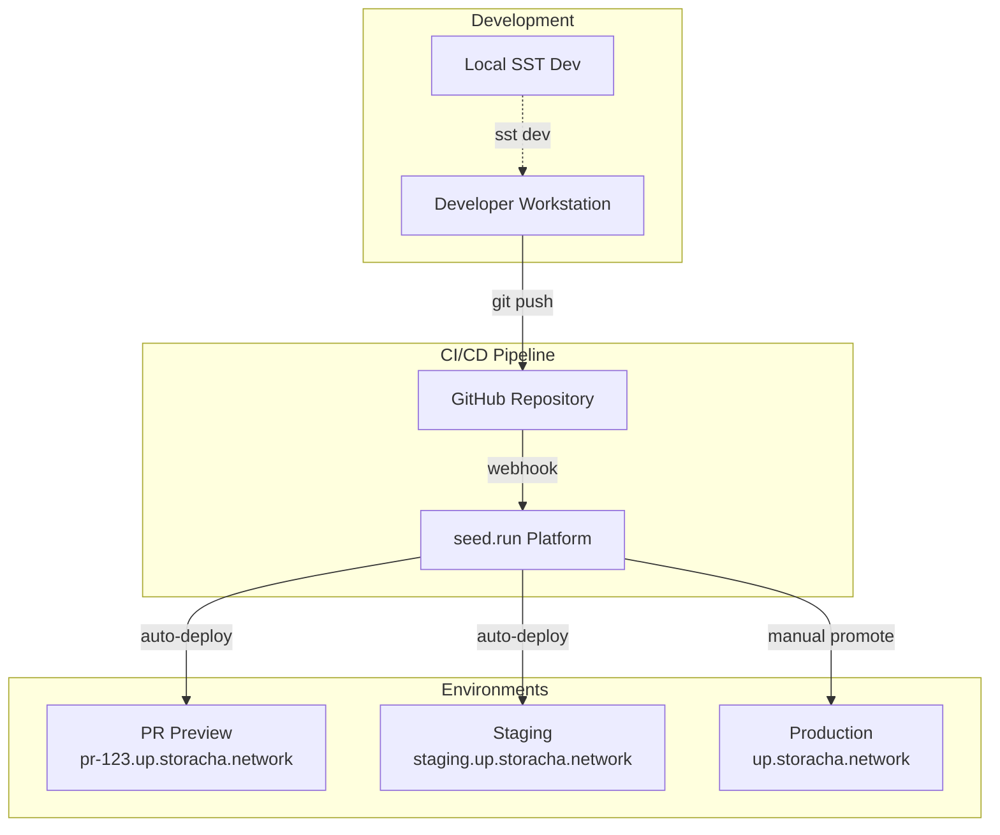
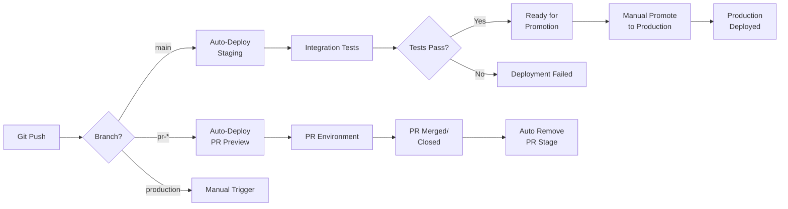
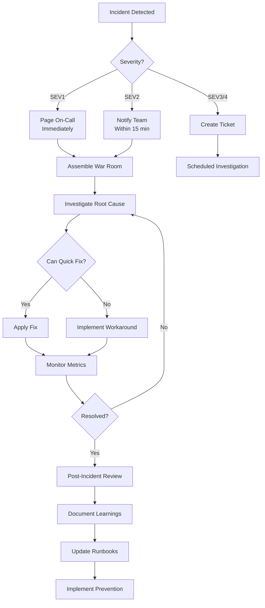

# 13. Deployment and Operations

This document provides comprehensive guidance on deploying, operating, and maintaining Storacha services in production environments.

## Table of Contents

- [Deployment Architecture](#deployment-architecture)
- [SST Deployment Framework](#sst-deployment-framework)
- [Environment Management](#environment-management)
- [Seed.run CI/CD Pipeline](#seedrun-cicd-pipeline)
- [Monitoring and Observability](#monitoring-and-observability)
- [Performance Tuning](#performance-tuning)
- [Incident Response](#incident-response)

---

## Deployment Architecture

### Overview

Storacha uses a multi-stage deployment architecture with isolated environments for development, staging, and production:



### Environment Strategy

**Development Environments:**
- **Local (`sst dev --no-deploy`)**: Development without AWS deployment
- **Personal Stages (`sst dev --stage dev-yourname`)**: Individual developer AWS environments
- **PR Preview (`pr-<number>`)**: Temporary environments for pull requests

**Shared Environments:**
- **Staging (`staging`)**: Integration testing environment, auto-deployed from `main` branch
- **Production (`production`)**: Live production environment, manual promotion only

---

## SST Deployment Framework

### SST Configuration

Storacha uses SST (Serverless Stack) v2 for infrastructure-as-code. The main configuration file is `sst.config.ts`:

```typescript
// sst.config.ts
import { SSTConfig } from 'sst'
import { UploadApiStack } from './stacks/upload-api-stack.js'
import { FilecoinStack } from './stacks/filecoin-stack.js'
import { BillingStack } from './stacks/billing-stack.js'
import { CarparkStack } from './stacks/carpark-stack.js'

export default {
  config(_input) {
    return {
      name: 'w3infra',
      region: 'us-west-2',
      profile: _input.stage === 'production' ? 'prod' : 'dev'
    }
  },

  stacks(app) {
    // Configure stage-specific settings
    app.setDefaultFunctionProps({
      runtime: 'nodejs20.x',
      memorySize: app.stage === 'production' ? 1024 : 512,
      timeout: 30,
      environment: {
        STAGE: app.stage,
        REGION: app.region,
        DEBUG: app.stage !== 'production' ? '*' : ''
      }
    })

    // Removal policy: protect production resources
    if (app.stage === 'production') {
      app.setDefaultRemovalPolicy('retain')
    }

    // Deploy stacks
    app
      .stack(UploadApiStack)
      .stack(FilecoinStack)
      .stack(BillingStack)
      .stack(CarparkStack)
  }
} satisfies SSTConfig
```

### Stack Organization

**w3infra Repository Structure:**

```
w3infra/
├── billing/              # Usage accounting and billing
├── carpark/              # CAR file announcement
├── filecoin/             # Filecoin deal integration
├── indexer/              # E-IPFS connection
├── replicator/           # R2 bucket replication
├── roundabout/           # Piece CID redirection
├── upload-api/           # HTTP gateway implementation
└── stacks/               # SST stack definitions
    ├── upload-api-stack.ts
    ├── filecoin-stack.ts
    ├── billing-stack.ts
    └── carpark-stack.ts
```

**Example Stack Definition:**

```typescript
// stacks/upload-api-stack.ts
import { StackContext, Table, Bucket, Api, Function } from 'sst/constructs'
import { RemovalPolicy } from 'aws-cdk-lib'

export function UploadApiStack({ stack, app }: StackContext) {
  // DynamoDB Tables
  const spaceTable = new Table(stack, 'space', {
    fields: {
      space: 'string',
      account: 'string'
    },
    primaryIndex: { partitionKey: 'space' },
    globalIndexes: {
      account: { partitionKey: 'account' }
    },
    cdk: {
      table: {
        removalPolicy: app.stage === 'production'
          ? RemovalPolicy.RETAIN
          : RemovalPolicy.DESTROY,
        pointInTimeRecovery: app.stage === 'production'
      }
    }
  })

  const uploadTable = new Table(stack, 'upload', {
    fields: {
      space: 'string',
      root: 'string',
      insertedAt: 'string'
    },
    primaryIndex: {
      partitionKey: 'space',
      sortKey: 'root'
    },
    globalIndexes: {
      insertedAt: {
        partitionKey: 'space',
        sortKey: 'insertedAt'
      }
    }
  })

  // S3/R2 Buckets
  const carparkBucket = new Bucket(stack, 'carpark', {
    cdk: {
      bucket: {
        removalPolicy: app.stage === 'production'
          ? RemovalPolicy.RETAIN
          : RemovalPolicy.DESTROY
      }
    }
  })

  // API Gateway
  const api = new Api(stack, 'upload-api', {
    defaults: {
      function: {
        environment: {
          SPACE_TABLE_NAME: spaceTable.tableName,
          UPLOAD_TABLE_NAME: uploadTable.tableName,
          CARPARK_BUCKET_NAME: carparkBucket.bucketName
        }
      }
    },
    routes: {
      'POST /space': {
        function: {
          handler: 'upload-api/functions/space-create.handler',
          permissions: [spaceTable]
        }
      },
      'POST /upload': {
        function: {
          handler: 'upload-api/functions/upload-add.handler',
          permissions: [spaceTable, uploadTable, carparkBucket]
        }
      },
      'GET /upload/{root}': {
        function: {
          handler: 'upload-api/functions/upload-get.handler',
          permissions: [uploadTable]
        }
      }
    }
  })

  // Output values
  stack.addOutputs({
    ApiEndpoint: api.url,
    SpaceTableName: spaceTable.tableName,
    UploadTableName: uploadTable.tableName,
    CarparkBucketName: carparkBucket.bucketName
  })

  return {
    api,
    spaceTable,
    uploadTable,
    carparkBucket
  }
}
```

### Local Development with SST

**No-Deploy Mode (Recommended for Development):**

```bash
cd ~/storacha-dev/w3infra

# Start SST dev console without AWS deployment
npx sst dev --no-deploy

# Console provides:
# - Function stubs for local testing
# - Real-time logs
# - Resource explorer
# - Local DynamoDB simulation
```

**Live Lambda Development:**

```bash
# Deploy to personal AWS stage with live reload
npx sst dev --stage dev-alice

# Features:
# - Deploys real AWS infrastructure
# - Hot-reloads Lambda code changes
# - Connects local IDE to deployed functions
# - Breakpoint debugging in VS Code
```

**Custom AWS Deployment:**

```bash
# Copy environment template
cp .env.tpl .env.local

# Configure required variables
cat > .env.local << 'EOF'
# AWS Configuration
AWS_REGION=us-west-2
AWS_PROFILE=storacha-dev

# Hosted Zone
HOSTED_ZONE=dev.storacha.network

# Service DIDs
FILECOIN_AGGREGATOR_DID=did:web:aggregator.dev.storacha.network
IPFS_INDEXER_URL=https://indexer.dev.storacha.network

# R2 Storage (Cloudflare)
R2_ACCESS_KEY_ID=your_r2_access_key
R2_SECRET_ACCESS_KEY=your_r2_secret_key
R2_CARPARK_BUCKET_NAME=carpark-dev
R2_DUDEWHERE_BUCKET_NAME=dudewhere-dev

# Stripe (Optional for billing)
STRIPE_SECRET_KEY=sk_test_...

# GitHub OAuth (Optional for auth)
GITHUB_CLIENT_ID=your_github_client_id
GITHUB_CLIENT_SECRET=your_github_client_secret
EOF

# Deploy to AWS
npm start
```

### SST Deployment Commands

**Deploy to Specific Stage:**

```bash
# Deploy to staging
npx sst deploy --stage staging

# Deploy to production
npx sst deploy --stage production

# Deploy specific stack only
npx sst deploy --stage staging UploadApiStack
```

**Remove Stage:**

```bash
# Remove non-production stage
npx sst remove --stage dev-alice

# Remove PR preview environment
npx sst remove --stage pr-123

# Production resources are retained by default
# (configured in sst.config.ts with RemovalPolicy.RETAIN)
```

**Secrets Management:**

```bash
# Set secret for current stage
npx sst secrets set STRIPE_SECRET_KEY sk_live_...

# Set secret for specific stage
npx sst secrets set STRIPE_SECRET_KEY sk_test_... --stage staging

# List all secrets
npx sst secrets list

# List secrets for specific stage
npx sst secrets list --stage production

# Remove secret
npx sst secrets remove OLD_API_KEY
```

**Stage Introspection:**

```bash
# Show all outputs for current stage
npx sst console

# Get specific output value
npx sst outputs get ApiEndpoint --stage production

# List all deployed stages
npx sst ls
```

---

## Environment Management

### Environment Variables

**Stage-Specific Configuration:**

```typescript
// Accessing stage in stack code
export function UploadApiStack({ stack, app }: StackContext) {
  const isProd = app.stage === 'production'
  const isStaging = app.stage === 'staging'
  const isPrPreview = app.stage.startsWith('pr-')

  // Production: high memory, no debug logs
  // Staging: medium memory, verbose logs
  // PR Preview: low memory, verbose logs
  const functionDefaults = {
    memorySize: isProd ? 2048 : isStaging ? 1024 : 512,
    timeout: isProd ? 60 : 30,
    environment: {
      STAGE: app.stage,
      LOG_LEVEL: isProd ? 'info' : 'debug',
      ENABLE_XRAY: isProd ? 'true' : 'false'
    }
  }

  // Apply defaults
  stack.setDefaultFunctionProps(functionDefaults)
}
```

**Environment-Specific Service URLs:**

```typescript
// Helper to generate service URLs based on stage
function getServiceUrls(stage: string) {
  const domain = stage === 'production'
    ? 'storacha.network'
    : stage === 'staging'
    ? 'staging.storacha.network'
    : `${stage}.dev.storacha.network`

  return {
    uploadApi: `https://up.${domain}`,
    w3up: `https://w3up.${domain}`,
    aggregator: `https://aggregator.${domain}`,
    indexer: `https://indexer.${domain}`
  }
}

// Usage in stack
const urls = getServiceUrls(app.stage)
api.addEnvironment({
  UPLOAD_API_URL: urls.uploadApi,
  AGGREGATOR_URL: urls.aggregator
})
```

### Multi-Region Configuration

**Primary Region: us-west-2 (Oregon)**

```typescript
// sst.config.ts
export default {
  config(_input) {
    return {
      name: 'w3infra',
      region: 'us-west-2', // Primary region
      profile: _input.stage === 'production' ? 'prod' : 'dev'
    }
  }
}
```

**Secrets Fallback (Multi-Region Support):**

```typescript
// upload-api/lib/secrets.js
import { SSMClient, GetParameterCommand } from '@aws-sdk/client-ssm'

const PRIMARY_REGION = 'us-west-2'
const FALLBACK_REGION = 'us-east-1'

export async function getSecret(secretName, options = {}) {
  const { stage = process.env.SST_STAGE, cache = true } = options

  // Try primary region
  try {
    const client = new SSMClient({ region: PRIMARY_REGION })
    const response = await client.send(new GetParameterCommand({
      Name: `/sst/${stage}/${secretName}`,
      WithDecryption: true
    }))
    return response.Parameter.Value
  } catch (primaryError) {
    console.warn(`Failed to get secret from ${PRIMARY_REGION}:`, primaryError.message)

    // Fallback to secondary region
    try {
      const client = new SSMClient({ region: FALLBACK_REGION })
      const response = await client.send(new GetParameterCommand({
        Name: `/sst/${stage}/${secretName}`,
        WithDecryption: true
      }))
      console.log(`Retrieved secret from fallback region ${FALLBACK_REGION}`)
      return response.Parameter.Value
    } catch (fallbackError) {
      throw new Error(`Failed to get secret from both regions: ${fallbackError.message}`)
    }
  }
}
```

### Resource Naming Convention

**Consistent Naming Strategy:**

```typescript
// lib/naming.ts
export function getResourceName(
  resourceType: string,
  resourceName: string,
  stage: string
): string {
  // Format: w3infra-{stage}-{resourceType}-{resourceName}
  // Example: w3infra-production-table-space
  return `w3infra-${stage}-${resourceType}-${resourceName}`
}

// Usage in stacks
const tableName = getResourceName('table', 'space', app.stage)
const bucketName = getResourceName('bucket', 'carpark', app.stage)
const functionName = getResourceName('function', 'upload-add', app.stage)
```

---

## Seed.run CI/CD Pipeline

### Pipeline Overview

Storacha uses **seed.run** (https://seed.run) as the primary CI/CD platform for deploying SST applications:



### Seed.run Configuration

**Connect Repository:**

1. **Create Seed.run Account**: Sign up at https://seed.run
2. **Connect GitHub**: Authorize Seed.run to access storacha repositories
3. **Add Application**: Select `storacha/w3infra` repository
4. **Configure Stages**:
   - **Default Stage**: `staging` (auto-deploy from `main` branch)
   - **Production Stage**: `production` (manual promotion only)
   - **PR Previews**: Auto-create from pull requests

**seed.yml Configuration:**

```yaml
# seed.yml
version: 2.0

stages:
  - name: staging
    auto_deploy: true
    branch: main
    region: us-west-2

  - name: production
    auto_deploy: false
    region: us-west-2

check_code_change:
  - "**/*.ts"
  - "**/*.js"
  - "stacks/**"
  - "sst.config.ts"
  - "package.json"

commands:
  build:
    - pnpm install --frozen-lockfile
    - pnpm build
  test:
    - pnpm test:unit
  deploy:
    - npx sst deploy --stage $SEED_STAGE_NAME

pr_deployments:
  enabled: true
  auto_deploy: true
  format: "pr-{number}"

notifications:
  slack:
    webhook_url: $SLACK_WEBHOOK_URL
    events:
      - deployment_started
      - deployment_completed
      - deployment_failed
```

### Secrets Management in Seed.run

**Adding Secrets via Console:**

1. Navigate to **App Settings** → **Environment Variables**
2. Select stage (staging/production)
3. Click **Show Env Variables**
4. Add Key-Value pairs:
   - `STRIPE_SECRET_KEY`: `sk_live_...`
   - `R2_ACCESS_KEY_ID`: `...`
   - `R2_SECRET_ACCESS_KEY`: `...`
   - `GITHUB_CLIENT_SECRET`: `...`

**Secrets Inheritance:**

```yaml
# seed.yml - Configure secret inheritance
stages:
  - name: staging
    environment:
      # Staging-specific secrets
      STRIPE_SECRET_KEY: $STRIPE_TEST_KEY
      ENABLE_DEBUG_MODE: "true"

  - name: production
    environment:
      # Production-specific secrets
      STRIPE_SECRET_KEY: $STRIPE_LIVE_KEY
      ENABLE_DEBUG_MODE: "false"
```

**Accessing Secrets in Lambda:**

```typescript
// upload-api/functions/billing-webhook.ts
export async function handler(event: APIGatewayProxyEvent) {
  // Secrets are available as environment variables
  const stripeKey = process.env.STRIPE_SECRET_KEY

  if (!stripeKey) {
    throw new Error('STRIPE_SECRET_KEY not configured')
  }

  const stripe = new Stripe(stripeKey, {
    apiVersion: '2023-10-16'
  })

  // Process webhook...
}
```

### Deployment Workflow

**Staging Deployment (Automatic):**

```bash
# Developer workflow
git checkout main
git pull origin main

# Make changes
# ... edit files ...

# Commit and push
git add .
git commit -m "feat(upload): add batch upload support"
git push origin main

# Seed.run automatically:
# 1. Detects push to main branch
# 2. Runs build command: pnpm install && pnpm build
# 3. Runs test command: pnpm test:unit
# 4. Deploys to staging: npx sst deploy --stage staging
# 5. Runs integration tests (if configured)
# 6. Sends Slack notification on completion
```

**Production Deployment (Manual Promotion):**

```bash
# Via Seed.run Console:
# 1. Navigate to staging deployment
# 2. Review changes and test results
# 3. Click "Promote to Production"
# 4. Confirm promotion
# 5. Seed.run deploys staging build to production stage
# 6. Monitor deployment progress
# 7. Verify production health checks

# Production promotion does NOT re-run tests
# It deploys the exact same build that was tested in staging
```

**PR Preview Deployment:**

```bash
# Developer creates PR
git checkout -b feat/new-upload-api
# ... make changes ...
git push origin feat/new-upload-api

# Create PR on GitHub

# Seed.run automatically:
# 1. Detects new PR
# 2. Creates temporary stage: pr-123
# 3. Deploys to https://pr-123.up.storacha.network
# 4. Adds comment to PR with preview URL
# 5. Updates preview on each commit to PR branch

# When PR is merged or closed:
# 1. Seed.run removes stage: npx sst remove --stage pr-123
# 2. AWS resources are destroyed (except retained resources)
```

### Build Phase Configuration

**Custom Build Commands:**

```yaml
# seed.yml
commands:
  # Pre-build: Install dependencies
  before_build:
    - echo "Installing dependencies..."
    - pnpm install --frozen-lockfile

  # Build: Compile TypeScript
  build:
    - echo "Building packages..."
    - pnpm --filter "./packages/**" build

  # Test: Run unit tests only (integration tests run post-deploy)
  test:
    - echo "Running unit tests..."
    - pnpm test:unit --coverage

  # Deploy: SST deployment
  deploy:
    - echo "Deploying to $SEED_STAGE_NAME..."
    - npx sst deploy --stage $SEED_STAGE_NAME --verbose

  # Post-deploy: Run integration tests
  after_deploy:
    - echo "Running integration tests..."
    - STAGE=$SEED_STAGE_NAME pnpm test:integration
```

### Monitoring Deployments

**Seed.run Dashboard Features:**

- **Real-time Logs**: Live stream of deployment logs
- **Build History**: Complete history of all deployments
- **Stage Comparison**: Compare resources across stages
- **Resource Explorer**: View deployed Lambda functions, tables, buckets
- **Metrics**: Deployment duration, success rate, error trends

**Slack Integration:**

```yaml
# seed.yml
notifications:
  slack:
    webhook_url: $SLACK_WEBHOOK_URL
    channels:
      - name: "#deployments"
        events:
          - deployment_started
          - deployment_completed
          - deployment_failed
      - name: "#alerts"
        events:
          - deployment_failed
          - tests_failed
```

**Email Notifications:**

```yaml
# seed.yml
notifications:
  email:
    recipients:
      - ops@storacha.network
    events:
      - deployment_failed
      - production_deployed
```

### Rollback Strategy

**Automated Rollback (Production):**

```yaml
# seed.yml
stages:
  - name: production
    auto_rollback:
      enabled: true
      cloudwatch_alarms:
        - w3infra-production-api-errors
        - w3infra-production-lambda-throttles
      threshold_minutes: 5
```

**Manual Rollback:**

```bash
# Via Seed.run Console:
# 1. Navigate to Production stage
# 2. View deployment history
# 3. Select previous successful deployment
# 4. Click "Rollback to this deployment"
# 5. Confirm rollback

# Via SST CLI (emergency):
git checkout <previous-commit-sha>
npx sst deploy --stage production
```

**Version Aliases for Instant Rollback:**

```typescript
// stacks/upload-api-stack.ts
import { Function, use } from 'sst/constructs'
import { Alias } from 'aws-cdk-lib/aws-lambda'

export function UploadApiStack({ stack, app }: StackContext) {
  const uploadFunction = new Function(stack, 'upload-add', {
    handler: 'upload-api/functions/upload-add.handler'
  })

  // Create alias for production traffic
  const prodAlias = new Alias(stack, 'upload-add-prod-alias', {
    aliasName: 'prod',
    version: uploadFunction.currentVersion
  })

  // For instant rollback:
  // 1. Update alias to point to previous version
  // 2. No code deployment required
  // 3. Traffic switches immediately
}
```

### Deployment Best Practices

**Pre-Deployment Checklist:**

```markdown
## Deployment Checklist

### Code Quality
- [ ] All tests passing locally
- [ ] Code reviewed and approved
- [ ] No console.log or debug statements
- [ ] Error handling implemented
- [ ] TypeScript errors resolved

### Database
- [ ] Migration scripts tested
- [ ] Backup strategy confirmed
- [ ] Rollback plan documented

### Dependencies
- [ ] package.json versions pinned
- [ ] No critical security vulnerabilities
- [ ] Breaking changes documented

### Configuration
- [ ] Environment variables set in Seed.run
- [ ] Secrets rotated if needed
- [ ] Feature flags configured

### Monitoring
- [ ] CloudWatch alarms configured
- [ ] Dashboard updated with new metrics
- [ ] Runbook created for new features

### Communication
- [ ] Team notified of deployment window
- [ ] Stakeholders informed of changes
- [ ] On-call engineer assigned
```

**Staging Validation:**

```bash
# After staging deployment, run validation suite
pnpm test:e2e --stage staging

# Smoke tests
curl https://staging.up.storacha.network/version
curl https://staging.up.storacha.network/health

# Load testing (optional)
artillery run tests/load/upload-api.yml --target https://staging.up.storacha.network
```

---

## Monitoring and Observability

### CloudWatch Dashboards

**Comprehensive Dashboard Setup:**

```typescript
// stacks/monitoring-stack.ts
import { StackContext } from 'sst/constructs'
import { Dashboard, GraphWidget, Metric, Alarm, ComparisonOperator } from 'aws-cdk-lib/aws-cloudwatch'
import { SnsAction } from 'aws-cdk-lib/aws-cloudwatch-actions'
import { Topic } from 'aws-cdk-lib/aws-sns'
import { EmailSubscription } from 'aws-cdk-lib/aws-sns-subscriptions'

export function MonitoringStack({ stack, app }: StackContext) {
  const isProd = app.stage === 'production'

  // SNS Topic for alerts
  const alertTopic = new Topic(stack, 'alerts', {
    displayName: `w3infra-${app.stage}-alerts`
  })

  // Subscribe ops team
  alertTopic.addSubscription(
    new EmailSubscription('ops@storacha.network')
  )

  // Create CloudWatch Dashboard
  const dashboard = new Dashboard(stack, 'operations-dashboard', {
    dashboardName: `w3infra-${app.stage}-operations`
  })

  // API Gateway Metrics
  const apiMetrics = {
    requests: new Metric({
      namespace: 'AWS/ApiGateway',
      metricName: 'Count',
      dimensionsMap: {
        ApiName: `w3infra-${app.stage}-upload-api`
      },
      statistic: 'Sum',
      period: cdk.Duration.minutes(5)
    }),
    errors: new Metric({
      namespace: 'AWS/ApiGateway',
      metricName: '5XXError',
      dimensionsMap: {
        ApiName: `w3infra-${app.stage}-upload-api`
      },
      statistic: 'Sum',
      period: cdk.Duration.minutes(5)
    }),
    latency: new Metric({
      namespace: 'AWS/ApiGateway',
      metricName: 'Latency',
      dimensionsMap: {
        ApiName: `w3infra-${app.stage}-upload-api`
      },
      statistic: 'Average',
      period: cdk.Duration.minutes(5)
    })
  }

  dashboard.addWidgets(
    new GraphWidget({
      title: 'API Gateway - Request Volume',
      left: [apiMetrics.requests],
      width: 12,
      height: 6
    }),
    new GraphWidget({
      title: 'API Gateway - Error Rate',
      left: [apiMetrics.errors],
      width: 12,
      height: 6
    }),
    new GraphWidget({
      title: 'API Gateway - Latency (ms)',
      left: [apiMetrics.latency],
      width: 24,
      height: 6
    })
  )

  // Lambda Function Metrics
  const lambdaFunctions = [
    'upload-add',
    'upload-get',
    'space-create',
    'blob-allocate',
    'filecoin-submit'
  ]

  lambdaFunctions.forEach(fnName => {
    const invocations = new Metric({
      namespace: 'AWS/Lambda',
      metricName: 'Invocations',
      dimensionsMap: {
        FunctionName: `w3infra-${app.stage}-${fnName}`
      },
      statistic: 'Sum'
    })

    const errors = new Metric({
      namespace: 'AWS/Lambda',
      metricName: 'Errors',
      dimensionsMap: {
        FunctionName: `w3infra-${app.stage}-${fnName}`
      },
      statistic: 'Sum'
    })

    const duration = new Metric({
      namespace: 'AWS/Lambda',
      metricName: 'Duration',
      dimensionsMap: {
        FunctionName: `w3infra-${app.stage}-${fnName}`
      },
      statistic: 'Average'
    })

    const throttles = new Metric({
      namespace: 'AWS/Lambda',
      metricName: 'Throttles',
      dimensionsMap: {
        FunctionName: `w3infra-${app.stage}-${fnName}`
      },
      statistic: 'Sum'
    })

    dashboard.addWidgets(
      new GraphWidget({
        title: `Lambda: ${fnName} - Invocations & Errors`,
        left: [invocations],
        right: [errors, throttles],
        width: 12,
        height: 6
      }),
      new GraphWidget({
        title: `Lambda: ${fnName} - Duration (ms)`,
        left: [duration],
        width: 12,
        height: 6
      })
    )
  })

  // DynamoDB Metrics
  const tables = ['space', 'upload', 'store', 'delegation']

  tables.forEach(tableName => {
    const readCapacity = new Metric({
      namespace: 'AWS/DynamoDB',
      metricName: 'ConsumedReadCapacityUnits',
      dimensionsMap: {
        TableName: `w3infra-${app.stage}-table-${tableName}`
      },
      statistic: 'Sum'
    })

    const writeCapacity = new Metric({
      namespace: 'AWS/DynamoDB',
      metricName: 'ConsumedWriteCapacityUnits',
      dimensionsMap: {
        TableName: `w3infra-${app.stage}-table-${tableName}`
      },
      statistic: 'Sum'
    })

    const throttledReads = new Metric({
      namespace: 'AWS/DynamoDB',
      metricName: 'ReadThrottleEvents',
      dimensionsMap: {
        TableName: `w3infra-${app.stage}-table-${tableName}`
      },
      statistic: 'Sum'
    })

    const throttledWrites = new Metric({
      namespace: 'AWS/DynamoDB',
      metricName: 'WriteThrottleEvents',
      dimensionsMap: {
        TableName: `w3infra-${app.stage}-table-${tableName}`
      },
      statistic: 'Sum'
    })

    dashboard.addWidgets(
      new GraphWidget({
        title: `DynamoDB: ${tableName} - Capacity Units`,
        left: [readCapacity, writeCapacity],
        width: 12,
        height: 6
      }),
      new GraphWidget({
        title: `DynamoDB: ${tableName} - Throttle Events`,
        left: [throttledReads, throttledWrites],
        width: 12,
        height: 6
      })
    )
  })

  return {
    dashboard,
    alertTopic
  }
}
```

### CloudWatch Alarms

**Critical Alarms (Production):**

```typescript
// stacks/monitoring-stack.ts (continued)

export function createAlarms({ stack, app, alertTopic }: {
  stack: Stack
  app: App
  alertTopic: Topic
}) {
  const isProd = app.stage === 'production'

  // API Error Rate Alarm
  const apiErrorAlarm = new Alarm(stack, 'api-error-rate', {
    alarmName: `w3infra-${app.stage}-api-high-error-rate`,
    metric: new Metric({
      namespace: 'AWS/ApiGateway',
      metricName: '5XXError',
      dimensionsMap: {
        ApiName: `w3infra-${app.stage}-upload-api`
      },
      statistic: 'Sum',
      period: cdk.Duration.minutes(5)
    }),
    threshold: isProd ? 10 : 50,
    evaluationPeriods: 2,
    comparisonOperator: ComparisonOperator.GREATER_THAN_THRESHOLD,
    treatMissingData: cdk.aws_cloudwatch.TreatMissingData.NOT_BREACHING
  })

  apiErrorAlarm.addAlarmAction(new SnsAction(alertTopic))

  // Lambda Concurrent Executions Alarm (80% of limit)
  const concurrentExecAlarm = new Alarm(stack, 'lambda-concurrent-exec', {
    alarmName: `w3infra-${app.stage}-lambda-high-concurrency`,
    metric: new Metric({
      namespace: 'AWS/Lambda',
      metricName: 'ConcurrentExecutions',
      statistic: 'Maximum',
      period: cdk.Duration.minutes(1)
    }),
    threshold: 800, // 80% of default 1000 limit
    evaluationPeriods: 2,
    comparisonOperator: ComparisonOperator.GREATER_THAN_THRESHOLD
  })

  concurrentExecAlarm.addAlarmAction(new SnsAction(alertTopic))

  // Lambda Throttles Alarm
  const lambdaThrottleAlarm = new Alarm(stack, 'lambda-throttles', {
    alarmName: `w3infra-${app.stage}-lambda-throttles`,
    metric: new Metric({
      namespace: 'AWS/Lambda',
      metricName: 'Throttles',
      statistic: 'Sum',
      period: cdk.Duration.minutes(5)
    }),
    threshold: 0,
    evaluationPeriods: 1,
    comparisonOperator: ComparisonOperator.GREATER_THAN_THRESHOLD,
    treatMissingData: cdk.aws_cloudwatch.TreatMissingData.NOT_BREACHING
  })

  lambdaThrottleAlarm.addAlarmAction(new SnsAction(alertTopic))

  // DynamoDB Throttle Alarm
  const dynamoThrottleAlarm = new Alarm(stack, 'dynamodb-throttles', {
    alarmName: `w3infra-${app.stage}-dynamodb-throttles`,
    metric: new Metric({
      namespace: 'AWS/DynamoDB',
      metricName: 'UserErrors',
      statistic: 'Sum',
      period: cdk.Duration.minutes(5)
    }),
    threshold: 5,
    evaluationPeriods: 2,
    comparisonOperator: ComparisonOperator.GREATER_THAN_THRESHOLD
  })

  dynamoThrottleAlarm.addAlarmAction(new SnsAction(alertTopic))

  // Lambda Duration Alarm (approaching timeout)
  const lambdaDurationAlarm = new Alarm(stack, 'lambda-duration', {
    alarmName: `w3infra-${app.stage}-lambda-slow-execution`,
    metric: new Metric({
      namespace: 'AWS/Lambda',
      metricName: 'Duration',
      statistic: 'Average',
      period: cdk.Duration.minutes(5)
    }),
    threshold: 25000, // 25 seconds (timeout is 30s)
    evaluationPeriods: 3,
    comparisonOperator: ComparisonOperator.GREATER_THAN_THRESHOLD
  })

  lambdaDurationAlarm.addAlarmAction(new SnsAction(alertTopic))

  return {
    apiErrorAlarm,
    concurrentExecAlarm,
    lambdaThrottleAlarm,
    dynamoThrottleAlarm,
    lambdaDurationAlarm
  }
}
```

### Custom Metrics and Log Analytics

**Embedded Metric Format (EMF):**

```typescript
// upload-api/lib/metrics.ts
import { MetricUnits } from '@aws-lambda-powertools/metrics'
import { Metrics } from '@aws-lambda-powertools/metrics'

const metrics = new Metrics({
  namespace: 'Storacha',
  serviceName: 'upload-api'
})

export function recordUploadMetrics(upload: {
  size: number
  shardCount: number
  duration: number
  space: string
}) {
  // Add dimensions
  metrics.addDimension('Environment', process.env.STAGE || 'unknown')

  // Record metrics
  metrics.addMetric('UploadSize', MetricUnits.Bytes, upload.size)
  metrics.addMetric('ShardCount', MetricUnits.Count, upload.shardCount)
  metrics.addMetric('UploadDuration', MetricUnits.Milliseconds, upload.duration)

  // Publish metrics (automatically on function completion)
  metrics.publishStoredMetrics()
}

// Usage in Lambda handler
export async function handler(event: APIGatewayProxyEvent) {
  const startTime = Date.now()

  try {
    const upload = await processUpload(event)

    recordUploadMetrics({
      size: upload.size,
      shardCount: upload.shards.length,
      duration: Date.now() - startTime,
      space: upload.space
    })

    return {
      statusCode: 200,
      body: JSON.stringify(upload)
    }
  } catch (error) {
    metrics.addMetric('UploadErrors', MetricUnits.Count, 1)
    throw error
  }
}
```

**CloudWatch Logs Insights Queries:**

```sql
-- Query: Top 10 slowest Lambda invocations
fields @timestamp, @duration, @requestId, @message
| filter @type = "REPORT"
| sort @duration desc
| limit 10

-- Query: Error rate by function
fields @timestamp, @message
| filter @message like /ERROR/
| stats count() by bin(5m)

-- Query: Upload API latency percentiles
fields @timestamp, duration
| filter @message like /Upload completed/
| stats
    avg(duration) as avg_duration,
    pct(duration, 50) as p50,
    pct(duration, 90) as p90,
    pct(duration, 99) as p99
  by bin(5m)

-- Query: DynamoDB throttle events
fields @timestamp, @message
| filter @message like /ProvisionedThroughputExceededException/
| stats count() as throttle_count by bin(1m)

-- Query: Failed uploads by error type
fields @timestamp, error.type, error.message
| filter @message like /Upload failed/
| stats count() by error.type

-- Query: CAR file processing stats
fields @timestamp, carSize, blockCount, indexDuration
| filter @message like /CAR indexed/
| stats
    sum(carSize) as total_bytes,
    sum(blockCount) as total_blocks,
    avg(indexDuration) as avg_duration
  by bin(1h)
```

**Metric Filters for Log-Based Alerts:**

```typescript
// stacks/monitoring-stack.ts
import { FilterPattern, MetricFilter } from 'aws-cdk-lib/aws-logs'

export function createLogMetricFilters({ stack, app }: StackContext) {
  const uploadApiLogGroup = `/aws/lambda/w3infra-${app.stage}-upload-add`

  // Filter for authentication failures
  new MetricFilter(stack, 'auth-failures-filter', {
    logGroup: LogGroup.fromLogGroupName(
      stack,
      'upload-api-logs',
      uploadApiLogGroup
    ),
    metricNamespace: 'Storacha/Security',
    metricName: 'AuthenticationFailures',
    filterPattern: FilterPattern.literal('[time, request_id, level = "ERROR", msg = "Authentication failed*"]'),
    metricValue: '1',
    defaultValue: 0
  })

  // Filter for upload failures
  new MetricFilter(stack, 'upload-failures-filter', {
    logGroup: LogGroup.fromLogGroupName(
      stack,
      'upload-api-logs',
      uploadApiLogGroup
    ),
    metricNamespace: 'Storacha/Uploads',
    metricName: 'UploadFailures',
    filterPattern: FilterPattern.literal('[time, request_id, level = "ERROR", msg = "Upload failed*"]'),
    metricValue: '1',
    defaultValue: 0
  })

  // Alarm on authentication failures
  const authFailureAlarm = new Alarm(stack, 'auth-failure-alarm', {
    alarmName: `w3infra-${app.stage}-auth-failures`,
    metric: new Metric({
      namespace: 'Storacha/Security',
      metricName: 'AuthenticationFailures',
      statistic: 'Sum',
      period: cdk.Duration.minutes(5)
    }),
    threshold: 10,
    evaluationPeriods: 1,
    comparisonOperator: ComparisonOperator.GREATER_THAN_THRESHOLD
  })
}
```

### AWS X-Ray Tracing

**Enable X-Ray for End-to-End Tracing:**

```typescript
// sst.config.ts
export default {
  stacks(app) {
    app.setDefaultFunctionProps({
      runtime: 'nodejs20.x',
      // Enable X-Ray tracing for production
      tracing: app.stage === 'production' ? 'active' : 'pass_through',
      environment: {
        AWS_XRAY_CONTEXT_MISSING: 'LOG_ERROR'
      }
    })
  }
}
```

**Instrument Lambda Functions:**

```typescript
// upload-api/functions/upload-add.ts
import { captureAWS, captureHTTPsGlobal } from 'aws-xray-sdk-core'
import { DynamoDBClient } from '@aws-sdk/client-dynamodb'
import { S3Client } from '@aws-sdk/client-s3'
import https from 'https'

// Capture AWS SDK calls
const dynamodb = captureAWS(new DynamoDBClient({}))
const s3 = captureAWS(new S3Client({}))

// Capture outbound HTTPS calls
captureHTTPsGlobal(https)

export async function handler(event: APIGatewayProxyEvent) {
  const AWSXRay = require('aws-xray-sdk-core')

  // Create custom subsegment
  const segment = AWSXRay.getSegment()
  const subsegment = segment.addNewSubsegment('ProcessUpload')

  try {
    subsegment.addAnnotation('space', event.pathParameters?.space)
    subsegment.addMetadata('uploadSize', event.body?.length)

    // Process upload...
    const result = await processUpload(event)

    subsegment.close()
    return {
      statusCode: 200,
      body: JSON.stringify(result)
    }
  } catch (error) {
    subsegment.addError(error)
    subsegment.close()
    throw error
  }
}
```

**X-Ray Service Map Analysis:**

The X-Ray service map provides visual representation of:
- API Gateway → Lambda → DynamoDB/S3 request flow
- Latency at each service boundary
- Error rates per service
- Bottleneck identification

---

## Performance Tuning

### Lambda Optimization

#### Memory and CPU Configuration

**Memory-CPU Relationship:**

Lambda allocates CPU power linearly proportional to memory:
- 128 MB = 0.083 vCPU
- 1,024 MB = 0.667 vCPU
- 1,792 MB = 1 full vCPU
- 3,008 MB = 1.67 vCPU
- 10,240 MB = 5.83 vCPU

**Optimal Memory Selection:**

```typescript
// stacks/upload-api-stack.ts
import { Function } from 'sst/constructs'

export function UploadApiStack({ stack, app }: StackContext) {
  // Light operations: 512 MB
  const uploadGet = new Function(stack, 'upload-get', {
    handler: 'upload-api/functions/upload-get.handler',
    memorySize: 512,
    timeout: 10
  })

  // Medium operations: 1024 MB
  const uploadAdd = new Function(stack, 'upload-add', {
    handler: 'upload-api/functions/upload-add.handler',
    memorySize: 1024,
    timeout: 30
  })

  // Heavy operations (CAR processing): 2048 MB
  const carIndex = new Function(stack, 'car-index', {
    handler: 'carpark/functions/car-index.handler',
    memorySize: 2048,
    timeout: 60
  })

  // CPU-intensive (Filecoin piece generation): 3008 MB (1 full vCPU)
  const pieceGenerate = new Function(stack, 'piece-generate', {
    handler: 'filecoin/functions/piece-generate.handler',
    memorySize: 3008,
    timeout: 300
  })
}
```

**Performance Testing to Find Optimal Memory:**

```typescript
// scripts/test-lambda-memory.ts
import { LambdaClient, UpdateFunctionConfigurationCommand, InvokeCommand } from '@aws-sdk/client-lambda'

async function testMemoryConfig(functionName: string) {
  const client = new LambdaClient({})
  const memorySizes = [512, 1024, 1536, 2048, 3008]
  const results = []

  for (const memorySize of memorySizes) {
    // Update function memory
    await client.send(new UpdateFunctionConfigurationCommand({
      FunctionName: functionName,
      MemorySize: memorySize
    }))

    // Wait for update to complete
    await new Promise(resolve => setTimeout(resolve, 5000))

    // Run 10 invocations
    const durations = []
    const costs = []

    for (let i = 0; i < 10; i++) {
      const response = await client.send(new InvokeCommand({
        FunctionName: functionName,
        Payload: JSON.stringify({ test: true })
      }))

      const logResult = Buffer.from(response.LogResult!, 'base64').toString()
      const durationMatch = logResult.match(/Duration: ([\d.]+) ms/)
      const billedMatch = logResult.match(/Billed Duration: (\d+) ms/)

      if (durationMatch && billedMatch) {
        durations.push(parseFloat(durationMatch[1]))

        // Calculate cost
        const billedMs = parseInt(billedMatch[1])
        const gbSeconds = (memorySize / 1024) * (billedMs / 1000)
        const cost = gbSeconds * 0.0000166667 // $0.0000166667 per GB-second
        costs.push(cost)
      }
    }

    const avgDuration = durations.reduce((a, b) => a + b, 0) / durations.length
    const avgCost = costs.reduce((a, b) => a + b, 0) / costs.length

    results.push({
      memorySize,
      avgDuration,
      avgCost,
      costPerformance: avgCost / avgDuration // Lower is better
    })

    console.log(`${memorySize} MB: ${avgDuration.toFixed(2)} ms, $${avgCost.toFixed(6)}`)
  }

  // Find optimal configuration
  const optimal = results.reduce((best, current) =>
    current.costPerformance < best.costPerformance ? current : best
  )

  console.log(`\nOptimal configuration: ${optimal.memorySize} MB`)
  return optimal
}

// Run test
testMemoryConfig('w3infra-production-upload-add')
```

#### Cold Start Optimization

**Minimize Package Size:**

```json
// package.json
{
  "name": "upload-api",
  "scripts": {
    "bundle": "esbuild functions/**/*.ts --bundle --platform=node --target=node20 --outdir=dist --external:@aws-sdk/*",
    "analyze": "esbuild-visualizer dist/*.js"
  },
  "devDependencies": {
    "esbuild": "^0.19.0",
    "esbuild-visualizer": "^0.4.1"
  }
}
```

**Tree Shaking and Code Splitting:**

```typescript
// sst.config.ts
export default {
  stacks(app) {
    app.setDefaultFunctionProps({
      nodejs: {
        esbuild: {
          bundle: true,
          minify: app.stage === 'production',
          target: 'node20',
          format: 'esm',
          splitting: true,
          external: [
            '@aws-sdk/*' // Excluded, available in Lambda runtime
          ],
          banner: {
            js: "import { createRequire } from 'module'; const require = createRequire(import.meta.url);"
          }
        }
      }
    })
  }
}
```

**Lazy Load Heavy Dependencies:**

```typescript
// Before: Import at top (always loaded)
import { CarReader } from '@ipld/car'
import { Block } from 'multiformats/block'

export async function handler(event) {
  // CarReader loaded even if not needed
  if (event.action === 'simple') {
    return simpleResponse()
  }

  const car = await CarReader.fromBytes(event.carBytes)
}

// After: Lazy import (loaded only when needed)
export async function handler(event) {
  if (event.action === 'simple') {
    return simpleResponse() // Fast path
  }

  // Import only when actually needed
  const { CarReader } = await import('@ipld/car')
  const { Block } = await import('multiformats/block')

  const car = await CarReader.fromBytes(event.carBytes)
}
```

**Provisioned Concurrency for Critical Functions:**

```typescript
// stacks/upload-api-stack.ts
import { Function } from 'sst/constructs'
import { ScalableTarget, TargetTrackingScalingPolicy } from 'aws-cdk-lib/aws-applicationautoscaling'
import * as lambda from 'aws-cdk-lib/aws-lambda'

export function UploadApiStack({ stack, app }: StackContext) {
  const uploadAdd = new Function(stack, 'upload-add', {
    handler: 'upload-api/functions/upload-add.handler',
    memorySize: 1024
  })

  // Enable provisioned concurrency for production
  if (app.stage === 'production') {
    const version = uploadAdd.currentVersion
    const alias = new lambda.Alias(stack, 'upload-add-prod-alias', {
      aliasName: 'prod',
      version,
      provisionedConcurrentExecutions: 5 // Always keep 5 warm instances
    })

    // Auto-scale provisioned concurrency (5-20 instances)
    const target = new ScalableTarget(stack, 'upload-add-scaling-target', {
      serviceNamespace: 'lambda',
      maxCapacity: 20,
      minCapacity: 5,
      resourceId: `function:${uploadAdd.functionName}:${alias.aliasName}`,
      scalableDimension: 'lambda:function:ProvisionedConcurrentExecutions'
    })

    new TargetTrackingScalingPolicy(stack, 'upload-add-scaling-policy', {
      scalingTarget: target,
      targetValue: 0.70, // Target 70% utilization
      predefinedMetric: {
        predefinedMetricType: 'LambdaProvisionedConcurrencyUtilization'
      }
    })
  }
}
```

**Connection Reuse:**

```typescript
// upload-api/lib/clients.ts
import { DynamoDBClient } from '@aws-sdk/client-dynamodb'
import { S3Client } from '@aws-sdk/client-s3'

// Create clients outside handler (reused across invocations)
const dynamodbClient = new DynamoDBClient({
  maxAttempts: 3,
  requestHandler: {
    connectionTimeout: 3000,
    requestTimeout: 30000
  }
})

const s3Client = new S3Client({
  maxAttempts: 3,
  requestHandler: {
    connectionTimeout: 3000,
    requestTimeout: 60000
  }
})

// Export singleton instances
export { dynamodbClient, s3Client }

// Usage in handler
import { dynamodbClient, s3Client } from '../lib/clients.js'

export async function handler(event) {
  // Clients are reused, connections kept alive
  await dynamodbClient.send(new GetItemCommand({ /* ... */ }))
  await s3Client.send(new PutObjectCommand({ /* ... */ }))
}
```

### DynamoDB Performance Tuning

#### Capacity Planning

**Read/Write Capacity Calculator:**

```typescript
// scripts/calculate-dynamodb-capacity.ts
interface WorkloadProfile {
  avgItemSize: number // bytes
  readQPS: number     // queries per second
  writeQPS: number    // queries per second
  strongConsistent: boolean
}

function calculateCapacity(profile: WorkloadProfile) {
  const { avgItemSize, readQPS, writeQPS, strongConsistent } = profile

  // DynamoDB capacity units
  const readCapacityPerUnit = strongConsistent ? 4096 : 8192 // bytes per RCU
  const writeCapacityPerUnit = 1024 // bytes per WCU

  // Calculate required capacity
  const readCapacity = Math.ceil(
    (avgItemSize / readCapacityPerUnit) * readQPS
  )

  const writeCapacity = Math.ceil(
    (avgItemSize / writeCapacityPerUnit) * writeQPS
  )

  // Add 20% buffer
  const bufferedRead = Math.ceil(readCapacity * 1.2)
  const bufferedWrite = Math.ceil(writeCapacity * 1.2)

  // Monthly cost (us-west-2)
  const readCost = bufferedRead * 0.00013 * 730 // $0.00013 per RCU-hour
  const writeCost = bufferedWrite * 0.00065 * 730 // $0.00065 per WCU-hour
  const storageCost = 0 // Calculated separately

  return {
    readCapacity: bufferedRead,
    writeCapacity: bufferedWrite,
    monthlyCost: readCost + writeCost,
    breakdown: {
      readCost,
      writeCost
    }
  }
}

// Example: Upload table
const uploadTableCapacity = calculateCapacity({
  avgItemSize: 2048, // 2 KB average
  readQPS: 100,      // 100 reads/second
  writeQPS: 50,      // 50 writes/second
  strongConsistent: true
})

console.log('Upload Table Capacity:', uploadTableCapacity)
// Output:
// {
//   readCapacity: 60,
//   writeCapacity: 120,
//   monthlyCost: $62.70,
//   breakdown: { readCost: $5.69, writeCost: $57.01 }
// }
```

#### Auto-Scaling Configuration

**Optimal Auto-Scaling Settings:**

```typescript
// stacks/upload-api-stack.ts
import { Table } from 'sst/constructs'
import { UtilizationScalingProps } from 'aws-cdk-lib/aws-dynamodb'

export function UploadApiStack({ stack, app }: StackContext) {
  const uploadTable = new Table(stack, 'upload', {
    fields: {
      space: 'string',
      root: 'string'
    },
    primaryIndex: {
      partitionKey: 'space',
      sortKey: 'root'
    },
    cdk: {
      table: {
        // Billing mode: Provisioned with auto-scaling
        billingMode: app.stage === 'production'
          ? 'PROVISIONED'
          : 'PAY_PER_REQUEST',

        // Production auto-scaling
        ...(app.stage === 'production' && {
          readCapacity: 50,
          writeCapacity: 50,
          autoScaleReadCapacity: {
            minCapacity: 50,
            maxCapacity: 500,
            targetUtilizationPercent: 70,
            scaleInCooldown: cdk.Duration.seconds(60),
            scaleOutCooldown: cdk.Duration.seconds(60)
          } as UtilizationScalingProps,
          autoScaleWriteCapacity: {
            minCapacity: 50,
            maxCapacity: 300,
            targetUtilizationPercent: 70,
            scaleInCooldown: cdk.Duration.seconds(60),
            scaleOutCooldown: cdk.Duration.seconds(60)
          } as UtilizationScalingProps
        })
      }
    }
  })

  // Auto-scale Global Secondary Indexes
  if (app.stage === 'production') {
    const cfnTable = uploadTable.cdk.table.node.defaultChild as cdk.aws_dynamodb.CfnTable

    cfnTable.globalSecondaryIndexes = [{
      indexName: 'insertedAt',
      keySchema: [
        { attributeName: 'space', keyType: 'HASH' },
        { attributeName: 'insertedAt', keyType: 'RANGE' }
      ],
      projection: { projectionType: 'ALL' },
      provisionedThroughput: {
        readCapacityUnits: 50,
        writeCapacityUnits: 50
      }
    }]
  }
}
```

**Scheduled Scaling for Predictable Traffic:**

```typescript
// stacks/monitoring-stack.ts
import { Schedule } from 'aws-cdk-lib/aws-applicationautoscaling'
import { ScalableTarget } from 'aws-cdk-lib/aws-applicationautoscaling'

export function MonitoringStack({ stack, app }: StackContext) {
  const uploadTable = use(UploadApiStack).uploadTable

  if (app.stage === 'production') {
    // Scale up during business hours (9 AM - 6 PM UTC)
    const scalingTarget = new ScalableTarget(stack, 'upload-table-scaling', {
      serviceNamespace: 'dynamodb',
      resourceId: `table/${uploadTable.tableName}`,
      scalableDimension: 'dynamodb:table:WriteCapacityUnits',
      minCapacity: 50,
      maxCapacity: 300
    })

    // Business hours: higher capacity
    scalingTarget.scaleOnSchedule('scale-up-business-hours', {
      schedule: Schedule.cron({ hour: '9', minute: '0' }),
      minCapacity: 100,
      maxCapacity: 500
    })

    // After hours: lower capacity
    scalingTarget.scaleOnSchedule('scale-down-after-hours', {
      schedule: Schedule.cron({ hour: '18', minute: '0' }),
      minCapacity: 50,
      maxCapacity: 300
    })
  }
}
```

#### Query Optimization

**Efficient Query Patterns:**

```typescript
// upload-api/lib/queries.ts
import { DynamoDBClient, QueryCommand, BatchGetItemCommand } from '@aws-sdk/client-dynamodb'
import { marshall, unmarshall } from '@aws-sdk/util-dynamodb'

// ❌ Bad: Scan entire table
async function listAllUploadsBad(dynamodb: DynamoDBClient) {
  const response = await dynamodb.send(new ScanCommand({
    TableName: 'upload-table'
  }))
  return response.Items?.map(unmarshall) || []
}

// ✅ Good: Query by partition key
async function listUploadsGood(dynamodb: DynamoDBClient, space: string) {
  const response = await dynamodb.send(new QueryCommand({
    TableName: 'upload-table',
    KeyConditionExpression: 'space = :space',
    ExpressionAttributeValues: marshall({
      ':space': space
    }),
    Limit: 100
  }))
  return response.Items?.map(unmarshall) || []
}

// ✅ Good: Query with sort key range
async function listUploadsByDateRange(
  dynamodb: DynamoDBClient,
  space: string,
  startDate: string,
  endDate: string
) {
  const response = await dynamodb.send(new QueryCommand({
    TableName: 'upload-table',
    IndexName: 'insertedAt',
    KeyConditionExpression: 'space = :space AND insertedAt BETWEEN :start AND :end',
    ExpressionAttributeValues: marshall({
      ':space': space,
      ':start': startDate,
      ':end': endDate
    }),
    ScanIndexForward: false, // Descending order
    Limit: 100
  }))
  return response.Items?.map(unmarshall) || []
}

// ✅ Good: Batch get for known keys
async function getMultipleUploads(
  dynamodb: DynamoDBClient,
  items: Array<{ space: string; root: string }>
) {
  const response = await dynamodb.send(new BatchGetItemCommand({
    RequestItems: {
      'upload-table': {
        Keys: items.map(item => marshall({
          space: item.space,
          root: item.root
        }))
      }
    }
  }))

  return response.Responses?.['upload-table']?.map(unmarshall) || []
}

// ✅ Good: Pagination with consistent results
async function listUploadsWithPagination(
  dynamodb: DynamoDBClient,
  space: string,
  pageSize: number = 20,
  lastEvaluatedKey?: Record<string, any>
) {
  const response = await dynamodb.send(new QueryCommand({
    TableName: 'upload-table',
    KeyConditionExpression: 'space = :space',
    ExpressionAttributeValues: marshall({
      ':space': space
    }),
    Limit: pageSize,
    ExclusiveStartKey: lastEvaluatedKey ? marshall(lastEvaluatedKey) : undefined
  }))

  return {
    items: response.Items?.map(unmarshall) || [],
    nextPageToken: response.LastEvaluatedKey ? unmarshall(response.LastEvaluatedKey) : null
  }
}
```

**Projection Expressions (Reduce Data Transfer):**

```typescript
// ❌ Bad: Fetch all attributes
async function getUploadBad(dynamodb: DynamoDBClient, space: string, root: string) {
  const response = await dynamodb.send(new GetItemCommand({
    TableName: 'upload-table',
    Key: marshall({ space, root })
    // Fetches all attributes (could be 10 KB+)
  }))
  return response.Item ? unmarshall(response.Item) : null
}

// ✅ Good: Fetch only needed attributes
async function getUploadGood(dynamodb: DynamoDBClient, space: string, root: string) {
  const response = await dynamodb.send(new GetItemCommand({
    TableName: 'upload-table',
    Key: marshall({ space, root }),
    ProjectionExpression: 'space, root, insertedAt, #size',
    ExpressionAttributeNames: {
      '#size': 'size' // 'size' is reserved keyword
    }
    // Fetches only 4 attributes (< 1 KB)
  }))
  return response.Item ? unmarshall(response.Item) : null
}
```

#### DAX (DynamoDB Accelerator) for Caching

**DAX Cluster Setup:**

```typescript
// stacks/cache-stack.ts
import { StackContext } from 'sst/constructs'
import * as dax from 'aws-cdk-lib/aws-dax'
import * as ec2 from 'aws-cdk-lib/aws-ec2'

export function CacheStack({ stack, app }: StackContext) {
  if (app.stage !== 'production') {
    return {} // DAX only for production
  }

  // Create VPC for DAX
  const vpc = new ec2.Vpc(stack, 'dax-vpc', {
    maxAzs: 2,
    natGateways: 1
  })

  // IAM role for DAX
  const daxRole = new iam.Role(stack, 'dax-role', {
    assumedBy: new iam.ServicePrincipal('dax.amazonaws.com'),
    managedPolicies: [
      iam.ManagedPolicy.fromAwsManagedPolicyName('AmazonDynamoDBFullAccess')
    ]
  })

  // DAX subnet group
  const subnetGroup = new dax.CfnSubnetGroup(stack, 'dax-subnet-group', {
    subnetGroupName: 'w3infra-dax-subnets',
    subnetIds: vpc.privateSubnets.map(subnet => subnet.subnetId),
    description: 'Subnet group for DAX cluster'
  })

  // DAX cluster (3 nodes for high availability)
  const daxCluster = new dax.CfnCluster(stack, 'dax-cluster', {
    clusterName: 'w3infra-production-dax',
    nodeType: 'dax.r5.large',
    replicationFactor: 3,
    iamRoleArn: daxRole.roleArn,
    subnetGroupName: subnetGroup.subnetGroupName!,
    sseSpecification: {
      sseEnabled: true
    },
    clusterEndpointEncryptionType: 'TLS',
    description: 'DAX cluster for upload table caching'
  })

  stack.addOutputs({
    DaxClusterEndpoint: daxCluster.attrClusterDiscoveryEndpoint
  })

  return { daxCluster }
}
```

**Using DAX Client:**

```typescript
// upload-api/lib/dax-client.ts
import { DynamoDB } from '@aws-sdk/client-dynamodb'
import AmazonDaxClient from 'amazon-dax-client'

const daxEndpoint = process.env.DAX_ENDPOINT

// Create DAX client for read-heavy operations
const daxClient = daxEndpoint
  ? new AmazonDaxClient({ endpoints: [daxEndpoint] })
  : new DynamoDB({}) // Fallback to regular DynamoDB

export { daxClient }

// Usage
import { daxClient } from '../lib/dax-client.js'

export async function handler(event: APIGatewayProxyEvent) {
  // Reads go through DAX cache (microsecond latency)
  const response = await daxClient.getItem({
    TableName: 'upload-table',
    Key: marshall({
      space: event.pathParameters?.space,
      root: event.pathParameters?.root
    })
  })

  return {
    statusCode: 200,
    body: JSON.stringify(response.Item ? unmarshall(response.Item) : null)
  }
}
```

### API Gateway Optimization

#### Caching Strategy

**Enable API Gateway Caching:**

```typescript
// stacks/upload-api-stack.ts
import { Api } from 'sst/constructs'
import * as apigw from 'aws-cdk-lib/aws-apigateway'

export function UploadApiStack({ stack, app }: StackContext) {
  const api = new Api(stack, 'upload-api', {
    routes: {
      'GET /upload/{root}': 'upload-api/functions/upload-get.handler',
      'GET /space/{space}/uploads': 'upload-api/functions/upload-list.handler'
    },
    cdk: {
      restApi: app.stage === 'production' ? {
        deployOptions: {
          cachingEnabled: true,
          cacheClusterEnabled: true,
          cacheClusterSize: '0.5', // 0.5 GB cache
          cacheTtl: cdk.Duration.minutes(5),
          cacheDataEncrypted: true,
          methodOptions: {
            // Cache GET requests
            'GET /upload/{root}': {
              cachingEnabled: true,
              cacheKeyParameters: ['method.request.path.root'],
              cacheTtl: cdk.Duration.minutes(10)
            },
            'GET /space/{space}/uploads': {
              cachingEnabled: true,
              cacheKeyParameters: [
                'method.request.path.space',
                'method.request.querystring.page',
                'method.request.querystring.limit'
              ],
              cacheTtl: cdk.Duration.minutes(5)
            },
            // Don't cache POST/PUT/DELETE
            'POST /*': {
              cachingEnabled: false
            }
          }
        }
      } : undefined
    }
  })
}
```

**Cache Control Headers:**

```typescript
// upload-api/functions/upload-get.ts
export async function handler(event: APIGatewayProxyEvent) {
  const upload = await getUpload(
    event.pathParameters?.space!,
    event.pathParameters?.root!
  )

  if (!upload) {
    return {
      statusCode: 404,
      headers: {
        'Cache-Control': 'no-cache' // Don't cache 404s
      },
      body: JSON.stringify({ error: 'Upload not found' })
    }
  }

  return {
    statusCode: 200,
    headers: {
      'Content-Type': 'application/json',
      'Cache-Control': 'public, max-age=300', // Cache for 5 minutes
      'ETag': upload.etag
    },
    body: JSON.stringify(upload)
  }
}
```

#### Request Throttling

**Protect Against Traffic Spikes:**

```typescript
// stacks/upload-api-stack.ts
export function UploadApiStack({ stack, app }: StackContext) {
  const api = new Api(stack, 'upload-api', {
    routes: { /* ... */ },
    cdk: {
      restApi: {
        deployOptions: {
          throttlingBurstLimit: app.stage === 'production' ? 5000 : 500,
          throttlingRateLimit: app.stage === 'production' ? 2000 : 200
        }
      }
    }
  })

  // Per-method throttling
  const cfnApi = api.cdk.restApi.node.defaultChild as apigw.CfnRestApi

  new apigw.CfnUsagePlan(stack, 'usage-plan', {
    apiStages: [{
      apiId: api.cdk.restApi.restApiId,
      stage: api.cdk.restApi.deploymentStage.stageName
    }],
    throttle: {
      burstLimit: 5000,
      rateLimit: 2000
    },
    quota: {
      limit: 1000000, // 1M requests per month
      period: 'MONTH'
    }
  })
}
```

### S3/R2 Performance Optimization

#### Multipart Upload Configuration

**Optimized Multipart Thresholds:**

```typescript
// upload-api/lib/s3-uploader.ts
import { S3Client, CreateMultipartUploadCommand, UploadPartCommand, CompleteMultipartUploadCommand } from '@aws-sdk/client-s3'

const MULTIPART_THRESHOLD = 100 * 1024 * 1024 // 100 MB
const PART_SIZE = 10 * 1024 * 1024 // 10 MB per part
const MAX_CONCURRENCY = 5 // Upload 5 parts concurrently

export async function uploadLargeFile(
  s3: S3Client,
  bucket: string,
  key: string,
  data: Buffer
) {
  if (data.length < MULTIPART_THRESHOLD) {
    // Single PUT for small files
    return await s3.send(new PutObjectCommand({
      Bucket: bucket,
      Key: key,
      Body: data
    }))
  }

  // Multipart upload for large files
  const multipart = await s3.send(new CreateMultipartUploadCommand({
    Bucket: bucket,
    Key: key
  }))

  const uploadId = multipart.UploadId!
  const parts: Array<{ ETag: string; PartNumber: number }> = []

  try {
    // Split into parts
    const partCount = Math.ceil(data.length / PART_SIZE)
    const partPromises: Promise<void>[] = []

    for (let i = 0; i < partCount; i += MAX_CONCURRENCY) {
      const batch = []

      for (let j = 0; j < MAX_CONCURRENCY && i + j < partCount; j++) {
        const partNumber = i + j + 1
        const start = (i + j) * PART_SIZE
        const end = Math.min(start + PART_SIZE, data.length)
        const partData = data.slice(start, end)

        batch.push(
          s3.send(new UploadPartCommand({
            Bucket: bucket,
            Key: key,
            UploadId: uploadId,
            PartNumber: partNumber,
            Body: partData
          })).then(result => {
            parts.push({
              ETag: result.ETag!,
              PartNumber: partNumber
            })
          })
        )
      }

      await Promise.all(batch)
    }

    // Complete multipart upload
    await s3.send(new CompleteMultipartUploadCommand({
      Bucket: bucket,
      Key: key,
      UploadId: uploadId,
      MultipartUpload: {
        Parts: parts.sort((a, b) => a.PartNumber - b.PartNumber)
      }
    }))

    return { success: true, key }
  } catch (error) {
    // Abort on failure
    await s3.send(new AbortMultipartUploadCommand({
      Bucket: bucket,
      Key: key,
      UploadId: uploadId
    }))
    throw error
  }
}
```

#### Transfer Acceleration

**Enable S3 Transfer Acceleration:**

```typescript
// stacks/carpark-stack.ts
import { Bucket } from 'sst/constructs'

export function CarparkStack({ stack, app }: StackContext) {
  const carparkBucket = new Bucket(stack, 'carpark', {
    cdk: {
      bucket: {
        transferAcceleration: app.stage === 'production',
        cors: [{
          allowedMethods: ['GET', 'PUT', 'POST'],
          allowedOrigins: ['*'],
          allowedHeaders: ['*'],
          maxAge: 3000
        }]
      }
    }
  })

  // Output transfer-accelerated endpoint
  if (app.stage === 'production') {
    stack.addOutputs({
      CarparkAcceleratedEndpoint:
        `${carparkBucket.bucketName}.s3-accelerate.amazonaws.com`
    })
  }
}
```

**Use Accelerated Endpoint:**

```typescript
// upload-api/lib/s3-client.ts
import { S3Client } from '@aws-sdk/client-s3'

const useTransferAcceleration = process.env.STAGE === 'production'

export const s3Client = new S3Client({
  region: 'us-west-2',
  useAccelerateEndpoint: useTransferAcceleration
})
```

---

## Incident Response

### Incident Response Framework

**Incident Severity Levels:**

```typescript
// lib/incident-types.ts
enum IncidentSeverity {
  SEV1 = 'SEV1', // Critical: Complete service outage
  SEV2 = 'SEV2', // Major: Significant degradation
  SEV3 = 'SEV3', // Minor: Limited impact
  SEV4 = 'SEV4', // Low: No user impact
}

interface Incident {
  id: string
  severity: IncidentSeverity
  title: string
  description: string
  affectedServices: string[]
  startTime: Date
  detectedBy: 'alarm' | 'user-report' | 'monitoring'
  status: 'investigating' | 'identified' | 'monitoring' | 'resolved'
}
```

**Incident Response Workflow:**



### On-Call Runbooks

#### Runbook: High API Error Rate

**Alert:** `w3infra-production-api-high-error-rate`

**Symptoms:**
- CloudWatch alarm triggered: 5XX errors > 10 per 5 minutes
- Users reporting upload failures
- Increased Lambda error metrics

**Investigation Steps:**

```bash
# 1. Check API Gateway metrics
aws cloudwatch get-metric-statistics \
  --namespace AWS/ApiGateway \
  --metric-name 5XXError \
  --dimensions Name=ApiName,Value=w3infra-production-upload-api \
  --start-time $(date -u -d '30 minutes ago' +%Y-%m-%dT%H:%M:%S) \
  --end-time $(date -u +%Y-%m-%dT%H:%M:%S) \
  --period 300 \
  --statistics Sum

# 2. Check which Lambda functions are failing
aws logs filter-log-events \
  --log-group-name /aws/lambda/w3infra-production-upload-add \
  --start-time $(($(date +%s) - 1800))000 \
  --filter-pattern "ERROR" \
  --max-items 20

# 3. Check DynamoDB throttles
aws cloudwatch get-metric-statistics \
  --namespace AWS/DynamoDB \
  --metric-name UserErrors \
  --dimensions Name=TableName,Value=w3infra-production-table-upload \
  --start-time $(date -u -d '30 minutes ago' +%Y-%m-%dT%H:%M:%S) \
  --end-time $(date -u +%Y-%m-%dT%H:%M:%S) \
  --period 300 \
  --statistics Sum

# 4. Check S3/R2 errors
aws s3api list-buckets --query 'Buckets[*].Name' | \
  xargs -I {} aws cloudwatch get-metric-statistics \
    --namespace AWS/S3 \
    --metric-name 5xxErrors \
    --dimensions Name=BucketName,Value={} \
    --start-time $(date -u -d '30 minutes ago' +%Y-%m-%dT%H:%M:%S) \
    --end-time $(date -u +%Y-%m-%dT%H:%M:%S) \
    --period 300 \
    --statistics Sum
```

**Common Root Causes and Fixes:**

1. **DynamoDB Throttling**
   ```bash
   # Quick fix: Temporarily increase capacity
   aws dynamodb update-table \
     --table-name w3infra-production-table-upload \
     --provisioned-throughput ReadCapacityUnits=200,WriteCapacityUnits=200
   ```

2. **Lambda Timeout**
   ```bash
   # Check average duration
   aws cloudwatch get-metric-statistics \
     --namespace AWS/Lambda \
     --metric-name Duration \
     --dimensions Name=FunctionName,Value=w3infra-production-upload-add \
     --start-time $(date -u -d '1 hour ago' +%Y-%m-%dT%H:%M:%S) \
     --end-time $(date -u +%Y-%m-%dT%H:%M:%S) \
     --period 300 \
     --statistics Average,Maximum

   # If approaching timeout, increase timeout temporarily
   aws lambda update-function-configuration \
     --function-name w3infra-production-upload-add \
     --timeout 60
   ```

3. **Third-Party Service Outage** (Filecoin aggregator, IPFS indexer)
   ```typescript
   // Enable circuit breaker in code
   // upload-api/lib/circuit-breaker.ts
   import { CircuitBreaker } from 'opossum'

   const filecoinCircuit = new CircuitBreaker(submitToFilecoin, {
     timeout: 10000, // 10 second timeout
     errorThresholdPercentage: 50,
     resetTimeout: 30000, // Try again after 30 seconds
     fallback: () => ({
       queued: true,
       message: 'Filecoin service temporarily unavailable, queued for retry'
     })
   })
   ```

4. **Deployment Rollback**
   ```bash
   # Via Seed.run console or manual rollback
   git log --oneline -10  # Find previous working commit
   git checkout <previous-commit>
   npx sst deploy --stage production
   ```

#### Runbook: DynamoDB Throttling

**Alert:** `w3infra-production-dynamodb-throttles`

**Symptoms:**
- `ProvisionedThroughputExceededException` errors in logs
- Slow API responses
- User reports of timeouts

**Investigation:**

```bash
# 1. Check which table is throttling
aws cloudwatch get-metric-statistics \
  --namespace AWS/DynamoDB \
  --metric-name ReadThrottleEvents \
  --dimensions Name=TableName,Value=w3infra-production-table-upload \
  --start-time $(date -u -d '1 hour ago' +%Y-%m-%dT%H:%M:%S) \
  --end-time $(date -u +%Y-%m-%dT%H:%M:%S) \
  --period 60 \
  --statistics Sum

# 2. Check consumed vs provisioned capacity
aws dynamodb describe-table \
  --table-name w3infra-production-table-upload \
  --query 'Table.ProvisionedThroughput'

# 3. Check if auto-scaling is enabled
aws application-autoscaling describe-scalable-targets \
  --service-namespace dynamodb \
  --resource-ids table/w3infra-production-table-upload

# 4. Identify hot partition keys
aws logs insights query \
  --log-group-name /aws/lambda/w3infra-production-upload-add \
  --start-time $(($(date +%s) - 3600)) \
  --end-time $(date +%s) \
  --query-string 'fields @timestamp, @message | filter @message like /ProvisionedThroughputExceededException/ | stats count() by bin(5m)'
```

**Resolution:**

```bash
# Immediate: Increase capacity manually
aws dynamodb update-table \
  --table-name w3infra-production-table-upload \
  --provisioned-throughput \
    ReadCapacityUnits=500,WriteCapacityUnits=300

# Monitor for 10 minutes
watch -n 60 'aws cloudwatch get-metric-statistics \
  --namespace AWS/DynamoDB \
  --metric-name ConsumedReadCapacityUnits \
  --dimensions Name=TableName,Value=w3infra-production-table-upload \
  --start-time $(date -u -d "5 minutes ago" +%Y-%m-%dT%H:%M:%S) \
  --end-time $(date -u +%Y-%m-%dT%H:%M:%S) \
  --period 300 \
  --statistics Sum'

# Long-term: Adjust auto-scaling limits or switch to on-demand
aws application-autoscaling register-scalable-target \
  --service-namespace dynamodb \
  --resource-id table/w3infra-production-table-upload \
  --scalable-dimension dynamodb:table:ReadCapacityUnits \
  --min-capacity 100 \
  --max-capacity 1000
```

#### Runbook: Lambda Concurrency Limit Exceeded

**Alert:** `w3infra-production-lambda-high-concurrency`

**Symptoms:**
- Lambda throttles (429 errors)
- Increased latency
- SQS queue depth growing

**Investigation:**

```bash
# 1. Check current concurrent executions
aws cloudwatch get-metric-statistics \
  --namespace AWS/Lambda \
  --metric-name ConcurrentExecutions \
  --start-time $(date -u -d '30 minutes ago' +%Y-%m-%dT%H:%M:%S) \
  --end-time $(date -u +%Y-%m-%dT%H:%M:%S) \
  --period 60 \
  --statistics Maximum,Average

# 2. Check account-level concurrency limit
aws lambda get-account-settings --query 'AccountLimit.ConcurrentExecutions'

# 3. Identify which functions are consuming most concurrency
aws cloudwatch get-metric-statistics \
  --namespace AWS/Lambda \
  --metric-name ConcurrentExecutions \
  --dimensions Name=FunctionName,Value=w3infra-production-upload-add \
  --start-time $(date -u -d '30 minutes ago' +%Y-%m-%dT%H:%M:%S) \
  --end-time $(date -u +%Y-%m-%dT%H:%M:%S) \
  --period 60 \
  --statistics Maximum

# 4. Check for stuck invocations
aws lambda list-functions --query 'Functions[*].[FunctionName]' --output text | \
  xargs -I {} aws cloudwatch get-metric-statistics \
    --namespace AWS/Lambda \
    --metric-name Duration \
    --dimensions Name=FunctionName,Value={} \
    --start-time $(date -u -d '1 hour ago' +%Y-%m-%dT%H:%M:%S) \
    --end-time $(date -u +%Y-%m-%dT%H:%M:%S) \
    --period 300 \
    --statistics Maximum
```

**Resolution:**

```bash
# Immediate: Request concurrency limit increase from AWS Support
# (Can take 24-48 hours)

# Short-term: Set reserved concurrency for critical functions
aws lambda put-function-concurrency \
  --function-name w3infra-production-upload-add \
  --reserved-concurrent-executions 500

# Reduce timeout for non-critical functions
aws lambda update-function-configuration \
  --function-name w3infra-production-background-worker \
  --timeout 30

# Long-term: Implement SQS queue for buffering
# Deploy queue-based architecture to handle burst traffic
```

### Rollback Procedures

#### Lambda Function Rollback

**Instant Rollback Using Aliases:**

```bash
# List recent versions
aws lambda list-versions-by-function \
  --function-name w3infra-production-upload-add \
  --max-items 10

# Check current production alias
aws lambda get-alias \
  --function-name w3infra-production-upload-add \
  --name prod

# Update alias to previous version (instant rollback)
aws lambda update-alias \
  --function-name w3infra-production-upload-add \
  --name prod \
  --function-version 42  # Previous working version

# Verify rollback
aws lambda invoke \
  --function-name w3infra-production-upload-add:prod \
  --payload '{"test": true}' \
  response.json

cat response.json
```

**Full Stack Rollback via SST:**

```bash
# Option 1: Rollback to previous git commit
git log --oneline -10
git checkout <previous-working-commit>
npx sst deploy --stage production

# Option 2: Rollback via Seed.run console
# 1. Go to Seed.run dashboard
# 2. Select production stage
# 3. View deployment history
# 4. Click "Rollback" on previous successful deployment
# 5. Confirm rollback

# Option 3: Manual CloudFormation rollback
aws cloudformation list-stacks \
  --stack-status-filter UPDATE_COMPLETE \
  --query 'StackSummaries[?contains(StackName, `w3infra-production`)].StackName'

aws cloudformation cancel-update-stack \
  --stack-name w3infra-production-UploadApiStack
```

#### Database Migration Rollback

**DynamoDB Schema Rollback:**

```typescript
// migrations/rollback-add-column.ts
import { DynamoDBClient, UpdateTableCommand } from '@aws-sdk/client-dynamodb'

async function rollbackMigration() {
  const client = new DynamoDBClient({})

  // Remove Global Secondary Index
  await client.send(new UpdateTableCommand({
    TableName: 'w3infra-production-table-upload',
    GlobalSecondaryIndexUpdates: [{
      Delete: {
        IndexName: 'newIndexName'
      }
    }]
  }))

  console.log('Migration rolled back successfully')
}

rollbackMigration()
```

**Data Migration Rollback:**

```typescript
// scripts/rollback-data-migration.ts
import { DynamoDBClient, ScanCommand, UpdateItemCommand } from '@aws-sdk/client-dynamodb'
import { marshall } from '@aws-sdk/util-dynamodb'

async function rollbackDataMigration() {
  const client = new DynamoDBClient({})
  let lastKey: any = undefined

  do {
    const response = await client.send(new ScanCommand({
      TableName: 'w3infra-production-table-upload',
      FilterExpression: 'attribute_exists(migratedField)',
      ExclusiveStartKey: lastKey,
      Limit: 100
    }))

    if (response.Items) {
      for (const item of response.Items) {
        // Remove migrated field
        await client.send(new UpdateItemCommand({
          TableName: 'w3infra-production-table-upload',
          Key: {
            space: item.space,
            root: item.root
          },
          UpdateExpression: 'REMOVE migratedField',
          ConditionExpression: 'attribute_exists(migratedField)'
        }))
      }
    }

    lastKey = response.LastEvaluatedKey
  } while (lastKey)

  console.log('Data migration rolled back')
}
```

### Troubleshooting Guide

#### Performance Degradation

**Symptoms:** Increased latency, slow responses

**Investigation:**

```bash
# 1. Check Lambda duration trends
aws cloudwatch get-metric-statistics \
  --namespace AWS/Lambda \
  --metric-name Duration \
  --dimensions Name=FunctionName,Value=w3infra-production-upload-add \
  --start-time $(date -u -d '24 hours ago' +%Y-%m-%dT%H:%M:%S) \
  --end-time $(date -u +%Y-%m-%dT%H:%M:%S) \
  --period 3600 \
  --statistics Average,p99

# 2. Use X-Ray to identify bottlenecks
aws xray get-trace-summaries \
  --start-time $(date -u -d '1 hour ago' +%Y-%m-%dT%H:%M:%S) \
  --end-time $(date -u +%Y-%m-%dT%H:%M:%S) \
  --filter-expression 'service("w3infra-production-upload-add") { duration > 5 }'

# 3. Check DynamoDB latency
aws cloudwatch get-metric-statistics \
  --namespace AWS/DynamoDB \
  --metric-name SuccessfulRequestLatency \
  --dimensions Name=TableName,Value=w3infra-production-table-upload Name=Operation,Value=GetItem \
  --start-time $(date -u -d '1 hour ago' +%Y-%m-%dT%H:%M:%S) \
  --end-time $(date -u +%Y-%m-%dT%H:%M:%S) \
  --period 300 \
  --statistics Average,Maximum

# 4. Check cold start impact
aws logs insights query \
  --log-group-name /aws/lambda/w3infra-production-upload-add \
  --start-time $(($(date +%s) - 3600)) \
  --end-time $(date +%s) \
  --query-string 'fields @timestamp, @initDuration
    | filter @type = "REPORT" and @initDuration > 1000
    | stats count() as coldStarts, avg(@initDuration) as avgInitDuration'
```

**Resolution:**

```typescript
// Optimize Lambda function
// 1. Reduce bundle size
// 2. Enable provisioned concurrency
// 3. Increase memory allocation
// 4. Add caching layer (DAX, API Gateway cache)

// upload-api/functions/upload-add.ts (optimized)
import { DynamoDBClient } from '@aws-sdk/client-dynamodb'

// ❌ Before: Create client on every invocation
export async function handler(event) {
  const dynamodb = new DynamoDBClient({})
  // ...
}

// ✅ After: Reuse client across invocations
const dynamodb = new DynamoDBClient({
  maxAttempts: 3,
  requestHandler: {
    connectionTimeout: 1000,
    requestTimeout: 5000
  }
})

export async function handler(event) {
  // Client connection reused
}
```

#### Memory Leaks

**Symptoms:** Lambda memory usage growing over time, eventual OOM errors

**Investigation:**

```bash
# Check memory usage trends
aws logs insights query \
  --log-group-name /aws/lambda/w3infra-production-upload-add \
  --start-time $(($(date +%s) - 86400)) \
  --end-time $(date +%s) \
  --query-string 'fields @timestamp, @maxMemoryUsed, @memorySize
    | filter @type = "REPORT"
    | stats avg(@maxMemoryUsed/@memorySize) as avgMemoryUtilization,
            max(@maxMemoryUsed) as maxMemoryUsed
      by bin(1h)'
```

**Resolution:**

```typescript
// Common causes and fixes

// ❌ Cause 1: Global variables accumulating data
const cache = {}

export async function handler(event) {
  cache[event.id] = largeObject // Leak: never cleared
}

// ✅ Fix: Use bounded cache with TTL
import LRU from 'lru-cache'

const cache = new LRU({
  max: 100,
  ttl: 1000 * 60 * 5 // 5 minutes
})

// ❌ Cause 2: Event listeners not removed
export async function handler(event) {
  process.on('uncaughtException', handler) // Added every invocation
}

// ✅ Fix: Remove listeners or use once()
process.once('uncaughtException', handler)

// ❌ Cause 3: Large closures
export async function handler(event) {
  const largeData = await loadLargeDataset()

  return someAsyncOp().then(() => {
    // Closure keeps largeData in memory
    return processResult()
  })
}

// ✅ Fix: Clear references explicitly
export async function handler(event) {
  let largeData = await loadLargeDataset()
  const result = await processData(largeData)

  largeData = null // Clear reference

  return result
}
```

#### Authentication Failures

**Symptoms:** Users unable to authenticate, delegation validation failures

**Investigation:**

```bash
# Check auth failure rate
aws logs insights query \
  --log-group-name /aws/lambda/w3infra-production-upload-add \
  --start-time $(($(date +%s) - 3600)) \
  --end-time $(date +%s) \
  --query-string 'fields @timestamp, @message
    | filter @message like /authentication failed/i
    | stats count() by bin(5m)'

# Check UCAN delegation issues
aws logs insights query \
  --log-group-name /aws/lambda/w3infra-production-upload-add \
  --start-time $(($(date +%s) - 3600)) \
  --end-time $(date +%s) \
  --query-string 'fields @timestamp, @message
    | filter @message like /delegation.*invalid/i or @message like /delegation.*expired/i
    | display @timestamp, @message'
```

**Common Issues:**

1. **Expired Delegations**
   ```typescript
   // Check delegation expiration
   import * as ucanto from '@ucanto/core'

   function validateDelegation(delegation: ucanto.Delegation) {
     const now = Math.floor(Date.now() / 1000)

     if (delegation.expiration && delegation.expiration < now) {
       throw new Error(`Delegation expired at ${new Date(delegation.expiration * 1000)}`)
     }

     return true
   }
   ```

2. **Invalid Signatures**
   ```bash
   # Check for clock skew issues
   aws logs insights query \
     --log-group-name /aws/lambda/w3infra-production-upload-add \
     --start-time $(($(date +%s) - 3600)) \
     --end-time $(date +%s) \
     --query-string 'fields @timestamp, @message
       | filter @message like /signature verification failed/i'
   ```

3. **DID Resolution Failures**
   ```typescript
   // Add retry logic for DID resolution
   async function resolveDidWithRetry(did: string, maxRetries = 3) {
     for (let i = 0; i < maxRetries; i++) {
       try {
         return await resolveDid(did)
       } catch (error) {
         if (i === maxRetries - 1) throw error
         await new Promise(resolve => setTimeout(resolve, 1000 * (i + 1)))
       }
     }
   }
   ```

### Post-Incident Review Process

**Post-Incident Review Template:**

```markdown
# Post-Incident Review: [Incident Title]

**Date:** YYYY-MM-DD
**Severity:** SEV1/SEV2/SEV3/SEV4
**Duration:** X hours Y minutes
**Affected Users:** ~N users / X% of traffic
**Incident Commander:** Name

## Timeline

| Time (UTC) | Event |
|------------|-------|
| 14:23 | Alert triggered: High error rate |
| 14:25 | On-call engineer paged |
| 14:30 | War room assembled |
| 14:45 | Root cause identified: DynamoDB throttling |
| 15:00 | Mitigation applied: Increased capacity |
| 15:15 | Metrics returned to normal |
| 15:30 | Incident declared resolved |

## Root Cause

[Detailed explanation of what caused the incident]

Example:
> A deployment at 14:15 UTC introduced a code change that increased write traffic to the Upload table by 300%. The table's auto-scaling configuration had a maximum capacity of 200 WCU, which was exceeded within 8 minutes. This caused widespread throttling and upload failures.

## Impact

- **User Impact:** ~500 upload failures, affecting ~200 users
- **Data Loss:** None (all requests were retried successfully)
- **Financial Impact:** $0 (within SLA credits)
- **Reputation Impact:** 3 support tickets filed

## What Went Well

- Monitoring detected the issue within 2 minutes
- On-call engineer responded within target (< 5 minutes)
- Mitigation was effective and quick (30 minutes to resolution)

## What Went Poorly

- Auto-scaling limits were not reviewed before deployment
- Load testing did not cover this code path
- Communication to users was delayed by 15 minutes

## Action Items

| Action | Owner | Deadline | Status |
|--------|-------|----------|--------|
| Increase Upload table max WCU to 500 | Alice | 2024-01-15 | Done |
| Add load test for upload-heavy scenarios | Bob | 2024-01-20 | In Progress |
| Implement auto-scaling review checklist | Carol | 2024-01-18 | Done |
| Add status page integration for incidents | Dave | 2024-01-25 | Planned |

## Lessons Learned

1. Always review DynamoDB capacity before deployments that change traffic patterns
2. Load testing should cover worst-case scenarios (3x expected traffic)
3. Status page updates should be automated via PagerDuty integration
```

### Monitoring Best Practices

**Alerting Fatigue Prevention:**

```typescript
// lib/smart-alerting.ts
import { Alarm, ComparisonOperator, TreatMissingData } from 'aws-cdk-lib/aws-cloudwatch'

// ❌ Bad: Alert on every single error
const badAlarm = new Alarm(stack, 'any-error', {
  metric: errorMetric,
  threshold: 0,
  evaluationPeriods: 1,
  comparisonOperator: ComparisonOperator.GREATER_THAN_THRESHOLD
  // Results in constant alerts, ignored by team
})

// ✅ Good: Alert on sustained error rate above baseline
const goodAlarm = new Alarm(stack, 'elevated-error-rate', {
  metric: errorMetric,
  threshold: 10, // 10 errors per 5 minutes
  evaluationPeriods: 2, // Must persist for 10 minutes
  comparisonOperator: ComparisonOperator.GREATER_THAN_THRESHOLD,
  datapointsToAlarm: 2, // Both periods must be above threshold
  treatMissingData: TreatMissingData.NOT_BREACHING
})

// ✅ Better: Use anomaly detection
import { MathExpression } from 'aws-cdk-lib/aws-cloudwatch'

const anomalyDetection = new MathExpression({
  expression: 'ANOMALY_DETECTION_BAND(m1, 2)',
  usingMetrics: {
    m1: errorMetric
  }
})

const anomalyAlarm = new Alarm(stack, 'error-anomaly', {
  metric: errorMetric,
  threshold: 0,
  evaluationPeriods: 2,
  comparisonOperator: ComparisonOperator.GREATER_THAN_UPPER_THRESHOLD,
  treatMissingData: TreatMissingData.NOT_BREACHING
})
```

---

## Conclusion

This document covered the complete deployment and operations lifecycle for Storacha services:

1. **Deployment Architecture**: Multi-stage environments with SST framework
2. **Environment Management**: Configuration for dev, staging, and production
3. **CI/CD Pipeline**: Automated deployments via seed.run with PR previews
4. **Monitoring**: CloudWatch dashboards, alarms, X-Ray tracing, custom metrics
5. **Performance Tuning**: Lambda, DynamoDB, API Gateway, and S3 optimization
6. **Incident Response**: Runbooks, rollback procedures, troubleshooting guides

**Key Takeaways:**

- **Automate Everything**: Use SST and seed.run for consistent, repeatable deployments
- **Monitor Proactively**: Set up comprehensive CloudWatch alarms and dashboards
- **Optimize Continuously**: Regularly review Lambda memory, DynamoDB capacity, and API performance
- **Prepare for Incidents**: Maintain up-to-date runbooks and practice rollback procedures
- **Learn from Failures**: Conduct thorough post-incident reviews and implement preventive measures

**Next Steps:**

1. Review and update this document quarterly
2. Practice incident response procedures in staging environment
3. Conduct regular load testing to validate capacity planning
4. Maintain runbooks for all critical services
5. Implement chaos engineering practices to improve resilience

**Related Documentation:**

- [Development Guide](12_Development_Guide.md) - Local development and testing
- [Security and Authorization](10_Security_and_Authorization.md) - Security best practices
- [Database and Storage](11_Database_and_Storage.md) - Data architecture and patterns

