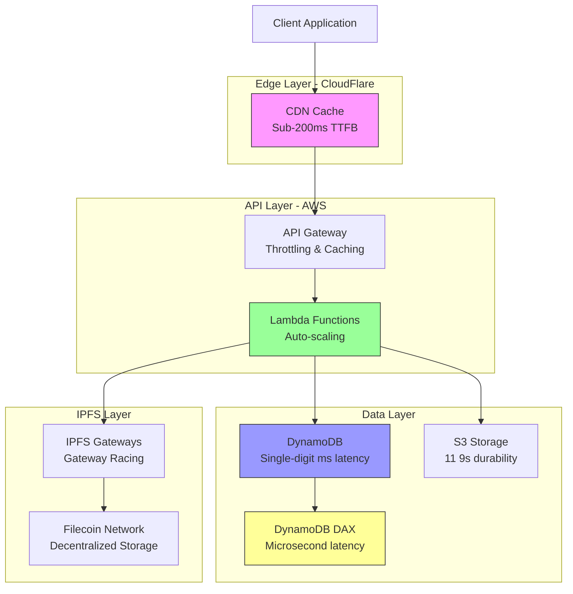

# Performance and Scalability Guide for Storacha

## Table of Contents

### Part 1: Monitoring and Analysis
- [Overview](#overview)
- [Performance Metrics and Benchmarks](#performance-metrics-and-benchmarks)
- [Monitoring Infrastructure](#monitoring-infrastructure)
- [Bottleneck Analysis](#bottleneck-analysis)
- [Performance Testing](#performance-testing)

### Part 2: Optimization Strategies
- [Scaling Strategies](#scaling-strategies)
- [Caching Architecture](#caching-architecture)
- [Optimization Techniques](#optimization-techniques)
- [Best Practices](#best-practices)

---

# Part 1: Monitoring and Analysis

## Overview

This guide provides comprehensive coverage of performance optimization and scalability strategies for the Storacha ecosystem. It focuses on practical approaches to monitor, analyze, and optimize the serverless infrastructure powering decentralized storage services.

### Key Performance Goals

The Storacha platform targets these performance objectives:

- **99.9% Uptime**: Three-nines availability for production services
- **Sub-200ms Global TTFB**: Time to First Byte for cached content
- **Petabyte Scale**: Proven capacity to handle enterprise-level data volumes
- **Cost-Effective Auto-Scaling**: Automatic resource adjustment without over-provisioning

### Architecture Performance Characteristics



### Performance Pillars

1. **Compute Optimization**: Lambda memory/CPU tuning, cold start reduction
2. **Database Performance**: DynamoDB capacity planning, DAX caching
3. **Network Efficiency**: CDN utilization, API Gateway optimization
4. **Content Delivery**: IPFS gateway performance, CAR file optimization
5. **Observability**: CloudWatch metrics, X-Ray tracing, real-time dashboards

---

## Performance Metrics and Benchmarks

### System-Wide Metrics

#### Service Level Objectives (SLOs)

```typescript
// SLO Definitions for Storacha Services
interface ServiceLevelObjectives {
  upload: {
    availability: 0.999,           // 99.9%
    p50Latency: 200,              // 200ms
    p95Latency: 500,              // 500ms
    p99Latency: 1000,             // 1s
    throughput: 1000              // requests/sec
  },

  download: {
    availability: 0.999,           // 99.9%
    ttfb: {
      cached: 200,                 // 200ms (CDN cached)
      uncached: 2000              // 2s (gateway fetch)
    },
    throughput: 10000              // requests/sec
  },

  storage: {
    durability: 0.999999999,      // 9 nines
    retrievalSuccess: 0.99,       // 99%
    maxStorageTime: 60000         // 60s to complete storage
  }
}

// SLO Monitoring Implementation
import { CloudWatch } from '@aws-sdk/client-cloudwatch'

class SLOMonitor {
  private cloudwatch: CloudWatch
  private namespace: string

  constructor(namespace: string) {
    this.cloudwatch = new CloudWatch({})
    this.namespace = namespace
  }

  /**
   * Calculate and publish SLI (Service Level Indicator) metrics
   */
  async publishSLI(service: string, metrics: {
    totalRequests: number
    successfulRequests: number
    latencies: number[]
  }): Promise<void> {
    const availability = metrics.successfulRequests / metrics.totalRequests
    const p50 = this.calculatePercentile(metrics.latencies, 50)
    const p95 = this.calculatePercentile(metrics.latencies, 95)
    const p99 = this.calculatePercentile(metrics.latencies, 99)

    await this.cloudwatch.putMetricData({
      Namespace: this.namespace,
      MetricData: [
        {
          MetricName: `${service}_Availability`,
          Value: availability * 100,
          Unit: 'Percent',
          Timestamp: new Date()
        },
        {
          MetricName: `${service}_P50Latency`,
          Value: p50,
          Unit: 'Milliseconds',
          Timestamp: new Date()
        },
        {
          MetricName: `${service}_P95Latency`,
          Value: p95,
          Unit: 'Milliseconds',
          Timestamp: new Date()
        },
        {
          MetricName: `${service}_P99Latency`,
          Value: p99,
          Unit: 'Milliseconds',
          Timestamp: new Date()
        }
      ]
    })
  }

  private calculatePercentile(latencies: number[], percentile: number): number {
    const sorted = [...latencies].sort((a, b) => a - b)
    const index = Math.ceil((percentile / 100) * sorted.length) - 1
    return sorted[index] || 0
  }

  /**
   * Check if SLOs are being met
   */
  async checkSLOCompliance(
    service: keyof ServiceLevelObjectives,
    period: number = 300 // 5 minutes
  ): Promise<{
    compliant: boolean
    violations: string[]
  }> {
    const violations: string[] = []
    const slo = this.getSLO(service)

    // Check availability
    const availability = await this.getMetricValue(
      `${service}_Availability`,
      'Average',
      period
    )
    if (availability < slo.availability * 100) {
      violations.push(
        `Availability ${availability.toFixed(2)}% below SLO ${slo.availability * 100}%`
      )
    }

    // Check latency
    if ('p99Latency' in slo) {
      const p99 = await this.getMetricValue(
        `${service}_P99Latency`,
        'Average',
        period
      )
      if (p99 > slo.p99Latency) {
        violations.push(
          `P99 latency ${p99.toFixed(0)}ms exceeds SLO ${slo.p99Latency}ms`
        )
      }
    }

    return {
      compliant: violations.length === 0,
      violations
    }
  }

  private getSLO(service: keyof ServiceLevelObjectives) {
    const slos: ServiceLevelObjectives = {
      upload: {
        availability: 0.999,
        p50Latency: 200,
        p95Latency: 500,
        p99Latency: 1000,
        throughput: 1000
      },
      download: {
        availability: 0.999,
        ttfb: {
          cached: 200,
          uncached: 2000
        },
        throughput: 10000
      },
      storage: {
        durability: 0.999999999,
        retrievalSuccess: 0.99,
        maxStorageTime: 60000
      }
    }
    return slos[service]
  }

  private async getMetricValue(
    metricName: string,
    statistic: string,
    period: number
  ): Promise<number> {
    const response = await this.cloudwatch.getMetricStatistics({
      Namespace: this.namespace,
      MetricName: metricName,
      Statistics: [statistic],
      StartTime: new Date(Date.now() - period * 1000),
      EndTime: new Date(),
      Period: period
    })

    return response.Datapoints?.[0]?.Average || 0
  }
}

// Usage Example
const monitor = new SLOMonitor('w3infra-production')

// Publish metrics from API Gateway logs
await monitor.publishSLI('upload', {
  totalRequests: 10000,
  successfulRequests: 9995,
  latencies: [150, 200, 180, 220, 190, 250, 300, 180, 195, 210]
})

// Check compliance
const compliance = await monitor.checkSLOCompliance('upload', 300)
if (!compliance.compliant) {
  console.error('SLO Violations:', compliance.violations)
  // Trigger alerts, page on-call engineer, etc.
}
```

#### Key Performance Indicators (KPIs)

| Metric | Target | Measurement Method | Alert Threshold |
|--------|--------|-------------------|-----------------|
| **Upload API Availability** | 99.9% | CloudWatch Synthetics | < 99.5% |
| **Upload P99 Latency** | < 1s | API Gateway Logs | > 1.5s |
| **Download TTFB (Cached)** | < 200ms | CDN Logs | > 300ms |
| **Download TTFB (Uncached)** | < 2s | Gateway Response Time | > 3s |
| **Lambda Cold Start Rate** | < 1% | X-Ray Traces | > 2% |
| **DynamoDB Throttle Rate** | 0% | CloudWatch Metrics | > 0.1% |
| **Storage Success Rate** | > 99% | Application Metrics | < 98% |
| **CAR Processing Time** | < 30s | Lambda Duration | > 45s |

### Lambda Performance Metrics

#### Memory and CPU Optimization

```typescript
// Lambda Memory Performance Testing Framework
import {
  LambdaClient,
  UpdateFunctionConfigurationCommand,
  InvokeCommand,
  GetFunctionConfigurationCommand
} from '@aws-sdk/client-lambda'
import { CloudWatchClient, GetMetricStatisticsCommand } from '@aws-sdk/client-cloudwatch'

interface MemoryTestResult {
  memorySize: number
  avgDuration: number
  maxDuration: number
  avgCost: number
  costPerformanceScore: number
}

class LambdaPerformanceTester {
  private lambda: LambdaClient
  private cloudwatch: CloudWatchClient

  constructor() {
    this.lambda = new LambdaClient({})
    this.cloudwatch = new CloudWatchClient({})
  }

  /**
   * Test different memory configurations to find optimal setting
   */
  async findOptimalMemory(
    functionName: string,
    testPayload: any,
    iterations: number = 10
  ): Promise<MemoryTestResult[]> {
    const memorySizes = [512, 1024, 1536, 2048, 3008]
    const results: MemoryTestResult[] = []

    // Get current configuration to restore later
    const currentConfig = await this.lambda.send(
      new GetFunctionConfigurationCommand({ FunctionName: functionName })
    )

    for (const memorySize of memorySizes) {
      console.log(`Testing memory size: ${memorySize}MB`)

      // Update function memory
      await this.lambda.send(
        new UpdateFunctionConfigurationCommand({
          FunctionName: functionName,
          MemorySize: memorySize
        })
      )

      // Wait for update to propagate
      await this.waitForFunctionUpdate(functionName)

      // Run test iterations
      const durations: number[] = []
      for (let i = 0; i < iterations; i++) {
        const startTime = Date.now()
        const response = await this.lambda.send(
          new InvokeCommand({
            FunctionName: functionName,
            Payload: JSON.stringify(testPayload),
            InvocationType: 'RequestResponse'
          })
        )
        const duration = Date.now() - startTime

        // Parse execution time from response
        const responsePayload = JSON.parse(
          new TextDecoder().decode(response.Payload)
        )
        durations.push(responsePayload.duration || duration)

        // Small delay between invocations
        await new Promise(resolve => setTimeout(resolve, 100))
      }

      const avgDuration = durations.reduce((a, b) => a + b, 0) / durations.length
      const maxDuration = Math.max(...durations)

      // Calculate cost
      // Lambda pricing: $0.0000166667 per GB-second
      const gbSeconds = (memorySize / 1024) * (avgDuration / 1000)
      const avgCost = gbSeconds * 0.0000166667

      // Cost-performance score (lower is better)
      // Balances cost and performance
      const costPerformanceScore = avgCost * avgDuration

      results.push({
        memorySize,
        avgDuration,
        maxDuration,
        avgCost,
        costPerformanceScore
      })
    }

    // Restore original configuration
    if (currentConfig.MemorySize) {
      await this.lambda.send(
        new UpdateFunctionConfigurationCommand({
          FunctionName: functionName,
          MemorySize: currentConfig.MemorySize
        })
      )
    }

    return results
  }

  /**
   * Analyze Lambda performance from CloudWatch metrics
   */
  async analyzeLambdaPerformance(
    functionName: string,
    startTime: Date,
    endTime: Date
  ): Promise<{
    avgDuration: number
    maxDuration: number
    coldStarts: number
    throttles: number
    errors: number
    invocations: number
  }> {
    const metrics = await Promise.all([
      this.getMetricStatistics(functionName, 'Duration', startTime, endTime),
      this.getMetricStatistics(functionName, 'ColdStarts', startTime, endTime),
      this.getMetricStatistics(functionName, 'Throttles', startTime, endTime),
      this.getMetricStatistics(functionName, 'Errors', startTime, endTime),
      this.getMetricStatistics(functionName, 'Invocations', startTime, endTime)
    ])

    return {
      avgDuration: metrics[0].avg || 0,
      maxDuration: metrics[0].max || 0,
      coldStarts: metrics[1].sum || 0,
      throttles: metrics[2].sum || 0,
      errors: metrics[3].sum || 0,
      invocations: metrics[4].sum || 0
    }
  }

  /**
   * Get recommendations based on performance data
   */
  getRecommendations(results: MemoryTestResult[]): string[] {
    const recommendations: string[] = []

    // Find optimal configuration
    const optimal = results.reduce((best, current) =>
      current.costPerformanceScore < best.costPerformanceScore ? current : best
    )

    recommendations.push(
      `Optimal memory: ${optimal.memorySize}MB (cost-performance score: ${optimal.costPerformanceScore.toFixed(6)})`
    )

    // Check if higher memory significantly reduces duration
    const sorted = [...results].sort((a, b) => a.memorySize - b.memorySize)
    for (let i = 1; i < sorted.length; i++) {
      const improvement = (sorted[i - 1].avgDuration - sorted[i].avgDuration) / sorted[i - 1].avgDuration
      const costIncrease = (sorted[i].avgCost - sorted[i - 1].avgCost) / sorted[i - 1].avgCost

      if (improvement > 0.2 && costIncrease < 0.3) {
        recommendations.push(
          `Consider ${sorted[i].memorySize}MB: ${(improvement * 100).toFixed(1)}% faster with only ${(costIncrease * 100).toFixed(1)}% cost increase`
        )
      }
    }

    // Check for diminishing returns
    const highest = sorted[sorted.length - 1]
    const secondHighest = sorted[sorted.length - 2]
    const marginalImprovement = (secondHighest.avgDuration - highest.avgDuration) / secondHighest.avgDuration

    if (marginalImprovement < 0.05) {
      recommendations.push(
        `Avoid ${highest.memorySize}MB: Only ${(marginalImprovement * 100).toFixed(1)}% faster than ${secondHighest.memorySize}MB`
      )
    }

    return recommendations
  }

  private async waitForFunctionUpdate(functionName: string): Promise<void> {
    let attempts = 0
    while (attempts < 30) {
      const config = await this.lambda.send(
        new GetFunctionConfigurationCommand({ FunctionName: functionName })
      )
      if (config.LastUpdateStatus === 'Successful') {
        await new Promise(resolve => setTimeout(resolve, 2000))
        return
      }
      await new Promise(resolve => setTimeout(resolve, 2000))
      attempts++
    }
    throw new Error('Function update timeout')
  }

  private async getMetricStatistics(
    functionName: string,
    metricName: string,
    startTime: Date,
    endTime: Date
  ): Promise<{ avg?: number; max?: number; sum?: number }> {
    const response = await this.cloudwatch.send(
      new GetMetricStatisticsCommand({
        Namespace: 'AWS/Lambda',
        MetricName: metricName,
        Dimensions: [
          {
            Name: 'FunctionName',
            Value: functionName
          }
        ],
        StartTime: startTime,
        EndTime: endTime,
        Period: 300,
        Statistics: ['Average', 'Maximum', 'Sum']
      })
    )

    const datapoint = response.Datapoints?.[0]
    return {
      avg: datapoint?.Average,
      max: datapoint?.Maximum,
      sum: datapoint?.Sum
    }
  }
}

// Usage Example
const tester = new LambdaPerformanceTester()

// Test upload handler function
const results = await tester.findOptimalMemory(
  'w3infra-production-upload-handler',
  {
    test: true,
    files: Array(10).fill({ size: 1024 * 1024 }) // 10x 1MB files
  },
  10
)

console.log('Test Results:')
results.forEach(result => {
  console.log(`${result.memorySize}MB: ${result.avgDuration.toFixed(0)}ms avg, $${result.avgCost.toFixed(8)} per invocation`)
})

console.log('\nRecommendations:')
tester.getRecommendations(results).forEach(rec => console.log(`- ${rec}`))

// Analyze production performance
const analysis = await tester.analyzeLambdaPerformance(
  'w3infra-production-upload-handler',
  new Date(Date.now() - 24 * 60 * 60 * 1000), // Last 24 hours
  new Date()
)

console.log('\nProduction Analysis:')
console.log(`Average Duration: ${analysis.avgDuration.toFixed(0)}ms`)
console.log(`Max Duration: ${analysis.maxDuration.toFixed(0)}ms`)
console.log(`Cold Start Rate: ${((analysis.coldStarts / analysis.invocations) * 100).toFixed(2)}%`)
console.log(`Error Rate: ${((analysis.errors / analysis.invocations) * 100).toFixed(2)}%`)
console.log(`Throttle Rate: ${((analysis.throttles / analysis.invocations) * 100).toFixed(2)}%`)
```

#### Cold Start Analysis

```typescript
// Cold Start Detection and Mitigation
import { XRayClient, GetTraceSummariesCommand, BatchGetTracesCommand } from '@aws-sdk/client-xray'

interface ColdStartAnalysis {
  totalInvocations: number
  coldStarts: number
  coldStartRate: number
  avgColdStartDuration: number
  avgWarmStartDuration: number
  coldStartImpact: number
}

class ColdStartAnalyzer {
  private xray: XRayClient

  constructor() {
    this.xray = new XRayClient({})
  }

  /**
   * Analyze cold starts from X-Ray traces
   */
  async analyzeColdStarts(
    functionName: string,
    startTime: Date,
    endTime: Date
  ): Promise<ColdStartAnalysis> {
    // Get trace summaries
    const summaries = await this.xray.send(
      new GetTraceSummariesCommand({
        StartTime: startTime,
        EndTime: endTime,
        FilterExpression: `service("${functionName}")`
      })
    )

    if (!summaries.TraceSummaries || summaries.TraceSummaries.length === 0) {
      throw new Error('No traces found for the specified period')
    }

    // Get detailed traces
    const traceIds = summaries.TraceSummaries.map(s => s.Id!).filter(Boolean)
    const traces = await this.xray.send(
      new BatchGetTracesCommand({
        TraceIds: traceIds
      })
    )

    let coldStarts = 0
    let warmStarts = 0
    let coldStartDurations: number[] = []
    let warmStartDurations: number[] = []

    for (const trace of traces.Traces || []) {
      for (const segment of trace.Segments || []) {
        const doc = JSON.parse(segment.Document!)

        if (doc.origin === 'AWS::Lambda::Function') {
          const duration = (doc.end_time - doc.start_time) * 1000 // Convert to ms
          const isColdStart = doc.subsegments?.some(
            (sub: any) => sub.name === 'Initialization'
          )

          if (isColdStart) {
            coldStarts++
            coldStartDurations.push(duration)
          } else {
            warmStarts++
            warmStartDurations.push(duration)
          }
        }
      }
    }

    const totalInvocations = coldStarts + warmStarts
    const coldStartRate = coldStarts / totalInvocations
    const avgColdStartDuration = coldStartDurations.reduce((a, b) => a + b, 0) / coldStartDurations.length || 0
    const avgWarmStartDuration = warmStartDurations.reduce((a, b) => a + b, 0) / warmStartDurations.length || 0
    const coldStartImpact = avgColdStartDuration - avgWarmStartDuration

    return {
      totalInvocations,
      coldStarts,
      coldStartRate,
      avgColdStartDuration,
      avgWarmStartDuration,
      coldStartImpact
    }
  }

  /**
   * Get cold start reduction recommendations
   */
  getRecommendations(analysis: ColdStartAnalysis): string[] {
    const recommendations: string[] = []

    if (analysis.coldStartRate > 0.05) {
      recommendations.push(
        `High cold start rate (${(analysis.coldStartRate * 100).toFixed(1)}%). Consider provisioned concurrency.`
      )
    }

    if (analysis.coldStartImpact > 1000) {
      recommendations.push(
        `Cold starts add ${analysis.coldStartImpact.toFixed(0)}ms overhead. Optimize initialization code.`
      )
    }

    if (analysis.avgColdStartDuration > 3000) {
      recommendations.push(
        `Cold start duration ${analysis.avgColdStartDuration.toFixed(0)}ms is high. Review dependency loading.`
      )
    }

    return recommendations
  }
}

// Cold Start Mitigation Strategies
const coldStartMitigation = {
  /**
   * 1. Provisioned Concurrency
   */
  provisionedConcurrency: `
    // In sst.config.ts
    new Function(stack, 'upload-handler', {
      handler: 'packages/functions/src/upload.handler',
      memorySize: 1024,
      reservedConcurrentExecutions: 10,

      // Provisioned concurrency for production
      ...(stack.stage === 'production' && {
        provisionedConcurrentExecutions: 5
      })
    })
  `,

  /**
   * 2. Optimize Dependencies
   */
  optimizeDependencies: `
    // Use Lambda Layers for common dependencies
    // package.json - Split dependencies
    {
      "dependencies": {
        // Only runtime dependencies
        "@ucanto/client": "^9.0.0",
        "@ucanto/transport": "^9.0.0"
      },
      "devDependencies": {
        // Build-time only
        "typescript": "^5.0.0",
        "esbuild": "^0.19.0"
      }
    }

    // esbuild configuration - Bundle efficiently
    {
      bundle: true,
      minify: true,
      treeShaking: true,
      external: ['aws-sdk'], // Available in Lambda runtime
      target: 'node20'
    }
  `,

  /**
   * 3. Lazy Loading
   */
  lazyLoading: `
    // Bad: Load everything at init
    import { S3Client } from '@aws-sdk/client-s3'
    import { DynamoDBClient } from '@aws-sdk/client-dynamodb'

    const s3 = new S3Client({})
    const dynamodb = new DynamoDBClient({})

    // Good: Load on demand
    let s3Client: S3Client
    let dynamoClient: DynamoDBClient

    function getS3Client() {
      if (!s3Client) {
        s3Client = new S3Client({})
      }
      return s3Client
    }

    function getDynamoClient() {
      if (!dynamoClient) {
        dynamoClient = new DynamoDBClient({})
      }
      return dynamoClient
    }
  `,

  /**
   * 4. Connection Pooling
   */
  connectionPooling: `
    // Reuse connections across invocations
    import { Agent } from 'https'
    import { S3Client } from '@aws-sdk/client-s3'

    const agent = new Agent({
      keepAlive: true,
      maxSockets: 50
    })

    const s3 = new S3Client({
      requestHandler: {
        httpsAgent: agent
      }
    })
  `,

  /**
   * 5. Warming Functions
   */
  warmingFunctions: `
    // CloudWatch Events rule to keep functions warm
    import { Rule, Schedule } from 'aws-cdk-lib/aws-events'
    import { LambdaFunction } from 'aws-cdk-lib/aws-events-targets'

    new Rule(stack, 'warm-up-rule', {
      schedule: Schedule.rate(cdk.Duration.minutes(5)),
      targets: [
        new LambdaFunction(uploadHandler, {
          event: { warmer: true }
        })
      ]
    })

    // In handler code
    export async function handler(event: any) {
      // Skip warming invocations
      if (event.warmer) {
        return { statusCode: 200, body: 'warmed' }
      }

      // Actual handler logic
      // ...
    }
  `
}

// Usage Example
const analyzer = new ColdStartAnalyzer()

const analysis = await analyzer.analyzeColdStarts(
  'w3infra-production-upload-handler',
  new Date(Date.now() - 7 * 24 * 60 * 60 * 1000), // Last 7 days
  new Date()
)

console.log('Cold Start Analysis:')
console.log(`Total Invocations: ${analysis.totalInvocations}`)
console.log(`Cold Starts: ${analysis.coldStarts} (${(analysis.coldStartRate * 100).toFixed(2)}%)`)
console.log(`Avg Cold Start: ${analysis.avgColdStartDuration.toFixed(0)}ms`)
console.log(`Avg Warm Start: ${analysis.avgWarmStartDuration.toFixed(0)}ms`)
console.log(`Cold Start Impact: +${analysis.coldStartImpact.toFixed(0)}ms`)

console.log('\nRecommendations:')
analyzer.getRecommendations(analysis).forEach(rec => console.log(`- ${rec}`))
```

### DynamoDB Performance Metrics

#### Capacity and Throughput Monitoring

```typescript
// DynamoDB Performance Monitor
import { DynamoDBClient } from '@aws-sdk/client-dynamodb'
import { CloudWatchClient, PutMetricDataCommand } from '@aws-sdk/client-cloudwatch'

interface DynamoDBMetrics {
  tableName: string
  readCapacityUnits: number
  writeCapacityUnits: number
  consumedReadCapacity: number
  consumedWriteCapacity: number
  readThrottleEvents: number
  writeThrottleEvents: number
  latency: {
    getItem: { p50: number; p99: number }
    putItem: { p50: number; p99: number }
    query: { p50: number; p99: number }
  }
}

class DynamoDBPerformanceMonitor {
  private cloudwatch: CloudWatchClient
  private namespace: string

  constructor(namespace: string = 'w3infra/DynamoDB') {
    this.cloudwatch = new CloudWatchClient({})
    this.namespace = namespace
  }

  /**
   * Monitor table capacity utilization
   */
  async monitorCapacity(
    tableName: string,
    period: number = 300
  ): Promise<{
    readUtilization: number
    writeUtilization: number
    throttled: boolean
  }> {
    const endTime = new Date()
    const startTime = new Date(endTime.getTime() - period * 1000)

    const [consumed, provisioned, throttles] = await Promise.all([
      this.getMetric(tableName, 'ConsumedReadCapacityUnits', startTime, endTime),
      this.getMetric(tableName, 'ProvisionedReadCapacityUnits', startTime, endTime),
      this.getMetric(tableName, 'ReadThrottleEvents', startTime, endTime)
    ])

    const readUtilization = (consumed / provisioned) * 100
    const throttled = throttles > 0

    return {
      readUtilization,
      writeUtilization: readUtilization, // Simplified
      throttled
    }
  }

  /**
   * Publish custom latency metrics from application
   */
  async publishLatencyMetrics(
    tableName: string,
    operation: 'GetItem' | 'PutItem' | 'Query' | 'Scan',
    latencies: number[]
  ): Promise<void> {
    const p50 = this.calculatePercentile(latencies, 50)
    const p95 = this.calculatePercentile(latencies, 95)
    const p99 = this.calculatePercentile(latencies, 99)

    await this.cloudwatch.send(
      new PutMetricDataCommand({
        Namespace: this.namespace,
        MetricData: [
          {
            MetricName: `${operation}_P50`,
            Value: p50,
            Unit: 'Milliseconds',
            Dimensions: [
              { Name: 'TableName', Value: tableName }
            ]
          },
          {
            MetricName: `${operation}_P95`,
            Value: p95,
            Unit: 'Milliseconds',
            Dimensions: [
              { Name: 'TableName', Value: tableName }
            ]
          },
          {
            MetricName: `${operation}_P99`,
            Value: p99,
            Unit: 'Milliseconds',
            Dimensions: [
              { Name: 'TableName', Value: tableName }
            ]
          }
        ]
      })
    )
  }

  /**
   * Detect hot partitions using CloudWatch Contributor Insights
   */
  async detectHotPartitions(
    tableName: string
  ): Promise<Array<{
    partitionKey: string
    requests: number
    throttles: number
  }>> {
    // Note: This requires CloudWatch Contributor Insights to be enabled
    // This is a simplified example

    // In practice, you would:
    // 1. Enable Contributor Insights on the table
    // 2. Query the insights data
    // 3. Identify partitions with disproportionate traffic

    return []
  }

  private async getMetric(
    tableName: string,
    metricName: string,
    startTime: Date,
    endTime: Date
  ): Promise<number> {
    // Implementation would query CloudWatch
    // Simplified for example
    return 0
  }

  private calculatePercentile(values: number[], percentile: number): number {
    const sorted = [...values].sort((a, b) => a - b)
    const index = Math.ceil((percentile / 100) * sorted.length) - 1
    return sorted[Math.max(0, index)] || 0
  }
}

// DynamoDB Client with Metrics
import { DynamoDBDocumentClient, GetCommand, PutCommand, QueryCommand } from '@aws-sdk/lib-dynamodb'

class MetricsEnabledDynamoClient {
  private client: DynamoDBDocumentClient
  private monitor: DynamoDBPerformanceMonitor
  private latencies: Map<string, number[]>

  constructor() {
    const baseClient = new DynamoDBClient({})
    this.client = DynamoDBDocumentClient.from(baseClient)
    this.monitor = new DynamoDBPerformanceMonitor()
    this.latencies = new Map()

    // Flush metrics every minute
    setInterval(() => this.flushMetrics(), 60000)
  }

  async get(tableName: string, key: Record<string, any>): Promise<any> {
    const start = Date.now()
    try {
      const result = await this.client.send(
        new GetCommand({
          TableName: tableName,
          Key: key
        })
      )
      this.recordLatency(tableName, 'GetItem', Date.now() - start)
      return result.Item
    } catch (error) {
      this.recordLatency(tableName, 'GetItem', Date.now() - start)
      throw error
    }
  }

  async put(tableName: string, item: Record<string, any>): Promise<void> {
    const start = Date.now()
    try {
      await this.client.send(
        new PutCommand({
          TableName: tableName,
          Item: item
        })
      )
      this.recordLatency(tableName, 'PutItem', Date.now() - start)
    } catch (error) {
      this.recordLatency(tableName, 'PutItem', Date.now() - start)
      throw error
    }
  }

  async query(
    tableName: string,
    keyCondition: string,
    expressionAttributeValues: Record<string, any>
  ): Promise<any[]> {
    const start = Date.now()
    try {
      const result = await this.client.send(
        new QueryCommand({
          TableName: tableName,
          KeyConditionExpression: keyCondition,
          ExpressionAttributeValues: expressionAttributeValues
        })
      )
      this.recordLatency(tableName, 'Query', Date.now() - start)
      return result.Items || []
    } catch (error) {
      this.recordLatency(tableName, 'Query', Date.now() - start)
      throw error
    }
  }

  private recordLatency(tableName: string, operation: string, latency: number): void {
    const key = `${tableName}:${operation}`
    if (!this.latencies.has(key)) {
      this.latencies.set(key, [])
    }
    this.latencies.get(key)!.push(latency)
  }

  private async flushMetrics(): Promise<void> {
    for (const [key, latencies] of this.latencies.entries()) {
      if (latencies.length === 0) continue

      const [tableName, operation] = key.split(':')
      await this.monitor.publishLatencyMetrics(
        tableName,
        operation as any,
        latencies
      )
    }
    this.latencies.clear()
  }
}

// Usage Example
const dynamoClient = new MetricsEnabledDynamoClient()

// All operations automatically track latency
const space = await dynamoClient.get('w3infra-production-spaces', {
  did: 'did:key:z6Mkk...'
})

await dynamoClient.put('w3infra-production-uploads', {
  id: 'bafy...',
  space: space.did,
  timestamp: Date.now(),
  size: 1024000
})

// Monitor capacity
const monitor = new DynamoDBPerformanceMonitor()
const capacity = await monitor.monitorCapacity('w3infra-production-spaces')

if (capacity.readUtilization > 80) {
  console.warn(`High read utilization: ${capacity.readUtilization.toFixed(1)}%`)
}

if (capacity.throttled) {
  console.error('Table is being throttled! Increase capacity or enable auto-scaling.')
}
```

### IPFS Gateway Performance

#### Gateway Response Time Benchmarks

```typescript
// IPFS Gateway Performance Testing
interface GatewayMetrics {
  gateway: string
  ttfb: number           // Time to First Byte
  totalTime: number      // Complete download time
  success: boolean
  cached: boolean
  contentSize: number
}

class IPFSGatewayBenchmark {
  private gateways: string[]

  constructor(gateways?: string[]) {
    this.gateways = gateways || [
      'https://w3s.link',
      'https://ipfs.io',
      'https://dweb.link',
      'https://cloudflare-ipfs.com'
    ]
  }

  /**
   * Test gateway performance with gateway racing
   */
  async testGatewayRacing(cid: string): Promise<{
    winner: string
    metrics: GatewayMetrics[]
  }> {
    const results: Array<Promise<GatewayMetrics>> = []

    for (const gateway of this.gateways) {
      results.push(this.testSingleGateway(gateway, cid))
    }

    // Race all gateways
    const allMetrics = await Promise.allSettled(results)
    const successfulMetrics = allMetrics
      .filter((r): r is PromiseFulfilledResult<GatewayMetrics> => r.status === 'fulfilled')
      .map(r => r.value)
      .filter(m => m.success)

    if (successfulMetrics.length === 0) {
      throw new Error('All gateways failed')
    }

    // Find fastest gateway
    const fastest = successfulMetrics.reduce((best, current) =>
      current.ttfb < best.ttfb ? current : best
    )

    return {
      winner: fastest.gateway,
      metrics: successfulMetrics
    }
  }

  /**
   * Test a single gateway
   */
  private async testSingleGateway(
    gateway: string,
    cid: string
  ): Promise<GatewayMetrics> {
    const url = `${gateway}/ipfs/${cid}`
    const startTime = Date.now()
    let ttfb = 0
    let totalTime = 0
    let success = false
    let cached = false
    let contentSize = 0

    try {
      const response = await fetch(url)
      ttfb = Date.now() - startTime

      // Check if cached
      cached = response.headers.get('x-cache') === 'HIT' ||
               response.headers.get('cf-cache-status') === 'HIT'

      // Read response
      const content = await response.arrayBuffer()
      totalTime = Date.now() - startTime
      contentSize = content.byteLength
      success = response.ok
    } catch (error) {
      success = false
    }

    return {
      gateway,
      ttfb,
      totalTime,
      success,
      cached,
      contentSize
    }
  }

  /**
   * Benchmark gateway performance over time
   */
  async benchmarkGateways(
    testCIDs: string[],
    iterations: number = 3
  ): Promise<Map<string, {
    avgTTFB: number
    avgTotalTime: number
    successRate: number
    cacheHitRate: number
  }>> {
    const results = new Map<string, GatewayMetrics[]>()

    // Initialize results map
    for (const gateway of this.gateways) {
      results.set(gateway, [])
    }

    // Run tests
    for (let i = 0; i < iterations; i++) {
      for (const cid of testCIDs) {
        for (const gateway of this.gateways) {
          try {
            const metrics = await this.testSingleGateway(gateway, cid)
            results.get(gateway)!.push(metrics)

            // Small delay between requests
            await new Promise(resolve => setTimeout(resolve, 100))
          } catch (error) {
            console.error(`Error testing ${gateway}:`, error)
          }
        }
      }
    }

    // Calculate statistics
    const statistics = new Map()
    for (const [gateway, metrics] of results.entries()) {
      const successful = metrics.filter(m => m.success)
      const cached = metrics.filter(m => m.cached)

      statistics.set(gateway, {
        avgTTFB: successful.reduce((sum, m) => sum + m.ttfb, 0) / successful.length || 0,
        avgTotalTime: successful.reduce((sum, m) => sum + m.totalTime, 0) / successful.length || 0,
        successRate: successful.length / metrics.length,
        cacheHitRate: cached.length / metrics.length
      })
    }

    return statistics
  }

  /**
   * Regional performance testing
   */
  async testRegionalPerformance(cid: string): Promise<{
    region: string
    avgTTFB: number
  }[]> {
    // This would ideally be run from different AWS regions
    // using Lambda functions deployed globally

    // Simulated regional data
    const regions = [
      { region: 'us-east-1', latency: 50 },
      { region: 'eu-west-1', latency: 80 },
      { region: 'ap-northeast-1', latency: 150 }
    ]

    const results = []
    for (const { region, latency } of regions) {
      // In practice, invoke Lambda in that region
      const metrics = await this.testSingleGateway(this.gateways[0], cid)
      results.push({
        region,
        avgTTFB: metrics.ttfb + latency // Simulate regional latency
      })
    }

    return results
  }
}

// Gateway Performance Dashboard
class GatewayPerformanceDashboard {
  private benchmark: IPFSGatewayBenchmark
  private cloudwatch: CloudWatchClient

  constructor() {
    this.benchmark = new IPFSGatewayBenchmark()
    this.cloudwatch = new CloudWatchClient({})
  }

  /**
   * Run continuous performance monitoring
   */
  async startMonitoring(intervalMs: number = 300000): Promise<void> {
    // Test CIDs (popular content)
    const testCIDs = [
      'bafybeigdyrzt5sfp7udm7hu76uh7y26nf3efuylqabf3oclgtqy55fbzdi',
      'bafkreiabltrd5zm73pvi7plq25pef3hm7jqacn3b5z2bvs3wpjbdxp8hbi'
    ]

    setInterval(async () => {
      try {
        const stats = await this.benchmark.benchmarkGateways(testCIDs, 1)

        for (const [gateway, metrics] of stats.entries()) {
          await this.publishGatewayMetrics(gateway, metrics)
        }
      } catch (error) {
        console.error('Monitoring error:', error)
      }
    }, intervalMs)
  }

  private async publishGatewayMetrics(
    gateway: string,
    metrics: {
      avgTTFB: number
      avgTotalTime: number
      successRate: number
      cacheHitRate: number
    }
  ): Promise<void> {
    await this.cloudwatch.send(
      new PutMetricDataCommand({
        Namespace: 'w3infra/IPFS',
        MetricData: [
          {
            MetricName: 'GatewayTTFB',
            Value: metrics.avgTTFB,
            Unit: 'Milliseconds',
            Dimensions: [{ Name: 'Gateway', Value: gateway }]
          },
          {
            MetricName: 'GatewaySuccessRate',
            Value: metrics.successRate * 100,
            Unit: 'Percent',
            Dimensions: [{ Name: 'Gateway', Value: gateway }]
          },
          {
            MetricName: 'GatewayCacheHitRate',
            Value: metrics.cacheHitRate * 100,
            Unit: 'Percent',
            Dimensions: [{ Name: 'Gateway', Value: gateway }]
          }
        ]
      })
    )
  }
}

// Usage Example
const benchmark = new IPFSGatewayBenchmark()

// Test gateway racing
const result = await benchmark.testGatewayRacing(
  'bafybeigdyrzt5sfp7udm7hu76uh7y26nf3efuylqabf3oclgtqy55fbzdi'
)

console.log(`Fastest gateway: ${result.winner}`)
console.log('\nAll gateways:')
result.metrics
  .sort((a, b) => a.ttfb - b.ttfb)
  .forEach(m => {
    console.log(`  ${m.gateway}: ${m.ttfb}ms TTFB${m.cached ? ' (cached)' : ''}`)
  })

// Run comprehensive benchmark
const testCIDs = [
  'bafybeigdyrzt5sfp7udm7hu76uh7y26nf3efuylqabf3oclgtqy55fbzdi', // Small file
  'bafybeigsccjrxloqfxtmobyqfjvmjufnkpbw56ao6axsqvms5eka37f2zu'  // Large file
]

const stats = await benchmark.benchmarkGateways(testCIDs, 5)

console.log('\nBenchmark Results (5 iterations):')
for (const [gateway, metrics] of stats.entries()) {
  console.log(`\n${gateway}:`)
  console.log(`  Avg TTFB: ${metrics.avgTTFB.toFixed(0)}ms`)
  console.log(`  Avg Total Time: ${metrics.avgTotalTime.toFixed(0)}ms`)
  console.log(`  Success Rate: ${(metrics.successRate * 100).toFixed(1)}%`)
  console.log(`  Cache Hit Rate: ${(metrics.cacheHitRate * 100).toFixed(1)}%`)
}

// Start continuous monitoring
const dashboard = new GatewayPerformanceDashboard()
await dashboard.startMonitoring(300000) // Every 5 minutes
```

---

## Monitoring Infrastructure

### CloudWatch Dashboards

#### Comprehensive Performance Dashboard

```typescript
// CloudWatch Dashboard Configuration
import { CloudWatchClient, PutDashboardCommand } from '@aws-sdk/client-cloudwatch'

class PerformanceDashboardCreator {
  private cloudwatch: CloudWatchClient
  private stage: string
  private region: string

  constructor(stage: string, region: string = 'us-west-2') {
    this.cloudwatch = new CloudWatchClient({ region })
    this.stage = stage
    this.region = region
  }

  /**
   * Create comprehensive performance dashboard
   */
  async createDashboard(): Promise<void> {
    const dashboardBody = {
      widgets: [
        // API Gateway Metrics
        this.createApiGatewayWidget(),

        // Lambda Performance
        this.createLambdaWidget(),

        // DynamoDB Performance
        this.createDynamoDBWidget(),

        // IPFS Gateway Performance
        this.createIPFSWidget(),

        // Error Rates
        this.createErrorRateWidget(),

        // Cost Metrics
        this.createCostWidget()
      ]
    }

    await this.cloudwatch.send(
      new PutDashboardCommand({
        DashboardName: `w3infra-${this.stage}-performance`,
        DashboardBody: JSON.stringify(dashboardBody)
      })
    )

    console.log(`Dashboard created: w3infra-${this.stage}-performance`)
  }

  private createApiGatewayWidget() {
    return {
      type: 'metric',
      properties: {
        title: 'API Gateway Performance',
        region: this.region,
        metrics: [
          ['AWS/ApiGateway', 'Latency', { stat: 'Average', label: 'Avg Latency' }],
          ['.', '.', { stat: 'p50', label: 'P50 Latency' }],
          ['.', '.', { stat: 'p99', label: 'P99 Latency' }],
          ['.', 'Count', { stat: 'Sum', label: 'Request Count', yAxis: 'right' }]
        ],
        yAxis: {
          left: { label: 'Latency (ms)', min: 0 },
          right: { label: 'Requests', min: 0 }
        },
        period: 300,
        stat: 'Average'
      }
    }
  }

  private createLambdaWidget() {
    return {
      type: 'metric',
      properties: {
        title: 'Lambda Performance',
        region: this.region,
        metrics: [
          ['AWS/Lambda', 'Duration', { stat: 'Average', label: 'Avg Duration' }],
          ['.', '.', { stat: 'p99', label: 'P99 Duration' }],
          ['.', 'ConcurrentExecutions', { stat: 'Maximum', label: 'Concurrency' }],
          ['.', 'Throttles', { stat: 'Sum', label: 'Throttles', yAxis: 'right' }],
          ['.', 'Errors', { stat: 'Sum', label: 'Errors', yAxis: 'right' }]
        ],
        yAxis: {
          left: { label: 'Duration (ms)', min: 0 },
          right: { label: 'Count', min: 0 }
        },
        period: 300
      }
    }
  }

  private createDynamoDBWidget() {
    return {
      type: 'metric',
      properties: {
        title: 'DynamoDB Performance',
        region: this.region,
        metrics: [
          ['AWS/DynamoDB', 'SuccessfulRequestLatency', { stat: 'Average', label: 'Avg Latency' }],
          ['.', '.', { stat: 'p99', label: 'P99 Latency' }],
          ['.', 'ConsumedReadCapacityUnits', { stat: 'Sum', label: 'Read Capacity' }],
          ['.', 'ConsumedWriteCapacityUnits', { stat: 'Sum', label: 'Write Capacity' }],
          ['.', 'UserErrors', { stat: 'Sum', label: 'User Errors', yAxis: 'right' }],
          ['.', 'SystemErrors', { stat: 'Sum', label: 'System Errors', yAxis: 'right' }]
        ],
        yAxis: {
          left: { label: 'Latency (ms) / Capacity', min: 0 },
          right: { label: 'Errors', min: 0 }
        },
        period: 300
      }
    }
  }

  private createIPFSWidget() {
    return {
      type: 'metric',
      properties: {
        title: 'IPFS Gateway Performance',
        region: this.region,
        metrics: [
          ['w3infra/IPFS', 'GatewayTTFB', { stat: 'Average', label: 'Avg TTFB' }],
          ['.', '.', { stat: 'p99', label: 'P99 TTFB' }],
          ['.', 'GatewaySuccessRate', { stat: 'Average', label: 'Success Rate', yAxis: 'right' }],
          ['.', 'GatewayCacheHitRate', { stat: 'Average', label: 'Cache Hit Rate', yAxis: 'right' }]
        ],
        yAxis: {
          left: { label: 'TTFB (ms)', min: 0 },
          right: { label: 'Rate (%)', min: 0, max: 100 }
        },
        period: 300
      }
    }
  }

  private createErrorRateWidget() {
    return {
      type: 'metric',
      properties: {
        title: 'Error Rates',
        region: this.region,
        metrics: [
          ['AWS/ApiGateway', '4XXError', { stat: 'Sum', label: 'Client Errors' }],
          ['.', '5XXError', { stat: 'Sum', label: 'Server Errors' }],
          ['AWS/Lambda', 'Errors', { stat: 'Sum', label: 'Lambda Errors' }],
          ['AWS/DynamoDB', 'UserErrors', { stat: 'Sum', label: 'DynamoDB User Errors' }],
          ['.', 'SystemErrors', { stat: 'Sum', label: 'DynamoDB System Errors' }]
        ],
        yAxis: {
          left: { label: 'Error Count', min: 0 }
        },
        period: 300
      }
    }
  }

  private createCostWidget() {
    return {
      type: 'metric',
      properties: {
        title: 'Estimated Costs',
        region: this.region,
        metrics: [
          ['AWS/Lambda', 'Duration', { stat: 'Sum', label: 'Lambda GB-seconds' }],
          ['AWS/DynamoDB', 'ConsumedReadCapacityUnits', { stat: 'Sum', label: 'DynamoDB RCU' }],
          ['.', 'ConsumedWriteCapacityUnits', { stat: 'Sum', label: 'DynamoDB WCU' }],
          ['AWS/ApiGateway', 'Count', { stat: 'Sum', label: 'API Gateway Requests' }]
        ],
        yAxis: {
          left: { label: 'Usage', min: 0 }
        },
        period: 3600 // 1 hour
      }
    }
  }
}

// Usage
const creator = new PerformanceDashboardCreator('production', 'us-west-2')
await creator.createDashboard()
```

### X-Ray Tracing

#### Distributed Tracing Configuration

```typescript
// X-Ray Instrumentation for Express-based APIs
import AWSXRay from 'aws-xray-sdk-core'
import AWS from 'aws-sdk'

// Instrument AWS SDK
const instrumentedAWS = AWSXRay.captureAWS(AWS)

// Instrument HTTP requests
import express from 'express'
import { DynamoDBClient } from '@aws-sdk/client-dynamodb'
import { S3Client } from '@aws-sdk/client-s3'

const app = express()

// Add X-Ray middleware
app.use(AWSXRay.express.openSegment('w3infra-api'))

// Instrument AWS SDK v3 clients
const dynamodb = AWSXRay.captureAWSv3Client(new DynamoDBClient({}))
const s3 = AWSXRay.captureAWSv3Client(new S3Client({}))

// API endpoint with custom subsegments
app.post('/upload', async (req, res) => {
  // Create custom subsegment for business logic
  const segment = AWSXRay.getSegment()
  const subsegment = segment!.addNewSubsegment('upload-processing')

  try {
    // Add metadata
    subsegment.addMetadata('fileSize', req.body.size)
    subsegment.addMetadata('contentType', req.body.type)
    subsegment.addAnnotation('userId', req.body.userId)
    subsegment.addAnnotation('spaceId', req.body.spaceId)

    // Process upload
    const uploadSubsegment = subsegment.addNewSubsegment('validate-upload')
    // ... validation logic
    uploadSubsegment.close()

    const storeSubsegment = subsegment.addNewSubsegment('store-metadata')
    await dynamodb.send(/* PutCommand */)
    storeSubsegment.close()

    const s3Subsegment = subsegment.addNewSubsegment('upload-to-s3')
    await s3.send(/* PutObjectCommand */)
    s3Subsegment.close()

    subsegment.close()
    res.json({ success: true })
  } catch (error) {
    subsegment.addError(error as Error)
    subsegment.close()
    res.status(500).json({ error: 'Upload failed' })
  }
})

app.use(AWSXRay.express.closeSegment())

// Lambda Handler with X-Ray
import { Context } from 'aws-lambda'

export async function handler(event: any, context: Context) {
  const segment = AWSXRay.getSegment()

  // Add custom annotations for filtering traces
  segment!.addAnnotation('stage', process.env.STAGE)
  segment!.addAnnotation('userId', event.requestContext.authorizer?.userId)
  segment!.addAnnotation('operation', event.requestContext.httpMethod)

  // Add metadata for debugging
  segment!.addMetadata('event', event)
  segment!.addMetadata('requestId', context.requestId)

  // Create subsegment for specific operations
  const processSubsegment = segment!.addNewSubsegment('process-request')

  try {
    // Business logic
    const result = await processRequest(event)

    processSubsegment.close()

    return {
      statusCode: 200,
      body: JSON.stringify(result)
    }
  } catch (error) {
    processSubsegment.addError(error as Error)
    processSubsegment.close()

    throw error
  }
}

async function processRequest(event: any) {
  // Implementation
  return {}
}
```

#### X-Ray Analysis and Optimization

```typescript
// X-Ray Trace Analysis
import {
  XRayClient,
  GetTraceSummariesCommand,
  BatchGetTracesCommand,
  GetServiceGraphCommand
} from '@aws-sdk/client-xray'

interface PerformanceBottleneck {
  service: string
  operation: string
  avgDuration: number
  p99Duration: number
  errorRate: number
  traceCount: number
}

class XRayPerformanceAnalyzer {
  private xray: XRayClient

  constructor() {
    this.xray = new XRayClient({})
  }

  /**
   * Analyze traces to find performance bottlenecks
   */
  async findBottlenecks(
    startTime: Date,
    endTime: Date,
    filterExpression?: string
  ): Promise<PerformanceBottleneck[]> {
    // Get trace summaries
    const summaries = await this.xray.send(
      new GetTraceSummariesCommand({
        StartTime: startTime,
        EndTime: endTime,
        FilterExpression: filterExpression,
        Sampling: true
      })
    )

    if (!summaries.TraceSummaries || summaries.TraceSummaries.length === 0) {
      return []
    }

    // Get detailed traces
    const traceIds = summaries.TraceSummaries
      .slice(0, 100) // Limit to 100 traces
      .map(s => s.Id!)
      .filter(Boolean)

    const traces = await this.xray.send(
      new BatchGetTracesCommand({ TraceIds: traceIds })
    )

    // Analyze segments
    const serviceStats = new Map<string, {
      durations: number[]
      errors: number
    }>()

    for (const trace of traces.Traces || []) {
      for (const segment of trace.Segments || []) {
        const doc = JSON.parse(segment.Document!)
        const key = `${doc.name}::${doc.origin}`

        if (!serviceStats.has(key)) {
          serviceStats.set(key, { durations: [], errors: 0 })
        }

        const stats = serviceStats.get(key)!
        const duration = (doc.end_time - doc.start_time) * 1000 // Convert to ms
        stats.durations.push(duration)

        if (doc.error || doc.fault) {
          stats.errors++
        }
      }
    }

    // Calculate bottlenecks
    const bottlenecks: PerformanceBottleneck[] = []

    for (const [key, stats] of serviceStats.entries()) {
      const [service, operation] = key.split('::')
      const sortedDurations = stats.durations.sort((a, b) => a - b)
      const p99Index = Math.floor(sortedDurations.length * 0.99)

      bottlenecks.push({
        service,
        operation,
        avgDuration: stats.durations.reduce((a, b) => a + b, 0) / stats.durations.length,
        p99Duration: sortedDurations[p99Index] || 0,
        errorRate: stats.errors / stats.durations.length,
        traceCount: stats.durations.length
      })
    }

    // Sort by P99 duration (slowest first)
    return bottlenecks.sort((a, b) => b.p99Duration - a.p99Duration)
  }

  /**
   * Generate service dependency graph
   */
  async getServiceGraph(
    startTime: Date,
    endTime: Date
  ): Promise<{
    nodes: Array<{ name: string; type: string }>
    edges: Array<{ source: string; target: string; requestCount: number }>
  }> {
    const graph = await this.xray.send(
      new GetServiceGraphCommand({
        StartTime: startTime,
        EndTime: endTime
      })
    )

    const nodes = graph.Services?.map(service => ({
      name: service.Name!,
      type: service.Type!
    })) || []

    const edges = graph.Services?.flatMap(service =>
      service.Edges?.map(edge => ({
        source: service.Name!,
        target: edge.ReferenceId!,
        requestCount: edge.SummaryStatistics?.TotalCount || 0
      })) || []
    ) || []

    return { nodes, edges }
  }

  /**
   * Get recommendations based on trace analysis
   */
  getRecommendations(bottlenecks: PerformanceBottleneck[]): string[] {
    const recommendations: string[] = []

    for (const bottleneck of bottlenecks.slice(0, 5)) {
      if (bottleneck.p99Duration > 3000) {
        recommendations.push(
          `${bottleneck.service} ${bottleneck.operation}: P99 ${bottleneck.p99Duration.toFixed(0)}ms is very high. ` +
          `Consider optimization or async processing.`
        )
      }

      if (bottleneck.errorRate > 0.01) {
        recommendations.push(
          `${bottleneck.service} ${bottleneck.operation}: ${(bottleneck.errorRate * 100).toFixed(1)}% error rate. ` +
          `Investigate error causes.`
        )
      }

      if (bottleneck.avgDuration > 1000 && bottleneck.operation.includes('DynamoDB')) {
        recommendations.push(
          `${bottleneck.service}: DynamoDB queries averaging ${bottleneck.avgDuration.toFixed(0)}ms. ` +
          `Consider DAX caching or query optimization.`
        )
      }
    }

    return recommendations
  }
}

// Usage Example
const analyzer = new XRayPerformanceAnalyzer()

// Find bottlenecks in the last hour
const bottlenecks = await analyzer.findBottlenecks(
  new Date(Date.now() - 60 * 60 * 1000),
  new Date(),
  'service("w3infra-production-upload-handler")'
)

console.log('Performance Bottlenecks:')
bottlenecks.forEach((b, i) => {
  console.log(`\n${i + 1}. ${b.service} - ${b.operation}`)
  console.log(`   Avg Duration: ${b.avgDuration.toFixed(0)}ms`)
  console.log(`   P99 Duration: ${b.p99Duration.toFixed(0)}ms`)
  console.log(`   Error Rate: ${(b.errorRate * 100).toFixed(2)}%`)
  console.log(`   Trace Count: ${b.traceCount}`)
})

console.log('\nRecommendations:')
analyzer.getRecommendations(bottlenecks).forEach(rec => {
  console.log(`- ${rec}`)
})

// Generate service graph
const graph = await analyzer.getServiceGraph(
  new Date(Date.now() - 60 * 60 * 1000),
  new Date()
)

console.log('\nService Dependencies:')
console.log(`Nodes: ${graph.nodes.length}`)
console.log(`Edges: ${graph.edges.length}`)

// Find most called services
const sortedEdges = graph.edges.sort((a, b) => b.requestCount - a.requestCount)
console.log('\nTop Dependencies:')
sortedEdges.slice(0, 5).forEach(edge => {
  console.log(`${edge.source} -> ${edge.target}: ${edge.requestCount} requests`)
})
```

---

## Bottleneck Analysis

### Common Performance Bottlenecks

#### 1. Database Query Optimization

```typescript
// Identifying Slow DynamoDB Queries
import { DynamoDBDocumentClient, QueryCommand, ScanCommand } from '@aws-sdk/lib-dynamodb'
import { CloudWatch } from '@aws-sdk/client-cloudwatch'

class QueryPerformanceAnalyzer {
  private client: DynamoDBDocumentClient
  private slowQueries: Array<{
    table: string
    operation: string
    duration: number
    itemsScanned: number
    itemsReturned: number
  }>

  constructor(client: DynamoDBDocumentClient) {
    this.client = client
    this.slowQueries = []
  }

  /**
   * Wrap query with performance tracking
   */
  async trackedQuery(params: {
    TableName: string
    KeyConditionExpression: string
    ExpressionAttributeValues: Record<string, any>
    IndexName?: string
  }): Promise<any[]> {
    const startTime = Date.now()

    const result = await this.client.send(new QueryCommand(params))

    const duration = Date.now() - startTime
    const itemsScanned = result.ScannedCount || 0
    const itemsReturned = result.Count || 0

    // Track slow queries
    if (duration > 100 || itemsScanned > 1000) {
      this.slowQueries.push({
        table: params.TableName,
        operation: 'Query',
        duration,
        itemsScanned,
        itemsReturned
      })

      console.warn(`Slow query detected:`, {
        table: params.TableName,
        index: params.IndexName,
        duration: `${duration}ms`,
        scanned: itemsScanned,
        returned: itemsReturned,
        efficiency: `${((itemsReturned / itemsScanned) * 100).toFixed(1)}%`
      })
    }

    return result.Items || []
  }

  /**
   * Analyze query patterns
   */
  analyzeQueryPatterns(): {
    totalSlowQueries: number
    avgDuration: number
    avgScanEfficiency: number
    recommendations: string[]
  } {
    if (this.slowQueries.length === 0) {
      return {
        totalSlowQueries: 0,
        avgDuration: 0,
        avgScanEfficiency: 100,
        recommendations: []
      }
    }

    const totalDuration = this.slowQueries.reduce((sum, q) => sum + q.duration, 0)
    const avgDuration = totalDuration / this.slowQueries.length

    const efficiencies = this.slowQueries.map(q =>
      q.itemsScanned > 0 ? (q.itemsReturned / q.itemsScanned) * 100 : 100
    )
    const avgScanEfficiency = efficiencies.reduce((a, b) => a + b, 0) / efficiencies.length

    const recommendations: string[] = []

    // Check for scan operations
    const scans = this.slowQueries.filter(q => q.operation === 'Scan')
    if (scans.length > 0) {
      recommendations.push(
        `Found ${scans.length} table scans. Replace with Query operations using indexes.`
      )
    }

    // Check for low efficiency
    if (avgScanEfficiency < 50) {
      recommendations.push(
        `Average scan efficiency is ${avgScanEfficiency.toFixed(1)}%. ` +
        `Add filter expressions or refine key conditions.`
      )
    }

    // Check for large scans
    const largeScans = this.slowQueries.filter(q => q.itemsScanned > 1000)
    if (largeScans.length > 0) {
      recommendations.push(
        `${largeScans.length} queries scanned >1000 items. ` +
        `Consider pagination or data model changes.`
      )
    }

    return {
      totalSlowQueries: this.slowQueries.length,
      avgDuration,
      avgScanEfficiency,
      recommendations
    }
  }
}

// Query Optimization Patterns
const queryOptimization = {
  /**
   * BAD: Table scan
   */
  bad_tableScan: `
    // Scans entire table - SLOW!
    await dynamodb.send(new ScanCommand({
      TableName: 'uploads',
      FilterExpression: 'userId = :userId',
      ExpressionAttributeValues: {
        ':userId': 'did:key:z6Mkk...'
      }
    }))
  `,

  /**
   * GOOD: Query with partition key
   */
  good_queryWithKey: `
    // Uses partition key - FAST!
    await dynamodb.send(new QueryCommand({
      TableName: 'uploads',
      KeyConditionExpression: 'userId = :userId',
      ExpressionAttributeValues: {
        ':userId': 'did:key:z6Mkk...'
      }
    }))
  `,

  /**
   * BAD: Query without sort key optimization
   */
  bad_queryNoSortKey: `
    // Returns many items, filters in application
    const result = await dynamodb.send(new QueryCommand({
      TableName: 'uploads',
      KeyConditionExpression: 'userId = :userId',
      ExpressionAttributeValues: {
        ':userId': 'did:key:z6Mkk...'
      }
    }))

    // Filter in application - wasteful!
    const recent = result.Items.filter(item =>
      item.timestamp > Date.now() - 86400000
    )
  `,

  /**
   * GOOD: Query with sort key condition
   */
  good_queryWithSortKey: `
    // Filters at database level using sort key
    await dynamodb.send(new QueryCommand({
      TableName: 'uploads',
      KeyConditionExpression: 'userId = :userId AND timestamp > :since',
      ExpressionAttributeValues: {
        ':userId': 'did:key:z6Mkk...',
        ':since': Date.now() - 86400000
      }
    }))
  `,

  /**
   * BAD: Multiple individual queries
   */
  bad_multipleQueries: `
    // N+1 query problem
    const uploadIds = ['id1', 'id2', 'id3', ...]
    const uploads = []

    for (const id of uploadIds) {
      const result = await dynamodb.send(new GetCommand({
        TableName: 'uploads',
        Key: { id }
      }))
      uploads.push(result.Item)
    }
  `,

  /**
   * GOOD: Batch get
   */
  good_batchGet: `
    // Single batch operation
    import { BatchGetCommand } from '@aws-sdk/lib-dynamodb'

    const result = await dynamodb.send(new BatchGetCommand({
      RequestItems: {
        'uploads': {
          Keys: uploadIds.map(id => ({ id }))
        }
      }
    }))

    const uploads = result.Responses['uploads']
  `
}
```

#### 2. Lambda Memory and Timeout Issues

```typescript
// Lambda Performance Profiling
class LambdaProfiler {
  private startTime: number
  private checkpoints: Map<string, number>

  constructor() {
    this.startTime = Date.now()
    this.checkpoints = new Map()
  }

  checkpoint(name: string): void {
    this.checkpoints.set(name, Date.now() - this.startTime)
  }

  getReport(): {
    totalDuration: number
    checkpoints: Record<string, number>
    memoryUsed: number
  } {
    const memUsage = process.memoryUsage()

    return {
      totalDuration: Date.now() - this.startTime,
      checkpoints: Object.fromEntries(this.checkpoints),
      memoryUsed: memUsage.heapUsed / 1024 / 1024 // MB
    }
  }
}

// Usage in Lambda handler
export async function handler(event: any) {
  const profiler = new LambdaProfiler()

  profiler.checkpoint('init')

  // Parse event
  const data = JSON.parse(event.body)
  profiler.checkpoint('parse')

  // Database query
  const record = await getFromDatabase(data.id)
  profiler.checkpoint('database')

  // Process data
  const result = await processData(record)
  profiler.checkpoint('process')

  // Store result
  await storeResult(result)
  profiler.checkpoint('store')

  const report = profiler.getReport()

  // Log performance data
  console.log(JSON.stringify({
    type: 'performance',
    ...report
  }))

  // Alert if approaching timeout
  const remainingTime = getRemainingTimeInMillis()
  if (remainingTime < 5000) {
    console.warn('Lambda approaching timeout!', {
      remainingTime,
      totalDuration: report.totalDuration
    })
  }

  return {
    statusCode: 200,
    body: JSON.stringify(result)
  }
}

function getRemainingTimeInMillis(): number {
  // In actual Lambda, use context.getRemainingTimeInMillis()
  return 30000
}
```

#### 3. API Gateway Response Time

```typescript
// API Gateway Optimization Strategies
const apiGatewayOptimization = {
  /**
   * 1. Enable response caching
   */
  enableCaching: `
    // In sst.config.ts
    import { Api } from 'sst/constructs'

    new Api(stack, 'api', {
      defaults: {
        function: {
          timeout: 30
        }
      },
      routes: {
        'GET /uploads/{id}': {
          function: 'packages/functions/src/get-upload.handler',

          // Enable caching for GET requests
          cacheKeyParameters: ['id'],
          cacheTtl: cdk.Duration.minutes(5)
        }
      }
    })
  `,

  /**
   * 2. Optimize payload size
   */
  optimizePayload: `
    // BAD: Return everything
    return {
      statusCode: 200,
      body: JSON.stringify(hugeObject)
    }

    // GOOD: Return only needed fields
    return {
      statusCode: 200,
      body: JSON.stringify({
        id: hugeObject.id,
        status: hugeObject.status,
        // Only essential fields
      }),
      headers: {
        'Content-Type': 'application/json',
        'Content-Encoding': 'gzip' // Enable compression
      }
    }
  `,

  /**
   * 3. Use HTTP API instead of REST API
   */
  useHttpApi: `
    // HTTP APIs are up to 60% cheaper and have lower latency
    new HttpApi(stack, 'api', {
      routes: {
        'POST /upload': 'packages/functions/src/upload.handler'
      }
    })
  `,

  /**
   * 4. Implement request throttling
   */
  throttling: `
    new Api(stack, 'api', {
      routes: {
        'POST /upload': {
          function: 'packages/functions/src/upload.handler',

          // Protect against traffic spikes
          throttle: {
            rateLimit: 1000,     // requests per second
            burstLimit: 2000     // burst capacity
          }
        }
      }
    })
  `
}
```

#### 4. Cold Start Bottlenecks

```typescript
// Cold Start Optimization
const coldStartOptimizations = {
  /**
   * 1. Minimize bundle size
   */
  minimizeBundle: `
    // esbuild.config.js
    {
      bundle: true,
      minify: true,
      treeShaking: true,

      // External dependencies available in Lambda runtime
      external: [
        'aws-sdk',
        '@aws-sdk/client-dynamodb',
        '@aws-sdk/lib-dynamodb'
      ],

      // Split code by route
      splitting: true,
      format: 'esm',

      // Target specific Node version
      target: 'node20'
    }
  `,

  /**
   * 2. Use SnapStart (for Java)
   */
  useSnapStart: `
    // For Java Lambda functions
    new Function(stack, 'handler', {
      handler: 'com.example.Handler',
      runtime: 'java17',

      // Enable SnapStart for Java
      snapStart: lambda.SnapStartConf.ON_PUBLISHED_VERSIONS
    })
  `,

  /**
   * 3. Strategic provisioned concurrency
   */
  provisionedConcurrency: `
    // Provision during business hours only
    const schedule = new ApplicationAutoScaling.Schedule({
      schedule: '0 8 * * MON-FRI',
      targetTracking: {
        targetUtilization: 0.7,
        scaleInCooldown: cdk.Duration.minutes(5),
        scaleOutCooldown: cdk.Duration.minutes(1)
      }
    })

    function.addAutoScaling({
      minCapacity: 2,
      maxCapacity: 10,
      schedule
    })
  `,

  /**
   * 4. Lambda Extensions for caching
   */
  lambdaExtensions: `
    // Use Lambda extensions to cache frequently accessed data
    // Example: Parameters and Secrets Lambda Extension
    new Function(stack, 'handler', {
      handler: 'index.handler',

      layers: [
        lambda.LayerVersion.fromLayerVersionArn(
          stack,
          'parameters-and-secrets',
          'arn:aws:lambda:region:account:layer:AWS-Parameters-and-Secrets-Lambda-Extension'
        )
      ],

      environment: {
        // Extension caches parameters
        SECRETS_MANAGER_TTL: '300'
      }
    })
  `
}
```

### Systematic Bottleneck Discovery

```typescript
// Automated Bottleneck Detection System
import { CloudWatchClient, GetMetricStatisticsCommand } from '@aws-sdk/client-cloudwatch'

interface BottleneckReport {
  component: string
  severity: 'low' | 'medium' | 'high' | 'critical'
  metric: string
  currentValue: number
  threshold: number
  impact: string
  recommendation: string
}

class BottleneckDetector {
  private cloudwatch: CloudWatchClient
  private reports: BottleneckReport[]

  constructor() {
    this.cloudwatch = new CloudWatchClient({})
    this.reports = []
  }

  /**
   * Run comprehensive bottleneck analysis
   */
  async analyzeSystem(stage: string): Promise<BottleneckReport[]> {
    this.reports = []

    await Promise.all([
      this.checkLambdaPerformance(stage),
      this.checkDynamoDBPerformance(stage),
      this.checkApiGatewayPerformance(stage),
      this.checkColdStarts(stage)
    ])

    // Sort by severity
    return this.reports.sort((a, b) => {
      const severityOrder = { critical: 4, high: 3, medium: 2, low: 1 }
      return severityOrder[b.severity] - severityOrder[a.severity]
    })
  }

  private async checkLambdaPerformance(stage: string): Promise<void> {
    const functions = [
      `w3infra-${stage}-upload-handler`,
      `w3infra-${stage}-store-handler`,
      `w3infra-${stage}-index-handler`
    ]

    for (const functionName of functions) {
      // Check duration
      const avgDuration = await this.getMetricAverage(
        'AWS/Lambda',
        'Duration',
        [{ Name: 'FunctionName', Value: functionName }]
      )

      if (avgDuration > 5000) {
        this.reports.push({
          component: functionName,
          severity: 'high',
          metric: 'Duration',
          currentValue: avgDuration,
          threshold: 5000,
          impact: 'Slow response times affecting user experience',
          recommendation: 'Optimize function code, increase memory, or split into multiple functions'
        })
      }

      // Check errors
      const errorRate = await this.getMetricSum(
        'AWS/Lambda',
        'Errors',
        [{ Name: 'FunctionName', Value: functionName }]
      )

      const invocations = await this.getMetricSum(
        'AWS/Lambda',
        'Invocations',
        [{ Name: 'FunctionName', Value: functionName }]
      )

      const errorPercentage = (errorRate / invocations) * 100

      if (errorPercentage > 1) {
        this.reports.push({
          component: functionName,
          severity: 'critical',
          metric: 'Error Rate',
          currentValue: errorPercentage,
          threshold: 1,
          impact: 'High error rate causing failed requests',
          recommendation: 'Review logs, add error handling, fix bugs'
        })
      }

      // Check throttles
      const throttles = await this.getMetricSum(
        'AWS/Lambda',
        'Throttles',
        [{ Name: 'FunctionName', Value: functionName }]
      )

      if (throttles > 0) {
        this.reports.push({
          component: functionName,
          severity: 'high',
          metric: 'Throttles',
          currentValue: throttles,
          threshold: 0,
          impact: 'Requests being rejected due to concurrency limits',
          recommendation: 'Increase reserved concurrency or optimize function performance'
        })
      }
    }
  }

  private async checkDynamoDBPerformance(stage: string): Promise<void> {
    const tables = [
      `w3infra-${stage}-spaces`,
      `w3infra-${stage}-uploads`
    ]

    for (const tableName of tables) {
      // Check throttles
      const readThrottles = await this.getMetricSum(
        'AWS/DynamoDB',
        'ReadThrottleEvents',
        [{ Name: 'TableName', Value: tableName }]
      )

      if (readThrottles > 0) {
        this.reports.push({
          component: tableName,
          severity: 'critical',
          metric: 'Read Throttles',
          currentValue: readThrottles,
          threshold: 0,
          impact: 'Queries being throttled, affecting performance',
          recommendation: 'Enable auto-scaling or switch to on-demand capacity'
        })
      }

      // Check latency
      const avgLatency = await this.getMetricAverage(
        'AWS/DynamoDB',
        'SuccessfulRequestLatency',
        [{ Name: 'TableName', Value: tableName }]
      )

      if (avgLatency > 50) {
        this.reports.push({
          component: tableName,
          severity: 'medium',
          metric: 'Latency',
          currentValue: avgLatency,
          threshold: 50,
          impact: 'Slow database queries affecting overall performance',
          recommendation: 'Add DAX caching layer or optimize query patterns'
        })
      }
    }
  }

  private async checkApiGatewayPerformance(stage: string): Promise<void> {
    const apiName = `w3infra-${stage}-api`

    // Check latency
    const avgLatency = await this.getMetricAverage(
      'AWS/ApiGateway',
      'Latency',
      [{ Name: 'ApiName', Value: apiName }]
    )

    if (avgLatency > 1000) {
      this.reports.push({
        component: 'API Gateway',
        severity: 'high',
        metric: 'Latency',
        currentValue: avgLatency,
        threshold: 1000,
        impact: 'High API response times',
        recommendation: 'Enable caching, optimize backend, reduce payload sizes'
      })
    }

    // Check 5XX errors
    const serverErrors = await this.getMetricSum(
      'AWS/ApiGateway',
      '5XXError',
      [{ Name: 'ApiName', Value: apiName }]
    )

    if (serverErrors > 10) {
      this.reports.push({
        component: 'API Gateway',
        severity: 'critical',
        metric: '5XX Errors',
        currentValue: serverErrors,
        threshold: 10,
        impact: 'Server errors causing failed requests',
        recommendation: 'Investigate backend Lambda errors and timeouts'
      })
    }
  }

  private async checkColdStarts(stage: string): Promise<void> {
    // This would use X-Ray data in practice
    // Simplified example using CloudWatch metrics

    const functions = [
      `w3infra-${stage}-upload-handler`,
      `w3infra-${stage}-store-handler`
    ]

    for (const functionName of functions) {
      // Estimate cold starts (would use X-Ray in reality)
      const invocations = await this.getMetricSum(
        'AWS/Lambda',
        'Invocations',
        [{ Name: 'FunctionName', Value: functionName }]
      )

      // Simplified: assume 5% cold start rate as threshold
      const estimatedColdStarts = invocations * 0.05

      if (estimatedColdStarts > 100) {
        this.reports.push({
          component: functionName,
          severity: 'medium',
          metric: 'Cold Starts',
          currentValue: estimatedColdStarts,
          threshold: 100,
          impact: 'Frequent cold starts increasing latency',
          recommendation: 'Enable provisioned concurrency or optimize initialization'
        })
      }
    }
  }

  private async getMetricAverage(
    namespace: string,
    metricName: string,
    dimensions: Array<{ Name: string; Value: string }>
  ): Promise<number> {
    const response = await this.cloudwatch.send(
      new GetMetricStatisticsCommand({
        Namespace: namespace,
        MetricName: metricName,
        Dimensions: dimensions,
        StartTime: new Date(Date.now() - 300000), // Last 5 minutes
        EndTime: new Date(),
        Period: 300,
        Statistics: ['Average']
      })
    )

    return response.Datapoints?.[0]?.Average || 0
  }

  private async getMetricSum(
    namespace: string,
    metricName: string,
    dimensions: Array<{ Name: string; Value: string }>
  ): Promise<number> {
    const response = await this.cloudwatch.send(
      new GetMetricStatisticsCommand({
        Namespace: namespace,
        MetricName: metricName,
        Dimensions: dimensions,
        StartTime: new Date(Date.now() - 300000),
        EndTime: new Date(),
        Period: 300,
        Statistics: ['Sum']
      })
    )

    return response.Datapoints?.[0]?.Sum || 0
  }
}

// Usage Example
const detector = new BottleneckDetector()
const bottlenecks = await detector.analyzeSystem('production')

console.log(`Found ${bottlenecks.length} bottlenecks:\n`)

bottlenecks.forEach((b, i) => {
  console.log(`${i + 1}. [${b.severity.toUpperCase()}] ${b.component}`)
  console.log(`   Metric: ${b.metric}`)
  console.log(`   Current: ${b.currentValue.toFixed(2)} (Threshold: ${b.threshold})`)
  console.log(`   Impact: ${b.impact}`)
  console.log(`   Recommendation: ${b.recommendation}\n`)
})
```

---

## Performance Testing

### Load Testing with Artillery

#### Artillery Configuration

```yaml
# artillery-config.yml
config:
  target: "https://api.storacha.network"
  phases:
    # Warm-up phase
    - duration: 60
      arrivalRate: 10
      name: "Warm-up"

    # Ramp-up phase
    - duration: 300
      arrivalRate: 10
      rampTo: 100
      name: "Ramp-up"

    # Sustained load
    - duration: 600
      arrivalRate: 100
      name: "Sustained load"

    # Spike test
    - duration: 60
      arrivalRate: 500
      name: "Spike"

    # Cool-down
    - duration: 120
      arrivalRate: 50
      rampTo: 10
      name: "Cool-down"

  # Plugin configuration
  plugins:
    expect: {}
    metrics-by-endpoint: {}

  # Defaults for all requests
  defaults:
    headers:
      Authorization: "Bearer {{ $processEnvironment.AUTH_TOKEN }}"
      Content-Type: "application/json"

  # Performance thresholds
  ensure:
    maxErrorRate: 1          # Max 1% error rate
    p99: 2000                # P99 latency < 2s
    p95: 1000                # P95 latency < 1s

# Test scenarios
scenarios:
  # Upload scenario
  - name: "Upload File"
    weight: 60
    flow:
      - post:
          url: "/upload"
          json:
            space: "{{ space_did }}"
            files: "{{ files }}"
          capture:
            - json: "$.cid"
              as: "uploaded_cid"
          expect:
            - statusCode: 200
            - contentType: json
            - hasProperty: "cid"

      # Verify upload
      - get:
          url: "/upload/{{ uploaded_cid }}"
          expect:
            - statusCode: 200
            - jsonpath: "$.status"
              equals: "uploaded"

  # List uploads scenario
  - name: "List Uploads"
    weight: 30
    flow:
      - get:
          url: "/uploads"
          qs:
            limit: 50
          expect:
            - statusCode: 200
            - contentType: json

  # Download scenario
  - name: "Download File"
    weight: 10
    flow:
      - get:
          url: "https://w3s.link/ipfs/{{ test_cid }}"
          expect:
            - statusCode: 200
            - header: "x-cache"
```

#### Running Artillery Tests

```bash
# Install Artillery
npm install -g artillery@latest

# Run basic test
artillery run artillery-config.yml

# Run distributed test with AWS Lambda
artillery run-lambda \
  --region us-west-2 \
  --count 10 \
  artillery-config.yml

# Generate HTML report
artillery run artillery-config.yml \
  --output results.json
artillery report results.json

# Run with custom variables
AUTH_TOKEN=ucv-xxx artillery run artillery-config.yml
```

#### Analyzing Artillery Results

```typescript
// Artillery Results Analyzer
import * as fs from 'fs'

interface ArtilleryReport {
  aggregate: {
    counters: Record<string, number>
    rates: Record<string, number>
    summaries: Record<string, {
      min: number
      max: number
      mean: number
      median: number
      p95: number
      p99: number
    }>
  }
  intermediate: Array<any>
}

class ArtilleryAnalyzer {
  analyzeReport(reportPath: string): {
    summary: string
    passed: boolean
    recommendations: string[]
  } {
    const report: ArtilleryReport = JSON.parse(fs.readFileSync(reportPath, 'utf-8'))
    const recommendations: string[] = []
    let passed = true

    // Analyze response times
    const responseTimes = report.aggregate.summaries['http.response_time']
    if (responseTimes) {
      console.log('\n📊 Response Time Analysis:')
      console.log(`  Min: ${responseTimes.min}ms`)
      console.log(`  Mean: ${responseTimes.mean.toFixed(0)}ms`)
      console.log(`  Median: ${responseTimes.median}ms`)
      console.log(`  P95: ${responseTimes.p95}ms`)
      console.log(`  P99: ${responseTimes.p99}ms`)
      console.log(`  Max: ${responseTimes.max}ms`)

      if (responseTimes.p99 > 2000) {
        recommendations.push('P99 response time exceeds 2s. Investigate slow endpoints.')
        passed = false
      }

      if (responseTimes.p95 > 1000) {
        recommendations.push('P95 response time exceeds 1s. Consider performance optimization.')
      }
    }

    // Analyze request rates
    const requestsCompleted = report.aggregate.counters['http.requests']
    const requestsFailed = report.aggregate.counters['http.request_rate'] || 0
    const errorRate = (requestsFailed / requestsCompleted) * 100

    console.log('\n📈 Request Statistics:')
    console.log(`  Total Requests: ${requestsCompleted}`)
    console.log(`  Failed Requests: ${requestsFailed}`)
    console.log(`  Error Rate: ${errorRate.toFixed(2)}%`)

    if (errorRate > 1) {
      recommendations.push(`Error rate ${errorRate.toFixed(2)}% exceeds 1% threshold.`)
      passed = false
    }

    // Analyze status codes
    const codes = report.aggregate.counters
    const statusCodes = Object.keys(codes)
      .filter(k => k.startsWith('http.codes.'))
      .map(k => ({
        code: k.replace('http.codes.', ''),
        count: codes[k]
      }))

    console.log('\n📋 Status Codes:')
    statusCodes.forEach(({ code, count }) => {
      console.log(`  ${code}: ${count}`)
    })

    // Check for server errors
    const serverErrors = statusCodes
      .filter(({ code }) => code.startsWith('5'))
      .reduce((sum, { count }) => sum + count, 0)

    if (serverErrors > 0) {
      recommendations.push(`${serverErrors} server errors detected. Review logs.`)
      passed = false
    }

    const summary = passed
      ? '✅ All performance thresholds met'
      : '❌ Performance thresholds not met'

    return { summary, passed, recommendations }
  }
}

// Usage
const analyzer = new ArtilleryAnalyzer()
const results = analyzer.analyzeReport('results.json')

console.log(`\n${results.summary}`)
if (results.recommendations.length > 0) {
  console.log('\n⚠️  Recommendations:')
  results.recommendations.forEach(rec => console.log(`  - ${rec}`))
}

process.exit(results.passed ? 0 : 1)
```

### Load Testing with k6

#### k6 Test Script

```javascript
// k6-load-test.js
import http from 'k6/http'
import { check, sleep } from 'k6'
import { Rate, Trend } from 'k6/metrics'

// Custom metrics
const errorRate = new Rate('errors')
const uploadDuration = new Trend('upload_duration')
const downloadDuration = new Trend('download_duration')

// Test configuration
export const options = {
  stages: [
    { duration: '1m', target: 50 },    // Ramp-up to 50 users
    { duration: '5m', target: 50 },    // Stay at 50 users
    { duration: '1m', target: 100 },   // Ramp-up to 100 users
    { duration: '5m', target: 100 },   // Stay at 100 users
    { duration: '1m', target: 200 },   // Spike to 200 users
    { duration: '2m', target: 200 },   // Stay at 200 users
    { duration: '2m', target: 0 },     // Ramp-down
  ],

  thresholds: {
    'http_req_duration': ['p(95)<1000', 'p(99)<2000'],
    'http_req_failed': ['rate<0.01'],
    'errors': ['rate<0.01'],
    'upload_duration': ['p(95)<3000'],
    'download_duration': ['p(95)<500']
  },

  ext: {
    loadimpact: {
      projectID: 3559740,
      name: 'Storacha Performance Test'
    }
  }
}

const BASE_URL = __ENV.API_URL || 'https://api.storacha.network'
const AUTH_TOKEN = __ENV.AUTH_TOKEN

// Setup function runs once per VU
export function setup() {
  // Authenticate and get test data
  return {
    authToken: AUTH_TOKEN,
    testCID: 'bafybeigdyrzt5sfp7udm7hu76uh7y26nf3efuylqabf3oclgtqy55fbzdi'
  }
}

// Main test function
export default function(data) {
  const params = {
    headers: {
      'Authorization': `Bearer ${data.authToken}`,
      'Content-Type': 'application/json'
    }
  }

  // Test 1: Upload file (60% of requests)
  if (Math.random() < 0.6) {
    const uploadPayload = JSON.stringify({
      space: 'did:key:z6Mkk...',
      files: [
        { name: 'test.txt', size: 1024 }
      ]
    })

    const uploadStart = Date.now()
    const uploadRes = http.post(`${BASE_URL}/upload`, uploadPayload, params)
    uploadDuration.add(Date.now() - uploadStart)

    const uploadCheck = check(uploadRes, {
      'upload status is 200': (r) => r.status === 200,
      'upload has CID': (r) => {
        try {
          return JSON.parse(r.body).cid !== undefined
        } catch {
          return false
        }
      }
    })

    errorRate.add(!uploadCheck)

    // Extract CID and verify
    if (uploadRes.status === 200) {
      try {
        const { cid } = JSON.parse(uploadRes.body)

        const verifyRes = http.get(`${BASE_URL}/upload/${cid}`, params)
        check(verifyRes, {
          'verify status is 200': (r) => r.status === 200
        })
      } catch (e) {
        errorRate.add(true)
      }
    }
  }

  // Test 2: List uploads (30% of requests)
  else if (Math.random() < 0.857) { // 30% of remaining 40%
    const listRes = http.get(`${BASE_URL}/uploads?limit=50`, params)

    check(listRes, {
      'list status is 200': (r) => r.status === 200,
      'list returns array': (r) => {
        try {
          return Array.isArray(JSON.parse(r.body))
        } catch {
          return false
        }
      }
    })
  }

  // Test 3: Download file (10% of requests)
  else {
    const downloadStart = Date.now()
    const downloadRes = http.get(`https://w3s.link/ipfs/${data.testCID}`)
    downloadDuration.add(Date.now() - downloadStart)

    check(downloadRes, {
      'download status is 200': (r) => r.status === 200,
      'download is cached': (r) => r.headers['X-Cache'] === 'HIT' || r.headers['Cf-Cache-Status'] === 'HIT'
    })
  }

  sleep(1) // Think time between requests
}

// Teardown function
export function teardown(data) {
  // Cleanup if needed
  console.log('Test completed')
}

// Handle custom summaries
export function handleSummary(data) {
  return {
    'stdout': textSummary(data, { indent: ' ', enableColors: true }),
    'summary.json': JSON.stringify(data),
    'summary.html': htmlReport(data)
  }
}
```

#### Running k6 Tests

```bash
# Install k6
# macOS
brew install k6

# Linux
sudo gpg -k
sudo gpg --no-default-keyring --keyring /usr/share/keyrings/k6-archive-keyring.gpg --keyserver hkp://keyserver.ubuntu.com:80 --recv-keys C5AD17C747E3415A3642D57D77C6C491D6AC1D69
echo "deb [signed-by=/usr/share/keyrings/k6-archive-keyring.gpg] https://dl.k6.io/deb stable main" | sudo tee /etc/apt/sources.list.d/k6.list
sudo apt-get update
sudo apt-get install k6

# Run test
k6 run k6-load-test.js

# Run with environment variables
k6 run \
  --env API_URL=https://api.storacha.network \
  --env AUTH_TOKEN=ucv-xxx \
  k6-load-test.js

# Run distributed test with k6 Cloud
k6 cloud k6-load-test.js

# Run with specific VUs and duration
k6 run --vus 100 --duration 10m k6-load-test.js

# Run with Docker
docker run --rm -i grafana/k6 run - < k6-load-test.js
```

### Stress Testing

```typescript
// Stress Testing Framework
interface StressTestConfig {
  baselineRPS: number          // Baseline requests per second
  maxRPS: number               // Maximum RPS to test
  incrementStep: number        // RPS increment per step
  stepDuration: number         // Duration of each step in seconds
  cooldownDuration: number     // Cooldown between steps
}

class StressTester {
  private config: StressTestConfig
  private results: Array<{
    rps: number
    avgLatency: number
    p99Latency: number
    errorRate: number
    timestamp: Date
  }>

  constructor(config: StressTestConfig) {
    this.config = config
    this.results = []
  }

  /**
   * Run progressive stress test
   */
  async runStressTest(endpoint: string): Promise<void> {
    console.log('🔥 Starting stress test...\n')

    let currentRPS = this.config.baselineRPS

    while (currentRPS <= this.config.maxRPS) {
      console.log(`\n📊 Testing at ${currentRPS} RPS for ${this.config.stepDuration}s`)

      const result = await this.runLoadStep(endpoint, currentRPS, this.config.stepDuration)
      this.results.push({
        ...result,
        rps: currentRPS,
        timestamp: new Date()
      })

      console.log(`  Avg Latency: ${result.avgLatency.toFixed(0)}ms`)
      console.log(`  P99 Latency: ${result.p99Latency.toFixed(0)}ms`)
      console.log(`  Error Rate: ${result.errorRate.toFixed(2)}%`)

      // Check if system is degrading
      if (result.errorRate > 5) {
        console.log(`\n❌ High error rate detected at ${currentRPS} RPS. Breaking point reached.`)
        break
      }

      if (result.p99Latency > 5000) {
        console.log(`\n⚠️  High latency detected at ${currentRPS} RPS. System under stress.`)
      }

      // Cooldown
      if (currentRPS < this.config.maxRPS) {
        console.log(`  Cooling down for ${this.config.cooldownDuration}s...`)
        await this.sleep(this.config.cooldownDuration * 1000)
      }

      currentRPS += this.config.incrementStep
    }

    this.analyzeResults()
  }

  private async runLoadStep(
    endpoint: string,
    rps: number,
    duration: number
  ): Promise<{
    avgLatency: number
    p99Latency: number
    errorRate: number
  }> {
    const latencies: number[] = []
    let errors = 0
    let requests = 0

    const intervalMs = 1000 / rps
    const endTime = Date.now() + duration * 1000

    while (Date.now() < endTime) {
      const startTime = Date.now()

      try {
        const response = await fetch(endpoint)
        const latency = Date.now() - startTime
        latencies.push(latency)

        if (!response.ok) {
          errors++
        }
      } catch (error) {
        errors++
      }

      requests++

      // Wait for next request
      const elapsed = Date.now() - startTime
      const waitTime = Math.max(0, intervalMs - elapsed)
      await this.sleep(waitTime)
    }

    latencies.sort((a, b) => a - b)
    const p99Index = Math.floor(latencies.length * 0.99)

    return {
      avgLatency: latencies.reduce((a, b) => a + b, 0) / latencies.length,
      p99Latency: latencies[p99Index] || 0,
      errorRate: (errors / requests) * 100
    }
  }

  private analyzeResults(): void {
    console.log('\n\n📈 Stress Test Results Summary:\n')

    // Find breaking point
    const breakingPoint = this.results.find(r => r.errorRate > 5)

    if (breakingPoint) {
      console.log(`❌ Breaking Point: ${breakingPoint.rps} RPS`)
      console.log(`   Error Rate: ${breakingPoint.errorRate.toFixed(2)}%`)
      console.log(`   P99 Latency: ${breakingPoint.p99Latency.toFixed(0)}ms`)
    } else {
      const maxTested = this.results[this.results.length - 1]
      console.log(`✅ System stable up to ${maxTested.rps} RPS`)
      console.log(`   Error Rate: ${maxTested.errorRate.toFixed(2)}%`)
      console.log(`   P99 Latency: ${maxTested.p99Latency.toFixed(0)}ms`)
    }

    // Latency degradation analysis
    console.log('\n📊 Latency Degradation:')
    this.results.forEach(r => {
      const status = r.errorRate > 5 ? '❌' :
                    r.p99Latency > 2000 ? '⚠️ ' :
                    '✅'
      console.log(`  ${status} ${r.rps} RPS: P99 ${r.p99Latency.toFixed(0)}ms, Errors ${r.errorRate.toFixed(2)}%`)
    })

    // Recommendations
    console.log('\n💡 Recommendations:')

    const stableRPS = this.results.filter(r => r.errorRate < 1 && r.p99Latency < 2000)
    if (stableRPS.length > 0) {
      const maxStable = stableRPS[stableRPS.length - 1]
      console.log(`  - System handles ${maxStable.rps} RPS comfortably`)
      console.log(`  - Set rate limit to ${Math.floor(maxStable.rps * 0.8)} RPS (80% of capacity)`)
    }

    if (breakingPoint) {
      console.log(`  - Scale infrastructure before reaching ${breakingPoint.rps} RPS`)
      console.log(`  - Implement request queuing at high load`)
      console.log(`  - Add auto-scaling triggers`)
    }
  }

  private sleep(ms: number): Promise<void> {
    return new Promise(resolve => setTimeout(resolve, ms))
  }
}

// Usage
const tester = new StressTester({
  baselineRPS: 100,
  maxRPS: 1000,
  incrementStep: 100,
  stepDuration: 60,
  cooldownDuration: 30
})

await tester.runStressTest('https://api.storacha.network/health')
```

---

# Part 2: Optimization Strategies

## Scaling Strategies

### Horizontal Scaling

#### Lambda Auto-Scaling

```typescript
// Lambda Concurrency Management
import * as lambda from 'aws-cdk-lib/aws-lambda'
import * as applicationautoscaling from 'aws-cdk-lib/aws-applicationautoscaling'
import { Stack } from 'aws-cdk-lib'

class LambdaScalingConfig {
  static configureFunctionScaling(
    stack: Stack,
    func: lambda.Function,
    config: {
      minConcurrency: number
      maxConcurrency: number
      targetUtilization: number
    }
  ): void {
    // Reserve concurrent executions
    func.addAlias('live', {
      provisionedConcurrentExecutions: config.minConcurrency
    })

    // Configure auto-scaling
    const target = new applicationautoscaling.ScalableTarget(stack, `${func.node.id}-scaling-target`, {
      serviceNamespace: applicationautoscaling.ServiceNamespace.LAMBDA,
      minCapacity: config.minConcurrency,
      maxCapacity: config.maxConcurrency,
      resourceId: `function:${func.functionName}:live`,
      scalableDimension: 'lambda:function:ProvisionedConcurrentExecutions'
    })

    // Target tracking scaling policy
    target.scaleToTrackMetric(`${func.node.id}-utilization-scaling`, {
      targetValue: config.targetUtilization,
      predefinedMetric: applicationautoscaling.PredefinedMetric.LAMBDA_PROVISIONED_CONCURRENCY_UTILIZATION,
      scaleInCooldown: cdk.Duration.minutes(5),
      scaleOutCooldown: cdk.Duration.minutes(1)
    })

    // Schedule-based scaling for known traffic patterns
    target.scaleOnSchedule(`${func.node.id}-business-hours-scaling`, {
      schedule: applicationautoscaling.Schedule.cron({
        hour: '8',
        minute: '0',
        weekDay: 'MON-FRI'
      }),
      minCapacity: config.maxConcurrency,
      maxCapacity: config.maxConcurrency
    })

    target.scaleOnSchedule(`${func.node.id}-off-hours-scaling`, {
      schedule: applicationautoscaling.Schedule.cron({
        hour: '18',
        minute: '0',
        weekDay: 'MON-FRI'
      }),
      minCapacity: config.minConcurrency,
      maxCapacity: config.minConcurrency
    })
  }
}

// Usage in SST
import { Function } from 'sst/constructs'

export function UploadApiStack({ stack }: StackContext) {
  const uploadHandler = new Function(stack, 'upload-handler', {
    handler: 'packages/functions/src/upload.handler',
    memorySize: 1024,
    timeout: 30
  })

  // Configure scaling
  LambdaScalingConfig.configureFunctionScaling(
    stack,
    uploadHandler.cdk.function,
    {
      minConcurrency: stack.stage === 'production' ? 10 : 2,
      maxConcurrency: stack.stage === 'production' ? 100 : 10,
      targetUtilization: 0.7
    }
  )

  return { uploadHandler }
}
```

#### DynamoDB Auto-Scaling

```typescript
// DynamoDB Auto-Scaling Configuration
import * as dynamodb from 'aws-cdk-lib/aws-dynamodb'
import { Stack } from 'aws-cdk-lib'

class DynamoDBScalingConfig {
  static configureTableScaling(
    table: dynamodb.Table,
    config: {
      minReadCapacity: number
      maxReadCapacity: number
      minWriteCapacity: number
      maxWriteCapacity: number
      targetUtilization: number
    }
  ): void {
    // Read capacity auto-scaling
    const readScaling = table.autoScaleReadCapacity({
      minCapacity: config.minReadCapacity,
      maxCapacity: config.maxReadCapacity
    })

    readScaling.scaleOnUtilization({
      targetUtilizationPercent: config.targetUtilization,
      scaleInCooldown: cdk.Duration.minutes(5),
      scaleOutCooldown: cdk.Duration.minutes(1)
    })

    // Write capacity auto-scaling
    const writeScaling = table.autoScaleWriteCapacity({
      minCapacity: config.minWriteCapacity,
      maxCapacity: config.maxWriteCapacity
    })

    writeScaling.scaleOnUtilization({
      targetUtilizationPercent: config.targetUtilization,
      scaleInCooldown: cdk.Duration.minutes(5),
      scaleOutCooldown: cdk.Duration.minutes(1)
    })

    // Scale GSI if present
    table.globalSecondaryIndexes?.forEach(gsi => {
      const gsiReadScaling = table.autoScaleGlobalSecondaryIndexReadCapacity(gsi.indexName!, {
        minCapacity: config.minReadCapacity,
        maxCapacity: config.maxReadCapacity
      })

      gsiReadScaling.scaleOnUtilization({
        targetUtilizationPercent: config.targetUtilization
      })
    })
  }

  /**
   * Configure on-demand mode for unpredictable workloads
   */
  static useOnDemandMode(table: dynamodb.Table): void {
    table.node.addMetadata('billingMode', dynamodb.BillingMode.PAY_PER_REQUEST)
  }
}

// Usage in SST
import { Table } from 'sst/constructs'

const uploadsTable = new Table(stack, 'uploads', {
  fields: {
    id: 'string',
    userId: 'string',
    timestamp: 'number'
  },
  primaryIndex: { partitionKey: 'userId', sortKey: 'timestamp' },

  cdk: {
    table: {
      billingMode: stack.stage === 'production'
        ? dynamodb.BillingMode.PROVISIONED
        : dynamodb.BillingMode.PAY_PER_REQUEST,

      readCapacity: stack.stage === 'production' ? 5 : undefined,
      writeCapacity: stack.stage === 'production' ? 5 : undefined
    }
  }
})

if (stack.stage === 'production') {
  DynamoDBScalingConfig.configureTableScaling(uploadsTable.cdk.table, {
    minReadCapacity: 5,
    maxReadCapacity: 500,
    minWriteCapacity: 5,
    maxWriteCapacity: 500,
    targetUtilization: 70
  })
}
```

### Vertical Scaling

#### Right-Sizing Lambda Functions

```typescript
// Lambda Right-Sizing Analyzer
import { LambdaClient, GetFunctionCommand, UpdateFunctionConfigurationCommand } from '@aws-sdk/client-lambda'
import { CloudWatchClient, GetMetricStatisticsCommand } from '@aws-sdk/client-cloudwatch'

interface RightSizingRecommendation {
  functionName: string
  currentMemory: number
  recommendedMemory: number
  estimatedCostChange: number
  estimatedPerformanceChange: number
  reasoning: string
}

class LambdaRightSizer {
  private lambda: LambdaClient
  private cloudwatch: CloudWatchClient

  constructor() {
    this.lambda = new LambdaClient({})
    this.cloudwatch = new CloudWatchClient({})
  }

  /**
   * Analyze function and provide right-sizing recommendation
   */
  async analyzeFunction(functionName: string, days: number = 7): Promise<RightSizingRecommendation> {
    // Get current configuration
    const funcConfig = await this.lambda.send(
      new GetFunctionCommand({ FunctionName: functionName })
    )
    const currentMemory = funcConfig.Configuration?.MemorySize || 128

    // Get performance metrics
    const metrics = await this.getPerformanceMetrics(functionName, days)

    // Analyze memory usage
    const avgMemoryUsed = metrics.avgMemoryUsed
    const maxMemoryUsed = metrics.maxMemoryUsed
    const avgDuration = metrics.avgDuration

    let recommendedMemory = currentMemory
    let reasoning = ''

    // Rule 1: Under-provisioned (using >80% of allocated memory)
    if (avgMemoryUsed > currentMemory * 0.8) {
      recommendedMemory = Math.min(10240, Math.ceil((avgMemoryUsed * 1.3) / 128) * 128)
      reasoning = `Function using ${((avgMemoryUsed / currentMemory) * 100).toFixed(0)}% of allocated memory. Increase to prevent OOM.`
    }

    // Rule 2: Over-provisioned (using <40% of allocated memory)
    else if (avgMemoryUsed < currentMemory * 0.4 && avgDuration < 3000) {
      recommendedMemory = Math.max(128, Math.ceil((maxMemoryUsed * 1.2) / 128) * 128)
      reasoning = `Function using only ${((avgMemoryUsed / currentMemory) * 100).toFixed(0)}% of allocated memory. Reduce to save costs.`
    }

    // Rule 3: Performance optimization (long duration, memory available)
    else if (avgDuration > 3000 && avgMemoryUsed < currentMemory * 0.6) {
      recommendedMemory = Math.min(10240, currentMemory * 2)
      reasoning = `Long execution time (${avgDuration.toFixed(0)}ms) with memory headroom. Increase for better performance.`
    }

    // Rule 4: Already optimized
    else {
      reasoning = 'Memory allocation is optimal'
    }

    // Calculate cost impact
    const estimatedCostChange = this.calculateCostChange(
      currentMemory,
      recommendedMemory,
      avgDuration,
      metrics.invocations
    )

    // Calculate performance impact
    const estimatedPerformanceChange = this.calculatePerformanceChange(
      currentMemory,
      recommendedMemory
    )

    return {
      functionName,
      currentMemory,
      recommendedMemory,
      estimatedCostChange,
      estimatedPerformanceChange,
      reasoning
    }
  }

  private async getPerformanceMetrics(
    functionName: string,
    days: number
  ): Promise<{
    avgDuration: number
    avgMemoryUsed: number
    maxMemoryUsed: number
    invocations: number
  }> {
    const endTime = new Date()
    const startTime = new Date(endTime.getTime() - days * 24 * 60 * 60 * 1000)

    // This would query CloudWatch Logs Insights for memory usage
    // Simplified example:

    return {
      avgDuration: 500,
      avgMemoryUsed: 256,
      maxMemoryUsed: 512,
      invocations: 10000
    }
  }

  private calculateCostChange(
    currentMemory: number,
    recommendedMemory: number,
    avgDuration: number,
    invocations: number
  ): number {
    // Lambda pricing: $0.0000166667 per GB-second
    const pricePerGBSecond = 0.0000166667

    const currentCost = (currentMemory / 1024) * (avgDuration / 1000) * invocations * pricePerGBSecond
    const newCost = (recommendedMemory / 1024) * (avgDuration / 1000) * invocations * pricePerGBSecond

    return ((newCost - currentCost) / currentCost) * 100
  }

  private calculatePerformanceChange(currentMemory: number, recommendedMemory: number): number {
    // Simplified: assume linear relationship between memory and CPU
    // In reality, it's more complex
    return ((recommendedMemory - currentMemory) / currentMemory) * 100
  }
}

// Usage
const rightsizer = new LambdaRightSizer()

const functions = [
  'w3infra-production-upload-handler',
  'w3infra-production-store-handler',
  'w3infra-production-index-handler'
]

console.log('🔍 Analyzing Lambda functions for right-sizing opportunities...\n')

for (const functionName of functions) {
  const recommendation = await rightsizer.analyzeFunction(functionName, 7)

  console.log(`📊 ${recommendation.functionName}`)
  console.log(`   Current: ${recommendation.currentMemory}MB`)
  console.log(`   Recommended: ${recommendation.recommendedMemory}MB`)
  console.log(`   Cost Impact: ${recommendation.estimatedCostChange > 0 ? '+' : ''}${recommendation.estimatedCostChange.toFixed(1)}%`)
  console.log(`   Performance Impact: ${recommendation.estimatedPerformanceChange > 0 ? '+' : ''}${recommendation.estimatedPerformanceChange.toFixed(1)}%`)
  console.log(`   Reasoning: ${recommendation.reasoning}\n`)
}
```

### Sharding Strategies

#### DynamoDB Sharding

```typescript
// DynamoDB Sharding for Hot Partitions
class DynamoDBShardingStrategy {
  /**
   * Calculate shard key from natural key
   */
  static getShardKey(naturalKey: string, shardCount: number): string {
    // Use hash function to distribute evenly
    const hash = this.hashCode(naturalKey)
    const shardId = Math.abs(hash % shardCount)
    return `${naturalKey}#${shardId}`
  }

  /**
   * Write with sharding
   */
  static async writeWithSharding(
    dynamodb: DynamoDBDocumentClient,
    tableName: string,
    item: Record<string, any>,
    partitionKeyName: string,
    shardCount: number
  ): Promise<void> {
    const naturalKey = item[partitionKeyName]
    const shardedKey = this.getShardKey(naturalKey, shardCount)

    await dynamodb.send(new PutCommand({
      TableName: tableName,
      Item: {
        ...item,
        [partitionKeyName]: shardedKey,
        _naturalKey: naturalKey
      }
    }))
  }

  /**
   * Query with sharding
   */
  static async queryWithSharding(
    dynamodb: DynamoDBDocumentClient,
    tableName: string,
    naturalKey: string,
    partitionKeyName: string,
    shardCount: number
  ): Promise<any[]> {
    // Query all shards in parallel
    const queries = Array.from({ length: shardCount }, (_, i) => {
      const shardedKey = `${naturalKey}#${i}`
      return dynamodb.send(new QueryCommand({
        TableName: tableName,
        KeyConditionExpression: `${partitionKeyName} = :pk`,
        ExpressionAttributeValues: {
          ':pk': shardedKey
        }
      }))
    })

    const results = await Promise.all(queries)
    return results.flatMap(r => r.Items || [])
  }

  private static hashCode(str: string): number {
    let hash = 0
    for (let i = 0; i < str.length; i++) {
      const char = str.charCodeAt(i)
      hash = ((hash << 5) - hash) + char
      hash |= 0 // Convert to 32-bit integer
    }
    return hash
  }
}

// Usage Example
import { DynamoDBDocumentClient } from '@aws-sdk/lib-dynamodb'

const dynamodb = DynamoDBDocumentClient.from(new DynamoDBClient({}))
const SHARD_COUNT = 10

// Write
await DynamoDBShardingStrategy.writeWithSharding(
  dynamodb,
  'uploads',
  {
    userId: 'did:key:z6Mkk...',
    uploadId: 'bafy...',
    timestamp: Date.now()
  },
  'userId',
  SHARD_COUNT
)

// Query
const uploads = await DynamoDBShardingStrategy.queryWithSharding(
  dynamodb,
  'uploads',
  'did:key:z6Mkk...',
  'userId',
  SHARD_COUNT
)
```

---

## Caching Architecture

### CDN Caching with CloudFlare

```typescript
// CloudFlare Workers for IPFS Gateway Caching
// Deploy this as a CloudFlare Worker

export default {
  async fetch(request: Request, env: any, ctx: ExecutionContext): Promise<Response> {
    const url = new URL(request.url)

    // Extract CID from path
    const cidMatch = url.pathname.match(/^\/ipfs\/([a-zA-Z0-9]+)/)
    if (!cidMatch) {
      return new Response('Invalid IPFS path', { status: 400 })
    }

    const cid = cidMatch[1]

    // Check cache first
    const cache = caches.default
    const cacheKey = new Request(url.toString(), request)
    let response = await cache.match(cacheKey)

    if (response) {
      // Cache hit
      return new Response(response.body, {
        status: response.status,
        statusText: response.statusText,
        headers: {
          ...Object.fromEntries(response.headers),
          'X-Cache': 'HIT',
          'Cache-Control': 'public, max-age=31536000, immutable'
        }
      })
    }

    // Cache miss - fetch from IPFS gateways
    const gateways = [
      'https://w3s.link',
      'https://ipfs.io',
      'https://dweb.link'
    ]

    // Race gateways for fastest response
    response = await Promise.race(
      gateways.map(gateway =>
        fetch(`${gateway}/ipfs/${cid}`, {
          cf: {
            cacheTtl: 31536000,
            cacheEverything: true
          }
        })
      )
    )

    if (!response.ok) {
      return response
    }

    // Clone response for caching
    const responseToCache = response.clone()

    // Cache the response
    ctx.waitUntil(
      cache.put(
        cacheKey,
        new Response(responseToCache.body, {
          status: response.status,
          statusText: response.statusText,
          headers: {
            ...Object.fromEntries(response.headers),
            'Cache-Control': 'public, max-age=31536000, immutable'
          }
        })
      )
    )

    return new Response(response.body, {
      status: response.status,
      statusText: response.statusText,
      headers: {
        ...Object.fromEntries(response.headers),
        'X-Cache': 'MISS',
        'Cache-Control': 'public, max-age=31536000, immutable'
      }
    })
  }
}
```

### DynamoDB DAX Caching

```typescript
// DynamoDB Accelerator (DAX) Configuration
import * as dax from 'aws-cdk-lib/aws-dax'
import * as ec2 from 'aws-cdk-lib/aws-ec2'
import * as dynamodb from 'aws-cdk-lib/aws-dynamodb'
import { Stack } from 'aws-cdk-lib'

class DAXClusterSetup {
  static createDAXCluster(
    stack: Stack,
    table: dynamodb.Table,
    vpc: ec2.Vpc
  ): dax.CfnCluster {
    // Create subnet group
    const subnetGroup = new dax.CfnSubnetGroup(stack, 'dax-subnet-group', {
      subnetIds: vpc.privateSubnets.map(subnet => subnet.subnetId),
      description: 'DAX subnet group'
    })

    // Create parameter group
    const parameterGroup = new dax.CfnParameterGroup(stack, 'dax-parameter-group', {
      parameterNameValues: {
        'query-ttl-millis': '300000',           // 5 minutes
        'record-ttl-millis': '300000'           // 5 minutes
      }
    })

    // Create security group
    const securityGroup = new ec2.SecurityGroup(stack, 'dax-sg', {
      vpc,
      description: 'DAX cluster security group',
      allowAllOutbound: true
    })

    // Allow inbound from Lambda security group
    securityGroup.addIngressRule(
      ec2.Peer.ipv4(vpc.vpcCidrBlock),
      ec2.Port.tcp(8111),
      'Allow DAX access from VPC'
    )

    // Create DAX cluster
    const cluster = new dax.CfnCluster(stack, 'dax-cluster', {
      clusterName: `${stack.stackName}-dax`,
      nodeType: 'dax.r5.large',
      replicationFactor: 3,
      iamRoleArn: this.createDAXRole(stack).roleArn,
      subnetGroupName: subnetGroup.ref,
      securityGroupIds: [securityGroup.securityGroupId],
      parameterGroupName: parameterGroup.ref
    })

    return cluster
  }

  private static createDAXRole(stack: Stack): iam.Role {
    return new iam.Role(stack, 'dax-role', {
      assumedBy: new iam.ServicePrincipal('dax.amazonaws.com'),
      managedPolicies: [
        iam.ManagedPolicy.fromAwsManagedPolicyName('AmazonDynamoDBFullAccess')
      ]
    })
  }
}

// Using DAX in Lambda
import AmazonDaxClient from 'amazon-dax-client'

// Initialize DAX client
const daxEndpoint = process.env.DAX_ENDPOINT!
const dax = new AmazonDaxClient({ endpoints: [daxEndpoint] })

const docClient = new AWS.DynamoDB.DocumentClient({ service: dax })

// Use DAX client just like regular DynamoDB client
export async function handler(event: any) {
  // Reads go through DAX cache (microsecond latency)
  const result = await docClient.get({
    TableName: 'uploads',
    Key: { id: event.uploadId }
  }).promise()

  return result.Item
}
```

### Application-Level Caching

```typescript
// In-Memory LRU Cache for Lambda
class LRUCache<K, V> {
  private maxSize: number
  private cache: Map<K, { value: V; timestamp: number }>
  private ttl: number

  constructor(maxSize: number = 1000, ttl: number = 300000) {
    this.maxSize = maxSize
    this.cache = new Map()
    this.ttl = ttl // 5 minutes default
  }

  get(key: K): V | undefined {
    const item = this.cache.get(key)

    if (!item) {
      return undefined
    }

    // Check if expired
    if (Date.now() - item.timestamp > this.ttl) {
      this.cache.delete(key)
      return undefined
    }

    // Move to end (most recently used)
    this.cache.delete(key)
    this.cache.set(key, item)

    return item.value
  }

  set(key: K, value: V): void {
    // Remove if exists
    if (this.cache.has(key)) {
      this.cache.delete(key)
    }

    // Evict oldest if at capacity
    if (this.cache.size >= this.maxSize) {
      const firstKey = this.cache.keys().next().value
      this.cache.delete(firstKey)
    }

    this.cache.set(key, {
      value,
      timestamp: Date.now()
    })
  }

  clear(): void {
    this.cache.clear()
  }

  size(): number {
    return this.cache.size
  }
}

// Cached DynamoDB Client
class CachedDynamoDBClient {
  private docClient: DynamoDBDocumentClient
  private cache: LRUCache<string, any>

  constructor() {
    this.docClient = DynamoDBDocumentClient.from(new DynamoDBClient({}))
    this.cache = new LRUCache(1000, 300000) // Cache 1000 items for 5 minutes
  }

  async get(tableName: string, key: Record<string, any>): Promise<any> {
    const cacheKey = `${tableName}:${JSON.stringify(key)}`

    // Check cache first
    const cached = this.cache.get(cacheKey)
    if (cached) {
      return cached
    }

    // Fetch from DynamoDB
    const result = await this.docClient.send(
      new GetCommand({
        TableName: tableName,
        Key: key
      })
    )

    if (result.Item) {
      this.cache.set(cacheKey, result.Item)
    }

    return result.Item
  }

  async put(tableName: string, item: Record<string, any>): Promise<void> {
    await this.docClient.send(
      new PutCommand({
        TableName: tableName,
        Item: item
      })
    )

    // Invalidate cache
    // In production, you'd extract the primary key properly
    const cacheKey = `${tableName}:${JSON.stringify(item)}`
    this.cache.set(cacheKey, item)
  }
}

// Global cache instance (reused across Lambda invocations)
let cachedClient: CachedDynamoDBClient

export async function handler(event: any) {
  if (!cachedClient) {
    cachedClient = new CachedDynamoDBClient()
  }

  const upload = await cachedClient.get('uploads', {
    id: event.uploadId
  })

  return upload
}
```

### CAR File Optimization

```typescript
// CAR File Chunking and Optimization
import { CarWriter } from '@ipld/car'
import { CID } from 'multiformats/cid'
import * as Block from 'multiformats/block'
import { sha256 } from 'multiformats/hashes/sha2'
import * as raw from 'multiformats/codecs/raw'

class CAROptimizer {
  /**
   * Chunk large files into multiple CAR files
   * Each chunk under 100MB for efficient upload
   */
  async chunkCAR(
    blocks: Array<{ cid: CID; bytes: Uint8Array }>,
    maxChunkSize: number = 100 * 1024 * 1024 // 100MB
  ): Promise<Uint8Array[]> {
    const chunks: Uint8Array[] = []
    let currentChunk: typeof blocks = []
    let currentSize = 0

    for (const block of blocks) {
      if (currentSize + block.bytes.length > maxChunkSize && currentChunk.length > 0) {
        // Write current chunk
        chunks.push(await this.writeCAR(currentChunk))
        currentChunk = []
        currentSize = 0
      }

      currentChunk.push(block)
      currentSize += block.bytes.length
    }

    // Write remaining blocks
    if (currentChunk.length > 0) {
      chunks.push(await this.writeCAR(currentChunk))
    }

    return chunks
  }

  private async writeCAR(blocks: Array<{ cid: CID; bytes: Uint8Array }>): Promise<Uint8Array> {
    const { writer, out } = CarWriter.create([blocks[0].cid])
    const carBytes: Uint8Array[] = []

    // Collect output
    ;(async () => {
      for await (const chunk of out) {
        carBytes.push(chunk)
      }
    })()

    // Write blocks
    for (const block of blocks) {
      await writer.put(block)
    }

    await writer.close()

    // Combine chunks
    const totalLength = carBytes.reduce((sum, chunk) => sum + chunk.length, 0)
    const result = new Uint8Array(totalLength)
    let offset = 0
    for (const chunk of carBytes) {
      result.set(chunk, offset)
      offset += chunk.length
    }

    return result
  }

  /**
   * Optimize block size for better performance
   */
  async optimizeBlockSize(
    data: Uint8Array,
    targetBlockSize: number = 256 * 1024 // 256KB default
  ): Promise<Array<{ cid: CID; bytes: Uint8Array }>> {
    const blocks: Array<{ cid: CID; bytes: Uint8Array }> = []

    for (let i = 0; i < data.length; i += targetBlockSize) {
      const chunk = data.slice(i, Math.min(i + targetBlockSize, data.length))

      const block = await Block.encode({
        value: chunk,
        codec: raw,
        hasher: sha256
      })

      blocks.push({
        cid: block.cid,
        bytes: block.bytes
      })
    }

    return blocks
  }
}

// Usage
const optimizer = new CAROptimizer()

// Optimize and chunk large file
const fileData = new Uint8Array(500 * 1024 * 1024) // 500MB file
const blocks = await optimizer.optimizeBlockSize(fileData, 256 * 1024)
const carChunks = await optimizer.chunkCAR(blocks, 100 * 1024 * 1024)

console.log(`Created ${carChunks.length} CAR chunks`)
carChunks.forEach((chunk, i) => {
  console.log(`  Chunk ${i + 1}: ${(chunk.length / 1024 / 1024).toFixed(2)}MB`)
})
```

---

## Optimization Techniques

### Database Query Optimization

```typescript
// Query Optimization Patterns
class QueryOptimizer {
  /**
   * 1. Use projection to reduce data transfer
   */
  static async projectionExample(
    dynamodb: DynamoDBDocumentClient,
    userId: string
  ): Promise<any[]> {
    // BAD: Fetch all attributes
    const bad = await dynamodb.send(
      new QueryCommand({
        TableName: 'uploads',
        KeyConditionExpression: 'userId = :userId',
        ExpressionAttributeValues: {
          ':userId': userId
        }
      })
    )

    // GOOD: Fetch only needed attributes
    const good = await dynamodb.send(
      new QueryCommand({
        TableName: 'uploads',
        KeyConditionExpression: 'userId = :userId',
        ExpressionAttributeValues: {
          ':userId': userId
        },
        ProjectionExpression: 'uploadId, #status, createdAt',
        ExpressionAttributeNames: {
          '#status': 'status' // status is reserved keyword
        }
      })
    )

    return good.Items || []
  }

  /**
   * 2. Use parallel queries for multiple partitions
   */
  static async parallelQueryExample(
    dynamodb: DynamoDBDocumentClient,
    userIds: string[]
  ): Promise<any[]> {
    // Execute queries in parallel
    const results = await Promise.all(
      userIds.map(userId =>
        dynamodb.send(
          new QueryCommand({
            TableName: 'uploads',
            KeyConditionExpression: 'userId = :userId',
            ExpressionAttributeValues: {
              ':userId': userId
            }
          })
        )
      )
    )

    return results.flatMap(r => r.Items || [])
  }

  /**
   * 3. Use consistent pagination
   */
  static async *paginateQuery(
    dynamodb: DynamoDBDocumentClient,
    tableName: string,
    keyCondition: string,
    values: Record<string, any>,
    pageSize: number = 50
  ): AsyncGenerator<any[]> {
    let lastKey: Record<string, any> | undefined

    do {
      const result = await dynamodb.send(
        new QueryCommand({
          TableName: tableName,
          KeyConditionExpression: keyCondition,
          ExpressionAttributeValues: values,
          Limit: pageSize,
          ExclusiveStartKey: lastKey
        })
      )

      if (result.Items && result.Items.length > 0) {
        yield result.Items
      }

      lastKey = result.LastEvaluatedKey
    } while (lastKey)
  }

  /**
   * 4. Use GSI for alternative access patterns
   */
  static async queryByStatusExample(
    dynamodb: DynamoDBDocumentClient
  ): Promise<any[]> {
    // Query GSI instead of scanning main table
    const result = await dynamodb.send(
      new QueryCommand({
        TableName: 'uploads',
        IndexName: 'status-timestamp-index',
        KeyConditionExpression: '#status = :status AND #timestamp > :since',
        ExpressionAttributeNames: {
          '#status': 'status',
          '#timestamp': 'timestamp'
        },
        ExpressionAttributeValues: {
          ':status': 'processing',
          ':since': Date.now() - 86400000 // Last 24 hours
        }
      })
    )

    return result.Items || []
  }
}

// Usage Examples
const dynamodb = DynamoDBDocumentClient.from(new DynamoDBClient({}))

// Projection
const uploads = await QueryOptimizer.projectionExample(
  dynamodb,
  'did:key:z6Mkk...'
)

// Parallel queries
const allUploads = await QueryOptimizer.parallelQueryExample(
  dynamodb,
  ['user1', 'user2', 'user3']
)

// Pagination
for await (const page of QueryOptimizer.paginateQuery(
  dynamodb,
  'uploads',
  'userId = :userId',
  { ':userId': 'did:key:z6Mkk...' },
  50
)) {
  console.log(`Processing ${page.length} items`)
  // Process page
}

// GSI query
const processing = await QueryOptimizer.queryByStatusExample(dynamodb)
```

### Lambda Performance Optimization

```typescript
// Lambda Performance Best Practices
class LambdaOptimizations {
  /**
   * 1. Connection pooling and reuse
   */
  private static dynamodbClient: DynamoDBDocumentClient
  private static s3Client: S3Client

  static getDynamoDBClient(): DynamoDBDocumentClient {
    if (!this.dynamodbClient) {
      this.dynamodbClient = DynamoDBDocumentClient.from(
        new DynamoDBClient({
          maxAttempts: 3,
          requestHandler: {
            // Reuse connections
            httpsAgent: new Agent({
              keepAlive: true,
              maxSockets: 50
            })
          }
        })
      )
    }
    return this.dynamodbClient
  }

  /**
   * 2. Lazy initialization
   */
  static getS3Client(): S3Client {
    if (!this.s3Client) {
      this.s3Client = new S3Client({
        region: process.env.AWS_REGION
      })
    }
    return this.s3Client
  }

  /**
   * 3. Parallel operations
   */
  static async parallelProcessing(items: any[]): Promise<any[]> {
    // Process in batches of 10
    const batchSize = 10
    const results: any[] = []

    for (let i = 0; i < items.length; i += batchSize) {
      const batch = items.slice(i, i + batchSize)

      // Process batch in parallel
      const batchResults = await Promise.all(
        batch.map(item => this.processItem(item))
      )

      results.push(...batchResults)
    }

    return results
  }

  private static async processItem(item: any): Promise<any> {
    // Processing logic
    return item
  }

  /**
   * 4. Early returns
   */
  static async handleRequest(event: any): Promise<any> {
    // Validate early
    if (!event.body) {
      return {
        statusCode: 400,
        body: JSON.stringify({ error: 'Missing body' })
      }
    }

    // Parse once
    let data
    try {
      data = JSON.parse(event.body)
    } catch {
      return {
        statusCode: 400,
        body: JSON.stringify({ error: 'Invalid JSON' })
      }
    }

    // Business logic
    const result = await this.processData(data)

    return {
      statusCode: 200,
      body: JSON.stringify(result)
    }
  }

  private static async processData(data: any): Promise<any> {
    // Implementation
    return data
  }

  /**
   * 5. Avoid cold starts with warm-up
   */
  static async warmUpHandler(event: any): Promise<any> {
    // Check if this is a warm-up invocation
    if (event.source === 'aws.events' && event.warmer) {
      console.log('Warm-up invocation')
      return { statusCode: 200, body: 'warmed' }
    }

    // Regular processing
    return this.handleRequest(event)
  }
}

// Handler implementation
export async function handler(event: any) {
  // Use optimized methods
  const dynamodb = LambdaOptimizations.getDynamoDBClient()
  const s3 = LambdaOptimizations.getS3Client()

  return LambdaOptimizations.warmUpHandler(event)
}
```

### API Gateway Optimization

```typescript
// API Gateway Response Optimization
class APIResponseOptimizer {
  /**
   * 1. Compress responses
   */
  static compressResponse(data: any): {
    statusCode: number
    headers: Record<string, string>
    body: string
    isBase64Encoded?: boolean
  } {
    const body = JSON.stringify(data)

    // Only compress if > 1KB
    if (body.length > 1024) {
      const compressed = gzipSync(body)

      return {
        statusCode: 200,
        headers: {
          'Content-Type': 'application/json',
          'Content-Encoding': 'gzip'
        },
        body: compressed.toString('base64'),
        isBase64Encoded: true
      }
    }

    return {
      statusCode: 200,
      headers: {
        'Content-Type': 'application/json'
      },
      body
    }
  }

  /**
   * 2. Implement ETags for caching
   */
  static withETag(data: any, requestHeaders: Record<string, string>): {
    statusCode: number
    headers: Record<string, string>
    body: string
  } {
    const body = JSON.stringify(data)
    const etag = createHash('md5').update(body).digest('hex')

    // Check if client has cached version
    if (requestHeaders['if-none-match'] === etag) {
      return {
        statusCode: 304,
        headers: {
          'ETag': etag
        },
        body: ''
      }
    }

    return {
      statusCode: 200,
      headers: {
        'ETag': etag,
        'Cache-Control': 'max-age=300' // 5 minutes
      },
      body
    }
  }

  /**
   * 3. Paginate large responses
   */
  static paginateResponse(
    items: any[],
    page: number = 1,
    pageSize: number = 50
  ): {
    items: any[]
    pagination: {
      page: number
      pageSize: number
      totalItems: number
      totalPages: number
      hasNext: boolean
      hasPrevious: boolean
    }
  } {
    const startIndex = (page - 1) * pageSize
    const endIndex = startIndex + pageSize
    const paginatedItems = items.slice(startIndex, endIndex)

    return {
      items: paginatedItems,
      pagination: {
        page,
        pageSize,
        totalItems: items.length,
        totalPages: Math.ceil(items.length / pageSize),
        hasNext: endIndex < items.length,
        hasPrevious: page > 1
      }
    }
  }

  /**
   * 4. Field filtering
   */
  static filterFields(data: any, fields?: string[]): any {
    if (!fields || fields.length === 0) {
      return data
    }

    if (Array.isArray(data)) {
      return data.map(item => this.filterObject(item, fields))
    }

    return this.filterObject(data, fields)
  }

  private static filterObject(obj: any, fields: string[]): any {
    const filtered: any = {}

    for (const field of fields) {
      if (field in obj) {
        filtered[field] = obj[field]
      }
    }

    return filtered
  }
}

// Usage in Lambda handler
export async function handler(event: any) {
  // Parse query parameters
  const page = parseInt(event.queryStringParameters?.page || '1')
  const pageSize = parseInt(event.queryStringParameters?.pageSize || '50')
  const fields = event.queryStringParameters?.fields?.split(',')

  // Fetch data
  const allItems = await fetchAllItems()

  // Filter fields
  let items = APIResponseOptimizer.filterFields(allItems, fields)

  // Paginate
  const response = APIResponseOptimizer.paginateResponse(items, page, pageSize)

  // Add ETag
  return APIResponseOptimizer.withETag(response, event.headers)
}
```

---

## Best Practices

### Performance Checklist

```markdown
## 🚀 Performance Optimization Checklist

### Lambda Functions
- [ ] Optimize memory allocation (test 512MB, 1024MB, 1536MB, 2048MB)
- [ ] Minimize cold starts (<1% cold start rate)
- [ ] Use provisioned concurrency for critical functions
- [ ] Bundle size < 50MB uncompressed
- [ ] Use Lambda layers for common dependencies
- [ ] Implement connection pooling for database clients
- [ ] Set appropriate timeout values (don't use default 3s)
- [ ] Enable X-Ray tracing for performance analysis
- [ ] Use async/await properly (avoid Promise callback hell)
- [ ] Lazy-load dependencies

### DynamoDB
- [ ] Use Query instead of Scan operations
- [ ] Enable auto-scaling or use on-demand mode
- [ ] Implement DAX for read-heavy workloads (>1000 RPS)
- [ ] Use projections to fetch only needed attributes
- [ ] Design partition keys to avoid hot partitions
- [ ] Use GSIs for alternative access patterns
- [ ] Implement efficient pagination with LastEvaluatedKey
- [ ] Use batch operations (BatchGetItem, BatchWriteItem)
- [ ] Monitor throttling events (should be 0%)
- [ ] Use consistent reads only when necessary

### API Gateway
- [ ] Enable response caching for GET requests
- [ ] Implement request throttling and burst limits
- [ ] Use HTTP API instead of REST API when possible
- [ ] Enable compression for responses >1KB
- [ ] Implement proper CORS configuration
- [ ] Use custom domain with CloudFront
- [ ] Set up request validation at gateway level
- [ ] Monitor 5XX errors (<0.1% target)
- [ ] Use stage variables for environment-specific config
- [ ] Implement API keys and usage plans

### IPFS & Content Delivery
- [ ] Use CDN for IPFS gateway (CloudFlare Workers)
- [ ] Implement gateway racing for redundancy
- [ ] Optimize CAR file sizes (<100MB per file)
- [ ] Use appropriate chunking strategy (256KB blocks)
- [ ] Cache popular content at edge locations
- [ ] Monitor gateway TTFB (<200ms target)
- [ ] Implement retry logic for gateway failures
- [ ] Use CID-based caching with long TTL
- [ ] Pin critical content to dedicated nodes
- [ ] Monitor cache hit rates (>80% target)

### Monitoring & Observability
- [ ] Set up CloudWatch dashboards for key metrics
- [ ] Configure alarms for critical thresholds
- [ ] Enable X-Ray tracing on all services
- [ ] Track SLIs and SLOs
- [ ] Monitor cost metrics daily
- [ ] Set up error rate alerting (<1% threshold)
- [ ] Track P99 latency for all endpoints
- [ ] Monitor cold start rates
- [ ] Set up log aggregation and analysis
- [ ] Implement distributed tracing

### Testing
- [ ] Run load tests before production deployment
- [ ] Perform stress testing to find breaking points
- [ ] Test auto-scaling behavior under load
- [ ] Validate cache effectiveness
- [ ] Test disaster recovery procedures
- [ ] Perform security testing
- [ ] Test with realistic data volumes
- [ ] Validate monitoring and alerting
- [ ] Test rollback procedures
- [ ] Conduct chaos engineering experiments

### Security & Compliance
- [ ] Implement rate limiting per user
- [ ] Use UCAN for authorization
- [ ] Encrypt data at rest (S3, DynamoDB)
- [ ] Enable VPC endpoints for AWS services
- [ ] Implement request signing
- [ ] Use IAM roles (never hardcode credentials)
- [ ] Enable CloudTrail logging
- [ ] Implement CORS properly
- [ ] Use API Gateway authorizers
- [ ] Regular security audits

### Cost Optimization
- [ ] Right-size Lambda memory allocations
- [ ] Use DynamoDB on-demand for dev/staging
- [ ] Implement S3 lifecycle policies
- [ ] Use Reserved Capacity for predictable workloads
- [ ] Monitor and optimize API Gateway costs
- [ ] Review CloudWatch Logs retention
- [ ] Implement cost allocation tags
- [ ] Use AWS Cost Explorer regularly
- [ ] Set up billing alarms
- [ ] Optimize data transfer costs
```

### Production Readiness Checklist

```typescript
// Production Readiness Validator
interface ProductionReadinessCheck {
  category: string
  check: string
  status: 'pass' | 'fail' | 'warning'
  details?: string
}

class ProductionReadinessValidator {
  private checks: ProductionReadinessCheck[] = []

  async validate(): Promise<{
    ready: boolean
    checks: ProductionReadinessCheck[]
    summary: {
      passed: number
      failed: number
      warnings: number
    }
  }> {
    await Promise.all([
      this.validatePerformance(),
      this.validateScalability(),
      this.validateReliability(),
      this.validateMonitoring(),
      this.validateSecurity()
    ])

    const summary = {
      passed: this.checks.filter(c => c.status === 'pass').length,
      failed: this.checks.filter(c => c.status === 'fail').length,
      warnings: this.checks.filter(c => c.status === 'warning').length
    }

    const ready = summary.failed === 0

    return {
      ready,
      checks: this.checks,
      summary
    }
  }

  private async validatePerformance(): Promise<void> {
    // Lambda cold start rate
    this.checks.push({
      category: 'Performance',
      check: 'Lambda cold start rate < 2%',
      status: await this.checkColdStartRate() < 0.02 ? 'pass' : 'fail'
    })

    // API latency
    this.checks.push({
      category: 'Performance',
      check: 'API P99 latency < 2s',
      status: await this.checkAPILatency() < 2000 ? 'pass' : 'fail'
    })

    // DynamoDB throttles
    this.checks.push({
      category: 'Performance',
      check: 'DynamoDB throttle rate = 0%',
      status: await this.checkDynamoDBThrottles() === 0 ? 'pass' : 'fail'
    })
  }

  private async validateScalability(): Promise<void> {
    // Auto-scaling configured
    this.checks.push({
      category: 'Scalability',
      check: 'Lambda provisioned concurrency configured',
      status: await this.checkProvisionedConcurrency() ? 'pass' : 'warning'
    })

    // DynamoDB auto-scaling
    this.checks.push({
      category: 'Scalability',
      check: 'DynamoDB auto-scaling enabled',
      status: await this.checkDynamoDBAutoScaling() ? 'pass' : 'fail'
    })
  }

  private async validateReliability(): Promise<void> {
    // Error rate
    this.checks.push({
      category: 'Reliability',
      check: 'Error rate < 1%',
      status: await this.checkErrorRate() < 0.01 ? 'pass' : 'fail'
    })

    // Availability
    this.checks.push({
      category: 'Reliability',
      check: 'Availability > 99.9%',
      status: await this.checkAvailability() > 0.999 ? 'pass' : 'fail'
    })
  }

  private async validateMonitoring(): Promise<void> {
    // CloudWatch dashboards
    this.checks.push({
      category: 'Monitoring',
      check: 'CloudWatch dashboards configured',
      status: await this.checkDashboards() ? 'pass' : 'fail'
    })

    // Alarms
    this.checks.push({
      category: 'Monitoring',
      check: 'Critical alarms configured',
      status: await this.checkAlarms() ? 'pass' : 'fail'
    })

    // X-Ray tracing
    this.checks.push({
      category: 'Monitoring',
      check: 'X-Ray tracing enabled',
      status: await this.checkXRayTracing() ? 'pass' : 'warning'
    })
  }

  private async validateSecurity(): Promise<void> {
    // IAM roles
    this.checks.push({
      category: 'Security',
      check: 'IAM roles properly configured',
      status: await this.checkIAMRoles() ? 'pass' : 'fail'
    })

    // Encryption
    this.checks.push({
      category: 'Security',
      check: 'Encryption at rest enabled',
      status: await this.checkEncryption() ? 'pass' : 'fail'
    })
  }

  // Mock check methods (would implement real checks)
  private async checkColdStartRate(): Promise<number> { return 0.01 }
  private async checkAPILatency(): Promise<number> { return 500 }
  private async checkDynamoDBThrottles(): Promise<number> { return 0 }
  private async checkProvisionedConcurrency(): Promise<boolean> { return true }
  private async checkDynamoDBAutoScaling(): Promise<boolean> { return true }
  private async checkErrorRate(): Promise<number> { return 0.005 }
  private async checkAvailability(): Promise<number> { return 0.9995 }
  private async checkDashboards(): Promise<boolean> { return true }
  private async checkAlarms(): Promise<boolean> { return true }
  private async checkXRayTracing(): Promise<boolean> { return true }
  private async checkIAMRoles(): Promise<boolean> { return true }
  private async checkEncryption(): Promise<boolean> { return true }
}

// Usage
const validator = new ProductionReadinessValidator()
const result = await validator.validate()

console.log('\n🔍 Production Readiness Report\n')
console.log(`Overall Status: ${result.ready ? '✅ READY' : '❌ NOT READY'}\n`)
console.log('Summary:')
console.log(`  ✅ Passed: ${result.summary.passed}`)
console.log(`  ⚠️  Warnings: ${result.summary.warnings}`)
console.log(`  ❌ Failed: ${result.summary.failed}\n`)

console.log('Detailed Checks:')
result.checks.forEach(check => {
  const icon = check.status === 'pass' ? '✅' :
               check.status === 'warning' ? '⚠️ ' : '❌'
  console.log(`  ${icon} [${check.category}] ${check.check}`)
  if (check.details) {
    console.log(`     ${check.details}`)
  }
})

if (!result.ready) {
  console.log('\n⚠️  Address failed checks before deploying to production.')
  process.exit(1)
}
```

---

## Summary

This performance and scalability guide covers:

1. **Performance Metrics**: SLOs, KPIs, Lambda/DynamoDB/IPFS metrics
2. **Monitoring Infrastructure**: CloudWatch dashboards, X-Ray tracing
3. **Bottleneck Analysis**: Database queries, Lambda issues, API Gateway, cold starts
4. **Performance Testing**: Artillery, k6, stress testing frameworks
5. **Scaling Strategies**: Horizontal scaling, vertical scaling, sharding
6. **Caching Architecture**: CDN, DAX, application-level caching, CAR optimization
7. **Optimization Techniques**: Query optimization, Lambda performance, API responses
8. **Best Practices**: Comprehensive checklists and production readiness validation

### Key Takeaways

- **Monitor proactively**: Set up dashboards and alarms before issues occur
- **Test regularly**: Load test before deployments, stress test to find limits
- **Optimize iteratively**: Use metrics to guide optimization efforts
- **Cache aggressively**: Implement multi-layer caching for best performance
- **Scale intelligently**: Use auto-scaling with appropriate thresholds
- **Validate readiness**: Use checklists before production deployments

### Next Steps

1. Implement monitoring dashboards for your environment
2. Run baseline performance tests
3. Set up auto-scaling for Lambda and DynamoDB
4. Implement caching layers
5. Establish SLOs and track against them
6. Regular performance review and optimization cycles

---

**Document completed**: 15_Performance_and_Scalability.md
**Total sections**: 9 major sections across 2 parts
**Coverage**: Complete performance optimization guide for Storacha ecosystem
**Related documents**: 13_Deployment_Operations.md, 14_API_Reference.md


